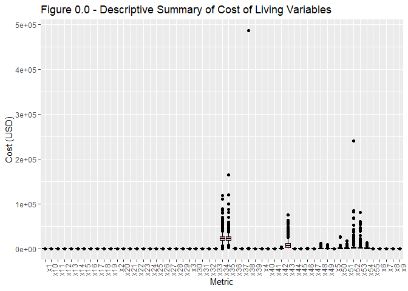
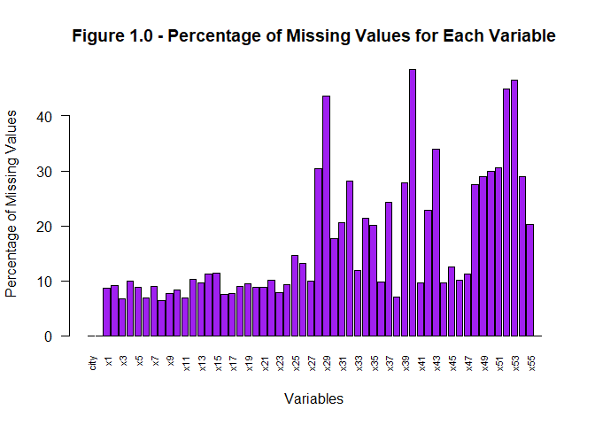
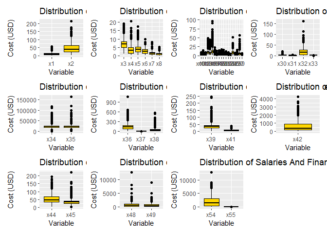

Cost of Living - EDA
================
Jade Meneghini
February 2024

In this analysis, the costs of living worldwide is explored. The data
has been scraped from [Numbeo](https://www.numbeo.com/) and can be found
on
[Kaggle](https://www.kaggle.com/datasets/mvieira101/global-cost-of-living/data?select=cost-of-living_v2.csv).
The primary goal of this analysis is to gain familiarity and identify
issues with the data provided that could impact analysis.

``` r
#Select the local working directory
proj_directory <- "C:/Users/jadem/OneDrive/Desktop/BABD/Statistics/PersoProject/Statistics_Project/Code"
setwd(proj_directory)

#load packages
library(tidyverse)
```

    ## Warning: package 'ggplot2' was built under R version 4.3.3

    ## ── Attaching core tidyverse packages ──────────────────────── tidyverse 2.0.0 ──
    ## ✔ dplyr     1.1.4     ✔ readr     2.1.5
    ## ✔ forcats   1.0.0     ✔ stringr   1.5.1
    ## ✔ ggplot2   3.5.0     ✔ tibble    3.2.1
    ## ✔ lubridate 1.9.3     ✔ tidyr     1.3.1
    ## ✔ purrr     1.0.2     
    ## ── Conflicts ────────────────────────────────────────── tidyverse_conflicts() ──
    ## ✖ dplyr::filter() masks stats::filter()
    ## ✖ dplyr::lag()    masks stats::lag()
    ## ℹ Use the conflicted package (<http://conflicted.r-lib.org/>) to force all conflicts to become errors

``` r
library(dplyr)
library(ggplot2)
```

#### Load Data:

``` r
#Import data from local .csv
col_data <- read.csv("C:/Users/jadem/OneDrive/Desktop/BABD/Statistics/PersoProject/Statistics_Project/Data/cost-of-living_v2.csv")
```

# Exploratory data analysis

## Summary

Let’s look at what the data set looks like:

``` r
str(col_data)
```

    ## 'data.frame':    4956 obs. of  58 variables:
    ##  $ city        : chr  "Weifang" "Heze" "Yantai" "Huanggang" ...
    ##  $ country     : chr  "China" "China" "China" "China" ...
    ##  $ x1          : num  2.85 NaN 2.85 NaN 2.14 2.85 2.35 NaN 2.85 2.99 ...
    ##  $ x2          : num  14.2 NaN 22.8 NaN 14.1 ...
    ##  $ x3          : num  5.34 4.98 4.98 NaN 3.91 4.27 4.48 5.12 4.98 4.7 ...
    ##  $ x4          : num  1.14 NaN 1.14 NaN 1.42 0.85 NaN NaN 0.71 0.85 ...
    ##  $ x5          : num  2.14 NaN 2.14 NaN 4.98 2.85 2.85 NaN NaN 2.14 ...
    ##  $ x6          : num  3.46 4.27 3.56 NaN 3.56 3.56 4.02 2.28 4.27 3.08 ...
    ##  $ x7          : num  0.71 0.5 0.45 NaN 0.43 0.36 0.65 0.45 0.69 0.43 ...
    ##  $ x8          : num  0.28 0.25 0.28 NaN 0.28 0.27 0.3 0.28 0.28 0.28 ...
    ##  $ x9          : num  1.78 1.78 1.78 NaN 2.46 1.83 1.57 1.35 1.42 2.04 ...
    ##  $ x10         : num  1.07 2.53 1.19 NaN 1.71 1.36 1.67 NaN 1 1.16 ...
    ##  $ x11         : num  1 1.82 0.78 NaN 0.71 0.71 1.28 0.43 0.71 0.82 ...
    ##  $ x12         : num  NaN 0.85 NaN NaN 2.73 1.37 1.34 2.9 NaN 1.37 ...
    ##  $ x13         : num  8.54 11.39 8.54 NaN NaN ...
    ##  $ x14         : num  3.13 3.13 3.46 NaN 3.56 3.63 5.79 NaN NaN 4.19 ...
    ##  $ x15         : num  8.54 22.78 15.66 NaN 15.66 ...
    ##  $ x16         : num  1.14 2.28 1.92 NaN 0.85 1.14 2.28 NaN 1.14 1.29 ...
    ##  $ x17         : num  NaN NaN NaN NaN 0.96 1.14 0.71 NaN NaN 1.61 ...
    ##  $ x18         : num  1.14 NaN 1.78 NaN 1.42 1 2.18 NaN 1.42 1.37 ...
    ##  $ x19         : num  0.85 NaN 1.35 NaN 1.14 0.71 1.14 NaN 0.57 1.27 ...
    ##  $ x20         : num  0.71 1.99 1.19 NaN 0.71 0.57 0.5 NaN 0.43 0.66 ...
    ##  $ x21         : num  0.57 NaN 0.71 NaN 0.28 0.71 1.42 NaN 0.57 0.54 ...
    ##  $ x22         : num  0.43 1.42 0.5 NaN 0.71 0.47 0.81 NaN NaN 0.45 ...
    ##  $ x23         : num  0.57 0.85 0.57 NaN 0.43 0.43 0.59 NaN 0.28 0.55 ...
    ##  $ x24         : num  5.69 10.68 5.69 NaN NaN ...
    ##  $ x25         : num  0.71 1.14 0.8 NaN 0.62 0.74 1.14 0.71 1.42 0.65 ...
    ##  $ x26         : num  1.85 2.56 1.85 NaN 0.71 2.04 1.42 NaN 2.14 1.71 ...
    ##  $ x27         : num  2.85 2.85 3.84 NaN 4.27 3.56 3.27 2.14 2.85 2.28 ...
    ##  $ x28         : num  NaN NaN NaN NaN NaN 0.28 NaN NaN NaN NaN ...
    ##  $ x29         : num  NaN NaN NaN NaN NaN 8.67 NaN NaN NaN NaN ...
    ##  $ x30         : num  NaN NaN NaN NaN 2.85 0.85 1.64 NaN NaN 1.42 ...
    ##  $ x31         : num  0.23 0.57 0.28 NaN 0.28 0.36 0.36 0.28 0.28 0.28 ...
    ##  $ x32         : num  4.56 NaN 2.85 NaN 2.56 2.73 7.12 3.42 NaN 4.27 ...
    ##  $ x33         : num  1.16 NaN 1.16 NaN 1.16 1.19 1.3 NaN NaN 1.16 ...
    ##  $ x34         : num  20286 NaN 20286 NaN 21182 ...
    ##  $ x35         : num  16727 NaN 16727 NaN 16769 ...
    ##  $ x36         : num  45.8 92.5 45.8 NaN 31.8 ...
    ##  $ x37         : num  0.03 NaN 0.04 NaN 0.01 0.02 0.01 NaN NaN 0.02 ...
    ##  $ x38         : num  6.41 14.24 14.24 NaN 6.41 ...
    ##  $ x39         : num  NaN NaN NaN 54.1 NaN ...
    ##  $ x40         : num  NaN NaN NaN NaN NaN ...
    ##  $ x41         : num  5.69 4.98 6.83 NaN 5.55 4.98 5.69 4.98 5.69 7.12 ...
    ##  $ x42         : num  NaN NaN NaN NaN 1851 ...
    ##  $ x43         : num  24200 NaN 24200 NaN 28471 ...
    ##  $ x44         : num  41 71.2 78.3 NaN 56.9 ...
    ##  $ x45         : num  37.7 NaN 37.7 NaN 32 ...
    ##  $ x46         : num  78.3 74.7 78.3 NaN 128.1 ...
    ##  $ x47         : num  85.4 NaN 85.4 NaN 64.1 ...
    ##  $ x48         : num  NaN NaN NaN NaN 142 ...
    ##  $ x49         : num  NaN NaN NaN NaN 71.2 ...
    ##  $ x50         : num  NaN NaN NaN NaN 285 ...
    ##  $ x51         : num  NaN NaN NaN NaN 214 ...
    ##  $ x52         : num  NaN NaN NaN NaN NaN NaN NaN NaN NaN NaN ...
    ##  $ x53         : num  NaN NaN NaN NaN NaN NaN NaN NaN NaN NaN ...
    ##  $ x54         : num  NaN NaN NaN NaN NaN NaN NaN NaN NaN NaN ...
    ##  $ x55         : num  4.5 NaN 4.5 NaN 4.65 5.33 4.18 NaN NaN 5 ...
    ##  $ data_quality: int  0 0 0 0 0 0 0 0 0 0 ...

We already see that there are some missing data and that the majority of
our variables are numerical (expected as most variables refer to the
cost of a good or service in USD).

``` r
dim(col_data)
```

    ## [1] 4956   58

``` r
length(unique(col_data$country))
```

    ## [1] 215

With this we can see that the raw data has 4956 rows (observations) and
58 columns (variables). The observations correspond to 215 distinct
countries.

Let’s look at the columns descriptive summary now:

``` r
summary(col_data)
```

    ##      city             country                x1              x2        
    ##  Length:4956        Length:4956        Min.   : 0.45   Min.   :  3.25  
    ##  Class :character   Class :character   1st Qu.: 4.31   1st Qu.: 22.44  
    ##  Mode  :character   Mode  :character   Median : 9.60   Median : 40.00  
    ##                                        Mean   :10.35   Mean   : 43.36  
    ##                                        3rd Qu.:15.00   3rd Qu.: 60.00  
    ##                                        Max.   :57.14   Max.   :213.69  
    ##                                        NA's   :428     NA's   :451     
    ##        x3              x4              x5               x6        
    ##  Min.   : 1.08   Min.   : 0.33   Min.   : 0.310   Min.   : 0.220  
    ##  1st Qu.: 4.98   1st Qu.: 1.60   1st Qu.: 2.200   1st Qu.: 1.580  
    ##  Median : 6.99   Median : 3.00   Median : 3.690   Median : 2.630  
    ##  Mean   : 6.93   Mean   : 3.38   Mean   : 3.942   Mean   : 2.755  
    ##  3rd Qu.: 8.50   3rd Qu.: 5.00   3rd Qu.: 5.270   3rd Qu.: 3.770  
    ##  Max.   :22.13   Max.   :20.60   Max.   :17.500   Max.   :10.000  
    ##  NA's   :334     NA's   :496     NA's   :440      NA's   :344     
    ##        x7              x8             x9             x10       
    ##  Min.   :0.110   Min.   :0.07   Min.   :0.260   Min.   :0.050  
    ##  1st Qu.:0.770   1st Qu.:0.48   1st Qu.:0.830   1st Qu.:0.780  
    ##  Median :1.480   Median :1.05   Median :1.045   Median :1.320  
    ##  Mean   :1.524   Mean   :1.12   Mean   :1.149   Mean   :1.613  
    ##  3rd Qu.:2.110   3rd Qu.:1.58   3rd Qu.:1.320   3rd Qu.:2.200  
    ##  Max.   :8.000   Max.   :5.85   Max.   :6.810   Max.   :8.820  
    ##  NA's   :445     NA's   :316    NA's   :378     NA's   :413    
    ##       x11              x12             x13              x14        
    ##  Min.   : 0.250   Min.   :0.100   Min.   : 0.900   Min.   : 1.220  
    ##  1st Qu.: 1.050   1st Qu.:1.570   1st Qu.: 6.150   1st Qu.: 4.013  
    ##  Median : 1.690   Median :2.140   Median : 8.800   Median : 6.140  
    ##  Mean   : 2.187   Mean   :2.353   Mean   : 9.498   Mean   : 7.170  
    ##  3rd Qu.: 2.740   3rd Qu.:2.970   3rd Qu.:11.838   3rd Qu.: 9.210  
    ##  Max.   :15.430   Max.   :9.760   Max.   :48.950   Max.   :44.090  
    ##  NA's   :343      NA's   :507     NA's   :478      NA's   :558     
    ##       x15             x16              x17              x18        
    ##  Min.   : 1.47   Min.   : 0.270   Min.   : 0.220   Min.   : 0.200  
    ##  1st Qu.: 7.24   1st Qu.: 1.460   1st Qu.: 1.100   1st Qu.: 1.210  
    ##  Median :10.25   Median : 2.270   Median : 1.420   Median : 1.890  
    ##  Mean   :11.72   Mean   : 2.749   Mean   : 1.555   Mean   : 2.362  
    ##  3rd Qu.:14.31   3rd Qu.: 3.590   3rd Qu.: 1.820   3rd Qu.: 3.060  
    ##  Max.   :96.16   Max.   :22.740   Max.   :20.390   Max.   :15.360  
    ##  NA's   :566     NA's   :372      NA's   :381      NA's   :441     
    ##       x19             x20              x21              x22       
    ##  Min.   : 0.12   Min.   : 0.110   Min.   : 0.110   Min.   :0.080  
    ##  1st Qu.: 1.19   1st Qu.: 0.740   1st Qu.: 0.740   1st Qu.:0.710  
    ##  Median : 2.14   Median : 1.210   Median : 1.170   Median :1.050  
    ##  Mean   : 2.56   Mean   : 1.566   Mean   : 1.522   Mean   :1.227  
    ##  3rd Qu.: 3.57   3rd Qu.: 2.100   3rd Qu.: 2.110   3rd Qu.:1.630  
    ##  Max.   :17.64   Max.   :15.870   Max.   :12.220   Max.   :9.250  
    ##  NA's   :469     NA's   :437      NA's   :433      NA's   :501    
    ##       x23              x24              x25             x26        
    ##  Min.   :0.1100   Min.   : 0.360   Min.   :0.250   Min.   : 0.360  
    ##  1st Qu.:0.4900   1st Qu.: 5.270   1st Qu.:0.990   1st Qu.: 1.490  
    ##  Median :0.7600   Median : 7.805   Median :1.430   Median : 2.110  
    ##  Mean   :0.9868   Mean   : 8.643   Mean   :1.658   Mean   : 2.311  
    ##  3rd Qu.:1.3900   3rd Qu.:11.440   3rd Qu.:2.140   3rd Qu.: 2.870  
    ##  Max.   :5.0000   Max.   :51.950   Max.   :7.670   Max.   :15.670  
    ##  NA's   :388      NA's   :462      NA's   :721     NA's   :655     
    ##       x27              x28              x29              x30        
    ##  Min.   : 0.450   Min.   : 0.000   Min.   :  0.00   Min.   : 0.140  
    ##  1st Qu.: 3.050   1st Qu.: 0.480   1st Qu.: 18.03   1st Qu.: 1.080  
    ##  Median : 5.270   Median : 1.160   Median : 35.00   Median : 2.500  
    ##  Mean   : 6.285   Mean   : 1.517   Mean   : 43.98   Mean   : 2.765  
    ##  3rd Qu.: 8.430   3rd Qu.: 2.208   3rd Qu.: 60.52   3rd Qu.: 3.690  
    ##  Max.   :57.140   Max.   :13.000   Max.   :369.86   Max.   :50.000  
    ##  NA's   :490      NA's   :1506     NA's   :2166     NA's   :873     
    ##       x31             x32              x33             x34        
    ##  Min.   :0.090   Min.   :  0.16   Min.   :0.030   Min.   :     0  
    ##  1st Qu.:0.530   1st Qu.:  4.79   1st Qu.:1.080   1st Qu.: 18596  
    ##  Median :1.130   Median : 12.64   Median :1.280   Median : 22921  
    ##  Mean   :1.232   Mean   : 17.18   Mean   :1.362   Mean   : 23781  
    ##  3rd Qu.:1.710   3rd Qu.: 25.58   3rd Qu.:1.710   3rd Qu.: 26821  
    ##  Max.   :5.990   Max.   :160.64   Max.   :3.700   Max.   :118751  
    ##  NA's   :1022    NA's   :1396     NA's   :588     NA's   :1058    
    ##       x35              x36               x37             x38          
    ##  Min.   :  3213   Min.   :   6.07   Min.   :0.000   Min.   :     1.4  
    ##  1st Qu.: 19366   1st Qu.:  68.78   1st Qu.:0.050   1st Qu.:    18.8  
    ##  Median : 22538   Median : 128.09   Median :0.100   Median :    34.4  
    ##  Mean   : 23878   Mean   : 136.25   Mean   :0.136   Mean   :   146.3  
    ##  3rd Qu.: 26944   3rd Qu.: 185.00   3rd Qu.:0.190   3rd Qu.:    58.0  
    ##  Max.   :164540   Max.   :1066.67   Max.   :1.230   Max.   :485991.8  
    ##  NA's   :995      NA's   :488       NA's   :1201    NA's   :349       
    ##       x39              x40              x41              x42         
    ##  Min.   :  0.00   Min.   :  0.00   Min.   : 0.680   Min.   :   4.07  
    ##  1st Qu.: 22.54   1st Qu.:  8.00   1st Qu.: 4.810   1st Qu.: 136.62  
    ##  Median : 33.18   Median : 13.55   Median : 8.190   Median : 302.95  
    ##  Mean   : 36.85   Mean   : 15.78   Mean   : 8.366   Mean   : 489.58  
    ##  3rd Qu.: 45.00   3rd Qu.: 21.07   3rd Qu.:11.740   3rd Qu.: 676.01  
    ##  Max.   :553.22   Max.   :104.42   Max.   :39.910   Max.   :4250.00  
    ##  NA's   :1375     NA's   :2400     NA's   :475      NA's   :1132     
    ##       x43             x44              x45              x46        
    ##  Min.   :    0   Min.   :  4.07   Min.   :  0.00   Min.   :  8.03  
    ##  1st Qu.: 3161   1st Qu.: 35.00   1st Qu.: 26.34   1st Qu.: 61.90  
    ##  Median : 6325   Median : 48.04   Median : 33.13   Median : 75.00  
    ##  Mean   : 8771   Mean   : 52.62   Mean   : 35.04   Mean   : 77.00  
    ##  3rd Qu.:12000   3rd Qu.: 68.49   3rd Qu.: 41.51   3rd Qu.: 88.67  
    ##  Max.   :75000   Max.   :192.00   Max.   :219.38   Max.   :923.12  
    ##  NA's   :1681    NA's   :479      NA's   :617      NA's   :503     
    ##       x47              x48               x49              x50          
    ##  Min.   :  7.60   Min.   :   21.7   Min.   :  12.2   Min.   :   61.51  
    ##  1st Qu.: 58.43   1st Qu.:  256.2   1st Qu.: 171.1   1st Qu.:  465.20  
    ##  Median : 84.26   Median :  526.9   Median : 403.9   Median :  921.08  
    ##  Mean   : 85.98   Mean   :  711.6   Mean   : 560.2   Mean   : 1253.98  
    ##  3rd Qu.:106.77   3rd Qu.:  992.6   3rd Qu.: 790.3   3rd Qu.: 1710.22  
    ##  Max.   :542.74   Max.   :12608.8   Max.   :8989.4   Max.   :27397.38  
    ##  NA's   :553      NA's   :1363      NA's   :1431     NA's   :1480      
    ##       x51                x52              x53                x54       
    ##  Min.   :   27.12   Min.   :   111   Min.   :   49.24   Min.   :   18  
    ##  1st Qu.:  325.71   1st Qu.:  1120   1st Qu.:  790.31   1st Qu.:  479  
    ##  Median :  712.83   Median :  2107   Median : 1580.62   Median : 1291  
    ##  Mean   :  974.08   Mean   :  3235   Mean   : 2341.93   Mean   : 1821  
    ##  3rd Qu.: 1369.87   3rd Qu.:  3843   3rd Qu.: 2798.25   3rd Qu.: 2771  
    ##  Max.   :17868.18   Max.   :240964   Max.   :80321.22   Max.   :12821  
    ##  NA's   :1512       NA's   :2227     NA's   :2303       NA's   :1432   
    ##       x55          data_quality   
    ##  Min.   : 0.780   Min.   :0.0000  
    ##  1st Qu.: 3.000   1st Qu.:0.0000  
    ##  Median : 5.200   Median :0.0000  
    ##  Mean   : 6.518   Mean   :0.1862  
    ##  3rd Qu.: 8.330   3rd Qu.:0.0000  
    ##  Max.   :61.330   Max.   :1.0000  
    ##  NA's   :1006

As it stands it is hard to understand the meaning of these variables, so
let’s visualize it using a boxplot:

``` r
col_data_long <- gather(col_data, key = "metric", value = "value", -city, -country, -data_quality)

ggplot(col_data_long, aes(x = metric, y = value)) +
  geom_boxplot(fill = "pink", color = "black") +
  labs(title = "Figure 0.0 - Descriptive Summary of Cost of Living Variables",
       x = "Metric", y = "Cost (USD)")+
  theme(axis.text.x = element_text(angle = 90, hjust = 1))
```

    ## Warning: Removed 45858 rows containing non-finite outside the scale range
    ## (`stat_boxplot()`).

<!-- -->

From Figure 0.0 we can tell that some variables have considerably
different cost ranges, particularly variables x35, x38 and x52. We also
have a warning message about non-finite values. Lastly it is hard to
understand the different cost ranges as we have little to no insight on
the meaning of each variable.

## Index table

Let’s create an index table explaining the meaning of each variable
label:

``` r
index_table <- data.frame(
  column_name = c("city", "country", paste0("x", 1:55), "data_quality"), 
  description = c("Name of the city","Name of the country",
                  "Meal, Inexpensive Restaurant","Meal for 2 People, Mid-range Restaurant, Three-course",
                  "McMeal at McDonalds","Domestic Beer (0.5 l draught, in restaurants)",
                  "Imported Beer (0.33 l, in restaurants)","Cappuccino (regular, in restaurants)",
                  "Coke/Pepsi (0.33 l, in restaurants)","Water (0.33 l, in restaurants)",
                  "Milk (1l)","Loaf of Fresh White Bread (500g)",
                  "Rice (white), (1kg)","Eggs (12)",
                  "Local Cheese (1kg)","Chicken Fillets (1kg)",
                  "Beef Round (1kg)", "Apples (1kg)",
                  "Banana (1kg)", "Oranges (1kg)",
                  "Tomato (1kg)","Potato (1kg)",
                  "Onion (1kg)","Lettuce (1 head)",
                  "Water (1.5 l, at the market)","Bottle of Wine (Mid-Range, at the market)",
                  "Domestic Beer (0.5 l, at the market)","Imported Beer (0.33 l, at the market)",
                  "Cigarettes 20 Pack (Marlboro)","One-way Ticket (Local Transport)",
                  "Monthly Pass (Regular Price)","Taxi Start (Normal Tariff)",
                  "Taxi 1km (Normal Tariff)","Taxi 1hour Waiting (Normal Tariff)",
                  "Gasoline (1 l)","Volkswagen Golf 1.4 90 KW Trendline",
                  "Toyota Corolla Sedan 1.6l 97kW Comfort","Basic (Electricity, Heating, Cooling, Water, Garbage) for 85m2 Apartment",
                  "1 min. of Prepaid Mobile Tariff Local","Internet (60 Mbps or More, Unlimited Data, Cable/ADSL)",
                  "Fitness Club, Monthly Fee for 1 Adult","Tennis Court Rent (1 Hour on Weekend)",
                  "Cinema, International Release, 1 Seat","Preschool, Full Day, Private, Monthly for 1 Child",
                  "International Primary School, Yearly for 1 Child", "1 Pair of Jeans",
                  "1 Summer Dress in a Chain Store (Zara, H&M, ecc)","1 Pair of Nike Running Shoes",
                  "1 Pair of Men Leather Business Shoes","Apartment (1 bedroom) in City Centre",
                  "Apartment (1 bedroom) Outside of Centre","Apartment (3 bedrooms) in City Centre",
                  "Apartment (3 bedrooms) Outside of Centre","Price per Square Meter to Buy Apartment in City Centre",
                  "Price per Square Meter to Buy Apartment Outside of Centre","Average Monthly Net Salary (After Tax)",
                  "Mortgage Interest Rate in Percentages (%), Yearly, for 20 Years Fixed-Rate", "0 if Numbeo considers that more contributors are needed to increase data quality, else 1"))
print(index_table)
```

    ##     column_name
    ## 1          city
    ## 2       country
    ## 3            x1
    ## 4            x2
    ## 5            x3
    ## 6            x4
    ## 7            x5
    ## 8            x6
    ## 9            x7
    ## 10           x8
    ## 11           x9
    ## 12          x10
    ## 13          x11
    ## 14          x12
    ## 15          x13
    ## 16          x14
    ## 17          x15
    ## 18          x16
    ## 19          x17
    ## 20          x18
    ## 21          x19
    ## 22          x20
    ## 23          x21
    ## 24          x22
    ## 25          x23
    ## 26          x24
    ## 27          x25
    ## 28          x26
    ## 29          x27
    ## 30          x28
    ## 31          x29
    ## 32          x30
    ## 33          x31
    ## 34          x32
    ## 35          x33
    ## 36          x34
    ## 37          x35
    ## 38          x36
    ## 39          x37
    ## 40          x38
    ## 41          x39
    ## 42          x40
    ## 43          x41
    ## 44          x42
    ## 45          x43
    ## 46          x44
    ## 47          x45
    ## 48          x46
    ## 49          x47
    ## 50          x48
    ## 51          x49
    ## 52          x50
    ## 53          x51
    ## 54          x52
    ## 55          x53
    ## 56          x54
    ## 57          x55
    ## 58 data_quality
    ##                                                                                 description
    ## 1                                                                          Name of the city
    ## 2                                                                       Name of the country
    ## 3                                                              Meal, Inexpensive Restaurant
    ## 4                                     Meal for 2 People, Mid-range Restaurant, Three-course
    ## 5                                                                       McMeal at McDonalds
    ## 6                                             Domestic Beer (0.5 l draught, in restaurants)
    ## 7                                                    Imported Beer (0.33 l, in restaurants)
    ## 8                                                      Cappuccino (regular, in restaurants)
    ## 9                                                       Coke/Pepsi (0.33 l, in restaurants)
    ## 10                                                           Water (0.33 l, in restaurants)
    ## 11                                                                                Milk (1l)
    ## 12                                                         Loaf of Fresh White Bread (500g)
    ## 13                                                                      Rice (white), (1kg)
    ## 14                                                                                Eggs (12)
    ## 15                                                                       Local Cheese (1kg)
    ## 16                                                                    Chicken Fillets (1kg)
    ## 17                                                                         Beef Round (1kg)
    ## 18                                                                             Apples (1kg)
    ## 19                                                                             Banana (1kg)
    ## 20                                                                            Oranges (1kg)
    ## 21                                                                             Tomato (1kg)
    ## 22                                                                             Potato (1kg)
    ## 23                                                                              Onion (1kg)
    ## 24                                                                         Lettuce (1 head)
    ## 25                                                             Water (1.5 l, at the market)
    ## 26                                                Bottle of Wine (Mid-Range, at the market)
    ## 27                                                     Domestic Beer (0.5 l, at the market)
    ## 28                                                    Imported Beer (0.33 l, at the market)
    ## 29                                                            Cigarettes 20 Pack (Marlboro)
    ## 30                                                         One-way Ticket (Local Transport)
    ## 31                                                             Monthly Pass (Regular Price)
    ## 32                                                               Taxi Start (Normal Tariff)
    ## 33                                                                 Taxi 1km (Normal Tariff)
    ## 34                                                       Taxi 1hour Waiting (Normal Tariff)
    ## 35                                                                           Gasoline (1 l)
    ## 36                                                      Volkswagen Golf 1.4 90 KW Trendline
    ## 37                                                   Toyota Corolla Sedan 1.6l 97kW Comfort
    ## 38                 Basic (Electricity, Heating, Cooling, Water, Garbage) for 85m2 Apartment
    ## 39                                                    1 min. of Prepaid Mobile Tariff Local
    ## 40                                   Internet (60 Mbps or More, Unlimited Data, Cable/ADSL)
    ## 41                                                    Fitness Club, Monthly Fee for 1 Adult
    ## 42                                                    Tennis Court Rent (1 Hour on Weekend)
    ## 43                                                    Cinema, International Release, 1 Seat
    ## 44                                        Preschool, Full Day, Private, Monthly for 1 Child
    ## 45                                         International Primary School, Yearly for 1 Child
    ## 46                                                                          1 Pair of Jeans
    ## 47                                         1 Summer Dress in a Chain Store (Zara, H&M, ecc)
    ## 48                                                             1 Pair of Nike Running Shoes
    ## 49                                                     1 Pair of Men Leather Business Shoes
    ## 50                                                     Apartment (1 bedroom) in City Centre
    ## 51                                                  Apartment (1 bedroom) Outside of Centre
    ## 52                                                    Apartment (3 bedrooms) in City Centre
    ## 53                                                 Apartment (3 bedrooms) Outside of Centre
    ## 54                                   Price per Square Meter to Buy Apartment in City Centre
    ## 55                                Price per Square Meter to Buy Apartment Outside of Centre
    ## 56                                                   Average Monthly Net Salary (After Tax)
    ## 57               Mortgage Interest Rate in Percentages (%), Yearly, for 20 Years Fixed-Rate
    ## 58 0 if Numbeo considers that more contributors are needed to increase data quality, else 1

## Missing Values

``` r
sum(is.na(col_data))
```

    ## [1] 45858

We can see that there are 45858 missing values to manage. From our index
table we also know that each observation is assigned a data quality
score (0 data values are missing, 1 no values are missing). Before
taking any decision about how we’ll manage the missing values, let’s
look into the percentage of missing data variable by variable:

``` r
AAA <- colSums(is.na(col_data))
tot <- nrow(col_data)
percent_AAA <- (AAA / tot) * 100
barplot(percent_AAA
        , main = "Figure 1.0 - Percentage of Missing Values for Each Variable"
        , xlab = "Variables"
        , ylab = "Percentage of Missing Values"
        , col = "purple"
        , border = "black"
        , names.arg = colnames(col_data)
        , las = 2
        , cex.names = 0.7)
```

<!-- -->

Knowing that imputation is discouraged for variables with missing data,
let’s fix the threshold for “too much data missing” at +30% of data
missing:

- x28 =\> 30% One-way Ticket (Local Transport)
- x29 =\> 44% Monthly Pass (Transport)
- x40 =\> 48% Tennis Court Rent
- x43 =\> 33% International Primary School, Yearly for 1 Child
- x51 =\> 30% Apartment (3 bedrooms) Outside of Centre
- x52 =\> 44% Price per Square Meter to Buy Apartment in City Centre
- x53 =\> 46% Price per Square Meter to Buy Apartment Outside of Centre

If removing the above values, variable x50 (29.8%) Apartment (3
bedrooms) in City Centre has no longer meaning.

## Data Imputation

To solve the missing data issue, we opted with imputation with the mean.
To reduce the bias, instead of imputing with the variable overall mean,
the individual country mean was used.

``` r
col_imputed_country <- col_data
col_imputed_country <- col_imputed_country %>%
  group_by(country) %>%
  mutate(across(where(is.numeric), ~ifelse(is.na(.), mean(., na.rm = TRUE), .)))
```

Now drop the rows with remaining missing values and variables with over
30% of missing values.

We can attribute the missing rows to smaller cities for which there
wasn’t enough data collected. Equally some countries such as Greenland
or city states might simply lack relevant information for certain
variables resulting in missing values.

``` r
col_imputed_na <- na.omit(col_imputed_country)
data <- select(col_imputed_na, -x28, -x29, -x40, -x43, -x50, -x51, -x52, -x53)
print(data)
```

    ## # A tibble: 4,849 × 50
    ## # Groups:   country [153]
    ##    city      country    x1    x2    x3    x4    x5    x6    x7    x8    x9   x10
    ##    <chr>     <chr>   <dbl> <dbl> <dbl> <dbl> <dbl> <dbl> <dbl> <dbl> <dbl> <dbl>
    ##  1 Weifang   China    2.85  14.2  5.34  1.14  2.14  3.46 0.71  0.28   1.78  1.07
    ##  2 Heze      China    3.35  20.9  4.98  1.16  2.52  4.27 0.5   0.25   1.78  2.53
    ##  3 Yantai    China    2.85  22.8  4.98  1.14  2.14  3.56 0.45  0.28   1.78  1.19
    ##  4 Huanggang China    3.35  20.9  5.01  1.16  2.52  3.32 0.466 0.290  1.85  1.57
    ##  5 Maoming   China    2.14  14.1  3.91  1.42  4.98  3.56 0.43  0.28   2.46  1.71
    ##  6 Nanchong  China    2.85  17.1  4.27  0.85  2.85  3.56 0.36  0.27   1.83  1.36
    ##  7 Yulin     China    2.35  21.4  4.48  1.16  2.85  4.02 0.65  0.3    1.57  1.67
    ##  8 Liaocheng China    3.35  20.9  5.12  1.16  2.52  2.28 0.45  0.28   1.35  1.57
    ##  9 Xiangyang China    2.85  17.1  4.98  0.71  2.52  4.27 0.69  0.28   1.42  1   
    ## 10 Dezhou    China    2.99  21.4  4.7   0.85  2.14  3.08 0.43  0.28   2.04  1.16
    ## # ℹ 4,839 more rows
    ## # ℹ 38 more variables: x11 <dbl>, x12 <dbl>, x13 <dbl>, x14 <dbl>, x15 <dbl>,
    ## #   x16 <dbl>, x17 <dbl>, x18 <dbl>, x19 <dbl>, x20 <dbl>, x21 <dbl>,
    ## #   x22 <dbl>, x23 <dbl>, x24 <dbl>, x25 <dbl>, x26 <dbl>, x27 <dbl>,
    ## #   x30 <dbl>, x31 <dbl>, x32 <dbl>, x33 <dbl>, x34 <dbl>, x35 <dbl>,
    ## #   x36 <dbl>, x37 <dbl>, x38 <dbl>, x39 <dbl>, x41 <dbl>, x42 <dbl>,
    ## #   x44 <dbl>, x45 <dbl>, x46 <dbl>, x47 <dbl>, x48 <dbl>, x49 <dbl>, …

Here we go - ‘data’ the final data set we will be working on. Let’s look
at how it compares with the raw data, ‘col_data’.

Missing values:

``` r
sum(is.na(data))
```

    ## [1] 0

No missing values.

``` r
dim(data)
```

    ## [1] 4849   50

The raw data has 4956 rows (observations) and 58 columns (variables). In
comparison ‘data’ has 4849 rows (107 lost) and 50 columns (8 lost).

``` r
length(unique(data$country))
```

    ## [1] 153

‘data’ has 152 distinct countries, 63 less countries than the raw data.

``` r
summary(data)
```

    ##      city             country                x1              x2        
    ##  Length:4849        Length:4849        Min.   : 0.45   Min.   :  3.25  
    ##  Class :character   Class :character   1st Qu.: 4.54   1st Qu.: 22.85  
    ##  Mode  :character   Mode  :character   Median :10.00   Median : 40.00  
    ##                                        Mean   :10.56   Mean   : 43.45  
    ##                                        3rd Qu.:15.56   3rd Qu.: 62.05  
    ##                                        Max.   :57.14   Max.   :213.69  
    ##        x3               x4               x5               x6        
    ##  Min.   : 1.080   Min.   : 0.330   Min.   : 0.310   Min.   : 0.220  
    ##  1st Qu.: 4.980   1st Qu.: 1.600   1st Qu.: 2.230   1st Qu.: 1.580  
    ##  Median : 6.870   Median : 3.070   Median : 3.680   Median : 2.630  
    ##  Mean   : 6.885   Mean   : 3.409   Mean   : 3.937   Mean   : 2.746  
    ##  3rd Qu.: 8.433   3rd Qu.: 5.000   3rd Qu.: 5.270   3rd Qu.: 3.760  
    ##  Max.   :19.230   Max.   :20.600   Max.   :17.500   Max.   :10.000  
    ##        x7              x8              x9             x10       
    ##  Min.   :0.110   Min.   :0.070   Min.   :0.320   Min.   :0.050  
    ##  1st Qu.:0.800   1st Qu.:0.480   1st Qu.:0.840   1st Qu.:0.810  
    ##  Median :1.500   Median :1.050   Median :1.030   Median :1.370  
    ##  Mean   :1.552   Mean   :1.119   Mean   :1.133   Mean   :1.656  
    ##  3rd Qu.:2.186   3rd Qu.:1.600   3rd Qu.:1.280   3rd Qu.:2.320  
    ##  Max.   :8.000   Max.   :5.340   Max.   :6.810   Max.   :8.820  
    ##       x11              x12             x13             x14        
    ##  Min.   : 0.250   Min.   :0.100   Min.   : 0.90   Min.   : 1.220  
    ##  1st Qu.: 1.070   1st Qu.:1.610   1st Qu.: 6.25   1st Qu.: 4.120  
    ##  Median : 1.700   Median :2.220   Median : 8.82   Median : 6.430  
    ##  Mean   : 2.199   Mean   :2.388   Mean   : 9.56   Mean   : 7.397  
    ##  3rd Qu.: 2.780   3rd Qu.:3.110   3rd Qu.:11.96   3rd Qu.: 9.900  
    ##  Max.   :15.430   Max.   :9.760   Max.   :48.95   Max.   :44.090  
    ##       x15              x16              x17              x18        
    ##  Min.   : 1.470   Min.   : 0.270   Min.   : 0.220   Min.   : 0.200  
    ##  1st Qu.: 7.387   1st Qu.: 1.480   1st Qu.: 1.100   1st Qu.: 1.224  
    ##  Median :10.740   Median : 2.280   Median : 1.420   Median : 1.895  
    ##  Mean   :11.887   Mean   : 2.744   Mean   : 1.549   Mean   : 2.374  
    ##  3rd Qu.:14.604   3rd Qu.: 3.620   3rd Qu.: 1.790   3rd Qu.: 3.100  
    ##  Max.   :96.160   Max.   :22.740   Max.   :13.780   Max.   :15.360  
    ##       x19              x20              x21              x22       
    ##  Min.   : 0.120   Min.   : 0.110   Min.   : 0.110   Min.   :0.080  
    ##  1st Qu.: 1.230   1st Qu.: 0.750   1st Qu.: 0.750   1st Qu.:0.710  
    ##  Median : 2.160   Median : 1.220   Median : 1.190   Median :1.050  
    ##  Mean   : 2.562   Mean   : 1.573   Mean   : 1.532   Mean   :1.218  
    ##  3rd Qu.: 3.630   3rd Qu.: 2.110   3rd Qu.: 2.150   3rd Qu.:1.640  
    ##  Max.   :17.640   Max.   :15.870   Max.   :12.220   Max.   :9.250  
    ##       x23             x24              x25             x26        
    ##  Min.   :0.110   Min.   : 0.360   Min.   :0.250   Min.   : 0.360  
    ##  1st Qu.:0.500   1st Qu.: 5.270   1st Qu.:1.020   1st Qu.: 1.530  
    ##  Median :0.760   Median : 7.832   Median :1.505   Median : 2.140  
    ##  Mean   :0.995   Mean   : 8.630   Mean   :1.710   Mean   : 2.341  
    ##  3rd Qu.:1.420   3rd Qu.:11.590   3rd Qu.:2.320   3rd Qu.: 3.000  
    ##  Max.   :5.000   Max.   :51.950   Max.   :7.670   Max.   :15.670  
    ##       x27              x30              x31             x32         
    ##  Min.   : 0.450   Min.   : 0.140   Min.   :0.090   Min.   :  0.160  
    ##  1st Qu.: 3.020   1st Qu.: 1.150   1st Qu.:0.570   1st Qu.:  4.999  
    ##  Median : 5.270   Median : 2.620   Median :1.230   Median : 15.000  
    ##  Mean   : 6.276   Mean   : 2.767   Mean   :1.254   Mean   : 17.733  
    ##  3rd Qu.: 8.436   3rd Qu.: 3.639   3rd Qu.:1.660   3rd Qu.: 27.726  
    ##  Max.   :57.140   Max.   :21.070   Max.   :5.340   Max.   :160.640  
    ##       x33             x34              x35              x36         
    ##  Min.   :0.030   Min.   :     0   Min.   :  3213   Min.   :   6.17  
    ##  1st Qu.:1.100   1st Qu.: 18800   1st Qu.: 19647   1st Qu.:  68.40  
    ##  Median :1.260   Median : 23195   Median : 23138   Median : 128.55  
    ##  Mean   :1.362   Mean   : 23892   Mean   : 23962   Mean   : 135.88  
    ##  3rd Qu.:1.710   3rd Qu.: 26344   3rd Qu.: 26344   3rd Qu.: 182.20  
    ##  Max.   :2.770   Max.   :118751   Max.   :164540   Max.   :1066.67  
    ##       x37               x38              x39              x41        
    ##  Min.   :0.00000   Min.   :  1.36   Min.   :  2.24   Min.   : 0.680  
    ##  1st Qu.:0.05943   1st Qu.: 18.82   1st Qu.: 24.26   1st Qu.: 4.800  
    ##  Median :0.12656   Median : 34.03   Median : 35.00   Median : 8.170  
    ##  Mean   :0.14032   Mean   : 40.33   Mean   : 36.64   Mean   : 8.339  
    ##  3rd Qu.:0.18250   3rd Qu.: 57.62   3rd Qu.: 42.71   3rd Qu.:11.854  
    ##  Max.   :1.12000   Max.   :568.99   Max.   :246.08   Max.   :39.910  
    ##       x42               x44              x45              x46        
    ##  Min.   :   4.07   Min.   :  4.07   Min.   :  4.29   Min.   : 12.20  
    ##  1st Qu.: 158.06   1st Qu.: 35.65   1st Qu.: 26.64   1st Qu.: 62.04  
    ##  Median : 337.21   Median : 48.00   Median : 33.78   Median : 75.52  
    ##  Mean   : 539.35   Mean   : 52.66   Mean   : 35.22   Mean   : 77.06  
    ##  3rd Qu.: 889.38   3rd Qu.: 68.56   3rd Qu.: 40.84   3rd Qu.: 87.48  
    ##  Max.   :4250.00   Max.   :192.00   Max.   :219.38   Max.   :923.12  
    ##       x47              x48               x49              x54         
    ##  Min.   :  7.60   Min.   :   21.7   Min.   :  12.2   Min.   :   18.0  
    ##  1st Qu.: 59.67   1st Qu.:  263.8   1st Qu.: 181.8   1st Qu.:  468.8  
    ##  Median : 84.30   Median :  550.0   Median : 429.9   Median : 1416.9  
    ##  Mean   : 86.02   Mean   :  722.6   Mean   : 579.0   Mean   : 1908.6  
    ##  3rd Qu.:106.67   3rd Qu.: 1056.1   3rd Qu.: 900.0   3rd Qu.: 3071.3  
    ##  Max.   :542.74   Max.   :12608.8   Max.   :8989.4   Max.   :12821.4  
    ##       x55          data_quality   
    ##  Min.   : 0.780   Min.   :0.0000  
    ##  1st Qu.: 3.133   1st Qu.:0.0000  
    ##  Median : 5.144   Median :0.0000  
    ##  Mean   : 6.566   Mean   :0.1891  
    ##  3rd Qu.: 8.330   3rd Qu.:0.0000  
    ##  Max.   :61.330   Max.   :1.0000

Compared to summary(col_data) the distribution and relationships are
impacted as they now pull more towards each country mean, however this
is to be expected due to the imputation that was done.

## Grouping Variables by Shared Topic

Now based on the variable meaning we are able to create a new data
frames that has the variables grouped by similar topics (note:
data_quality will be removed as no longer useful)

``` r
headers                <- data[,1:2]
meal                   <- data[,3:4]
restaurants            <- data[,5:10]
markets                <- data[,11:29]
transportation         <- data[,30:33]
car                    <- data[,34:35]
utilities              <- data[,36:38]
sports_and_leisure     <- data[,39:40]
childcare              <- data[,41]
clothing_and_shoes     <- data[,42:43]
rent_per_month         <- data[,46:47]
salaries_and_financing <- data[,48:49]

meal_avg                   <- round(rowMeans(meal),digits=2)
restaurants_avg            <- round(rowMeans(restaurants), digits=2)
markets_avg                <- round(rowMeans(markets),digits=2)
transportation_avg         <- round(rowMeans(transportation),digits=2)
car_avg                    <- round(rowMeans(car),digits=2)
utilities_avg              <- round(rowMeans(utilities),digits=2)
sports_and_leisure_avg     <- round(rowMeans(sports_and_leisure),digits=2)
childcare_avg              <- round(rowMeans(childcare),digits=2)
clothing_and_shoes_avg     <- round(rowMeans(clothing_and_shoes),digits=2)
rent_per_month_avg         <- round(rowMeans(rent_per_month),digits=2)
salaries_and_financing_avg <- round(rowMeans(salaries_and_financing),digits=2)

final_data <- data.frame(
  Country = headers
  ,Restaurants    = restaurants_avg
  ,Markets        = markets_avg
  ,Transports     = transportation_avg
  ,Car            = car_avg
  ,Utilities      = utilities_avg
  ,Entertainment  = sports_and_leisure_avg
  ,Childcare      = childcare_avg
  ,Clothing       = clothing_and_shoes_avg
  ,MonthlyRent    = rent_per_month_avg
  ,Salaries       = salaries_and_financing_avg
)

print(final_data)
```

    ##                    Country.city             Country.country Restaurants Markets
    ## 1                       Weifang                       China        2.18    2.29
    ## 2                          Heze                       China        2.28    3.84
    ## 3                        Yantai                       China        2.09    2.87
    ## 4                     Huanggang                       China        2.13    3.15
    ## 5                       Maoming                       China        2.43    3.33
    ## 6                      Nanchong                       China        2.03    2.50
    ## 7                         Yulin                       China        2.24    3.25
    ## 8                     Liaocheng                       China        1.97    3.22
    ## 9                     Xiangyang                       China        2.24    2.77
    ## 10                       Dezhou                       China        1.91    3.04
    ## 11                      Taizhou                       China        1.84    3.12
    ## 12                 Pingdingshan                       China        3.61    2.26
    ## 13                     Jiujiang                       China        1.73    2.90
    ## 14                       Anqing                       China        2.10    3.10
    ## 15                       Luzhou                       China        1.83    3.10
    ## 16                     Zhaoqing                       China        2.10    3.10
    ## 17                    Zaozhuang                       China        1.80    2.74
    ## 18                       Anshan                       China        1.72    3.00
    ## 19                      Jiaozuo                       China        1.89    3.16
    ## 20                    Zhenjiang                       China        1.69    2.97
    ## 21                       Urumqi                       China        1.92    2.66
    ## 22                       Rizhao                       China        1.80    2.74
    ## 23                       Baotou                       China        2.73    3.18
    ## 24                       Ankang                       China        2.06    2.76
    ## 25                     Omdurman                       Sudan        2.76    3.11
    ## 26                      Huaibei                       China        2.13    3.15
    ## 27                       Fushun                       China        1.87    2.97
    ## 28                     Yinchuan                       China        2.01    3.97
    ## 29                      Huazhou                       China        2.15    2.94
    ## 30                      Huaiyin                       China        2.59    4.04
    ## 31                       Soweto                South Africa        1.80    1.58
    ## 32                      Dhanbad                       India        1.48    1.83
    ## 33                    Xiangshui                       China        1.91    2.97
    ## 34                    Maiduguri                     Nigeria        1.52    1.96
    ## 35                    Hiroshima                       Japan        2.85    4.72
    ## 36                     Dingzhou                       China        1.73    2.41
    ## 37                  Gongzhuling                       China        1.94    3.32
    ## 38                 Barquisimeto                   Venezuela        2.49    2.47
    ## 39                     Changwon                 South Korea        3.00    6.14
    ## 40                       Matola                  Mozambique        1.84    3.27
    ## 41                     Ogbomoso                     Nigeria        1.07    1.94
    ## 42               Zamboanga City                 Philippines        1.33    2.33
    ## 43                       Owerri                     Nigeria        2.24    2.15
    ## 44                       Padang                   Indonesia        1.67    2.06
    ## 45                     Abeokuta                     Nigeria        0.91    1.48
    ## 46                        Ikeja                     Nigeria        0.80    1.29
    ## 47                       Abaete                      Brazil        1.97    2.51
    ## 48                    Hempstead               United States        5.08    6.02
    ## 49                    Samarinda                   Indonesia        2.89    3.02
    ## 50               Ciudad Guayana                   Venezuela        4.08    2.60
    ## 51           Comodoro Rivadavia                   Argentina        2.65    1.90
    ## 52                   Sagamihara                       Japan        3.20    5.33
    ## 53                        Enugu                     Nigeria        2.25    2.17
    ## 54                      Soledad                    Colombia        1.82    1.09
    ## 55                   Saharanpur                       India        1.89    1.69
    ## 56                       Bacoor                 Philippines        1.81    2.07
    ## 57                       Bauchi                     Nigeria        1.50    2.11
    ## 58           San Jose del Monte                 Philippines        1.65    2.26
    ## 59                       Bouake                 Ivory Coast        2.68    2.73
    ## 60                     Raurkela                       India        1.53    1.97
    ## 61                 Chimalhuacan                      Mexico        2.05    2.57
    ## 62                        Jambi                   Indonesia        1.72    3.51
    ## 63                       Tuxtla                      Mexico        3.27    2.80
    ## 64                    Kawaguchi                       Japan        2.68    5.31
    ## 65                       Tumkur                       India        1.47    1.97
    ## 66                     Hachioji                       Japan        2.85    4.99
    ## 67               Ciudad Bolivar                   Venezuela        2.75    2.39
    ## 68                     Benguela                      Angola        3.25    3.84
    ## 69                      Cabinda                      Angola        3.25    3.84
    ## 70                    Hai Duong                     Vietnam        1.50    4.40
    ## 71                    Matsuyama                       Japan        2.53    6.18
    ## 72                       Jhansi                       India        2.11    2.33
    ## 73                     Pingtung                      Taiwan        1.50    4.14
    ## 74                         Imus                 Philippines        2.08    3.26
    ## 75                     Chimbote                        Peru        3.33    1.87
    ## 76                         Vinh                     Vietnam        1.92    4.63
    ## 77                      Larkana                    Pakistan        1.83    1.17
    ## 78                     Gulbarga                       India        1.44    1.63
    ## 79                       Dhulia                       India        1.75    1.97
    ## 80                   Brookhaven               United States        5.44    4.93
    ## 81                     San Juan                   Argentina        2.06    1.87
    ## 82                   Shekhupura                    Pakistan        1.24    1.06
    ## 83                        Lanus                   Argentina        1.86    1.89
    ## 84                     Ba`qubah                        Iraq        3.00    2.46
    ## 85                   Cranbourne                   Australia        4.24    4.96
    ## 86                   Pyeongtaek                 South Korea        2.70    4.38
    ## 87                      Kurnool                       India        1.84    1.96
    ## 88                    Ado-Ekiti                     Nigeria        2.25    2.71
    ## 89                     Fujisawa                       Japan        2.90    4.08
    ## 90                       Sangli                       India        1.51    1.60
    ## 91                        Beira                  Mozambique        1.65    3.31
    ## 92                       Welkom                South Africa        1.81    2.29
    ## 93                  Porto Velho                      Brazil        3.74    2.90
    ## 94                        Akola                       India        1.56    1.61
    ## 95                       Toyota                       Japan        3.09    6.34
    ## 96                    Takamatsu                       Japan        2.15    4.64
    ## 97                     Toyonaka                       Japan        2.51    3.58
    ## 98                    Bhagalpur                       India        1.42    1.66
    ## 99                     Hirakata                       Japan        2.15    3.62
    ## 100                Poughkeepsie               United States        4.67    4.77
    ## 101                    Miyazaki                       Japan        2.39    4.26
    ## 102                      Taytay                 Philippines        1.50    2.53
    ## 103                      Olinda                      Brazil        1.36    1.56
    ## 104                        Yola                     Nigeria        1.68    1.85
    ## 105                     Karamay                       China        1.79    4.03
    ## 106                    Bhilwara                       India        1.86    2.16
    ## 107                     Okazaki                       Japan        2.71    3.78
    ## 108                       Latur                       India        2.04    1.66
    ## 109                   Toyohashi                       Japan        2.98    4.06
    ## 110                   Az Zubayr                        Iraq        2.84    2.51
    ## 111               Nizhniy Tagil                      Russia        2.10    3.03
    ## 112                    Wakayama                       Japan        2.15    4.66
    ## 113                   Koshigaya                       Japan        3.44    5.23
    ## 114                       Chita                      Russia        2.53    3.12
    ## 115                 Chitungwiza                    Zimbabwe        2.12    2.60
    ## 116                 Rajahmundry                       India        1.88    1.73
    ## 117                  Tokorozawa                       Japan        2.61    4.06
    ## 118                        Otsu                       Japan        2.76    3.89
    ## 119                       Yeosu                 South Korea        2.81    4.97
    ## 120               Buon Ma Thuot                     Vietnam        1.23    1.89
    ## 121                    Maebashi                       Japan        2.94    3.45
    ## 122                      Nazret                    Ethiopia        0.94    2.62
    ## 123                    Koriyama                       Japan        2.79    4.96
    ## 124                    Taourirt                     Morocco        1.69    2.59
    ## 125                     Pelotas                      Brazil        2.03    2.06
    ## 126                   Volzhskiy                      Russia        2.19    3.11
    ## 127                     Bijapur                       India        1.49    1.96
    ## 128                       Kochi                       Japan        3.11    4.57
    ## 129                      Canoas                      Brazil        1.58    1.89
    ## 130                       Minna                     Nigeria        1.45    1.41
    ## 131                   Boa Vista                      Brazil        2.26    2.24
    ## 132                    Pucallpa                        Peru        2.24    2.11
    ## 133                     Katsina                     Nigeria        1.29    1.61
    ## 134               Coatzacoalcos                      Mexico        3.35    3.22
    ## 135                     Cirebon                   Indonesia        1.54    3.77
    ## 136                     Saransk                      Russia        2.06    2.69
    ## 137                      Purnea                       India        2.04    2.19
    ## 138                      Kurgan                      Russia        1.96    2.65
    ## 139                      Kurume                       Japan        3.33    5.36
    ## 140                San Bernardo                       Chile        2.24    2.34
    ## 141                       Mbeya                    Tanzania        2.24    1.93
    ## 142                   Newcastle              United Kingdom        3.92    3.78
    ## 143                     Pachuca                      Mexico        2.34    2.81
    ## 144                  Oyster Bay               United States        4.80    5.10
    ## 145                     Panipat                       India        1.08    1.98
    ## 146                       Thies                     Senegal        2.09    2.73
    ## 147                   Bafoussam                    Cameroon        1.32    2.94
    ## 148                        Bhuj                       India        1.75    2.39
    ## 149                   San Pablo                 Philippines        1.37    2.30
    ## 150                        Coro                   Venezuela        2.42    2.50
    ## 151                     Barinas                   Venezuela        2.28    1.90
    ## 152                      Fuquan                       China        2.13    3.51
    ## 153             Pematangsiantar                   Indonesia        1.44    1.99
    ## 154                     Barasat                       India        2.02    2.18
    ## 155              Nizhnevartovsk                      Russia        2.74    3.00
    ## 156                      Qarshi                  Uzbekistan        2.18    1.61
    ## 157                       Crato                      Brazil        2.56    2.34
    ## 158                         Tsu                       Japan        2.40    5.18
    ## 159               Floridablanca                    Colombia        1.29    1.26
    ## 160                       Gombe                     Nigeria        1.50    1.74
    ## 161                        Mito                       Japan        2.85    5.09
    ## 162                     Kyongju                 South Korea        2.82    5.52
    ## 163                        Ondo                     Nigeria        1.89    1.42
    ## 164                   Antsirabe                  Madagascar        1.62    1.94
    ## 165                      Kediri                   Indonesia        2.17    3.02
    ## 166                     Kutahya                      Turkey        1.51    1.63
    ## 167                    Tacloban                 Philippines        1.20    2.18
    ## 168                  Los Teques                   Venezuela        2.55    3.28
    ## 169           Juazeiro do Norte                      Brazil        2.56    2.34
    ## 170                   Al Bayda'                       Libya        0.90    1.70
    ## 171                  Imperatriz                      Brazil        1.90    2.30
    ## 172                     Jessore                  Bangladesh        2.60    1.86
    ## 173                       Mokpo                 South Korea        2.94    6.49
    ## 174                    Tarapoto                        Peru        2.24    2.11
    ## 175                     Chimoio                  Mozambique        1.74    3.29
    ## 176                    Monclova                      Mexico        2.27    2.96
    ## 177                  Banda Aceh                   Indonesia        1.74    2.69
    ## 178                     Shakhty                      Russia        2.18    2.04
    ## 179                      Bayamo                        Cuba        2.27    3.02
    ## 180                   Arapiraca                      Brazil        2.12    2.31
    ## 181                  Meycauayan                 Philippines        1.27    2.82
    ## 182                      Bratsk                      Russia        2.43    2.88
    ## 183                       Cotia                      Brazil        1.98    2.41
    ## 184                     Jacarei                      Brazil        2.14    2.16
    ## 185                     Angarsk                      Russia        2.26    2.93
    ## 186                     Itapevi                      Brazil        2.17    2.21
    ## 187                        Puri                       India        1.43    1.95
    ## 188                     Formosa                   Argentina        2.09    1.90
    ## 189                     Cordoba                      Mexico        2.43    3.12
    ## 190                      Matrah                        Oman        4.61    5.04
    ## 191                Sao Leopoldo                      Brazil        2.12    2.23
    ## 192                  As Samawah                        Iraq        1.87    2.27
    ## 193                 Sete Lagoas                      Brazil        2.14    2.43
    ## 194                  Oberhausen                     Germany        3.50    3.19
    ## 195                    El Tigre                   Venezuela        4.08    2.60
    ## 196                     Colombo                      Brazil        2.24    2.41
    ## 197                     Isesaki                       Japan        3.05    4.86
    ## 198                     Chungju                 South Korea        2.56    4.67
    ## 199                    Solihull              United Kingdom        4.06    3.32
    ## 200                 Marawi City                 Philippines        1.30    1.66
    ## 201                   Waitakere                 New Zealand        4.39    4.81
    ## 202               Spring Valley               United States        4.97    5.86
    ## 203            Cidade de Nacala                  Mozambique        1.74    3.29
    ## 204        Poza Rica de Hidalgo                      Mexico        2.49    2.86
    ## 205                   Lyubertsy                      Russia        2.08    2.73
    ## 206                    Al Khums                       Libya        0.73    1.37
    ## 207                   Rio Claro                      Brazil        1.65    2.12
    ## 208                   Koronadal                 Philippines        1.40    1.81
    ## 209                        Muar                    Malaysia        1.61    3.50
    ## 210                   Aracatuba                      Brazil        2.42    2.29
    ## 211                      Madiun                   Indonesia        2.54    2.44
    ## 212                    Balakovo                      Russia        1.99    2.60
    ## 213                     Armavir                      Russia        2.43    2.96
    ## 214                  Malaybalay                 Philippines        1.28    1.66
    ## 215                     Odawara                       Japan        2.85    5.31
    ## 216     Cachoeiro de Itapemirim                      Brazil        1.71    2.14
    ## 217                     Nandyal                       India        1.94    1.99
    ## 218                  Ngaoundere                    Cameroon        0.89    2.57
    ## 219                      Mutare                    Zimbabwe        2.12    2.60
    ## 220                      Sobral                      Brazil        2.02    2.29
    ## 221                     Iquique                       Chile        3.17    2.49
    ## 222                    Barakpur                       India        1.95    1.81
    ## 223                 Al Qamishli                       Syria        1.77    1.79
    ## 224                Fianarantsoa                  Madagascar        1.73    2.03
    ## 225                       Sirsa                       India        1.61    1.87
    ## 226         Phan Rang-Thap Cham                     Vietnam        1.67    2.81
    ## 227                        Jima                    Ethiopia        1.20    2.62
    ## 228                    La Rioja                   Argentina        2.09    1.90
    ## 229                      Ilheus                      Brazil        2.01    2.59
    ## 230                      Lorain               United States        3.60    6.08
    ## 231                   Al `Arish                       Egypt        1.40    1.48
    ## 232                        Hamm                     Germany        3.83    3.41
    ## 233                Dagupan City                 Philippines        1.45    1.97
    ## 234                    Titagarh                       India        1.57    1.30
    ## 235                 Saint-Louis                     Senegal        2.47    2.90
    ## 236  Orekhovo-Borisovo Yuzhnoye                      Russia        2.45    3.32
    ## 237                        Leon                   Nicaragua        2.02    2.02
    ## 238                 Krasnogorsk                      Russia        3.28    4.29
    ## 239                     Surigao                 Philippines        1.25    2.39
    ## 240            Francisco Morato                      Brazil        2.49    2.42
    ## 241                     Makurdi                     Nigeria        1.07    1.50
    ## 242                      Kluang                    Malaysia        2.71    3.39
    ## 243               Novocherkassk                      Russia        2.48    2.72
    ## 244                    Jamalpur                  Bangladesh        3.83    2.05
    ## 245                    Zlatoust                      Russia        2.40    2.92
    ## 246                         Itu                      Brazil        2.35    2.07
    ## 247                   Kimberley                South Africa        1.54    2.40
    ## 248                      Tenali                       India        1.55    1.80
    ## 249                     Obihiro                       Japan        2.66    3.93
    ## 250                Tanjungbalai                   Indonesia        1.68    2.77
    ## 251                  Cienfuegos                        Cuba        2.56    3.10
    ## 252                     Navsari                       India        1.37    2.02
    ## 253                  Manchester               United States        4.37    4.36
    ## 254                    Chittoor                       India        2.15    2.48
    ## 255                  Ndalatando                      Angola        3.25    3.84
    ## 256                Krishnanagar                       India        1.85    2.11
    ## 257             Pindamonhangaba                      Brazil        1.76    2.24
    ## 258                   Ekibastuz                  Kazakhstan        1.66    2.10
    ## 259                       Gojra                    Pakistan        2.16    1.24
    ## 260                     Cam Pha                     Vietnam        1.73    2.60
    ## 261                   Dibrugarh                       India        2.23    1.93
    ## 262                 Port Arthur               United States        3.85    5.55
    ## 263                    Seogwipo                 South Korea        3.29    5.68
    ## 264                   Mahajanga                  Madagascar        1.78    1.64
    ## 265                        Tete                  Mozambique        1.51    3.34
    ## 266                    Muskegon               United States        4.53    4.65
    ## 267                     Silchar                       India        1.96    2.32
    ## 268                      Tororo                      Uganda        2.04    2.30
    ## 269                  Al Manaqil                       Sudan        2.76    3.11
    ## 270                    Cao Lanh                     Vietnam        1.50    3.06
    ## 271                  Talcahuano                       Chile        2.44    2.62
    ## 272                     Vryheid                South Africa        1.85    2.68
    ## 273                       Kerch                     Ukraine        2.54    2.31
    ## 274               West Bromwich              United Kingdom        3.69    3.60
    ## 275                     Elkhart               United States        4.36    5.65
    ## 276                     Gisenyi                      Rwanda        2.24    2.08
    ## 277             Franco da Rocha                      Brazil        2.14    2.40
    ## 278                   Barrechid                     Morocco        2.59    2.17
    ## 279              Khairpur Mir's                    Pakistan        1.77    1.07
    ## 280                    Saguenay                      Canada        3.59    4.60
    ## 281                    Ajdabiya                       Libya        0.98    1.73
    ## 282                 El Progreso                    Honduras        2.45    3.35
    ## 283                  Boca Chica          Dominican Republic        3.01    2.77
    ## 284                       Gweru                    Zimbabwe        2.12    2.60
    ## 285                 Ruda Slaska                      Poland        1.99    1.97
    ## 286                 Ozamiz City                 Philippines        1.33    2.25
    ## 287                   Pakpattan                    Pakistan        2.15    1.55
    ## 288              Tiruvannamalai                       India        2.45    1.82
    ## 289                   Mojokerto                   Indonesia        1.84    2.98
    ## 290                Dos Hermanas                       Spain        2.13    3.67
    ## 291               Ksar El Kebir                     Morocco        1.69    1.97
    ## 292                      Tobruk                       Libya        0.89    1.56
    ## 293                     Urganch                  Uzbekistan        1.32    1.70
    ## 294                     May Pen                     Jamaica        3.43    5.35
    ## 295                     Cartago                    Colombia        1.22    1.39
    ## 296                Spanish Town                     Jamaica        2.76    4.04
    ## 297        Cholula de Rivadabia                      Mexico        2.49    2.66
    ## 298                  Kislovodsk                      Russia        2.35    1.94
    ## 299                 Hanumangarh                       India        1.84    2.03
    ## 300               Villa Alemana                       Chile        2.37    2.49
    ## 301                      Araras                      Brazil        1.47    2.28
    ## 302                   Koforidua                       Ghana        0.88    1.46
    ## 303                  Domodedovo                      Russia        2.16    2.56
    ## 304              Bajos de Haina          Dominican Republic        3.01    3.01
    ## 305                   Barbacena                      Brazil        2.42    2.16
    ## 306                Novomoskovsk                      Russia        2.43    2.96
    ## 307                Kampong Cham                    Cambodia        2.08    2.96
    ## 308                       Zahle                     Lebanon        3.24    3.38
    ## 309                      Rudnyy                  Kazakhstan        1.55    1.60
    ## 310                   Montreuil                      France        3.88    4.38
    ## 311                    Barretos                      Brazil        1.66    1.87
    ## 312                     Bayawan                 Philippines        1.63    2.28
    ## 313              Ciudad Hidalgo                      Mexico        2.58    2.99
    ## 314          Chilapa de Alvarez                      Mexico        2.52    2.22
    ## 315                    Valinhos                      Brazil        2.08    2.62
    ## 316                     Guelmim                     Morocco        1.80    1.83
    ## 317                    Barcelos                    Portugal        2.56    2.71
    ## 318            Ciudad Choluteca                    Honduras        2.46    2.59
    ## 319                     Bottrop                     Germany        3.30    3.50
    ## 320                        Codo                      Brazil        1.87    2.29
    ## 321                  Texas City               United States        3.99    5.52
    ## 322                     Saginaw               United States        4.47    4.15
    ## 323                    Rochdale              United Kingdom        3.36    3.41
    ## 324                     Xai-Xai                  Mozambique        1.84    3.27
    ## 325                       Kyzyl                      Russia        2.43    3.02
    ## 326                     Seaside               United States        4.00    4.94
    ## 327                     Coronel                       Chile        2.22    2.30
    ## 328                 West Jordan               United States        4.13    5.47
    ## 329                     Toliara                  Madagascar        1.73    2.03
    ## 330                Nasushiobara                       Japan        2.82    6.39
    ## 331                    Meridian               United States        4.60    5.14
    ## 332                   Rotherham              United Kingdom        3.48    3.27
    ## 333                     Saanich                      Canada        4.64    4.84
    ## 334           Bergisch Gladbach                     Germany        3.40    3.43
    ## 335                      Monroe               United States        3.31    3.87
    ## 336                  Zhukovskiy                      Russia        2.77    2.96
    ## 337                       Murom                      Russia        2.56    3.05
    ## 338                   El Centro               United States        4.44    6.40
    ## 339                      Jawhar                     Somalia        5.41    3.08
    ## 340                     Taitung                      Taiwan        2.69    7.12
    ## 341                       Pisco                        Peru        1.80    2.66
    ## 342                     Chorzow                      Poland        1.93    2.33
    ## 343                 Yevpatoriia                     Ukraine        2.54    2.31
    ## 344                      Passos                      Brazil        2.17    2.18
    ## 345                 Trincomalee                   Sri Lanka        1.52    2.21
    ## 346                       Moers                     Germany        3.98    3.18
    ## 347                     Texcoco                      Mexico        2.48    2.66
    ## 348                       Nyeri                       Kenya        1.91    2.42
    ## 349                     Manteca               United States        7.00    5.28
    ## 350                       Araxa                      Brazil        2.83    2.76
    ## 351         Almirante Tamandare                      Brazil        1.90    2.44
    ## 352                    Boryeong                 South Korea        2.87    6.28
    ## 353                    Oued Zem                     Morocco        2.74    2.17
    ## 354                     Erdenet                    Mongolia        1.01    1.52
    ## 355                         Lae            Papua New Guinea        4.41    4.84
    ## 356                   La Crosse               United States        3.90    4.08
    ## 357                     Gangtok                       India        1.84    1.98
    ## 358                   Mairipora                      Brazil        2.38    2.78
    ## 359                  Shahrisabz                  Uzbekistan        1.17    1.76
    ## 360                    Rayleigh              United Kingdom        3.92    3.72
    ## 361               Half Way Tree                     Jamaica        3.19    2.42
    ## 362                Rio Gallegos                   Argentina        2.09    1.67
    ## 363                      Mtwara                    Tanzania        2.24    2.44
    ## 364                    Nuneaton              United Kingdom        4.02    3.48
    ## 365                      Jaffna                   Sri Lanka        1.30    1.98
    ## 366                  Hartlepool              United Kingdom        3.68    3.37
    ## 367                    Babahoyo                     Ecuador        2.14    2.45
    ## 368              Coronel Oviedo                    Paraguay        1.29    1.79
    ## 369                Nakhon Sawan                    Thailand        2.15    2.29
    ## 370                   Hawthorne               United States        4.62    5.56
    ## 371                     Mbarara                      Uganda        1.50    2.01
    ## 372                    Barahona          Dominican Republic        2.98    3.03
    ## 373                    Alhambra               United States        4.84    5.43
    ## 374             Rueil-Malmaison                      France        4.53    4.20
    ## 375                  Scunthorpe              United Kingdom        3.30    3.82
    ## 376                    Kirtipur                       Nepal        2.06    1.48
    ## 377                   Targu Jiu                     Romania        1.56    2.04
    ## 378               Silver Spring               United States        5.45    5.15
    ## 379                    Paysandu                     Uruguay        4.34    3.53
    ## 380                  Chiquimula                   Guatemala        2.69    3.00
    ## 381                  Sidi Qacem                     Morocco        2.03    1.64
    ## 382               Nakhon Pathom                    Thailand        1.85    3.31
    ## 383                     Garissa                       Kenya        1.52    3.09
    ## 384                     Lebanon               United States        4.71    5.08
    ## 385                 Watsonville               United States        5.11    5.36
    ## 386                 Las Piedras                     Uruguay        4.02    2.96
    ## 387                 Tamanrasset                     Algeria        1.27    2.25
    ## 388                  Inowroclaw                      Poland        2.35    2.48
    ## 389                     Hekinan                       Japan        2.19    3.71
    ## 390                   Lowestoft              United Kingdom        3.53    3.81
    ## 391                    Masvingo                    Zimbabwe        2.12    2.60
    ## 392                       Grays              United Kingdom        4.39    3.93
    ## 393                   Gravesend              United Kingdom        3.92    3.86
    ## 394                     Havirov              Czech Republic        2.11    2.50
    ## 395                      Najran                Saudi Arabia        2.36    3.03
    ## 396                 La Chorrera                      Panama        2.53    3.34
    ## 397                    Moquegua                        Peru        2.13    2.22
    ## 398              Merthyr Tudful              United Kingdom        3.73    3.39
    ## 399                      Zamosc                      Poland        2.05    2.15
    ## 400                       Adrar                     Algeria        1.18    2.35
    ## 401                  Union City               United States        4.63    4.54
    ## 402                   Kettering              United Kingdom        3.34    4.48
    ## 403                        Yoro                    Honduras        3.30    3.16
    ## 404                     Manouba                     Tunisia        1.21    1.80
    ## 405                   Inhambane                  Mozambique        1.74    3.29
    ## 406                     Giurgiu                     Romania        2.02    2.27
    ## 407                   Ruhengeri                      Rwanda        1.52    2.02
    ## 408                   Hunedoara                     Romania        2.25    2.00
    ## 409                      Merida                       Spain        3.03    3.01
    ## 410                   Brookline               United States        4.71    5.49
    ## 411                      Barlad                     Romania        2.25    1.78
    ## 412              Jefferson City               United States        3.79    5.36
    ## 413                    Weymouth              United Kingdom        4.36    3.93
    ## 414             Huntington Park               United States        5.00    4.71
    ## 415                      Vaslui                     Romania        1.61    2.34
    ## 416       San Giorgio a Cremano                       Italy        3.59    3.91
    ## 417                     Lampang                    Thailand        2.82    3.66
    ## 418                 Cumbernauld              United Kingdom        3.84    5.08
    ## 419                      Pursat                    Cambodia        2.15    4.21
    ## 420                      Iganga                      Uganda        2.00    2.45
    ## 421                    Lankaran                  Azerbaijan        1.61    1.54
    ## 422                   Ratnapura                   Sri Lanka        1.65    3.49
    ## 423                   Levittown               United States        4.11    6.50
    ## 424                 Aliso Viejo               United States        5.27    5.41
    ## 425                     Abovyan                     Armenia        1.80    2.15
    ## 426                  Campobasso                       Italy        3.31    3.18
    ## 427                     Wheaton               United States        4.68    4.31
    ## 428                  Bloomfield               United States        4.96    4.62
    ## 429                   Wokingham              United Kingdom        4.44    3.69
    ## 430                      Cobija                     Bolivia        2.41    2.07
    ## 431                  Alexandria                     Romania        1.85    2.02
    ## 432                  Bluefields                   Nicaragua        2.02    2.36
    ## 433                  Hackensack               United States        5.09    5.57
    ## 434                      Matale                   Sri Lanka        1.08    1.37
    ## 435           Cleveland Heights               United States        4.11    5.00
    ## 436                      Murzuq                       Libya        0.89    1.56
    ## 437             Kampong Chhnang                    Cambodia        2.47    3.38
    ## 438                   Beverwijk                 Netherlands        3.74    3.73
    ## 439                   Si Sa Ket                    Thailand        2.93    3.40
    ## 440                Bell Gardens               United States        4.63    5.26
    ## 441                  Woonsocket               United States        5.65    5.04
    ## 442                    Mambajao                 Philippines        2.61    2.24
    ## 443                       Douai                      France        3.78    4.57
    ## 444                  Villarrica                    Paraguay        1.60    1.63
    ## 445                       Kisii                       Kenya        1.97    2.79
    ## 446                     Teaneck               United States        5.75    5.46
    ## 447      Villefranche-sur-Saone                      France        3.89    4.49
    ## 448                     Vernier                 Switzerland        6.02    8.23
    ## 449                     Waipahu               United States        5.86    6.89
    ## 450                 Culver City               United States        4.12    5.50
    ## 451                     Durazno                     Uruguay        5.34    4.87
    ## 452                 East Meadow               United States        4.63    5.27
    ## 453                      Tozeur                     Tunisia        0.92    1.94
    ## 454                       Ewell              United Kingdom        3.79    4.68
    ## 455                     Czeladz                      Poland        2.27    1.92
    ## 456                  Rutherglen              United Kingdom        3.62    3.68
    ## 457              West Hollywood               United States        6.40    6.03
    ## 458                      Bartin                      Turkey        1.17    1.30
    ## 459                 Temple City               United States        4.63    5.32
    ## 460              Frattamaggiore                       Italy        1.97    2.02
    ## 461                    Westmont               United States        5.06    5.34
    ## 462             Manhattan Beach               United States        5.92    5.35
    ## 463                      Ocotal                   Nicaragua        2.46    2.50
    ## 464                Kampong Thom                    Cambodia        2.15    4.18
    ## 465                    Homa Bay                       Kenya        2.11    2.06
    ## 466                   Dandenong                   Australia        3.15    3.82
    ## 467               Beverly Hills               United States        4.41    5.06
    ## 468            Glendale Heights               United States        5.88    5.75
    ## 469                     Kericho                       Kenya        2.94    1.94
    ## 470                 Salgotarjan                     Hungary        1.82    2.68
    ## 471                College Park               United States        4.80    5.56
    ## 472                  Eastpointe               United States        4.88    4.57
    ## 473                   Uniondale               United States        4.63    3.47
    ## 474            Puerto Escondido                      Mexico        2.32    2.66
    ## 475                 Mount Hagen            Papua New Guinea        3.70    4.40
    ## 476                    Sterling               United States        4.56    5.70
    ## 477                 Long Branch               United States        3.91    5.22
    ## 478                Nuwara Eliya                   Sri Lanka        1.16    2.05
    ## 479                    Hillerod                     Denmark        5.12    3.88
    ## 480                  Oegstgeest                 Netherlands        4.70    4.34
    ## 481                    Alboraya                       Spain        2.54    2.43
    ## 482                 Bergenfield               United States        4.71    5.58
    ## 483              Cliffside Park               United States        4.41    4.91
    ## 484                       Rivas                   Nicaragua        1.93    2.02
    ## 485                  Svay Rieng                    Cambodia        1.94    3.29
    ## 486                      Tipasa                     Algeria        1.56    1.98
    ## 487                     Vukovar                     Croatia        2.13    2.31
    ## 488                     Baldwin               United States        4.63    5.27
    ## 489                    Lop Buri                    Thailand        2.23    2.30
    ## 490                    Woodlawn               United States        3.98    3.93
    ## 491                      Baabda                     Lebanon        3.28    2.96
    ## 492                        Agri                      Turkey        1.29    1.41
    ## 493                   Oak Ridge               United States        4.07    6.35
    ## 494                Leigh-on-Sea              United Kingdom        4.08    3.22
    ## 495                        Loei                    Thailand        2.25    3.11
    ## 496               Great Linford              United Kingdom        3.92    3.81
    ## 497                     Kegalle                   Sri Lanka        1.16    2.21
    ## 498                  Hayesville               United States        4.08    6.66
    ## 499                      Goroka            Papua New Guinea        2.61    3.10
    ## 500                      Ijevan                     Armenia        1.80    2.16
    ## 501                  Massapequa               United States        3.36    5.73
    ## 502                   Canelones                     Uruguay        3.95    3.10
    ## 503                    Harrison               United States        4.61    4.99
    ## 504                   Cattolica                       Italy        3.56    3.43
    ## 505                       Lezhe                     Albania        2.20    2.34
    ## 506               Central Falls               United States        4.64    4.94
    ## 507                  Morristown               United States        5.66    4.69
    ## 508               Hermosa Beach               United States        5.37    5.25
    ## 509              Evergreen Park               United States        4.20    5.19
    ## 510              Point Pleasant               United States        5.17    5.61
    ## 511                  Casandrino                       Italy        3.56    3.85
    ## 512            North Amityville               United States        4.73    7.53
    ## 513                 Hyattsville               United States        4.35    5.55
    ## 514                    Tunapuna         Trinidad And Tobago        2.50    4.02
    ## 515                  Valparaiso                      Mexico        2.49    2.86
    ## 516                       Dedza                      Malawi        2.16    2.99
    ## 517                   Neubiberg                     Germany        3.43    3.35
    ## 518              Cachoeira Alta                      Brazil        2.14    2.05
    ## 519                     Clayton               United States        3.80    4.44
    ## 520                     Artesia               United States        3.83    6.38
    ## 521                    Bull Run               United States        4.54    5.84
    ## 522              East Riverdale               United States        4.63    5.74
    ## 523                    Stanford               United States        5.86    6.49
    ## 524              Sutton on Hull              United Kingdom        3.92    3.74
    ## 525                Isla Mujeres                      Mexico        2.33    2.21
    ## 526                   Whakatane                 New Zealand        5.65    4.92
    ## 527                 Radviliskis                   Lithuania        3.29    2.81
    ## 528                      Pierre               United States        4.21    5.41
    ## 529                      Kisoro                      Uganda        2.10    2.27
    ## 530                Collingswood               United States        5.54    5.33
    ## 531               Highland Park               United States        4.31    4.93
    ## 532                Grover Beach               United States        5.09    4.90
    ## 533                      Zebbug                       Malta        3.42    3.12
    ## 534              Nieuw Nickerie                    Suriname        2.58    3.33
    ## 535                 Coatesville               United States        4.45    5.41
    ## 536                      Zejtun                       Malta        3.40    3.62
    ## 537             Ridgefield Park               United States        3.95    6.12
    ## 538                    Taraclia                     Moldova        1.89    2.28
    ## 539                   Ermoupoli                      Greece        3.25    3.08
    ## 540                    Red Bank               United States        4.68    5.22
    ## 541                  Krishnapur                       India        1.71    1.40
    ## 542                      Alotau            Papua New Guinea        3.61    4.06
    ## 543                       Mpigi                      Uganda        1.58    2.05
    ## 544                    Piedmont               United States        4.64    5.91
    ## 545                      Summit               United States        5.71    4.79
    ## 546                  Greenville                     Liberia        3.97   10.50
    ## 547                     Siparia         Trinidad And Tobago        2.58    4.10
    ## 548                  White City               United States        3.74    5.04
    ## 549                      Inwood               United States        4.46    4.74
    ## 550                    Westgate               United States        3.81    4.86
    ## 551                   Jurbarkas                   Lithuania        2.46    2.39
    ## 552                      Saldus                      Latvia        2.94    2.30
    ## 553                    Kirkwall              United Kingdom        3.48    3.98
    ## 554                  Wood-Ridge               United States        4.64    6.18
    ## 555                       Talsi                      Latvia        1.30    2.47
    ## 556                     Kocevje                    Slovenia        3.30    3.67
    ## 557                     Glodeni                     Moldova        1.05    1.74
    ## 558          Slovenska Bistrica                    Slovenia        2.84    2.89
    ## 559                    Caldwell               United States        4.70    5.36
    ## 560           Boyes Hot Springs               United States        4.09    5.92
    ## 561                    Yardimli                  Azerbaijan        1.29    1.36
    ## 562                    Diekirch                  Luxembourg        5.02    5.10
    ## 563                   Ta' Xbiex                       Malta        3.55    3.72
    ## 564           Ravne na Koroskem                    Slovenia        2.57    3.38
    ## 565              Williston Park               United States        4.36    4.94
    ## 566                       Nyack               United States        4.70    5.04
    ## 567                    Monaghan                     Ireland        3.64    3.75
    ## 568                 Ridley Park               United States        4.90    4.89
    ## 569                     Gulbene                      Latvia        2.02    2.25
    ## 570                    Criuleni                     Moldova        1.05    1.74
    ## 571                       Polva                     Estonia        3.01    2.66
    ## 572                    Crnomelj                    Slovenia        3.08    3.33
    ## 573                      Xaghra                       Malta        3.07    4.83
    ## 574                  Twin Lakes               United States        5.05    4.88
    ## 575                Grevenmacher                  Luxembourg        5.12    4.50
    ## 576                Turtle Creek               United States        3.99    5.22
    ## 577                       Nadur                       Malta        2.63    4.18
    ## 578                     Balzers               Liechtenstein        6.65    6.21
    ## 579                 Black River                     Jamaica        1.68    4.16
    ## 580                       Gudja                       Malta        3.74    4.28
    ## 581                      Imgarr                       Malta        4.42    4.59
    ## 582                Sveti Nikole             North Macedonia        1.40    2.15
    ## 583                     Xghajra                       Malta        3.72    4.60
    ## 584                      Qrendi                       Malta        3.93    4.41
    ## 585              Kulhudhuffushi                    Maldives        3.96    4.07
    ## 586                   Groningen                    Suriname        2.58    3.33
    ## 587                     Delcevo             North Macedonia        1.34    1.89
    ## 588                   Kapchorwa                      Uganda        2.04    2.30
    ## 589                      Migori                       Kenya        2.34    2.63
    ## 590               Kriva Palanka             North Macedonia        1.49    1.49
    ## 591                    Vinh Yen                     Vietnam        1.50    3.04
    ## 592                  Kurunegala                   Sri Lanka        1.13    1.99
    ## 593               Vreed-en-Hoop                      Guyana        2.80    4.55
    ## 594                  Radovljica                    Slovenia        2.46    3.27
    ## 595                   Prokuplje                      Serbia        1.88    1.95
    ## 596               Dien Bien Phu                     Vietnam        1.50    3.04
    ## 597                   Abakaliki                     Nigeria        1.90    2.19
    ## 598                Al `Aziziyah                       Libya        0.73    1.37
    ## 599                    Kamwenge                      Uganda        2.10    2.27
    ## 600                    Lelydorp                    Suriname        2.58    3.33
    ## 601                     Lipkovo             North Macedonia        1.15    1.65
    ## 602                       Titel                      Serbia        1.65    1.19
    ## 603                 Danilovgrad                  Montenegro        1.45    1.33
    ## 604                   Raseiniai                   Lithuania        3.12    2.61
    ## 605                   Fish Town                     Liberia        3.97    5.49
    ## 606                 Debre Zeyit                    Ethiopia        1.16    2.22
    ## 607                    Tinsukia                       India        1.97    3.18
    ## 608                      Witten                     Germany        4.14    3.01
    ## 609                  Lysychansk                     Ukraine        1.33    1.59
    ## 610          Leninsk-Kuznetskiy                      Russia        2.43    2.26
    ## 611              Mezhdurechensk                      Russia        1.95    2.32
    ## 612                    Brockton               United States        3.80    4.98
    ## 613                   Solikamsk                      Russia        2.41    3.12
    ## 614                   Grudziadz                      Poland        1.95    2.22
    ## 615                     Menifee               United States        4.72    5.40
    ## 616                      Glazov                      Russia        2.41    3.11
    ## 617                     Hanford               United States        3.11    4.95
    ## 618                 Grahamstown                South Africa        1.87    2.25
    ## 619                      Lavras                      Brazil        1.93    2.14
    ## 620                  Blacksburg               United States        4.76    5.44
    ## 621                   Pickering                      Canada        3.88    4.98
    ## 622                        Azua          Dominican Republic        3.94    3.28
    ## 623                Maladzyechna                     Belarus        1.49    2.03
    ## 624                       Worms                     Germany        3.96    3.82
    ## 625             Cruzeiro do Sul                      Brazil        1.71    2.05
    ## 626                 Zephyrhills               United States        4.33    6.17
    ## 627                 Maple Ridge                      Canada        3.86    5.02
    ## 628                Campo Mourao                      Brazil        2.14    2.21
    ## 629                     Alfenas                      Brazil        2.14    2.54
    ## 630                   Essaouira                     Morocco        2.46    2.13
    ## 631                   Texarkana               United States        4.66    5.04
    ## 632               Elizabethtown               United States        3.69    5.37
    ## 633                     Aquiraz                      Brazil        2.97    2.21
    ## 634              Toba Tek Singh                    Pakistan        1.86    0.91
    ## 635               Wilhelmshaven                     Germany        3.50    3.73
    ## 636          Alcala de Guadaira                       Spain        3.03    2.63
    ## 637                    Bayreuth                     Germany        3.93    3.50
    ## 638                        Gary               United States        3.68    5.11
    ## 639                 Piracununga                      Brazil        2.04    2.11
    ## 640                  Framingham               United States        5.63    5.54
    ## 641              Kostiantynivka                     Ukraine        1.05    1.45
    ## 642                   Bakixanov                  Azerbaijan        2.14    1.47
    ## 643                     Bunbury                   Australia        4.87    5.16
    ## 644                     Lisburn              United Kingdom        4.77    3.01
    ## 645                 Chateauguay                      Canada        3.64    4.94
    ## 646                     Sherman               United States        4.31    4.42
    ## 647           El Paso de Robles               United States        5.28    5.03
    ## 648                       Imola                       Italy        4.08    5.17
    ## 649                     Tournai                     Belgium        3.56    3.69
    ## 650                   Homestead               United States        4.67    5.74
    ## 651               Lake Elsinore               United States        6.57    5.99
    ## 652                       Fulda                     Germany        4.60    2.84
    ## 653         Oliveira de Azemeis                    Portugal        2.16    2.44
    ## 654                 Turkmenbasy                Turkmenistan        5.05    5.34
    ## 655                 Yorba Linda               United States        5.83    6.94
    ## 656                    El Seibo          Dominican Republic        3.62    3.55
    ## 657                   Pabianice                      Poland        1.91    2.20
    ## 658                   Godalming              United Kingdom        4.19    3.78
    ## 659                    Gwacheon                 South Korea        2.75    6.37
    ## 660                       Eagan               United States        5.23    5.44
    ## 661               Menzel Temime                     Tunisia        1.07    1.60
    ## 662                  Carbondale               United States        4.50    4.70
    ## 663                      Leszno                      Poland        1.86    2.14
    ## 664                      Tulare               United States        4.63    5.38
    ## 665                Pflugerville               United States        6.92    8.34
    ## 666                       Zeist                 Netherlands        4.29    4.56
    ## 667                Eden Prairie               United States        4.50    5.14
    ## 668                     Crotone                       Italy        3.63    3.82
    ## 669                    Eastvale               United States        4.79    5.77
    ## 670                      Beloit               United States        4.24    5.31
    ## 671                 Coon Rapids               United States        4.29    5.25
    ## 672                     Mankato               United States        4.78    6.84
    ## 673                    Kolomyia                     Ukraine        1.24    1.58
    ## 674                     Waltham               United States        4.63    5.65
    ## 675               Tanjungpandan                   Indonesia        1.72    3.15
    ## 676                 Palm Harbor               United States        6.27    5.45
    ## 677                      Tuapse                      Russia        2.43    2.84
    ## 678                     Sebring               United States        7.03    4.72
    ## 679                      Mielec                      Poland        1.99    2.09
    ## 680                   Ar Rastan                       Syria        1.65    1.82
    ## 681                  St. Thomas                      Canada        4.28    5.20
    ## 682                  Burnsville               United States        4.38    4.98
    ## 683                       Wesel                     Germany        3.25    3.44
    ## 684                    Mouscron                     Belgium        4.23    3.51
    ## 685                    Staunton               United States        3.99    4.20
    ## 686                     Pontiac               United States        3.88    4.45
    ## 687                   Royal Oak               United States        5.50    8.56
    ## 688                   Aldershot              United Kingdom        4.13    3.67
    ## 689               Wesley Chapel               United States        4.63    5.26
    ## 690                Huntersville               United States        4.63    4.75
    ## 691                     Beckley               United States        3.92    5.13
    ## 692                  Titusville               United States        4.21    5.14
    ## 693                 Walla Walla               United States        3.88    4.35
    ## 694                    Diriamba                   Nicaragua        1.60    2.71
    ## 695                   Shoreline               United States        5.60    5.98
    ## 696                  Piscataway               United States        4.63    4.93
    ## 697                       Viseu                      Brazil        2.14    2.30
    ## 698                      Smyrna               United States        4.13    5.24
    ## 699                    Registro                      Brazil        2.14    1.86
    ## 700                 Grants Pass               United States        4.11    5.00
    ## 701               Bad Salzuflen                     Germany        3.92    4.43
    ## 702                       Wayne               United States        4.43    5.50
    ## 703                Williamsport               United States        4.36    5.01
    ## 704               Pinellas Park               United States        4.71    5.46
    ## 705                      Apopka               United States        4.59    4.77
    ## 706                Grand Island               United States        4.83    4.64
    ## 707                   Watertown               United States        4.54    5.90
    ## 708                      Pasaje                     Ecuador        2.39    2.38
    ## 709                       Wylie               United States        4.17    3.92
    ## 710                    Arsenyev                      Russia        2.43    3.04
    ## 711                      Kobryn                     Belarus        1.87    2.57
    ## 712               Civitavecchia                       Italy        3.55    4.71
    ## 713                       Kleve                     Germany        3.58    3.42
    ## 714                    Trinidad                        Cuba        3.05    3.36
    ## 715               Bad Kreuznach                     Germany        3.34    3.68
    ## 716               Pola de Siero                       Spain        3.44    3.17
    ## 717                     Karvina              Czech Republic        2.08    2.57
    ## 718                Sierra Vista               United States        4.13    4.01
    ## 719                    Tulsipur                       Nepal        2.13    1.69
    ## 720                    Glendora               United States        4.04    6.89
    ## 721                    New Bern               United States        3.77    4.29
    ## 722                  Farmington               United States        4.41    5.81
    ## 723                 Gummersbach                     Germany        4.74    3.68
    ## 724                  Hinesville               United States        3.33    5.03
    ## 725                      Pulawy                      Poland        2.35    2.14
    ## 726                     Sittard                 Netherlands        4.06    4.23
    ## 727               Traverse City               United States        4.56    5.87
    ## 728               Bullhead City               United States        5.24    4.60
    ## 729                      Slonim                     Belarus        1.32    2.14
    ## 730               Morehead City               United States        4.21    5.27
    ## 731                    Rimouski                      Canada        3.11    4.50
    ## 732                  Harderwijk                 Netherlands        4.41    3.29
    ## 733                     Zutphen                 Netherlands        4.24    4.40
    ## 734                   Kolobrzeg                      Poland        2.58    2.61
    ## 735                       Turda                     Romania        2.21    2.27
    ## 736                        Kyle               United States        4.50    5.66
    ## 737                      Winder               United States        3.88    4.77
    ## 738                     Lousada                    Portugal        1.95    2.78
    ## 739                 Beavercreek               United States        3.95    5.47
    ## 740             East Providence               United States        3.76    4.92
    ## 741                        Nysa                      Poland        2.35    1.87
    ## 742                      Keller               United States        4.63    5.74
    ## 743                   Al Qusayr                       Syria        2.13    1.57
    ## 744                     Kingman               United States        4.59    4.07
    ## 745                 Dendermonde                     Belgium        4.34    3.67
    ## 746                    Bruchsal                     Germany        4.19    4.06
    ## 747                 Oranienburg                     Germany        3.98    3.70
    ## 748                  Pearl City               United States        5.16    6.79
    ## 749              Port Macquarie                   Australia        4.70    6.68
    ## 750                      Tupelo               United States        4.76    4.90
    ## 751                      Lufkin               United States        3.90    5.85
    ## 752                  Etten-Leur                 Netherlands        3.79    3.48
    ## 753                 Wallingford               United States        4.62    5.75
    ## 754                   Prostejov              Czech Republic        2.18    2.42
    ## 755                     Lombard               United States        4.88    5.70
    ## 756                   Catacamas                    Honduras        1.59    1.79
    ## 757          Desert Hot Springs               United States        4.18    4.65
    ## 758                     Baniyas                       Syria        1.80    2.24
    ## 759           Peachtree Corners               United States        6.32    5.56
    ## 760                      Adrian               United States        3.64    4.57
    ## 761                 Goose Creek               United States        4.29    5.09
    ## 762                     Dilbeek                     Belgium        4.34    3.38
    ## 763               Klamath Falls               United States        4.02    5.28
    ## 764                        Brea               United States        5.06    5.52
    ## 765                        Tiel                 Netherlands        3.79    4.07
    ## 766                   Ciechanow                      Poland        2.29    1.99
    ## 767                      Prerov              Czech Republic        2.56    2.98
    ## 768           Heist-op-den-Berg                     Belgium        3.85    3.66
    ## 769                    Avezzano                       Italy        3.78    3.48
    ## 770                      Hwange                    Zimbabwe        2.24    2.75
    ## 771                  Hutchinson               United States        4.45    5.27
    ## 772    Salaberry-de-Valleyfield                      Canada        3.98    4.47
    ## 773           San Dona di Piave                       Italy        3.79    3.82
    ## 774               Rouyn-Noranda                      Canada        3.92    4.97
    ## 775                      Bacong                 Philippines        1.70    2.27
    ## 776                    Greenock              United Kingdom        3.64    3.09
    ## 777                     Beverly               United States        4.08    4.53
    ## 778               Puerto Galera                 Philippines        1.12    1.74
    ## 779                       Hobbs               United States        4.54    6.73
    ## 780                  Grove City               United States        4.52    5.81
    ## 781                   Schwabach                     Germany        3.83    3.31
    ## 782                  Wentzville               United States        3.71    5.04
    ## 783             North Brunswick               United States        3.43    7.51
    ## 784                  Zanesville               United States        3.57    4.75
    ## 785                 Catonsville               United States        5.29    5.27
    ## 786                      Moline               United States        4.04    4.38
    ## 787                 Boleslawiec                      Poland        2.05    2.79
    ## 788                 Westerville               United States        3.99    3.97
    ## 789                Spanish Fork               United States        5.33    4.75
    ## 790                  Pottsville               United States        3.22    5.20
    ## 791               Buffalo Grove               United States        4.23    4.56
    ## 792                  Torrington               United States        5.32    5.87
    ## 793                     Voghera                       Italy        3.87    3.97
    ## 794                Crystal Lake               United States        4.18    5.64
    ## 795                 Lake Oswego               United States        4.85    4.71
    ## 796                    Muskogee               United States        4.05    4.85
    ## 797           Citta di Castello                       Italy        3.63    3.82
    ## 798           La Chaux-de-Fonds                 Switzerland        6.09    7.86
    ## 799                     Rosario                      Brazil        2.14    2.30
    ## 800                  Streamwood               United States        4.31    4.82
    ## 801                Siguatepeque                    Honduras        2.46    2.26
    ## 802                   Crestview               United States        4.70    4.50
    ## 803                     Clinton               United States        3.88    5.52
    ## 804                  Moses Lake               United States        4.85    6.13
    ## 805                      Groton               United States        5.30    5.42
    ## 806              Great Yarmouth              United Kingdom        3.79    2.69
    ## 807                        Kaka                Turkmenistan        6.71    9.27
    ## 808        Villagarcia de Arosa                       Spain        2.71    3.21
    ## 809              Pleasant Grove               United States        4.63    5.36
    ## 810             Menomonee Falls               United States        4.63    5.51
    ## 811           Sighetu Marmatiei                     Romania        2.10    2.20
    ## 812            Goryachiy Klyuch                      Russia        2.15    2.78
    ## 813                     Molndal                      Sweden        3.77    3.28
    ## 814                 Rock Island               United States        3.36    4.03
    ## 815                     Commack               United States        5.70    5.27
    ## 816                      `Afrin                       Syria        1.73    1.62
    ## 817                   At Turrah                      Jordan        3.69    3.61
    ## 818                    Gillette               United States        3.66    4.51
    ## 819                  Prattville               United States        4.93    5.40
    ## 820               Prince Albert                      Canada        4.17    5.53
    ## 821                      Trebic              Czech Republic        2.40    2.43
    ## 822                      Cha-am                    Thailand        2.00    2.82
    ## 823                Owings Mills               United States        4.00    5.75
    ## 824          Armacao dos Buzios                      Brazil        2.44    2.31
    ## 825           Odorheiu Secuiesc                     Romania        2.05    2.52
    ## 826                    Victoria                       Chile        2.72    2.59
    ## 827                      DeLand               United States        4.58    4.04
    ## 828                Merrillville               United States        4.32    4.27
    ## 829                  Crailsheim                     Germany        3.16    3.62
    ## 830            North Ridgeville               United States        4.50    5.20
    ## 831                Grass Valley               United States        4.84    5.40
    ## 832              Victoria Falls                    Zimbabwe        2.15    2.80
    ## 833                Spruce Grove                      Canada        4.78    5.09
    ## 834          Cottonwood Heights               United States        4.62    5.19
    ## 835                   San Dimas               United States        5.70    6.50
    ## 836                     Mildura                   Australia        4.05    5.37
    ## 837                  Midlothian               United States        6.24    4.28
    ## 838                 Bad Nauheim                     Germany        3.83    3.74
    ## 839                  Pikesville               United States        3.50    4.03
    ## 840                       Greer               United States        4.20    4.93
    ## 841                   Zgorzelec                      Poland        2.55    1.72
    ## 842                 Springville               United States        4.68    6.23
    ## 843                    Mazarron                       Spain        2.58    2.58
    ## 844                  Ridgecrest               United States        4.80    5.20
    ## 845                    Redcliff                    Zimbabwe        2.12    2.60
    ## 846                    Spanaway               United States        4.58    6.51
    ## 847                 Bethel Park               United States        6.38    5.83
    ## 848                  Smithfield               United States        3.55    4.98
    ## 849                   East Lake               United States        4.21    5.11
    ## 850                    Coos Bay               United States        4.49    4.16
    ## 851                Martinsville               United States        3.55    3.87
    ## 852                    Waterloo                     Belgium        4.37    3.87
    ## 853                South Riding               United States        5.10    5.25
    ## 854                Lloydminster                      Canada        4.15    4.41
    ## 855                     Orillia                      Canada        5.07    5.23
    ## 856                  Eldersburg               United States        5.16    5.57
    ## 857                     Balatan                 Philippines        1.60    1.95
    ## 858                 Warrnambool                   Australia        4.17    5.77
    ## 859               Nicholasville               United States        4.21    5.83
    ## 860                   Fort Erie                      Canada        3.76    4.09
    ## 861                   Kerrville               United States        3.02    4.44
    ## 862                    Victoria                   Argentina        2.09    1.90
    ## 863                 Crown Point               United States        4.04    5.24
    ## 864                    Lakeside               United States        4.76    5.13
    ## 865               Fuquay-Varina               United States        4.28    5.08
    ## 866                Upper Merion               United States        4.72    5.43
    ## 867            Canosa di Puglia                       Italy        2.87    4.00
    ## 868           Fortuna Foothills               United States        5.21    6.39
    ## 869                     Baglung                       Nepal        3.43    1.30
    ## 870                      Winona               United States        3.56    4.68
    ## 871               East Fishkill               United States        4.05    5.26
    ## 872                      SeaTac               United States        4.89    4.67
    ## 873                   Krotoszyn                      Poland        1.78    2.79
    ## 874                       Niles               United States        4.07    4.29
    ## 875                  Big Spring               United States        5.36    4.82
    ## 876                 Plattsburgh               United States        4.22    4.13
    ## 877             Vittorio Veneto                       Italy        3.63    3.26
    ## 878                    Dubasari                     Moldova        1.05    1.74
    ## 879                   Sept-Iles                      Canada        4.62    6.61
    ## 880            West Springfield               United States        4.08    3.96
    ## 881                     Bermejo                     Bolivia        1.69    1.33
    ## 882                       Yukon               United States        3.94    4.47
    ## 883                      Kriens                 Switzerland        7.26    8.02
    ## 884            Wisconsin Rapids               United States        4.63    5.10
    ## 885            New Smyrna Beach               United States        4.45    5.29
    ## 886                     Veendam                 Netherlands        4.33    4.46
    ## 887                East Chicago               United States        4.35    4.78
    ## 888                    Zakopane                      Poland        3.02    2.18
    ## 889                 Morgan City               United States        3.79    3.99
    ## 890                  Canon City               United States        3.96    6.06
    ## 891                     Tortona                       Italy        3.78    3.41
    ## 892                  Queensbury               United States        5.21    5.29
    ## 893                     Fidenza                       Italy        3.63    3.82
    ## 894                  Caboolture                   Australia        3.57    5.47
    ## 895         Falconara Marittima                       Italy        3.63    3.82
    ## 896                    Iglesias                       Italy        3.63    3.82
    ## 897                  Waynesboro               United States        4.62    4.27
    ## 898                     Segezha                      Russia        2.25    3.18
    ## 899                 Az Zabadani                       Syria        1.87    1.58
    ## 900                 Thomasville               United States        6.09    5.27
    ## 901                  Cesenatico                       Italy        3.64    3.74
    ## 902                     Samokov                    Bulgaria        1.62    2.12
    ## 903                       Karoi                    Zimbabwe        2.15    2.80
    ## 904                     Sedalia               United States        3.95    4.59
    ## 905                      Neenah               United States        4.25    4.21
    ## 906                      Mizdah                       Libya        1.19    1.79
    ## 907                   Northport               United States        5.17    6.65
    ## 908              Friedrichsdorf                     Germany        4.74    3.67
    ## 909                  Caluquembe                      Angola        2.92    3.84
    ## 910                     Novelda                       Spain        2.92    2.68
    ## 911                Rock Springs               United States        4.25    5.07
    ## 912                   Busselton                   Australia        5.61    5.53
    ## 913                    Edgewood               United States        3.17    7.80
    ## 914                   Samtredia                     Georgia        2.63    2.69
    ## 915                      Hudson               United States        5.10    5.10
    ## 916                   Salamanca                       Chile        2.72    2.59
    ## 917                 Koscierzyna                      Poland        2.35    1.76
    ## 918               Frederikshavn                     Denmark        5.79    4.18
    ## 919                   Wolfsberg                     Austria        3.98    4.87
    ## 920                Yucca Valley               United States        4.73    5.83
    ## 921                     Branson               United States        4.13    4.17
    ## 922                   Wyandotte               United States        4.18    5.01
    ## 923                     Zarautz                       Spain        3.41    3.58
    ## 924                     Lincoln                   Argentina        2.09    1.90
    ## 925                Kernersville               United States        3.85    4.85
    ## 926                      Larvik                      Norway        6.91    7.34
    ## 927                     Emporia               United States        4.62    4.75
    ## 928                  Ellensburg               United States        4.78    5.32
    ## 929                   Chantilly               United States        4.33    5.38
    ## 930                     Ottumwa               United States        4.37    4.96
    ## 931             Sun City Center               United States        4.19    4.93
    ## 932                Simpsonville               United States        3.59    4.96
    ## 933             Bad Mergentheim                     Germany        4.89    3.87
    ## 934                       Taupo                 New Zealand        4.28    5.13
    ## 935                North Platte               United States        4.96    5.24
    ## 936                       Husum                     Germany        3.83    4.44
    ## 937                    Litvinov              Czech Republic        2.47    2.74
    ## 938                   Wadsworth               United States        3.51    3.75
    ## 939                    Cranford               United States        4.13    4.39
    ## 940                  Fort Dodge               United States        3.93    6.63
    ## 941                   Luninyets                     Belarus        1.68    2.10
    ## 942                     Palatka               United States        4.05    5.08
    ## 943      San Ignacio de Velasco                     Bolivia        2.41    2.33
    ## 944          San Rafael del Sur                   Nicaragua        2.33    2.41
    ## 945                        Zion               United States        3.50    4.42
    ## 946                    Montrose               United States        4.49    4.53
    ## 947                   Devonport                   Australia        4.31    4.53
    ## 948                   Dickinson               United States        4.29    5.83
    ## 949                       Komlo                     Hungary        1.82    2.50
    ## 950                    Goulburn                   Australia        5.01    5.95
    ## 951                 Saint-Louis                      France        4.58    4.77
    ## 952                    Barnegat               United States        3.83    5.03
    ## 953              Christiansburg               United States        3.85    5.04
    ## 954                 Warrensburg               United States        5.00    4.85
    ## 955                      Sequim               United States        4.79    5.77
    ## 956             Yoqne`am `Illit                      Israel        5.96    4.43
    ## 957                    Trinidad                     Uruguay        5.34    4.88
    ## 958                   Lewistown               United States        5.19    5.09
    ## 959                    Livadeia                      Greece        1.98    3.23
    ## 960           Jindrichuv Hradec              Czech Republic        2.82    2.90
    ## 961                       Cugir                     Romania        2.47    2.58
    ## 962                        Hays               United States        3.83    3.94
    ## 963               Gross-Umstadt                     Germany        2.55    3.82
    ## 964                      Palmer               United States        5.32    6.37
    ## 965                      Owosso               United States        4.45    4.70
    ## 966                  East Ridge               United States        5.46    5.99
    ## 967                 Bonney Lake               United States        5.04    4.95
    ## 968           Bahia de Caraquez                     Ecuador        2.10    2.16
    ## 969            Kill Devil Hills               United States        5.04    5.34
    ## 970                   Kremenets                     Ukraine        1.17    1.89
    ## 971                     Suwanee               United States        5.30    6.13
    ## 972                Green Valley               United States        4.63    4.75
    ## 973                       Dixon               United States        4.05    6.70
    ## 974                       Elvas                    Portugal        2.55    2.59
    ## 975                  Cittadella                       Italy        3.68    4.66
    ## 976             Lake Ronkonkoma               United States        4.80    5.50
    ## 977                   Yorkville               United States        4.48    5.02
    ## 978           Annaberg-Buchholz                     Germany        3.98    3.75
    ## 979                  The Dalles               United States        3.62    5.70
    ## 980                     Orvieto                       Italy        3.59    3.28
    ## 981                  Rocky Hill               United States        4.70    6.35
    ## 982                   Ypsilanti               United States        4.55    4.71
    ## 983               Pleasantville               United States        4.63    7.01
    ## 984                   Tullahoma               United States        4.55    6.84
    ## 985                   Buckeburg                     Germany        4.06    4.55
    ## 986             Riviere-du-Loup                      Canada        4.28    4.78
    ## 987                     Cobourg                      Canada        3.92    3.43
    ## 988                 Bourbonnais               United States        4.46    5.12
    ## 989         Kralupy nad Vltavou              Czech Republic        2.68    3.17
    ## 990                      Durant               United States        4.96    4.82
    ## 991                      Pinole               United States        4.13    5.16
    ## 992                 Westborough               United States        4.73    4.34
    ## 993                   McAlester               United States        4.63    5.06
    ## 994              Arroio do Meio                      Brazil        2.19    2.16
    ## 995                 Fushe-Kruje                     Albania        1.95    1.85
    ## 996              West Whiteland               United States        5.13    5.56
    ## 997                    Moultrie               United States        3.90    5.27
    ## 998                  Otrokovice              Czech Republic        2.25    2.41
    ## 999                     Hopkins               United States        4.92    5.59
    ## 1000             Crawfordsville               United States        4.83    4.20
    ## 1001                   Muhradah                       Syria        1.58    1.56
    ## 1002                 Beaver Dam               United States        4.63    5.51
    ## 1003                 Salmon Arm                      Canada        3.61    6.19
    ## 1004                 Kirksville               United States        4.63    5.27
    ## 1005                   Neerpelt                     Belgium        4.41    3.36
    ## 1006                Martinsburg               United States        3.67    4.36
    ## 1007                  Pendleton               United States        4.86    4.24
    ## 1008                Willimantic               United States        4.63    5.83
    ## 1009                     Mohacs                     Hungary        1.52    2.68
    ## 1010                  Albemarle               United States        4.88    6.43
    ## 1011                       Yelm               United States        4.92    5.80
    ## 1012                    Giaveno                       Italy        3.88    3.81
    ## 1013                Southbridge               United States        4.57    6.62
    ## 1014                    Midland                      Canada        4.20    5.07
    ## 1015                 Auburndale               United States        4.84    4.26
    ## 1016            Centre de Flacq                   Mauritius        2.19    3.09
    ## 1017                   Norcross               United States        4.32    4.94
    ## 1018              Swift Current                      Canada        4.28    5.00
    ## 1019                   Kisvarda                     Hungary        1.76    2.18
    ## 1020                 Kings Park               United States        5.08    5.48
    ## 1021                    Yorkton                      Canada        3.92    4.40
    ## 1022                   Csongrad                     Hungary        1.79    1.89
    ## 1023                      Ivdel                      Russia        2.43    2.96
    ## 1024                    Nymburk              Czech Republic        2.47    2.98
    ## 1025          Wilmington Island               United States        3.54    6.97
    ## 1026                 Baia-Sprie                     Romania        1.95    1.89
    ## 1027                     Elkton               United States        4.01    5.76
    ## 1028                Lake Geneva               United States        3.50    6.02
    ## 1029                     Forfar              United Kingdom        4.50    4.31
    ## 1030        Grosse Pointe Woods               United States        4.63    5.40
    ## 1031                    Bradley               United States        4.17    4.50
    ## 1032                 Great Bend               United States        3.86    4.79
    ## 1033                    Astoria               United States        5.26    4.72
    ## 1034                  Podebrady              Czech Republic        2.33    2.60
    ## 1035                     Alpine               United States        4.63    5.21
    ## 1036                    Yankton               United States        3.97    4.96
    ## 1037                 Summerside                      Canada        4.27    4.92
    ## 1038                 Hartsville               United States        3.38    4.51
    ## 1039               Port Lincoln                   Australia        4.70    5.03
    ## 1040       Cuevas del Almanzora                       Spain        2.51    2.36
    ## 1041               Vatra Dornei                     Romania        2.07    2.72
    ## 1042                     Rincon               United States        4.05    5.26
    ## 1043                  Nafpaktos                      Greece        3.29    3.17
    ## 1044                     Narvik                      Norway        5.62    6.32
    ## 1045                 Villacidro                       Italy        3.77    4.51
    ## 1046                 Greensburg               United States        3.74    5.49
    ## 1047                      Wixom               United States        4.32    4.85
    ## 1048                  Effingham               United States        4.27    5.17
    ## 1049                   Fulshear               United States        3.81    5.62
    ## 1050                    Baraboo               United States        4.36    4.84
    ## 1051               Fergus Falls               United States        5.95    5.23
    ## 1052                      Uzwil                 Switzerland        5.89    7.69
    ## 1053                  Middlesex               United States        4.01    4.50
    ## 1054                    Brevard               United States        4.85    5.33
    ## 1055                     Alpena               United States        4.33    4.94
    ## 1056               Elizabethton               United States        4.14    5.61
    ## 1057               Jensen Beach               United States        4.08    6.33
    ## 1058                    Bollnas                      Sweden        3.63    4.13
    ## 1059        South Park Township               United States        4.39    4.94
    ## 1060                 Moss Point               United States        4.42    4.48
    ## 1061           Berkeley Heights               United States        4.19    3.06
    ## 1062               Richton Park               United States        4.68    5.57
    ## 1063                      Baker               United States        4.63    5.40
    ## 1064                      Banos                     Ecuador        2.39    2.08
    ## 1065                     Lipari                       Italy        3.63    3.82
    ## 1066                 Voerendaal                 Netherlands        4.41    4.24
    ## 1067                      Truro                      Canada        3.81    4.46
    ## 1068                  Stradella                       Italy        3.49    4.21
    ## 1069                    Zupanja                     Croatia        2.10    2.39
    ## 1070              Prince Rupert                      Canada        3.95    4.74
    ## 1071              Nova Gradiska                     Croatia        2.07    2.58
    ## 1072                  Webb City               United States        4.63    6.10
    ## 1073               Nova Dubnica                    Slovakia        2.63    2.96
    ## 1074                 Union Park               United States        3.88    5.51
    ## 1075              Moncks Corner               United States        3.81    4.92
    ## 1076                     Myjava                    Slovakia        2.36    2.51
    ## 1077                   Cadillac               United States        4.20    4.67
    ## 1078                    Tomball               United States        4.63    3.33
    ## 1079              Putnam Valley               United States        4.53    4.97
    ## 1080                  Siniscola                       Italy        3.62    4.01
    ## 1081      Melito di Porto Salvo                       Italy        2.84    2.98
    ## 1082                Cholpon-Ata                  Kyrgyzstan        1.62    1.92
    ## 1083                Brattleboro               United States        4.41    4.71
    ## 1084                 Crikvenica                     Croatia        2.72    2.44
    ## 1085                   Egersund                      Norway        7.62    7.76
    ## 1086                     Gympie                   Australia        4.12    4.79
    ## 1087                     Alatyr                      Russia        2.43    2.32
    ## 1088                   Tega Cay               United States        3.85    4.88
    ## 1089                Ganga Sagar                       India        2.00    1.82
    ## 1090                   Corleone                       Italy        3.50    3.26
    ## 1091                Hormigueros                 Puerto Rico        2.10    3.13
    ## 1092                  Bertinoro                       Italy        3.63    3.82
    ## 1093            Satellite Beach               United States        4.36    4.79
    ## 1094                      Nowra                   Australia        4.25    4.29
    ## 1095                     Serris                      France        4.58    4.77
    ## 1096                 Caernarfon              United Kingdom        3.30    2.92
    ## 1097                 Winnemucca               United States        6.33    6.55
    ## 1098              Williams Lake                      Canada        4.28    5.27
    ## 1099                     Mudgee                   Australia        4.92    4.31
    ## 1100               Castrolibero                       Italy        3.63    3.82
    ## 1101                        Spa                     Belgium        3.70    3.56
    ## 1102                  Alcaudete                       Spain        5.00    2.64
    ## 1103            Bedford Heights               United States        4.89    6.55
    ## 1104                    Ballina                   Australia        4.76    3.90
    ## 1105                  Lanskroun              Czech Republic        2.46    2.82
    ## 1106                    Ainring                     Germany        3.98    3.69
    ## 1107                    Sechelt                      Canada        3.48    5.90
    ## 1108                Waynesville               United States        4.48    5.04
    ## 1109                  Tipp City               United States        3.61    5.57
    ## 1110         Rudesheim am Rhein                     Germany        3.98    3.92
    ## 1111                   Portland                   Australia        4.60    5.34
    ## 1112                River Grove               United States        4.75    5.38
    ## 1113                 North Bend               United States        4.26    5.59
    ## 1114                        Moe                   Australia        4.90    5.35
    ## 1115            East Rutherford               United States        5.11    5.47
    ## 1116                Chevy Chase               United States        4.00    4.41
    ## 1117      Capriate San Gervasio                       Italy        3.45    3.65
    ## 1118                    Farsala                      Greece        3.69    2.92
    ## 1119                   Manistee               United States        5.29    4.92
    ## 1120                     Gramsh                     Albania        1.61    1.65
    ## 1121                  Birch Bay               United States        4.63    6.98
    ## 1122              Beckett Ridge               United States        4.68    5.27
    ## 1123                   Katoomba                   Australia        3.68    5.07
    ## 1124                      Khoni                     Georgia        2.63    2.69
    ## 1125                 Deniliquin                   Australia        5.63    6.90
    ## 1126                Rhinelander               United States        4.16    6.42
    ## 1127                Dunafoldvar                     Hungary        1.64    1.91
    ## 1128               Nallacheruvu                       India        1.64    2.43
    ## 1129                    Gaylord               United States        4.05    4.66
    ## 1130                     Collie                   Australia        4.60    5.34
    ## 1131                  Ellsworth               United States        5.08    6.24
    ## 1132             Port Jefferson               United States        6.06    5.85
    ## 1133         Vandenberg Village               United States        4.86    5.50
    ## 1134                   Monument               United States        4.61    5.20
    ## 1135                   Gurjaani                     Georgia        1.32    2.06
    ## 1136                  Menominee               United States        6.83    4.94
    ## 1137                  Seasalter              United Kingdom        3.88    3.94
    ## 1138           DeFuniak Springs               United States        4.73    5.16
    ## 1139                    Forsyth               United States        4.63    5.10
    ## 1140                 Fort Scott               United States        3.80    4.06
    ## 1141                 Treherbert              United Kingdom        3.08    2.43
    ## 1142                  Atlantida                     Uruguay        4.54    4.34
    ## 1143                       Ojai               United States        4.58    7.42
    ## 1144                    Baywood               United States        4.11    5.21
    ## 1145                       Moab               United States        5.72    5.69
    ## 1146                 Gorebridge              United Kingdom        3.49    3.59
    ## 1147                  Nuriootpa                   Australia        4.05    5.37
    ## 1148                     Buzias                     Romania        2.61    2.77
    ## 1149                Peace River                      Canada        4.66    4.96
    ## 1150         Haag in Oberbayern                     Germany        3.77    3.01
    ## 1151              Elakkurichchi                       India        1.91    1.83
    ## 1152                Lehliu-Gara                     Romania        1.56    2.04
    ## 1153                   Karavadi                       India        1.55    1.98
    ## 1154                Parry Sound                      Canada        4.66    4.79
    ## 1155            Mnisek pod Brdy              Czech Republic        2.28    2.47
    ## 1156             Stone Mountain               United States        3.58    3.98
    ## 1157                 North East               United States        4.18    6.01
    ## 1158           Huntington Woods               United States        3.61    4.37
    ## 1159                     Biasca                 Switzerland        6.85    8.79
    ## 1160                   Pontotoc               United States        4.22    4.82
    ## 1161                   Richmond                   Australia        4.60    5.52
    ## 1162        Ouro Verde de Minas                      Brazil        2.27    1.93
    ## 1163             Pagosa Springs               United States        5.30    5.07
    ## 1164                   Flanders               United States        4.22    5.67
    ## 1165               Wrightsville               United States        5.14    8.27
    ## 1166                   La Ronge                      Canada        3.95    4.83
    ## 1167                      Waihi                 New Zealand        4.53    5.10
    ## 1168                    Levanto                       Italy        4.83    3.84
    ## 1169                   Bulverde               United States        3.86    4.47
    ## 1170                  Flin Flon                      Canada        4.63    5.47
    ## 1171                     Broome                   Australia        5.41    5.46
    ## 1172               Port Hedland                   Australia        5.44    5.34
    ## 1173                 Scottsdale                   Australia        4.60    5.34
    ## 1174               Peterborough                   Australia        4.60    5.34
    ## 1175                 Georgetown                   Australia        4.60    5.34
    ## 1176         Ixtapa Zihuatanejo                      Mexico        3.30    2.81
    ## 1177                    Iqaluit                      Canada        6.76    6.21
    ## 1178                     Schaan               Liechtenstein        5.25    6.21
    ## 1179                     Elmont               United States        5.50    5.69
    ## 1180                     Conway               United States        3.97    4.82
    ## 1181                Foster City               United States        4.67    6.31
    ## 1182             Umm Salal `Ali                       Qatar        7.17    4.35
    ## 1183            New Port Richey               United States        4.50    5.53
    ## 1184                   Manassas               United States        4.77    4.75
    ## 1185                 Binghamton               United States        4.10    5.57
    ## 1186                 Doylestown               United States        5.71    5.33
    ## 1187                     Buochs                 Switzerland        6.85    8.82
    ## 1188              Mountain View               United States        5.35    6.49
    ## 1189                   Temecula               United States        6.22    5.78
    ## 1190                   New City               United States        5.07    5.06
    ## 1191                  Greymouth                 New Zealand        4.19    5.62
    ## 1192                 El Cerrito               United States        4.42    7.68
    ## 1193                  Los Gatos               United States        6.04    7.83
    ## 1194                    Opfikon                 Switzerland        7.11    9.67
    ## 1195          Sunny Isles Beach               United States        5.16    4.88
    ## 1196          Yverdon-les-Bains                 Switzerland        6.86    9.13
    ## 1197                      Uster                 Switzerland        6.89    7.31
    ## 1198         Affoltern am Albis                 Switzerland        6.85   10.27
    ## 1199                     Lachen                 Switzerland        7.28    8.53
    ## 1200                   Lansdale               United States        4.88    5.35
    ## 1201                  Alum Rock               United States        4.26    4.35
    ## 1202                 Langenthal                 Switzerland        7.04    7.01
    ## 1203                     Mersch                  Luxembourg        4.97    4.70
    ## 1204                   Hamilton                   Australia        4.60    5.34
    ## 1205                     Urbana               United States        4.36    4.39
    ## 1206                      Vevey                 Switzerland        6.89    8.49
    ## 1207               Port Douglas                   Australia        4.86    6.98
    ## 1208              Overland Park               United States        4.50    4.83
    ## 1209                 Somerville               United States        4.39    7.04
    ## 1210                      Wiltz                  Luxembourg        4.84    5.10
    ## 1211                 Schaumburg               United States        4.68    4.74
    ## 1212                   Issaquah               United States        5.31    5.02
    ## 1213                   Columbia               United States        3.82    4.58
    ## 1214              Madinat Hamad                     Bahrain        4.95    5.22
    ## 1215                   McKinney               United States        4.80    5.41
    ## 1216                Hattiesburg               United States        3.81    5.40
    ## 1217                 Woodbridge               United States        4.95    6.51
    ## 1218                 Queenstown                   Australia        4.60    5.34
    ## 1219                    McHenry               United States        3.80    3.93
    ## 1220        North New Hyde Park               United States        4.12    6.00
    ## 1221              West New York               United States        5.76    7.06
    ## 1222               Gaithersburg               United States        4.94    6.95
    ## 1223                  Braidwood               United States        4.58    6.30
    ## 1224                   Palatine               United States        4.08    5.09
    ## 1225                  Johnstown               United States        3.60    5.56
    ## 1226                  Grapevine               United States        4.55    4.60
    ## 1227                      Bowie               United States        4.65    5.27
    ## 1228                     Ankeny               United States        4.77    4.53
    ## 1229                      Yreka               United States        4.49    5.27
    ## 1230               Harrisonburg               United States        4.49    5.94
    ## 1231                   Dietikon                 Switzerland        5.92    9.71
    ## 1232                   Suitland               United States        4.18    5.14
    ## 1233                  Brunswick               United States        4.66    4.25
    ## 1234                  Vilvoorde                     Belgium        3.47    3.05
    ## 1235                       Visp                 Switzerland        7.04    5.71
    ## 1236             Cape Girardeau               United States        3.93    4.07
    ## 1237                    Norwalk               United States        4.61    5.42
    ## 1238                     Oshawa                      Canada        3.85    5.30
    ## 1239                  Manhattan               United States        3.94    4.19
    ## 1240                  Solothurn                 Switzerland        7.17    8.50
    ## 1241                 Waiblingen                     Germany        3.30    3.59
    ## 1242                  Al Wakrah                       Qatar        7.81    4.25
    ## 1243                   Havelock               United States        3.99    4.82
    ## 1244                  Hoofddorp                 Netherlands        4.52    3.86
    ## 1245                Terre Haute               United States        4.28    3.72
    ## 1246                  Smithtown               United States        6.64    5.25
    ## 1247      East Rancho Dominguez               United States        4.44    4.62
    ## 1248                     Joplin               United States        4.47    4.37
    ## 1249              St. Augustine               United States        3.85    6.42
    ## 1250                 Morgantown               United States        4.21    4.73
    ## 1251                   Woodbury               United States        4.35    5.45
    ## 1252                    Yucaipa               United States        5.33    6.07
    ## 1253                 Clearfield               United States        3.82    4.64
    ## 1254                     Somers               United States        4.80    5.21
    ## 1255                 Broomfield               United States        4.62    5.78
    ## 1256             Lexington Park               United States        4.27    5.04
    ## 1257                   Gisborne                 New Zealand        4.12    4.92
    ## 1258                     Stuart               United States        3.67    4.59
    ## 1259                 Costa Mesa               United States        5.16    4.35
    ## 1260                Yellowknife                      Canada        5.66    6.82
    ## 1261                 California               United States        6.02    6.58
    ## 1262                   Lakewood               United States        4.74    5.83
    ## 1263                 Prior Lake               United States        4.25    5.51
    ## 1264          Fort Walton Beach               United States        4.46    6.23
    ## 1265             Herzogenaurach                     Germany        4.04    2.68
    ## 1266                    Antioch               United States        4.77    4.88
    ## 1267                    Paducah               United States        3.50    3.85
    ## 1268                  Hillsboro               United States        5.24    5.57
    ## 1269                     Le Roy               United States        3.69    4.42
    ## 1270                      Tracy               United States        4.82    5.56
    ## 1271                Al Mubarraz                Saudi Arabia        2.30    2.59
    ## 1272                 Bellinzona                 Switzerland        6.20    9.26
    ## 1273                  Pocatello               United States        4.14    4.02
    ## 1274                Zweibrucken                     Germany        3.34    3.74
    ## 1275                    Marburg                     Germany        3.79    3.99
    ## 1276                  Gladstone                   Australia        4.39    5.12
    ## 1277                   Yokosuka                       Japan        2.23    3.79
    ## 1278                     Pooler               United States        4.20    5.22
    ## 1279                   Longmont               United States        4.67    6.25
    ## 1280                    Roanoke               United States        4.26    4.69
    ## 1281           Rancho Cucamonga               United States        5.70    4.81
    ## 1282                 Plantation               United States        4.63    5.58
    ## 1283                     Glarus                 Switzerland        6.61    9.27
    ## 1284               Delray Beach               United States        5.59    5.89
    ## 1285                    Buffalo               United States        4.84    5.20
    ## 1286                    Bemidji               United States        5.41    5.41
    ## 1287                Bremerhaven                     Germany        3.29    4.53
    ## 1288                   IJmuiden                 Netherlands        3.86    4.27
    ## 1289                    Burbank               United States        4.86    5.99
    ## 1290                    Lubbock               United States        4.53    4.84
    ## 1291                     Bussum                 Netherlands        4.41    4.43
    ## 1292              Boynton Beach               United States        4.43    4.76
    ## 1293               Wilkes-Barre               United States        3.45    5.10
    ## 1294               Williamsburg               United States        5.02    3.62
    ## 1295                    Clemson               United States        3.33    4.95
    ## 1296                  Veldhoven                 Netherlands        4.53    4.27
    ## 1297                 Barnstable               United States        4.85    5.28
    ## 1298                     Sonora               United States        5.08    6.35
    ## 1299                  Fullerton               United States        5.42    5.15
    ## 1300             Cape Canaveral               United States        3.61    4.44
    ## 1301                 Lewisville               United States        5.94    4.12
    ## 1302          Fort Saskatchewan                      Canada        4.73    5.63
    ## 1303                      Poole              United Kingdom        4.06    3.18
    ## 1304                    Abilene               United States        4.55    4.36
    ## 1305                Spring Hill               United States        4.11    5.61
    ## 1306              Monterey Park               United States        4.63    4.15
    ## 1307                      Lacey               United States        4.94    4.41
    ## 1308                Summerville               United States        3.96    3.53
    ## 1309             West Lafayette               United States        4.74    6.01
    ## 1310                   Fairborn               United States        4.17    3.92
    ## 1311              Coral Springs               United States        5.36    5.20
    ## 1312                 Broadwater              United Kingdom        3.69    2.92
    ## 1313                     Upland               United States        5.31    4.27
    ## 1314                     Nashua               United States        4.64    4.74
    ## 1315          North Springfield               United States        4.43    7.84
    ## 1316                     Rogers               United States        4.58    4.27
    ## 1317                Nacogdoches               United States        4.07    3.79
    ## 1318                  Escondido               United States        5.40    5.89
    ## 1319                 Huntington               United States        4.18    4.17
    ## 1320                    Livonia               United States        3.03    4.50
    ## 1321                    Burnley              United Kingdom        3.34    4.20
    ## 1322                   Oak Park               United States        4.67    4.98
    ## 1323                  Clarkston               United States        4.63    5.27
    ## 1324                   Delaware               United States        4.19    4.43
    ## 1325                  Vacaville               United States        5.25    5.49
    ## 1326                  Westfield               United States        6.03    5.81
    ## 1327             Citrus Heights               United States        4.73    5.38
    ## 1328                    Buckeye               United States        4.63    4.84
    ## 1329                Castle Rock               United States        4.04    5.70
    ## 1330                      Wigan              United Kingdom        3.31    3.69
    ## 1331                Stourbridge              United Kingdom        3.99    3.72
    ## 1332                   Rijswijk                 Netherlands        4.12    4.28
    ## 1333                    Heerlen                 Netherlands        4.08    4.20
    ## 1334                   Roermond                 Netherlands        4.09    4.19
    ## 1335                   Palmdale               United States        5.22    4.20
    ## 1336                     Pueblo               United States        4.44    5.99
    ## 1337                Chula Vista               United States        4.76    4.88
    ## 1338                    Yonkers               United States        5.12    6.00
    ## 1339                      Pasco               United States        5.16    3.93
    ## 1340                  Wuppertal                     Germany        3.93    3.36
    ## 1341                 Dodge City               United States        4.18    4.90
    ## 1342                      Chico               United States        4.87    4.95
    ## 1343           Sterling Heights               United States        4.53    4.90
    ## 1344                   Kennesaw               United States        5.06    5.75
    ## 1345             Watertown Town               United States        4.23    5.18
    ## 1346                Orangeville                      Canada        5.07    5.07
    ## 1347                   Oakville                      Canada        5.23    4.83
    ## 1348                   Fairmont               United States        3.43    4.39
    ## 1349                   Sandusky               United States        4.63    5.06
    ## 1350                     Tooele               United States        4.11    4.10
    ## 1351              Mountain Home               United States        3.83    7.12
    ## 1352                  New Paltz               United States        5.80    4.62
    ## 1353        Fontaines-sur-Saone                      France        4.74    4.88
    ## 1354                    Kenosha               United States        4.35    5.05
    ## 1355                 St. Albert                      Canada        4.01    4.80
    ## 1356              Kendale Lakes               United States        4.40    5.39
    ## 1357                     Macomb               United States        4.21    4.48
    ## 1358               Cedar Rapids               United States        4.26    4.99
    ## 1359                    Bayonne               United States        5.13    3.77
    ## 1360              Coffs Harbour                   Australia        3.98    5.15
    ## 1361              Fort St. John                      Canada        4.51    5.30
    ## 1362                Victorville               United States        4.40    3.39
    ## 1363                    Visalia               United States        4.22    5.86
    ## 1364                      Kotka                     Finland        4.54    4.70
    ## 1365                    Garland               United States        4.32    5.35
    ## 1366                     Fallon               United States        5.44    5.27
    ## 1367                    Turlock               United States        5.17    4.60
    ## 1368                     Dayton               United States        4.01    4.59
    ## 1369                     Easton               United States        4.79    6.23
    ## 1370               Russellville               United States        3.48    4.42
    ## 1371               Edwardsville               United States        4.00    5.08
    ## 1372                     Fowler               United States        4.16    4.51
    ## 1373                       Iola               United States        4.20    3.61
    ## 1374                     Pomona               United States        4.32    5.09
    ## 1375                    Clifton               United States        5.17    4.71
    ## 1376                   Feilding                 New Zealand        5.89    5.29
    ## 1377                   Holladay               United States        4.06    5.06
    ## 1378                   Yorktown               United States        4.20    4.44
    ## 1379                    Hampton               United States        5.54    5.06
    ## 1380                    Preston              United Kingdom        3.79    4.05
    ## 1381                 Whitehorse                      Canada        4.39    5.99
    ## 1382              Winston-Salem               United States        4.20    5.39
    ## 1383                      Cergy                      France        2.71    3.85
    ## 1384               Murfreesboro               United States        3.66    4.33
    ## 1385                Fredericton                      Canada        4.27    5.46
    ## 1386                Chateauroux                      France        4.83    4.62
    ## 1387                     Ithaca               United States        4.80    4.65
    ## 1388                  Yuba City               United States        4.68    5.67
    ## 1389                   Shinjuku                       Japan        4.49    5.09
    ## 1390             Pembroke Pines               United States        4.84    5.01
    ## 1391                   Loveland               United States        4.21    4.56
    ## 1392                    La Mesa               United States        5.76    5.09
    ## 1393              Warner Robins               United States        3.14    4.57
    ## 1394                  Castlegar                      Canada        4.24    4.99
    ## 1395                     Carson               United States        5.99    5.37
    ## 1396                    Mulheim                     Germany        3.72    3.66
    ## 1397         Carrick on Shannon                     Ireland        4.33    4.27
    ## 1398                   Fellbach                     Germany        3.60    3.73
    ## 1399                       Geel                     Belgium        4.56    4.99
    ## 1400                  Kongsberg                      Norway        7.34    6.18
    ## 1401               Lake Charles               United States        4.40    5.19
    ## 1402                   Chambery                      France        4.45    4.94
    ## 1403                     Harlow              United Kingdom        3.66    3.53
    ## 1404                    Lincoln               United States        4.11    4.65
    ## 1405                  Harlingen               United States        2.78    4.28
    ## 1406                   Stockton               United States        4.98    5.24
    ## 1407                      Comox                      Canada        4.16    5.14
    ## 1408                     Camden               United States        4.57    5.86
    ## 1409                East Orange               United States        4.47    8.23
    ## 1410                     Gjovik                      Norway        6.34    4.86
    ## 1411                   Basildon              United Kingdom        4.06    3.57
    ## 1412              Sunrise Manor               United States        4.88    4.38
    ## 1413                   Amarillo               United States        3.61    4.35
    ## 1414                  Amagasaki                       Japan        2.33    4.35
    ## 1415                 Guyancourt                      France        4.91    4.85
    ## 1416               Herzogenrath                     Germany        3.83    3.39
    ## 1417                 Lower Hutt                 New Zealand        4.20    4.93
    ## 1418                    Ansbach                     Germany        3.43    3.45
    ## 1419              Staten Island               United States        5.34    5.93
    ## 1420                 Leominster               United States        4.63    4.31
    ## 1421              Mount Lebanon               United States        4.60    4.85
    ## 1422                  Goldsboro               United States        4.31    5.69
    ## 1423                     Mentor               United States        4.62    5.90
    ## 1424                 Marshfield               United States        3.83    4.53
    ## 1425                 Perrysburg               United States        4.83    5.18
    ## 1426                    Conyers               United States        5.20    6.20
    ## 1427                      Tyler               United States        4.64    5.81
    ## 1428                 Reutlingen                     Germany        3.86    3.00
    ## 1429                  Al Jahra'                      Kuwait        2.45    2.36
    ## 1430                   Bismarck               United States        4.60    5.05
    ## 1431                 Kitakyushu                       Japan        2.41    5.24
    ## 1432                     Warren               United States        3.40    4.05
    ## 1433               Mount Vernon               United States        4.89    6.04
    ## 1434               Macclesfield              United Kingdom        3.77    3.45
    ## 1435             Kaiserslautern                     Germany        3.66    3.24
    ## 1436                   Avondale               United States        5.30    4.71
    ## 1437                    Killeen               United States        3.68    4.16
    ## 1438                  Kissimmee               United States        4.35    4.64
    ## 1439                      Essen                     Germany        3.88    3.49
    ## 1440                   Beaumont               United States        4.85    5.00
    ## 1441                  Davenport               United States        3.99    5.57
    ## 1442                   La Porte               United States        4.27    5.10
    ## 1443                  Marquette               United States        4.25    4.52
    ## 1444                     Odessa               United States        3.90    4.25
    ## 1445                   Puyallup               United States        5.52    5.96
    ## 1446                    Baytown               United States        4.00    4.85
    ## 1447                 Bridgeport               United States        6.49    6.98
    ## 1448                     Lawton               United States        3.62    4.68
    ## 1449                     Peoria               United States        4.20    4.61
    ## 1450                   Halmstad                      Sweden        4.85    4.01
    ## 1451                  Kennewick               United States        4.62    4.83
    ## 1452                   El Cajon               United States        4.63    4.72
    ## 1453                 Harrisburg               United States        4.07    5.72
    ## 1454                   Landshut                     Germany        4.17    4.33
    ## 1455                 Cookeville               United States        3.97    4.26
    ## 1456                       Ames               United States        4.35    4.93
    ## 1457                 High Point               United States        3.98    5.06
    ## 1458                 San Angelo               United States        3.85    4.75
    ## 1459                  Pawtucket               United States        3.25    6.16
    ## 1460                   Ballarat                   Australia        4.53    5.19
    ## 1461                 Chichester              United Kingdom        4.36    3.49
    ## 1462                      Niort                      France        4.15    4.77
    ## 1463                    Greeley               United States        5.12    5.72
    ## 1464        South Miami Heights               United States        7.83    8.40
    ## 1465                    Gadsden               United States        4.11    4.14
    ## 1466                     Duluth               United States        4.67    6.42
    ## 1467                  Green Bay               United States        3.98    4.40
    ## 1468              Prince George                      Canada        4.04    5.38
    ## 1469                    Decatur               United States        3.71    5.40
    ## 1470               Kamakurayama                       Japan        2.99    4.25
    ## 1471                  Cranbrook                      Canada        3.94    5.54
    ## 1472                 Eau Claire               United States        3.90    5.54
    ## 1473                      Beppu                       Japan        2.85    4.13
    ## 1474                  Allentown               United States        5.22    5.89
    ## 1475                 Sioux City               United States        4.19    6.60
    ## 1476                Spijkenisse                 Netherlands        4.69    3.66
    ## 1477                    Gresham               United States        4.28    5.10
    ## 1478                   Missoula               United States        4.58    5.46
    ## 1479                      Evans               United States        4.20    5.55
    ## 1480                     Dothan               United States        4.24    4.73
    ## 1481                  Frankston                   Australia        4.36    5.25
    ## 1482                    Lansing               United States        4.69    5.49
    ## 1483                League City               United States        5.50    4.21
    ## 1484                    Kawagoe                       Japan        2.57    4.11
    ## 1485                Schenectady               United States        3.61    5.39
    ## 1486                 Sherbrooke                      Canada        4.02    4.17
    ## 1487                    Acheres                      France        4.45    4.18
    ## 1488              Gelsenkirchen                     Germany        4.14    3.09
    ## 1489                 South Bend               United States        4.48    4.27
    ## 1490                  Kagoshima                       Japan        3.13    4.67
    ## 1491                      Logan               United States        4.68    4.79
    ## 1492               Sankt Polten                     Austria        3.99    4.22
    ## 1493                   Longview               United States        4.21    5.03
    ## 1494                     Mobile               United States        4.76    5.08
    ## 1495                      Largo               United States        5.19    5.19
    ## 1496               Muswellbrook                   Australia        4.26    5.05
    ## 1497                Kansas City               United States        4.70    4.70
    ## 1498                Basingstoke              United Kingdom        3.83    4.33
    ## 1499                     Oldham              United Kingdom        3.33    3.19
    ## 1500                    Passaic               United States        3.42    4.78
    ## 1501                  Remscheid                     Germany        3.86    3.14
    ## 1502                    Zurrieq                       Malta        3.05    2.94
    ## 1503            Friedrichshafen                     Germany        4.36    3.71
    ## 1504                    Neu-Ulm                     Germany        3.98    4.57
    ## 1505               High Wycombe              United Kingdom        4.35    4.02
    ## 1506                       Gifu                       Japan        2.79    3.74
    ## 1507                     Yakima               United States        4.79    4.88
    ## 1508             Khamis Mushayt                Saudi Arabia        2.93    3.51
    ## 1509                      Sligo                     Ireland        4.38    3.41
    ## 1510                      Rodez                      France        4.58    4.86
    ## 1511                 Belleville                      Canada        4.19    4.14
    ## 1512                  Bundaberg                   Australia        3.74    4.19
    ## 1513                 Fort Wayne               United States        4.60    5.41
    ## 1514                Port Laoise                     Ireland        4.75    3.89
    ## 1515                     Canton               United States        3.84    4.59
    ## 1516                Al Muharraq                     Bahrain        4.70    4.42
    ## 1517                      Dubbo                   Australia        4.79    6.46
    ## 1518                   Kilkenny                     Ireland        4.38    4.18
    ## 1519                       Evry                      France        4.58    5.39
    ## 1520               Winter Haven               United States        4.13    4.71
    ## 1521           Columbia Heights               United States        4.19    4.76
    ## 1522                     Casper               United States        3.01    3.86
    ## 1523                Queen Creek               United States        3.96    4.41
    ## 1524                 Vero Beach               United States        4.30    4.91
    ## 1525                     Kodiak               United States        6.88    5.57
    ## 1526                      `Ibri                        Oman        4.35    3.90
    ## 1527                  Paralimni                      Cyprus        3.22    2.58
    ## 1528                     Himeji                       Japan        2.73    4.86
    ## 1529                   Paterson               United States        4.83    5.22
    ## 1530          Cortina d'Ampezzo                       Italy        3.63    3.82
    ## 1531                    Quimper                      France        3.77    4.73
    ## 1532       Saint-Martin-de-Crau                      France        4.58    5.80
    ## 1533               Huddersfield              United Kingdom        3.42    3.62
    ## 1534                      Crewe              United Kingdom        4.29    4.03
    ## 1535                   Tamworth              United Kingdom        4.82    3.91
    ## 1536                    Falkirk              United Kingdom        3.56    3.17
    ## 1537           Stockton-on-Tees              United Kingdom        4.00    3.81
    ## 1538                    Rotorua                 New Zealand        4.39    4.85
    ## 1539                     Newark               United States        4.65    4.64
    ## 1540           North Charleston               United States        4.18    4.41
    ## 1541                    Krefeld                     Germany        3.81    3.07
    ## 1542                    Le Mans                      France        4.20    4.59
    ## 1543                      Ennis                     Ireland        4.29    3.31
    ## 1544                 Greifswald                     Germany        4.14    5.00
    ## 1545                 Brasschaat                     Belgium        4.17    3.79
    ## 1546                  Waterbury               United States        4.82    6.35
    ## 1547                      Visby                      Sweden        4.46    4.28
    ## 1548                  Lynchburg               United States        4.21    4.37
    ## 1549                      Indio               United States        5.27    4.60
    ## 1550                    Welland                      Canada        3.94    4.57
    ## 1551                 Susanville               United States        4.68    5.83
    ## 1552               Ornskoldsvik                      Sweden        4.43    3.84
    ## 1553                    Ipswich                   Australia        5.30    4.11
    ## 1554                 Ponca City               United States        4.38    4.67
    ## 1555                  Worcester              United Kingdom        4.14    3.90
    ## 1556                     Lubeck                     Germany        4.35    3.62
    ## 1557                   Longford                     Ireland        4.52    3.83
    ## 1558                    Marigot                Sint Maarten        3.16    4.22
    ## 1559                      Ulsan                 South Korea        3.10    7.42
    ## 1560                    Crawley              United Kingdom        4.17    3.86
    ## 1561                     Dundee              United Kingdom        4.27    3.92
    ## 1562                   Hyvinkaa                     Finland        5.16    3.76
    ## 1563                     Thoiry                      France        4.23    5.33
    ## 1564                     Pohang                 South Korea        2.70    5.24
    ## 1565                  Uijeongbu                 South Korea        2.79    5.20
    ## 1566                    Fayence                      France        5.11    4.39
    ## 1567                 Shreveport               United States        4.40    4.03
    ## 1568                       Arad                      Israel        5.52    5.83
    ## 1569           Louvain-la-Neuve                     Belgium        3.96    3.93
    ## 1570                 Karlskrona                      Sweden        4.72    3.81
    ## 1571                   Borlange                      Sweden        4.11    3.42
    ## 1572                    Morioka                       Japan        2.87    4.32
    ## 1573                  Cambridge                      Canada        4.18    4.04
    ## 1574               Johnson City               United States        3.98    5.47
    ## 1575                     Biloxi               United States        5.24    4.20
    ## 1576           Chalon-sur-Saone                      France        4.82    5.21
    ## 1577                 Pittsfield               United States        3.54    5.41
    ## 1578                  Harnosand                      Sweden        3.99    3.83
    ## 1579                   Squamish                      Canada        4.22    5.67
    ## 1580                       Bury              United Kingdom        3.38    3.30
    ## 1581        Champigny-sur-Marne                      France        4.58    4.71
    ## 1582            Ciudad de Ceuta                       Spain        2.67    2.98
    ## 1583                      Ocean               United States        4.42    5.60
    ## 1584                Bay Minette               United States        4.58    4.88
    ## 1585                    Telford              United Kingdom        4.00    3.71
    ## 1586                 Evansville               United States        3.90    4.95
    ## 1587                   Scranton               United States        4.07    4.97
    ## 1588                   Figueras                       Spain        2.92    3.72
    ## 1589                  Castlebar                     Ireland        3.84    3.81
    ## 1590                     Cesena                       Italy        3.79    4.06
    ## 1591               Mission Bend               United States        3.93    4.17
    ## 1592                Baie-Comeau                      Canada        6.04    8.85
    ## 1593                     Imdina                       Malta        3.79    3.31
    ## 1594                    Ipswich              United Kingdom        4.07    4.05
    ## 1595                     Aomori                       Japan        4.06    7.86
    ## 1596                      Halle                     Germany        3.92    3.39
    ## 1597               Ludwigshafen                     Germany        3.44    3.47
    ## 1598                    Kajaani                     Finland        4.74    4.00
    ## 1599                 Echternach                  Luxembourg        4.21    3.88
    ## 1600                      Gharb                       Malta        2.87    2.84
    ## 1601               Sint-Niklaas                     Belgium        4.46    4.12
    ## 1602                        Ede                 Netherlands        4.30    3.85
    ## 1603                      Aalen                     Germany        4.44    3.95
    ## 1604                   Amarante                    Portugal        2.58    2.69
    ## 1605                 Kaufbeuren                     Germany        3.93    3.74
    ## 1606                   Sassuolo                       Italy        3.83    4.17
    ## 1607                    Saintes                      France        5.09    5.55
    ## 1608                    Trenton               United States        4.61    5.92
    ## 1609                   Carolina                 Puerto Rico        3.22    4.63
    ## 1610                   Guaynabo                 Puerto Rico        3.36    5.62
    ## 1611               Presque Isle               United States        3.92    5.28
    ## 1612                   Besancon                      France        5.18    5.13
    ## 1613                    Bethune                      France        4.58    4.77
    ## 1614                   Worthing              United Kingdom        4.22    3.78
    ## 1615                  Aylesbury              United Kingdom        4.27    3.51
    ## 1616                  Dunkerque                      France        4.83    4.57
    ## 1617                  Lancaster              United Kingdom        3.64    3.70
    ## 1618                    Slidell               United States        4.16    4.62
    ## 1619                    Auxerre                      France        3.86    4.77
    ## 1620                   Monterey               United States        5.26    6.51
    ## 1621                     Clichy                      France        3.64    3.48
    ## 1622                       Goes                 Netherlands        4.91    4.62
    ## 1623                     Cholet                      France        4.18    4.72
    ## 1624         Montceau-les-Mines                      France        4.58    4.77
    ## 1625                    Wodonga                   Australia        4.24    4.57
    ## 1626                Tweed Heads                   Australia        4.60    5.34
    ## 1627                  Mullingar                     Ireland        4.12    5.18
    ## 1628                    Beziers                      France        4.20    4.77
    ## 1629                  Kirkcaldy              United Kingdom        4.58    4.13
    ## 1630                   Odivelas                    Portugal        2.92    2.52
    ## 1631              Atlantic City               United States        4.79    7.14
    ## 1632                   Mesquite               United States        3.61    4.48
    ## 1633                     Gurabo                 Puerto Rico        3.32    4.83
    ## 1634                     Kokomo               United States        3.65    4.92
    ## 1635                Parkersburg               United States        4.23    4.21
    ## 1636                 Cumberland               United States        4.98    5.58
    ## 1637                 Pine Bluff               United States        4.63    4.72
    ## 1638                    Batavia               United States        4.09    4.44
    ## 1639        Wakefield-Peacedale               United States        5.14    8.90
    ## 1640                     Skovde                      Sweden        3.91    3.47
    ## 1641               Wolfenbuttel                     Germany        4.96    3.69
    ## 1642                     Miaoli                      Taiwan        2.08    4.56
    ## 1643             Dessau-Rosslau                     Germany        3.78    3.32
    ## 1644                    Okayama                       Japan        2.41    4.80
    ## 1645                 White Rock                      Canada        3.90    5.73
    ## 1646                   Lelystad                 Netherlands        4.94    4.19
    ## 1647                   Beinasco                       Italy        4.00    3.16
    ## 1648                  Tullamore                     Ireland        4.54    4.16
    ## 1649         Portico di Caserta                       Italy        3.45    3.65
    ## 1650          Burton upon Trent              United Kingdom        3.59    3.28
    ## 1651                       Oita                       Japan        2.96    4.73
    ## 1652                     Nagano                       Japan        2.76    5.25
    ## 1653               Tsukubamirai                       Japan        2.10    3.55
    ## 1654  San Baudilio de Llobregat                       Spain        2.70    2.51
    ## 1655                  Brantford                      Canada        4.42    4.27
    ## 1656                     Granby                      Canada        3.60    4.18
    ## 1657                      Flint               United States        4.71    4.62
    ## 1658                    Bobigny                      France        4.32    4.04
    ## 1659                      Arbon                 Switzerland        7.04    8.29
    ## 1660                    Manresa                       Spain        3.14    3.02
    ## 1661               Villiersdorp                South Africa        1.89    2.15
    ## 1662                   Buraydah                Saudi Arabia        2.25    2.94
    ## 1663                    Brandon                      Canada        3.95    4.15
    ## 1664                     Bastia                      France        5.58    6.44
    ## 1665                 Marysville               United States        3.64    8.94
    ## 1666                 Den Helder                 Netherlands        3.98    3.97
    ## 1667         Llandudno Junction              United Kingdom        3.93    3.91
    ## 1668                  Offenburg                     Germany        4.59    3.90
    ## 1669                  Galesburg               United States        4.40    5.24
    ## 1670                   Nagasaki                       Japan        4.02    3.97
    ## 1671               Peterborough                      Canada        4.65    5.62
    ## 1672                     Guarda                    Portugal        1.96    2.35
    ## 1673              Cesky Krumlov              Czech Republic        2.46    2.38
    ## 1674                   Barnsley              United Kingdom        3.77    3.58
    ## 1675                Domodossola                       Italy        3.57    3.30
    ## 1676                      Ansan                 South Korea        2.88    5.15
    ## 1677                      Lienz                     Austria        4.06    3.28
    ## 1678                 Rustenburg                South Africa        1.78    2.06
    ## 1679                 Conegliano                       Italy        3.50    4.07
    ## 1680                    Cremona                       Italy        3.76    3.77
    ## 1681                     As Sib                        Oman        5.72    6.25
    ## 1682  La Linea de la Concepcion                       Spain        2.88    2.41
    ## 1683                 Lambersart                      France        4.25    4.75
    ## 1684                    Tarxien                       Malta        2.63    3.17
    ## 1685                Guadalajara                       Spain        3.02    2.55
    ## 1686                  Rosenheim                     Germany        4.85    4.86
    ## 1687                     Mirano                       Italy        3.72    3.80
    ## 1688                   Ichikawa                       Japan        2.45    3.35
    ## 1689                  Hamamatsu                       Japan        2.58    4.55
    ## 1690                     Bedzin                      Poland        2.44    2.19
    ## 1691                Vocklabruck                     Austria        4.05    4.29
    ## 1692                  Salamanca                       Spain        3.77    3.39
    ## 1693             Margaret River                   Australia        3.84    5.88
    ## 1694              Victoriaville                      Canada        5.06    3.60
    ## 1695                        Rho                       Italy        3.43    3.34
    ## 1696                   Leonberg                     Germany        3.41    3.85
    ## 1697                       Lodi                       Italy        4.14    3.82
    ## 1698                   Aarschot                     Belgium        4.36    3.76
    ## 1699                        Bra                       Italy        3.02    3.81
    ## 1700    Santa Margherita Ligure                       Italy        3.64    3.97
    ## 1701                    Livigno                       Italy        3.26    4.06
    ## 1702                    Salford              United Kingdom        3.55    3.17
    ## 1703                  Vega Baja                 Puerto Rico        2.79    3.98
    ## 1704                     Jeonju                 South Korea        2.56    4.67
    ## 1705                 Salzgitter                     Germany        3.86    3.44
    ## 1706                  Gallarate                       Italy        3.56    3.86
    ## 1707                 Weingarten                     Germany        4.00    3.85
    ## 1708         San Giuliano Terme                       Italy        3.71    3.53
    ## 1709               Kuala Belait                      Brunei        2.66    4.82
    ## 1710                       Gela                       Italy        2.83    3.05
    ## 1711                     Al Kut                        Iraq        3.04    2.40
    ## 1712                  Fairbanks               United States        5.58    7.32
    ## 1713                    Pullman               United States        4.53    5.61
    ## 1714                  Asahikawa                       Japan        2.85    3.37
    ## 1715                     Narita                       Japan        2.87    4.63
    ## 1716                     Getafe                       Spain        3.06    2.36
    ## 1717                 Fuengirola                       Spain        3.16    2.80
    ## 1718                  Canegrate                       Italy        3.96    3.87
    ## 1719                      Crema                       Italy        4.15    3.87
    ## 1720                   Avellino                       Italy        1.97    2.02
    ## 1721       Roznov pod Radhostem              Czech Republic        2.72    2.97
    ## 1722                    Viterbo                       Italy        3.19    4.97
    ## 1723                  Cerignola                       Italy        3.64    3.35
    ## 1724          Civitanova Marche                       Italy        3.77    3.59
    ## 1725                     Ostuni                       Italy        3.37    3.02
    ## 1726                     Sangju                 South Korea        2.94    6.23
    ## 1727                   El Ejido                       Spain        2.54    2.84
    ## 1728                   Macerata                       Italy        3.88    4.11
    ## 1729                      Nuoro                       Italy        3.41    4.01
    ## 1730             Qiryat Shemona                      Israel        4.97    4.80
    ## 1731                       Zlin              Czech Republic        2.68    2.63
    ## 1732                Al Fallujah                        Iraq        2.27    2.51
    ## 1733                    Hickory               United States        3.62    4.28
    ## 1734                     Matera                       Italy        4.03    4.17
    ## 1735                   Mostoles                       Spain        2.86    3.31
    ## 1736                    Taranto                       Italy        3.12    3.26
    ## 1737                   Vigevano                       Italy        3.74    3.82
    ## 1738                  Capannori                       Italy        3.29    3.82
    ## 1739              Finale Emilia                       Italy        3.70    3.64
    ## 1740                   Quanzhou                       China        3.02    3.82
    ## 1741                   Whistler                      Canada        4.50    5.60
    ## 1742                   Mayaguez                 Puerto Rico        2.74    4.84
    ## 1743                     Torrox                       Spain        3.14    3.38
    ## 1744                    Perugia                       Italy        3.44    3.61
    ## 1745                    Trapani                       Italy        2.98    3.24
    ## 1746                      Prato                       Italy        4.32    4.41
    ## 1747                    Rogatec                    Slovenia        3.14    2.89
    ## 1748                  Ladispoli                       Italy        2.67    3.67
    ## 1749         Cisterna di Latina                       Italy        3.23    3.16
    ## 1750              Ariano Irpino                       Italy        2.79    3.93
    ## 1751                 Colleferro                       Italy        3.47    3.51
    ## 1752                  Aradippou                      Cyprus        3.18    3.00
    ## 1753                     Bucine                       Italy        3.18    3.85
    ## 1754       Nove Mesto nad Vahom                    Slovakia        2.21    2.60
    ## 1755                     Nembro                       Italy        2.93    3.40
    ## 1756    Chiclana de la Frontera                       Spain        3.26    3.40
    ## 1757                     Tikrit                        Iraq        1.87    2.08
    ## 1758                  Uitenhage                South Africa        2.17    2.21
    ## 1759                     Ragusa                       Italy        2.90    3.23
    ## 1760                  Moose Jaw                      Canada        4.58    4.53
    ## 1761               Corner Brook                      Canada        4.60    6.20
    ## 1762               Canet de Mar                       Spain        2.45    3.05
    ## 1763                      Nizwa                        Oman        2.81    3.38
    ## 1764                   Alberton                South Africa        1.91    1.95
    ## 1765   Santa Maria Capua Vetere                       Italy        3.42    4.01
    ## 1766        Sao Joao da Madeira                    Portugal        2.61    2.95
    ## 1767                    Xewkija                       Malta        3.52    2.96
    ## 1768                 Pontevedra                       Spain        2.74    2.86
    ## 1769      Rincon de la Victoria                       Spain        2.68    2.90
    ## 1770                   Sorrento                       Italy        3.14    3.27
    ## 1771                     Znojmo              Czech Republic        2.24    2.52
    ## 1772                Vereeniging                South Africa        1.81    2.11
    ## 1773                    Vryburg                South Africa        1.97    2.41
    ## 1774                    Copiapo                       Chile        3.04    2.42
    ## 1775                    Messina                       Italy        3.20    3.11
    ## 1776                       Toda                       Japan        4.36    5.50
    ## 1777                    Nausori                        Fiji        2.97    3.48
    ## 1778                 Klerksdorp                South Africa        1.40    2.20
    ## 1779                     Alcira                       Spain        2.55    2.95
    ## 1780               Kohtla-Jarve                     Estonia        3.16    2.80
    ## 1781                  Serpukhov                      Russia        2.30    3.48
    ## 1782                     Martin                    Slovakia        2.23    2.82
    ## 1783                  Kedainiai                   Lithuania        2.89    2.71
    ## 1784         Sesto San Giovanni                       Italy        3.86    3.35
    ## 1785                   Floriana                       Malta        2.98    4.18
    ## 1786                   Grosseto                       Italy        3.41    3.82
    ## 1787           Ceglie Messapico                       Italy        3.51    3.15
    ## 1788               Jelenia Gora                      Poland        2.38    2.19
    ## 1789                    Magadan                      Russia        2.37    5.04
    ## 1790         Cuautitlan Izcalli                      Mexico        2.09    2.62
    ## 1791                     Rybnik                      Poland        2.56    2.16
    ## 1792                  Mytishchi                      Russia        2.53    3.33
    ## 1793                    Lautoka                        Fiji        2.59    2.75
    ## 1794                Ciechocinek                      Poland        2.96    2.80
    ## 1795              Selibe Phikwe                    Botswana        1.44    2.22
    ## 1796                 Al `Amarah                        Iraq        2.85    2.33
    ## 1797                   Varadero                        Cuba        3.05    3.32
    ## 1798                    Belgaum                       India        1.83    1.69
    ## 1799                   Changhua                      Taiwan        1.69    4.38
    ## 1800                    Sibenik                     Croatia        3.05    2.88
    ## 1801                      Fgura                       Malta        3.87    3.21
    ## 1802           Dabrowa Gornicza                      Poland        2.12    1.99
    ## 1803                   Coquimbo                       Chile        3.04    2.61
    ## 1804                     Trinec              Czech Republic        2.12    2.80
    ## 1805                   Jiangmen                       China        2.41    3.16
    ## 1806                     Melaka                    Malaysia        2.20    3.28
    ## 1807                      Zatec              Czech Republic        2.81    2.28
    ## 1808                      Zakhu                        Iraq        2.27    2.51
    ## 1809                   Trbovlje                    Slovenia        2.73    2.56
    ## 1810                  Terracina                       Italy        3.84    5.05
    ## 1811                  Nong Khai                    Thailand        2.14    3.30
    ## 1812                Sterlitamak                      Russia        3.16    2.71
    ## 1813                 Koprivnica                     Croatia        2.37    2.61
    ## 1814                   Portmore                     Jamaica        2.31    4.02
    ## 1815                      Utena                   Lithuania        2.41    2.32
    ## 1816                 Batu Pahat                    Malaysia        2.05    2.80
    ## 1817                     Plunge                   Lithuania        2.45    2.34
    ## 1818                    Hualien                      Taiwan        1.72    4.46
    ## 1819                     Koszeg                     Hungary        1.74    2.03
    ## 1820             Bukit Mertajam                    Malaysia        1.98    3.04
    ## 1821                    Potenza                       Italy        3.23    3.90
    ## 1822                  Ermezinde                    Portugal        2.22    2.23
    ## 1823                Marijampole                   Lithuania        3.29    2.81
    ## 1824                Butterworth                    Malaysia        2.49    3.08
    ## 1825                   Upington                South Africa        1.69    2.20
    ## 1826                  Budakeszi                     Hungary        1.67    2.02
    ## 1827                      Valga                     Estonia        3.29    2.97
    ## 1828                      Johvi                     Estonia        3.01    2.53
    ## 1829                 Birzebbuga                       Malta        3.72    4.60
    ## 1830                   Pozzuoli                       Italy        4.80    3.94
    ## 1831            Ziar nad Hronom                    Slovakia        1.74    2.37
    ## 1832                  Guimaraes                    Portugal        2.36    2.37
    ## 1833                  Esztergom                     Hungary        1.69    2.40
    ## 1834                      Brcko      Bosnia And Herzegovina        1.12    1.93
    ## 1835                   Mytilini                      Greece        3.34    3.45
    ## 1836  Petropavlovsk-Kamchatskiy                      Russia        2.74    4.64
    ## 1837              Jeffrey's Bay                South Africa        1.98    1.85
    ## 1838              Nyergesujfalu                     Hungary        1.56    2.52
    ## 1839               Punta Arenas                       Chile        3.06    2.82
    ## 1840                      Krabi                    Thailand        2.34    4.68
    ## 1841                     Queluz                    Portugal        3.08    2.46
    ## 1842                      Horta                    Portugal        2.19    3.12
    ## 1843                    Teplice              Czech Republic        2.55    2.35
    ## 1844                     Paszto                     Hungary        1.82    2.13
    ## 1845              Ponta Delgada                    Portugal        2.44    2.67
    ## 1846                     Kalisz                      Poland        2.03    1.96
    ## 1847                Phetchaburi                    Thailand        1.82    2.89
    ## 1848                     Seixal                    Portugal        2.24    2.30
    ## 1849                 Boscoreale                       Italy        3.38    2.88
    ## 1850                     Munxar                       Malta        3.20    3.84
    ## 1851                    Peniche                    Portugal        2.37    2.73
    ## 1852                      Couva         Trinidad And Tobago        2.58    4.10
    ## 1853                   Shillong                       India        1.86    2.06
    ## 1854                     Osorno                       Chile        2.26    2.87
    ## 1855                    Kalocsa                     Hungary        1.83    2.29
    ## 1856                Zihuatanejo                      Mexico        1.81    4.16
    ## 1857                       Miri                    Malaysia        2.06    3.73
    ## 1858           Kiskunfelegyhaza                     Hungary        1.67    2.58
    ## 1859           Hodmezovasarhely                     Hungary        1.80    2.29
    ## 1860                   Santa Fe                   Argentina        1.96    1.95
    ## 1861      Bilhorod-Dnistrovskyi                     Ukraine        1.24    1.63
    ## 1862                 Pazardzhik                    Bulgaria        1.38    2.58
    ## 1863                Dunaujvaros                     Hungary        1.83    2.25
    ## 1864                       Paro                      Bhutan        2.90    2.06
    ## 1865                    Gniezno                      Poland        2.67    2.22
    ## 1866                    Razgrad                    Bulgaria        2.34    2.52
    ## 1867                     Settat                     Morocco        1.65    2.17
    ## 1868                    Zajecar                      Serbia        1.65    2.34
    ## 1869                      Tacna                        Peru        2.24    1.77
    ## 1870                 Rio Cuarto                   Argentina        2.25    1.94
    ## 1871                    Gabrovo                    Bulgaria        1.49    2.27
    ## 1872                     Lovech                    Bulgaria        2.49    3.03
    ## 1873                   Gyongyos                     Hungary        2.19    2.15
    ## 1874                 Jaszladany                     Hungary        1.88    2.94
    ## 1875                     Daqing                       China        1.79    3.09
    ## 1876                    Agrinio                      Greece        2.72    3.28
    ## 1877                       Gori                     Georgia        2.10    2.58
    ## 1878                    Svidnik                    Slovakia        3.05    2.80
    ## 1879                     Pyrgos                      Greece        3.17    2.65
    ## 1880                      Salto                     Uruguay        2.90    2.67
    ## 1881        Nakhon Si Thammarat                    Thailand        2.23    3.29
    ## 1882               Samut Prakan                    Thailand        2.45    3.62
    ## 1883                  Udayagiri                       India        1.95    2.35
    ## 1884                     Rivera                     Uruguay        2.90    2.25
    ## 1885               Rondonopolis                      Brazil        2.40    2.30
    ## 1886                    Preveza                      Greece        3.77    2.90
    ## 1887                  Keszthely                     Hungary        2.28    2.30
    ## 1888                    Smolyan                    Bulgaria        1.63    2.04
    ## 1889                    Quevedo                     Ecuador        3.07    2.87
    ## 1890                     Tulcan                     Ecuador        3.10    2.43
    ## 1891               Pointe-Noire                       Congo        4.10    4.72
    ## 1892                    Liuzhou                       China        1.92    3.30
    ## 1893                  Kardzhali                    Bulgaria        1.49    2.26
    ## 1894                   Linhares                      Brazil        2.05    2.11
    ## 1895                  Wloclawek                      Poland        2.17    2.11
    ## 1896                 Al `Aqabah                      Jordan        4.18    3.67
    ## 1897                   Gatchina                      Russia        2.43    2.73
    ## 1898                   Baojishi                       China        1.80    2.85
    ## 1899              Sangre Grande         Trinidad And Tobago        2.32    4.07
    ## 1900                   Kakinada                       India        1.74    2.03
    ## 1901              Marikina City                 Philippines        1.55    2.90
    ## 1902                   Blantyre                      Malawi        1.71    2.27
    ## 1903                 Al Hawiyah                Saudi Arabia        1.96    2.63
    ## 1904                       Viti Kosovo (Disputed Territory)        1.69    2.00
    ## 1905                   Valdivia                       Chile        2.75    2.40
    ## 1906                Nizhnekamsk                      Russia        1.98    2.99
    ## 1907                   Capljina      Bosnia And Herzegovina        1.68    2.36
    ## 1908                   Sabratah                       Libya        0.73    1.37
    ## 1909                Turkmenabat                Turkmenistan        6.89    7.26
    ## 1910                Navapolatsk                     Belarus        1.79    1.90
    ## 1911             Ribeirao Preto                      Brazil        1.89    2.54
    ## 1912                  Botevgrad                    Bulgaria        2.23    2.15
    ## 1913              General Trias                 Philippines        1.86    2.68
    ## 1914                       Goma                       Congo        3.59    4.35
    ## 1915                    Changde                       China        1.74    3.60
    ## 1916                    Chifeng                       China        2.00    2.37
    ## 1917                   Silistra                    Bulgaria        1.49    2.08
    ## 1918                    Iquitos                        Peru        2.28    2.11
    ## 1919                    As Salt                      Jordan        3.84    3.82
    ## 1920                     Orlova              Czech Republic        2.64    3.88
    ## 1921                       Deva                     Romania        1.76    1.92
    ## 1922                     Ujjain                       India        1.86    1.87
    ## 1923                   Quy Nhon                     Vietnam        1.06    3.34
    ## 1924             Solnechnogorsk                      Russia        2.43    3.43
    ## 1925                     Iguacu                      Brazil        2.42    2.25
    ## 1926                    Atibaia                      Brazil        2.55    2.20
    ## 1927                     Toledo                      Brazil        1.60    2.15
    ## 1928                 Medianeira                      Brazil        2.28    2.38
    ## 1929     Sao Goncalo dos Campos                      Brazil        2.65    2.29
    ## 1930                    Focsani                     Romania        1.56    1.88
    ## 1931              Tanjungpinang                   Indonesia        2.11    2.82
    ## 1932                      Nadym                      Russia        2.43    2.96
    ## 1933                     Tandil                   Argentina        1.60    1.45
    ## 1934                    Madurai                       India        1.64    1.96
    ## 1935                Puente Alto                       Chile        1.95    2.49
    ## 1936                  Leposaviq Kosovo (Disputed Territory)        1.69    2.01
    ## 1937               Chilpancingo                      Mexico        1.85    2.96
    ## 1938                 Piracicaba                      Brazil        2.29    2.86
    ## 1939                     Nakuru                       Kenya        2.11    2.06
    ## 1940              Maha Sarakham                    Thailand        1.36    2.94
    ## 1941               Chachoengsao                    Thailand        2.23    3.48
    ## 1942                 Ulhasnagar                       India        1.44    1.79
    ## 1943                    Nanyang                       China        1.80    2.74
    ## 1944                     Putian                       China        2.55    3.52
    ## 1945                     Fenglu                       China        2.36    3.58
    ## 1946                     Maykop                      Russia        2.00    2.84
    ## 1947                     Madaba                      Jordan        3.37    4.32
    ## 1948                  Pontianak                   Indonesia        1.88    3.05
    ## 1949                  Malisheve Kosovo (Disputed Territory)        1.69    2.01
    ## 1950                     Kisumu                       Kenya        2.34    2.56
    ## 1951                     Colima                      Mexico        2.14    2.43
    ## 1952                  Zacatecas                      Mexico        2.50    2.51
    ## 1953                     Kiambu                       Kenya        2.18    2.38
    ## 1954                  Sambalpur                       India        2.07    1.65
    ## 1955                   Botucatu                      Brazil        2.41    2.30
    ## 1956                       Loja                     Ecuador        1.90    1.79
    ## 1957                 Esmeraldas                     Ecuador        2.42    2.72
    ## 1958                   Hermanus                South Africa        2.00    2.01
    ## 1959                      Chlef                     Algeria        1.20    1.99
    ## 1960                      Talca                       Chile        2.24    2.34
    ## 1961                     Higuey          Dominican Republic        2.39    2.87
    ## 1962                  Zacatelco                      Mexico        2.42    2.86
    ## 1963                    Caucaia                      Brazil        2.02    2.09
    ## 1964                     Samkir                  Azerbaijan        2.93    1.63
    ## 1965                  Canoinhas                      Brazil        2.14    2.30
    ## 1966                    Bugojno      Bosnia And Herzegovina        1.73    2.26
    ## 1967                   Manavgat                      Turkey        2.03    2.29
    ## 1968               Shahr-e Kord                        Iran        1.73    1.69
    ## 1969                   Erzincan                      Turkey        1.32    1.58
    ## 1970                    Zabljak                  Montenegro        2.48    1.70
    ## 1971                   Fatehpur                       India        1.50    2.33
    ## 1972                    Ponnuru                       India        1.23    1.99
    ## 1973                      Binan                 Philippines        1.30    2.41
    ## 1974   San Francisco de Macoris          Dominican Republic        2.65    2.45
    ## 1975             Hassi Messaoud                     Algeria        0.98    3.31
    ## 1976                  Tapachula                      Mexico        2.62    3.42
    ## 1977                      Tepic                      Mexico        1.89    2.31
    ## 1978                   Peshkopi                     Albania        1.61    1.97
    ## 1979                     Lucena                 Philippines        1.12    1.80
    ## 1980                   Olongapo                 Philippines        1.57    2.23
    ## 1981                 Tuguegarao                 Philippines        1.20    2.59
    ## 1982                Phitsanulok                    Thailand        2.22    3.89
    ## 1983                   Saraburi                    Thailand        1.76    2.66
    ## 1984                    Kalasin                    Thailand        2.51    3.35
    ## 1985                Suphan Buri                    Thailand        2.36    4.06
    ## 1986            Mogi das Cruzes                      Brazil        2.55    2.35
    ## 1987                    Taubate                      Brazil        2.09    2.46
    ## 1988       Governador Valadares                      Brazil        1.80    1.85
    ## 1989                   Morogoro                    Tanzania        2.29    2.10
    ## 1990                  Narsingdi                  Bangladesh        3.03    1.98
    ## 1991                   Brvenica             North Macedonia        1.42    1.70
    ## 1992                     Ellore                       India        1.60    1.81
    ## 1993              Villavicencio                    Colombia        1.40    1.53
    ## 1994             Jaragua do Sul                      Brazil        2.05    2.19
    ## 1995                  Pekanbaru                   Indonesia        1.85    3.02
    ## 1996                Ait Melloul                     Morocco        2.22    1.93
    ## 1997                      Bonao          Dominican Republic        2.60    3.31
    ## 1998                   Mariupol                     Ukraine        1.43    1.73
    ## 1999                   Machakos                       Kenya        2.17    2.17
    ## 2000                     Kilifi                       Kenya        1.86    2.09
    ## 2001                     Guelma                     Algeria        1.12    2.43
    ## 2002                     Cimahi                   Indonesia        1.69    3.05
    ## 2003                      Ormoc                 Philippines        2.22    2.03
    ## 2004                 Roxas City                 Philippines        1.69    2.03
    ## 2005                 Luleburgaz                      Turkey        1.38    2.53
    ## 2006                      Lugoj                     Romania        1.91    2.25
    ## 2007                    Lushnje                     Albania        1.41    1.98
    ## 2008                     Dodoma                    Tanzania        3.07    3.73
    ## 2009                    Aksaray                      Turkey        1.40    1.69
    ## 2010                Baranavichy                     Belarus        1.87    2.03
    ## 2011              Sungai Petani                    Malaysia        2.78    2.68
    ## 2012                   Dourados                      Brazil        1.69    2.05
    ## 2013                Resistencia                   Argentina        1.62    1.87
    ## 2014                    Cuautla                      Mexico        2.50    2.59
    ## 2015                   Silvassa                       India        1.91    2.00
    ## 2016              Novo Hamburgo                      Brazil        2.13    2.00
    ## 2017                  Astrakhan                      Russia        2.29    2.51
    ## 2018            Ciudad del Este                    Paraguay        1.73    1.84
    ## 2019                  La Romana          Dominican Republic        2.58    2.01
    ## 2020                     Maicao                    Colombia        1.44    1.34
    ## 2021                    Giresun                      Turkey        1.43    1.54
    ## 2022             Sidi Bel Abbes                     Algeria        1.06    1.68
    ## 2023                 Souk Ahras                     Algeria        1.15    2.04
    ## 2024              Montes Claros                      Brazil        2.19    1.82
    ## 2025              Nova Friburgo                      Brazil        2.39    2.48
    ## 2026                   Araruama                      Brazil        2.08    2.08
    ## 2027                    Balanga                 Philippines        2.03    1.98
    ## 2028           Marmara Ereglisi                      Turkey        1.89    1.60
    ## 2029                    Manzini                   Swaziland        1.17    1.92
    ## 2030               Ain Taoujdat                     Morocco        1.66    1.92
    ## 2031                      Arica                       Chile        3.17    2.60
    ## 2032           Chichicastenango                   Guatemala        2.52    2.63
    ## 2033                     El Kef                     Tunisia        0.80    1.32
    ## 2034                      Istog Kosovo (Disputed Territory)        1.93    1.89
    ## 2035                      Neiva                    Colombia        1.66    1.26
    ## 2036                  Melitopol                     Ukraine        1.19    1.55
    ## 2037                     Mekele                    Ethiopia        1.53    2.47
    ## 2038            City of Calamba                 Philippines        1.94    2.61
    ## 2039            Cabanatuan City                 Philippines        1.81    1.90
    ## 2040               Praia Grande                      Brazil        1.79    1.89
    ## 2041                   Zaqatala                  Azerbaijan        2.15    1.76
    ## 2042                  Matagalpa                   Nicaragua        1.62    1.74
    ## 2043                   Antipolo                 Philippines        1.23    2.51
    ## 2044                  Ain Defla                     Algeria        0.94    2.67
    ## 2045                    Maturin                   Venezuela        2.90    2.59
    ## 2046      Sao Jose do Rio Preto                      Brazil        1.66    1.97
    ## 2047                       Sumy                     Ukraine        1.20    1.71
    ## 2048                      Cahul                     Moldova        1.68    1.39
    ## 2049              Volta Redonda                      Brazil        2.11    2.52
    ## 2050                   Laghouat                     Algeria        1.08    1.84
    ## 2051                  El Bayadh                     Algeria        1.17    2.15
    ## 2052                     Bouira                     Algeria        1.09    1.94
    ## 2053                    Tindouf                     Algeria        1.22    2.55
    ## 2054                San Lorenzo                    Paraguay        1.73    1.90
    ## 2055                   Contagem                      Brazil        1.76    2.10
    ## 2056                   Criciuma                      Brazil        1.81    1.94
    ## 2057                  Tataouine                     Tunisia        1.00    1.43
    ## 2058        Presidente Prudente                      Brazil        1.98    2.16
    ## 2059                    Patiala                       India        1.35    1.70
    ## 2060              Machilipatnam                       India        1.82    2.01
    ## 2061                 Amalapuram                       India        1.55    1.96
    ## 2062                  Dharmsala                       India        1.35    2.00
    ## 2063                  Bac Giang                     Vietnam        1.18    4.53
    ## 2064                    Can Tho                     Vietnam        1.16    2.55
    ## 2065                        Hue                     Vietnam        1.27    2.62
    ## 2066                      Pabna                  Bangladesh        2.42    1.38
    ## 2067                    Dasoguz                Turkmenistan        8.37    8.51
    ## 2068              Velikiye Luki                      Russia        1.88    2.66
    ## 2069                   Teresina                      Brazil        2.00    2.12
    ## 2070                Cavite City                 Philippines        1.64    2.34
    ## 2071                   Ayacucho                        Peru        1.76    1.70
    ## 2072                      Serra                      Brazil        2.87    1.98
    ## 2073           Pontes e Lacerda                      Brazil        2.14    2.53
    ## 2074                      Galle                   Sri Lanka        1.08    2.00
    ## 2075                    Chapeco                      Brazil        2.46    2.40
    ## 2076                    Limeira                      Brazil        1.46    2.21
    ## 2077                    Mossoro                      Brazil        1.71    1.35
    ## 2078                 Guarapuava                      Brazil        2.14    1.97
    ## 2079             Rio das Ostras                      Brazil        2.73    2.41
    ## 2080               Paulo Afonso                      Brazil        2.14    2.22
    ## 2081                   Misratah                       Libya        0.72    1.35
    ## 2082                     Artvin                      Turkey        1.33    1.59
    ## 2083                       Kars                      Turkey        1.54    1.37
    ## 2084                   Vanadzor                     Armenia        1.99    2.82
    ## 2085                    Dipolog                 Philippines        2.26    2.20
    ## 2086                    Borjomi                     Georgia        1.23    1.68
    ## 2087                     Dezful                        Iran        1.36    2.00
    ## 2088                     Biskra                     Algeria        0.95    2.42
    ## 2089                     Azazga                     Algeria        1.19    2.51
    ## 2090                    Itajuba                      Brazil        1.57    2.32
    ## 2091                   Batangas                 Philippines        1.71    2.43
    ## 2092                   Sorsogon                 Philippines        1.23    2.93
    ## 2093                     Dharan                       Nepal        2.02    1.60
    ## 2094            Dera Ghazi Khan                    Pakistan        1.51    0.87
    ## 2095             Angra dos Reis                      Brazil        1.56    2.33
    ## 2096             Bandar Lampung                   Indonesia        1.51    2.91
    ## 2097                     Abakan                      Russia        2.33    3.17
    ## 2098                  Sincelejo                    Colombia        1.34    1.11
    ## 2099                    Bamenda                    Cameroon        1.08    2.57
    ## 2100                     Dispur                       India        2.14    1.69
    ## 2101                      Balti                     Moldova        1.05    1.25
    ## 2102                      Orhei                     Moldova        1.05    1.74
    ## 2103                  Burhanpur                       India        2.20    2.36
    ## 2104                     Maceio                      Brazil        1.83    2.12
    ## 2105                 Battambang                    Cambodia        2.15    3.37
    ## 2106               Attock Khurd                    Pakistan        1.56    1.02
    ## 2107                 Punto Fijo                   Venezuela        2.60    2.62
    ## 2108              San Cristobal                   Venezuela        2.28    1.95
    ## 2109                 Biratnagar                       Nepal        2.50    1.69
    ## 2110                      Semey                  Kazakhstan        1.27    1.54
    ## 2111               Palangkaraya                   Indonesia        2.11    3.22
    ## 2112                      Laoag                 Philippines        1.54    2.17
    ## 2113                     Esteli                   Nicaragua        2.35    2.52
    ## 2114                      Bello                    Colombia        1.74    1.31
    ## 2115       San Pedro de Macoris          Dominican Republic        2.60    3.55
    ## 2116                   Cotabato                 Philippines        1.21    2.64
    ## 2117                      Tagum                 Philippines        1.25    2.29
    ## 2118               Legazpi City                 Philippines        1.11    2.05
    ## 2119                     Pitogo                 Philippines        1.42    2.81
    ## 2120                     Bhilai                       India        1.79    2.05
    ## 2121                 New Mirpur                    Pakistan        2.00    1.10
    ## 2122             Mandi Burewala                    Pakistan        1.46    1.07
    ## 2123                   Janakpur                       Nepal        2.85    1.66
    ## 2124                   Jacobina                      Brazil        1.77    2.20
    ## 2125                      Debar             North Macedonia        1.57    2.04
    ## 2126                  Toamasina                  Madagascar        1.51    2.16
    ## 2127                 Az Zawiyah                       Libya        0.73    1.37
    ## 2128                     Arusha                    Tanzania        1.85    2.48
    ## 2129                  Carazinho                      Brazil        2.14    1.83
    ## 2130                      Limbe                    Cameroon        1.08    2.30
    ## 2131                  Siem Reap                    Cambodia        2.08    3.09
    ## 2132                    Andijon                  Uzbekistan        1.30    1.46
    ## 2133                    Talipao                 Philippines        1.53    2.56
    ## 2134                    Negombo                   Sri Lanka        1.08    2.00
    ## 2135                 Benin City                     Nigeria        1.24    1.33
    ## 2136                     Kaduna                     Nigeria        1.39    1.72
    ## 2137                Fort Portal                      Uganda        1.49    2.11
    ## 2138                 Balikpapan                   Indonesia        2.24    3.14
    ## 2139                     Mwanza                    Tanzania        1.64    2.17
    ## 2140                     Butuan                 Philippines        1.13    2.38
    ## 2141                    Onitsha                     Nigeria        1.11    1.64
    ## 2142                    Chiniot                    Pakistan        1.80    0.94
    ## 2143                    Badulla                   Sri Lanka        0.94    2.16
    ## 2144                      Akure                     Nigeria        1.32    2.09
    ## 2145                        Jos                     Nigeria        1.49    1.84
    ## 2146                 Dadeldhura                       Nepal        1.85    2.01
    ## 2147                  Los Banos                 Philippines        1.29    2.30
    ## 2148                 Batticaloa                   Sri Lanka        1.27    1.90
    ## 2149               Brahmanbaria                  Bangladesh        2.44    1.69
    ## 2150                     Sukkur                    Pakistan        1.77    1.28
    ## 2151                        Aba                     Nigeria        1.13    1.85
    ## 2152                    Comilla                  Bangladesh        3.68    2.59
    ## 2153                     Osogbo                     Nigeria        1.62    1.50
    ## 2154                 Saddiqabad                    Pakistan        1.28    1.07
    ## 2155                         Ho                       Ghana        0.90    1.35
    ## 2156  Sri Jayewardenepura Kotte                   Sri Lanka        1.31    1.95
    ## 2157                  Dhangadhi                       Nepal        2.27    1.53
    ## 2158                     Kasese                      Uganda        2.61    2.19
    ## 2159                        Uyo                     Nigeria        1.36    1.79
    ## 2160                  Las Tunas                        Cuba        2.27    3.02
    ## 2161                   Moratuwa                   Sri Lanka        0.77    2.13
    ## 2162                   Jaramana                       Syria        1.52    1.50
    ## 2163                Santa Clara                        Cuba        2.28    2.81
    ## 2164            Sancti Spiritus                        Cuba        2.24    2.98
    ## 2165           Santiago de Cuba                        Cuba        2.67    3.28
    ## 2166                     Niamey                       Niger        3.28    3.29
    ## 2167                   Hargeysa                     Somalia        4.40    3.95
    ## 2168                  Mogadishu                     Somalia        5.41    3.08
    ## 2169                 Utsunomiya                       Japan        3.03    5.60
    ## 2170                    Luoyang                       China        3.61    2.26
    ## 2171                   Nykoping                      Sweden        3.73    4.26
    ## 2172                   Fukuyama                       Japan        3.24    4.57
    ## 2173                  Hong Kong                   Hong Kong        4.34    6.40
    ## 2174                      Aigle                 Switzerland        8.01    9.85
    ## 2175                      Seoul                 South Korea        3.40    7.00
    ## 2176                  Singapore                   Singapore        4.88    6.48
    ## 2177                     Meilen                 Switzerland        7.66    9.85
    ## 2178                        Zug                 Switzerland        7.30    8.51
    ## 2179                     Zurich                 Switzerland        7.61    9.13
    ## 2180                      Bronx               United States        5.40    5.37
    ## 2181                   Shenzhen                       China        2.52    3.78
    ## 2182                    Beijing                       China        2.80    3.60
    ## 2183             East Palo Alto               United States        5.11    5.32
    ## 2184                   Shanghai                       China        2.66    4.04
    ## 2185                   Lausanne                 Switzerland        7.53    9.34
    ## 2186                 Birsfelden                 Switzerland        6.85    8.82
    ## 2187                 Winterthur                 Switzerland        6.93    8.05
    ## 2188                Brazzaville                       Congo        3.43    4.57
    ## 2189                     Kearns               United States        4.35    4.19
    ## 2190                  Sunnyvale               United States        5.46    6.04
    ## 2191                     Geneva                 Switzerland        7.37    7.95
    ## 2192                     Queens               United States        4.50    5.76
    ## 2193              Tel Aviv-Yafo                      Israel        7.33    5.52
    ## 2194               Santa Monica               United States        6.00    5.42
    ## 2195                     Taipei                      Taiwan        2.37    5.10
    ## 2196                   New York               United States        6.27    7.64
    ## 2197                     London              United Kingdom        5.00    4.36
    ## 2198                 Valledupar                    Colombia        1.95    1.70
    ## 2199                       Nyon                 Switzerland        7.03    8.42
    ## 2200                  Lewisburg               United States        3.96    5.58
    ## 2201                     Lugano                 Switzerland        6.56    8.87
    ## 2202                  Cupertino               United States        5.90    6.99
    ## 2203                    Truckee               United States        5.75    6.56
    ## 2204                 Libreville                       Gabon        3.05    3.10
    ## 2205         Walton upon Thames              United Kingdom        4.34    4.17
    ## 2206                  Southwick              United Kingdom        4.57    3.91
    ## 2207                      Baden                 Switzerland        7.23    8.94
    ## 2208                 Luxembourg                  Luxembourg        5.32    5.17
    ## 2209                      Paris                      France        5.58    5.61
    ## 2210               Uhersky Brod              Czech Republic        2.36    2.98
    ## 2211                     Munich                     Germany        4.59    4.60
    ## 2212                   Palm Bay               United States        4.51    5.25
    ## 2213                 Lubumbashi                       Congo        3.71    4.71
    ## 2214                  Guangzhou                       China        1.98    3.08
    ## 2215       Boulogne-Billancourt                      France        5.48    5.22
    ## 2216                       Bern                 Switzerland        6.86    9.13
    ## 2217                   Brooklyn               United States        6.11    6.28
    ## 2218               Chittaurgarh                       India        2.68    3.08
    ## 2219                      Abuja                     Nigeria        1.88    2.73
    ## 2220            Vitry-sur-Seine                      France        4.58    3.74
    ## 2221                     Barrie                      Canada        4.46    5.26
    ## 2222                     Sydney                   Australia        4.88    5.72
    ## 2223          Neuilly-sur-Seine                      France        6.12    5.44
    ## 2224                   San Jose               United States        5.84    5.89
    ## 2225                    Fremont               United States        5.27    5.31
    ## 2226                    Songnam                 South Korea        2.72    5.41
    ## 2227                    Lucerne                 Switzerland        7.10    9.67
    ## 2228                  Jerusalem                      Israel        6.53    5.08
    ## 2229               Hod HaSharon                      Israel        7.23    5.50
    ## 2230                     Mackay                   Australia        4.77    5.39
    ## 2231                    Markham                      Canada        4.08    4.84
    ## 2232                  Stockholm                      Sweden        5.10    4.76
    ## 2233                     Boston               United States        5.71    6.30
    ## 2234                    Incheon                 South Korea        2.82    5.52
    ## 2235                   Biarritz                      France        5.01    6.05
    ## 2236                     Malden               United States        4.80    5.97
    ## 2237                  Encinitas               United States        4.43    5.76
    ## 2238              Newport Beach               United States        5.58    4.80
    ## 2239                  Oceanside               United States        5.54    5.69
    ## 2240                 Pleasanton               United States        4.78    5.57
    ## 2241                     Bozhou                       China        1.35    2.98
    ## 2242                     Conroe               United States        3.88    4.74
    ## 2243                   Fribourg                 Switzerland        6.60    9.51
    ## 2244                    Glyfada                      Greece        3.90    3.38
    ## 2245                   Lilongwe                      Malawi        1.73    2.51
    ## 2246                   Hamilton                     Bermuda        7.51   10.50
    ## 2247                  Frankfurt                     Germany        4.32    4.02
    ## 2248                Westminster              United Kingdom        4.38    4.28
    ## 2249                  Herzliyya                      Israel        6.78    5.32
    ## 2250                 Long Beach               United States        5.96    5.70
    ## 2251                   Schwerin                     Germany        3.37    3.39
    ## 2252                  Chuncheon                 South Korea        2.78    7.14
    ## 2253                  Vancouver                      Canada        4.71    5.55
    ## 2254            North Vancouver                      Canada        4.61    5.57
    ## 2255                     Xiamen                       China        2.55    3.16
    ## 2256                     Oxford              United Kingdom        4.54    4.49
    ## 2257                      Basel                 Switzerland        7.79   10.24
    ## 2258                       Oslo                      Norway        7.20    6.78
    ## 2259                    Toronto                      Canada        4.71    5.13
    ## 2260                  Amsterdam                 Netherlands        5.10    4.61
    ## 2261               Walnut Creek               United States        5.31    5.68
    ## 2262                       Bath              United Kingdom        4.54    4.06
    ## 2263                  Mendrisio                 Switzerland        6.21    7.51
    ## 2264                  Rock Hill               United States        4.85    4.66
    ## 2265                   Richmond                      Canada        4.69    5.73
    ## 2266                    Nantong                       China        1.83    3.10
    ## 2267                     Suzhou                       China        3.51    5.68
    ## 2268                    Potsdam                     Germany        3.83    3.23
    ## 2269                      Milan                       Italy        4.63    4.61
    ## 2270                     Vienna                     Austria        4.64    4.15
    ## 2271                    Puteaux                      France        4.58    4.77
    ## 2272                    Hamburg                     Germany        4.52    3.99
    ## 2273                      Asker                      Norway        5.78    7.13
    ## 2274               Port Moresby            Papua New Guinea        3.72    3.92
    ## 2275        Stratford-upon-Avon              United Kingdom        4.16    3.68
    ## 2276                  Ramat Gan                      Israel        7.12    5.78
    ## 2277                Los Angeles               United States        5.99    5.67
    ## 2278                   Bellevue               United States        5.20    6.29
    ## 2279                 Gold Coast                   Australia        4.84    5.15
    ## 2280                      Tokyo                       Japan        3.28    5.60
    ## 2281                  Neuchatel                 Switzerland        6.09    8.09
    ## 2282                     Tabriz                        Iran        4.51    7.29
    ## 2283                     Surrey                      Canada        4.16    4.98
    ## 2284                      Dakar                     Senegal        3.16    3.07
    ## 2285                 Qiryat Ono                      Israel        6.24    4.38
    ## 2286                    Hoboken               United States        5.17    5.06
    ## 2287                Differdange                  Luxembourg        4.37    4.00
    ## 2288                   Setagaya                       Japan        1.84    3.88
    ## 2289                  Arlington               United States        5.35    6.76
    ## 2290                      Aarau                 Switzerland        6.57   11.92
    ## 2291                      Leeds              United Kingdom        4.08    4.00
    ## 2292                  Givatayim                      Israel        6.39    5.08
    ## 2293            Aix-en-Provence                      France        5.35    4.58
    ## 2294                   Valletta                       Malta        3.93    4.41
    ## 2295                     Hadera                      Israel        6.56    4.82
    ## 2296                   Helsinki                     Finland        5.72    4.75
    ## 2297                  Stuttgart                     Germany        4.50    3.82
    ## 2298                  San Diego               United States        5.72    5.83
    ## 2299                   Auckland                 New Zealand        5.26    5.80
    ## 2300                 Marsaxlokk                       Malta        3.72    4.60
    ## 2301               Redwood City               United States        5.26    7.21
    ## 2302                    Hayward               United States        5.38    4.61
    ## 2303                   Torrance               United States        5.66    5.28
    ## 2304                     Annecy                      France        5.40    5.98
    ## 2305                     Berlin                     Germany        4.29    4.12
    ## 2306             Ramat HaSharon                      Israel        5.76    4.78
    ## 2307                  Bracknell              United Kingdom        3.95    3.21
    ## 2308                   Sesimbra                    Portugal        2.26    2.47
    ## 2309           Furstenfeldbruck                     Germany        3.67    5.32
    ## 2310      Chanteloup-les-Vignes                      France        6.67    4.05
    ## 2311      Royal Tunbridge Wells              United Kingdom        3.92    3.78
    ## 2312                  Cambridge              United Kingdom        4.42    4.43
    ## 2313               Saint Helier                      Jersey        4.81    4.98
    ## 2314                   Honolulu               United States        6.00    8.48
    ## 2315                  Innsbruck                     Austria        4.58    4.06
    ## 2316                    Oakland               United States        5.52    6.70
    ## 2317                Lillehammer                      Norway        7.14    5.52
    ## 2318                    Keelung                      Taiwan        2.64    5.98
    ## 2319                     Whitby                      Canada        3.91    4.80
    ## 2320                     Woking              United Kingdom        4.05    4.32
    ## 2321                  Gibraltar                   Gibraltar        3.69    3.68
    ## 2322                 Sacramento               United States        5.19    6.44
    ## 2323                       Mesa               United States        4.75    5.65
    ## 2324                      Osaka                       Japan        2.94    4.78
    ## 2325                     Ashdod                      Israel        7.41    5.44
    ## 2326                 Frauenfeld                 Switzerland        6.98    8.66
    ## 2327                     Exeter              United Kingdom        4.18    3.69
    ## 2328        La Garenne-Colombes                      France        4.12    4.78
    ## 2329                   Innisfil                      Canada        4.44    4.78
    ## 2330                   Waterloo                      Canada        4.18    4.99
    ## 2331                   Brighton              United Kingdom        4.31    4.16
    ## 2332                 Courbevoic                      France        3.99    5.69
    ## 2333                  Landsberg                     Germany        3.96    4.83
    ## 2334                    Bamberg                     Germany        3.89    3.66
    ## 2335       Freiburg im Breisgau                     Germany        4.31    3.98
    ## 2336                   Pukalani               United States        4.63    6.77
    ## 2337                 Washington               United States        5.62    6.16
    ## 2338                     Drobak                      Norway        6.00    6.05
    ## 2339                     Austin               United States        5.32    5.35
    ## 2340                    Bristol              United Kingdom        4.48    3.97
    ## 2341                   Siracusa                       Italy        3.32    3.05
    ## 2342                 Copenhagen                     Denmark        6.35    4.73
    ## 2343                      Sochi                      Russia        2.69    3.07
    ## 2344                     Prague              Czech Republic        2.93    3.50
    ## 2345                   Hangzhou                       China        2.22    3.91
    ## 2346                    Nanning                       China        2.24    3.25
    ## 2347                     Moscow                      Russia        3.29    3.44
    ## 2348                     Dublin                     Ireland        5.09    4.65
    ## 2349                   Key West               United States        5.27    6.39
    ## 2350                Quebec City                      Canada        4.36    4.58
    ## 2351                     Aachen                     Germany        3.99    3.74
    ## 2352            Rishon LeZiyyon                      Israel        6.24    5.42
    ## 2353                    Langley                      Canada        4.58    5.29
    ## 2354                   Victoria                      Canada        4.70    5.57
    ## 2355             Maisons-Alfort                      France        5.66    4.77
    ## 2356             Jeffersonville               United States        4.54    4.82
    ## 2357                   Berkeley               United States        5.64    6.44
    ## 2358                    Wailuku               United States        6.33    8.25
    ## 2359                 Ingolstadt                     Germany        4.76    4.15
    ## 2360                  Ra`ananna                      Israel        5.83    4.75
    ## 2361                    Reading              United Kingdom        3.97    4.06
    ## 2362                 Burlington                      Canada        4.34    5.20
    ## 2363                 Heidelberg                     Germany        4.37    3.69
    ## 2364                 Regensburg                     Germany        4.14    3.22
    ## 2365                   Tubingen                     Germany        4.05    3.73
    ## 2366                      Soest                     Germany        4.72    3.13
    ## 2367                      Delta                      Canada        4.11    4.23
    ## 2368                       Jeju                 South Korea        3.89    6.37
    ## 2369                      Busan                 South Korea        3.01    5.32
    ## 2370                    Nanjing                       China        1.83    3.10
    ## 2371                Mississauga                      Canada        4.14    4.36
    ## 2372                     Irvine               United States        5.51    5.74
    ## 2373              Redondo Beach               United States        4.78    6.51
    ## 2374                      Lihue               United States        4.67    5.99
    ## 2375                      Ibiza                       Spain        4.34    3.83
    ## 2376          Erlenbach am Main                     Germany        4.22    4.59
    ## 2377                       Rome                       Italy        4.13    4.36
    ## 2378                 Zoetermeer                 Netherlands        3.75    3.55
    ## 2379                   Salzburg                     Austria        4.78    4.23
    ## 2380                     London                      Canada        4.20    4.55
    ## 2381                     Chatou                      France        5.14    5.27
    ## 2382                Kuwait City                      Kuwait        2.97    2.45
    ## 2383                Petah Tiqwa                      Israel        6.62    5.27
    ## 2384                  Trondheim                      Norway        7.06    6.29
    ## 2385                    Clamart                      France        3.99    5.01
    ## 2386                    Redmond               United States        5.22    5.27
    ## 2387           Esch-sur-Alzette                  Luxembourg        5.02    5.10
    ## 2388                 Dusseldorf                     Germany        4.54    4.19
    ## 2389     Rancho Santa Margarita               United States        4.63    6.04
    ## 2390                   Pasadena               United States        5.86    5.95
    ## 2391                 Birmingham              United Kingdom        3.89    3.70
    ## 2392                     Schwyz                 Switzerland        7.48   12.10
    ## 2393                  Dubendorf                 Switzerland        6.04    9.43
    ## 2394               Schaffhausen                 Switzerland        7.29    8.47
    ## 2395                   Columbus               United States        4.66    5.03
    ## 2396                       Nice                      France        6.09    5.52
    ## 2397                   Saratoga               United States        3.58    7.03
    ## 2398                      Espoo                     Finland        5.92    5.40
    ## 2399                    Seattle               United States        5.94    6.67
    ## 2400                   Yokohama                       Japan        2.98    4.06
    ## 2401                    Netanya                      Israel        6.94    5.38
    ## 2402                 Kefar Sava                      Israel        6.64    4.82
    ## 2403               Pfaffenhofen                     Germany        3.72    4.18
    ## 2404                    Bregenz                     Austria        4.30    3.56
    ## 2405                  Guildford              United Kingdom        3.97    4.63
    ## 2406                    Burnaby                      Canada        4.22    4.71
    ## 2407                    Fairfax               United States        5.42    5.31
    ## 2408              Port Harcourt                     Nigeria        1.23    2.26
    ## 2409                      Holon                      Israel        6.44    4.70
    ## 2410                    Boulder               United States        5.75    6.96
    ## 2411                 Bellingham               United States        4.69    5.90
    ## 2412                Jersey City               United States        5.38    5.85
    ## 2413                    Haarlem                 Netherlands        5.42    4.49
    ## 2414                     Cannes                      France        4.59    5.21
    ## 2415                   Brisbane                   Australia        4.81    5.53
    ## 2416                     Tromso                      Norway        7.03    6.48
    ## 2417                      Suwon                 South Korea        2.38    6.06
    ## 2418      Saint-Maur-des-Fosses                      France        4.17    5.73
    ## 2419                      Miami               United States        5.47    5.84
    ## 2420                     Ramsey               United States        5.52    6.11
    ## 2421                  Rockville               United States        4.92    5.88
    ## 2422                   Cerritos               United States        5.02    6.02
    ## 2423                San Leandro               United States        5.15    4.21
    ## 2424            San Luis Obispo               United States        5.33    5.31
    ## 2425                   Sarasota               United States        4.76    5.98
    ## 2426                   Aventura               United States        5.32    6.06
    ## 2427                  Linkoping                      Sweden        4.91    4.32
    ## 2428                Suginami-ku                       Japan        2.97    3.94
    ## 2429                     Hobart                   Australia        4.88    4.97
    ## 2430                    Porirua                 New Zealand        3.32    4.79
    ## 2431                     Fuzhou                       China        2.08    3.80
    ## 2432                      Laiwu                       China        2.16    2.91
    ## 2433                Fredrikstad                      Norway        7.38    6.71
    ## 2434           Wangen im Allgau                     Germany        3.99    4.34
    ## 2435 San Sebastian de los Reyes                       Spain        3.43    4.07
    ## 2436                   Dornbirn                     Austria        4.18    3.66
    ## 2437                       Bonn                     Germany        4.05    4.04
    ## 2438                   Augsburg                     Germany        3.81    3.62
    ## 2439                 Ravensburg                     Germany        4.06    3.52
    ## 2440                    Leipzig                     Germany        4.16    3.55
    ## 2441         Sint-Pieters-Leeuw                     Belgium        4.30    4.32
    ## 2442                La Rochelle                      France        4.88    4.10
    ## 2443                   Frascati                       Italy        4.12    4.28
    ## 2444                     Verona                       Italy        3.86    3.99
    ## 2445              Busto Arsizio                       Italy        4.00    3.51
    ## 2446                     Amalfi                       Italy        3.50    3.61
    ## 2447                  Reykjavik                     Iceland        6.66    6.49
    ## 2448                   Brampton                      Canada        3.81    4.63
    ## 2449                  Coquitlam                      Canada        4.36    4.95
    ## 2450                  Melbourne                   Australia        5.24    5.85
    ## 2451                     Nantes                      France        4.75    4.94
    ## 2452                     Zwolle                 Netherlands        4.21    4.49
    ## 2453                 Wellington                 New Zealand        5.02    5.75
    ## 2454                      Vaduz               Liechtenstein        6.65    6.21
    ## 2455                      Eilat                      Israel        7.07    4.80
    ## 2456                      Boone               United States        5.51    4.77
    ## 2457                     Aarhus                     Denmark        6.29    4.69
    ## 2458                   Kinshasa                       Congo        3.71    5.36
    ## 2459                    Rehovot                      Israel        6.45    5.83
    ## 2460          Weston-super-Mare              United Kingdom        4.54    3.59
    ## 2461                    Bucheon                 South Korea        2.94    5.20
    ## 2462                     Bergen                      Norway        6.87    6.83
    ## 2463          Divonne-les-Bains                      France        4.50    4.36
    ## 2464                    Bat Yam                      Israel        7.48    5.45
    ## 2465                     Mumbai                       India        2.27    2.38
    ## 2466             Airway Heights               United States        5.34    5.04
    ## 2467                   Montreal                      Canada        4.70    4.88
    ## 2468                    Utrecht                 Netherlands        4.79    4.58
    ## 2469                  Nuremberg                     Germany        4.26    3.53
    ## 2470                    Cologne                     Germany        3.89    3.92
    ## 2471              Qiryat Mozqin                      Israel        7.65    5.23
    ## 2472                   Kamloops                      Canada        3.59    5.36
    ## 2473                    Weslaco               United States        4.04    4.36
    ## 2474                   Erlangen                     Germany        4.00    4.35
    ## 2475                 Gothenburg                      Sweden        4.85    4.14
    ## 2476                  Kitchener                      Canada        3.66    4.95
    ## 2477                     Toyama                       Japan        2.40    4.87
    ## 2478                 Amstelveen                 Netherlands        4.53    4.50
    ## 2479                 Munagapaka                       India        2.17    2.04
    ## 2480                  Sheffield              United Kingdom        4.03    3.80
    ## 2481          Bainbridge Island               United States        5.20    4.58
    ## 2482                  Stavanger                      Norway        7.76    6.65
    ## 2483                  Killarney                     Ireland        4.24    4.49
    ## 2484                 Chelmsford              United Kingdom        3.87    4.26
    ## 2485                    Anaheim               United States        5.88    5.01
    ## 2486                 Munchwilen                 Switzerland        4.81    8.55
    ## 2487                        Lod                      Israel        6.59    4.28
    ## 2488                  San Ramon               United States        5.93    6.66
    ## 2489                  Asheville               United States        4.36    6.22
    ## 2490                 Birkenhead              United Kingdom        3.64    4.33
    ## 2491                 Gloucester              United Kingdom        3.66    3.53
    ## 2492                     Ningbo                       China        2.43    3.63
    ## 2493                      Sanya                       China        2.28    3.26
    ## 2494                     Leuven                     Belgium        4.41    4.19
    ## 2495                    Drammen                      Norway        7.48    7.90
    ## 2496                    Varazze                       Italy        3.45    3.41
    ## 2497                  Heilbronn                     Germany        4.04    3.53
    ## 2498                      Mainz                     Germany        3.83    4.10
    ## 2499                     Kassel                     Germany        4.55    3.31
    ## 2500                      Siena                       Italy        4.24    5.03
    ## 2501                 Charleston               United States        4.74    5.96
    ## 2502                    Pocheon                 South Korea        2.68    6.14
    ## 2503                   Pak Kret                    Thailand        1.95    3.17
    ## 2504                  Phatthaya                    Thailand        2.15    4.08
    ## 2505                     Lisbon                    Portugal        3.01    3.02
    ## 2506                       Bend               United States        5.17    7.40
    ## 2507                    Zaandam                 Netherlands        3.99    3.77
    ## 2508                      Boise               United States        4.65    4.91
    ## 2509                       Lyon                      France        5.08    5.35
    ## 2510                     Xining                       China        3.16    3.20
    ## 2511                      Ramla                      Israel        6.61    5.34
    ## 2512                   Lawrence               United States        4.55    5.07
    ## 2513          Angra do Heroismo                    Portugal        2.56    3.24
    ## 2514                    Cascais                    Portugal        2.97    2.74
    ## 2515                    Glasgow              United Kingdom        3.98    3.87
    ## 2516                     Zhuhai                       China        2.20    3.14
    ## 2517                    Fukuoka                       Japan        2.90    5.18
    ## 2518                     Rennes                      France        4.68    4.40
    ## 2519                Minneapolis               United States        5.04    5.34
    ## 2520               Philadelphia               United States        5.18    6.03
    ## 2521                 Brownville               United States        4.07    4.69
    ## 2522       Royal Leamington Spa              United Kingdom        4.02    3.85
    ## 2523                   Florence                       Italy        4.14    4.55
    ## 2524                 Strasbourg                      France        5.26    4.15
    ## 2525                   Badalona                       Spain        2.96    3.68
    ## 2526                     Trento                       Italy        4.14    4.39
    ## 2527                     Madrid                       Spain        3.68    3.21
    ## 2528                  Or Yehuda                      Israel        7.36    5.27
    ## 2529                    Tianjin                       China        2.38    3.23
    ## 2530                     Angers                      France        4.60    4.16
    ## 2531                Montpellier                      France        4.58    4.80
    ## 2532           Huntington Beach               United States        5.39    5.24
    ## 2533                    Watford              United Kingdom        4.29    4.14
    ## 2534                    Bangkok                    Thailand        2.55    4.23
    ## 2535                        Ulm                     Germany        4.28    3.52
    ## 2536                  Darmstadt                     Germany        4.31    5.09
    ## 2537                     Tainan                      Taiwan        2.36    4.96
    ## 2538                     Leiden                 Netherlands        4.64    4.44
    ## 2539                    Kunming                       China        2.12    3.24
    ## 2540                      Massy                      France        4.57    4.99
    ## 2541                     Foshan                       China        1.93    3.24
    ## 2542                      Vaxjo                      Sweden        4.78    4.07
    ## 2543                     Cutler               United States        5.13    5.68
    ## 2544                     Bowral                   Australia        4.92    4.21
    ## 2545               Calumet Park               United States        6.57    7.32
    ## 2546        Pardes Hanna Karkur                      Israel        6.79    5.31
    ## 2547                  Penticton                      Canada        4.04    4.73
    ## 2548                     Luanda                      Angola        3.58    3.84
    ## 2549                  Marseille                      France        4.29    4.91
    ## 2550                   Bordeaux                      France        5.20    5.59
    ## 2551             North Bethesda               United States        4.82    5.12
    ## 2552                     Reston               United States        4.65    6.62
    ## 2553                   Danville               United States        5.30    5.56
    ## 2554                     Kailua               United States        5.58    6.78
    ## 2555                     Renton               United States        5.32    4.91
    ## 2556                   Glendale               United States        5.24    5.40
    ## 2557                 Clearwater               United States        4.16    5.31
    ## 2558                  Annemasse                      France        4.04    4.60
    ## 2559                Simi Valley               United States        3.80    5.03
    ## 2560                    Qingdao                       China        1.91    3.04
    ## 2561                      Haifa                      Israel        6.88    5.19
    ## 2562              Thousand Oaks               United States        5.08    4.84
    ## 2563            Fort Lauderdale               United States        5.25    5.17
    ## 2564               Palm Springs               United States        5.30    5.73
    ## 2565                      Chiba                       Japan        2.54    4.69
    ## 2566          Liptovsky Mikulas                    Slovakia        2.70    2.55
    ## 2567              Hafr al Batin                Saudi Arabia        2.24    2.99
    ## 2568                      Banff                      Canada        4.50    7.27
    ## 2569                    Karmiel                      Israel        5.80    4.51
    ## 2570                     Poissy                      France        4.58    6.07
    ## 2571                    Modling                     Austria        3.82    8.58
    ## 2572                 Wageningen                 Netherlands        4.41    4.52
    ## 2573                   Hannover                     Germany        4.50    3.79
    ## 2574        Bad Honnef am Rhein                     Germany        3.98    3.40
    ## 2575             Cagnes-sur-Mer                      France        4.58    4.86
    ## 2576                    Lorient                      France        4.68    4.18
    ## 2577                    Kempten                     Germany        3.56    3.14
    ## 2578           Bourgoin-Jallieu                      France        4.42    3.61
    ## 2579                    Koblenz                     Germany        3.52    3.06
    ## 2580                 Leverkusen                     Germany        3.50    3.03
    ## 2581                Fuenlabrada                       Spain        2.83    3.18
    ## 2582                       Bodo                      Norway        7.50    5.96
    ## 2583                  Wiesbaden                     Germany        4.30    4.36
    ## 2584                    Raleigh               United States        4.87    4.95
    ## 2585                   Hereford              United Kingdom        3.87    3.72
    ## 2586                     Oxnard               United States        4.54    5.48
    ## 2587             Grand Junction               United States        4.40    6.10
    ## 2588                    Okinawa                       Japan        3.23    5.32
    ## 2589                   Canberra                   Australia        4.92    5.41
    ## 2590                    Vaughan                      Canada        4.54    4.89
    ## 2591                      Daegu                 South Korea        2.94    4.99
    ## 2592                       Brno              Czech Republic        2.72    2.97
    ## 2593                Centreville               United States        5.02    5.46
    ## 2594              Arroyo Grande               United States        4.21    5.86
    ## 2595                     Temple               United States        3.83    3.61
    ## 2596                  Barcelona                       Spain        3.73    3.46
    ## 2597                    Antibes                      France        5.00    5.57
    ## 2598                Rockhampton                   Australia        4.05    5.00
    ## 2599                Wagga Wagga                   Australia        4.98    6.54
    ## 2600                       Graz                     Austria        4.21    4.72
    ## 2601                       Jena                     Germany        3.69    3.25
    ## 2602                       Como                       Italy        4.14    5.12
    ## 2603                   Portland               United States        5.21    6.05
    ## 2604                     Antony                      France        4.58    6.62
    ## 2605                     Porvoo                     Finland        4.84    5.26
    ## 2606                      Fargo               United States        4.50    6.04
    ## 2607                     Rohtak                       India        2.31    2.40
    ## 2608          City of Paranaque                 Philippines        1.75    2.14
    ## 2609                 Bratislava                    Slovakia        3.06    3.26
    ## 2610                   Monrovia                     Liberia        3.97   10.58
    ## 2611                       Doha                       Qatar        6.53    4.45
    ## 2612                      Breda                 Netherlands        4.60    4.50
    ## 2613                    Canmore                      Canada        4.56    6.49
    ## 2614               Garden Grove               United States        5.08    5.43
    ## 2615                  Edinburgh              United Kingdom        4.25    3.76
    ## 2616               White Plains               United States        5.20    6.38
    ## 2617                       York              United Kingdom        4.40    4.86
    ## 2618              Milton Keynes              United Kingdom        3.86    4.07
    ## 2619                Southampton              United Kingdom        4.08    3.79
    ## 2620                Bournemouth              United Kingdom        4.06    3.84
    ## 2621                   Marbella                       Spain        3.91    2.85
    ## 2622                      Brest                      France        4.23    4.37
    ## 2623                     Ottawa                      Canada        4.64    4.71
    ## 2624                    Gwangju                 South Korea        3.30    5.85
    ## 2625                 Longbridge              United Kingdom        3.44    3.79
    ## 2626                  Nashville               United States        4.88    6.31
    ## 2627           Thonon-les-Bains                      France        4.13    4.40
    ## 2628                  Nahariyya                      Israel        6.33    4.69
    ## 2629                 Burlingame               United States        5.66    5.84
    ## 2630                Woodinville               United States        4.72    5.32
    ## 2631                       Yuma               United States        4.58    4.06
    ## 2632                    Hialeah               United States        4.04    4.81
    ## 2633                    Alesund                      Norway        6.81    6.27
    ## 2634                  Liverpool              United Kingdom        4.03    3.91
    ## 2635                   Dongguan                       China        2.07    2.84
    ## 2636                      Laval                      Canada        3.97    4.54
    ## 2637                  Allschwil                 Switzerland        6.87    7.59
    ## 2638                 Manchester              United Kingdom        4.38    3.98
    ## 2639                   Nijmegen                 Netherlands        4.75    4.50
    ## 2640                 Maastricht                 Netherlands        4.61    4.52
    ## 2641                  Rotterdam                 Netherlands        4.41    4.44
    ## 2642                       Ajax                      Canada        4.24    4.74
    ## 2643                      Kyoto                       Japan        3.24    4.57
    ## 2644            Highlands Ranch               United States        5.38    5.11
    ## 2645              Port of Spain         Trinidad And Tobago        2.84    3.96
    ## 2646                     Loures                    Portugal        2.36    2.34
    ## 2647     Villingen-Schwenningen                     Germany        4.61    4.03
    ## 2648                  Hilversum                 Netherlands        4.43    4.53
    ## 2649                       Salo                     Finland        3.83    4.87
    ## 2650                  Wolfsburg                     Germany        3.58    3.42
    ## 2651                   Mannheim                     Germany        4.00    3.95
    ## 2652                  Karlsruhe                     Germany        4.30    4.25
    ## 2653                      Lille                      France        4.68    4.26
    ## 2654                  Paderborn                     Germany        3.72    4.63
    ## 2655              Palaio Faliro                      Greece        2.78    2.81
    ## 2656                   Roskilde                     Denmark        5.38    4.69
    ## 2657                   Wurzburg                     Germany        3.78    3.66
    ## 2658                   Taichung                      Taiwan        2.40    5.28
    ## 2659                     Downey               United States        4.42    5.29
    ## 2660               Kristiansand                      Norway        6.79    6.24
    ## 2661                    Ashford              United Kingdom        3.94    4.26
    ## 2662                  Eindhoven                 Netherlands        4.80    4.39
    ## 2663         Welwyn Garden City              United Kingdom        3.58    3.48
    ## 2664                 Scottsdale               United States        5.01    5.10
    ## 2665                    Windsor                      Canada        4.09    4.36
    ## 2666                      Derby              United Kingdom        3.75    3.89
    ## 2667                  Ljubljana                    Slovenia        3.20    3.49
    ## 2668                    Bankura                       India        1.76    2.12
    ## 2669                    Hsinchu                      Taiwan        1.92    4.60
    ## 2670                      Gzira                       Malta        3.72    4.60
    ## 2671                   Cheongju                 South Korea        2.77    5.97
    ## 2672                  Kopavogur                     Iceland        5.98    5.75
    ## 2673                      Perth                   Australia        5.18    5.59
    ## 2674                      Delft                 Netherlands        4.58    4.42
    ## 2675                   Pamplona                       Spain        3.04    3.60
    ## 2676                     Gilroy               United States        5.25    7.26
    ## 2677                 Waterville               United States        6.08    7.92
    ## 2678                     Tacoma               United States        4.89    5.83
    ## 2679                     Denver               United States        5.32    5.97
    ## 2680                    Geelong                   Australia        4.74    5.15
    ## 2681                      Turku                     Finland        5.13    4.79
    ## 2682           's-Hertogenbosch                 Netherlands        4.13    4.33
    ## 2683                   Komotini                      Greece        3.88    3.43
    ## 2684                  Livermore               United States        4.77    5.62
    ## 2685                     Guelph                      Canada        3.86    5.59
    ## 2686                     Vantaa                     Finland        4.63    4.10
    ## 2687                    Munster                     Germany        3.97    3.37
    ## 2688                     Slough              United Kingdom        3.85    3.46
    ## 2689                   Toulouse                      France        4.72    5.01
    ## 2690                   Turnhout                     Belgium        4.33    4.03
    ## 2691                     Swieqi                       Malta        4.42    4.59
    ## 2692                     Venice                       Italy        4.32    4.16
    ## 2693                     Warsaw                      Poland        3.04    2.71
    ## 2694                    Giessen                     Germany        3.94    3.88
    ## 2695                   Kawasaki                       Japan        2.42    4.52
    ## 2696                    Saitama                       Japan        2.68    5.58
    ## 2697                  Salisbury              United Kingdom        4.10    3.75
    ## 2698                 Abbotsford                      Canada        3.87    5.40
    ## 2699                    Tampere                     Finland        5.02    4.33
    ## 2700             Hafnarfjordhur                     Iceland        6.35    5.73
    ## 2701                Farnborough              United Kingdom        3.52    3.95
    ## 2702                  Ann Arbor               United States        4.79    5.48
    ## 2703                 Amersfoort                 Netherlands        4.70    4.53
    ## 2704                Taguig City                 Philippines        1.96    3.99
    ## 2705                    Ruggell               Liechtenstein        6.65    6.21
    ## 2706           Ho Chi Minh City                     Vietnam        1.67    2.81
    ## 2707                     Sliema                       Malta        3.97    4.27
    ## 2708                    Dresden                     Germany        4.12    3.37
    ## 2709                      Rouen                      France        4.24    3.95
    ## 2710                    Aalborg                     Denmark        5.93    4.81
    ## 2711                    Triesen               Liechtenstein        6.63    6.21
    ## 2712                       Linz                     Austria        4.32    4.41
    ## 2713                    Newbury              United Kingdom        3.91    3.75
    ## 2714                 Boca Raton               United States        5.36    5.51
    ## 2715                  Montclair               United States        5.05    5.69
    ## 2716                      Tempe               United States        4.94    4.56
    ## 2717                    Ajaccio                      France        5.17    5.51
    ## 2718               Villeurbanne                      France        4.81    4.77
    ## 2719            Ban Bang Pu Mai                    Thailand        1.73    2.53
    ## 2720                   Sheridan               United States        4.13    4.93
    ## 2721                  Annapolis               United States        4.34    5.50
    ## 2722                    Kahului               United States        4.86    6.94
    ## 2723              Mission Viejo               United States        5.14    5.40
    ## 2724                 Alpharetta               United States        5.46    5.40
    ## 2725                    Everett               United States        4.90    5.81
    ## 2726                  New Haven               United States        5.48    6.09
    ## 2727                 Pittsburgh               United States        4.44    6.38
    ## 2728                  Plainedge               United States        5.18    5.26
    ## 2729                 Canterbury              United Kingdom        4.45    4.82
    ## 2730                    Walsall              United Kingdom        3.78    4.19
    ## 2731                  Jonkoping                      Sweden        4.97    4.04
    ## 2732                       Naha                       Japan        3.11    5.32
    ## 2733                   Hamilton                      Canada        4.37    5.21
    ## 2734                  Princeton               United States        5.06    7.40
    ## 2735                       Bari                       Italy        3.16    3.95
    ## 2736                      Jinan                       China        1.80    2.70
    ## 2737                  Bielefeld                     Germany        4.01    4.07
    ## 2738                 Corrientes                   Argentina        3.52    2.50
    ## 2739                  Toowoomba                   Australia        4.02    4.95
    ## 2740                    Tallinn                     Estonia        4.20    3.50
    ## 2741                  Sarpsborg                      Norway        5.54    5.17
    ## 2742                     Swords                     Ireland        4.78    5.09
    ## 2743                  Inverness              United Kingdom        3.98    3.68
    ## 2744                   Stirling              United Kingdom        3.88    3.87
    ## 2745                  Apeldoorn                 Netherlands        4.28    4.47
    ## 2746               Loon op Zand                 Netherlands        4.52    4.49
    ## 2747              Aschaffenburg                     Germany        3.74    3.74
    ## 2748                  Gottingen                     Germany        3.93    4.11
    ## 2749                Russelsheim                     Germany        3.93    4.31
    ## 2750                     Bremen                     Germany        4.35    4.13
    ## 2751                   Mulhouse                      France        4.03    5.73
    ## 2752                 Montevrain                      France        4.74    4.77
    ## 2753            Ferney-Voltaire                      France        3.95    4.60
    ## 2754               Sint-Truiden                     Belgium        4.17    3.75
    ## 2755                     Teramo                       Italy        3.83    3.79
    ## 2756                  San Gwann                       Malta        2.90    4.18
    ## 2757                      Lucca                       Italy        3.95    4.55
    ## 2758                    Bologna                       Italy        4.04    4.14
    ## 2759                Blue Island               United States        5.61    7.35
    ## 2760                   Tauranga                 New Zealand        4.34    4.92
    ## 2761                     Erfurt                     Germany        4.08    4.50
    ## 2762                  Kaohsiung                      Taiwan        2.33    4.46
    ## 2763                Makati City                 Philippines        2.08    3.45
    ## 2764                      Nimes                      France        4.67    4.93
    ## 2765               Agoura Hills               United States        4.54    5.26
    ## 2766                  Roseville               United States        5.76    6.30
    ## 2767                   Richmond               United States        5.54    4.38
    ## 2768                     Naples                       Italy        3.47    3.54
    ## 2769                     Arnhem                 Netherlands        4.45    4.28
    ## 2770                    Madison               United States        4.56    5.29
    ## 2771                    Atlanta               United States        4.85    5.06
    ## 2772                    Vilnius                   Lithuania        3.53    3.18
    ## 2773                   Siggiewi                       Malta        3.87    3.71
    ## 2774                     Noumea               New Caledonia        5.60    6.82
    ## 2775    San Carlos de Bariloche                   Argentina        2.00    1.96
    ## 2776                   Brussels                     Belgium        4.74    4.54
    ## 2777                      Koper                    Slovenia        2.84    3.93
    ## 2778                    Belfast              United Kingdom        4.49    4.09
    ## 2779                 Nottingham              United Kingdom        4.04    4.34
    ## 2780                     Gdansk                      Poland        2.67    2.42
    ## 2781                   Ludhiana                       India        1.95    1.92
    ## 2782           Bandar-e Bushehr                        Iran        1.34    3.50
    ## 2783                     Tustin               United States        6.36    4.86
    ## 2784                New Orleans               United States        4.32    5.93
    ## 2785                    Lynwood               United States        5.83    5.58
    ## 2786           Saratoga Springs               United States        6.56    8.31
    ## 2787                Helsingborg                      Sweden        4.81    4.00
    ## 2788                    Norwich              United Kingdom        4.24    3.76
    ## 2789           Sint-Gillis-Waas                     Belgium        3.86    3.38
    ## 2790                     Galway                     Ireland        4.55    4.52
    ## 2791                     Nelson                 New Zealand        5.32    5.81
    ## 2792                  Dubrovnik                     Croatia        3.35    2.90
    ## 2793                      Trier                     Germany        3.90    3.51
    ## 2794                   Mechelen                     Belgium        4.46    3.84
    ## 2795                     Attard                       Malta        3.33    4.03
    ## 2796                      Neuss                     Germany        3.89    3.07
    ## 2797                 Gelendzhik                      Russia        2.77    2.47
    ## 2798                    Norfolk               United States        4.65    5.19
    ## 2799                      Dubna                      Russia        2.87    2.69
    ## 2800                Rambouillet                      France        5.00    4.69
    ## 2801               Powell River                      Canada        5.18    5.73
    ## 2802                      Hefei                       China        1.99    3.02
    ## 2803                  Bydgoszcz                      Poland        2.90    2.71
    ## 2804                       Umea                      Sweden        4.63    4.02
    ## 2805                     Bilbao                       Spain        3.30    3.81
    ## 2806                      Nancy                      France        3.79    4.95
    ## 2807                      Truro              United Kingdom        4.08    3.52
    ## 2808                    Sassari                       Italy        3.41    3.53
    ## 2809                      Plzen              Czech Republic        2.73    2.89
    ## 2810                    Uppsala                      Sweden        5.13    4.26
    ## 2811                      Cusco                        Peru        2.41    2.81
    ## 2812                   Kortrijk                     Belgium        4.11    4.04
    ## 2813                    Bozeman               United States        4.74    5.22
    ## 2814                     Beirut                     Lebanon        3.58    7.09
    ## 2815                    Maringa                      Brazil        2.16    2.15
    ## 2816                     Quzhou                       China        2.10    3.17
    ## 2817              Dar es Salaam                    Tanzania        1.96    2.17
    ## 2818                     Rimini                       Italy        3.98    3.91
    ## 2819                 Shrewsbury              United Kingdom        3.53    3.61
    ## 2820                     Dalian                       China        2.09    3.12
    ## 2821                  Beersheba                      Israel        6.59    5.32
    ## 2822                 Starkville               United States        5.33    4.86
    ## 2823                  Geraldton                   Australia        4.80    5.44
    ## 2824                    Kelowna                      Canada        4.40    5.05
    ## 2825                       Cork                     Ireland        4.55    4.09
    ## 2826                 Cheltenham              United Kingdom        4.10    3.73
    ## 2827                      Tampa               United States        5.19    5.21
    ## 2828                    Sudbury                      Canada        4.08    4.50
    ## 2829                    Rostock                     Germany        3.90    3.26
    ## 2830             Hradec Kralove              Czech Republic        2.69    2.89
    ## 2831                    Chengdu                       China        2.25    3.34
    ## 2832                 Portsmouth              United Kingdom        4.06    3.95
    ## 2833                   Blenheim                 New Zealand        4.06    4.99
    ## 2834                      Malmo                      Sweden        4.87    4.26
    ## 2835                    Taunton              United Kingdom        3.54    3.04
    ## 2836                 Gig Harbor               United States        5.52    5.24
    ## 2837                      Monza                       Italy        4.18    4.08
    ## 2838                      Split                     Croatia        2.96    3.12
    ## 2839                   Ashqelon                      Israel        7.02    5.03
    ## 2840                       Caen                      France        4.35    4.31
    ## 2841                   Adelaide                   Australia        4.71    5.60
    ## 2842                     Oeiras                    Portugal        2.66    3.24
    ## 2843                  Bremerton               United States        5.36    5.26
    ## 2844                Sevierville               United States        3.66    4.11
    ## 2845                   Hartford               United States        4.74    5.68
    ## 2846            West Palm Beach               United States        4.59    4.83
    ## 2847                      Acton               United States        6.40    5.35
    ## 2848                     McLean               United States        6.65    6.82
    ## 2849                  Knoxville               United States        4.17    4.28
    ## 2850                    Halifax                      Canada        4.38    5.33
    ## 2851                      Dubai        United Arab Emirates        6.87    4.25
    ## 2852                     Zagreb                     Croatia        3.00    3.23
    ## 2853                      Gouda                 Netherlands        4.25    3.82
    ## 2854             Salt Lake City               United States        4.98    4.82
    ## 2855             Bergen op Zoom                 Netherlands        5.34    3.42
    ## 2856                     Malaga                       Spain        3.21    3.03
    ## 2857                   Kumamoto                       Japan        4.70    4.40
    ## 2858                   Kanazawa                       Japan        2.64    3.73
    ## 2859                       Kobe                       Japan        3.09    6.34
    ## 2860                    Matsudo                       Japan        2.36    4.68
    ## 2861                       Oulu                     Finland        5.45    5.00
    ## 2862                  Newmarket                      Canada        4.04    4.76
    ## 2863                   Gatineau                      Canada        4.30    4.04
    ## 2864                    Punakha                      Bhutan        2.90    1.84
    ## 2865                 Sunderland              United Kingdom        3.73    3.53
    ## 2866             South Ockendon              United Kingdom        3.80    3.97
    ## 2867                    Bedford              United Kingdom        3.90    4.13
    ## 2868                      Luton              United Kingdom        4.47    3.68
    ## 2869                   Tongeren                     Belgium        3.82    3.41
    ## 2870          Palomares del Rio                       Spain        2.88    2.52
    ## 2871                       Kiel                     Germany        4.04    3.44
    ## 2872             Recklinghausen                     Germany        3.80    3.31
    ## 2873                      Reims                      France        4.98    4.38
    ## 2874                    Kokkola                     Finland        5.02    4.25
    ## 2875                  Compiegne                      France        4.39    4.96
    ## 2876                       Metz                      France        4.07    4.28
    ## 2877                      Dijon                      France        5.28    4.96
    ## 2878                Schweinfurt                     Germany        3.82    4.10
    ## 2879                      Steyr                     Austria        4.21    3.71
    ## 2880                   Schiedam                 Netherlands        4.16    4.38
    ## 2881                     Passau                     Germany        4.06    4.33
    ## 2882                      Elche                       Spain        2.80    2.65
    ## 2883                       Pisa                       Italy        4.00    4.44
    ## 2884                  Vrilissia                      Greece        4.21    3.13
    ## 2885                   Albacete                       Spain        2.98    3.49
    ## 2886             Agia Paraskevi                      Greece        3.07    3.17
    ## 2887                  Jalandhar                       India        1.78    1.66
    ## 2888               Vizianagaram                       India        1.60    1.73
    ## 2889                   Al Kufah                        Iraq        2.45    2.27
    ## 2890                 Schramberg                     Germany        4.61    4.04
    ## 2891                     Padova                       Italy        3.70    3.79
    ## 2892                      Izola                    Slovenia        3.01    3.51
    ## 2893                    Vallejo               United States        4.83    5.93
    ## 2894                     Eugene               United States        5.04    6.02
    ## 2895                     Gdynia                      Poland        2.76    2.44
    ## 2896                     Amiens                      France        4.77    4.23
    ## 2897                   Vasteras                      Sweden        5.16    4.35
    ## 2898                     Rovinj                     Croatia        3.05    3.21
    ## 2899                     Almere                 Netherlands        4.37    4.51
    ## 2900                      Porto                    Portugal        2.70    2.89
    ## 2901                  Courtenay                      Canada        4.49    5.08
    ## 2902                    Calapan                 Philippines        1.51    1.95
    ## 2903                   Dortmund                     Germany        3.75    4.03
    ## 2904                   Piacenza                       Italy        3.88    4.11
    ## 2905                     Manila                 Philippines        1.88    2.66
    ## 2906                 Klagenfurt                     Austria        3.96    4.65
    ## 2907                  Cebu City                 Philippines        1.75    2.72
    ## 2908                   Coventry              United Kingdom        3.84    3.67
    ## 2909                      Wuhan                       China        2.15    3.46
    ## 2910                   Yancheng                       China        2.26    3.84
    ## 2911                     Haikou                       China        2.44    3.38
    ## 2912                  Zhongshan                       China        1.90    3.61
    ## 2913                    Granada                       Spain        3.25    3.25
    ## 2914              Qiryat Bialik                      Israel        6.99    5.04
    ## 2915            Charlottesville               United States        4.96    5.74
    ## 2916                   Fort Lee               United States        6.04    6.43
    ## 2917                       Reno               United States        4.90    5.48
    ## 2918                    Domzale                    Slovenia        2.75    3.49
    ## 2919                    Nanaimo                      Canada        4.59    5.70
    ## 2920                    Kashiwa                       Japan        2.60    3.45
    ## 2921                    Olympia               United States        4.79    4.82
    ## 2922                      Lagos                    Portugal        2.94    2.87
    ## 2923                    Rocklin               United States        4.74    4.01
    ## 2924             Fredericksburg               United States        4.82    8.03
    ## 2925                    Chicago               United States        5.27    5.59
    ## 2926                       Wuxi                       China        2.11    3.14
    ## 2927                     Nagoya                       Japan        2.73    4.95
    ## 2928                  Groningen                 Netherlands        4.46    4.44
    ## 2929                     Orebro                      Sweden        4.78    5.10
    ## 2930                     Girona                       Spain        3.14    3.29
    ## 2931                 Georgetown                      Guyana        2.80    3.46
    ## 2932                     Durham               United States        4.42    5.50
    ## 2933                      Turin                       Italy        3.99    4.09
    ## 2934                    Pokhara                       Nepal        1.81    1.79
    ## 2935      Muban Saeng Bua Thong                    Thailand        1.81    2.55
    ## 2936                   Grenoble                      France        4.59    5.17
    ## 2937                    Hamadan                        Iran        1.82    1.77
    ## 2938                  Charlotte               United States        4.79    5.11
    ## 2939                 Middletown               United States        5.54    4.43
    ## 2940                  Harrogate              United Kingdom        3.90    3.43
    ## 2941             Campbell River                      Canada        4.50    6.47
    ## 2942                     Aversa                       Italy        3.47    3.99
    ## 2943                    Palanga                   Lithuania        3.16    2.62
    ## 2944                   Valencia                       Spain        3.38    3.45
    ## 2945                  Changzhou                       China        1.98    3.04
    ## 2946                   Budapest                     Hungary        2.28    2.91
    ## 2947            Vitoria-Gasteiz                       Spain        3.30    2.93
    ## 2948                       Maia                    Portugal        2.35    3.08
    ## 2949                 Wollongong                   Australia        4.43    5.67
    ## 2950                Arandelovac                      Serbia        1.35    1.52
    ## 2951                 Louisville               United States        4.66    4.96
    ## 2952                    Treviso                       Italy        3.92    3.94
    ## 2953                      Genoa                       Italy        4.05    4.57
    ## 2954                    Sevilla                       Spain        3.06    3.34
    ## 2955                  Seinajoki                     Finland        4.84    3.77
    ## 2956                      Plock                      Poland        1.95    2.53
    ## 2957           Uherske Hradiste              Czech Republic        2.02    2.39
    ## 2958                 Birkirkara                       Malta        3.74    4.00
    ## 2959                       Cary               United States        4.34    4.99
    ## 2960                     Zhubei                      Taiwan        1.84    4.07
    ## 2961                 Skelleftea                      Sweden        4.97    4.18
    ## 2962                  Waterford                     Ireland        4.49    4.53
    ## 2963                     Modena                       Italy        4.02    4.77
    ## 2964               Christchurch                 New Zealand        4.70    5.34
    ## 2965                    Calgary                      Canada        4.51    4.97
    ## 2966               Braunschweig                     Germany        4.28    3.63
    ## 2967                    Tilburg                 Netherlands        4.35    4.41
    ## 2968                      Skien                      Norway        6.69    6.42
    ## 2969                   Cagliari                       Italy        3.62    4.01
    ## 2970                  Lexington               United States        4.36    5.63
    ## 2971             St. Catharines                      Canada        3.70    4.31
    ## 2972               Karlovy Vary              Czech Republic        2.44    2.94
    ## 2973                       Gent                     Belgium        4.34    4.21
    ## 2974                     Kuopio                     Finland        4.83    4.13
    ## 2975           Cava de' Tirreni                       Italy        4.74    4.25
    ## 2976                    Orlando               United States        4.59    4.90
    ## 2977                   Savannah               United States        5.02    4.87
    ## 2978                      Emmen                 Netherlands        4.14    3.12
    ## 2979                   Akureyri                     Iceland        5.37    5.63
    ## 2980                      Budva                  Montenegro        2.77    2.39
    ## 2981                      Celle                     Germany        4.26    2.69
    ## 2982            Lomas de Zamora                   Argentina        2.23    2.05
    ## 2983                    Ontario               United States        4.40    4.47
    ## 2984                      Plano               United States        4.79    5.91
    ## 2985                   Ashgabat                Turkmenistan        6.71    9.27
    ## 2986                      Lhasa                       China        3.04    3.56
    ## 2987                    Antwerp                     Belgium        4.40    4.00
    ## 2988               Fort Collins               United States        4.54    6.31
    ## 2989                  Jarvenpaa                     Finland        5.96    4.55
    ## 2990                     Kosice                    Slovakia        2.80    2.98
    ## 2991                  Porsgrunn                      Norway        7.62    7.80
    ## 2992                     Maputo                  Mozambique        1.84    3.27
    ## 2993                    Olomouc              Czech Republic        2.42    3.17
    ## 2994                  Abu Dhabi        United Arab Emirates        5.99    3.97
    ## 2995                   Nazareth                      Israel        6.12    4.54
    ## 2996              West Hartford               United States        4.22    5.59
    ## 2997                    Ashburn               United States        5.89    5.52
    ## 2998                 Sayreville               United States        5.36    5.45
    ## 2999                  Lake City               United States        3.96    4.17
    ## 3000                Chapel Hill               United States        4.35    4.85
    ## 3001                    Herndon               United States        4.74    4.98
    ## 3002                 Toms River               United States        4.87    5.71
    ## 3003                     Albany               United States        4.50    5.13
    ## 3004                 Providence               United States        5.29    5.20
    ## 3005                     Corona               United States        5.78    6.56
    ## 3006                     Lowell               United States        5.15    5.64
    ## 3007                   Belgrade                      Serbia        2.85    2.60
    ## 3008                      Boras                      Sweden        5.24    3.92
    ## 3009                     Dallas               United States        4.74    5.56
    ## 3010                    Dunedin                 New Zealand        4.50    5.48
    ## 3011                  Pingliang                       China        1.77    2.84
    ## 3012                     Kerman                        Iran        1.72    2.63
    ## 3013                    Kholmsk                      Russia        2.85    3.28
    ## 3014                     Khimki                      Russia        2.56    2.94
    ## 3015                  Odintsovo                      Russia        2.55    3.00
    ## 3016                       Orem               United States        5.28    4.43
    ## 3017                McMinnville               United States        4.32    5.14
    ## 3018         Hilton Head Island               United States        3.87    4.19
    ## 3019                    Wroclaw                      Poland        2.69    2.45
    ## 3020                 Matosinhos                    Portugal        2.28    2.51
    ## 3021                     Odense                     Denmark        6.32    5.15
    ## 3022                    Niigata                       Japan        2.68    4.51
    ## 3023                  Grosuplje                    Slovenia        2.73    3.27
    ## 3024           Frankfurt (Oder)                     Germany        4.44    3.34
    ## 3025                       Naas                     Ireland        4.80    3.74
    ## 3026                  Dordrecht                 Netherlands        4.36    4.49
    ## 3027                  Pforzheim                     Germany        4.00    3.39
    ## 3028                    Hasselt                     Belgium        3.74    3.75
    ## 3029                   Solingen                     Germany        4.36    3.59
    ## 3030                     Toulon                      France        4.36    4.39
    ## 3031                  Oldenburg                     Germany        4.06    4.01
    ## 3032                   Chemnitz                     Germany        4.23    3.27
    ## 3033                   Duisburg                     Germany        4.37    3.11
    ## 3034             Geraardsbergen                     Belgium        4.20    3.93
    ## 3035                  Roeselare                     Belgium        3.79    4.01
    ## 3036                    Avignon                      France        4.68    4.08
    ## 3037                      Lecco                       Italy        3.78    3.57
    ## 3038                    Ravenna                       Italy        4.15    5.41
    ## 3039      Castellon de la Plana                       Spain        2.80    2.71
    ## 3040                  Santander                       Spain        2.95    3.28
    ## 3041                       Fano                       Italy        4.02    4.11
    ## 3042                     Ancona                       Italy        4.04    4.49
    ## 3043                     Imsida                       Malta        3.21    4.11
    ## 3044                     Pesaro                       Italy        4.19    5.27
    ## 3045                      Rabat                       Malta        3.86    4.60
    ## 3046                Bernolakovo                    Slovakia        2.63    2.64
    ## 3047                 Des Moines               United States        4.19    4.61
    ## 3048                Vladivostok                      Russia        2.66    3.90
    ## 3049                  Newcastle                   Australia        4.54    5.43
    ## 3050                    Jupiter               United States        4.66    5.31
    ## 3051                      Mosta                       Malta        3.47    2.98
    ## 3052          Arlington Heights               United States        4.58    4.17
    ## 3053                   Sabadell                       Spain        3.05    2.71
    ## 3054                  Maidstone              United Kingdom        4.25    5.01
    ## 3055                   Limassol                      Cyprus        3.36    3.62
    ## 3056                Cluj-Napoca                     Romania        2.61    2.77
    ## 3057                     Darwin                   Australia        5.27    6.05
    ## 3058                    Farsund                      Norway        7.22    7.06
    ## 3059                    Alkmaar                 Netherlands        4.70    4.43
    ## 3060                  Volgograd                      Russia        2.19    3.11
    ## 3061          Bishops Stortford              United Kingdom        3.58    2.70
    ## 3062                Northampton              United Kingdom        3.92    4.13
    ## 3063                  Leicester              United Kingdom        4.14    3.58
    ## 3064                 Colchester              United Kingdom        4.64    3.64
    ## 3065                   Plymouth              United Kingdom        3.64    3.79
    ## 3066                      Vejle                     Denmark        6.62    4.52
    ## 3067                    Solapur                       India        1.39    1.63
    ## 3068      Parsippany-Troy Hills               United States        4.31    4.13
    ## 3069                 Launceston                   Australia        4.38    4.63
    ## 3070                 Leeuwarden                 Netherlands        4.08    4.37
    ## 3071                      Meaux                      France        4.77    4.77
    ## 3072                      Cuneo                       Italy        3.70    3.68
    ## 3073                      Pavia                       Italy        3.68    4.05
    ## 3074                    Salerno                       Italy        3.59    3.39
    ## 3075                     Rajkot                       India        2.70    2.75
    ## 3076                  Herentals                     Belgium        4.23    3.56
    ## 3077                   Winnipeg                      Canada        4.09    4.94
    ## 3078           Ceske Budejovice              Czech Republic        2.75    3.13
    ## 3079                      Gavle                      Sweden        5.12    4.17
    ## 3080                      Zadar                     Croatia        3.10    3.54
    ## 3081             Mlada Boleslav              Czech Republic        2.50    2.75
    ## 3082             Lysa nad Labem              Czech Republic        2.18    2.60
    ## 3083                  Pardubice              Czech Republic        2.67    3.00
    ## 3084                     Edison               United States        4.54    4.86
    ## 3085                    Gilbert               United States        4.03    4.36
    ## 3086            Deerfield Beach               United States        4.76    5.10
    ## 3087                      Kazan                      Russia        2.88    3.18
    ## 3088                   Enschede                 Netherlands        4.66    4.47
    ## 3089                   Zanzibar                    Tanzania        2.63    2.49
    ## 3090           Palmerston North                 New Zealand        4.28    5.13
    ## 3091             San Bernardino               United States        5.29    5.27
    ## 3092                Bloomington               United States        4.06    4.50
    ## 3093                   Aberdeen              United Kingdom        3.58    3.70
    ## 3094                      Arlon                     Belgium        4.20    4.80
    ## 3095                    Amadora                    Portugal        2.51    2.73
    ## 3096                    Sapporo                       Japan        2.46    5.10
    ## 3097                      Media               United States        3.96    5.50
    ## 3098                   Murrieta               United States        5.16    5.56
    ## 3099               Fayetteville               United States        4.36    4.85
    ## 3100                    Modesto               United States        5.00    5.18
    ## 3101                    Houston               United States        4.87    4.84
    ## 3102                  Flensburg                     Germany        4.09    2.77
    ## 3103                     Siegen                     Germany        3.13    3.64
    ## 3104                      Melun                      France        4.47    5.08
    ## 3105                     Novara                       Italy        4.04    3.49
    ## 3106                      Lahti                     Finland        4.69    3.91
    ## 3107                     Phuket                    Thailand        2.81    3.74
    ## 3108                      Salem               United States        4.49    4.75
    ## 3109                      Gijon                       Spain        3.39    3.46
    ## 3110              Reggio Emilia                       Italy        3.97    4.58
    ## 3111                     Kaunas                   Lithuania        3.33    3.00
    ## 3112                       Hilo               United States        6.00    6.43
    ## 3113                Morrisville               United States        4.55    5.41
    ## 3114                     Chelan               United States        4.83    6.54
    ## 3115                 Norrkoping                      Sweden        5.02    4.13
    ## 3116                      Namur                     Belgium        4.87    3.81
    ## 3117                       Asti                       Italy        3.21    4.11
    ## 3118                  Dehra Dun                       India        1.92    1.90
    ## 3119                   Limerick                     Ireland        4.54    4.17
    ## 3120                     Kigali                      Rwanda        2.34    2.04
    ## 3121                     Lobnya                      Russia        1.78    3.02
    ## 3122           Campos do Jordao                      Brazil        2.36    2.25
    ## 3123                     Poznan                      Poland        2.55    2.38
    ## 3124                     Bruges                     Belgium        3.63    3.62
    ## 3125                    Zapopan                      Mexico        2.33    2.98
    ## 3126                  Hollywood               United States        3.41    4.88
    ## 3127                 Birmingham               United States        5.15    5.66
    ## 3128                Albuquerque               United States        4.33    5.06
    ## 3129                  Svendborg                     Denmark        5.16    4.24
    ## 3130                     Napier                 New Zealand        4.21    4.10
    ## 3131                  Yangjiang                       China        2.19    3.91
    ## 3132                   Nanchang                       China        1.91    2.87
    ## 3133                 Veenendaal                 Netherlands        4.24    4.26
    ## 3134                Hameenlinna                     Finland        4.81    5.00
    ## 3135                  Jyvaskyla                     Finland        4.62    4.77
    ## 3136                     Mataro                       Spain        3.24    3.34
    ## 3137             Mont-de-Marsan                      France        4.23    4.68
    ## 3138                Manfredonia                       Italy        2.76    3.76
    ## 3139                     Arezzo                       Italy        3.68    4.66
    ## 3140          Torrejon de Ardoz                       Spain        3.17    2.97
    ## 3141                      Molde                      Norway        6.80    6.21
    ## 3142          Yuzhno-Sakhalinsk                      Russia        3.40    4.56
    ## 3143                    El Nido                 Philippines        1.57    2.51
    ## 3144                     Lublin                      Poland        2.27    2.15
    ## 3145              The Woodlands               United States        3.98    4.67
    ## 3146                 Rutherford               United States        4.44    4.67
    ## 3147            Braine-l'Alleud                     Belgium        3.63    5.45
    ## 3148                      Kolin              Czech Republic        2.33    2.49
    ## 3149                     Frisco               United States        5.17    5.09
    ## 3150                 Tacuarembo                     Uruguay        2.25    2.40
    ## 3151                     Savona                       Italy        4.00    4.35
    ## 3152             Usti nad Labem              Czech Republic        2.47    2.90
    ## 3153                   Shizuoka                       Japan        3.38    5.33
    ## 3154                  Osnabruck                     Germany        4.20    3.64
    ## 3155              Saint-Etienne                      France        3.84    3.74
    ## 3156                    Brescia                       Italy        4.22    4.21
    ## 3157                Skofja Loka                    Slovenia        2.55    3.12
    ## 3158                      Thane                       India        2.18    2.11
    ## 3159                 Nonthaburi                    Thailand        2.10    3.58
    ## 3160                    Ferrara                       Italy        3.72    3.53
    ## 3161               Diego Martin         Trinidad And Tobago        2.75    3.88
    ## 3162                 Fort Myers               United States        4.28    5.46
    ## 3163     Santiago de Compostela                       Spain        2.99    2.82
    ## 3164                      Tours                      France        4.56    5.24
    ## 3165                 Chilliwack                      Canada        3.93    4.66
    ## 3166                     Vernon                      Canada        3.94    4.62
    ## 3167                    Cottbus                     Germany        3.66    2.82
    ## 3168                     Lynden               United States        5.65    5.45
    ## 3169                 Greenville               United States        4.29    5.84
    ## 3170                    Mataram                   Indonesia        1.77    2.47
    ## 3171                    Sonipat                       India        1.44    2.55
    ## 3172             Cagayan de Oro                 Philippines        1.63    1.98
    ## 3173                    Rzeszow                      Poland        2.48    2.30
    ## 3174                      Tartu                     Estonia        3.58    3.53
    ## 3175                 Montevideo                     Uruguay        4.04    3.70
    ## 3176                  Las Vegas               United States        5.02    4.97
    ## 3177                     Colmar                      France        5.27    5.33
    ## 3178                    Vicenza                       Italy        4.06    4.04
    ## 3179                      Parma                       Italy        4.11    4.19
    ## 3180                      Kranj                    Slovenia        2.57    3.38
    ## 3181                Mexico City                      Mexico        2.99    3.19
    ## 3182                    Chester              United Kingdom        4.19    3.80
    ## 3183                        Qom                        Iran        1.06    1.29
    ## 3184                   Keflavik                     Iceland        4.76    5.65
    ## 3185                  Chongqing                       China        2.16    2.72
    ## 3186                    Olsztyn                      Poland        2.11    2.18
    ## 3187                   Szczecin                      Poland        2.29    2.49
    ## 3188              Novyy Urengoy                      Russia        4.85    3.56
    ## 3189                  Zhengzhou                       China        1.89    3.16
    ## 3190                  Cherbourg                      France        3.49    4.77
    ## 3191                      Arese                       Italy        3.98    4.09
    ## 3192                Tallahassee               United States        5.14    6.37
    ## 3193         Kingston upon Hull              United Kingdom        3.51    3.56
    ## 3194                 Pasig City                 Philippines        1.69    2.45
    ## 3195                     Cairns                   Australia        4.86    6.98
    ## 3196                 Townsville                   Australia        4.45    5.94
    ## 3197                 Guanajuato                      Mexico        2.50    3.01
    ## 3198            Puerto Vallarta                      Mexico        2.62    2.83
    ## 3199                   Tolyatti                      Russia        2.06    2.88
    ## 3200                 Folkestone              United Kingdom        4.42    4.27
    ## 3201                    Ganzhou                       China        1.97    2.48
    ## 3202                     Naxxar                       Malta        3.40    2.68
    ## 3203                    Jurmala                      Latvia        3.11    3.09
    ## 3204                 Avellaneda                   Argentina        2.09    1.90
    ## 3205                    Esbjerg                     Denmark        5.80    4.17
    ## 3206                   Paradise               United States        4.38    5.10
    ## 3207                  Brookdale               United States        4.09    5.17
    ## 3208                     Lompoc               United States        6.40    5.93
    ## 3209                 Naperville               United States        5.30    4.37
    ## 3210                   Stamford               United States        5.20    7.04
    ## 3211                Walnut Park               United States        5.50    5.08
    ## 3212                Downingtown               United States        5.20    5.28
    ## 3213                  Corvallis               United States        4.61    4.92
    ## 3214                  Henderson               United States        5.14    4.97
    ## 3215                    Laramie               United States        3.94    3.41
    ## 3216                 Greensboro               United States        3.85    5.10
    ## 3217                  Riverside               United States        4.88    5.55
    ## 3218                   Waukesha               United States        4.26    4.58
    ## 3219                  Kalispell               United States        4.58    6.65
    ## 3220                       Pori                     Finland        5.37    4.47
    ## 3221                     Almada                    Portugal        2.38    2.59
    ## 3222       Piotrkow Trybunalski                      Poland        1.84    1.92
    ## 3223                      Vaasa                     Finland        4.54    3.81
    ## 3224              Middlesbrough              United Kingdom        3.93    3.63
    ## 3225                       Genk                     Belgium        4.36    3.81
    ## 3226                      Tivat                  Montenegro        2.62    2.35
    ## 3227                 Lake Worth               United States        5.36    4.81
    ## 3228                     Athens                      Greece        3.81    3.54
    ## 3229                    Tuusula                     Finland        5.16    3.73
    ## 3230                   Mandsaur                       India        1.81    2.08
    ## 3231                 Pithapuram                       India        1.68    1.69
    ## 3232                       Rota                       Spain        2.90    2.73
    ## 3233                   Chenzhou                       China        1.92    3.16
    ## 3234          Vila Nova de Gaia                    Portugal        2.41    3.03
    ## 3235                  Brentwood               United States        5.36    5.16
    ## 3236              Oklahoma City               United States        4.17    5.17
    ## 3237                  Charleroi                     Belgium        4.46    4.46
    ## 3238                     Tienen                     Belgium        4.12    4.01
    ## 3239 Vila Real de Santo Antonio                    Portugal        2.51    2.86
    ## 3240                    Orleans                      France        4.56    3.73
    ## 3241                   Drogheda                     Ireland        4.28    4.00
    ## 3242               Lappeenranta                     Finland        4.56    5.88
    ## 3243                      Qormi                       Malta        3.87    3.79
    ## 3244                      Aosta                       Italy        3.75    5.09
    ## 3245                   Corroios                    Portugal        2.30    2.26
    ## 3246             Alexandroupoli                      Greece        3.21    2.92
    ## 3247        Vila Franca de Xira                    Portugal        2.71    2.79
    ## 3248                Herceg Novi                  Montenegro        2.40    2.56
    ## 3249                      Xi'an                       China        2.06    2.76
    ## 3250                    Jakarta                   Indonesia        2.00    3.55
    ## 3251                    Phoenix               United States        5.24    5.42
    ## 3252                     Kielce                      Poland        2.45    2.79
    ## 3253                      Corby              United Kingdom        3.70    3.62
    ## 3254                       Lehi               United States        4.61    5.59
    ## 3255              Coeur d'Alene               United States        4.58    6.53
    ## 3256           Lake Havasu City               United States        4.91    4.43
    ## 3257            Puerto Princesa                 Philippines        1.50    2.51
    ## 3258              New Braunfels               United States        4.46    3.88
    ## 3259                    Daejeon                 South Korea        3.12    6.14
    ## 3260                     Quetta                    Pakistan        1.26    1.08
    ## 3261                  Barreiras                      Brazil        1.53    2.30
    ## 3262       South Orange Village               United States        4.17    6.13
    ## 3263                      Hemet               United States        4.44    5.91
    ## 3264                Great Falls               United States        4.35    4.61
    ## 3265                      Aalst                     Belgium        4.23    3.90
    ## 3266                   Chartres                      France        3.69    3.97
    ## 3267                 Pasay City                 Philippines        1.35    2.34
    ## 3268                       Gyor                     Hungary        1.99    2.14
    ## 3269                  La Spezia                       Italy        3.71    3.99
    ## 3270               Bloemfontein                South Africa        1.81    2.40
    ## 3271                    Huizhou                       China        2.15    3.45
    ## 3272               Shijiazhuang                       China        1.90    2.82
    ## 3273                   Cangzhou                       China        1.90    2.66
    ## 3274                  Stevenage              United Kingdom        3.52    3.97
    ## 3275                     Caguas                 Puerto Rico        3.00    4.45
    ## 3276                  Warrenton               United States        5.04    4.98
    ## 3277                       Faro                    Portugal        2.70    3.02
    ## 3278                  Sao Paulo                      Brazil        2.66    2.93
    ## 3279                    Swindon              United Kingdom        4.05    4.19
    ## 3280                    Liberec              Czech Republic        2.44    3.01
    ## 3281                      Sofia                    Bulgaria        2.49    3.03
    ## 3282                    Podolsk                      Russia        2.17    2.76
    ## 3283                   Katowice                      Poland        2.45    2.39
    ## 3284                     Leiria                    Portugal        2.59    2.31
    ## 3285                 Wilmington               United States        3.92    5.59
    ## 3286                    Mortsel                     Belgium        4.38    3.45
    ## 3287     Los Corrales de Buelna                       Spain        2.81    3.47
    ## 3288           Clermont-Ferrand                      France        4.65    4.87
    ## 3289                  Perpignan                      France        3.94    4.16
    ## 3290                     Kamnik                    Slovenia        2.57    3.33
    ## 3291                  Peristeri                      Greece        3.33    3.35
    ## 3292                  Haugesund                      Norway        6.77    6.13
    ## 3293                   Shenyang                       China        1.73    3.16
    ## 3294                  Bucharest                     Romania        2.77    2.75
    ## 3295                Sioux Falls               United States        4.65    5.42
    ## 3296                   Karlstad                      Sweden        4.68    4.46
    ## 3297               Buenos Aires                   Argentina        2.16    2.01
    ## 3298                Philipsburg                Sint Maarten        4.14    4.91
    ## 3299               Jacksonville               United States        4.78    5.57
    ## 3300                  Tarragona                       Spain        2.64    3.23
    ## 3301                   Benidorm                       Spain        3.09    2.82
    ## 3302                 Fall River               United States        5.79    4.63
    ## 3303                      Delhi                       India        2.04    2.17
    ## 3304                       Suva                        Fiji        3.04    2.82
    ## 3305                  Blackpool              United Kingdom        3.30    3.23
    ## 3306                     Kavala                      Greece        3.73    3.48
    ## 3307                 Novy Jicin              Czech Republic        2.47    2.82
    ## 3308    San Martin de los Andes                   Argentina        2.00    1.48
    ## 3309                      Dahuk                        Iraq        1.87    2.16
    ## 3310              Yekaterinburg                      Russia        2.17    3.44
    ## 3311              Petaling Jaya                    Malaysia        3.03    3.40
    ## 3312                       Riga                      Latvia        3.36    3.30
    ## 3313                        Pau                      France        4.26    5.29
    ## 3314                Benalmadena                       Spain        2.77    3.27
    ## 3315                     Dudley              United Kingdom        3.84    3.54
    ## 3316          Wotton-under-Edge              United Kingdom        3.44    4.32
    ## 3317                Aberystwyth              United Kingdom        3.59    3.10
    ## 3318                     Poprad                    Slovakia        2.59    3.06
    ## 3319                     Chiayi                      Taiwan        2.62    7.26
    ## 3320            Banska Bystrica                    Slovakia        2.47    2.94
    ## 3321                       Meru                       Kenya        1.56    1.84
    ## 3322                     Fresno               United States        5.10    4.91
    ## 3323                     Sopron                     Hungary        2.19    2.53
    ## 3324                Novosibirsk                      Russia        2.85    3.09
    ## 3325                      Babol                        Iran        1.25    1.33
    ## 3326                   Monastir                     Tunisia        1.11    1.90
    ## 3327                  Krasnodar                      Russia        2.48    2.89
    ## 3328      San Miguel de Allende                      Mexico        2.79    3.85
    ## 3329                     Kalyan                       India        2.27    1.87
    ## 3330                  Albufeira                    Portugal        3.08    2.61
    ## 3331         Jablonec nad Nisou              Czech Republic        2.03    2.58
    ## 3332                     Irving               United States        4.17    4.43
    ## 3333                 Fort Worth               United States        4.70    5.74
    ## 3334                 Cincinnati               United States        4.35    4.97
    ## 3335                  Flagstaff               United States        4.93    4.64
    ## 3336                     Denton               United States        4.02    5.31
    ## 3337                   Petoskey               United States        5.46    5.70
    ## 3338                    Wexford                     Ireland        4.03    4.37
    ## 3339                Trollhattan                      Sweden        3.31    3.08
    ## 3340                      Lulea                      Sweden        5.09    3.57
    ## 3341                     Kalmar                      Sweden        3.56    4.06
    ## 3342                       Male                    Maldives        3.96    4.24
    ## 3343                   Surprise               United States        4.62    5.03
    ## 3344           Nizhniy Novgorod                      Russia        2.27    2.88
    ## 3345                     Minden                     Germany        3.48    2.51
    ## 3346             Port St. Lucie               United States        4.94    6.18
    ## 3347                       Pula                     Croatia        2.85    4.02
    ## 3348            Blagoveshchensk                      Russia        2.31    2.76
    ## 3349                 Balashikha                      Russia        2.87    3.20
    ## 3350            Isidro Casanova                   Argentina        2.18    2.08
    ## 3351                     Rijeka                     Croatia        2.87    3.11
    ## 3352                  Saskatoon                      Canada        4.58    4.81
    ## 3353                    Timmins                      Canada        3.74    4.29
    ## 3354              Charlottetown                      Canada        3.81    5.72
    ## 3355                 Vila Velha                      Brazil        1.80    2.29
    ## 3356                      Olbia                       Italy        3.60    3.63
    ## 3357                 Hildesheim                     Germany        4.04    2.89
    ## 3358                   Novi Sad                      Serbia        2.29    2.42
    ## 3359                    Siedlce                      Poland        2.11    1.78
    ## 3360                  Lancaster               United States        4.82    5.40
    ## 3361                  Chaguanas         Trinidad And Tobago        2.64    4.46
    ## 3362              Frydek-Mistek              Czech Republic        2.40    3.10
    ## 3363             Virginia Beach               United States        5.60    5.31
    ## 3364                    Budaors                     Hungary        1.80    2.34
    ## 3365                    Ostrava              Czech Republic        2.62    3.03
    ## 3366                   Istanbul                      Turkey        2.23    2.37
    ## 3367                     Hohhot                       China        2.08    2.96
    ## 3368                  Rovaniemi                     Finland        4.68    3.78
    ## 3369                 Valladolid                       Spain        3.13    3.36
    ## 3370          Alcala de Henares                       Spain        2.99    2.31
    ## 3371                   Estepona                       Spain        2.90    2.51
    ## 3372                     Trnava                    Slovakia        2.42    3.27
    ## 3373               Grand Rapids               United States        4.88    5.60
    ## 3374                  Anchorage               United States        5.55    6.79
    ## 3375                     Berwyn               United States        5.08    7.29
    ## 3376                   Thornton               United States        4.72    5.29
    ## 3377                      Torun                      Poland        2.50    2.18
    ## 3378                      Liege                     Belgium        4.13    4.60
    ## 3379                     Pendik                      Turkey        3.00    2.28
    ## 3380                Kaliningrad                      Russia        2.43    3.10
    ## 3381                    Ardabil                        Iran        1.61    2.28
    ## 3382                       Leon                       Spain        3.20    3.08
    ## 3383                     Aveiro                    Portugal        2.59    2.60
    ## 3384                 Warrington              United Kingdom        4.03    3.34
    ## 3385                   Tongshan                       China        1.85    3.08
    ## 3386                     Tyumen                      Russia        2.89    3.19
    ## 3387                    Coimbra                    Portugal        2.41    2.68
    ## 3388                 Phnom Penh                    Cambodia        2.51    3.51
    ## 3389                   Carlisle              United Kingdom        3.98    4.23
    ## 3390                    Bergamo                       Italy        4.12    4.23
    ## 3391                   Cornwall                      Canada        4.39    4.16
    ## 3392            Muntinlupa City                 Philippines        1.77    2.91
    ## 3393                      Davao                 Philippines        1.40    3.08
    ## 3394                  Frederick               United States        4.69    5.12
    ## 3395                     Tralee                     Ireland        4.50    4.27
    ## 3396                      Cantu                       Italy        3.70    3.74
    ## 3397                Ventimiglia                       Italy        4.02    3.81
    ## 3398                    Wetzlar                     Germany        4.74    3.75
    ## 3399               Druskininkai                   Lithuania        3.29    2.71
    ## 3400                    Yerevan                     Armenia        2.39    2.82
    ## 3401                     Sarnia                      Canada        3.88    5.73
    ## 3402                  Dunakeszi                     Hungary        1.80    2.74
    ## 3403                    Legnica                      Poland        2.04    2.05
    ## 3404              Sihanoukville                    Cambodia        2.26    3.16
    ## 3405               Thessaloniki                      Greece        3.66    3.35
    ## 3406                Chattanooga               United States        5.28    5.36
    ## 3407                 Montgomery               United States        5.08    4.43
    ## 3408                      Aydin                      Turkey        1.45    1.61
    ## 3409                   Rethymno                      Greece        3.25    3.08
    ## 3410                    Spokane               United States        5.09    5.11
    ## 3411                   Santiago                       Chile        3.13    3.01
    ## 3412                     Labuan                    Malaysia        2.45    2.66
    ## 3413               Kuala Lumpur                    Malaysia        2.67    3.52
    ## 3414                  Spearfish               United States        4.16    5.77
    ## 3415                   Debrecen                     Hungary        1.80    2.29
    ## 3416                     Zilina                    Slovakia        2.41    2.93
    ## 3417                   Le Havre                      France        4.89    4.09
    ## 3418               Indianapolis               United States        4.43    5.77
    ## 3419                   Evanston               United States        5.38    5.20
    ## 3420                   Billings               United States        4.25    5.09
    ## 3421                      Hanoi                     Vietnam        1.73    2.60
    ## 3422                     Tarnow                      Poland        2.12    2.26
    ## 3423                    Jihlava              Czech Republic        2.05    2.75
    ## 3424                      Celje                    Slovenia        2.88    3.00
    ## 3425                     Harbin                       China        1.94    3.00
    ## 3426                    Irkutsk                      Russia        2.85    3.53
    ## 3427                   Leesburg               United States        4.58    6.17
    ## 3428           Colorado Springs               United States        5.38    5.29
    ## 3429                     Gilgit                    Pakistan        1.70    1.13
    ## 3430     San Pedro Garza Garcia                      Mexico        2.73    3.86
    ## 3431                  Mascouche                      Canada        3.89    4.87
    ## 3432                  Pensacola               United States        4.72    4.89
    ## 3433                     Tirana                     Albania        2.32    2.70
    ## 3434                    Talence                      France        4.52    4.71
    ## 3435                  Magdeburg                     Germany        3.96    2.99
    ## 3436                    Nicosia                      Cyprus        3.37    3.42
    ## 3437                     Cuenca                       Spain        2.78    2.63
    ## 3438                     Zvolen                    Slovakia        2.29    2.91
    ## 3439                    Sharjah        United Arab Emirates        4.36    2.98
    ## 3440                       Ipoh                    Malaysia        2.68    2.96
    ## 3441                   Edmonton                      Canada        4.56    4.93
    ## 3442                Panama City                      Panama        3.22    3.54
    ## 3443                        Ufa                      Russia        2.66    2.99
    ## 3444               Peterborough              United Kingdom        3.96    4.85
    ## 3445                   Varazdin                     Croatia        2.47    2.78
    ## 3446                    Yakutsk                      Russia        3.59    3.96
    ## 3447              Santo Domingo          Dominican Republic        3.06    3.42
    ## 3448        Grodzisk Mazowiecki                      Poland        2.55    2.19
    ## 3449                  Ketchikan               United States        6.44    7.52
    ## 3450                     Tehran                        Iran        1.82    1.77
    ## 3451                    Aligarh                       India        1.82    1.89
    ## 3452                   A Coruna                       Spain        2.73    3.21
    ## 3453                 Novo Mesto                    Slovenia        3.41    2.97
    ## 3454                    Funchal                    Portugal        2.71    2.51
    ## 3455                     Fastiv                     Ukraine        1.24    1.62
    ## 3456              Mar del Plata                   Argentina        2.03    1.83
    ## 3457                       Vigo                       Spain        2.80    2.69
    ## 3458                    Cordoba                       Spain        2.80    2.99
    ## 3459                      Lecce                       Italy        3.31    3.91
    ## 3460                  Bialystok                      Poland        2.63    2.50
    ## 3461                      Tomsk                      Russia        2.29    3.37
    ## 3462                 Lethbridge                      Canada        4.27    6.03
    ## 3463                Carson City               United States        5.17    4.61
    ## 3464                   Marietta               United States        5.20    5.06
    ## 3465                  Milwaukee               United States        4.60    4.67
    ## 3466                 Round Rock               United States        5.20    4.45
    ## 3467                     Juneau               United States        5.11    6.35
    ## 3468                  Cleveland               United States        4.87    6.23
    ## 3469                  Beaverton               United States        4.84    5.38
    ## 3470                   Chandler               United States        4.17    4.43
    ## 3471                   Cheyenne               United States        3.70    4.65
    ## 3472                Cherry Hill               United States        4.73    5.65
    ## 3473                East Peoria               United States        5.10    5.22
    ## 3474                  Worcester               United States        4.80    5.20
    ## 3475                    Redding               United States        4.57    6.25
    ## 3476                     Eureka               United States        4.70    5.67
    ## 3477                    Medford               United States        4.93    4.93
    ## 3478                   Gulfport               United States        4.25    4.71
    ## 3479                  Kingsport               United States        3.64    6.24
    ## 3480                  Maracaibo                   Venezuela        2.33    2.47
    ## 3481                    Trencin                    Slovakia        2.42    2.70
    ## 3482                      Rabat                     Morocco        2.41    2.50
    ## 3483                       Lodz                      Poland        2.36    2.19
    ## 3484                    Xichang                       China        2.10    3.06
    ## 3485                    Shantou                       China        2.16    3.82
    ## 3486                      Linyi                       China        1.79    2.64
    ## 3487                  Zhanjiang                       China        2.14    2.52
    ## 3488                      Yasuj                        Iran        1.86    2.94
    ## 3489                     Murcia                       Spain        2.91    2.83
    ## 3490                 Khabarovsk                      Russia        2.72    3.73
    ## 3491                     Szeged                     Hungary        1.80    2.63
    ## 3492                  Maldonado                     Uruguay        4.52    4.13
    ## 3493                      Setif                     Algeria        0.98    2.12
    ## 3494             Rio de Janeiro                      Brazil        2.49    2.59
    ## 3495                  Cartagena                    Colombia        1.74    1.73
    ## 3496                     Feltre                       Italy        3.69    3.26
    ## 3497                      Hagen                     Germany        3.91    3.74
    ## 3498                    Kouvola                     Finland        4.34    4.03
    ## 3499                    Mikkeli                     Finland        4.34    4.28
    ## 3500                   Merignac                      France        4.15    4.16
    ## 3501            Monchengladbach                     Germany        3.58    3.49
    ## 3502                 Le Bourget                      France        5.40    5.61
    ## 3503                  Tourcoing                      France        4.92    3.89
    ## 3504                    Mantova                       Italy        3.59    3.45
    ## 3505                     Huesca                       Spain        3.02    2.77
    ## 3506                  Viareggio                       Italy        4.13    3.54
    ## 3507       Jerez de la Frontera                       Spain        2.99    2.64
    ## 3508                     Burgos                       Spain        2.88    2.64
    ## 3509                     Bochum                     Germany        3.50    3.29
    ## 3510                    Alghero                       Italy        3.44    3.57
    ## 3511                      Evora                    Portugal        2.54    2.55
    ## 3512                     Biella                       Italy        3.76    3.33
    ## 3513                    Sondrio                       Italy        3.78    3.08
    ## 3514                    Carrara                       Italy        3.73    3.99
    ## 3515                   San Remo                       Italy        3.64    4.19
    ## 3516                     Latina                       Italy        3.50    3.38
    ## 3517                      Schio                       Italy        3.67    3.66
    ## 3518                   Pinerolo                       Italy        3.46    4.11
    ## 3519                    Pescara                       Italy        3.98    3.85
    ## 3520                   Barletta                       Italy        2.80    3.44
    ## 3521                     Zabbar                       Malta        2.09    3.09
    ## 3522                    Pistoia                       Italy        3.02    3.98
    ## 3523                  Benevento                       Italy        3.04    3.58
    ## 3524                    Nafplio                      Greece        3.35    3.21
    ## 3525                     Hamrun                       Malta        3.18    4.32
    ## 3526                   Chalkida                      Greece        3.52    3.18
    ## 3527                     Nikaia                      Greece        3.08    2.65
    ## 3528               Newport News               United States        4.33    5.35
    ## 3529                    Trieste                       Italy        3.93    4.11
    ## 3530                    Baghdad                        Iraq        2.74    2.45
    ## 3531                Baguio City                 Philippines        1.82    1.94
    ## 3532                   Brasilia                      Brazil        2.39    2.63
    ## 3533                     Helena               United States        4.14    6.59
    ## 3534               Zielona Gora                      Poland        2.37    2.24
    ## 3535                  Cajamarca                        Peru        2.04    2.29
    ## 3536                 Twin Falls               United States        3.45    3.91
    ## 3537                    Hua Hin                    Thailand        2.19    3.21
    ## 3538                  Catanzaro                       Italy        3.10    4.09
    ## 3539                     Samara                      Russia        2.91    2.81
    ## 3540                    Larnaca                      Cyprus        4.01    3.83
    ## 3541                   Sarajevo      Bosnia And Herzegovina        2.21    2.55
    ## 3542                    Obninsk                      Russia        2.36    2.62
    ## 3543                    Salalah                        Oman        4.21    4.39
    ## 3544                Weatherford               United States        3.79    4.33
    ## 3545                   Alicante                       Spain        3.14    2.96
    ## 3546            College Station               United States        4.26    4.98
    ## 3547                    Douglas                 Isle Of Man        4.21    3.87
    ## 3548                  Lytkarino                      Russia        2.35    3.55
    ## 3549            Tagbilaran City                 Philippines        1.45    2.01
    ## 3550                Bentonville               United States        4.82    4.62
    ## 3551                  Cape Town                South Africa        2.03    2.26
    ## 3552                      Lohja                     Finland        5.38    4.43
    ## 3553                Castroville               United States        5.87    5.27
    ## 3554                  Iowa City               United States        4.26    7.38
    ## 3555                       Waco               United States        4.21    5.04
    ## 3556                  Sosnowiec                      Poland        2.26    1.92
    ## 3557                   Bradford              United Kingdom        3.36    3.46
    ## 3558            Rawa Mazowiecka                      Poland        2.07    2.52
    ## 3559               Egilsstadhir                     Iceland        3.90    5.35
    ## 3560                   Appleton               United States        4.13    4.70
    ## 3561                 Norristown               United States        3.54    3.80
    ## 3562                  Timisoara                     Romania        2.44    2.43
    ## 3563                    Thimphu                      Bhutan        2.90    2.06
    ## 3564                  Aligudarz                        Iran        1.73    2.34
    ## 3565                 Petropolis                      Brazil        1.90    2.16
    ## 3566                    Esfahan                        Iran        1.10    1.32
    ## 3567                  Whangarei                 New Zealand        4.75    4.96
    ## 3568                Krasnoyarsk                      Russia        1.99    3.07
    ## 3569                    Cakovec                     Croatia        2.17    2.55
    ## 3570                    Gliwice                      Poland        2.76    2.20
    ## 3571                    Joensuu                     Finland        4.42    3.92
    ## 3572                     Carlow                     Ireland        4.35    4.51
    ## 3573                   Poitiers                      France        4.25    3.91
    ## 3574                  Treviglio                       Italy        4.78    5.12
    ## 3575                   L'Aquila                       Italy        3.69    4.33
    ## 3576                    Catania                       Italy        3.44    3.33
    ## 3577                   Kalamata                      Greece        3.46    3.37
    ## 3578                    Moncton                      Canada        4.13    5.46
    ## 3579             Sergiyev Posad                      Russia        2.50    2.94
    ## 3580               Novorossiysk                      Russia        2.21    2.82
    ## 3581                  Andimeshk                        Iran        1.73    1.37
    ## 3582                   Damascus                       Syria        1.80    2.24
    ## 3583                      Klang                    Malaysia        2.87    2.68
    ## 3584    Castellammare di Stabia                       Italy        2.50    3.53
    ## 3585                     Regina                      Canada        4.63    4.66
    ## 3586                    Baoding                       China        1.88    2.97
    ## 3587                    Chester               United States        4.33    6.26
    ## 3588                     Huaraz                        Peru        2.23    2.19
    ## 3589                        Ica                        Peru        2.49    2.60
    ## 3590                      Nitra                    Slovakia        2.30    3.55
    ## 3591                 Karimnagar                       India        1.76    2.03
    ## 3592                Antofagasta                       Chile        3.36    3.47
    ## 3593                      Medan                   Indonesia        1.70    2.18
    ## 3594                      Lomza                      Poland        2.27    1.73
    ## 3595                  Stretford              United Kingdom        3.82    3.88
    ## 3596                       Kyiv                     Ukraine        1.46    2.02
    ## 3597                     Shimla                       India        1.34    1.54
    ## 3598                    Maribor                    Slovenia        2.84    3.08
    ## 3599                       Lima                        Peru        2.55    2.66
    ## 3600             Kalach-na-Donu                      Russia        2.24    2.97
    ## 3601                   Portimao                    Portugal        2.49    2.27
    ## 3602                Bakersfield               United States        5.38    7.37
    ## 3603              Daytona Beach               United States        4.45    5.11
    ## 3604                Nova Gorica                    Slovenia        2.67    2.76
    ## 3605                   Klaipeda                   Lithuania        3.29    2.81
    ## 3606                  Prievidza                    Slovakia        2.42    2.61
    ## 3607                    Chennai                       India        2.28    2.09
    ## 3608                       Perm                      Russia        2.57    3.09
    ## 3609               Myrtle Beach               United States        4.07    5.00
    ## 3610                    Concord               United States        4.78    4.60
    ## 3611                      Ogden               United States        3.69    4.58
    ## 3612                     Sumter               United States        4.02    4.08
    ## 3613                  Sundsvall                      Sweden        4.82    4.26
    ## 3614                      Tychy                      Poland        2.25    1.95
    ## 3615                  Guarulhos                      Brazil        2.12    2.28
    ## 3616           Sault Ste. Marie                      Canada        4.30    4.28
    ## 3617              Mechanicville               United States        3.63    5.19
    ## 3618                  Whanganui                 New Zealand        4.17    5.83
    ## 3619            South Bradenton               United States        4.52    5.25
    ## 3620                      Wonju                 South Korea        2.82    4.93
    ## 3621                   Peshawar                    Pakistan        1.44    1.04
    ## 3622                   Nakhodka                      Russia        2.63    3.58
    ## 3623                      Minsk                     Belarus        1.92    2.57
    ## 3624                     Antrim              United Kingdom        4.03    3.59
    ## 3625                 Uberlandia                      Brazil        1.90    2.56
    ## 3626                      Timbo                      Brazil        2.71    2.10
    ## 3627              Kota Kinabalu                    Malaysia        2.60    4.29
    ## 3628                      Braga                    Portugal        2.64    2.73
    ## 3629           Mandaluyong City                 Philippines        1.53    2.16
    ## 3630                   Ioannina                      Greece        3.53    3.35
    ## 3631                  Constanta                     Romania        2.25    2.53
    ## 3632                     Nassau                     Bahamas        4.64    5.94
    ## 3633                   Surabaya                   Indonesia        1.75    3.06
    ## 3634                Des Plaines               United States        4.72    4.55
    ## 3635                      Karaj                        Iran        1.34    2.10
    ## 3636                Saarbrucken                     Germany        4.38    4.35
    ## 3637                Albertville                      France        4.77    5.24
    ## 3638              Ascoli Piceno                       Italy        2.76    3.82
    ## 3639                    Vrhnika                    Slovenia        2.88    2.97
    ## 3640                    Badajoz                       Spain        2.92    3.28
    ## 3641                     Toledo                       Spain        2.92    2.41
    ## 3642                   Postojna                    Slovenia        2.80    2.76
    ## 3643                       Ptuj                    Slovenia        2.67    2.96
    ## 3644                     Muscat                        Oman        5.56    4.30
    ## 3645                    Durango                      Mexico        2.36    2.68
    ## 3646               Vina del Mar                       Chile        3.00    2.40
    ## 3647                Beni Mellal                     Morocco        1.35    2.19
    ## 3648                Spartanburg               United States        4.02    5.97
    ## 3649                      Ocala               United States        4.66    5.01
    ## 3650                   Roseburg               United States        4.58    4.67
    ## 3651                     Roatan                    Honduras        3.30    3.16
    ## 3652                   Fryazino                      Russia        1.84    2.75
    ## 3653                       Tula                      Russia        2.87    3.31
    ## 3654                       Iasi                     Romania        2.34    2.32
    ## 3655                      Manta                     Ecuador        2.48    2.54
    ## 3656                    Dubuque               United States        4.48    4.96
    ## 3657                 Casablanca                     Morocco        2.55    2.32
    ## 3658                   Al Qatif                Saudi Arabia        2.31    3.26
    ## 3659           Farmington Hills               United States        4.23    5.95
    ## 3660                  Monterrey                      Mexico        2.65    3.08
    ## 3661                   Ulan-Ude                      Russia        2.93    3.22
    ## 3662                  Chon Buri                    Thailand        2.22    3.27
    ## 3663                    Cozumel                      Mexico        2.48    2.84
    ## 3664                   Barreiro                    Portugal        2.04    2.57
    ## 3665              Mechanicsburg               United States        4.04    7.50
    ## 3666                     Guilin                       China        1.97    2.23
    ## 3667                       Zibo                       China        1.64    3.23
    ## 3668        Bandar Seri Begawan                      Brunei        2.76    3.67
    ## 3669                 Huntsville               United States        4.44    5.15
    ## 3670                Idaho Falls               United States        4.77    4.52
    ## 3671                  Kathmandu                       Nepal        2.52    2.17
    ## 3672                   Prescott               United States        4.69    5.12
    ## 3673                     Zabrze                      Poland        2.23    2.16
    ## 3674                   Dumfries              United Kingdom        2.67    3.98
    ## 3675                    Newport              United Kingdom        3.61    3.58
    ## 3676                     Bolton              United Kingdom        3.37    3.43
    ## 3677                      Cadca                    Slovakia        2.40    2.92
    ## 3678              Torres Vedras                    Portugal        2.46    2.40
    ## 3679                    Prizren Kosovo (Disputed Territory)        1.52    2.40
    ## 3680                   Veszprem                     Hungary        1.66    1.96
    ## 3681           Viana do Castelo                    Portugal        2.04    2.78
    ## 3682                      Mason               United States        3.77    4.56
    ## 3683                     Carmel               United States        4.43    5.88
    ## 3684                Mooresville               United States        3.77    4.82
    ## 3685                     Chania                      Greece        3.79    3.16
    ## 3686                     Kaluga                      Russia        2.35    3.02
    ## 3687                    Tangier                     Morocco        1.97    2.39
    ## 3688                       Yazd                        Iran        0.98    1.17
    ## 3689                   Carlsbad               United States        4.68    5.19
    ## 3690                   Kingston                     Jamaica        2.82    4.30
    ## 3691                 Mandeville                     Jamaica        2.07    3.27
    ## 3692                  Almunecar                       Spain        2.23    2.35
    ## 3693                     Nasice                     Croatia        1.93    2.80
    ## 3694                    Chillan                       Chile        3.15    2.30
    ## 3695                    Tlemcen                     Algeria        1.18    2.08
    ## 3696                     Karnal                       India        1.80    1.75
    ## 3697              Tequisquiapan                      Mexico        2.61    2.85
    ## 3698        Gorzow Wielkopolski                      Poland        2.67    2.17
    ## 3699                     Siofok                     Hungary        2.00    1.95
    ## 3700                    Palermo                       Italy        3.51    3.51
    ## 3701                  Wenatchee               United States        5.50    5.44
    ## 3702                    Tbilisi                     Georgia        2.63    2.68
    ## 3703                   Pristina Kosovo (Disputed Territory)        2.00    1.85
    ## 3704               Angeles City                 Philippines        2.00    2.94
    ## 3705                   Penafiel                    Portugal        1.92    2.34
    ## 3706            Figueira da Foz                    Portugal        2.26    2.31
    ## 3707                   Voronezh                      Russia        2.47    2.98
    ## 3708                     Santos                      Brazil        2.51    2.87
    ## 3709                Leavenworth               United States        4.66    5.42
    ## 3710         Roudnice nad Labem              Czech Republic        2.74    3.39
    ## 3711               Yeghegnadzor                     Armenia        2.14    2.67
    ## 3712                 Concepcion                       Chile        2.44    2.64
    ## 3713             Trois-Rivieres                      Canada        3.92    5.42
    ## 3714                   Gastonia               United States        4.21    4.98
    ## 3715               Severodvinsk                      Russia        2.37    3.46
    ## 3716                      Rasht                        Iran        1.30    2.21
    ## 3717                     Oviedo                       Spain        3.46    3.37
    ## 3718                     Recife                      Brazil        2.12    2.31
    ## 3719                 Banja Luka      Bosnia And Herzegovina        1.69    2.36
    ## 3720                 Cape Coral               United States        5.07    4.61
    ## 3721                  Kalamazoo               United States        4.67    4.29
    ## 3722                     Surgut                      Russia        2.23    2.76
    ## 3723                    Kolomna                      Russia        2.15    2.85
    ## 3724                     Presov                    Slovakia        2.31    2.39
    ## 3725                     Riyadh                Saudi Arabia        2.54    3.27
    ## 3726                   Syracuse               United States        4.26    5.12
    ## 3727                   Sorocaba                      Brazil        2.61    2.56
    ## 3728                     Laurel               United States        4.54    4.94
    ## 3729              Florianopolis                      Brazil        2.47    2.53
    ## 3730                     Jaipur                       India        1.94    2.26
    ## 3731                  Tangerang                   Indonesia        2.02    3.08
    ## 3732                     Laredo               United States        4.38    5.41
    ## 3733                Szombathely                     Hungary        2.04    2.31
    ## 3734                  Sheboygan               United States        3.92    4.61
    ## 3735                     Larisa                      Greece        3.83    3.21
    ## 3736                     Skopje             North Macedonia        2.12    2.36
    ## 3737                    Colombo                   Sri Lanka        1.32    2.59
    ## 3738                   Vung Tau                     Vietnam        1.64    2.57
    ## 3739                   Belgorod                      Russia        2.14    2.65
    ## 3740                 Germantown               United States        3.84    4.63
    ## 3741                  Podgorica                  Montenegro        2.26    2.46
    ## 3742                    Barnaul                      Russia        1.95    2.94
    ## 3743                   Chomutov              Czech Republic        3.06    3.11
    ## 3744                   Curitiba                      Brazil        2.31    2.47
    ## 3745                 Udon Thani                    Thailand        2.07    3.75
    ## 3746                     Itajai                      Brazil        2.19    2.15
    ## 3747                 Cedar City               United States        4.34    3.97
    ## 3748                     Tucson               United States        5.04    5.43
    ## 3749                       Kent               United States        4.38    5.12
    ## 3750                      Ponce                 Puerto Rico        3.41    4.24
    ## 3751                      Varna                    Bulgaria        2.23    2.53
    ## 3752                    Kuching                    Malaysia        2.41    4.10
    ## 3753                    Hammond               United States        4.76    4.65
    ## 3754                     Weihai                       China        2.13    3.58
    ## 3755                  Changchun                       China        2.03    2.55
    ## 3756                        Nis                      Serbia        1.96    1.97
    ## 3757                     Troyes                      France        3.56    3.93
    ## 3758                     Normal               United States        4.05    5.81
    ## 3759                 Shepparton                   Australia        4.36    4.86
    ## 3760             Belo Horizonte                      Brazil        2.08    2.39
    ## 3761                   Rancagua                       Chile        2.97    2.40
    ## 3762                  La Serena                       Chile        3.04    2.73
    ## 3763                       Pune                       India        2.16    2.22
    ## 3764            Tarnowskie Gory                      Poland        2.59    2.47
    ## 3765                 Torrevieja                       Spain        3.02    2.92
    ## 3766                     Mestre                       Italy        4.89    3.67
    ## 3767                       Jaen                       Spain        2.72    2.82
    ## 3768                    Velenje                    Slovenia        2.82    2.43
    ## 3769              Murska Sobota                    Slovenia        2.70    2.70
    ## 3770                    Malacky                    Slovakia        2.23    2.78
    ## 3771                     Ryazan                      Russia        2.50    2.94
    ## 3772                     Csorna                     Hungary        1.53    2.20
    ## 3773                    Noginsk                      Russia        3.22    2.71
    ## 3774                   An Najaf                        Iraq        3.04    2.40
    ## 3775         Sao Caetano do Sul                      Brazil        2.40    2.21
    ## 3776             Las Pinas City                 Philippines        1.60    2.52
    ## 3777             Szekesfehervar                     Hungary        2.02    2.36
    ## 3778                  Shah Alam                    Malaysia        2.07    3.84
    ## 3779                     Taylor               United States        4.63    4.86
    ## 3780                      Omaha               United States        4.77    5.19
    ## 3781                      Piura                        Peru        1.85    1.83
    ## 3782                      Pskov                      Russia        1.88    2.82
    ## 3783                       Tver                      Russia        2.16    2.80
    ## 3784                      Volos                      Greece        3.39    3.18
    ## 3785                 Sugar Land               United States        4.82    4.45
    ## 3786              State College               United States        5.06    4.34
    ## 3787              Bielsko-Biala                      Poland        2.57    2.16
    ## 3788              South Fayette               United States        4.63    4.20
    ## 3789                    Pancevo                      Serbia        2.15    2.30
    ## 3790                      Patra                      Greece        3.35    3.37
    ## 3791                Ban Rangsit                    Thailand        2.07    3.00
    ## 3792                     Brasov                     Romania        2.47    2.58
    ## 3793                  Bangalore                       India        2.15    2.48
    ## 3794      Sao Bernardo do Campo                      Brazil        2.19    2.42
    ## 3795                 Valparaiso                       Chile        3.04    2.69
    ## 3796                  Nha Trang                     Vietnam        1.66    3.20
    ## 3797                    Limoges                      France        4.86    4.53
    ## 3798        Naucalpan de Juarez                      Mexico        2.15    2.84
    ## 3799                   Nam Dinh                     Vietnam        1.73    2.21
    ## 3800                   Mexicali                      Mexico        2.51    2.56
    ## 3801                    Algiers                     Algeria        1.75    2.58
    ## 3802                     Manado                   Indonesia        3.08    4.10
    ## 3803                    Gurgaon                       India        2.00    2.54
    ## 3804                  Zrenjanin                      Serbia        2.27    2.27
    ## 3805                     Osijek                     Croatia        2.39    2.71
    ## 3806                       Omsk                      Russia        2.42    2.86
    ## 3807                     Aviles                       Spain        2.98    2.93
    ## 3808                     Quincy               United States        4.14    4.78
    ## 3809                Fort Pierce               United States        4.02    4.76
    ## 3810                      Cabot               United States        3.61    7.06
    ## 3811                  Frankfort               United States        3.52    5.28
    ## 3812                  Champaign               United States        4.21    4.48
    ## 3813                     Edmond               United States        4.72    4.59
    ## 3814             Corpus Christi               United States        4.61    4.28
    ## 3815                 Rapid City               United States        5.00    4.92
    ## 3816                   Rockford               United States        3.90    6.37
    ## 3817                 Stillwater               United States        3.92    4.60
    ## 3818                    Niteroi                      Brazil        2.00    2.43
    ## 3819                  Cartagena                       Spain        2.73    2.42
    ## 3820                       Pecs                     Hungary        1.88    2.37
    ## 3821               Invercargill                 New Zealand        4.34    4.90
    ## 3822                  Masterton                 New Zealand        3.83    4.32
    ## 3823                     Paphos                      Cyprus        3.18    3.00
    ## 3824               Nefteyugansk                      Russia        2.43    3.02
    ## 3825                   Murmansk                      Russia        2.72    2.65
    ## 3826                 Pyatigorsk                      Russia        2.09    2.60
    ## 3827                      Penza                      Russia        2.48    3.03
    ## 3828                   Vladimir                      Russia        2.29    2.93
    ## 3829                 Dzerzhinsk                      Russia        2.12    2.77
    ## 3830                Yoshkar-Ola                      Russia        2.14    2.70
    ## 3831               Bahia Blanca                   Argentina        2.01    1.72
    ## 3832                 Trowbridge              United Kingdom        4.28    3.12
    ## 3833                  Blackburn              United Kingdom        3.18    3.19
    ## 3834                    Tijuana                      Mexico        2.90    2.73
    ## 3835                Gainesville               United States        4.23    5.91
    ## 3836             Puerto Natales                       Chile        2.93    2.86
    ## 3837           Ubon Ratchathani                    Thailand        2.48    2.66
    ## 3838                Nyiregyhaza                     Hungary        1.64    2.27
    ## 3839                  Algeciras                       Spain        3.95    2.86
    ## 3840          Montecatini Terme                       Italy        3.23    3.81
    ## 3841                    Saronno                       Italy        4.34    3.36
    ## 3842                      Terni                       Italy        3.33    3.96
    ## 3843                   Brindisi                       Italy        3.38    3.63
    ## 3844                    Livorno                       Italy        3.78    3.43
    ## 3845                    Cassino                       Italy        3.27    3.34
    ## 3846                      Trani                       Italy        3.31    3.41
    ## 3847                    Setubal                    Portugal        2.49    3.05
    ## 3848                    Kolasin                  Montenegro        2.05    2.86
    ## 3849                   Bardejov                    Slovakia        2.37    2.69
    ## 3850                 Te Awamutu                 New Zealand        4.42    4.81
    ## 3851                    Abidjan                 Ivory Coast        2.68    2.73
    ## 3852      Balneario de Camboriu                      Brazil        2.67    2.73
    ## 3853                Guadalajara                      Mexico        2.53    3.08
    ## 3854              Bowling Green               United States        4.35    4.18
    ## 3855                    Rosario                   Argentina        1.86    1.89
    ## 3856                      Tuzla      Bosnia And Herzegovina        1.98    2.30
    ## 3857                      Gabes                     Tunisia        0.92    1.75
    ## 3858                  Walbrzych                      Poland        2.70    2.20
    ## 3859                       Erie               United States        3.96    6.60
    ## 3860              Wolverhampton              United Kingdom        3.74    4.46
    ## 3861             Slavonski Brod                     Croatia        2.44    2.58
    ## 3862                    Craiova                     Romania        2.08    2.27
    ## 3863                  Pinehurst               United States        4.50    5.43
    ## 3864                    Coppell               United States        4.04    5.26
    ## 3865                 Rio Rancho               United States        5.37    5.29
    ## 3866                  Yaroslavl                      Russia        3.22    3.03
    ## 3867           Caldas da Rainha                    Portugal        2.32    3.03
    ## 3868                Dunfermline              United Kingdom        3.79    3.84
    ## 3869                   Lakeland               United States        4.46    5.09
    ## 3870                       Arak                        Iran        1.10    1.20
    ## 3871       Ciudad Benito Juarez                      Mexico        2.64    2.70
    ## 3872                       Baku                  Azerbaijan        2.16    2.10
    ## 3873                  Stavropol                      Russia        2.03    2.72
    ## 3874                     Manama                     Bahrain        5.13    3.61
    ## 3875                  Kecskemet                     Hungary        1.57    2.20
    ## 3876                  Steinkjer                      Norway        6.50    6.85
    ## 3877                  Pordenone                       Italy        3.91    3.89
    ## 3878                      Sibiu                     Romania        2.08    2.32
    ## 3879                      Cacak                      Serbia        2.01    2.04
    ## 3880             Guatemala City                   Guatemala        2.52    3.08
    ## 3881                      Bogor                   Indonesia        1.69    3.93
    ## 3882                    Wichita               United States        3.94    4.96
    ## 3883                    Barueri                      Brazil        2.09    2.73
    ## 3884                Joao Pessoa                      Brazil        2.17    2.43
    ## 3885                     Qazvin                        Iran        2.14    3.16
    ## 3886                      Parnu                     Estonia        2.99    3.03
    ## 3887                        Bar                  Montenegro        2.04    2.71
    ## 3888                 Virovitica                     Croatia        2.11    2.47
    ## 3889             Vrnjacka Banja                      Serbia        1.50    1.65
    ## 3890                    Kuantan                    Malaysia        2.57    3.66
    ## 3891                Al Fujayrah        United Arab Emirates        4.84    5.54
    ## 3892                 Kumbakonam                       India        1.53    1.69
    ## 3893                Makhachkala                      Russia        2.87    2.93
    ## 3894                      Kirov                      Russia        1.81    2.71
    ## 3895                     Norman               United States        4.43    4.87
    ## 3896                  Lafayette               United States        4.22    4.36
    ## 3897                Johor Bahru                    Malaysia        2.50    3.58
    ## 3898                    Godollo                     Hungary        1.97    2.50
    ## 3899                     Tiffin               United States        3.46    4.11
    ## 3900                Clarksville               United States        4.19    5.09
    ## 3901                     Almaty                  Kazakhstan        2.04    2.03
    ## 3902                   Arequipa                        Peru        2.13    2.22
    ## 3903                      Zabol                        Iran        1.73    2.34
    ## 3904                     Douala                    Cameroon        1.32    2.94
    ## 3905                   Swidnica                      Poland        2.65    2.82
    ## 3906                 Cheboksary                      Russia        1.94    2.50
    ## 3907                   Siauliai                   Lithuania        2.85    2.40
    ## 3908                Quezon City                 Philippines        1.81    2.83
    ## 3909                    Almeria                       Spain        3.32    3.13
    ## 3910                   Mazatlan                      Mexico        2.61    2.87
    ## 3911                     Auburn               United States        4.30    4.75
    ## 3912                    Miskolc                     Hungary        1.73    2.49
    ## 3913           La Seyne-sur-Mer                      France        3.99    4.32
    ## 3914                   Hlohovec                    Slovakia        2.27    3.14
    ## 3915                      Viseu                    Portugal        2.20    2.36
    ## 3916                     Levice                    Slovakia        2.19    2.84
    ## 3917                      Arima         Trinidad And Tobago        2.17    3.64
    ## 3918                     Oradea                     Romania        2.43    2.72
    ## 3919                Chai Prakan                    Thailand        2.28    3.44
    ## 3920                      Tulsa               United States        4.14    4.58
    ## 3921                  Tatabanya                     Hungary        1.80    2.62
    ## 3922                Czestochowa                      Poland        2.30    2.14
    ## 3923                    Logrono                       Spain        2.94    2.73
    ## 3924                    Zwickau                     Germany        3.86    2.75
    ## 3925            Saint Ann's Bay                     Jamaica        2.07    3.27
    ## 3926                Addis Ababa                    Ethiopia        1.29    2.80
    ## 3927                     Bekasi                   Indonesia        2.09    3.45
    ## 3928                Baton Rouge               United States        3.90    5.34
    ## 3929                      Radom                      Poland        2.08    1.97
    ## 3930                    Heredia                  Costa Rica        2.91    3.29
    ## 3931                   Campinas                      Brazil        2.20    2.47
    ## 3932                Targu-Mures                     Romania        2.20    2.29
    ## 3933               Petrozavodsk                      Russia        2.03    2.89
    ## 3934                     Agadir                     Morocco        2.55    2.19
    ## 3935                     Bogota                    Colombia        1.66    1.93
    ## 3936                    Hat Yai                    Thailand        2.46    2.29
    ## 3937        Prachuap Khiri Khan                    Thailand        2.32    3.19
    ## 3938                    Izhevsk                      Russia        2.27    2.83
    ## 3939                    Bryansk                      Russia        2.09    2.36
    ## 3940                Santo Andre                      Brazil        2.34    2.54
    ## 3941              Caxias do Sul                      Brazil        2.38    2.08
    ## 3942                    Bacolod                 Philippines        1.49    2.55
    ## 3943              Alice Springs                   Australia        5.26    6.43
    ## 3944                      Mugla                      Turkey        1.89    1.91
    ## 3945                    Taiyuan                       China        2.01    2.82
    ## 3946                     Shiraz                        Iran        1.34    4.65
    ## 3947                    Cosenza                       Italy        3.60    3.60
    ## 3948                  Meadville               United States        3.63    5.27
    ## 3949                   Salvador                      Brazil        2.20    2.39
    ## 3950                Ulaanbaatar                    Mongolia        1.88    2.28
    ## 3951                    Nairobi                       Kenya        2.34    2.84
    ## 3952                   Red Deer                      Canada        4.00    4.60
    ## 3953                   Gaborone                    Botswana        2.25    2.42
    ## 3954                    Valjevo                      Serbia        2.17    1.46
    ## 3955                 Nove Zamky                    Slovakia        2.08    3.36
    ## 3956                      David                      Panama        2.62    3.27
    ## 3957                    Varamin                        Iran        2.67    4.44
    ## 3958                     Shelby               United States        4.48    4.84
    ## 3959                    Corning               United States        5.51    5.23
    ## 3960                     Buford               United States        4.72    4.82
    ## 3961                Sellersburg               United States        3.52    4.72
    ## 3962                    Huanuco                        Peru        2.26    1.70
    ## 3963                 Burlington               United States        4.04    5.76
    ## 3964                 Ruzomberok                    Slovakia        1.79    2.28
    ## 3965                  Fortaleza                      Brazil        2.22    2.29
    ## 3966                      Kochi                       India        1.56    2.05
    ## 3967                     Lupeni                     Romania        2.00    2.44
    ## 3968                Santa Marta                    Colombia        1.42    1.76
    ## 3969                      Udine                       Italy        3.91    3.40
    ## 3970                       Amol                        Iran        1.54    1.39
    ## 3971                   Culiacan                      Mexico        2.71    2.94
    ## 3972                 Las Tablas                      Panama        2.19    2.70
    ## 3973                 Kragujevac                      Serbia        2.07    1.91
    ## 3974                    Gorizia                       Italy        3.33    3.26
    ## 3975                     Huelva                       Spain        2.92    2.69
    ## 3976                   Trebisov                    Slovakia        2.22    2.46
    ## 3977         Vranov nad Topl'ou                    Slovakia        1.92    2.02
    ## 3978                    Acworth               United States        4.64    4.63
    ## 3979                    Mashhad                        Iran        1.48    1.35
    ## 3980                     Nagpur                       India        2.11    2.26
    ## 3981                Little Rock               United States        4.89    4.68
    ## 3982                Springfield               United States        4.63    4.14
    ## 3983                   Taganrog                      Russia        2.18    2.75
    ## 3984                   Orenburg                      Russia        3.16    2.71
    ## 3985                     Concon                       Chile        2.49    2.39
    ## 3986                     Burgas                    Bulgaria        2.36    2.51
    ## 3987                  Antequera                       Spain        2.81    4.64
    ## 3988                       Agra                       India        1.35    2.01
    ## 3989                    Mendoza                   Argentina        2.06    1.87
    ## 3990                  Szekszard                     Hungary        1.55    2.06
    ## 3991                     Iloilo                 Philippines        1.77    2.23
    ## 3992              Caloocan City                 Philippines        1.36    2.19
    ## 3993           East Stroudsburg               United States        4.67    5.14
    ## 3994               Maple Valley               United States        7.41    6.85
    ## 3995                 Big Rapids               United States        6.02    6.46
    ## 3996                     Hilton               United States        4.56    4.79
    ## 3997                       Katy               United States        4.93    5.09
    ## 3998                     Covina               United States        3.73    5.65
    ## 3999                  Rochester               United States        4.36    5.66
    ## 4000                     Aurora               United States        4.53    4.05
    ## 4001                  Fairfield               United States        5.50    4.73
    ## 4002                 Las Cruces               United States        4.12    4.34
    ## 4003                    McAllen               United States        4.38    4.24
    ## 4004                    Pahrump               United States        5.00    5.82
    ## 4005                     Harare                    Zimbabwe        2.12    2.60
    ## 4006                     Goiana                      Brazil        2.38    3.30
    ## 4007                    Jundiai                      Brazil        2.93    3.05
    ## 4008                 Araraquara                      Brazil        1.97    1.96
    ## 4009                      Belem                      Brazil        1.97    2.51
    ## 4010                  Apucarana                      Brazil        1.60    2.45
    ## 4011                   Paulinia                      Brazil        2.49    2.43
    ## 4012           Feira de Santana                      Brazil        1.76    2.08
    ## 4013                     Mostar      Bosnia And Herzegovina        2.02    2.73
    ## 4014                    Pitesti                     Romania        2.42    2.33
    ## 4015                    Saratov                      Russia        2.51    3.07
    ## 4016                     Manaus                      Brazil        2.24    2.69
    ## 4017                   Katerini                      Greece        3.82    3.36
    ## 4018                   Anderson               United States        4.70    5.40
    ## 4019                     Elblag                      Poland        2.21    1.80
    ## 4020                      Ohrid             North Macedonia        2.09    1.99
    ## 4021                  Begusarai                       India        2.60    2.13
    ## 4022                    Tripoli                       Libya        1.19    1.79
    ## 4023          Povazska Bystrica                    Slovakia        1.99    2.59
    ## 4024                  Agrigento                       Italy        2.71    3.06
    ## 4025                     Juarez                      Mexico        2.21    2.75
    ## 4026                    Plovdiv                    Bulgaria        2.21    2.61
    ## 4027                      Kandy                   Sri Lanka        1.35    2.43
    ## 4028           Playa del Carmen                      Mexico        2.59    2.88
    ## 4029                      Amman                      Jordan        4.36    3.98
    ## 4030        Naberezhnyye Chelny                      Russia        1.88    2.50
    ## 4031                  Eskisehir                      Turkey        1.54    1.92
    ## 4032                    Oshkosh               United States        3.90    4.72
    ## 4033                       Lviv                     Ukraine        1.50    1.77
    ## 4034                  Smederevo                      Serbia        1.68    1.91
    ## 4035                    Tripoli                     Lebanon        3.12    2.93
    ## 4036                   Jinotega                   Nicaragua        1.60    2.71
    ## 4037                     Jeddah                Saudi Arabia        2.58    3.14
    ## 4038                     Tambov                      Russia        2.75    3.06
    ## 4039                      Depok                   Indonesia        1.79    2.85
    ## 4040                   Makassar                   Indonesia        1.79    2.79
    ## 4041                 Yogyakarta                   Indonesia        1.82    2.69
    ## 4042                      Bytom                      Poland        2.22    2.23
    ## 4043                 Palm Coast               United States        4.32    4.88
    ## 4044                     Gallup               United States        7.85    9.29
    ## 4045              Wichita Falls               United States        4.83    4.44
    ## 4046                 Seferhisar                      Turkey        1.50    2.22
    ## 4047                   Asuncion                    Paraguay        1.98    1.95
    ## 4048                     Sousse                     Tunisia        1.26    1.87
    ## 4049                       Ajka                     Hungary        1.71    2.18
    ## 4050                       Eger                     Hungary        1.66    2.26
    ## 4051                      Quito                     Ecuador        2.82    2.73
    ## 4052              Bolintin Vale                     Romania        2.14    2.03
    ## 4053                   Mangalia                     Romania        2.14    2.00
    ## 4054                     La Paz                     Bolivia        2.78    2.43
    ## 4055                    Lipetsk                      Russia        1.78    2.84
    ## 4056                Arkhangelsk                      Russia        2.43    4.17
    ## 4057                       Oral                  Kazakhstan        1.50    1.70
    ## 4058                    Tetouan                     Morocco        2.00    1.97
    ## 4059                    Vitoria                      Brazil        2.68    2.75
    ## 4060                 Gujranwala                    Pakistan        1.96    1.17
    ## 4061                Porto Calvo                      Brazil        2.25    2.40
    ## 4062                    Sagunto                       Spain        2.85    2.70
    ## 4063                   Vercelli                       Italy        3.96    3.78
    ## 4064                Alessandria                       Italy        3.59    3.50
    ## 4065                      Capua                       Italy        3.81    3.68
    ## 4066                    Segovia                       Spain        3.13    3.36
    ## 4067                   Haapsalu                     Estonia        2.94    2.65
    ## 4068             Castelo Branco                    Portugal        2.28    2.59
    ## 4069                 Kuressaare                     Estonia        3.29    2.76
    ## 4070                Porto Rafti                      Greece        3.07    2.49
    ## 4071                    Cetinje                  Montenegro        2.28    2.13
    ## 4072                    Kampala                      Uganda        2.51    2.27
    ## 4073                 Chandigarh                       India        2.20    2.26
    ## 4074        Sao Jose dos Campos                      Brazil        2.37    2.49
    ## 4075                 Novi Pazar                      Serbia        1.75    1.89
    ## 4076                     Pleven                    Bulgaria        2.37    2.30
    ## 4077                  Ulyanovsk                      Russia        1.99    2.60
    ## 4078                Chelyabinsk                      Russia        2.12    2.69
    ## 4079                    Mahabad                        Iran        1.44    2.72
    ## 4080                  Vinnytsia                     Ukraine        1.36    1.89
    ## 4081              Kropyvnytskyi                     Ukraine        1.10    1.58
    ## 4082         Tixtla de Guerrero                      Mexico        3.03    2.88
    ## 4083                     Curico                       Chile        2.02    2.59
    ## 4084                    Kharkiv                     Ukraine        1.27    1.67
    ## 4085                     Osasco                      Brazil        2.08    2.26
    ## 4086                    Nalchik                      Russia        1.81    2.76
    ## 4087                      Konin                      Poland        2.18    2.35
    ## 4088                    Bizerte                     Tunisia        1.20    1.81
    ## 4089                    Altoona               United States        4.41    4.42
    ## 4090                    Jackson               United States        4.42    4.77
    ## 4091                     Temuco                       Chile        2.43    2.62
    ## 4092                      Zepce      Bosnia And Herzegovina        1.52    2.39
    ## 4093                      Patna                       India        2.26    2.78
    ## 4094                     Durres                     Albania        1.73    2.06
    ## 4095                     Hexham              United Kingdom        3.79    3.61
    ## 4096                     Meknes                     Morocco        2.07    1.99
    ## 4097                 Alor Setar                    Malaysia        2.17    2.32
    ## 4098                  Guayaquil                     Ecuador        2.85    2.59
    ## 4099                   Bien Hoa                     Vietnam        1.42    2.38
    ## 4100                   Haiphong                     Vietnam        1.73    2.54
    ## 4101                   Kemerovo                      Russia        1.55    2.91
    ## 4102                    Rakvere                     Estonia        3.78    3.07
    ## 4103                   Bjelovar                     Croatia        2.46    2.58
    ## 4104                 Bekescsaba                     Hungary        1.98    2.27
    ## 4105                    Kayseri                      Turkey        1.54    2.00
    ## 4106                   Alajuela                  Costa Rica        3.07    4.05
    ## 4107               Manukau City                 New Zealand        5.07    4.99
    ## 4108                     Clovis               United States        3.50    4.76
    ## 4109                    Suceava                     Romania        1.98    1.96
    ## 4110                   Semarang                   Indonesia        1.71    2.56
    ## 4111                 Indaiatuba                      Brazil        1.82    2.62
    ## 4112                     Ulcinj                  Montenegro        2.04    2.07
    ## 4113                     Xanthi                      Greece        3.46    2.98
    ## 4114             Miercurea-Ciuc                     Romania        1.64    1.81
    ## 4115             Lapu-Lapu City                 Philippines        1.61    2.64
    ## 4116                     Cuenca                     Ecuador        2.95    2.77
    ## 4117            Dunajska Streda                    Slovakia        2.11    2.32
    ## 4118                   Tashkent                  Uzbekistan        1.65    2.01
    ## 4119                      Rieti                       Italy        3.31    3.56
    ## 4120               Bahawalnagar                    Pakistan        2.20    1.32
    ## 4121                  Syktyvkar                      Russia        2.53    2.45
    ## 4122                   Santiago                      Panama        2.53    3.09
    ## 4123           Velikiy Novgorod                      Russia        2.22    2.81
    ## 4124            Maloyaroslavets                      Russia        2.43    2.43
    ## 4125                    Ivanovo                      Russia        3.72    2.86
    ## 4126                     Parana                   Argentina        1.86    1.87
    ## 4127                      Natal                      Brazil        2.02    2.32
    ## 4128                  Al Khubar                Saudi Arabia        2.24    2.36
    ## 4129                   Chisinau                     Moldova        1.76    2.08
    ## 4130                     Sendai                       Japan        2.87    5.43
    ## 4131                 Chernivtsi                     Ukraine        1.07    1.74
    ## 4132                   Tiruppur                       India        1.47    1.98
    ## 4133                    Bilovec              Czech Republic        2.48    2.82
    ## 4134              Rahimyar Khan                    Pakistan        1.74    1.50
    ## 4135                   Karlovac                     Croatia        2.39    2.44
    ## 4136                  Southaven               United States        4.70    4.02
    ## 4137                  Jonesboro               United States        4.35    3.96
    ## 4138                 Youngstown               United States        3.52    4.36
    ## 4139                 Alamogordo               United States        4.17    4.21
    ## 4140                   Sumqayit                  Azerbaijan        1.58    1.78
    ## 4141          Sremska Mitrovica                      Serbia        1.82    1.71
    ## 4142                    Antalya                      Turkey        1.90    1.96
    ## 4143                   Victoria                  Seychelles        4.36    5.08
    ## 4144                  Baia Mare                     Romania        1.95    1.96
    ## 4145                      Kursk                      Russia        2.24    3.04
    ## 4146                    Torreon                      Mexico        2.27    2.96
    ## 4147                  Marrakech                     Morocco        2.74    2.17
    ## 4148                   Kraljevo                      Serbia        1.80    1.83
    ## 4149             Ramnicu Valcea                     Romania        1.82    1.99
    ## 4150                   Varanasi                       India        1.73    1.58
    ## 4151                Tegucigalpa                    Honduras        2.08    2.40
    ## 4152                       Lome                        Togo        3.11    2.80
    ## 4153               Piatra Neamt                     Romania        2.05    1.77
    ## 4154                     Celaya                      Mexico        2.62    2.49
    ## 4155                  Ad Dammam                Saudi Arabia        2.43    3.10
    ## 4156                Vladikavkaz                      Russia        3.27    2.46
    ## 4157                   Khartoum                       Sudan        2.76    3.11
    ## 4158                   Ploiesti                     Romania        2.14    2.42
    ## 4159                      Odesa                     Ukraine        1.43    1.77
    ## 4160                  Plasencia                       Spain        2.76    2.76
    ## 4161                      Krsko                    Slovenia        2.57    3.38
    ## 4162                    Zagorje                    Slovenia        2.71    2.97
    ## 4163                    Trikala                      Greece        3.35    2.51
    ## 4164                    Jelgava                      Latvia        2.17    2.33
    ## 4165                     Struga             North Macedonia        1.84    1.85
    ## 4166                      Accra                       Ghana        1.46    1.49
    ## 4167                     Cuiaba                      Brazil        1.62    2.34
    ## 4168                       Mage                      Brazil        1.76    1.74
    ## 4169                  Petrolina                      Brazil        2.56    2.34
    ## 4170               Juiz de Fora                      Brazil        1.91    2.35
    ## 4171                    Augusta               United States        4.03    4.46
    ## 4172               Puerto Plata          Dominican Republic        2.69    2.57
    ## 4173         Thiruvananthapuram                       India        2.18    1.82
    ## 4174                    Bandung                   Indonesia        2.09    3.23
    ## 4175           Pietermaritzburg                South Africa        1.72    2.19
    ## 4176                   Seremban                    Malaysia        2.11    3.06
    ## 4177                    El Paso               United States        3.96    4.41
    ## 4178                 Mohammedia                     Morocco        2.07    1.81
    ## 4179                   Medellin                    Colombia        1.69    1.82
    ## 4180                  Hyderabad                       India        2.28    2.47
    ## 4181                   Ecatepec                      Mexico        2.00    2.47
    ## 4182                   Koszalin                      Poland        2.67    2.26
    ## 4183                       Kano                     Nigeria        1.53    1.83
    ## 4184                   Karbala'                        Iraq        2.46    3.02
    ## 4185                    Vologda                      Russia        3.72    2.26
    ## 4186                      Dhaka                  Bangladesh        3.04    2.43
    ## 4187                     Batumi                     Georgia        2.12    2.58
    ## 4188         Reggio di Calabria                       Italy        3.27    3.01
    ## 4189                      Uzice                      Serbia        1.78    1.83
    ## 4190                   Srinagar                       India        1.97    1.98
    ## 4191                  Panevezys                   Lithuania        2.73    2.81
    ## 4192             Stoke-on-Trent              United Kingdom        3.63    3.52
    ## 4193                    Belluno                       Italy        3.85    3.12
    ## 4194                    Bintulu                    Malaysia        1.77    3.65
    ## 4195                      Buzau                     Romania        2.18    2.31
    ## 4196                    Jalgaon                       India        1.94    1.75
    ## 4197                      Sitka               United States        5.29    6.80
    ## 4198                Rocky Mount               United States        4.03    3.90
    ## 4199                    Aracaju                      Brazil        2.06    2.15
    ## 4200                     Galati                     Romania        2.12    2.37
    ## 4201                      Bacau                     Romania        2.03    2.43
    ## 4202                 Mostaganem                     Algeria        1.12    2.03
    ## 4203                  Boumerdes                     Algeria        1.15    2.03
    ## 4204                     `Ajman        United Arab Emirates        5.38    2.86
    ## 4205                    Cordoba                   Argentina        2.19    2.22
    ## 4206                      Biysk                      Russia        1.70    2.52
    ## 4207                   Jagodina                      Serbia        1.88    2.18
    ## 4208                 Valenzuela                 Philippines        1.50    2.31
    ## 4209                    Webster               United States        4.40    5.14
    ## 4210                 Egg Harbor               United States        5.02    5.21
    ## 4211                   Waycross               United States        5.24    6.81
    ## 4212                  Tehachapi               United States        5.79    4.58
    ## 4213                Grand Forks               United States        4.27    4.81
    ## 4214                  Baltimore               United States        5.16    5.89
    ## 4215              Lawrenceville               United States        3.62    3.76
    ## 4216                 Hagerstown               United States        4.71    6.73
    ## 4217                    Detroit               United States        4.60    5.25
    ## 4218                 Chesapeake               United States        4.40    4.73
    ## 4219                  Owensboro               United States        3.60    4.72
    ## 4220                      Minot               United States        4.69    5.59
    ## 4221                    Deltona               United States        4.14    5.13
    ## 4222                    Ashland               United States        3.76    4.19
    ## 4223                 Albert Lea               United States        3.68    4.64
    ## 4224                    Arecibo                 Puerto Rico        3.10    4.87
    ## 4225                    Suffolk               United States        4.50    4.26
    ## 4226                 Fort Smith               United States        4.30    4.68
    ## 4227                     Muncie               United States        4.12    5.90
    ## 4228                 Enterprise               United States        4.12    4.69
    ## 4229                      Blida                     Algeria        1.06    2.49
    ## 4230                   Subotica                      Serbia        2.19    2.41
    ## 4231                    Lucknow                       India        1.78    1.94
    ## 4232                 Alba Iulia                     Romania        1.70    2.28
    ## 4233                     Indore                       India        1.78    2.25
    ## 4234                      Bihac      Bosnia And Herzegovina        1.32    2.08
    ## 4235                      Carei                     Romania        1.93    2.14
    ## 4236                     Tulcea                     Romania        1.41    1.99
    ## 4237      Drobeta-Turnu Severin                     Romania        1.34    2.33
    ## 4238                      Chios                      Greece        3.41    2.84
    ## 4239                     Chieti                       Italy        3.09    3.87
    ## 4240       Banovce nad Bebravou                    Slovakia        2.52    2.68
    ## 4241             Marinha Grande                    Portugal        2.27    3.12
    ## 4242                     Taglio                       Italy        3.07    3.77
    ## 4243                     Foggia                       Italy        3.11    3.01
    ## 4244                     Vojnik                    Slovenia        2.54    2.84
    ## 4245                  Mazeikiai                   Lithuania        2.39    2.32
    ## 4246                       Ogre                      Latvia        2.08    2.74
    ## 4247                   Kretinga                   Lithuania        2.99    2.52
    ## 4248                      Lamia                      Greece        3.12    3.43
    ## 4249                     Chaves                    Portugal        2.23    2.40
    ## 4250                Gjirokaster                     Albania        1.17    1.91
    ## 4251                    Loznica                      Serbia        1.70    2.06
    ## 4252                    Szolnok                     Hungary        1.77    1.90
    ## 4253      San Miguel de Tucuman                   Argentina        1.65    1.74
    ## 4254                    Goiania                      Brazil        2.13    2.42
    ## 4255                      Izmir                      Turkey        1.73    2.09
    ## 4256                   Joinvile                      Brazil        2.52    2.29
    ## 4257               Stara Pazova                      Serbia        2.07    2.14
    ## 4258                   Huancayo                        Peru        1.82    1.66
    ## 4259                      Ajmer                       India        1.64    3.08
    ## 4260                     Dnipro                     Ukraine        1.43    1.79
    ## 4261               Bhubaneshwar                       India        1.81    2.20
    ## 4262                     Cancun                      Mexico        2.59    3.05
    ## 4263                   Smolensk                      Russia        2.49    2.60
    ## 4264                   Kostroma                      Russia        2.31    2.84
    ## 4265                     Temara                     Morocco        2.09    1.77
    ## 4266                    Kolkata                       India        1.95    2.17
    ## 4267                  Ahmedabad                       India        2.48    2.38
    ## 4268            Heroica Nogales                      Mexico        2.46    2.40
    ## 4269                   Denpasar                   Indonesia        1.84    3.41
    ## 4270                 Cochabamba                     Bolivia        2.77    2.34
    ## 4271                  Putrajaya                    Malaysia        2.71    2.53
    ## 4272                  Balikesir                      Turkey        1.48    1.81
    ## 4273                   Uzhhorod                     Ukraine        1.13    1.68
    ## 4274                  Drohobych                     Ukraine        1.08    1.30
    ## 4275                 Tuscaloosa               United States        4.28    4.60
    ## 4276                    Tampico                      Mexico        2.33    3.57
    ## 4277          Ciudad del Carmen                      Mexico        2.88    3.07
    ## 4278                   Kaposvar                     Hungary        1.97    3.16
    ## 4279                 Nur-Sultan                  Kazakhstan        1.66    2.10
    ## 4280                   Karditsa                      Greece        4.64    3.11
    ## 4281            Masjed Soleyman                        Iran        1.64    1.51
    ## 4282                   El Jadid                     Morocco        2.04    2.12
    ## 4283                      Ahvaz                        Iran        1.62    1.39
    ## 4284                      Macon               United States        4.36    5.18
    ## 4285                      Islip               United States        5.04    5.35
    ## 4286                  Bijeljina      Bosnia And Herzegovina        1.70    2.35
    ## 4287             Port Elizabeth                South Africa        2.16    2.36
    ## 4288                       Stip             North Macedonia        1.89    1.74
    ## 4289                   Damanhur                       Egypt        1.88    1.60
    ## 4290                  Cabo Frio                      Brazil        2.40    2.32
    ## 4291                      Sisak                     Croatia        2.39    2.42
    ## 4292                 Eastbourne              United Kingdom        3.45    4.24
    ## 4293                     Medina                Saudi Arabia        2.52    3.39
    ## 4294                      Mecca                Saudi Arabia        2.65    3.25
    ## 4295                   Ko Samui                    Thailand        2.52    3.44
    ## 4296                  Khon Kaen                    Thailand        2.34    3.97
    ## 4297                     Alytus                   Lithuania        3.07    2.46
    ## 4298                     Niksic                  Montenegro        1.50    1.48
    ## 4299                     Tiaret                     Algeria        1.25    2.23
    ## 4300                  Pozarevac                      Serbia        1.63    1.92
    ## 4301                      Sidon                     Lebanon        2.91    3.38
    ## 4302                    Baalbek                     Lebanon        3.24    2.84
    ## 4303                     Kirkuk                        Iraq        2.15    2.09
    ## 4304                    Malayer                        Iran        2.14    1.25
    ## 4305                     Kampot                    Cambodia        1.91    3.29
    ## 4306                      Hamah                       Syria        1.61    1.90
    ## 4307                       Homs                       Syria        1.73    2.06
    ## 4308                     George                South Africa        2.12    2.11
    ## 4309                     Tetovo             North Macedonia        1.46    1.70
    ## 4310                    Kocaeli                      Turkey        1.43    1.95
    ## 4311            As Sulaymaniyah                        Iraq        2.40    2.68
    ## 4312                   Bhiwandi                       India        1.62    2.18
    ## 4313             Quetzaltenango                   Guatemala        2.21    2.59
    ## 4314             Vishakhapatnam                       India        1.95    2.35
    ## 4315                   Trujillo                        Peru        2.77    1.77
    ## 4316                  Satu Mare                     Romania        2.44    2.35
    ## 4317               Novokuznetsk                      Russia        2.18    2.45
    ## 4318                   Valdosta               United States        3.65    4.41
    ## 4319               Santa Isabel                 Puerto Rico        2.62    4.18
    ## 4320                     Merida                      Mexico        2.87    3.19
    ## 4321                   Borujerd                        Iran        1.64    1.48
    ## 4322                   Ramsgate              United Kingdom        4.24    3.25
    ## 4323                   Bhatinda                       India        2.21    2.01
    ## 4324           Kuala Terengganu                    Malaysia        2.46    3.51
    ## 4325                     Toledo               United States        4.46    4.72
    ## 4326               Magnitogorsk                      Russia        1.96    2.73
    ## 4327                  Palembang                   Indonesia        1.61    2.94
    ## 4328                 Kermanshah                        Iran        1.41    2.10
    ## 4329               Apple Valley               United States        5.86    5.12
    ## 4330                       Cody               United States        3.01    4.87
    ## 4331                     Topeka               United States        4.93    4.48
    ## 4332                      Utica               United States        4.40    5.03
    ## 4333                    Bayamon                 Puerto Rico        3.97    5.61
    ## 4334                Oujda-Angad                     Morocco        1.84    2.41
    ## 4335                      Bursa                      Turkey        1.85    2.22
    ## 4336                    Zugdidi                     Georgia        1.46    2.04
    ## 4337                    Yaounde                    Cameroon        1.38    2.69
    ## 4338                      Zalau                     Romania        2.08    2.13
    ## 4339                  Nawabshah                    Pakistan        1.74    0.98
    ## 4340                Constantine                     Algeria        1.57    2.50
    ## 4341                       Ruse                    Bulgaria        1.96    2.45
    ## 4342                Blagoevgrad                    Bulgaria        2.46    2.26
    ## 4343               Itapetininga                      Brazil        2.30    2.45
    ## 4344         Sao Vicente Ferrer                      Brazil        2.33    2.50
    ## 4345                   Cascavel                      Brazil        2.33    2.84
    ## 4346               Pouso Alegre                      Brazil        1.59    2.50
    ## 4347                    Caruaru                      Brazil        1.82    2.18
    ## 4348               Ponta Grossa                      Brazil        2.11    2.11
    ## 4349                    Marilia                      Brazil        2.16    2.01
    ## 4350                      Sinop                      Brazil        2.58    2.89
    ## 4351                   Ipatinga                      Brazil        1.89    1.78
    ## 4352                    Uberaba                      Brazil        1.80    2.04
    ## 4353                      Bauru                      Brazil        1.98    2.16
    ## 4354                 Rio Branco                      Brazil        2.57    2.62
    ## 4355                      Rivne                     Ukraine        1.07    1.67
    ## 4356               Sakon Nakhon                    Thailand        2.25    3.53
    ## 4357                     Ferrol                       Spain        3.06    2.32
    ## 4358                   Tekirdag                      Turkey        1.51    1.80
    ## 4359                      Erbil                        Iraq        3.00    2.46
    ## 4360                     Tiznit                     Morocco        2.74    1.97
    ## 4361                      Tunja                    Colombia        1.40    1.95
    ## 4362             General Santos                 Philippines        1.30    2.41
    ## 4363                      Batna                     Algeria        1.31    1.98
    ## 4364                      Hisar                       India        1.73    1.74
    ## 4365                    Trabzon                      Turkey        1.33    1.59
    ## 4366                  Chernihiv                     Ukraine        1.07    1.75
    ## 4367                  Faridabad                       India        1.72    2.24
    ## 4368          Dubnica nad Vahom                    Slovakia        2.95    2.40
    ## 4369              Ocean Springs               United States        4.91    6.46
    ## 4370                     Sombor                      Serbia        1.82    1.76
    ## 4371                   Kumanovo             North Macedonia        1.25    1.89
    ## 4372                   Gostivar             North Macedonia        1.51    1.81
    ## 4373                  Kavadarci             North Macedonia        1.23    1.96
    ## 4374              Potchefstroom                South Africa        1.56    1.96
    ## 4375                   Le Bardo                     Tunisia        1.17    1.81
    ## 4376               Villahermosa                      Mexico        3.27    2.80
    ## 4377                Pervouralsk                      Russia        1.93    2.60
    ## 4378              Foz do Iguacu                      Brazil        2.31    2.07
    ## 4379                      Salem                       India        2.17    2.28
    ## 4380                     Gorgan                        Iran        3.21    1.77
    ## 4381                   Krusevac                      Serbia        1.56    2.23
    ## 4382                      Erode                       India        1.69    2.00
    ## 4383                Sao Goncalo                      Brazil        2.19    2.29
    ## 4384               Antananarivo                  Madagascar        2.02    2.36
    ## 4385                     Skikda                     Algeria        1.15    2.45
    ## 4386                    Bishkek                  Kyrgyzstan        1.62    1.92
    ## 4387         Acapulco de Juarez                      Mexico        2.39    3.10
    ## 4388                     Petapa                   Guatemala        2.50    2.72
    ## 4389                     Bitola             North Macedonia        1.57    2.04
    ## 4390                    Managua                   Nicaragua        2.23    2.59
    ## 4391                  Ventspils                      Latvia        2.80    3.08
    ## 4392                   Bulawayo                    Zimbabwe        2.27    4.09
    ## 4393                     Resita                     Romania        2.08    2.27
    ## 4394                       Arad                     Romania        2.12    2.69
    ## 4395                      Bulan                 Philippines        1.54    1.97
    ## 4396                   Viljandi                     Estonia        3.07    2.94
    ## 4397                     Bejaia                     Algeria        1.06    2.46
    ## 4398              Horad Barysaw                     Belarus        1.68    2.10
    ## 4399                      Tunis                     Tunisia        1.65    2.19
    ## 4400               Mandaue City                 Philippines        1.75    2.52
    ## 4401                    Covilha                    Portugal        2.20    2.57
    ## 4402                  Queretaro                      Mexico        2.81    2.98
    ## 4403                   Kouribga                     Morocco        1.77    2.09
    ## 4404                Cherepovets                      Russia        2.13    2.52
    ## 4405                     Shumen                    Bulgaria        2.52    2.22
    ## 4406                Sanski Most      Bosnia And Herzegovina        1.64    2.25
    ## 4407                  Petropavl                  Kazakhstan        1.38    1.68
    ## 4408                   Leskovac                      Serbia        1.44    1.80
    ## 4409                     Zanjan                        Iran        1.66    2.42
    ## 4410                     Aleppo                       Syria        1.78    1.91
    ## 4411                Nagykanizsa                     Hungary        1.82    2.10
    ## 4412                      Adana                      Turkey        1.61    1.69
    ## 4413                     Mersin                      Turkey        1.44    1.69
    ## 4414                    Brovary                     Ukraine        1.15    1.55
    ## 4415             Veliko Tarnovo                    Bulgaria        2.06    2.38
    ## 4416                      Medea                     Algeria        1.13    2.39
    ## 4417                      Jijel                     Algeria        1.10    2.29
    ## 4418                      Sucre                     Bolivia        2.53    1.93
    ## 4419          Nakhon Ratchasima                    Thailand        2.55    3.26
    ## 4420                   Londrina                      Brazil        2.04    2.35
    ## 4421                Teresopolis                      Brazil        1.95    2.03
    ## 4422                 Kremenchuk                     Ukraine        1.41    1.59
    ## 4423                      Akron               United States        4.67    5.03
    ## 4424                     Panaji                       India        1.55    1.98
    ## 4425                   Windhoek                     Namibia        1.90    2.10
    ## 4426                     Knysna                South Africa        1.40    2.10
    ## 4427                   Bistrita                     Romania        1.78    1.78
    ## 4428                      Nasik                       India        1.59    1.83
    ## 4429                   Puttalam                   Sri Lanka        1.27    1.93
    ## 4430                      Senta                      Serbia        1.72    2.06
    ## 4431                  Al Basrah                        Iraq        2.85    2.87
    ## 4432               Puerto Ayora                     Ecuador        2.50    2.71
    ## 4433                      Paide                     Estonia        3.29    2.36
    ## 4434                     Kilkis                      Greece        2.90    3.41
    ## 4435                  Mitrovice Kosovo (Disputed Territory)        1.49    1.76
    ## 4436               An Nasiriyah                        Iraq        2.47    3.09
    ## 4437                        Fes                     Morocco        1.83    2.12
    ## 4438                Passo Fundo                      Brazil        1.71    1.66
    ## 4439                   Dushanbe                  Tajikistan        1.59    2.10
    ## 4440                  Nelspruit                South Africa        2.00    2.46
    ## 4441                 Kirklareli                      Turkey        1.88    1.74
    ## 4442                    Poltava                     Ukraine        1.05    1.56
    ## 4443                 Kota Bharu                    Malaysia        2.28    2.72
    ## 4444                     Laoang                 Philippines        1.62    2.33
    ## 4445            San Luis Potosi                      Mexico        2.81    2.92
    ## 4446                 Cuernavaca                      Mexico        2.50    3.25
    ## 4447         Leon de los Aldama                      Mexico        2.16    2.98
    ## 4448                  Gaziantep                      Turkey        1.65    1.74
    ## 4449                 Tizi Ouzou                     Algeria        0.94    2.04
    ## 4450                  Famagusta                      Cyprus        2.96    2.11
    ## 4451                   Bac Ninh                     Vietnam        1.26    4.40
    ## 4452                 Phan Thiet                     Vietnam        1.49    2.71
    ## 4453               Khmelnytskyi                     Ukraine        1.00    1.53
    ## 4454                      Abnub                       Egypt        1.25    1.47
    ## 4455                     Hrodna                     Belarus        1.72    2.18
    ## 4456                   Guwahati                       India        2.28    2.02
    ## 4457                    Sandton                South Africa        1.95    2.29
    ## 4458                 Mossel Bay                South Africa        1.76    1.99
    ## 4459                   Jabalpur                       India        1.90    1.99
    ## 4460                     Indija                      Serbia        2.11    1.63
    ## 4461                      Vrbas                      Serbia        1.98    1.84
    ## 4462                    Shawnee               United States        4.50    5.23
    ## 4463              Stevens Point               United States        4.53    5.28
    ## 4464                     Wausau               United States        3.84    4.38
    ## 4465                     Dalton               United States        3.61    4.57
    ## 4466                    Caracas                   Venezuela        2.90    2.69
    ## 4467                     Manisa                      Turkey        1.45    1.84
    ## 4468                    Lucenec                    Slovakia        1.98    2.82
    ## 4469                     Braila                     Romania        2.23    2.17
    ## 4470                    Oskemen                  Kazakhstan        1.19    1.73
    ## 4471                     Ambato                     Ecuador        2.11    2.71
    ## 4472                  Salihorsk                     Belarus        1.81    2.26
    ## 4473                   Orumiyeh                        Iran        1.57    2.06
    ## 4474                   La Plata                   Argentina        2.19    2.03
    ## 4475                    Bojnurd                        Iran        2.80    2.49
    ## 4476                      Lutsk                     Ukraine        0.99    1.52
    ## 4477                      Tabuk                Saudi Arabia        2.17    2.84
    ## 4478                    Dobrich                    Bulgaria        2.40    2.40
    ## 4479                 Abbottabad                    Pakistan        1.59    1.41
    ## 4480                     Mysore                       India        2.04    1.76
    ## 4481                  Kharagpur                       India        1.71    2.17
    ## 4482                   Udhampur                       India        1.33    2.13
    ## 4483                     Raipur                       India        1.87    2.43
    ## 4484                     Haldia                       India        1.85    2.14
    ## 4485                    Kenitra                     Morocco        2.14    2.29
    ## 4486                  Manizales                    Colombia        1.49    1.20
    ## 4487                      Veles             North Macedonia        1.33    1.68
    ## 4488                     Ariana                     Tunisia        1.22    2.04
    ## 4489                    Gorazde      Bosnia And Herzegovina        1.83    2.17
    ## 4490                     Benoni                South Africa        1.79    2.00
    ## 4491                 Dasmarinas                 Philippines        1.81    2.36
    ## 4492                   Veracruz                      Mexico        2.61    2.35
    ## 4493             Ciudad Obregon                      Mexico        2.01    3.30
    ## 4494          Heroica Matamoros                      Mexico        1.95    3.86
    ## 4495                     Toluca                      Mexico        2.61    2.94
    ## 4496               Zalaegerszeg                     Hungary        1.63    1.87
    ## 4497                       Cali                    Colombia        1.59    1.68
    ## 4498                Bucaramanga                    Colombia        1.36    1.37
    ## 4499                     Butwal                       Nepal        2.06    1.97
    ## 4500               Ad Diwaniyah                        Iraq        1.84    2.12
    ## 4501                 Paramaribo                    Suriname        2.58    3.33
    ## 4502                  Rio Verde                      Brazil        2.10    2.24
    ## 4503                     Prilep             North Macedonia        1.40    1.78
    ## 4504                   Strumica             North Macedonia        1.52    1.80
    ## 4505                     Puebla                      Mexico        3.02    3.16
    ## 4506                    Karachi                    Pakistan        1.75    1.38
    ## 4507                      Jammu                       India        1.37    1.86
    ## 4508                     Tarija                     Bolivia        2.27    2.08
    ## 4509                  Moradabad                       India        2.37    1.48
    ## 4510               Zaporizhzhia                     Ukraine        1.33    1.59
    ## 4511                     Ankara                      Turkey        1.93    2.08
    ## 4512                    Latakia                       Syria        1.52    1.50
    ## 4513                 Plainsboro               United States        3.73    3.66
    ## 4514                    Midland               United States        4.37    4.91
    ## 4515                     Edirne                      Turkey        1.43    1.84
    ## 4516        Torbat-e Heydariyeh                        Iran        1.36    2.34
    ## 4517                   Sanandaj                        Iran        1.53    6.13
    ## 4518                  Americana                      Brazil        1.73    2.48
    ## 4519                      Lagos                     Nigeria        2.29    2.78
    ## 4520       Komsomol'sk-na-Amure                      Russia        2.43    3.29
    ## 4521                    Sibolga                   Indonesia        1.77    2.59
    ## 4522                    Prudnik                      Poland        2.37    1.93
    ## 4523                    Gwalior                       India        1.39    2.25
    ## 4524                    Memphis               United States        4.66    4.71
    ## 4525                 Coimbatore                       India        1.69    1.97
    ## 4526                  Port Said                       Egypt        1.38    1.78
    ## 4527   San Martino Buon Albergo                       Italy        3.62    4.24
    ## 4528                    Liepaja                      Latvia        2.42    3.44
    ## 4529                    Rezekne                      Latvia        1.98    2.73
    ## 4530                  Fil'akovo                    Slovakia        2.06    2.53
    ## 4531                   Podujeve Kosovo (Disputed Territory)        1.52    1.87
    ## 4532                      Vrsac                      Serbia        1.85    1.99
    ## 4533               Johannesburg                South Africa        2.05    2.36
    ## 4534                    Sahiwal                    Pakistan        1.31    1.04
    ## 4535                       Kota                       India        1.50    1.99
    ## 4536                  Samarkand                  Uzbekistan        1.65    1.95
    ## 4537                      Pirot                      Serbia        1.58    1.66
    ## 4538                     Guntur                       India        2.03    1.83
    ## 4539                    Udaipur                       India        1.76    2.85
    ## 4540                   Campeche                      Mexico        2.40    2.50
    ## 4541                      Berat                     Albania        1.61    2.01
    ## 4542                      Vlore                     Albania        1.61    2.11
    ## 4543           Sremski Karlovci                      Serbia        1.87    1.77
    ## 4544                    Shkoder                     Albania        1.44    2.35
    ## 4545                      Brest                     Belarus        1.75    2.23
    ## 4546                  Mangalore                       India        1.47    1.85
    ## 4547               Sidi Slimane                     Morocco        1.96    1.99
    ## 4548                   Shymkent                  Kazakhstan        1.82    1.78
    ## 4549                  Ar Ramadi                        Iraq        1.83    2.36
    ## 4550                   Prijedor      Bosnia And Herzegovina        1.76    2.34
    ## 4551                 Alexandria                       Egypt        1.93    1.62
    ## 4552                   Amritsar                       India        1.74    2.01
    ## 4553                      Pinsk                     Belarus        1.92    2.57
    ## 4554                     Atyrau                  Kazakhstan        1.53    1.86
    ## 4555                     Kocani             North Macedonia        1.70    1.83
    ## 4556                      Sosua          Dominican Republic        3.62    3.53
    ## 4557                      Surat                       India        1.85    2.66
    ## 4558             Aguascalientes                      Mexico        2.50    3.26
    ## 4559                    Armenia                    Colombia        1.74    1.65
    ## 4560                 Facatativa                    Colombia        1.62    1.07
    ## 4561                     Yambol                    Bulgaria        1.60    1.91
    ## 4562                    Radovis             North Macedonia        1.39    1.76
    ## 4563                    Fanwood               United States        3.98    4.72
    ## 4564                      Korce                     Albania        1.70    2.10
    ## 4565                    Kherson                     Ukraine        1.03    1.69
    ## 4566                 Hermosillo                      Mexico        2.67    3.20
    ## 4567                       Taza                     Morocco        2.12    2.17
    ## 4568                  Ben Arous                     Tunisia        1.04    1.77
    ## 4569                     Samsun                      Turkey        1.52    2.01
    ## 4570       Vitoria da Conquista                      Brazil        2.94    2.55
    ## 4571                   Sargodha                    Pakistan        1.83    0.89
    ## 4572                   Saltillo                      Mexico        2.52    3.07
    ## 4573            Ciudad Victoria                      Mexico        2.28    2.42
    ## 4574      San Luis Rio Colorado                      Mexico        2.48    2.44
    ## 4575                    Reynosa                      Mexico        2.57    2.18
    ## 4576                   Ensenada                      Mexico        2.59    2.90
    ## 4577                    Morelia                      Mexico        2.05    3.04
    ## 4578                 Daugavpils                      Latvia        2.63    2.36
    ## 4579                     Durban                South Africa        1.92    2.10
    ## 4580                     Sakaka                Saudi Arabia        2.69    2.62
    ## 4581                   Al Hufuf                Saudi Arabia        2.35    2.78
    ## 4582                     Onesti                     Romania        2.12    2.23
    ## 4583                  Gevgelija             North Macedonia        1.45    1.68
    ## 4584                   Tirupati                       India        1.94    2.22
    ## 4585                   Kolhapur                       India        1.62    2.51
    ## 4586                  Az Zarqa'                      Jordan        4.02    3.65
    ## 4587                       Sfax                     Tunisia        1.39    1.97
    ## 4588                  Sanliurfa                      Turkey        1.13    1.78
    ## 4589                   Kazanlak                    Bulgaria        2.01    2.33
    ## 4590                  Dire Dawa                    Ethiopia        1.06    3.00
    ## 4591                  Ghaziabad                       India        1.86    1.77
    ## 4592                     Malang                   Indonesia        1.64    2.23
    ## 4593                  Surakarta                   Indonesia        1.71    3.05
    ## 4594                   Naxcivan                  Azerbaijan        2.03    2.04
    ## 4595                        Van                      Turkey        1.50    1.73
    ## 4596                    Cuprija                      Serbia        1.95    1.92
    ## 4597               Bila Tserkva                     Ukraine        1.21    1.71
    ## 4598                    Khujand                  Tajikistan        1.59    2.05
    ## 4599                      Hubli                       India        2.01    2.45
    ## 4600                  Sandanski                    Bulgaria        2.13    2.13
    ## 4601                    Denizli                      Turkey        1.68    1.97
    ## 4602                     Kicevo             North Macedonia        1.24    1.67
    ## 4603                   Pavlodar                  Kazakhstan        1.97    1.75
    ## 4604                 Qapshaghay                  Kazakhstan        1.50    1.74
    ## 4605                   Bilaspur                       India        1.90    1.78
    ## 4606                      Cesis                      Latvia        1.88    2.40
    ## 4607             Gonbad-e Kavus                        Iran        1.73    1.48
    ## 4608                   Randburg                South Africa        1.82    2.10
    ## 4609                   Chetumal                      Mexico        2.36    2.69
    ## 4610                Carapicuiba                      Brazil        1.83    2.21
    ## 4611                     Termiz                  Uzbekistan        0.98    1.57
    ## 4612                    Djemmal                     Tunisia        1.07    1.55
    ## 4613   San Nicolas de los Garza                      Mexico        2.38    2.33
    ## 4614               Nuevo Laredo                      Mexico        2.60    2.71
    ## 4615                 Los Mochis                      Mexico        2.77    2.64
    ## 4616                 Mandalgovi                    Mongolia        1.75    2.05
    ## 4617                East London                South Africa        1.87    2.25
    ## 4618                  Bhavnagar                       India        1.82    2.17
    ## 4619                    Bikaner                       India        1.84    1.90
    ## 4620                  Allahabad                       India        1.80    1.78
    ## 4621                   Warangal                       India        2.00    2.25
    ## 4622                    Cabimas                   Venezuela        3.26    2.98
    ## 4623                 Willoughby               United States        3.63    5.06
    ## 4624                        Osh                  Kyrgyzstan        1.59    2.08
    ## 4625                   Mykolaiv                     Ukraine        1.07    1.49
    ## 4626             Piedras Negras                      Mexico        2.23    2.67
    ## 4627                    Groznyy                      Russia        2.25    1.87
    ## 4628            Ivano-Frankivsk                     Ukraine        1.13    1.61
    ## 4629                   Chiclayo                        Peru        2.05    1.87
    ## 4630                    Nellore                       India        1.41    1.89
    ## 4631                     Pakala                       India        1.73    1.74
    ## 4632                   Amravati                       India        1.97    1.67
    ## 4633                  Islamabad                    Pakistan        2.02    1.29
    ## 4634                   Qostanay                  Kazakhstan        1.29    1.59
    ## 4635                    Bharuch                       India        2.64    2.08
    ## 4636                   Jayapura                   Indonesia        2.96    3.54
    ## 4637                  Canakkale                      Turkey        1.63    1.79
    ## 4638                    Mascara                     Algeria        0.93    2.11
    ## 4639                 Rawalpindi                    Pakistan        1.92    1.20
    ## 4640               Campo Grande                      Brazil        2.26    2.18
    ## 4641                   Cherkasy                     Ukraine        1.14    1.66
    ## 4642                 Swakopmund                     Namibia        1.61    2.35
    ## 4643                    Mombasa                       Kenya        1.98    2.80
    ## 4644                       Fier                     Albania        1.87    1.77
    ## 4645                 Roodepoort                South Africa        1.89    2.19
    ## 4646                    Choloma                    Honduras        2.29    2.27
    ## 4647                  Visaginas                   Lithuania        2.39    2.36
    ## 4648                  Chihuahua                      Mexico        2.44    2.81
    ## 4649                    Popayan                    Colombia        1.84    1.18
    ## 4650                      Tokat                      Turkey        1.26    1.54
    ## 4651                      Nigde                      Turkey        1.55    1.58
    ## 4652                  Aleksinac                      Serbia        1.88    2.06
    ## 4653              Calbayog City                 Philippines        1.37    1.94
    ## 4654                      Vidin                    Bulgaria        1.62    2.05
    ## 4655                    Pereira                    Colombia        1.67    1.55
    ## 4656                     Pernik                    Bulgaria        1.95    2.11
    ## 4657                 Jamshedpur                       India        1.55    2.13
    ## 4658                     Nabeul                     Tunisia        1.12    1.84
    ## 4659                 Aurangabad                       India        1.66    2.04
    ## 4660                      Cairo                       Egypt        1.76    1.86
    ## 4661                      Asyut                       Egypt        1.45    1.50
    ## 4662                      Irbid                      Jordan        3.32    3.22
    ## 4663                 Puducherry                       India        1.44    2.06
    ## 4664                     Jizzax                  Uzbekistan        1.23    1.66
    ## 4665                      Aswan                       Egypt        1.18    1.38
    ## 4666                   Taounate                     Morocco        1.89    1.96
    ## 4667                    Raiganj                       India        1.30    2.35
    ## 4668                  Shiliguri                       India        2.73    2.36
    ## 4669               Barranquilla                    Colombia        1.63    1.75
    ## 4670                     Bhopal                       India        1.84    2.05
    ## 4671                Kuala Lipis                    Malaysia        2.20    3.09
    ## 4672                    Talisay                 Philippines        1.49    2.54
    ## 4673                      Sivas                      Turkey        1.23    1.31
    ## 4674                   Zhytomyr                     Ukraine        1.17    1.46
    ## 4675                      Taraz                  Kazakhstan        1.40    1.63
    ## 4676                Muzaffarpur                       India        1.75    1.93
    ## 4677                  Anantapur                       India        2.14    2.41
    ## 4678                  Gorakhpur                       India        1.51    1.50
    ## 4679                    Ukmerge                   Lithuania        2.46    2.34
    ## 4680                 Aizkraukle                      Latvia        2.54    3.08
    ## 4681                    Elbasan                     Albania        1.87    2.50
    ## 4682                Narayanganj                  Bangladesh        2.42    1.47
    ## 4683                     Ibague                    Colombia        1.20    1.39
    ## 4684                   Negotino             North Macedonia        1.70    1.48
    ## 4685                   Svishtov                    Bulgaria        1.58    1.79
    ## 4686                   Ternopil                     Ukraine        1.33    1.72
    ## 4687                   Tlaxcala                      Mexico        2.38    2.89
    ## 4688           San Juan del Rio                      Mexico        2.75    2.86
    ## 4689                 Valladolid                      Mexico        2.71    3.33
    ## 4690                  Fresnillo                      Mexico        2.10    2.81
    ## 4691                   Botosani                     Romania        1.61    2.26
    ## 4692                  Cariacica                      Brazil        1.63    2.08
    ## 4693                     Sliven                    Bulgaria        1.42    2.07
    ## 4694                      Mosul                        Iraq        1.70    1.77
    ## 4695                     Khulna                  Bangladesh        3.31    1.80
    ## 4696                      Konya                      Turkey        1.54    1.77
    ## 4697              Sabana Grande                 Puerto Rico        2.37    4.03
    ## 4698             Ciudad Apodaca                      Mexico        2.54    2.48
    ## 4699                    Donetsk                     Ukraine        1.26    1.67
    ## 4700            Kafr ash Shaykh                       Egypt        1.39    1.54
    ## 4701                     Sylhet                  Bangladesh        2.76    2.19
    ## 4702                 Diyarbakir                      Turkey        1.39    1.76
    ## 4703                    Khammam                       India        2.30    1.77
    ## 4704                     Nanded                       India        1.57    1.78
    ## 4705                     Havana                        Cuba        3.05    3.36
    ## 4706                   Tiraspol                     Moldova        1.09    1.55
    ## 4707                  Salamanca                      Mexico        2.26    2.63
    ## 4708                  Mukacheve                     Ukraine        1.18    1.23
    ## 4709                     Cucuta                    Colombia        1.37    1.59
    ## 4710                     Yalova                      Turkey        1.95    1.67
    ## 4711                       Buea                    Cameroon        1.23    2.28
    ## 4712               Muzaffarabad                    Pakistan        1.92    1.45
    ## 4713                    Haskovo                    Bulgaria        1.69    2.34
    ## 4714                     Yozgat                      Turkey        1.30    2.07
    ## 4715                   Benghazi                       Libya        0.98    1.80
    ## 4716                   Vadodara                       India        2.35    2.05
    ## 4717             Campina Grande                      Brazil        1.67    2.14
    ## 4718                     Maraba                      Brazil        2.14    3.24
    ## 4719                  Polokwane                South Africa        1.73    1.73
    ## 4720                       Suez                       Egypt        1.34    2.13
    ## 4721                      Nador                     Morocco        1.80    1.83
    ## 4722                     Arfoud                     Morocco        2.84    2.03
    ## 4723                    Sakarya                      Turkey        1.63    1.67
    ## 4724                     Lahore                    Pakistan        2.16    1.25
    ## 4725                   Hammamet                     Tunisia        1.12    1.97
    ## 4726                   Kairouan                     Tunisia        1.00    1.58
    ## 4727             Afyonkarahisar                      Turkey        1.38    1.58
    ## 4728                   Agartala                       India        2.24    2.57
    ## 4729                     Tamale                       Ghana        0.98    1.45
    ## 4730                 Kryvyi Rih                     Ukraine        1.17    1.67
    ## 4731                       Sibu                    Malaysia        1.75    3.09
    ## 4732                     Gyumri                     Armenia        1.80    2.15
    ## 4733            Sfantu-Gheorghe                     Romania        1.84    2.12
    ## 4734                      Kruje                     Albania        1.90    2.23
    ## 4735                      Vigan                 Philippines        1.38    2.85
    ## 4736             Dumaguete City                 Philippines        1.73    2.56
    ## 4737                      Luxor                       Egypt        1.23    1.39
    ## 4738                  Zonguldak                      Turkey        1.41    1.92
    ## 4739                   Pretoria                South Africa        1.92    2.21
    ## 4740                      Gebze                      Turkey        1.55    2.11
    ## 4741                 Taroudannt                     Morocco        1.84    1.84
    ## 4742                Comayaguela                    Honduras        2.61    2.45
    ## 4743                       Ordu                      Turkey        1.33    1.49
    ## 4744                    Jodhpur                       India        1.89    1.90
    ## 4745                    Karabuk                      Turkey        1.24    1.67
    ## 4746                 Asenovgrad                    Bulgaria        1.60    2.09
    ## 4747                 Kyustendil                    Bulgaria        2.10    2.29
    ## 4748                     Djelfa                     Algeria        0.98    1.87
    ## 4749                  Al Mafraq                      Jordan        3.25    2.98
    ## 4750                 At Tafilah                      Jordan        3.15    3.20
    ## 4751                     Madona                      Latvia        2.02    2.31
    ## 4752                     Aqtobe                  Kazakhstan        1.53    1.68
    ## 4753                Tarlac City                 Philippines        1.60    2.41
    ## 4754                     Merida                   Venezuela        2.47    1.98
    ## 4755                   La Ceiba                    Honduras        2.08    2.06
    ## 4756                   Irapuato                      Mexico        2.40    2.72
    ## 4757                   Curepipe                   Mauritius        1.84    3.12
    ## 4758                    Agstafa                  Azerbaijan        2.16    1.62
    ## 4759                      Barda                  Azerbaijan        1.91    1.44
    ## 4760               Chervonohrad                     Ukraine        0.99    1.25
    ## 4761                     Matruh                       Egypt        1.08    1.55
    ## 4762                       Giza                       Egypt        1.24    1.66
    ## 4763                   Rajshahi                  Bangladesh        2.18    2.26
    ## 4764                    Bukhara                  Uzbekistan        1.19    1.74
    ## 4765                     Elazig                      Turkey        1.06    1.47
    ## 4766                   Damietta                       Egypt        1.37    2.43
    ## 4767                   Namangan                  Uzbekistan        1.14    1.28
    ## 4768                     Yanbu`                Saudi Arabia        2.96    2.74
    ## 4769                   Al Kharj                Saudi Arabia        1.91    2.95
    ## 4770                 Az Zaqaziq                       Egypt        1.22    1.31
    ## 4771                    Cuttack                       India        1.59    1.82
    ## 4772                   Bareilly                       India        2.16    1.90
    ## 4773                     Ranchi                       India        2.17    1.90
    ## 4774                   Jamnagar                       India        2.32    2.25
    ## 4775                    Tangail                  Bangladesh        3.24    2.53
    ## 4776                 Soldanesti                     Moldova        1.05    1.74
    ## 4777             San Pedro Sula                    Honduras        2.48    2.98
    ## 4778                     Meerut                       India        1.87    1.74
    ## 4779                 Kramatorsk                     Ukraine        1.05    1.45
    ## 4780              Kahramanmaras                      Turkey        1.27    1.71
    ## 4781                  Barcelona                   Venezuela        2.55    3.28
    ## 4782                   Adiyaman                      Turkey        1.33    1.34
    ## 4783                    Maracay                   Venezuela        2.29    2.20
    ## 4784                     Aizawl                       India        2.02    2.11
    ## 4785                     Imphal                       India        2.17    1.73
    ## 4786            Sievierodonetsk                     Ukraine        1.00    1.74
    ## 4787                   Dupnitsa                    Bulgaria        1.88    2.63
    ## 4788                  Ar Rustaq                        Oman        5.00    6.01
    ## 4789                    Tebessa                     Algeria        1.10    2.74
    ## 4790               Sialkot City                    Pakistan        1.14    1.35
    ## 4791               Tlalnepantla                      Mexico        1.65    2.31
    ## 4792                   Envigado                    Colombia        1.49    1.20
    ## 4793                    Leticia                    Colombia        1.55    1.48
    ## 4794              Sakiet ez Zit                     Tunisia        1.06    1.45
    ## 4795                  Kuysinjaq                        Iraq        2.25    2.35
    ## 4796                  Centurion                South Africa        1.78    2.22
    ## 4797                      Tanta                       Egypt        1.35    1.63
    ## 4798                  Nagercoil                       India        1.41    1.53
    ## 4799                   Esenyurt                      Turkey        1.85    2.20
    ## 4800         Bordj Bou Arreridj                     Algeria        1.34    2.22
    ## 4801                Banjarmasin                   Indonesia        1.99    3.03
    ## 4802                      Ambon                   Indonesia        1.78    4.24
    ## 4803                Tasikmalaya                   Indonesia        2.83    3.21
    ## 4804                  Jekabpils                      Latvia        2.87    2.22
    ## 4805                   Jendouba                     Tunisia        0.75    1.29
    ## 4806    Ciudad General Escobedo                      Mexico        2.43    2.63
    ## 4807                  Cherukuru                       India        1.43    1.65
    ## 4808                   Al Minya                       Egypt        1.46    1.24
    ## 4809                   Valencia                   Venezuela        2.90    2.45
    ## 4810                 Brokopondo                    Suriname        2.58    3.33
    ## 4811                     Yevlax                  Azerbaijan        1.48    1.52
    ## 4812                   Durgapur                       India        1.63    1.93
    ## 4813                     Ibadan                     Nigeria        1.87    2.06
    ## 4814                 Jhang City                    Pakistan        2.32    1.00
    ## 4815                      Banha                       Egypt        1.46    1.42
    ## 4816             Puerto La Cruz                   Venezuela        2.38    2.56
    ## 4817                    Konotop                     Ukraine        1.04    1.44
    ## 4818                   Nevsehir                      Turkey        2.12    1.46
    ## 4819                  Kirikkale                      Turkey        1.46    1.55
    ## 4820                      Duzce                      Turkey        1.33    1.84
    ## 4821                    Erzurum                      Turkey        1.30    1.65
    ## 4822                      Okara                    Pakistan        1.98    1.57
    ## 4823                     Mardan                    Pakistan        2.43    0.89
    ## 4824                    Malatya                      Turkey        1.31    1.66
    ## 4825                 Faisalabad                    Pakistan        1.59    0.94
    ## 4826                   Osmaniye                      Turkey        1.34    1.68
    ## 4827                 Iskenderun                      Turkey        1.47    1.60
    ## 4828                    Nikopol                     Ukraine        1.11    1.34
    ## 4829                       Maun                    Botswana        1.69    1.98
    ## 4830                   Ismailia                       Egypt        1.44    1.45
    ## 4831                   Ghardaia                     Algeria        1.81    2.16
    ## 4832        Murovani Kurylivtsi                     Ukraine        0.92    1.54
    ## 4833                     Multan                    Pakistan        1.57    1.35
    ## 4834                    Mbabane                   Swaziland        1.15    1.95
    ## 4835                    Calabar                     Nigeria        1.41    1.73
    ## 4836                     Gujrat                    Pakistan        1.48    1.01
    ## 4837                  Qyzylorda                  Kazakhstan        1.54    1.35
    ## 4838                  Jaranwala                    Pakistan        1.14    1.35
    ## 4839                      Warri                     Nigeria        2.24    2.13
    ## 4840                    Asansol                       India        2.04    2.33
    ## 4841                      Swabi                    Pakistan        1.75    1.11
    ## 4842             Hyderabad City                    Pakistan        1.83    1.34
    ## 4843                 Bahawalpur                    Pakistan        2.29    0.89
    ## 4844          Shubra al Khaymah                       Egypt        1.25    1.58
    ## 4845                      Gafsa                     Tunisia        0.76    1.57
    ## 4846                     Ilorin                     Nigeria        1.41    2.01
    ## 4847                  Kasserine                     Tunisia        0.80    1.63
    ## 4848             Shibin al Kawm                       Egypt        1.39    1.64
    ## 4849                     Kumasi                       Ghana        1.10    1.54
    ##      Transports       Car Utilities Entertainment Childcare Clothing
    ## 1          1.84  18506.12     17.41         22.61    454.15    39.36
    ## 2          2.07  19684.76     35.60         22.26    454.15    51.87
    ## 3          1.42  18506.12     20.02         23.18    454.15    58.01
    ## 4          2.01  19684.76     21.51         30.03    454.15    42.88
    ## 5          1.71  18975.90     12.74         22.54   1850.61    44.48
    ## 6          1.28  19118.26     17.69         30.96    355.89    27.45
    ## 7          2.60  23844.43     16.50         22.61    284.71    51.01
    ## 8          1.57  16828.72     21.51         22.26    454.15    42.88
    ## 9          2.00  15845.91     27.05         14.71    454.15    42.88
    ## 10         1.78  16797.87     15.15         23.33    222.07    40.61
    ## 11         2.01  19684.76     18.99         22.26    454.15    42.88
    ## 12         1.94  21353.23     16.14         22.08    284.71    48.05
    ## 13         2.87  20563.16     28.00         21.90    249.12    24.91
    ## 14         2.06  19684.76     14.68         22.61    454.15    28.47
    ## 15         1.86  20677.04     21.04         23.18    135.28    44.37
    ## 16         2.06  19684.76     21.36         24.20    427.06    28.47
    ## 17         2.12  17438.47     25.30         22.44    711.77    51.61
    ## 18         2.34  17539.19     15.97         23.33    516.04    48.97
    ## 19         1.30  21756.57     20.90         22.97    284.71    40.57
    ## 20         1.80  20681.78     31.87         22.61    249.12    51.46
    ## 21         2.48  18506.13     18.99          9.44    170.83    37.28
    ## 22         2.12  17438.47     25.30         22.44    711.77    51.61
    ## 23         1.86  19684.76     11.39         22.61    454.15    26.95
    ## 24         1.75  19336.53     20.68         22.54    427.06    39.41
    ## 25         3.28  25103.61     39.39         14.71     72.18    43.81
    ## 26         2.01  19684.76     21.51         22.76    454.15    42.88
    ## 27         1.65  15659.03     13.91         13.17    398.59    49.83
    ## 28         1.91  19684.76     10.40         14.36    213.53    71.17
    ## 29         2.00  19684.76     45.09         21.90    839.89    21.36
    ## 30         3.08  14947.26     24.38         21.90   1382.62    52.70
    ## 31         2.44  10977.65     44.41         17.80     85.54    24.99
    ## 32         0.68  16346.96      9.03          7.68     38.48    24.25
    ## 33         1.60  15659.03     20.54         22.61    332.16    37.96
    ## 34         1.46  19532.25     20.72         14.81     85.98    20.20
    ## 35         5.88  19236.50     40.57         17.87    482.80    30.35
    ## 36         2.83  17438.46     11.13         24.39    454.15    44.75
    ## 37         3.16  16014.92     23.74         21.90    189.81    58.01
    ## 38         4.03  32500.00     13.35         17.35    100.00    53.34
    ## 39         3.47  24184.26     37.05         27.66    522.40    52.37
    ## 40         8.30  28478.86     67.23         35.89    282.02    47.38
    ## 41         2.26  19532.25     33.50         14.06     85.98    16.89
    ## 42         1.20  22080.64     46.39         14.80    176.32    46.20
    ## 43         1.25  19532.25     20.71         15.19    182.36    27.02
    ## 44         0.77  18311.39     25.17         14.34    113.43    31.87
    ## 45         2.01  19532.25     21.50         10.13     90.06    14.07
    ## 46         0.86  19532.25     11.27         14.06     27.83     8.72
    ## 47         1.83  21075.22     37.42         13.70    239.49    44.70
    ## 48        17.04  25723.93     71.34         11.12   1097.56    30.84
    ## 49         1.13  26307.15     59.31          8.43     81.24    18.64
    ## 50         4.82  29471.31     25.02          8.75     60.00    44.77
    ## 51         2.29  24170.32     24.07         13.01    148.31    46.81
    ## 52         7.16  23948.68     47.17         36.68    217.15    55.84
    ## 53         2.11  18573.97     13.99         18.58     42.21    40.90
    ## 54         1.53  14010.48     20.99          6.81     62.94    25.18
    ## 55         0.85  11334.18      8.95          9.87     47.04    27.01
    ## 56         1.09  24356.33     28.08         16.59    134.57    27.52
    ## 57         1.62  19532.25     20.72         14.06    112.57    11.26
    ## 58         0.98  20847.66     41.97         18.16    197.36    29.49
    ## 59         2.18  27309.22     62.52         32.53    117.04    51.49
    ## 60         1.30  24563.52     12.47          9.92     79.83    12.28
    ## 61         2.95  17975.97     32.22         17.69     41.26    37.44
    ## 62         1.16  26307.15     23.48         13.53     48.61    68.06
    ## 63         2.84  16759.93     24.68         17.03    366.14    39.52
    ## 64         9.68  26086.07     57.96         34.62    409.49    37.84
    ## 65         0.58  16580.38     12.12          7.37     52.20    12.89
    ## 66         7.89  19074.62     92.04         43.93    311.36    33.50
    ## 67         3.35  29471.31     20.93         17.79     64.35    35.50
    ## 68         2.92  23085.00     74.37         22.44    929.37   123.13
    ## 69         2.92  23085.00     74.37         22.44    929.37   123.13
    ## 70         0.72  33656.29     23.85         16.03     81.59    50.99
    ## 71         8.17  18985.22     64.16         33.13    282.92    45.23
    ## 72         0.87  16947.28     13.43          9.92     47.04    23.38
    ## 73         3.45  30155.90     30.94         21.06    517.60    50.20
    ## 74         1.50  33192.79     50.09         18.88    263.15    20.83
    ## 75         1.86  18576.37     21.99         15.55     71.79    34.11
    ## 76         1.40  35780.72     18.71         21.72    407.96    23.80
    ## 77         0.71  13299.06     25.59          6.28     10.73    20.95
    ## 78         0.67  16947.28      9.83          4.30     25.59    22.72
    ## 79         0.96  16947.28     12.88          9.87     47.04    27.01
    ## 80         5.08  22250.00     53.39         28.06   1005.00    35.00
    ## 81         3.12  25724.57     20.16         13.78     71.00    58.70
    ## 82         0.88  13410.82     22.43          6.28     11.18    21.24
    ## 83         1.74  23333.33     18.78         12.43    146.67    29.94
    ## 84         2.26  20450.99     43.09         18.15    232.48    31.94
    ## 85         7.00  16989.49     62.12         28.53   1422.74    50.41
    ## 86         6.11  23046.91     25.44         25.76    153.65    46.09
    ## 87         0.87  16947.28     13.49         13.51     47.04    27.01
    ## 88         2.11  26341.26     27.05         16.31    129.58    23.46
    ## 89         7.66  19074.62     68.04         36.18    311.36    36.56
    ## 90         0.65  16947.28     20.27         10.23     25.59    22.72
    ## 91         8.30  28478.86     67.23         35.89    282.02    47.38
    ## 92         1.72  22253.27     36.37         17.46     57.03    11.69
    ## 93         2.26  24217.02     67.20         13.41    230.28    29.96
    ## 94         0.71  16170.99     11.38         10.44     58.85    29.76
    ## 95         8.36  18985.22     64.16         36.68    282.92    45.23
    ## 96         5.81  17954.13     81.97         26.43    311.36    48.39
    ## 97         5.40  18612.96     81.95         36.48    282.92    26.06
    ## 98         0.98  24563.52     10.03          6.76     79.83    36.84
    ## 99         5.62  18799.09     53.66         34.07    482.80    36.21
    ## 100       17.43  22500.00     46.70         26.84   1800.00    37.50
    ## 101        6.84  20598.35     73.04         35.92    491.38    34.44
    ## 102        1.32  20633.36     63.76         19.15    199.36    32.90
    ## 103        2.41  18903.83     30.13         13.70    223.53    21.56
    ## 104        1.46  19532.25     20.72         14.81     85.98    20.20
    ## 105        1.99  19289.08     48.41         26.17    454.15    85.27
    ## 106        0.62  24563.52      9.42          9.77     47.04    30.70
    ## 107        7.72  16565.54     51.46         34.07    241.97    44.67
    ## 108        0.84  17135.71     11.68          7.98     61.41    30.22
    ## 109        8.11  13835.64     72.53         37.42    379.70    43.20
    ## 110        3.61  16797.12     31.47         18.50     50.00    14.80
    ## 111        1.92  41655.24     43.26         23.49    316.00    71.45
    ## 112        5.52  17954.13     77.50         34.07    260.58    48.39
    ## 113        7.81  19074.62     68.04         36.18    311.36    36.56
    ## 114        1.96  36956.55     44.95         42.00    291.37    66.28
    ## 115        4.56  26333.33     59.88         18.25    288.89    18.89
    ## 116        0.78  16947.28      9.15          9.62     20.47    29.52
    ## 117        8.64  18770.94     60.68         35.19    372.26    31.52
    ## 118        6.58  15821.01     53.80         35.93    355.51    34.56
    ## 119        4.29  24817.54     52.44         26.53    347.46    47.90
    ## 120        2.38  37735.85     22.47         13.17    101.99    32.64
    ## 121       11.29  26058.14     61.56         34.62    260.58    36.30
    ## 122        1.93  34532.62    132.86         22.95    102.83    36.66
    ## 123        7.43  19074.62     94.53         34.44    311.36    36.27
    ## 124        1.02  21769.93     22.06         15.61     93.87    25.55
    ## 125        2.38  16285.40     20.55         13.70    210.75    39.27
    ## 126        2.17  28000.00     44.86          8.80    352.00    71.60
    ## 127        0.95  17475.06     15.22         10.38     12.28    22.11
    ## 128        6.37  19481.57     51.32         35.93    355.51    37.70
    ## 129        1.85  14369.47     23.66         12.98     98.67    39.27
    ## 130        1.10  18086.17     20.59         15.19     32.08    34.37
    ## 131        2.28  21507.75     20.78         13.55    230.28    39.07
    ## 132        2.08  18576.37     25.88         15.82    139.27    30.30
    ## 133        1.46  19532.25     17.27         15.19     85.98    14.64
    ## 134        4.84  17975.97     20.54         17.87    167.60    28.36
    ## 135        1.05  30119.25     29.95         13.04    162.05    26.07
    ## 136        2.14  33400.01     35.06         23.05    291.37    58.00
    ## 137        1.03  12281.76     15.15          8.29     42.99    40.53
    ## 138        2.13  38320.01     49.27         22.97    160.00    62.26
    ## 139        6.07  19074.62     44.15         36.68    311.36    44.67
    ## 140        2.88  14533.11     39.64         21.92    282.97    29.31
    ## 141        1.83  13930.56     46.34         25.29    314.74    32.53
    ## 142        6.65  25913.34     85.37         25.50   1135.75    55.35
    ## 143        2.20  19041.85     24.10         11.15    257.84    28.36
    ## 144       15.05  24000.00     79.98         28.06    800.00    36.12
    ## 145        0.96  13202.89     17.93          9.12     28.66    31.73
    ## 146        4.75  26372.14     50.71         37.35    236.50    43.11
    ## 147        1.46  15327.97     41.49         16.30    315.26    24.13
    ## 148        0.64  16947.28     17.82         13.81     24.56    42.99
    ## 149        1.20  22943.39     35.82         17.53     62.80    22.87
    ## 150        3.31  27500.00     30.05         17.25     30.00    42.50
    ## 151        2.67  28388.89     23.46         17.35     45.00    32.50
    ## 152        2.01  19684.76     21.51         22.76    454.15    42.88
    ## 153        1.46  28077.46     21.11         13.45     69.14    34.36
    ## 154        0.96  18422.64     15.97          9.62     98.25    39.92
    ## 155        1.90  36956.55     46.49         42.40    291.37    66.28
    ## 156        1.15  14124.22     20.30         12.20    130.54    27.48
    ## 157        2.60  21507.75     29.76         12.98    114.96    31.61
    ## 158        7.07  23948.68     47.17         51.19    217.15    14.88
    ## 159        1.45  12692.85     21.31         14.89     90.74    28.32
    ## 160        1.46  19532.25     20.72         14.06    112.57    11.26
    ## 161        7.81  16751.67     34.77         36.48    311.36    16.75
    ## 162        4.22  22714.21     50.81         26.15    230.47    75.86
    ## 163        0.92  19532.25     11.27         14.06     27.83     8.72
    ## 164        1.98  22193.58     32.60         12.03    202.37    30.16
    ## 165        1.19  26307.15     27.54          9.23     81.24    32.01
    ## 166        1.39  32202.03     23.38          4.56    163.77    27.73
    ## 167        1.25  17594.42     39.87         17.98     99.43    30.62
    ## 168        5.84  29471.31     28.28         18.85     80.00    42.50
    ## 169        2.60  21507.75     29.76          9.82    114.96    31.61
    ## 170        1.67  13888.89     23.87          9.00     30.86    35.62
    ## 171        2.29  21507.75     30.62         13.55    230.28    39.07
    ## 172        1.21  34012.13     19.66          3.66     65.97    19.51
    ## 173        4.34  23815.14     45.18         26.53    347.46    46.14
    ## 174        2.08  18576.37     25.88         15.82    139.27    30.30
    ## 175        8.30  28478.86     67.23         35.89    282.02    47.38
    ## 176        2.46  16642.18     28.20         14.93    214.87    48.56
    ## 177        0.89  26307.15     20.53         10.86     22.69    29.17
    ## 178        1.84  40800.01     21.29          8.80    240.00    44.80
    ## 179        4.47  77291.67     59.93          6.78     70.00    40.00
    ## 180        1.62  26996.40     32.54         14.18    319.32    44.02
    ## 181        1.20  25118.87     80.78         17.71    176.32    40.37
    ## 182        1.96  36956.55     44.95         23.26    291.37    66.28
    ## 183        2.28  18709.04     25.64         10.06    141.78    31.26
    ## 184        2.29  21507.75     30.84         13.70    230.28    39.07
    ## 185        2.13  36956.55     48.30         23.26    291.37    66.28
    ## 186        2.23  22767.62     25.16         13.22    253.86    30.49
    ## 187        0.88  16947.28     13.43          9.87     47.04    27.01
    ## 188        2.29  24170.32     24.07         13.01    148.31    46.81
    ## 189        4.10  18822.68     22.50         17.81    412.55    20.62
    ## 190        4.04  19123.33     60.75         35.78    186.32    44.57
    ## 191        2.29  21507.75     30.62         13.55    230.28    39.07
    ## 192        2.80  17097.80     39.47         16.60    109.95    22.42
    ## 193        2.29  21507.75     30.62         13.55    230.28    39.07
    ## 194        9.54  15806.17     82.07         14.97     93.78    55.98
    ## 195        4.82  29471.31     25.02         16.60     60.00    44.77
    ## 196        1.84  21823.09     28.99         13.79    275.89    44.53
    ## 197        8.09  19074.62     62.15         36.18    311.36    33.80
    ## 198        3.86  22714.21     45.53         26.15    230.47    32.65
    ## 199        6.11  27224.00     87.78         26.12   1271.00    46.12
    ## 200        1.18  21530.46     59.08         16.99    448.55    26.91
    ## 201       11.03  23503.61     58.24         25.40    785.19    56.44
    ## 202        8.90  23721.72     83.64         26.49   1097.56    39.91
    ## 203        8.30  28478.86     67.23         35.89    282.02    47.38
    ## 204        3.14  17975.97     27.72         17.69    191.02    37.44
    ## 205        2.45  54110.01     43.13         12.00    348.00    56.26
    ## 206        0.91  14917.69     23.49         11.94     24.52    14.40
    ## 207        2.25  22512.17     26.67          9.00    168.60    52.86
    ## 208        1.41  16617.32     40.92         27.94     76.25    34.69
    ## 209        1.63  32709.94     26.22         18.26    261.57    35.97
    ## 210        4.20  24081.96     23.41         13.03    218.20    35.56
    ## 211        1.31  15086.64     22.56         13.04     68.06    34.11
    ## 212        1.50  32133.21     53.38         22.65    199.47    77.12
    ## 213        1.96  36956.55     44.95         23.26    291.37    66.28
    ## 214        1.18  24221.76     59.06          5.74    448.55    26.91
    ## 215        7.75  21963.29     65.15         50.26    311.36    18.62
    ## 216        2.19  20845.30     28.12         13.70    312.94    28.42
    ## 217        0.72  16947.28     23.75          9.87     73.69    26.45
    ## 218        1.31  12552.42     38.37         15.49    163.99    25.94
    ## 219        4.62  26333.33     59.88         18.25    288.89    18.89
    ## 220        2.36  21507.75     29.56         13.55    230.28    39.07
    ## 221        1.83  15052.34     42.01         21.92    269.85    19.78
    ## 222        0.64  14840.46     23.92         10.75     28.66    38.13
    ## 223        1.69  31459.68     42.93          7.17     66.20    20.33
    ## 224        1.97  22193.58     33.59         19.18    202.37    30.16
    ## 225        0.88  16947.28     13.08          9.62     47.04    23.38
    ## 226        1.08  38594.41     28.56         13.78    263.32    40.60
    ## 227        1.93  34532.62    132.86         22.95    102.83    36.66
    ## 228        2.29  24170.32     24.07         13.01    148.31    46.81
    ## 229        2.29  21507.75     28.91         14.65    230.28    27.30
    ## 230        8.09  23721.72     86.00         27.31   1097.56    39.91
    ## 231        0.62  15658.51     16.25          9.08     27.13    29.00
    ## 232       10.66  21338.34     59.74         18.44    136.99    47.42
    ## 233        1.10  22080.64     50.89         18.43     90.16    17.94
    ## 234        0.85  16947.28     13.49         13.76     47.04    27.01
    ## 235        4.75  26372.14     50.71         37.35    236.50    43.11
    ## 236        1.96  36956.55     44.95         23.26    291.37    66.28
    ## 237        2.11  14337.44     27.74         11.54    100.00    35.84
    ## 238        1.98  36956.55    122.50         20.40    720.00    69.15
    ## 239        1.16  28707.28     60.45         18.43    176.32    22.64
    ## 240        2.22  17530.75     18.65         11.97     57.48    20.12
    ## 241        1.21  17504.56     19.90          8.45     84.43    36.02
    ## 242        2.10  30642.51     22.34         18.71    179.08    41.14
    ## 243        1.90  39608.01     47.15         23.85    289.00    66.06
    ## 244        1.14  34053.36     21.03          7.20     36.88     4.64
    ## 245        1.96  36956.55     43.82         23.26    291.37    66.28
    ## 246        3.17  19526.51     65.84         12.34    229.91    26.53
    ## 247        1.34  18048.97     43.12         17.03    125.46    34.66
    ## 248        0.80  24563.52      9.42          9.49     38.38    24.16
    ## 249        7.67  19074.62    111.12         36.18    311.36    30.07
    ## 250        1.18  26307.15     27.54         13.56     81.24    32.01
    ## 251        4.41  80750.00     67.47          6.84     70.00    49.92
    ## 252        0.77  15352.20      5.74          7.68     34.93    24.34
    ## 253        8.56  21149.79     56.41         27.56   1097.56    32.00
    ## 254        1.03  19487.06     11.90         10.84    111.85    31.63
    ## 255        2.92  23085.00     74.37         22.44    929.37   123.13
    ## 256        0.99  16947.28     13.74          3.68     36.85    45.03
    ## 257        3.18  11495.58     37.34         13.65    191.59    39.75
    ## 258        1.57  21363.18     19.12         16.90    186.87    57.97
    ## 259        1.02  16141.16     38.76          7.40     56.01    19.98
    ## 260        1.38  36847.41     28.04         13.99    241.37    31.80
    ## 261        0.92  16947.28     13.43          9.87     47.04    27.01
    ## 262        8.51  23721.72    117.47         23.94   1097.56    32.50
    ## 263        3.42  24817.54     45.38         17.28    347.46    47.90
    ## 264        1.95  22193.58     33.59         19.18    202.37    30.16
    ## 265        8.30  28478.86     67.23         35.89    282.02    47.38
    ## 266        8.54  23899.79     59.72         26.31    800.00    42.66
    ## 267        0.85  16947.28     13.43          9.87     47.04    27.01
    ## 268        1.03   8827.59     47.36         24.03     80.37    42.86
    ## 269        3.28  25103.61     39.39         14.71     72.18    43.81
    ## 270        1.37  39000.51     13.67         13.48     55.07    23.46
    ## 271        3.84  12982.46     43.05         21.36    164.12    28.30
    ## 272        1.71  20629.43     60.86         17.86    256.62    49.84
    ## 273        1.41  18633.44     24.31         17.63    165.69    33.62
    ## 274        5.51  24600.00     84.58         30.44   1271.00    34.85
    ## 275        8.60  26000.00     66.68         24.00   1100.00    28.74
    ## 276        4.01  17128.11     29.07         19.47    126.68    24.40
    ## 277        3.38  17530.75     18.76         11.97     57.48    20.12
    ## 278        1.76  24237.75     31.18         10.15    117.54    33.57
    ## 279        0.66  10058.11      9.69          6.28     10.73     4.92
    ## 280        8.62  17448.52     43.01         16.02    611.45    45.39
    ## 281        2.18  18518.52     26.62         11.83     82.30    40.08
    ## 282        3.70  32500.00    103.40         18.19    358.33    30.00
    ## 283        4.20  27211.00     31.47         16.57    242.15    59.42
    ## 284        4.62  26333.33     59.88         18.25    288.89    18.89
    ## 285        3.36  18942.76     72.39         16.03    338.06    49.20
    ## 286        1.20  22080.64     43.40          5.83    176.32    46.20
    ## 287        0.73  11175.68     17.01          7.40     15.65    13.04
    ## 288        1.00  12562.35     10.24         10.13     26.61    22.56
    ## 289        0.95  34840.25     25.96         13.53     75.62    27.54
    ## 290        6.94  17386.79     78.60         23.85    219.71    50.06
    ## 291        1.02  21769.93     12.66         15.61     93.87    25.55
    ## 292        1.45  14563.96     20.79         11.94     44.51    25.57
    ## 293        1.14  14124.22     20.30         12.20    100.00    27.48
    ## 294        3.31  25388.78     48.65         28.30     76.51    22.20
    ## 295        1.15  13956.80     14.42          9.89     92.09    36.72
    ## 296        3.46  25388.78     53.53         28.30     76.51    22.20
    ## 297        3.14  17975.97     27.72         17.69    191.02    37.44
    ## 298        1.62  39600.01     38.69         23.05    291.37    81.34
    ## 299        0.77  16947.28     22.52          7.68     47.04    18.42
    ## 300        5.42  14305.80     32.38         21.92    285.80    28.75
    ## 301        1.05  25865.04     21.17         18.59    191.59    76.64
    ## 302        1.16   7496.60     11.92         12.48    107.14     5.72
    ## 303        2.45  54110.01     60.43         35.60    348.00    28.00
    ## 304        3.10  25382.08     44.62         16.72    274.22    35.10
    ## 305        2.37  13028.31     31.68         12.94    287.39    47.90
    ## 306        1.96  36956.55     44.95         23.26    291.37    66.28
    ## 307        1.40  37500.00     37.92         34.62    387.50    13.34
    ## 308        3.82  20000.00     72.46         24.42    233.33    55.00
    ## 309        1.26  19138.47     18.48         16.68    133.50    43.97
    ## 310        8.52  25229.76     65.22         24.11    606.83    43.46
    ## 311        2.23  21718.82     22.38         14.65    229.91    39.07
    ## 312        1.08  22080.64     36.62         18.06    176.32    29.24
    ## 313        3.22  15725.05     45.96         17.29    191.02    37.44
    ## 314        2.96  20661.42     14.62         14.44     82.51    30.78
    ## 315        1.97  22432.33     24.42         11.97    253.86    30.49
    ## 316        1.57  21722.71     16.09         18.00     93.87    29.27
    ## 317        5.47  26343.63     49.09         21.76    291.54    54.73
    ## 318        2.73  23056.61    126.73         18.19    191.11    40.58
    ## 319       10.40  24763.02     84.89         22.85    321.26    47.42
    ## 320        2.29  21507.75     30.62         13.55    230.28    31.62
    ## 321        8.45  23721.72     83.64         26.49   1097.56    39.91
    ## 322        8.88  30166.67     49.59         19.00   1097.56    45.50
    ## 323        5.90  20295.00     55.90         19.38    738.00    48.17
    ## 324        8.30  28478.86     67.23         35.89    282.02    47.38
    ## 325        1.96  36956.55     76.37         26.80    291.37    66.28
    ## 326        8.64  23250.00     70.12         26.50   1097.56    30.34
    ## 327        2.93  12982.46     39.66         21.36    193.83    23.77
    ## 328        8.56  23721.72     88.16         28.56   1097.56    34.50
    ## 329        1.97  22193.58     33.59         19.18    202.37    30.16
    ## 330       13.15  17719.54     61.56         36.48    223.36    31.64
    ## 331        8.47  23721.72    110.65         26.49   1097.56    55.00
    ## 332        5.22  23200.88     70.66         19.27    861.00    57.91
    ## 333        9.27  21544.29     52.28         22.60    914.08    45.85
    ## 334       12.21  25289.89     73.09         15.80    321.26    60.59
    ## 335        8.49  23668.54     75.03         26.06   1097.56    37.97
    ## 336        1.93  36956.55     45.24         23.45    291.37    44.00
    ## 337        2.54  36956.55     57.77         23.98    289.33    38.97
    ## 338        9.62  34250.00    102.55         31.25   1097.56    66.25
    ## 339        3.13   7541.66     31.46         14.81     78.75    19.91
    ## 340        2.40  40912.50     25.97         24.58    654.57    89.17
    ## 341        2.91  19985.85     34.14         16.33    213.50    36.08
    ## 342        3.59  19100.53     87.77         15.97    292.99    48.31
    ## 343        1.41  18633.44     24.31         10.44    165.69    33.62
    ## 344        2.29  21507.75     25.64         13.55    230.28    67.06
    ## 345        0.43  31729.06     18.99          4.93     14.92    29.32
    ## 346       10.43  18440.54     84.88         18.44    305.59    57.95
    ## 347        3.00  18855.94     27.92         17.35    257.84    33.49
    ## 348        1.53  11006.93     24.53         17.09     97.84    17.73
    ## 349        8.60  23721.72     83.64         26.49   1097.56    39.91
    ## 350        2.10  24907.08     53.44         15.32    287.39    47.90
    ## 351        2.35  21507.75     26.91         10.39    230.28    50.77
    ## 352        5.43  25237.97     30.43         26.34     76.82    69.14
    ## 353        1.76  24237.75     31.18         16.03    117.54    33.57
    ## 354        1.31  10933.49     21.35         11.75    104.56    26.43
    ## 355        5.76  40066.57     36.07         34.86     94.83    19.91
    ## 356        4.75  27497.50     64.10         13.00   1097.56    25.25
    ## 357        0.88  16947.28     13.49          9.87     47.04    27.01
    ## 358        2.32  21507.75     30.19         10.38    230.28    41.66
    ## 359        1.15  14124.22     20.30         12.20    130.54    27.48
    ## 360        6.58  25913.34     84.50         16.60   1135.75    49.20
    ## 361        3.70  25388.78     30.88         52.53     76.51    20.84
    ## 362        2.29  24170.32     24.07         13.01    148.31    46.81
    ## 363        1.83  13930.56     46.34         25.29    314.74    32.53
    ## 364        6.26  26174.40     62.61         23.98    799.50    73.80
    ## 365        0.38  28390.06     11.76          4.12     27.12    16.21
    ## 366        6.06  25913.34     84.14         16.60   1135.75    55.10
    ## 367        3.42  21500.00     23.37         19.71    150.00    49.24
    ## 368        2.57  20730.34     24.21         14.91    147.79    37.14
    ## 369        1.88  30960.46     25.06         28.58    302.39    24.70
    ## 370       16.37  22571.93     65.74         28.56   1400.00    26.84
    ## 371        0.88   7709.08     29.48         23.83     80.37    29.01
    ## 372        3.14  27211.00     40.66         16.57    242.15    63.98
    ## 373        8.56  23721.72     57.48         26.49   1097.56    27.50
    ## 374       10.57  25139.72     55.52         24.05    158.06    69.63
    ## 375        3.58  29590.73     77.13         23.06   1225.08    32.75
    ## 376        1.95  44210.28     10.46         12.80     15.38     9.80
    ## 377        2.34  27761.14     37.11         19.98    256.90    45.50
    ## 378       16.51  21416.67     75.33         32.00   1333.33    33.95
    ## 379        4.25  40937.19     49.15         19.63    357.13    62.98
    ## 380        4.65  19228.43     31.13         24.07    488.55    43.89
    ## 381        1.57  14166.99     18.35         15.32     47.22    22.74
    ## 382        1.73  41760.62     25.59         19.01    144.00    40.08
    ## 383        1.95   7949.45     13.60         15.27    151.86    10.19
    ## 384        8.56  23721.72     72.01         26.49   1097.56    39.91
    ## 385       11.56  26164.50    106.44         27.31   1600.00    44.52
    ## 386        4.02  37990.29     55.97         20.13    355.00    65.25
    ## 387        1.32  25538.91     25.56          4.07     56.71    18.09
    ## 388        2.56  18191.77     73.23         16.25    219.58    39.04
    ## 389        7.63  19074.62     73.70         36.48    311.36    26.06
    ## 390        6.80  23985.00     45.51         21.52   1135.75    56.27
    ## 391        4.62  26333.33     59.88         18.25    288.89    18.89
    ## 392        6.76  25913.34     84.50         25.50   1135.75    55.10
    ## 393        6.72  25913.34     84.50         19.84   1135.75    55.10
    ## 394        3.94  21586.03     61.31         22.71    173.03    41.09
    ## 395        3.44  19763.43     59.73         58.76    300.92    49.99
    ## 396        5.07  16000.00     45.06         19.66    272.59    30.00
    ## 397        2.14  18481.00     26.53         15.62    208.20    31.01
    ## 398        6.80  25913.34    120.21         26.91    615.00    61.50
    ## 399        1.92  13522.50     77.38         11.04    112.69    20.28
    ## 400        0.72  25538.91     18.40         11.93     36.17    52.91
    ## 401        8.48  23721.72    138.15         20.93    540.00    35.47
    ## 402        6.86  25913.34     92.34         25.82   1135.75    55.10
    ## 403        3.70  32500.00    103.40         18.19    358.33    30.00
    ## 404        1.74  28943.70     26.14         11.65     53.59    29.04
    ## 405        8.30  28478.86     67.23         35.89    282.02    47.38
    ## 406        2.01  19877.57     67.94         19.26    331.83    30.66
    ## 407        4.01  17128.11     29.07         19.47    126.68    24.40
    ## 408        1.96  19846.22     63.44         19.71    321.45    25.69
    ## 409        7.26  23059.56     55.66         23.96    329.02    51.97
    ## 410        8.52  23721.72     76.72         25.06   1097.56    35.00
    ## 411        2.05  19316.18     40.71         19.71    214.08    37.47
    ## 412        8.01  23375.00     96.94         16.81   1500.00    30.97
    ## 413        9.71  24600.00     84.50         25.50   1476.00    55.10
    ## 414        8.46  23250.00     90.03         28.56   2000.00    49.12
    ## 415        2.24  19588.54     47.82         19.71    160.56    90.71
    ## 416        8.00  29961.49     75.58         38.46    487.36    46.75
    ## 417        1.90  21643.52     20.82         28.29    671.91    45.94
    ## 418        6.76  25913.34     53.71         25.82   1135.75    76.88
    ## 419        3.02  44125.00     25.20         78.50     82.50    22.44
    ## 420        1.03   8827.59     47.36         24.03     80.37    42.86
    ## 421        3.31  19117.64     17.65          4.12    147.06    23.53
    ## 422        0.34  20254.40     11.74          5.07     16.27     8.13
    ## 423        8.56  23721.72     71.36         29.56   1097.56    30.00
    ## 424        8.89  42850.00     63.39         24.56   1097.56    50.00
    ## 425        1.26  25859.46     36.61         30.77     69.49    55.06
    ## 426        6.19  26771.71     59.78         20.02    295.05    44.25
    ## 427        8.51  23500.00     60.25         26.56   2000.00    34.08
    ## 428        8.27  22500.00     73.94         36.50   1097.56    53.50
    ## 429        7.72  29366.25     73.24         28.60   1845.00    53.50
    ## 430        2.86  16928.18     35.50         32.90    216.93    32.08
    ## 431        2.82  19846.22     32.49         19.71    321.45    48.86
    ## 432        2.12  19022.89     29.18         11.54     94.38    36.79
    ## 433        8.27  23721.72     70.34         21.97   1097.56    39.91
    ## 434        0.28  20254.40      5.88          4.39     23.22     7.12
    ## 435        8.54  23721.72     66.16         26.49   1097.56    27.97
    ## 436        1.45  14563.96     20.79         11.94     44.51    25.57
    ## 437        2.01  44125.00     52.24         36.74    250.00    32.50
    ## 438       18.35  22655.53    131.32         17.38    526.87    58.84
    ## 439        1.87  23040.34     29.45         27.86    223.20    39.72
    ## 440        8.56  23721.72     83.39         28.06   1097.56    40.00
    ## 441        9.24  16500.00     42.63         17.99   1450.00    32.84
    ## 442        1.33  16147.84     47.77         17.08     57.41    26.08
    ## 443        9.65  30031.74    197.20         16.86    606.83    30.56
    ## 444        2.40  20730.34     24.21         14.91    147.79    37.14
    ## 445        1.69   9876.11     21.67         13.45    151.86    17.86
    ## 446        8.82  21415.75     71.20         24.06   2400.00    31.25
    ## 447        8.52  25229.76     70.17         22.13    606.83    60.59
    ## 448       20.16  25108.58     48.79         48.57   2136.90   103.28
    ## 449       10.76  22469.00    112.36         26.56   1000.00    40.00
    ## 450        8.58  23721.72    113.39         55.93   1097.56    39.91
    ## 451        4.32  35970.95     46.40         20.13    614.06    81.88
    ## 452        8.56  23721.72    123.36         25.31   1097.56    39.91
    ## 453        1.04  23355.56     18.62         11.65     53.59    15.49
    ## 454        6.79  32043.42    114.85         26.91   1135.75    55.10
    ## 455        2.97  18874.03     58.06         16.54    292.99    25.92
    ## 456        6.52  32339.78     41.67         24.60    799.50    46.12
    ## 457        9.95  23152.38     78.03         22.87    565.00    51.25
    ## 458        1.18  21466.25     11.96          6.17    156.13    25.82
    ## 459        8.55  23721.72     83.64         15.93    855.00    39.91
    ## 460        4.79  24280.04     45.16         27.98    260.80    28.45
    ## 461        8.50  23750.00     64.47         33.75   1097.56    41.16
    ## 462        8.56  25149.79     62.83         46.50   1800.00    42.25
    ## 463        2.00  19022.89     32.10         11.54     94.38    20.00
    ## 464        3.06  44125.00     25.20         36.24     82.50    22.44
    ## 465        1.77  13826.60     24.47         16.89    167.14    17.40
    ## 466        7.11  20387.39     69.98         24.98   1422.74    44.74
    ## 467        8.56  23721.72    125.05         26.49   1097.56    44.97
    ## 468        8.56  23721.72     83.39         27.06   1097.56    39.91
    ## 469        1.74  13273.31     20.44         19.34    151.86    14.68
    ## 470        3.79  17931.79     47.26         17.75    192.42    38.36
    ## 471        4.48  24416.67     79.79         37.50   1199.00    39.83
    ## 472        8.56  23721.72     83.64         26.49   1097.56    39.91
    ## 473        8.38  23721.72     79.39         28.56   1097.56    59.50
    ## 474        2.83  15725.05     26.31         11.00    116.03    41.69
    ## 475        5.71  44096.72    225.58         34.86    376.48    30.35
    ## 476        8.41  22000.00     49.22         26.75   1097.56    48.75
    ## 477        7.49  23721.72     48.92         25.81   1800.00    45.75
    ## 478        0.30  27166.90     10.80          4.80     40.68    15.59
    ## 479       22.20  36709.21     57.67         24.57    361.47    72.62
    ## 480        7.54  25896.84    109.86         22.91    526.87    74.11
    ## 481        7.39  38377.40     33.54         22.80    273.97    40.17
    ## 482        8.56  23721.72     83.64         26.49   1097.56    39.91
    ## 483        9.02  23721.72     80.45         16.38   1097.56    39.91
    ## 484        2.11  14337.44     27.74         11.54    100.00    35.84
    ## 485        1.97  44125.00     38.35         35.66     95.00    22.44
    ## 486        1.31  25538.91     29.87         10.92     56.71    27.12
    ## 487        1.44  17100.81     50.30         20.50     58.63    37.53
    ## 488        4.11  20000.00    100.05         26.49   1097.56    39.91
    ## 489        1.85  35136.53     19.30         29.30    302.39    24.70
    ## 490        6.10  24583.33     63.56         27.19    800.00    36.38
    ## 491        3.69  20000.00     72.46         19.00    233.33    50.00
    ## 492        0.86  25424.09     12.60          4.16    134.16    36.23
    ## 493       14.43  21048.75     87.27         26.31   1097.56    23.38
    ## 494        6.34  30453.50    108.64         25.83   1476.00    47.15
    ## 495        1.45  33120.35     27.78         88.71    100.80    15.84
    ## 496       10.65  20910.00     83.67         17.22   1353.00    33.83
    ## 497        0.30  27166.90     10.80          4.80     40.68    15.59
    ## 498       17.22  22492.00     83.64         26.49   1097.56    39.91
    ## 499        5.73  40066.57     36.07         34.86     94.83    19.91
    ## 500        1.26  25859.46     52.65         30.77     69.49    55.27
    ## 501       16.52  22915.75     71.17         27.31   2400.00    43.75
    ## 502        4.36  40937.19     55.97         19.63    357.13    65.25
    ## 503        9.15  17000.00    118.45         24.56   1097.56    16.09
    ## 504        9.59  24903.51     70.47         29.02    416.38    55.76
    ## 505        3.34  18004.85     28.76         16.06    135.17    42.11
    ## 506        9.45  22750.00     65.23         26.56   1300.00    31.66
    ## 507        6.26  23159.68     83.49         28.06   2444.17    52.88
    ## 508        9.11  23943.27     70.72         28.06   1300.00    47.88
    ## 509        8.12  23721.72     83.64         26.49   1097.56    39.91
    ## 510        9.42  23000.00    104.57         25.56   1097.56    48.33
    ## 511        9.59  24903.51     70.47         29.02    416.38    55.76
    ## 512        8.56  23721.72     73.22         27.31   1097.56    35.47
    ## 513        6.42  20250.00     67.37         17.49   1150.00    36.66
    ## 514        1.03  31080.79     38.63         24.62    272.83    43.17
    ## 515        3.14  17975.97     27.72         17.69    191.02    37.44
    ## 516        1.26  22395.32     94.14         13.39    175.27    25.08
    ## 517        9.82  25666.81    222.84         24.37    321.26    31.95
    ## 518        2.49  23738.04     30.87         12.46    230.28    39.07
    ## 519        8.52  23149.79     66.83         26.19   1097.56    39.91
    ## 520        8.56  23721.72     83.64         26.49   1097.56    39.91
    ## 521        6.57  28500.00     73.39         26.25   2500.00    58.75
    ## 522        8.56  23721.72    108.88         28.06   1097.56    39.91
    ## 523        9.88  24228.69    104.66         21.00   1600.00    35.92
    ## 524        6.79  25913.34     86.19         19.37   1135.75    39.98
    ## 525        2.39  18113.61     18.20         17.62     67.04    34.80
    ## 526        9.40  21801.18     60.25         25.80    282.22    44.79
    ## 527        4.22  20021.16     52.24         17.38    368.81    24.76
    ## 528        8.56  23721.72     52.55         42.25   1097.56    29.44
    ## 529        0.98   8827.59     44.76         23.83     80.37    49.56
    ## 530        8.56  23721.72     49.72         15.13    320.00    39.91
    ## 531        7.84  20083.33    105.11         27.31   1200.00    41.66
    ## 532        8.60  21500.00     87.71         27.56   1300.00    42.00
    ## 533        9.25  25991.42     29.87         35.88    374.01    21.07
    ## 534        5.16  17684.19     43.44          9.09     81.67    49.03
    ## 535        7.77  23721.72     92.83         29.00   1200.00    42.50
    ## 536        9.23  29304.65     53.65         35.35    263.44    71.13
    ## 537        8.40  25856.25    166.84         26.98    948.58    46.37
    ## 538        1.47  15962.46     28.39         11.66    181.61    38.98
    ## 539        3.43  21190.82     48.56         23.48    316.12    53.82
    ## 540        7.49  23721.72     78.92         25.81   1800.00    35.00
    ## 541        0.99  14124.02     16.38          6.76     36.85    24.00
    ## 542        5.73  40066.57    115.03         34.86    291.19    30.35
    ## 543        0.91   5626.23     33.06         23.83     44.65    35.50
    ## 544        8.45  25000.00     83.39         26.56   1097.56    60.00
    ## 545        8.51  23721.72     73.67         26.49   1800.00    30.00
    ## 546        3.85   9763.65     88.77         38.12    132.44    18.90
    ## 547        4.28  31080.79     31.20         25.80    132.73    45.62
    ## 548        3.87  23721.72     87.01         24.56   1097.56    35.00
    ## 549        8.56  23721.72     83.64         26.49   1097.56    39.91
    ## 550        5.64  26855.00     83.17         26.06    500.00    33.90
    ## 551        3.45  20474.18     55.87         19.24    370.13    54.62
    ## 552        3.18  19012.63     56.08         23.10    249.71    41.30
    ## 553        6.96  25913.34     84.50         22.74   1135.75    48.59
    ## 554        8.40  26000.00     72.55         26.56   1097.56    45.83
    ## 555        2.71  15244.18     83.53         20.47    158.06    47.42
    ## 556        5.43  19312.89     67.94         23.37    379.35    58.61
    ## 557        0.76  15730.37     23.31         11.54    164.05    41.01
    ## 558        4.81  19990.86     96.50         23.37    344.22    54.23
    ## 559        8.84  21500.00     44.33         25.56   1230.00    38.75
    ## 560        5.74  19776.53    101.46          9.00    600.00    35.42
    ## 561        1.57  16176.76     10.80         11.80    156.63    23.52
    ## 562       11.78  26343.64     50.50         29.99   1027.40    62.34
    ## 563        9.23  25991.42     28.20         35.97    374.01    61.30
    ## 564        6.35  21193.45     97.79         23.77    337.20    50.05
    ## 565        8.67  21000.00     58.34         45.50   1097.56    40.75
    ## 566        8.56  23721.72     77.01         22.00   1097.56    37.97
    ## 567        8.90  28942.87     87.55         31.40    843.00    57.95
    ## 568        8.56  23721.72     83.64         26.49   1097.56    39.91
    ## 569        3.11  20021.15     84.20         19.94    268.71    55.19
    ## 570        0.76  15730.37     23.31         11.54    164.05    41.01
    ## 571        4.80  20677.64     73.77         22.90    159.98    54.36
    ## 572        5.17  21219.55    127.38         21.79    421.50    54.00
    ## 573       11.42  28714.56     45.76         18.44    374.01    51.37
    ## 574        8.56  23721.72     91.81         26.49   1097.56    39.91
    ## 575       11.60  25816.76     50.50         29.48   1027.40    60.01
    ## 576        8.56  23721.72     66.16         24.99   1097.56    38.75
    ## 577        9.31  28451.12     57.57         36.14    474.19   102.74
    ## 578        3.02  33305.38     83.05         51.91    240.40    68.20
    ## 579        3.91  36560.97     58.11         29.92    253.35    29.47
    ## 580       10.34  25553.32     38.89         35.35    337.20    60.59
    ## 581        8.80  28977.99     69.15         34.82    471.55    66.74
    ## 582        1.75  17294.66     58.71         10.04     72.97    29.72
    ## 583        8.12  26080.20     53.90         36.93    318.32    63.08
    ## 584       10.50  20196.78     71.08         38.51    561.65    88.25
    ## 585        3.11  40916.53     87.61         41.82    155.07    13.09
    ## 586        5.16  17684.19     43.44          9.09     81.67    49.03
    ## 587        1.66  18029.29     43.13          7.65     49.16    33.80
    ## 588        1.03   8827.59     47.36         24.03     80.37    42.86
    ## 589        1.81  17126.64     26.80         17.70    164.71    20.81
    ## 590        1.62  18676.97     43.43          9.45     42.45    46.70
    ## 591        1.41  35780.72     23.09         14.02    163.99    35.74
    ## 592        0.36  25762.92     28.22          2.92     10.85    22.38
    ## 593        4.14  16470.31     23.60         18.20     55.70    37.00
    ## 594        6.34  13171.82     67.94         18.96    337.20    50.05
    ## 595        2.06  19352.43     49.15         12.04    132.88    34.63
    ## 596        1.41  35780.72     23.09         14.02    163.99    35.74
    ## 597        1.46  19532.25     18.00         14.81     85.98    20.20
    ## 598        0.91  14917.69     23.49         11.94     24.52    14.40
    ## 599        0.98   8827.59     44.76         23.83     80.37    49.56
    ## 600        5.16  17684.19     43.44          9.09     81.67    49.03
    ## 601        1.89  16870.78     43.11          6.15     42.45    28.19
    ## 602        2.02  19352.43     26.45          5.33     71.82    55.42
    ## 603        2.19  17386.79     31.12         18.22     52.69    34.24
    ## 604        2.84  19835.17     58.30         19.35    370.13    89.57
    ## 605        3.80   9763.65     88.77         38.12    132.44    18.90
    ## 606        1.37  21000.00    116.18          9.50     78.15    24.55
    ## 607        0.98  19650.81     14.72         11.46     18.42    27.01
    ## 608        7.51  23182.40    115.18         15.54     84.30    58.31
    ## 609        1.48  20603.28     29.69         10.23    135.98    29.24
    ## 610        1.96  36956.55     44.95         23.26    291.37    66.28
    ## 611        2.00  28000.00     37.88         22.61    291.37    78.00
    ## 612        8.56  23721.72     83.64         26.49   1097.56    39.91
    ## 613        1.69  32366.01     36.34         23.45    260.00    71.29
    ## 614        3.60  18097.61     70.65         16.03    243.40    26.48
    ## 615        8.70  23721.72     79.27         26.81   1097.56    47.50
    ## 616        1.69  32366.01     36.34         34.80    260.00    71.29
    ## 617        8.04  22000.00     60.66         24.56   1600.00    25.00
    ## 618        2.12  29711.42     64.98         16.89     67.01    33.00
    ## 619        2.29  22703.76     25.64         13.65    344.87    67.06
    ## 620        8.55  21124.50     70.06         26.06    850.00    39.92
    ## 621       10.36  18652.26     64.77         24.82    592.92    37.67
    ## 622        4.17  25382.08     49.91         16.72    274.22    35.10
    ## 623        1.36  18011.10     25.53         16.22   1498.68    23.09
    ## 624        9.39  25904.57    103.21         17.52    520.29    54.44
    ## 625        2.24  29696.90     22.42          8.62    316.13    28.74
    ## 626        8.45  23249.75     52.51         25.31   1097.56    20.00
    ## 627        8.40  21098.06     68.05         20.84    864.67    51.17
    ## 628        2.21  21507.75     31.60         11.97    230.28    22.99
    ## 629        2.60  17589.28     32.86         14.65    229.91    34.94
    ## 630        1.59  21247.35     21.56         12.09     93.87    29.87
    ## 631        8.03  27000.00     78.84         25.81    600.00    34.14
    ## 632        8.51  23721.72     84.26         15.00   1097.56    27.50
    ## 633        2.12  21507.75     47.32         10.39    230.28    42.15
    ## 634        0.73  13212.24     24.18          6.69     22.59    15.48
    ## 635       10.84  26329.94     63.27         16.51    276.08    42.15
    ## 636        7.34  23059.56    100.17         25.14    329.02    51.97
    ## 637        9.98  25026.45    114.77         20.37    447.84    61.47
    ## 638        8.56  19000.00     66.72         20.00   1097.56    37.97
    ## 639        2.31  21507.75     30.62          9.48    230.28    39.07
    ## 640        8.31  21298.75     77.07         67.50   1097.56    31.25
    ## 641        1.27  14819.61     27.56         10.10    145.05    21.08
    ## 642        1.10  21046.26     21.65         11.63    205.19    42.65
    ## 643       10.68  19368.02     35.02         32.79   1422.74    39.76
    ## 644        6.92  25913.34     98.11         24.43   1135.75    58.43
    ## 645        8.09  19894.26     67.31         26.67    775.21    43.38
    ## 646        6.68  21404.50     79.45         20.00   1097.56    36.99
    ## 647        9.30  20400.00     64.34         30.00   1987.50    21.00
    ## 648        8.44  27054.91     88.07         36.88    612.23    55.76
    ## 649       11.81  26146.58     37.59         15.80    505.18    81.66
    ## 650        8.56  23721.72     68.55         26.56   1097.56    50.00
    ## 651        8.49  23721.72     76.38         26.81   1097.56    30.00
    ## 652        9.67  25666.81     68.55         15.80    321.26    57.95
    ## 653        4.21  30122.36     50.07         16.33    368.81    68.44
    ## 654        2.61  20772.48    478.58         21.91     22.86   149.76
    ## 655        8.65  23721.72     83.64         55.50   1097.56    39.91
    ## 656        3.00  26642.29     45.94         17.63    330.90   132.54
    ## 657        2.86  18030.00     65.55         16.25    201.33    39.06
    ## 658        6.93  25913.34     53.71         33.83   1135.75    55.10
    ## 659        5.43  23815.14     30.43         26.34     76.82    53.77
    ## 660        8.52  23721.72     60.05         26.49   1097.56    39.91
    ## 661        1.75  11307.31      9.86         11.10     92.94    25.02
    ## 662        6.24  21820.05     47.77         26.56   1097.56    27.50
    ## 663        4.35  20001.35    154.65         18.31    135.22    27.60
    ## 664        8.56  23721.72     85.82         21.24   1097.56    44.99
    ## 665        8.68  37000.00    150.05         35.93   1200.00    67.50
    ## 666        8.77  26286.56     94.29         22.91   1853.84    63.98
    ## 667        8.54  23721.72     78.94         54.00   1097.56    39.91
    ## 668        9.59  24903.51     70.47         29.02    416.38    55.76
    ## 669        8.56  24649.79     63.39         27.56   1097.56    35.00
    ## 670        8.93  21750.00     93.16         26.56   1097.56    32.34
    ## 671        6.92  27312.50     58.42         26.31   1462.50    39.34
    ## 672        8.62  14750.00    138.67         25.56   1097.56    46.19
    ## 673        1.19  14278.11     14.97         10.44     81.59    33.62
    ## 674        8.57  23721.72     83.64         28.06   1097.56    52.72
    ## 675        1.16  19808.36     27.43         13.56     81.24    32.01
    ## 676        8.58  23721.72    105.02         23.85   1800.00    31.25
    ## 677        1.32  36956.55     40.01         23.26    291.37    66.28
    ## 678        8.73  23721.72     81.72         27.56    600.00    47.50
    ## 679        2.78  19562.54     59.46         25.35    101.42    41.70
    ## 680        1.01  31459.68     82.66          7.27     66.67    12.50
    ## 681       10.84  19894.26     95.52         26.67    775.21    43.38
    ## 682        8.48  23721.72     68.05         18.43   1097.56    39.91
    ## 683        9.82  25666.81     94.88         18.96    321.26    34.59
    ## 684       11.02  26991.68     54.08         18.89    505.18    44.78
    ## 685        8.56  30571.93     62.89         16.38   1097.56    39.91
    ## 686        8.52  22611.50     98.39         19.50   1097.56    30.84
    ## 687        8.55  23899.79    183.39         25.93   1097.56    52.50
    ## 688        7.51  24405.11     73.24         24.60   1135.75    55.35
    ## 689        8.56  23721.72     80.72         26.49   1097.56    30.00
    ## 690        8.56  23721.72     83.64         26.49   1097.56    39.91
    ## 691        8.51  21149.79     90.44         24.81   1097.56    41.66
    ## 692        8.55  23721.72     58.39         29.06   1097.56    33.50
    ## 693       10.94  26083.33     80.76         32.75   1000.00    48.00
    ## 694        2.06  25000.00     21.73         11.54     50.00    50.00
    ## 695        8.91  22509.00     76.29         28.06   1625.00    52.83
    ## 696        8.42  22149.79     87.83         16.00   1097.56    27.97
    ## 697        2.29  21507.75     30.62         13.55    230.28    39.07
    ## 698        8.56  23721.72     91.72         25.56   1097.56    17.00
    ## 699        2.29  21507.75     15.38         11.68    230.28    39.07
    ## 700        8.92  21649.79     76.64         25.58   1097.56    40.75
    ## 701       10.48  25079.14    133.51         43.20     79.03    92.20
    ## 702        8.43  24250.00     72.92         26.98    948.58    33.00
    ## 703        9.36  23721.72     77.88         32.25    800.00    47.08
    ## 704        8.53  23721.72     52.05         22.93   1097.56    40.00
    ## 705        6.66  22346.40     86.38         25.06    975.00    39.02
    ## 706       13.70  23500.00     54.50         23.25   1097.56    47.97
    ## 707       16.42  15000.00     53.94         26.56   1183.33    29.16
    ## 708        3.37  23500.00     44.04         18.63    197.79    49.24
    ## 709        3.52  12000.00     33.34         21.25    950.00    27.10
    ## 710        1.96  36956.55     44.95         23.26    291.37    66.28
    ## 711        2.16  24368.33     24.46         16.82    457.82    55.68
    ## 712        9.59  24903.51     70.47         30.82    416.38    55.76
    ## 713       12.45  25666.81     65.87         24.85    321.26    52.69
    ## 714        4.41  80750.00     67.47          6.84     70.00    49.92
    ## 715        9.82  25666.81    100.40         43.20    321.26    36.88
    ## 716        8.58  23797.08     58.03         30.29    258.17    50.94
    ## 717        3.89  21586.03     61.31         23.80    173.03    41.09
    ## 718        9.15  23721.72     87.76         24.56   1097.56    25.99
    ## 719        1.62  37269.46      6.54         10.78     19.22    10.77
    ## 720        8.46  21250.00     64.78         27.56   1097.56    41.25
    ## 721       16.44  21336.25     77.26         24.31   1097.56    33.42
    ## 722        8.34  22000.00    128.17         26.81   1097.56    86.66
    ## 723        9.82  28978.00     94.88         23.26    321.26    56.79
    ## 724        8.56  27149.79     83.64         26.49   1097.56    20.00
    ## 725        2.93  20001.35     73.23         15.69    219.58    43.50
    ## 726        8.29  28042.79     47.27         22.52   1844.05    39.52
    ## 727        6.34  30261.67     61.49         31.75   1097.56    43.06
    ## 728        6.66  26833.33     76.00         23.88   1097.56    35.20
    ## 729        1.67  22221.80     24.93         16.50    772.06    42.82
    ## 730        8.56  21149.79     83.64         25.56    500.00    32.97
    ## 731        8.56  17302.14     49.30         15.57    662.54    31.18
    ## 732       10.46  27872.03     91.34         22.54   1487.92    60.91
    ## 733       13.63  24998.78    124.29         21.08   1580.62    57.52
    ## 734        3.27  26819.62     72.10         16.12    315.52    38.31
    ## 735        2.19  16875.85     43.70         14.98    425.62    27.12
    ## 736        8.54  31000.00     83.67         26.56   1097.56    52.72
    ## 737        7.60  22214.58     80.64         25.06    705.00    42.60
    ## 738        5.39  34720.90     49.29         21.90    331.18    51.73
    ## 739        8.56  23721.72     86.67         18.50   1097.56    45.47
    ## 740        9.11  25092.25     87.06         26.56   1450.00    25.50
    ## 741        2.98  20001.35     73.98         11.77    219.58    43.50
    ## 742        5.81  25152.50     92.68         24.25   1125.00    36.75
    ## 743        0.86  27470.60     82.66          7.27     66.67    12.50
    ## 744        6.80  22500.00    105.03         25.56   1097.56    25.16
    ## 745       14.32  27493.97     60.26         19.42    478.22    60.44
    ## 746        9.92  23248.25     89.87         21.08    392.52    61.74
    ## 747        9.82  25666.81    211.13         27.01    321.26    48.54
    ## 748        8.56  22702.29    106.48         35.93   1097.56    41.71
    ## 749       11.66  14271.17     65.26         29.55   1422.74    42.30
    ## 750       14.03  25490.00     92.28         26.04    346.40    36.25
    ## 751        8.57  23721.72    115.41         26.27    500.00    35.93
    ## 752       10.44  28382.63     77.78         22.52   1844.05    55.31
    ## 753        4.39  25649.79    108.61         27.44   1097.56    37.83
    ## 754        4.13  23605.13     61.31         23.69    355.31    74.52
    ## 755        8.56  23721.72     75.05         26.49   1097.56    39.91
    ## 756        2.96  15957.42     44.01          8.51    201.12    48.63
    ## 757        7.64  21333.33     57.91         26.56   1000.00    54.38
    ## 758        2.97  29833.33     23.05          7.27    133.06    32.84
    ## 759        8.56  23721.72     77.22         30.93   1097.56    37.50
    ## 760        8.54  23231.29    118.22         28.06   1097.56    30.61
    ## 761        7.60  22214.58     75.69         27.12    850.00    40.60
    ## 762       11.99  26191.50     76.73         18.89    605.90    67.40
    ## 763        6.76  20250.00    102.98         16.75    475.00    42.50
    ## 764        6.91  23250.00     74.86         32.25   1166.67    42.59
    ## 765       12.75  26865.24     91.79         22.91   1599.59    52.69
    ## 766        2.42  18756.83     88.92         16.20    180.30    13.52
    ## 767        5.57  23343.41     75.73         18.80    183.85    48.63
    ## 768       11.46  28977.99     64.18         17.91    478.22    68.50
    ## 769        8.38  25289.89     79.15         28.76    474.19    61.56
    ## 770        3.60  26333.33     45.04         19.75    178.50    20.00
    ## 771        8.56  23721.72     85.17         35.00   1097.56    39.97
    ## 772        9.32  17446.67     55.72         26.11    978.32    33.43
    ## 773        9.59  24903.51     70.47         36.30    416.38    55.76
    ## 774        8.62  18799.09     53.36         21.74    133.41    31.38
    ## 775        1.20  22080.64     29.35         13.09    176.32    29.24
    ## 776        7.18  19372.50     73.03         22.24   1135.75    58.43
    ## 777       10.61  24679.86     68.85         25.06    600.00    30.64
    ## 778        1.30  22080.64     38.92         18.06    176.32    29.24
    ## 779        9.15  23149.79     88.67         25.56   1097.56    36.33
    ## 780        8.56  23721.72     83.64         26.49   1097.56    39.91
    ## 781        8.67  23975.33     80.89         23.60    758.70    73.23
    ## 782        8.56  23721.72     80.34         27.56   1097.56    35.47
    ## 783        8.56  23721.72     65.89         26.81   1097.56    47.97
    ## 784       10.37  27139.17     68.14         26.56    900.00    32.19
    ## 785        8.46  20649.79     73.62         40.93   1000.00    55.47
    ## 786       13.08  21764.50     65.89         26.06   1000.00    39.50
    ## 787        2.93  20001.35     71.16         15.69    270.45    40.56
    ## 788        7.55  24857.14     89.95         26.56    800.00    22.50
    ## 789        8.59  22000.00     93.39         11.79   1097.56    32.97
    ## 790        8.56  23721.72     83.64         11.43   1097.56    22.00
    ## 791        6.59  16500.00     79.22         44.75   1341.67    38.03
    ## 792        9.23  22685.72     85.25         27.44   1987.50    41.94
    ## 793       11.05  24763.02     89.21         37.67    344.22    62.34
    ## 794        8.70  14500.00     64.97         20.50   1097.56    24.25
    ## 795        8.56  23721.72     83.64         26.49   1097.56    39.91
    ## 796       14.33  20675.00     99.11         25.06   1000.00    32.10
    ## 797        9.59  24903.51     70.47         29.02    416.38    55.76
    ## 798       21.80  22971.69     99.27         47.50   1887.60    77.47
    ## 799        2.29  21507.75     30.62         13.55    230.28    39.07
    ## 800        8.52  14500.00     76.72         26.06    988.33    41.06
    ## 801        1.85  20500.00     65.97         17.77    104.40    36.66
    ## 802        8.49  23721.72     72.15         22.50    400.00    41.50
    ## 803        8.56  21649.79    102.05         24.56   1097.56    42.50
    ## 804        9.40  23721.72     45.05         27.06   1097.56    41.97
    ## 805        8.56  23721.72     83.64         26.49   1097.56    39.91
    ## 806        6.84  21211.35     64.09         34.44   1312.00    52.27
    ## 807        3.00  20787.73    468.66         40.48     22.86   165.72
    ## 808        7.14  24104.42     59.20         16.59    295.05    56.77
    ## 809        8.35  23721.72     42.22         26.31   1097.56    33.75
    ## 810        8.57  23721.72     83.67         26.49   1097.56    37.97
    ## 811        2.10  19846.22     41.02         19.71    321.45    43.88
    ## 812        2.93  27863.54     35.59         26.40    207.65    50.23
    ## 813        8.88  17915.60     42.36         20.50     77.47    47.61
    ## 814        8.55  22649.79     68.39         25.31   1000.00    34.83
    ## 815        8.56  23721.72     83.64         26.49   1097.56    39.91
    ## 816        1.01  31459.68     49.33          7.27     66.67    20.00
    ## 817        2.81  24771.45     40.16         25.27     85.44    41.17
    ## 818        8.91  20000.00     81.68         26.06   1097.56    25.09
    ## 819        8.56  23721.72     62.18         25.56   1097.56    37.97
    ## 820        7.84  30757.72     68.43         26.22    555.86    49.75
    ## 821        4.36  24703.86     77.90         27.90    355.31    52.76
    ## 822        1.02  18540.28     19.46         28.25    301.60    30.66
    ## 823        8.56  28399.79     74.66         30.00   1097.56    36.72
    ## 824        2.32  21507.75     28.52         26.68    766.37    39.07
    ## 825        2.24  19846.22     41.91         19.71    321.45    43.88
    ## 826        3.35  15052.34     42.84         21.76    269.85    33.04
    ## 827        8.57  21583.33     79.80         26.56    450.00    28.58
    ## 828        6.26  26666.67     61.51         25.06    600.00    43.69
    ## 829       10.33  36881.08     84.51         23.26    321.26    34.25
    ## 830        8.56  23721.72     83.64         26.49   1097.56    39.91
    ## 831        8.55  23721.72     81.59         26.44   1097.56    41.34
    ## 832        4.36  26333.33     56.17         18.53    261.29    19.48
    ## 833        8.75  19894.26     61.54         24.82    775.21    49.75
    ## 834        8.46  30543.75     55.10         26.06    987.50    36.50
    ## 835        8.96  22000.00     75.10         26.56   1097.56    38.74
    ## 836        9.09  19146.94     43.14         27.85   1422.74    57.76
    ## 837        8.56  23149.79    101.72         26.56   1097.56    39.58
    ## 838        8.35  22655.52    128.12         17.65    421.50    48.12
    ## 839        8.49  23721.72     71.72         26.81   1097.56    50.47
    ## 840        8.56  23721.72    106.72         25.06   1097.56    42.47
    ## 841        2.92  20799.86     48.24          7.66    180.30    45.36
    ## 842        8.57  27500.00     95.87         26.56   1097.56    48.75
    ## 843        7.96  17386.79     50.12         19.75    219.71    41.27
    ## 844       17.97  23016.75     75.50         24.00   1466.67    42.59
    ## 845        4.62  26333.33     59.88         18.25    288.89    18.89
    ## 846        8.64  23721.72    132.70         19.93   1097.56    34.99
    ## 847        9.28  23721.72    162.56         11.50   1097.56    55.00
    ## 848        8.51  23721.72     86.97          8.75   1097.56    40.47
    ## 849        9.35  38500.00     83.39         25.56   1097.56    60.00
    ## 850        8.96  24656.04     89.19         26.25    600.00    40.25
    ## 851        5.28  23603.12     66.97         26.56   1624.00    44.69
    ## 852       10.21  26606.19     86.61         21.00    442.57    56.98
    ## 853        8.43  17000.00     71.85         42.00    950.00    26.25
    ## 854        7.73  20537.26     77.46         21.51    481.75    45.05
    ## 855        7.61  35204.61     96.34         43.08    652.21    44.72
    ## 856        9.10  22799.89     68.11         26.56   1200.00    40.20
    ## 857        1.29  24221.76     43.92         17.98     82.39    35.88
    ## 858        7.12  16989.49     59.30         19.70   1422.74    57.09
    ## 859        8.56  23721.72    216.12         31.00    800.00    17.50
    ## 860        7.97  18393.11     55.43         28.90    592.92    45.48
    ## 861        8.82  20796.25     61.60         25.56   1097.56    40.42
    ## 862        2.29  24170.32     24.07         13.01    148.31    46.81
    ## 863        8.56  19285.00     83.64         26.49   1097.56    22.50
    ## 864        8.56  23721.72     83.64         26.49   1097.56    39.91
    ## 865        8.56  23721.72     83.64         48.50   1800.00    35.47
    ## 866        8.56  23721.72     38.39         26.49   1097.56    32.97
    ## 867        9.59  24903.51     70.47         29.02    416.38    55.76
    ## 868        9.49  35000.00    141.72         26.56   1097.56    40.00
    ## 869        1.61  37269.46     11.63         10.69     19.22    11.23
    ## 870        4.93  20750.00     65.84         26.56   1097.56    32.50
    ## 871        8.56  23721.72     85.34         26.49   1097.56    34.44
    ## 872       11.37  21509.00     72.71         26.60   1206.67    44.81
    ## 873        3.02  20001.35     70.07         16.14    270.45    40.56
    ## 874        9.38  25597.50    107.33         24.81   1097.56    33.75
    ## 875        8.53  22000.00     84.55         15.47   1500.00    39.75
    ## 876        8.58  24750.00     76.94         27.06    900.00    26.00
    ## 877        9.59  24903.51     79.98         22.66    368.81    55.76
    ## 878        0.76  15730.37     23.31         11.54    164.05    41.01
    ## 879        8.12  19894.26     52.28         24.63    775.21    40.48
    ## 880        8.83  23721.72     75.05         26.49   1097.56    39.91
    ## 881        1.72  15547.00     20.18         18.08     61.46    23.02
    ## 882        6.83  20675.00    125.38         29.75   1000.00    26.69
    ## 883       22.05  36861.54     88.79         48.57   2818.04    68.11
    ## 884        8.54  23721.72     83.64         26.49   1097.56    90.00
    ## 885        5.95  22221.40     79.20         37.50    766.67    37.14
    ## 886       10.41  24763.01    173.26         21.86   1580.62    31.61
    ## 887       10.99  27500.00     38.39         28.75   1097.56    42.92
    ## 888        2.97  20001.35     72.93         16.19    219.58    43.50
    ## 889        6.94  21500.00     63.40         25.56   1097.56    45.47
    ## 890        8.90  28500.00    125.72         29.00   1097.56    47.00
    ## 891        8.73  27397.38     66.70         22.91    395.15    60.59
    ## 892        8.52  31166.67     86.36         17.50   2000.00    37.50
    ## 893        9.59  24903.51     70.47         29.02    416.38    55.76
    ## 894        9.76  18277.63    113.14         28.54    951.41    56.06
    ## 895        9.59  24903.51     70.47         29.02    416.38    42.15
    ## 896        9.59  24903.51     70.47         29.02    416.38    55.76
    ## 897        8.50  23721.72     88.39         26.06   1097.56    42.50
    ## 898        1.96  36956.55     44.95         23.26    291.37    66.28
    ## 899        0.73  33604.90     20.20          6.77     96.77    34.16
    ## 900        8.56  17149.79    173.39         17.50   1097.56    35.00
    ## 901        9.58  25831.17     93.10         29.29    395.15    70.25
    ## 902        1.37  20104.31     40.24         12.14    245.75    34.02
    ## 903        4.36  26333.33     56.17         18.53    261.29    19.48
    ## 904        8.65  22000.00     98.68         25.31   1097.56    31.25
    ## 905        6.51  19910.50     80.06         26.56    712.00    36.25
    ## 906        1.96  11680.96     13.80         12.05     63.52    33.46
    ## 907        6.57  24275.00    106.61         27.31   1100.00    45.00
    ## 908        9.61  21128.06     94.88         27.89    321.26    56.79
    ## 909        2.92  23085.00     74.37         22.44    929.37   123.13
    ## 910        7.43  24390.78     38.27         30.56    368.81    53.11
    ## 911        8.16  21500.00     85.11         26.56   1097.56    41.50
    ## 912        9.15  17560.33     70.03         36.81   1422.74    44.17
    ## 913       12.88  38500.00     91.72         23.50   1097.56    62.50
    ## 914        2.02  19698.09     31.68         21.44    213.06    70.54
    ## 915        8.51  25500.00    253.05         16.85   1600.00    39.91
    ## 916        3.35  15052.34     42.84         21.76    269.85    33.04
    ## 917        2.28  20001.35     71.01         16.48    219.58    45.81
    ## 918       14.86  40576.37     61.38         24.39    396.90    58.44
    ## 919        9.48  22751.33     87.83         28.73    476.75    81.21
    ## 920        8.90  30000.00     80.00         24.56    800.00    33.75
    ## 921        8.87  27016.50    106.63         26.56   1097.56    50.31
    ## 922        5.11  23581.50     90.66         26.69    450.00    30.61
    ## 923        9.69  26343.64     65.40         17.38    207.24    56.64
    ## 924        2.29  24170.32     24.07         13.01    148.31    46.81
    ## 925        8.69  23333.33     72.57         26.56    975.00    36.37
    ## 926       11.41  38326.02     90.55         21.58    342.50    53.95
    ## 927        8.56  23721.72     80.34         19.38    325.00    27.97
    ## 928        8.57  25649.79     56.69         29.16   1097.56    41.72
    ## 929        8.56  23721.72     83.64         26.49   1097.56    39.91
    ## 930        9.64  27149.79     66.14         26.06   1000.00    34.83
    ## 931        8.56  23721.72     83.64         25.56   1097.56    27.69
    ## 932        8.56  24649.79    114.50         21.84    300.00    36.25
    ## 933        9.82  25666.81     94.88         23.26    321.26    56.79
    ## 934        6.18  20578.24     58.11         24.85    801.75    51.58
    ## 935        8.42  24750.00     77.09         25.56   1097.56    40.33
    ## 936        9.82  25666.81     94.88         23.26    321.26    56.79
    ## 937        4.33  24703.86     89.40         24.27    355.31    52.76
    ## 938       10.28  21000.00     40.53         26.31    600.00    20.00
    ## 939        7.06  21106.25     78.37         26.98    948.58    44.37
    ## 940       12.59  28248.75     69.66         30.00   1163.89    44.75
    ## 941        1.71  26634.39     30.64         16.92    595.53    44.11
    ## 942        8.56  18975.00    181.10         17.88   1097.56    39.25
    ## 943        2.31  16928.18     30.82         23.47    135.85    33.86
    ## 944        2.12  19022.89     29.18         11.19     94.38    35.00
    ## 945        6.74  19594.44     74.70         25.69   1097.56    36.25
    ## 946        8.64  25178.14     98.44         26.49   1097.56    39.91
    ## 947        7.40  18077.77     99.72         30.23   1019.37    50.75
    ## 948        8.54  23721.72    140.32         25.56    800.00    52.50
    ## 949        3.87  17931.79     47.26         17.75    192.42    38.36
    ## 950        5.59  19146.94     56.51         28.87   1327.90    51.82
    ## 951        8.52  25229.76     65.22         24.11    606.83    58.79
    ## 952        8.27  26500.00     80.05         18.50    933.33    47.50
    ## 953        8.12  23250.00     76.99         13.50   1097.56    33.49
    ## 954        8.51  22649.79     96.30         16.25   1097.56    32.25
    ## 955        4.25  22136.25     53.79         25.00   1400.00    44.92
    ## 956        8.45  40567.52     74.23         41.22    440.39    43.18
    ## 957        4.32  35970.95     46.40         20.13    614.06    81.88
    ## 958        8.33  23721.72    109.99         18.00   1097.56    29.47
    ## 959        4.86  21354.77     79.59         23.77    337.21    52.73
    ## 960        5.15  25112.76     96.72         24.98    689.59    62.13
    ## 961        1.87  22515.33     45.01         20.14    348.95    59.96
    ## 962        9.59  26000.00     67.23         21.50    350.00    32.92
    ## 963        9.40  28977.99     92.24         27.86    321.26    79.03
    ## 964       10.20  24767.60     90.05         25.56    875.00    34.25
    ## 965        8.56  23721.72    151.16         24.06   1097.56    32.50
    ## 966        8.56  23721.72     83.64         26.49   1097.56    39.91
    ## 967        8.90  23721.72     85.34         26.49   1097.56    39.91
    ## 968        3.28  22750.00     44.04         18.63    120.00    55.00
    ## 969        9.10  22468.44     67.78         26.31   1200.00    36.55
    ## 970        1.07  22421.28     28.39         11.03    249.30    35.26
    ## 971        8.22  23721.72     83.64         30.56   1097.56    50.47
    ## 972        8.48  23721.72     90.34         30.00   1097.56    50.00
    ## 973        8.56  23721.72     85.34         26.56   1097.56    27.50
    ## 974        5.50  27916.63     49.29         19.67    331.18    51.73
    ## 975        9.99  26361.19     72.14         34.25    333.69    31.61
    ## 976        8.46  24000.00    125.89         28.56   1097.56    35.00
    ## 977       11.86  14749.99    107.75         28.94   1097.56    36.25
    ## 978        9.87  24236.14    237.66         38.99    158.06    77.97
    ## 979        8.90  22149.79    144.94         25.56    200.00    52.50
    ## 980        8.38  25289.89     66.91         28.24    416.38    77.28
    ## 981        7.62  23000.00     51.89         27.06   1500.00    47.65
    ## 982        7.51  21500.00     71.80         19.25    739.00    43.79
    ## 983        8.56  23721.72     83.64         76.00   1097.56    39.91
    ## 984        8.56  23721.72     83.64         10.93   1097.56    39.91
    ## 985       11.23  25221.40     90.02         14.75    105.37    58.75
    ## 986        8.12  19894.26     37.15         25.37    775.21    70.40
    ## 987       10.05  16312.34     69.68         29.83   1037.61    74.11
    ## 988        8.55  23721.72     88.08         18.43   1097.56    30.00
    ## 989        3.35  25112.76     96.71         24.02    689.59    60.58
    ## 990       11.38  22571.93     82.83         25.31   1097.56    50.00
    ## 991        8.30  23721.72     93.12         25.56   1097.56    22.33
    ## 992        5.17  27000.00     83.39         26.81   1200.00    33.75
    ## 993        8.56  30000.00     60.89         25.44   1097.56    32.50
    ## 994        2.29  21507.75     30.62         13.55    230.28    39.07
    ## 995        4.05  18963.04     31.01         16.63     67.58    29.74
    ## 996        8.56  23721.72     77.01         28.06   1097.56    30.47
    ## 997       13.40  24293.17     67.55         24.06   1097.56    41.25
    ## 998        4.13  23605.13     61.31         23.69    355.31    74.52
    ## 999        8.48  21149.79     67.81         22.50   1097.56    40.47
    ## 1000       8.53  23721.72    165.89         26.49   1097.56    39.91
    ## 1001       1.62  31459.68     42.93          7.27     35.00    17.50
    ## 1002      13.61  28000.00     64.39         25.06   1097.56    40.00
    ## 1003       6.98  18528.74     80.03         23.16    667.03    37.92
    ## 1004       8.56  23721.72     63.36         26.49   1097.56    39.91
    ## 1005      14.32  27493.97     82.51         21.00    560.24    60.44
    ## 1006       5.74  24750.00     70.54         37.50   1400.00    47.80
    ## 1007       8.56  23721.72     76.72         35.00    750.00    32.50
    ## 1008       8.48  23721.72     82.70         23.94    800.00    27.97
    ## 1009       4.52  25710.91     54.08         17.72    218.54    57.85
    ## 1010       8.58  23721.72     85.64         35.00   1097.56    40.47
    ## 1011       8.80  23450.00     78.66         26.56    825.00    37.14
    ## 1012      11.39  26806.40     73.10         29.29    405.69    52.87
    ## 1013       7.68  16000.00     93.59         26.06   1097.56    41.40
    ## 1014       8.12  19894.26     67.31         26.67    775.21    43.38
    ## 1015       5.68  22048.75     52.72         24.56    833.33    27.50
    ## 1016       4.54  25062.64     27.48         16.61    198.74    51.44
    ## 1017       8.53  23449.79     83.67         21.25   1097.56    42.50
    ## 1018       8.78  19894.26     70.82         23.54    775.21    51.60
    ## 1019       3.81  17931.79     77.19         17.75    192.42    38.36
    ## 1020      12.14  22400.00     73.90         27.06   1100.00    30.16
    ## 1021       7.00  20537.26     88.44         18.90    567.60    45.05
    ## 1022       3.91  17931.79     40.04         17.95    274.25    35.35
    ## 1023       1.96  36956.55     44.95         23.26    291.37    66.28
    ## 1024       4.23  30281.01     65.66         23.59    259.55    36.95
    ## 1025       8.56  23721.72    153.39         26.49   1097.56    39.91
    ## 1026       2.19  15164.17     30.33         19.45    278.31    21.23
    ## 1027       8.56  30000.00    115.74         26.56   1100.00    68.75
    ## 1028       8.57  24500.00     95.87         28.75   1097.56    48.75
    ## 1029       6.57  19485.11     87.41         20.91   1135.75    61.50
    ## 1030       8.56  23721.72     83.64         22.42   1097.56    62.00
    ## 1031       8.56  23721.72     53.39         20.00   1097.56    27.50
    ## 1032       8.56  23721.72     83.64         26.49   1097.56    39.91
    ## 1033       8.94  23721.72     70.23         28.56   1097.56    41.25
    ## 1034       4.33  24703.86     89.40         24.27    355.31    52.76
    ## 1035       8.05  24000.00     93.67         30.00   1097.56    32.97
    ## 1036       4.63  15000.00    108.96         27.44   1097.56    32.50
    ## 1037       7.96  22049.11     49.71         23.62    541.04    37.71
    ## 1038       8.56  23721.72     75.05         28.43   1097.56    25.00
    ## 1039       7.96  18345.25     54.74         15.29   1422.74    11.89
    ## 1040       6.24  14225.56     47.37         23.59    353.00    36.88
    ## 1041       1.97  21545.00     52.03         19.98    425.62    53.63
    ## 1042       8.22  23721.72    127.10         26.49   1097.56    17.50
    ## 1043       4.82  26046.12     62.83         23.98    319.64    52.95
    ## 1044      15.64  34619.66     74.92         19.26    359.46    71.57
    ## 1045       8.91  30453.24     70.47         29.02    416.38    55.76
    ## 1046       4.80  21532.00     87.64         13.41   1097.56    38.04
    ## 1047       8.76  25048.75     73.24         11.50   1100.00    37.92
    ## 1048       8.51  23721.72     40.05         25.06   1097.56    34.99
    ## 1049       8.51  23649.79    109.63         26.49   1097.56    30.47
    ## 1050       8.90  21397.50     43.13         25.06   1097.56    45.00
    ## 1051       8.54  23721.72     86.87         24.06   1097.56    26.25
    ## 1052      21.62  29088.56     59.75         47.50   1282.14    85.48
    ## 1053       8.76  21500.00     55.17         25.56    933.33    40.00
    ## 1054       8.53  24024.79     62.33         35.34   1097.56    52.50
    ## 1055       8.53  29750.00     73.38         27.00   1097.56    32.50
    ## 1056       8.56  23721.72    130.05         26.49   1097.56    25.00
    ## 1057       6.70  22450.00     66.75         26.81   1097.56    37.78
    ## 1058      14.57  22580.34     37.11         24.12    137.49    57.58
    ## 1059       8.56  23721.72     90.34         26.49   1097.56    39.91
    ## 1060       8.51  23721.72     81.75         25.06   1097.56    17.50
    ## 1061       6.41  24782.25    105.87         27.56   1097.56    29.41
    ## 1062       4.62  23721.72     70.23         27.31   1097.56    45.75
    ## 1063       5.74  23721.72    110.05         24.69   1097.56    35.00
    ## 1064       3.37  23500.00     24.26         18.63    255.83    53.12
    ## 1065       9.59  24903.51     70.47         29.02    416.38    55.76
    ## 1066      10.46  27872.03     91.34         22.54   1487.92    60.91
    ## 1067       6.09  13256.83     75.25         67.82    685.56    37.98
    ## 1068       9.23  24903.51     61.52         29.82     94.84    65.44
    ## 1069       2.24  19892.78     55.58         20.50     97.72    48.00
    ## 1070       8.28  22040.80     80.36         32.24    889.38    38.91
    ## 1071       1.73  23521.32     75.76         19.59     41.88    43.88
    ## 1072       8.56  23721.72     83.64         26.49   1097.56    39.91
    ## 1073       4.14  22110.21     91.82         20.58    292.04    47.86
    ## 1074       8.56  23721.72    130.05         24.56   1097.56    40.00
    ## 1075       4.88  26399.79     70.90         25.06   1500.00    49.16
    ## 1076       4.12  19647.19     67.51         20.22    338.48    26.83
    ## 1077       8.56  23721.72     83.64         24.56   1097.56    39.91
    ## 1078       3.68  12000.00     25.39         26.49   1097.56    15.00
    ## 1079       8.58  19000.00     56.72         27.56   1097.56    37.50
    ## 1080       9.23  25895.79     83.44         28.76    491.75    65.20
    ## 1081       9.19  21074.90     39.85         28.64    244.70    38.13
    ## 1082       1.01  20574.30     15.95         15.94    148.76    22.80
    ## 1083       8.56  23721.72     87.64         25.56   1097.56    39.91
    ## 1084       2.05  21386.49     59.08         20.50     82.36    38.39
    ## 1085      16.69  37829.40    102.79         31.86    411.00    57.78
    ## 1086      12.26  21406.75     51.07         48.86   1698.95    23.78
    ## 1087       1.96  36956.55     44.95         23.26    291.37    66.28
    ## 1088       8.69  23333.33     72.73         26.81    975.00    33.49
    ## 1089       0.96  13202.89     17.93          7.98     28.66    31.73
    ## 1090       9.20  21601.78     41.03         28.64    336.14    38.13
    ## 1091       8.60  21000.00     91.84         20.50    225.00    35.00
    ## 1092       9.59  24903.51     70.47         29.02    416.38    55.76
    ## 1093      16.05  22490.83     70.33         25.69    740.00    36.16
    ## 1094      10.87  23049.08     82.34         25.14   1189.26    34.84
    ## 1095       8.52  25229.76     65.22         24.11    606.83    58.79
    ## 1096       5.07  19680.00     58.89         24.59    676.50    35.06
    ## 1097       8.57  23721.72    133.39         26.56   1097.56    46.94
    ## 1098       9.26  21122.76     33.42         26.67    775.21    85.22
    ## 1099      10.90  18688.44     66.64         30.40   1422.74    54.36
    ## 1100       9.59  24903.51     70.47         29.02    416.38    55.76
    ## 1101      11.04  30558.61     45.71         23.71    505.18    50.05
    ## 1102       7.13  23059.56     55.66         23.96    329.02    51.97
    ## 1103       8.56  37500.00     90.34         26.49   1097.56    39.91
    ## 1104       8.95  19125.45     70.60         28.02   1422.74    57.42
    ## 1105       4.33  24703.86     89.40         24.27    355.31    52.76
    ## 1106       9.82  25666.81     63.26         17.38    321.26    42.14
    ## 1107       8.91  31159.79     50.55         24.55    963.49    62.38
    ## 1108       8.48  23721.72     80.34         36.00   1097.56    32.97
    ## 1109       8.56  26500.00     83.64         26.49   1097.56    39.91
    ## 1110       9.82  25666.81     89.85         23.71    321.26    44.78
    ## 1111       9.13  19146.94     67.45         28.84   1422.74    51.82
    ## 1112       8.56  23721.72     97.00         26.81   1097.56    37.00
    ## 1113       8.58  22847.55    132.34         26.56   1097.56    41.81
    ## 1114       9.11  19146.94     67.45         22.59   1422.74    52.29
    ## 1115       5.08  28750.00     76.68         26.31    800.00    30.84
    ## 1116       8.48  23250.00     56.57         27.06    896.75    30.84
    ## 1117       9.63  24903.51     66.33         28.24    263.44    48.82
    ## 1118       4.09  21232.96     75.51         23.87     94.84    56.20
    ## 1119       8.81  23721.72     73.38         25.06   1097.56    32.50
    ## 1120       2.41  18022.08     25.53         15.62    104.17    24.66
    ## 1121      10.37  41000.00    136.39         23.99   3675.00    40.50
    ## 1122       8.56  23721.72    173.58         26.49   1097.56    32.50
    ## 1123       9.12  19146.94     70.60         31.25   1422.74    57.76
    ## 1124       2.02  19698.09     31.68         21.44    213.06    70.54
    ## 1125       7.11  16989.49     65.80         30.23   1422.74    57.09
    ## 1126       8.33  18000.00     74.32         25.56   1097.56    47.50
    ## 1127       4.20  12855.46     44.25         17.05    197.12    29.36
    ## 1128       0.76  21800.12     14.59          9.62     40.26    20.88
    ## 1129       8.56  23721.72     96.61         24.56   1097.56    26.25
    ## 1130       9.13  19146.94     67.45         28.84   1422.74    51.82
    ## 1131       8.92  21149.79     61.72         24.06   1097.56    42.50
    ## 1132       9.77  21475.00     65.66         27.56   2375.00    49.73
    ## 1133       8.56  23721.72     72.32         26.49   1097.56    39.91
    ## 1134       7.88  22000.00     82.22         26.56   1158.33    44.69
    ## 1135       1.39  18207.03     25.96         20.61     92.42    24.02
    ## 1136       8.56  23721.72     83.64         26.49   1097.56    39.91
    ## 1137       6.76  25913.34     96.44         25.50   1135.75    49.20
    ## 1138       8.56  23721.72    139.47         28.94   1097.56    44.99
    ## 1139       8.56  23721.72     83.64         26.49   1097.56    39.91
    ## 1140       8.45  24700.00     87.73         22.50    500.00    61.50
    ## 1141       6.03  16912.50     43.10         15.69   1135.75    23.98
    ## 1142       4.09  35970.95     35.88         20.13    614.06    60.09
    ## 1143       8.90  23721.72    111.16         25.56   1097.56    45.00
    ## 1144       8.56  23721.72    126.72         26.06   1097.56    39.91
    ## 1145       8.15  22771.33     74.52         25.75    900.00    42.96
    ## 1146       6.82  26445.00     96.23         28.90   1135.75    61.80
    ## 1147       9.09  14950.75     43.14         32.28   1422.74    47.57
    ## 1148       2.36  21545.00     52.03         19.98    425.62    53.63
    ## 1149       9.02  19894.26     49.21         28.15    775.21    35.85
    ## 1150       8.97  22128.65     63.61         22.12    210.75    57.52
    ## 1151       0.88  12895.85     18.22          9.12     23.54    10.75
    ## 1152       2.34  27761.14     37.11         19.98    256.90    45.50
    ## 1153       1.06  17475.06     15.22         10.38     12.28    22.11
    ## 1154       8.12  19894.26     67.31         26.67    775.21    43.38
    ## 1155       4.33  24703.86     89.40         24.27    355.31    52.76
    ## 1156       4.13  22000.00     75.28         24.00    250.00    32.50
    ## 1157       8.77  19900.00     61.30         24.94   1100.00    41.38
    ## 1158       9.28  22916.67     83.15         26.04   1200.00    32.50
    ## 1159      21.80  32191.46     89.30         48.86   2311.31    79.39
    ## 1160       8.47  23721.72    108.64         26.56   1097.56    35.50
    ## 1161       9.13  19146.94     47.36         29.89   1422.74    48.89
    ## 1162       2.10  19159.29     25.19         13.22    153.27    43.11
    ## 1163       4.47  24071.93    140.72         27.06   1097.56    57.50
    ## 1164       8.98  18000.00     66.02         26.81   1280.00    46.12
    ## 1165       8.58  22000.00     83.64         26.94    750.00    20.00
    ## 1166      12.22  19269.89     79.77         24.18    296.46    35.20
    ## 1167      11.01  22794.74     59.69         26.03    580.87    55.81
    ## 1168       9.63  24903.51     47.47         28.76    416.38    36.88
    ## 1169       8.56  22149.79     75.05         26.49   1097.56    32.50
    ## 1170      10.97  19894.26     62.68         30.95    775.21    43.38
    ## 1171       9.77  20850.90     84.48         29.64   1422.74    47.19
    ## 1172       9.13  19146.94     67.45         28.84   1422.74    51.82
    ## 1173       9.13  19146.94     67.45         28.84   1422.74    51.82
    ## 1174       9.13  19146.94     67.45         28.84   1422.74    51.82
    ## 1175       9.13  19146.94     67.45         28.84   1422.74    51.82
    ## 1176       2.83  17975.97     34.97         16.76    191.02    33.52
    ## 1177       8.82  19894.26    114.49         40.83    775.21    43.38
    ## 1178       3.02  33305.38     83.05         49.46    240.40    68.20
    ## 1179       6.16  22875.00     62.11         27.56   2200.00    52.16
    ## 1180       8.56  23721.72     70.05         29.00   1097.56    39.91
    ## 1181       8.71  24649.79     48.39         26.49   2000.00    40.00
    ## 1182       3.30  20596.01     59.88         52.87    725.38    59.73
    ## 1183       4.52  26251.67     73.86         26.00   1650.00    34.16
    ## 1184       6.62  26926.67     94.53         31.95    700.00    34.34
    ## 1185       9.09  23872.83     60.90         16.75    550.00    38.28
    ## 1186       8.04  21755.75     59.33         12.38   1200.00    29.17
    ## 1187      21.80  32191.46     55.75         48.86   2311.31    79.39
    ## 1188       9.73  21750.00     78.09         49.25   2300.00    38.62
    ## 1189      10.28  24683.00     95.99         17.25   1300.00    37.00
    ## 1190       5.02  23097.50     66.16         28.06   1097.56    43.34
    ## 1191      10.68  22365.61     48.20         27.08    580.87    68.41
    ## 1192       8.64  24985.00    168.39         82.19   1097.56    33.75
    ## 1193       8.56  23721.72     86.09         51.00   1800.00    54.58
    ## 1194      21.67  28046.82     97.11         34.73   2311.31    37.40
    ## 1195       7.54  21000.00     87.63         38.50   1000.00    38.88
    ## 1196      22.98  42257.21     68.52         59.83   2564.28    77.64
    ## 1197      21.91  34003.43     89.45         48.57   2671.13    68.11
    ## 1198      22.52  42738.01    128.32         52.31   2671.13    45.41
    ## 1199      21.79  32191.46     60.65         48.86   2311.31    79.94
    ## 1200       8.56  23721.72     58.39         25.56   1097.56    37.50
    ## 1201       4.78  21621.32     88.32         24.56   1097.56    22.50
    ## 1202      16.53  33022.81     49.68         49.64   2935.69    69.50
    ## 1203      11.04  25816.76     56.15         27.40   1088.87    60.01
    ## 1204       9.13  19146.94     67.45         28.84   1422.74    51.82
    ## 1205       6.45  20916.67     53.09         26.56    900.00    33.47
    ## 1206       9.96  23933.29    108.89         59.88   1887.60    76.13
    ## 1207       9.58  17554.10     60.62         29.55   1359.16    47.71
    ## 1208      10.64  23664.17     76.55         29.84    600.00    42.92
    ## 1209       9.17  22500.00     96.48         28.06   2250.00    47.50
    ## 1210      11.78  26343.64     50.50         29.99   1027.40    62.34
    ## 1211       9.13  27500.00     88.48         24.31   1097.56    42.92
    ## 1212       3.46  23500.00     73.54         28.34   1625.00    42.42
    ## 1213       5.64  24157.50     74.50         24.50    500.00    33.49
    ## 1214       4.08  19893.32     66.35         38.98    339.29    46.42
    ## 1215       4.86  25416.67     70.50         17.25    700.00    36.62
    ## 1216       9.07  20997.50     67.08         25.81    641.67    27.33
    ## 1217      12.61  22750.00     71.57         26.56   1400.00    41.96
    ## 1218       9.13  19146.94     67.45         28.84   1422.74    51.82
    ## 1219       8.12  36000.00     57.73         25.56   1097.56    33.75
    ## 1220       5.31  22250.00     66.75         11.25   1500.00    38.16
    ## 1221       5.45  23250.00     65.05         42.98   1097.56    50.00
    ## 1222       8.57  25531.93     60.72         18.25   2000.00    32.97
    ## 1223       8.88  21500.00     60.17         25.56    750.00    40.00
    ## 1224       8.40  22499.50     93.67         22.50   1097.56    37.97
    ## 1225       8.56  23721.72    101.24         21.29   1097.56    51.52
    ## 1226       3.55  15250.00     76.97         10.05    600.00    34.14
    ## 1227      10.54  21675.00     71.57         18.50   1500.00    34.50
    ## 1228       8.72  22973.75    117.30         31.00    600.00    38.33
    ## 1229       8.62  23721.72     76.00         26.49   1097.56    32.16
    ## 1230      11.88  31000.00     76.17         27.31   1097.56    55.00
    ## 1231      19.83  25108.58    108.24         49.10   1952.89   108.62
    ## 1232       5.62  17666.67    110.40         34.38   1200.00    27.49
    ## 1233       6.16  26894.50     87.28         15.50    766.67    46.34
    ## 1234      10.97  26111.80    101.88         17.91    579.56   100.08
    ## 1235      16.43  21369.00     53.88         44.29   2030.06    72.12
    ## 1236       9.03  24816.45     93.81         18.77   1097.56    36.50
    ## 1237       8.24  23750.00     73.90         22.99    933.33    42.46
    ## 1238       7.40  21400.70     71.89         27.86    852.32    44.00
    ## 1239      11.63  24216.25     70.52         26.06    553.50    27.50
    ## 1240      19.50  33028.47     42.77         42.20   2136.90    88.15
    ## 1241      17.13  13171.82     74.95         26.35    579.56    42.85
    ## 1242       3.44  20186.76     49.02         45.09    671.61    61.11
    ## 1243       4.40  23500.00     69.10         14.75   1097.56    16.50
    ## 1244      10.47  27872.03    100.88         28.98   1896.74    60.59
    ## 1245       9.09  23213.75     72.20         23.75   1200.00    32.29
    ## 1246       8.56  22500.00     96.72         29.16   1097.56    71.25
    ## 1247       6.23  26666.67     62.50         25.06   1200.00    43.34
    ## 1248      16.07  39583.34     82.59         26.06    350.00    35.34
    ## 1249       8.78  25950.00     43.53         27.75   1097.56    36.97
    ## 1250      11.26  23721.72     60.93         18.00    600.00    39.91
    ## 1251       6.58  24000.00     70.58         27.56   1097.56    36.12
    ## 1252       8.56  39000.00    128.39         25.00    800.00    67.50
    ## 1253       9.44  19812.50     70.30         24.81   1097.56    40.16
    ## 1254       9.02  22204.92     87.56         31.25   1225.00    20.00
    ## 1255       7.94  20760.00     89.08         49.75   1125.00    47.93
    ## 1256       8.23  24000.00     57.80         26.56   1097.56    39.91
    ## 1257      11.19  24692.28     62.17         28.86    520.82    53.95
    ## 1258       8.56  23721.72    106.69         10.93   1097.56    32.50
    ## 1259       8.65  23333.33     65.89         39.00    683.33    53.12
    ## 1260       7.91  17231.73    147.58         58.27    833.79    42.00
    ## 1261       8.60  23721.72     83.57         32.50   1097.56    27.94
    ## 1262       5.84  21810.00     67.32         21.74   4250.00    30.99
    ## 1263       8.56  24000.00     98.52         25.69   1097.56    45.00
    ## 1264       8.59  23571.93     93.58         15.00   1097.56    44.84
    ## 1265       7.43  24504.59     50.02         21.08    474.19    54.08
    ## 1266       8.64  23721.72     70.05         23.50   1097.56    45.84
    ## 1267       8.27  20850.75     83.64         24.81   1097.56    27.50
    ## 1268       9.12  24157.83     65.57         20.41   1450.00    34.92
    ## 1269       9.44  19812.50     70.28         25.56   1097.56    39.00
    ## 1270       8.65  23721.72     78.72         26.81   1097.56    40.22
    ## 1271       2.47  18622.54     64.67         58.71    263.08    27.05
    ## 1272      21.88  34724.64     91.44         35.62   2311.31    70.31
    ## 1273      10.25  22998.75     59.13         23.50    700.00    42.55
    ## 1274       9.82  25666.81     75.56         23.26    321.26    36.88
    ## 1275       8.35  22655.52     78.78         22.12    263.44    48.12
    ## 1276       8.73  19146.94     70.60         28.19   1563.03    64.56
    ## 1277       7.71  13835.64     63.96         36.86    186.13    43.20
    ## 1278       7.53  25750.00     85.92         27.81   1097.56    40.88
    ## 1279       8.54  23149.79     81.43         36.50   1097.56    35.42
    ## 1280       8.76  23583.33     69.20         40.16    975.00    36.62
    ## 1281       7.69  23305.75     68.39         16.75    850.00    31.50
    ## 1282       8.54  23721.72     87.00         16.49   1097.56    32.49
    ## 1283      23.03  32587.74     93.19         47.84   2311.31    79.25
    ## 1284       7.54  23312.50     80.86         32.25   1000.00    42.19
    ## 1285       6.37  31234.62     83.81         22.50   1800.00    40.08
    ## 1286       8.58  18500.00     93.78         22.50    448.00    31.66
    ## 1287       8.48  28603.92    111.36         17.91    210.75    53.56
    ## 1288       9.88  24236.14     85.91         23.05   1685.99    56.64
    ## 1289       8.68  21006.04     68.42         30.75   1097.56    38.83
    ## 1290       3.83  23750.00     79.14         11.43    569.44    40.42
    ## 1291       7.61  25229.29    106.88         30.03   1615.74    75.32
    ## 1292       6.91  20746.25     70.44         18.50   1097.56    38.88
    ## 1293       9.10  20875.00    111.59         26.06   1097.56    27.50
    ## 1294       6.33  20394.50    108.09         31.00   1200.00    38.34
    ## 1295       8.68  23721.72    101.01         26.49   1097.56    37.97
    ## 1296      10.46  27872.03     92.38         22.54   1487.92    82.42
    ## 1297       8.56  23721.72    128.39         26.49   1097.56    41.93
    ## 1298       8.61  27250.00     87.01         33.75    950.00    45.00
    ## 1299       8.60  23721.72     46.57         17.50   1097.56    40.00
    ## 1300       8.62  23250.00     53.73         19.75   3500.00    35.70
    ## 1301       8.48  23721.72     58.62         25.00   1097.56    50.00
    ## 1302      10.80  22234.49     56.61         26.19    741.15    37.37
    ## 1303       5.48  26445.00     65.61         54.74    871.25    56.12
    ## 1304       5.62  26040.33    112.55         30.50    800.00    43.54
    ## 1305       8.56  23721.72     68.67         18.50   1097.56    42.97
    ## 1306       8.39  25499.50     83.25         25.56    800.00    35.47
    ## 1307       5.74  23450.00     74.03         25.06    825.00    37.14
    ## 1308       8.77  20125.00     79.94         18.95    800.00    29.75
    ## 1309       8.55  23721.72     59.23          9.50   1000.00    46.25
    ## 1310      10.39  20875.00     54.20         26.56    600.00    35.25
    ## 1311       8.17  24250.25     95.11         28.50   1025.00    51.75
    ## 1312       5.39  14760.00     67.92         23.82    738.00    48.38
    ## 1313       8.70  22536.25     83.02         28.50    800.00    38.08
    ## 1314      10.43  25996.00     87.21         16.25   1200.00    38.16
    ## 1315       9.31  19000.00    152.94         29.25   1100.00    42.08
    ## 1316       8.78  22050.00     67.84         25.75    866.67    42.34
    ## 1317      15.77  23721.72     92.89         15.50   1097.56    27.50
    ## 1318       9.64  23050.00     89.83         31.50    675.00    61.25
    ## 1319       4.35  21166.67     85.23         21.50    615.00    29.66
    ## 1320       8.02  21500.00     68.22         25.56   1097.56    35.91
    ## 1321       5.37  30135.00     43.99         17.84    344.40    53.92
    ## 1322       8.56  21397.50     66.72         26.56   1097.56    47.97
    ## 1323       8.56  23721.72     83.64         25.48   1097.56    32.87
    ## 1324       8.37  18750.00     98.86         24.56   1000.00    40.00
    ## 1325       8.66  20000.00     92.06         26.56   1097.56    42.50
    ## 1326       7.88  22500.00     95.55         11.50   1097.56    27.50
    ## 1327       8.56  22149.79    101.31         27.56   1097.56    37.97
    ## 1328       8.56  22649.79    120.05         26.49   1097.56    39.91
    ## 1329       8.58  23721.72     70.89         10.38   1000.00    37.97
    ## 1330       5.35  18450.00     99.09         23.63   1260.75    56.38
    ## 1331       5.37  27365.97     84.58         25.51   1271.00    47.46
    ## 1332       8.63  21219.79     65.52         22.12   1824.74    52.12
    ## 1333      13.06  31261.11     75.13         20.41   1440.12    69.54
    ## 1334       8.29  25747.39     52.42         21.26   1844.05    52.08
    ## 1335       6.54  20000.00     98.38         26.81   1097.56    39.16
    ## 1336      11.61  30916.67    138.71         15.34    750.00    47.50
    ## 1337       8.06  24482.47     95.45         28.06   1321.43    38.32
    ## 1338       5.08  28750.00     83.07         17.50    800.00    44.16
    ## 1339       8.30  22249.50     64.68         33.25    400.00    30.16
    ## 1340       8.80  27397.38     79.15         17.78    158.06    56.50
    ## 1341       8.15  22149.79     51.72         25.87   1097.56    42.97
    ## 1342       4.57  22764.15    107.98         29.34    755.50    46.34
    ## 1343       5.10  21443.83     75.03         26.69    450.00    44.88
    ## 1344      14.38  24001.58    168.39         18.00   1097.56    25.50
    ## 1345       6.92  27312.50     73.89         26.31   1462.50    39.34
    ## 1346       8.10  19894.26     88.65         25.94   1334.07    35.83
    ## 1347       7.18  19442.08     70.42         25.78   1457.59    54.02
    ## 1348       8.56  21124.00     59.72         12.75   1097.56    42.92
    ## 1349       8.56  25000.00    101.72         26.94   1097.56    67.00
    ## 1350       8.55  23725.00     96.63         14.24    700.00    27.24
    ## 1351       4.49  30000.00     93.62         42.50    700.00    37.50
    ## 1352       8.30  22149.79     73.90         27.06   1097.56    42.97
    ## 1353       8.43  25229.76     44.80         16.33    606.83    58.79
    ## 1354       9.20  14500.00     74.79         26.06   1661.69    28.62
    ## 1355       6.91  20319.86     73.50         25.48    785.62    38.20
    ## 1356      10.14  20000.00    133.55         15.00    600.00    32.50
    ## 1357       6.78  20916.67     52.41         30.25   1500.00    48.38
    ## 1358       8.34  22548.75    101.66         21.88    600.00    54.38
    ## 1359       9.77  23110.72     65.66         68.50   2375.00    32.50
    ## 1360       9.87  21327.65     57.33         21.07   1433.91    55.16
    ## 1361       7.42  21308.06     48.97         33.16    370.57    35.46
    ## 1362      13.00  24000.00    136.50         13.25    800.00    56.88
    ## 1363       3.84  23500.00     90.44         19.58   1097.56    41.88
    ## 1364      14.98  29504.87     43.92         27.34    399.76    68.50
    ## 1365       3.60  16106.00     79.54         21.00    930.00    41.66
    ## 1366       8.56  23721.72     45.72         26.56   1097.56    39.91
    ## 1367       8.67  21500.00    101.59         25.56   1000.00    48.45
    ## 1368       8.63  21742.64     68.14         20.50    900.00    35.25
    ## 1369       5.74  24500.00     73.42         20.00   1400.00    49.05
    ## 1370       9.39  24300.00     86.63         16.75    630.50    41.21
    ## 1371       9.53  21235.25    128.94         19.50    300.00    28.41
    ## 1372       8.21  24333.33     71.78         10.50   2200.00    32.12
    ## 1373       8.56  23721.72    116.72         21.12   1097.56    19.99
    ## 1374      16.52  23055.75     68.23         27.81   1097.56    42.32
    ## 1375       8.59  24850.00     56.54         26.75   2400.00    47.50
    ## 1376       9.05  18772.94     71.25         24.52    602.92    51.31
    ## 1377       8.58  22612.33     76.76         16.25    800.00    43.75
    ## 1378      12.57  21260.17     69.22         26.06   1097.56    37.61
    ## 1379       8.20  23721.72     85.11         20.74   1200.00    26.50
    ## 1380       5.24  27899.06     76.77         19.58    615.00    50.74
    ## 1381       8.08  17297.81     83.10         26.09    775.21    44.47
    ## 1382       7.34  22214.58     60.66         18.50    850.00    40.50
    ## 1383       7.22  22655.52     54.52         18.44    606.83    64.46
    ## 1384       8.88  21571.93     94.22         18.50    600.00    34.38
    ## 1385       8.14  22049.11     66.83         28.61    541.04    43.80
    ## 1386       7.08  25229.76     69.96         24.97    606.83    72.89
    ## 1387       6.35  27125.00     55.96         49.08   1250.00    30.62
    ## 1388      11.86  14749.99     78.06         21.50   2300.00    37.79
    ## 1389       7.35  19074.62     90.80         36.68    311.36    36.27
    ## 1390       7.72  21097.50     75.15         19.00    425.00    40.50
    ## 1391       9.82  22275.00     58.14         15.75   1000.00    39.00
    ## 1392       8.06  22982.47     75.71         28.06   1321.43    42.32
    ## 1393       8.49  39990.00     87.30         25.06    600.00    42.50
    ## 1394       8.25  17231.74     79.05         21.49    775.21    51.60
    ## 1395       8.93  23943.27    123.37         28.56   1361.25    50.38
    ## 1396      10.33  27660.81    101.42         22.59     93.78    50.05
    ## 1397       8.29  23972.71     76.91         29.00    901.65    40.68
    ## 1398       4.86  22655.52     78.79         24.44    316.12    48.12
    ## 1399      11.01  25344.48     72.22         20.05    505.18    81.66
    ## 1400      16.69  37829.40    102.79         27.35    308.25    51.38
    ## 1401       6.89  19679.38     77.18         11.75   1097.56    33.75
    ## 1402       8.52  25893.92     37.35         25.29    606.83    34.25
    ## 1403       9.18  20725.50     47.43         25.42    922.50    41.52
    ## 1404       7.68  23500.00     55.57         43.66    600.00    41.14
    ## 1405       9.43  25390.42     54.97         25.56   1097.56    27.00
    ## 1406       4.36  22764.15     87.10         20.50    475.00    40.86
    ## 1407       8.15  19100.36     51.71         27.61   1059.84    43.86
    ## 1408       8.55  25856.25     84.53         10.50    948.58    35.84
    ## 1409       8.88  22000.00     60.17         26.94    750.00    55.00
    ## 1410      16.53  34956.51     88.98         28.07    339.75    64.24
    ## 1411       6.43  29827.51     93.41         23.06    615.00    60.48
    ## 1412       8.56  23721.72     80.70         26.06   1097.56    35.00
    ## 1413       4.64  17250.00     54.67         27.50    650.00    30.12
    ## 1414       7.74  16565.54    116.75         36.68    148.90    36.56
    ## 1415       7.06  25932.01     70.23         29.88    126.45    72.89
    ## 1416      10.66  21338.34     59.71         22.59    136.99    34.24
    ## 1417      13.99  21567.07     56.56         23.25    580.87    70.82
    ## 1418       9.29  25666.81    120.30         16.86    632.25    41.27
    ## 1419       8.35  23721.72     90.28         22.64    600.00    49.40
    ## 1420       8.37  23721.72     79.51         26.81   1097.56    42.97
    ## 1421       5.09  25950.83     68.87         18.50    450.00    37.50
    ## 1422       8.11  25666.67     60.66         23.50   1600.00    34.99
    ## 1423       8.54  24182.29     66.72         24.56   1097.56    52.50
    ## 1424       6.59  25083.33     57.41         23.75   1341.67    44.28
    ## 1425       8.56  23721.72    166.72         19.50   1097.56    31.97
    ## 1426       8.30  25723.93     69.87         16.75   1097.56    37.46
    ## 1427       8.04  20200.00     73.75         15.31    425.00    35.50
    ## 1428       9.29  25666.81    107.24         18.18    632.25    54.44
    ## 1429       6.22  17104.32     19.61         69.22     91.22    51.05
    ## 1430       9.14  25833.33     77.19         13.00   1097.56    32.50
    ## 1431       7.31  15262.63     84.01         39.28    111.68    37.23
    ## 1432       8.21  23000.00     70.67         24.37   2200.00    21.25
    ## 1433       9.38  24377.43     51.96         39.00   1230.00    49.81
    ## 1434       6.77  25913.34     84.14         28.29   1135.75    79.95
    ## 1435       9.26  39515.44     87.72         20.55    500.53    48.30
    ## 1436      10.44  18750.00     68.35         26.06    900.00    35.11
    ## 1437       7.01  23960.78     82.55         23.50   1016.67    40.08
    ## 1438       7.58  17500.00     73.92         24.00    832.50    32.44
    ## 1439      10.54  18440.54     91.01         15.48    305.59    69.81
    ## 1440       8.51  21090.50     78.72         25.87    425.00    40.84
    ## 1441       8.70  17000.00     61.87         10.50   1000.00    26.34
    ## 1442       8.56  23721.72    150.74         24.81   1097.56    22.75
    ## 1443      17.22  22622.50     51.07         35.00   1097.56    36.25
    ## 1444       3.79  23750.00     79.14         10.00    569.44    26.66
    ## 1445       9.20  25166.67     97.62         18.00   1489.17    48.43
    ## 1446      14.19  23721.72     61.12         16.49   1097.56    27.50
    ## 1447       7.65  21937.50    117.17         16.91    935.00    55.74
    ## 1448       8.99  16998.00     71.96         18.75    600.00    25.00
    ## 1449       6.53  22286.57     69.39         12.50    910.00    40.22
    ## 1450      11.73  20336.62     32.72         26.10    117.61    60.83
    ## 1451      11.11  27055.56     50.76         20.75   1487.50    41.25
    ## 1452       8.69  25000.00    103.15         27.56   1097.56    58.00
    ## 1453       8.91  23375.00     70.48         15.84   1000.00    26.86
    ## 1454       8.70  25666.81     63.85         28.72    321.26    58.30
    ## 1455       5.57  25833.33     78.35         13.25    325.00    37.16
    ## 1456       4.08  22542.50     62.52         36.62   1462.50    39.34
    ## 1457       5.58  24407.50     80.57         20.50    500.00    37.77
    ## 1458       5.94  24000.00     95.92         19.49    930.00    36.33
    ## 1459       8.56  23721.72     75.39         26.49   1097.56    42.50
    ## 1460       7.81  19734.42    100.04         38.85   2125.21    44.84
    ## 1461       5.50  30470.18     86.19         18.44   1135.75    55.10
    ## 1462       8.52  25229.76     69.43         21.58    843.00    52.69
    ## 1463       7.91  22275.00     72.96         24.50   1400.00    37.81
    ## 1464       8.56  23721.72     54.22         25.06   1097.56    42.08
    ## 1465       5.64  19833.33     68.48         26.56   1097.56    38.34
    ## 1466       8.33  18000.00     74.32         55.00   1097.56    47.50
    ## 1467      13.42  22493.12     60.58         31.00   1333.33    36.73
    ## 1468       8.64  22543.30     56.97         25.97    741.15    39.96
    ## 1469       9.25  21598.75     75.56         24.31   1661.69    43.91
    ## 1470       6.97  13835.64     72.53         36.68    217.15    43.20
    ## 1471       6.78  15749.43     75.62         23.87    667.03    56.33
    ## 1472      10.14  25000.00     82.49         16.00   1097.56    41.46
    ## 1473       7.66  19074.62     68.73         14.89    311.36    36.56
    ## 1474      11.38  21000.00     81.50         23.50   1097.56    27.50
    ## 1475       6.30  22121.92    101.03         27.06   1097.56    49.50
    ## 1476      10.46  27872.03    159.87         18.96   1487.92    72.44
    ## 1477       8.90  24250.00     59.18         23.00   1250.00    37.00
    ## 1478      13.72  23000.00     70.53         35.00    900.00    39.38
    ## 1479       8.56  23000.00    141.02         53.00   1097.56    35.34
    ## 1480       7.45  22076.19     95.66         25.50   1478.00    30.84
    ## 1481       7.00  16989.49     62.12         22.76   3103.64    57.09
    ## 1482       8.25  30166.67     72.60         12.25    739.00    46.00
    ## 1483       6.46  33500.00    120.27         28.06    800.00    32.49
    ## 1484       6.05  15262.63     63.81         49.88    203.50    31.64
    ## 1485       8.43  23931.25     79.96         16.50    550.00    30.74
    ## 1486       5.78  16291.21     53.55         13.09    444.69    44.07
    ## 1487       7.06  22655.52     56.96         24.05    606.83    64.46
    ## 1488       9.24  20548.03    114.72         17.11    252.90    57.76
    ## 1489       8.17  26149.79    102.75         44.00   1083.33    33.08
    ## 1490       7.85  19074.62     45.40         36.12    215.91    29.78
    ## 1491      15.48  18750.00     73.47         21.00   1750.00    39.17
    ## 1492      10.11  22887.93     81.47         20.94    371.80    69.88
    ## 1493       5.35  25916.67    100.75         17.00    930.00    38.00
    ## 1494       4.37  25625.00     85.12         21.00    400.00    32.83
    ## 1495       8.56  21774.62     86.72         26.56   1097.56    30.47
    ## 1496      10.96  14271.17     54.83         56.58   1155.29    48.84
    ## 1497       5.73  22745.83     93.56         32.50   1200.00    35.75
    ## 1498       7.39  20601.89     66.43         28.78   1157.74    62.53
    ## 1499       5.96  20910.00     76.14         22.96    840.50    59.81
    ## 1500       7.43  20333.33     51.13         22.50    600.00    53.27
    ## 1501      12.06  25289.89    101.30         22.59    142.26    50.05
    ## 1502       9.30  24411.76     31.58         35.35    263.44    52.69
    ## 1503       9.94  32139.23     71.01         20.64    210.75    39.52
    ## 1504       9.75  25666.81    114.62         25.81    194.42    57.95
    ## 1505       4.30  20111.11     83.85         24.70   1517.00    42.02
    ## 1506       6.98  20474.26     43.50         36.68    217.15    41.88
    ## 1507       4.12  17948.75     54.42         27.06   1400.00    33.84
    ## 1508       4.96  19982.41     61.85         53.65    300.92    45.25
    ## 1509       8.13  25992.38     59.21         14.75    539.52    47.29
    ## 1510       8.53  25229.76     65.22         24.05    606.83    58.79
    ## 1511       8.02  19578.71     72.98         25.01   1111.72    38.91
    ## 1512       8.28  14142.90     52.49         12.82    679.58    30.58
    ## 1513       6.31  27383.00     90.53         21.25   1250.00    32.10
    ## 1514       8.55  24763.02     83.60         51.98    649.11    56.59
    ## 1515       6.37  18339.50     63.72         25.56   1200.00    35.54
    ## 1516       4.09  18567.10     88.96         31.16    358.08    39.79
    ## 1517      11.76  14271.17    142.35         26.50   1422.74    67.96
    ## 1518       8.17  25553.32     54.34         27.88   1025.65    61.03
    ## 1519       8.52  25229.76     65.22         24.11    606.83    58.79
    ## 1520       6.68  23250.00     74.36         20.00    520.00    35.70
    ## 1521       8.47  22750.00     94.39         43.50    600.00    30.66
    ## 1522       8.49  38500.00     83.59         24.56   1097.56    21.25
    ## 1523       4.42  26416.67     87.00         18.90    465.00    34.11
    ## 1524       9.27  23000.25     56.70         32.12   1025.00    31.62
    ## 1525       8.65  23721.72     80.34         30.93   1097.56    39.91
    ## 1526       4.89  20259.69     55.43         23.12    249.44    44.76
    ## 1527       6.72  18703.97     54.34         30.93    253.78    42.68
    ## 1528       7.49  20474.25     60.24         20.48    595.61    28.66
    ## 1529       7.49  21415.75     42.95         20.25   1800.00    39.75
    ## 1530       9.59  24903.51     70.47         29.02    416.38    55.76
    ## 1531       8.58  17386.79     82.76         18.44    526.87    68.50
    ## 1532       8.52  25229.76    107.07         19.50    606.83    58.79
    ## 1533       5.97  27060.00     69.41         19.73    738.00    52.27
    ## 1534       9.31  25215.00     92.96         17.84    984.00    36.90
    ## 1535       7.32  25913.34     72.42         24.60   1135.75    64.57
    ## 1536       5.14  29073.82    152.44         28.90   1076.25    48.17
    ## 1537       5.23  24031.90    106.90         21.32    932.75    49.58
    ## 1538      11.01  21800.54     59.20         18.72    320.70    77.45
    ## 1539       6.41  24782.25    121.85         27.56    800.00    37.92
    ## 1540       8.77  20125.00     84.09         26.19    616.00    31.14
    ## 1541      10.40  15806.17     81.49         17.21    149.10    52.69
    ## 1542       8.02  21717.03     61.53         21.42    363.54    73.19
    ## 1543       8.59  23709.27     64.21         29.40    263.44    34.24
    ## 1544       9.41  29241.43     64.31         19.20    210.75    50.06
    ## 1545      11.01  25344.48     62.38         16.34    505.18    46.11
    ## 1546       5.17  22500.00    108.61         22.75   1097.56    37.83
    ## 1547      18.18  19368.21     22.04         29.05    137.49    53.24
    ## 1548      12.40  23250.00     79.04         25.31    700.00    36.50
    ## 1549       7.74  23500.00     69.37         17.75   1361.25    31.91
    ## 1550       6.14  19302.32     63.04         17.29    592.92    35.16
    ## 1551       8.56  23721.72    161.72         27.12   1097.56    36.72
    ## 1552      19.37  24210.26     33.41         23.36    137.49    41.11
    ## 1553      12.06  21406.75     51.07         20.55   1422.74    77.02
    ## 1554       6.66  14000.00     63.89         18.00    350.00    34.73
    ## 1555       7.69  23677.50    119.12         22.96    639.60    59.40
    ## 1556       8.40  26431.44     76.64         19.49    305.59    57.04
    ## 1557       9.95  33067.40     78.52         33.72    849.91    50.05
    ## 1558       4.26  15279.31    108.58         35.86    391.67    41.50
    ## 1559       6.95  26119.83     44.73         38.98    729.82    23.81
    ## 1560      10.97  28766.02     78.02         24.60   1424.34    59.80
    ## 1561       9.12  24292.50     71.52         23.88    912.25    46.12
    ## 1562      17.71  19362.57     31.05         28.96    165.96    63.23
    ## 1563       8.52  25229.76     87.01         32.54    606.83    84.56
    ## 1564       4.13  30729.21     41.47         25.38    507.03    29.58
    ## 1565       3.57  28516.55     51.53         25.76    404.15    52.31
    ## 1566       7.24  27579.92     71.72         24.57    606.83    69.16
    ## 1567       4.34  20500.00     72.27         19.00    637.50    33.60
    ## 1568       9.36  39956.99     94.86         41.22    915.04    80.89
    ## 1569      11.05  25344.48     74.16         19.95    505.18    73.76
    ## 1570      17.03  23690.78     35.98         24.09     58.10    44.92
    ## 1571      14.01  22580.34     23.41         23.00    116.21    96.84
    ## 1572       9.88  26086.07     57.96         28.29    409.49    37.84
    ## 1573       6.98  19442.08     60.92         42.62    815.26    36.84
    ## 1574      13.86  20048.75     88.93         10.50   1097.56    41.54
    ## 1575       5.88  22195.83     78.18         26.06    500.00    43.12
    ## 1576       8.52  25229.76     67.53         25.56    606.83    50.45
    ## 1577       8.52  22899.79    110.61         28.04   1097.56    55.47
    ## 1578      13.65  20239.78     17.74         29.97    222.73    50.84
    ## 1579       7.66  14822.99     72.60         32.24   1148.78    57.16
    ## 1580       7.29  20910.00     64.08         19.06   1353.00    42.89
    ## 1581       8.52  25229.76     65.22         24.50    606.83    58.79
    ## 1582       7.26  23059.56     42.21         23.96    158.06    47.42
    ## 1583       4.35  27000.00     91.96          9.75   1097.56    14.99
    ## 1584       8.49  25149.79     81.69         28.06   1097.56    37.97
    ## 1585       7.55  26752.50     83.96         26.44    984.00    40.59
    ## 1586       6.50  25042.50    100.26         13.00    600.00    39.58
    ## 1587       4.56  22500.00     90.20         19.50   1800.00    39.41
    ## 1588       6.89  25368.92     58.90         24.11    329.02    35.83
    ## 1589       6.96  29504.86     72.93         43.20    474.19    76.40
    ## 1590      10.72  25553.32     84.32         42.42    375.84    58.17
    ## 1591       4.45  25518.25     87.06         16.75    846.32    34.96
    ## 1592       8.12  19894.26     84.70         41.69    775.21    43.38
    ## 1593      13.24  25991.42     35.95         36.93    526.87    37.06
    ## 1594       7.69  28280.47     46.82         23.58    738.00    56.89
    ## 1595       7.80  19074.62     68.04         36.18    311.36    36.56
    ## 1596       8.56  28978.00     56.99         24.15    368.81    39.95
    ## 1597      11.54  24850.82     62.34         22.07    105.37    55.72
    ## 1598      15.25  28442.69     50.37         23.71    325.17    60.37
    ## 1599      12.44  24763.02     50.50         29.99    263.44    62.34
    ## 1600       9.30  24411.76     31.58         35.35    403.94    44.78
    ## 1601      10.30  20548.03     94.33         14.75    316.12    53.56
    ## 1602       7.77  27397.38    117.25         16.59   1580.62    58.84
    ## 1603      10.59  24242.73     80.41         22.66    105.37    64.98
    ## 1604       5.57  27916.63     54.86         21.08    210.75    57.95
    ## 1605       9.29  25666.81    120.30         27.40    632.25    59.71
    ## 1606       8.61  27046.12     86.08         29.03    375.84    57.74
    ## 1607       8.52  25229.76     80.29         24.11    606.83    42.15
    ## 1608       8.59  18500.00     66.78         27.50   1280.00    32.50
    ## 1609       9.10  25359.65     88.43         19.29    275.00    37.08
    ## 1610       6.02  34250.00    123.60         23.16    900.00    62.00
    ## 1611       9.08  23000.00    128.76         28.50    600.00    36.84
    ## 1612       7.78  25229.76     43.96         32.14    606.83    55.32
    ## 1613       8.52  25229.76     65.22         24.11    606.83    58.79
    ## 1614       6.40  30453.50    109.05         27.58   1476.00    48.17
    ## 1615       4.47  24740.42     51.87         24.44   2060.25    36.90
    ## 1616       7.08  25229.76     55.03         23.78    606.83    72.89
    ## 1617       4.24  28883.47    107.49         25.83    984.00    51.25
    ## 1618       8.56  23721.72     80.34         26.81   1097.56    37.97
    ## 1619       8.52  25229.76     80.90         24.11    252.90    58.79
    ## 1620       8.29  19205.36    130.71         23.00   1097.56    46.12
    ## 1621       8.52  25229.76     65.22         24.11    606.83    44.78
    ## 1622      13.03  31261.11    137.03         15.68   1440.12    68.36
    ## 1623       8.52  25229.76     65.22         24.11    606.83    58.79
    ## 1624       8.52  25229.76     65.22         24.11    606.83    58.79
    ## 1625      10.06  19309.53     66.41         28.87   1248.73    40.77
    ## 1626       9.13  19146.94     67.45         28.84   1422.74    51.82
    ## 1627       8.40  31612.36     43.14         27.83    474.19    50.05
    ## 1628       8.52  25229.76     65.22         24.11    606.83    58.79
    ## 1629       6.52  25913.34     59.57         18.66   2214.00    55.10
    ## 1630       4.04  29820.99     59.76         26.65    368.81    57.96
    ## 1631       8.76  19500.00     65.23         21.00    375.00    33.34
    ## 1632       8.56  33500.00     76.11         24.81   1097.56    37.50
    ## 1633      10.26  27355.28     68.37         11.75    250.00    37.50
    ## 1634       7.94  22963.12     61.26         24.31   1166.67    31.24
    ## 1635       8.54  31000.00    135.28         26.31   1097.56    41.88
    ## 1636       8.56  23721.72     66.72         25.56   1097.56    27.50
    ## 1637       8.50  23721.72     83.64         26.49    800.00    50.00
    ## 1638       8.12  33500.00     64.67         10.00   1097.56    40.00
    ## 1639       5.30  30000.00     60.00         31.50   1097.56    31.25
    ## 1640       8.85  17560.51     26.31         28.23     77.47    47.61
    ## 1641       9.69  25666.81     92.24         31.61    321.26    63.22
    ## 1642       3.27  26418.57     30.39         21.27    499.13    37.64
    ## 1643       8.29  23298.24     88.73         17.91     65.33    52.69
    ## 1644       7.52  20474.25     72.65         32.76     74.45    31.70
    ## 1645       8.64  17521.28     54.42         41.70    555.49    42.54
    ## 1646      14.25  23709.26     92.30         24.76    526.87    75.52
    ## 1647       9.10  31006.45     48.66         20.90    131.72    67.17
    ## 1648       8.28  23972.71     79.46         30.69    901.65    40.68
    ## 1649      10.00  24903.51     66.33         27.40    263.44    48.82
    ## 1650       6.13  17220.00     84.21         25.22    738.00    61.50
    ## 1651       5.52  19729.74     56.52         33.97    311.36    28.05
    ## 1652       6.66  23948.68     44.11         29.04    217.15    45.60
    ## 1653      15.08  19895.40     64.02         39.46    186.13    47.46
    ## 1654       7.28  22655.52     43.64         30.43    342.47    52.25
    ## 1655       7.16  17787.60     59.63         22.51    815.26    39.16
    ## 1656       8.56  16675.87     47.07         17.41    662.54    43.32
    ## 1657       8.10  23581.50     60.74         25.81    400.00    30.61
    ## 1658      10.88  24236.14     56.58         21.34    538.58    52.69
    ## 1659      23.03  32408.45     93.19         49.10   2935.69    73.85
    ## 1660       8.85  23709.26     72.19         23.98    342.47    55.32
    ## 1661       1.72  20334.80     52.02         15.49    209.10    37.08
    ## 1662       2.85  22613.08     47.41         35.36    181.79    63.52
    ## 1663       7.14  19600.02     57.24         25.08    526.77    32.44
    ## 1664       8.53  25229.76     82.02         22.73    606.83    81.66
    ## 1665       8.75  27750.00     82.39         27.56   1097.56    45.00
    ## 1666      10.58  28556.50     50.41         22.08   2107.49    59.26
    ## 1667       5.40  26865.11     82.09         22.45    905.28   107.62
    ## 1668       9.82  25666.81     68.36         23.97    368.81    28.98
    ## 1669      13.70  22403.25     69.27         28.75   1097.56    41.66
    ## 1670       7.43  19729.74     60.70         39.09    215.91    29.78
    ## 1671       7.77  16607.43     58.71         21.96    852.63    34.89
    ## 1672       6.77  25289.89     59.47         17.91    421.50    39.52
    ## 1673       3.20  16762.70     89.40         23.59    144.20    59.41
    ## 1674       5.42  27175.32     91.47         25.44    861.00    52.79
    ## 1675       5.78  21601.78     82.05         31.61    263.44    36.88
    ## 1676       3.95  22714.21     28.82         19.20    153.65    46.09
    ## 1677       9.51  22751.33     91.83         27.45    476.75    64.62
    ## 1678       1.19  20809.07     91.91         13.26    174.50    38.02
    ## 1679      10.16  22128.65    123.18         39.12    289.78    57.08
    ## 1680      12.34  25289.89     94.28         29.29    537.41    45.31
    ## 1681       3.92  23376.56     71.47         43.51    129.87    38.96
    ## 1682       6.76  26141.66     52.76         20.90    389.89    37.10
    ## 1683       8.53  25229.76     76.06         22.83    606.83    58.79
    ## 1684       8.81  28451.12     57.57         31.09    474.19   102.74
    ## 1685       6.60  17913.67     89.01         27.20    368.81    56.20
    ## 1686       9.80  29241.43     94.87         23.71    321.26    57.95
    ## 1687      11.23  27658.00     70.09         28.45    395.15    61.95
    ## 1688       4.00  22335.55    112.94         15.19    595.61    29.66
    ## 1689       8.27  15821.01     60.81         47.65    553.74    33.36
    ## 1690       3.03  20001.35     52.48         14.42    157.76    70.99
    ## 1691       9.51  22751.33     90.98         27.45    476.75    59.28
    ## 1692       6.56  21996.93     64.68         20.25    177.56    37.94
    ## 1693      11.21  20556.60     61.34         28.03   1126.06    62.86
    ## 1694      12.48  16367.36    102.60         12.60    715.21    51.88
    ## 1695       9.59  24903.51     74.85         29.38    416.38    60.17
    ## 1696       9.82  25666.81     98.04         22.12    421.50    63.23
    ## 1697      13.33  27397.38     74.59         22.37    597.12    56.20
    ## 1698      11.41  22831.14     71.25         21.00    374.61    77.06
    ## 1699       9.57  18440.54     33.25         33.20    416.38    68.50
    ## 1700       9.59  24903.51     70.47         29.02    416.38    68.49
    ## 1701       8.97  25289.89     61.54         31.09     94.84    52.69
    ## 1702       5.18  23983.14     91.45         17.84    799.50    58.12
    ## 1703       7.46  25499.50     87.32         11.12    375.00    17.50
    ## 1704       3.86  22714.21     45.53         23.43    384.12    32.65
    ## 1705       8.88  23972.71    105.66         19.23    632.25    62.70
    ## 1706       9.63  24903.51     67.46         38.73    158.06    55.76
    ## 1707       9.75  25881.30     82.58         41.09    210.75    43.46
    ## 1708       9.61  24250.55     70.41         30.56    632.25    40.84
    ## 1709       7.20  21173.79     45.61         48.59    213.99    49.69
    ## 1710      11.96  18440.54     52.72         27.40    210.75    55.06
    ## 1711       2.10  12298.22     36.96         17.74    121.62    22.44
    ## 1712      11.08  25333.33    148.14         45.37   1860.00    39.16
    ## 1713       8.30  28250.00     49.32         10.00   1000.00    37.50
    ## 1714       7.83  19074.62     78.28         27.92    311.36    44.96
    ## 1715       8.14  22335.55     81.55         27.18    311.36    36.56
    ## 1716       5.28  15806.18     51.37         33.55    177.56    37.94
    ## 1717       6.30  25237.20     38.91         22.13    375.40    48.30
    ## 1718      11.42  21865.22     81.13         26.34    537.41    57.56
    ## 1719       9.59  27397.38     54.68         46.63    474.19    67.17
    ## 1720       4.49  24280.04     44.18         23.05    260.80    28.45
    ## 1721       4.06  24457.05     86.51         24.88    361.80    57.61
    ## 1722       9.54  19705.04    133.99         28.76    263.44    39.52
    ## 1723       9.63  24903.51    110.52         19.35    210.75    53.48
    ## 1724       9.23  24903.51     68.02         75.21    368.81    54.00
    ## 1725       9.59  24903.51     42.20         20.02    263.44    51.11
    ## 1726       4.34  23815.14     53.12          9.22    347.46    42.28
    ## 1727       6.91  24411.76     54.64         26.73    368.81    38.62
    ## 1728       9.84  24903.51     56.56         29.55    368.81    57.95
    ## 1729       9.23  25895.79     83.44         25.29    491.75    65.20
    ## 1730      10.19  40198.08     89.85         41.22    782.92    88.08
    ## 1731       2.34  20115.24     71.94         18.39    807.49    48.93
    ## 1732       3.86  17097.80     38.78         18.15     89.17    27.99
    ## 1733       8.51  21149.79     44.22          8.50   1097.56    44.16
    ## 1734       9.58  27938.66     54.19         24.76    579.56    44.37
    ## 1735       3.20  28978.00     68.52         20.81    342.47    87.19
    ## 1736       6.90  26211.91     60.09         26.08    268.92    36.88
    ## 1737      10.81  24903.51     70.48         20.02    416.38    60.17
    ## 1738       9.59  24903.51     70.47         46.62    416.38    55.76
    ## 1739       9.31  20548.03     28.68         12.64    494.09    61.95
    ## 1740       2.03  25623.87     20.91          9.25    166.08    30.25
    ## 1741       7.60  20109.71     46.53         34.76    889.38    39.14
    ## 1742       8.77  27500.00    151.61         25.00    200.00    47.50
    ## 1743       6.90  17386.79     62.75         22.39    219.71    50.06
    ## 1744       6.94  21074.90     69.12         28.86    526.87    54.88
    ## 1745       9.73  24499.58     59.46         25.64    421.50    36.00
    ## 1746       8.20  22339.40     77.14         36.09    564.81    52.16
    ## 1747       5.63  19744.55     95.07         20.02    488.49    55.26
    ## 1748      15.31  26343.63     48.88         27.40    421.50    57.95
    ## 1749      10.79  21074.90     52.76         28.24    316.12    60.33
    ## 1750       9.59  23196.80     98.41         25.29    416.38    55.76
    ## 1751       6.92  26211.91     60.09         29.29    268.92    49.35
    ## 1752       5.99  18703.97     54.32         31.45    253.78    53.55
    ## 1753       9.58  24903.51     71.33         29.29    416.38    55.76
    ## 1754       3.38  18177.10     46.26         16.33    439.06    32.66
    ## 1755      10.81  21074.90     51.56         29.03    244.70    55.32
    ## 1756       6.00  26870.50     66.02         24.24    237.09    75.52
    ## 1757       6.64  17627.65     44.71         14.59    152.42    49.45
    ## 1758       2.20  20529.63     51.04         17.97     45.62    40.36
    ## 1759       8.18  21074.90     51.56         25.29    244.70    51.37
    ## 1760       6.68  20381.61     69.92         31.50    567.60    27.80
    ## 1761       8.00  27793.11     69.11         36.81    778.21    43.85
    ## 1762       7.08  23059.56     61.50         37.94    263.44    47.42
    ## 1763       4.49  14285.68     73.64         30.52    103.90    90.91
    ## 1764       1.87  19159.02     48.46         17.81    193.89    33.14
    ## 1765       9.57  30295.18     79.98         28.24    316.12    63.23
    ## 1766       5.40  28978.00     41.58         18.44    237.09    43.47
    ## 1767      10.34  25553.32     38.89         35.61    337.20    57.95
    ## 1768       6.98  24104.42     52.28         23.28    338.52    55.32
    ## 1769       7.26  23059.56     63.29         23.96    316.12    42.15
    ## 1770       9.77  21074.90     52.75         35.56    316.12    54.00
    ## 1771       4.90  24703.86     61.31         18.58    355.31    74.52
    ## 1772       4.73  18191.54     35.23         19.74    162.53    41.34
    ## 1773       2.10  19710.73     67.74         17.86    152.35    49.87
    ## 1774       3.53  18786.08     35.03         22.64    226.37    53.48
    ## 1775       9.24  27924.25     44.14         22.53    336.14    43.31
    ## 1776       7.97  30897.52    136.60         42.81    311.36    22.34
    ## 1777       1.87  19045.07     28.94         12.04    136.65    18.22
    ## 1778       1.84  22253.27     46.04         18.48    198.72    49.27
    ## 1779       7.47  24411.76     56.38         23.97    368.81    51.44
    ## 1780       4.26  20677.64     72.02         20.87    192.05    69.60
    ## 1781       1.93  36956.55     31.14         11.40    291.37    64.99
    ## 1782       3.85  19669.91     61.22         20.58    277.49    36.88
    ## 1783       3.33  18218.50     61.50         19.35    370.13    54.62
    ## 1784       9.59  24903.51     80.86         29.50    316.12    63.23
    ## 1785       9.34  28451.12     57.57         37.14    474.19   102.74
    ## 1786       9.49  24903.51     43.96         30.56    210.75    55.32
    ## 1787       6.19  26771.71     73.75         27.40    295.05    44.25
    ## 1788       2.94  20799.86     47.87         14.31    157.76    53.09
    ## 1789       2.27  36956.55     65.61         23.26     80.00    56.00
    ## 1790       2.21  18564.83     21.82         17.44    180.49    36.00
    ## 1791       2.87  18210.29     74.95         19.39    118.32    50.71
    ## 1792       1.98  36956.55     62.39         19.86    480.00   136.00
    ## 1793       1.29  19045.07     24.86          6.38    182.19    18.22
    ## 1794       3.66  20001.35     98.10         14.02    180.30    43.50
    ## 1795       1.66  16832.79     22.81         17.54    116.17    17.42
    ## 1796       3.14  18005.11     37.69         11.68     89.82    24.71
    ## 1797       4.41  80750.00     67.47          6.84     70.00    49.92
    ## 1798       0.79  22107.17      8.92          4.60     44.01    27.12
    ## 1799       2.45  30155.90     23.93         26.34    517.60    40.92
    ## 1800       3.62  22171.75     35.88         19.90     76.78    36.33
    ## 1801       9.25  29304.65     53.65         35.35    237.09    79.03
    ## 1802       3.67  20125.98     63.99         12.68    219.58    48.31
    ## 1803       3.53  18786.08     35.03         21.92    226.37    53.48
    ## 1804       4.39  20526.20     75.01         21.09    173.03    41.09
    ## 1805       1.87  32029.84     12.10         12.10    195.74    12.46
    ## 1806       1.63  32709.94     26.22         11.74    261.57    35.97
    ## 1807       3.71  40014.19    104.56         24.88    720.98    54.08
    ## 1808       3.86  17097.80     38.78         18.15     89.17    27.99
    ## 1809       4.34  22234.03     36.91         18.44    366.70    47.42
    ## 1810       9.43  16859.92     76.09         35.30    727.08    76.40
    ## 1811       2.04  20988.32     25.07         29.66    100.80    28.08
    ## 1812       1.69  41600.01     43.46         18.08    291.37    66.00
    ## 1813       3.16  18147.81     50.41         17.20    158.05    52.79
    ## 1814       3.44  25388.78     30.89         18.43     76.51    22.46
    ## 1815       2.71  22192.40     73.12         19.24    370.13    31.61
    ## 1816       1.62  32709.94     24.48         18.60     68.38    35.97
    ## 1817       3.45  18218.50     55.87         19.24    370.13    54.62
    ## 1818       1.85  26969.53     37.62         24.42    280.25    25.34
    ## 1819       4.06  16499.97     42.70         17.82    197.12    29.36
    ## 1820       1.50  24881.29     23.06         18.82    159.54    26.73
    ## 1821       9.59  24903.51     70.47         30.82    416.38    55.76
    ## 1822       5.40  26343.63     45.34         20.00    237.09    44.78
    ## 1823       4.22  20021.16     52.24         14.22    368.81    66.65
    ## 1824       2.11  30769.23     26.00         23.36    142.07    39.58
    ## 1825       2.11  19710.73     52.01         17.86    152.35    36.29
    ## 1826       3.79  15812.21     52.31         17.75    205.69    38.36
    ## 1827       5.05  17334.11     57.39         16.59    158.06    36.88
    ## 1828       5.00  19845.18     60.16         24.76    159.98    54.36
    ## 1829       8.12  24763.01     53.90         32.66    318.32    63.08
    ## 1830       9.59  24903.51     70.47         18.44    416.38    55.76
    ## 1831       4.00  17913.67     89.58         20.05    338.48    15.80
    ## 1832       4.22  25270.57     47.86         18.44    139.62    59.32
    ## 1833       3.97  17297.49     51.36         17.75    192.42    37.99
    ## 1834       2.86  18403.07     32.27          7.80     80.63    24.19
    ## 1835       4.22  23577.54     55.58         26.60    263.44    41.71
    ## 1836       1.98  36956.55     79.57         31.82    291.37    41.29
    ## 1837       1.97  11405.35     62.13         18.60    145.42    30.08
    ## 1838       3.75  17129.89     46.94         17.69    154.27    30.86
    ## 1839       3.92  15052.34     47.09         35.94    169.78    32.53
    ## 1840       2.62  30960.46     22.41         23.04    532.81    31.68
    ## 1841       4.28  32666.10     67.31         26.34    408.33    40.39
    ## 1842       5.88  27397.38     51.91         25.82     84.30    71.12
    ## 1843       4.77  23792.22     75.55         17.08    216.29    65.43
    ## 1844       4.26  15426.54     40.04         17.95    274.25    35.35
    ## 1845       5.65  26972.72     47.10         23.71    316.12    71.12
    ## 1846       2.56  13285.85     64.88         19.60    281.72    13.52
    ## 1847       1.71  20160.30     15.23         11.38    348.01    30.21
    ## 1848       4.04  29820.99     44.83         20.02    353.00    29.18
    ## 1849       9.73  27924.25     58.88         27.92    421.50    50.93
    ## 1850       7.98  26080.20     40.81         36.14    318.32    44.26
    ## 1851       4.28  26343.63     48.60         19.75    342.47    73.76
    ## 1852       4.28  31080.79     23.89         24.62    117.98    51.62
    ## 1853       0.76   7369.06     11.06          8.75     34.66    31.73
    ## 1854       4.56  15053.76     39.65         18.40    164.12    31.12
    ## 1855       3.40  12212.68     41.05         17.81    192.42    46.06
    ## 1856       4.91  26300.18     26.65         11.61     67.04    34.80
    ## 1857       2.16  31749.06     23.08         13.11     56.98    35.22
    ## 1858       3.83  17931.79     50.30         17.18    192.42    38.36
    ## 1859       3.62  18661.83     41.24         17.95    163.08    39.21
    ## 1860       2.96  15450.00     18.76         12.25     75.00    20.00
    ## 1861       0.98  18169.68     24.94         10.44    165.69    33.62
    ## 1862       2.56  23109.28     38.81         14.17    267.16    33.86
    ## 1863       4.87  12855.46     41.37         16.42    205.79    46.06
    ## 1864       1.86  19991.06     18.19         37.65     43.95    24.51
    ## 1865       4.29  21282.16     58.05         16.14    135.22    41.30
    ## 1866       1.56  22392.36     37.55         13.37    187.01    39.67
    ## 1867       1.45  24145.94     41.05         15.61    188.89    28.81
    ## 1868       3.22  19352.43     44.62         12.36    132.88    21.47
    ## 1869       1.74  14238.40     26.12         21.81     65.27    11.75
    ## 1870       2.29  24170.32     28.54         13.01    148.31    40.73
    ## 1871       2.09  19235.46     25.12         10.22     77.97    24.91
    ## 1872       2.84  23451.08     49.06         14.17    437.97    49.08
    ## 1873       4.26  17931.79     40.04         17.95    274.25    35.35
    ## 1874       2.70  18804.96     29.87         17.95    257.11    53.35
    ## 1875       1.98  21353.23     20.82         21.90    454.15    24.91
    ## 1876       4.80  22655.52     38.77         20.38    337.20    39.52
    ## 1877       1.54  14879.85     30.40         20.79    158.96    33.89
    ## 1878       3.59  22568.59     65.36         19.52    368.81    55.32
    ## 1879       4.73  18177.10    106.47         26.04    711.28    54.80
    ## 1880       4.16  40937.19     52.84         14.39     51.17    37.74
    ## 1881       1.68  26558.39     19.94         17.47    302.39    21.60
    ## 1882       1.70  30960.46     15.37         24.00    360.01    27.84
    ## 1883       0.99  16375.68     11.31          9.74     72.67    30.86
    ## 1884       3.80  38122.57     22.26         18.53     51.17    37.74
    ## 1885       2.22  21507.75     30.84         11.50    230.28    39.07
    ## 1886       5.02  23445.83     45.45         20.02    368.81    59.93
    ## 1887       3.99  22175.65     52.72         16.07    192.42    51.42
    ## 1888       2.80  20104.31     26.39         10.69    245.75    29.18
    ## 1889       3.43  25112.73     22.93         19.78    197.79    30.00
    ## 1890       3.45  25112.73     25.69         15.08     80.00    38.61
    ## 1891       2.29  63293.09    163.99         24.09    803.21    79.25
    ## 1892       1.60  16370.81     20.24         24.38    284.71    38.44
    ## 1893       2.19  19903.36     72.21         12.54     77.97    24.91
    ## 1894       3.17  21822.22     28.08         11.50     95.80    17.25
    ## 1895       2.99  20001.35     72.93         15.13    219.58    50.71
    ## 1896       2.32  29606.65     81.04         30.66     41.12    26.09
    ## 1897       1.96  36956.55     34.31         23.26    291.37    37.29
    ## 1898       1.24  19572.72     20.24         11.39    199.30    53.81
    ## 1899       2.72  41754.44     25.59         20.27    113.07    51.62
    ## 1900       0.90  16947.28     13.43          9.87     47.04    27.01
    ## 1901       1.50  33192.79     50.42         20.19    263.15    19.73
    ## 1902       1.18  22395.32     50.33          6.82    175.27    25.08
    ## 1903       4.74  23278.18     51.75         53.21    106.41    26.60
    ## 1904       2.30  16622.83     29.42         11.59     91.47    29.03
    ## 1905       3.48  11601.58     41.32         22.08    311.26    31.70
    ## 1906       2.11  39561.10     43.50         23.05    357.33    56.58
    ## 1907       2.12  18403.07     60.55         12.10    124.31    58.84
    ## 1908       0.91  14917.69     23.49         11.94     24.52    14.40
    ## 1909       2.87  20772.48    498.42         51.42     57.14   117.85
    ## 1910       1.35  18011.10     17.15         16.23   1498.68    23.09
    ## 1911       2.60  17589.28     32.86         13.38    229.91    34.94
    ## 1912       2.01  19591.68     36.12          7.48    267.16    22.26
    ## 1913       1.15  20104.71     30.80         24.68    200.11    31.40
    ## 1914       2.18  43878.23    150.17         35.68   1067.74    43.08
    ## 1915       2.04  22563.24     34.57         10.67    185.06    28.47
    ## 1916       1.96  19684.76     21.51         22.76    454.15    42.88
    ## 1917       2.10  19235.46     33.60         15.74     77.97    24.91
    ## 1918       2.08  18576.37     25.88         15.82    139.27    30.30
    ## 1919       2.33  17623.01     34.48         26.79     58.74    59.58
    ## 1920       3.94  24389.92    179.79         35.15    355.31    51.70
    ## 1921       1.83  16591.38     38.32         14.72    128.45    49.88
    ## 1922       0.81  12281.76      7.58          4.45     13.51    20.06
    ## 1923       1.57  26517.08     21.81          8.77    163.99    37.74
    ## 1924       1.96  36956.55     77.08         23.26    291.37    66.28
    ## 1925       2.48  27780.97     22.74         17.24    287.39    47.90
    ## 1926       2.20  25721.35     16.35         21.56    230.28    64.67
    ## 1927       2.26  13219.91     19.22         14.37     95.80    49.81
    ## 1928       2.31  13411.50     30.11         13.41    153.27    52.69
    ## 1929       1.54  22440.32     20.43         14.95    364.79    36.41
    ## 1930       2.31  27761.14     37.11         18.20    256.90    45.50
    ## 1931       1.16  26307.15     13.73         13.53     22.69    28.94
    ## 1932       1.83  18000.00     56.01         23.00    291.37    73.00
    ## 1933       2.32  23388.66     29.29         13.33    242.06    54.31
    ## 1934       0.96  17808.55     14.32          3.48     40.26    20.88
    ## 1935       2.93  14533.11     39.66         21.92    282.97    32.26
    ## 1936       2.30  16622.83     20.40         11.59     91.47    29.03
    ## 1937       3.52  18049.14     27.13          7.61    180.49    41.47
    ## 1938       3.16  21697.90     40.54         12.84    293.78    51.87
    ## 1939       1.77  13826.60     24.47         22.83    167.14    17.40
    ## 1940       1.70  20160.30     26.01         15.55    302.39    40.32
    ## 1941       1.61  29880.44     28.19         17.28     96.00    32.42
    ## 1942       0.66  15352.20      5.73         10.75     36.85    20.91
    ## 1943       2.12  17438.47     25.30         22.44    711.77    51.61
    ## 1944       3.59  17035.13     21.53         22.61    427.06    45.52
    ## 1945       1.88  19684.76     23.73         22.61    355.89    51.87
    ## 1946       1.62  39600.01     37.12         15.46    294.40    68.36
    ## 1947       4.32  17623.01     29.62         23.12     58.74    35.25
    ## 1948       1.39  21066.20     33.53         19.69     64.82    51.85
    ## 1949       2.30  16622.83     26.49         11.59     91.47    29.03
    ## 1950       1.81  17126.64     26.80         17.70    164.71    18.30
    ## 1951       2.20  18113.61     25.66         11.33    251.40    43.25
    ## 1952       3.19  16902.10     24.02         13.80    202.59    39.19
    ## 1953       1.82  13273.31     16.70          9.15    151.86    14.27
    ## 1954       1.03  14124.02      9.94          5.22     26.61    27.63
    ## 1955       1.87  22843.94     13.53         13.22    265.84    42.47
    ## 1956       3.30  29900.00     24.25         21.25     70.00    53.12
    ## 1957       3.44  23645.00     26.54         18.03    274.67    50.37
    ## 1958       1.97  11405.35     53.24          9.55    145.42    30.08
    ## 1959       1.26  25315.56     49.25          9.57     28.93    27.60
    ## 1960       2.88  14533.11     39.64         36.78    282.97    29.31
    ## 1961       3.80  27211.00     30.32         16.26    242.15    63.98
    ## 1962       5.22  17975.97     15.50         18.05    191.02    38.67
    ## 1963       2.60  21371.87     16.03          9.10    191.59    23.95
    ## 1964       0.96  18595.13     15.89          9.70    156.63    28.68
    ## 1965       2.29  20308.85     28.60         13.55    134.12    39.07
    ## 1966       2.79  25130.07     55.58          9.41    147.82    25.54
    ## 1967       1.30  25491.17     21.70          8.66    142.36    10.74
    ## 1968       1.04  68475.77     17.92         16.90    125.95    53.82
    ## 1969       0.62  27892.57     18.26          7.65     86.76    27.55
    ## 1970       2.97  17386.79     42.19          7.90     63.22    48.08
    ## 1971       0.88  16947.28      6.96          3.07     16.58    27.37
    ## 1972       1.00  16580.38      8.30          7.37     30.70    20.16
    ## 1973       2.05  22080.64     44.12         18.61     62.80    21.85
    ## 1974       2.55  27211.00     32.05         14.17     45.70    41.64
    ## 1975       1.23  21699.04     24.56         14.47     65.10    27.12
    ## 1976       2.21  14181.48     34.84         13.15    162.44    25.26
    ## 1977       2.93  21727.18     23.31         18.22     58.44    39.97
    ## 1978       2.41  16891.71     28.60         16.06     90.11    34.11
    ## 1979       1.23  23616.22     38.93         18.88    291.06    32.59
    ## 1980       1.11  19142.98     43.31         10.86     89.71    36.33
    ## 1981       1.25  22080.64     89.76          6.28    176.32    24.67
    ## 1982       2.14  26280.39     22.56         22.32    456.01    38.40
    ## 1983       1.32  23256.35     18.41         27.79    200.31    30.76
    ## 1984       1.87  23040.34     24.33         27.86    100.80    39.72
    ## 1985       2.14  31117.35     30.55         21.10    230.40    30.20
    ## 1986       2.24  31612.82     31.29         11.50    373.61    47.90
    ## 1987       2.27  21027.32     37.61         11.12    268.23    45.02
    ## 1988       1.62  19159.29     25.19         10.06    153.27    40.71
    ## 1989       1.96  15002.15     38.09         26.81    439.35    33.58
    ## 1990       1.08  28688.43     14.73          9.76     36.88     9.76
    ## 1991       1.92  15351.91     30.48          9.67    169.79    49.24
    ## 1992       0.68  16580.38     12.12          9.62     52.20    12.89
    ## 1993       1.74  11958.55     18.22          8.76     41.96    49.83
    ## 1994       2.57  21554.21     25.63         10.45    134.12    42.15
    ## 1995       1.00  18311.39     25.17         13.37    113.43    31.87
    ## 1996       1.30  18932.24     21.99          8.89     61.98    26.14
    ## 1997       2.62  27211.00     47.30         10.51    242.15    61.35
    ## 1998       1.19  12918.29     29.43          5.30    247.03    34.72
    ## 1999       1.95  11346.65     13.60         17.48    151.86    28.53
    ## 2000       1.57  13273.31     13.60         12.84    199.84    14.27
    ## 2001       1.30  22173.72     50.65          7.68     56.71    30.75
    ## 2002       1.05  26949.60     23.66          9.72     71.84    26.07
    ## 2003       1.46  16147.84     31.14          7.63    179.42    29.16
    ## 2004       1.10  20633.36     41.69         17.71     35.88    32.61
    ## 2005       1.32  44274.14     29.49          9.12     80.50    24.15
    ## 2006       2.01  19877.57     67.27         19.98    331.83    30.66
    ## 2007       3.18  10362.69     22.52         19.71     67.58    32.11
    ## 2008       2.02  15002.15     38.09         31.61    439.35    33.58
    ## 2009       1.23  30708.15     33.60          5.36    174.41    28.82
    ## 2010       1.36  18011.10     25.53         16.22   1498.68    23.09
    ## 2011       1.44  34188.04     23.57         10.82    137.51    23.36
    ## 2012       2.14  19733.75     24.33         43.11     86.22    34.24
    ## 2013       2.53  16225.00     31.92          9.45    349.00    13.25
    ## 2014       2.82  18855.94     25.94         17.72    194.76    33.49
    ## 2015       0.85  16947.28      6.14          5.84     47.04    18.47
    ## 2016       2.29  16285.40     44.55         13.70    210.75    39.27
    ## 2017       1.90  36956.55     22.48         14.80    291.37    66.28
    ## 2018       2.61  20730.34     23.60         18.36    147.79    37.14
    ## 2019       2.92  27211.00     32.70         16.00    242.15    70.39
    ## 2020       1.62  15210.44     29.87          8.19     83.92    18.88
    ## 2021       1.45  24283.70     18.07          6.17    103.67    20.12
    ## 2022       0.66  25538.91      9.90          8.86     18.08    18.09
    ## 2023       1.26  25538.91     16.70          7.23    108.50    33.02
    ## 2024       2.22  21507.75     20.96         13.55    230.28    39.07
    ## 2025       2.29  21507.75     29.50         13.55    230.28    30.19
    ## 2026       3.67  16285.40     41.53          9.58    153.27    30.66
    ## 2027       1.14  22943.39     29.54         26.34    347.63    29.49
    ## 2028       1.19  31180.56     23.74         11.67    166.36    18.11
    ## 2029       2.53  18196.87     48.89         15.35    128.07    41.42
    ## 2030       1.68  20306.01     22.69         72.72     66.11     8.97
    ## 2031       1.83  15052.34     42.01         16.98    269.85    19.78
    ## 2032       4.73  19958.86     45.07         23.43    205.59    55.47
    ## 2033       1.02  25394.98     14.50          8.68     46.47    15.49
    ## 2034       2.30  16622.83     22.86          9.81     91.47    29.03
    ## 2035       2.18  12308.75     20.63         12.03    100.52    28.46
    ## 2036       1.01  18169.68     22.26         10.23    165.69    47.59
    ## 2037       2.03  34532.62     80.00         25.75    160.00    29.16
    ## 2038       1.49  22943.39     33.12         18.43    263.15    20.83
    ## 2039       0.79  24356.33     27.57         18.65    134.57    25.52
    ## 2040       2.25  18709.04     17.67         10.06    383.19    25.87
    ## 2041       1.19  18595.13     32.39         11.93    156.63    27.94
    ## 2042       2.00  14337.44     27.73          6.47    100.00    35.84
    ## 2043       1.28  20633.36     58.23          9.87    199.36    32.90
    ## 2044       1.76  25538.91      8.70         13.11     43.40    43.40
    ## 2045       4.82  29388.89     23.36         17.50     30.00    65.00
    ## 2046       2.27  19877.76     42.35         11.97    172.43    43.11
    ## 2047       0.97  15066.81     19.75         11.15    310.23    22.89
    ## 2048       1.07  15962.46     28.39         11.66    181.61    38.98
    ## 2049       2.26  22703.76     40.26         12.41    344.87    28.05
    ## 2050       1.29  19529.14     30.40          6.51     43.40    28.32
    ## 2051       2.05  28932.06     33.79          8.04     56.71    23.26
    ## 2052       1.07  25315.56     29.87          8.20     28.93    27.12
    ## 2053       1.24  25538.91     12.07         13.11     56.71    27.12
    ## 2054       1.79  20730.34     23.60          9.35    147.79    37.14
    ## 2055       1.65  19159.29     23.93         13.22    143.69    39.54
    ## 2056       2.10  25363.39     29.21         12.34    220.33    14.37
    ## 2057       2.56  15721.81     16.54          7.74     30.98    28.66
    ## 2058       2.26  23634.75     41.44         21.08    229.91    42.16
    ## 2059       0.81  13202.89     17.93          7.36     28.66    29.12
    ## 2060       0.91  16947.28      8.67          5.69     47.04    32.59
    ## 2061       0.72  16947.28     11.50          3.80     61.41    27.01
    ## 2062       0.96  13202.89     17.93          7.98     28.66    31.73
    ## 2063       0.76  33656.29     24.66         10.20     81.59    50.99
    ## 2064       0.78  38551.75     20.50         13.57    170.31    46.24
    ## 2065       1.22  34598.35     25.93         24.23    112.19    31.13
    ## 2066       1.06  34053.36     26.01          8.30     39.02    30.97
    ## 2067       2.87  20772.48    478.58         40.95     31.43   149.76
    ## 2068       1.60  36956.55     38.64         23.05    291.37    66.28
    ## 2069       2.25  21507.75     30.19         11.01    153.27    21.08
    ## 2070       1.00  17707.80     32.80         24.85    258.66    29.49
    ## 2071       2.03  18576.37     21.03         13.98    139.27    30.30
    ## 2072       1.58  17722.35     21.79         12.03    439.94    36.41
    ## 2073       2.34  21507.75     50.83          8.48    230.28    17.71
    ## 2074       0.45  27034.11     12.66          3.06     27.12     7.12
    ## 2075       2.29  21507.75     30.62         15.32    230.28    39.07
    ## 2076       2.15  25865.04     16.35         10.54    230.28    52.69
    ## 2077       1.64  21507.75     26.28          8.81    191.59    16.28
    ## 2078       2.29  21507.75     30.62         13.55    230.28    39.07
    ## 2079       2.37  20864.15     37.10         12.61    134.12    33.53
    ## 2080       2.26  21507.75     12.86          8.43    230.28    19.16
    ## 2081       0.88  11680.96      9.18          6.65     24.52    14.40
    ## 2082       1.21  30991.90     29.95          9.61    132.78    15.66
    ## 2083       1.33  30684.81     43.49         12.07     53.67     9.93
    ## 2084       1.34  25859.46     37.83         32.04    292.26    64.34
    ## 2085       1.15  20264.36     24.57         10.40     32.30    29.24
    ## 2086       1.40  14879.85     29.96         20.79    158.96    33.89
    ## 2087       0.62  57491.25      7.53         15.71    108.33    65.75
    ## 2088       1.27  28027.94     21.05          8.80     14.47    27.58
    ## 2089       1.33  25315.56     25.58          7.42     56.71    30.75
    ## 2090       2.32  21507.75     28.92          7.66    230.28    11.97
    ## 2091       1.12  12559.44     48.92         17.94     62.80    28.03
    ## 2092       1.20  22080.64     41.32         15.78    176.32    31.40
    ## 2093       1.66  37269.46     11.05          6.63     23.07    14.36
    ## 2094       0.68  13969.60     23.60          4.84     14.90     9.70
    ## 2095       2.30  22703.76     39.69          9.53    344.87    30.19
    ## 2096       0.99  30119.25     32.98          7.89    162.05    26.07
    ## 2097       2.45  52320.01     43.70         22.25    291.37    65.29
    ## 2098       1.54  15210.44     18.68          6.82     62.94    25.18
    ## 2099       1.34  11539.48     38.61          9.63     48.19    32.13
    ## 2100       0.74  22107.17     13.50          6.91     24.56    21.49
    ## 2101       0.76  15730.37     23.08         13.84    164.05    41.01
    ## 2102       0.76  15730.37     23.31         11.54    164.05    41.01
    ## 2103       0.88  16947.28     11.65          4.30     12.28    29.52
    ## 2104       2.35  23529.37     30.83         10.82     47.90    25.34
    ## 2105       1.78  46375.00     25.20         19.16     82.50    19.81
    ## 2106       0.51   8270.01     20.25          6.69     22.35    26.82
    ## 2107       4.82  27500.00     18.15         14.25     50.00    40.00
    ## 2108       2.67  28388.89     23.46         12.00     45.00    32.50
    ## 2109       1.66  21912.92     11.96         11.72     86.50    21.14
    ## 2110       1.23  12579.58     13.08         14.03    120.45    22.68
    ## 2111       1.14  26307.15     23.65         13.93     81.24    39.44
    ## 2112       1.20  25118.87     80.78         12.74    176.32    40.37
    ## 2113       2.04  19022.89     32.10         11.62     94.38    20.00
    ## 2114       1.22  10814.10     18.85          8.92     41.96    34.83
    ## 2115       2.22  26642.29     45.94         17.63    330.90   132.54
    ## 2116       1.26  28707.28     29.95         12.08    358.84    39.47
    ## 2117       1.23  28707.28     60.45         28.53    358.84    35.88
    ## 2118       1.25  22080.64     47.84         13.67    538.26    33.52
    ## 2119       1.25  22080.64     45.05         18.43    176.32    29.24
    ## 2120       0.70  15505.72     11.13         14.55     39.92    26.72
    ## 2121       1.02  16141.16     21.36          3.58     11.18    12.07
    ## 2122       0.72  13336.31     21.61          6.28     13.41    11.18
    ## 2123       1.18  44210.28     14.08          5.12     15.38     9.80
    ## 2124       2.29  21507.75     53.66          8.95    230.28    39.07
    ## 2125       1.83  19853.95     49.57         11.88     25.47    36.39
    ## 2126       1.97  22193.58     33.59         14.89    202.37    30.16
    ## 2127       0.91  14917.69     23.49         12.71     24.52    15.43
    ## 2128       2.02  13930.56     57.04         25.43    128.59    48.22
    ## 2129       2.31  11495.58     25.00         12.45     86.22    33.53
    ## 2130       1.04  11378.84     34.84         18.48     48.19    16.06
    ## 2131       1.34  44000.00     35.09         23.75    261.60    19.34
    ## 2132       1.06  14124.22     18.36          6.70    130.54    17.50
    ## 2133       1.21  18390.60     49.51         11.21     62.80    25.78
    ## 2134       0.39  28390.06     11.76          3.80     27.12    13.90
    ## 2135       1.79  19532.25     33.51         13.32     90.06    22.23
    ## 2136       1.46  19532.25     17.27         14.07     56.28    14.64
    ## 2137       0.94   5626.23     35.66         23.83     44.65    35.50
    ## 2138       1.15  30503.50     27.50          8.43     81.24    29.72
    ## 2139       1.34  13930.56     48.17         20.36    314.74    25.72
    ## 2140       1.09  16147.84     30.13          8.52     57.41    26.08
    ## 2141       1.24  11538.38     22.91         27.86     56.28    18.58
    ## 2142       0.90  10111.76     12.80          7.40     13.41    14.37
    ## 2143       0.52  25762.92     11.06          5.76     26.55     9.50
    ## 2144       0.74  19532.25      7.53          8.45     56.28    20.83
    ## 2145       2.24  27269.96     29.00         14.06     56.28    11.26
    ## 2146       1.86  37269.46     10.88          9.80     15.38    26.91
    ## 2147       1.20  22080.64     47.14         18.06    176.32    29.24
    ## 2148       0.36  31729.06     14.47          4.61     14.92     8.13
    ## 2149       1.14  40724.71     21.87          7.45     36.58    22.59
    ## 2150       0.66  10058.11      9.69          4.47     10.73     4.92
    ## 2151       0.76  19532.25     34.54          7.32     78.80    14.91
    ## 2152       1.14  40724.71     23.58          7.56     36.58    22.59
    ## 2153       1.16  26341.26     11.27          7.32     27.83     8.72
    ## 2154       0.76  13969.60     51.54          6.84     40.23    11.18
    ## 2155       1.14   4280.61      9.53         11.59     51.34     8.38
    ## 2156       0.43  31729.06     18.99          5.52     14.92    17.34
    ## 2157       1.70  37269.46     11.09          5.00     15.38    11.53
    ## 2158       1.43  14735.35     30.40         14.06     40.19    16.07
    ## 2159       1.46  19532.25     15.02         14.06     85.98    20.20
    ## 2160       4.47  77291.67     59.93          8.00     70.00    40.00
    ## 2161       0.26  25762.92      9.86          3.12     40.68    15.59
    ## 2162       1.42  29833.33     21.30          4.68     22.50    16.33
    ## 2163       4.41  80750.00     30.59          3.56     70.00    49.92
    ## 2164       4.75  60000.00     59.40          6.82     70.00    20.00
    ## 2165       4.50  77291.67     59.93          6.78     70.00    40.00
    ## 2166      40.62  11580.92    129.00         22.09    910.31    42.84
    ## 2167       3.73   7500.00     47.11         15.75     45.00    15.84
    ## 2168       3.13   7541.66     31.46         13.88     78.75    19.91
    ## 2169      13.81  17719.54     84.63         42.44    223.36    31.64
    ## 2170       1.94  21353.23     16.14         12.99    284.71    48.05
    ## 2171       7.13  19707.15     42.40         22.64    133.16    33.90
    ## 2172       6.53  18240.71     54.42         35.56    355.51    37.70
    ## 2173       5.11  32768.23     74.24         42.62    768.16    61.67
    ## 2174      21.77  32191.46     98.59         48.86   1282.14    79.39
    ## 2175       3.62  28516.55     68.26         32.74    404.15    52.31
    ## 2176       5.21 105295.82     60.29         59.51   1116.50    60.42
    ## 2177      21.81  32191.46    122.98         64.64   2311.31    79.39
    ## 2178      22.05  36861.54     88.79         60.97   2818.04    68.11
    ## 2179      25.00  33022.81    101.00         55.68   2935.69    74.80
    ## 2180       8.29  28250.00     70.91         22.50   1000.00    29.16
    ## 2181       2.45  21127.24     28.63         29.38    660.93    50.03
    ## 2182       3.75  23323.34     25.50         33.01    980.31    55.44
    ## 2183      11.65  20251.25     75.94         27.06   3500.00    48.97
    ## 2184       3.08  20340.32     27.70         36.02   1382.62    52.70
    ## 2185      17.49  37239.46    124.34         50.15   2623.64    83.94
    ## 2186      22.60  34724.64     71.59         47.30   2311.31    69.45
    ## 2187      22.26  34931.64     78.82         62.09   2671.13   103.00
    ## 2188       1.88  34170.80    193.39         29.20   1200.00    35.00
    ## 2189       8.48  37500.00     74.18         23.56   1097.56    38.75
    ## 2190      10.41  21923.75     62.11         28.75   2200.00    53.12
    ## 2191      15.61  35169.82     83.69         50.10   2210.36    80.84
    ## 2192       6.78  22282.25     49.90         29.16   2766.67    36.12
    ## 2193      10.76  41188.62     99.78         48.58   1194.63    84.85
    ## 2194       6.93  25250.00     77.35         71.16   1361.25    49.75
    ## 2195       3.53  28268.66     36.04         25.27    698.49    54.03
    ## 2196       9.38  24377.43     83.49         61.41   2444.17    59.78
    ## 2197      11.15  29014.76    111.80         33.42   1871.22    64.88
    ## 2198       1.93  11290.69     36.29         16.41    106.64    30.05
    ## 2199      15.88  35169.82     83.69         63.39   2457.44    77.64
    ## 2200       8.86  17320.00     69.19         23.47    500.00    35.50
    ## 2201      42.98  30424.12     81.60         69.11   1202.01    78.10
    ## 2202       6.28  22759.38     87.55         21.62   1000.00    43.50
    ## 2203       9.86  22625.00     84.77         57.50   2460.00    49.41
    ## 2204       2.87  27041.48     58.08         39.36    110.44    49.86
    ## 2205      11.02  28766.02    102.71         48.28   1783.50    59.80
    ## 2206      10.65  20725.50     73.67         24.42    922.50    56.17
    ## 2207      20.04  31420.13    108.14         58.26   2136.90    74.80
    ## 2208      11.70  26713.15    119.55         31.15   1088.87    68.26
    ## 2209      14.32  25932.01     76.99         25.44    772.75    73.19
    ## 2210       3.29  30281.01    181.73         25.52    720.98    36.95
    ## 2211      10.22  24806.81    113.55         26.64    675.85    64.82
    ## 2212       4.63  41571.93     90.03         20.25    300.00    37.50
    ## 2213       2.13  43878.23    198.08         35.68   1067.74    48.08
    ## 2214       2.38  21367.46     25.44         21.36    555.18    48.63
    ## 2215      10.58  25472.43     55.88         35.16    606.83    72.89
    ## 2216      23.06  42257.21     86.51         42.86   2564.28    77.64
    ## 2217       9.77  23110.72     65.66         38.00   2375.00    49.73
    ## 2218       0.84  19036.73     19.19         18.42    122.82    42.99
    ## 2219       2.24  27269.96     29.00         23.08    183.86    29.41
    ## 2220       8.38  25229.76     65.22         18.00    606.83    58.79
    ## 2221       6.97  20510.58     82.90         22.88    963.49    44.30
    ## 2222      11.81  21806.96     61.45         35.88   1671.95    63.45
    ## 2223       8.52  25229.76     65.22         24.11    606.83    58.79
    ## 2224       9.30  22685.72     91.58         42.25   1987.50    41.94
    ## 2225      15.30  25073.92    105.75         26.97   1600.00    35.92
    ## 2226       3.43  21894.57     39.57         27.66    522.40    42.26
    ## 2227      16.78  29382.39    101.20         52.12   2030.06    84.41
    ## 2228       8.93  40180.60     60.93         41.54    805.55    70.63
    ## 2229      10.75  41188.62     94.90         53.26   1027.58    78.33
    ## 2230       5.51  23870.24     48.20         63.99   1422.74    71.59
    ## 2231       6.37  18368.16     55.49         27.08    704.09    44.74
    ## 2232      15.09  26976.46     45.72         28.81    134.78    63.38
    ## 2233       7.52  23662.94     82.05         43.13   2050.00    47.02
    ## 2234       4.22  22714.21     50.81         20.87    230.47    75.86
    ## 2235      11.12  24342.22     65.55         31.61    639.89    65.05
    ## 2236       8.56  22149.79     96.48         26.56   1097.56    50.83
    ## 2237       8.54  23721.72     51.83         20.50   1097.56    67.00
    ## 2238       9.71  23152.38     47.07         33.50    565.00    37.59
    ## 2239       7.80  23583.33     78.59         24.12   1200.00    46.88
    ## 2240       4.68  22764.15     85.70         45.00   2600.00    48.30
    ## 2241       1.69  20681.78     32.35         21.55    249.12    35.59
    ## 2242       4.08  24850.00    117.53         26.00    800.00    42.96
    ## 2243      31.25  37395.76    114.13         42.14   2311.31    75.33
    ## 2244       4.20  20943.18     93.59         26.17    433.21    48.95
    ## 2245       1.81  26777.02     55.20         20.05    230.44    33.75
    ## 2246      13.91  37500.00    138.02         91.03   1201.60    72.88
    ## 2247      10.65  25595.47    126.84         30.02    765.68    61.88
    ## 2248      10.64  24760.03    103.54         45.51   1286.27    69.19
    ## 2249       8.62  39268.36    114.87         41.47   1056.94    68.50
    ## 2250       7.43  24637.40     73.64         25.34   1400.00    37.15
    ## 2251       9.94  30031.22     64.29         23.71    276.08    42.15
    ## 2252       6.13  23046.91     28.91         30.73    153.65    46.09
    ## 2253       8.17  20697.70     51.71         29.42   1059.84    48.28
    ## 2254       7.74  18714.03     50.02         41.88    963.49    45.39
    ## 2255       2.49  17035.13     19.50         20.64    284.71    40.00
    ## 2256       7.90  32036.89     80.47         32.12   1445.25    55.35
    ## 2257      21.81  37128.65    113.30         49.71   2671.13    86.20
    ## 2258      16.47  35389.42     98.27         31.54    339.32    67.89
    ## 2259       7.26  20187.72     61.07         28.89   1159.76    49.28
    ## 2260      14.65  29852.60    110.58         28.50   1853.84    64.90
    ## 2261      14.06  19500.00    104.56         63.12   2000.00    46.66
    ## 2262       7.29  29520.00    113.04         30.44   1127.50    60.74
    ## 2263      21.78  32191.46    103.36         48.86   2311.31    43.81
    ## 2264       8.41  46500.00     84.76         25.56    640.00    33.75
    ## 2265       3.83  21184.53     67.38         23.99   1037.61    35.58
    ## 2266       1.86  20677.04     18.54         59.78    135.28    44.37
    ## 2267       1.90  28026.11     25.82         29.39   1583.70    64.94
    ## 2268       8.77  24509.06     77.06         23.44    126.45    64.11
    ## 2269      11.85  27300.24     82.05         44.80    805.81    65.67
    ## 2270       9.33  22596.58     83.59         21.05    277.74    66.03
    ## 2271       8.52  25229.76     50.40         21.08    606.83    42.15
    ## 2272      11.09  32240.09    108.34         35.58    611.17    68.30
    ## 2273      16.46  35389.42     99.54         34.23    339.32    77.37
    ## 2274       5.71  36036.42    162.38         34.86    598.62    51.21
    ## 2275       7.27  24538.50    100.15         32.19   1230.00    50.58
    ## 2276      10.67  38780.26     81.27         44.69   1050.48    76.92
    ## 2277       9.12  23943.27     69.37         30.86   1361.25    50.07
    ## 2278       9.45  22954.17     89.14         58.50   2200.00    40.93
    ## 2279       9.87  21327.65     57.33         28.96   1433.91    55.16
    ## 2280       8.27  18770.94     68.17         43.62    553.74    41.94
    ## 2281      25.00  22971.69     99.27         41.50   1887.60    77.47
    ## 2282       1.25 126801.33     28.43         39.92    145.26   129.68
    ## 2283       7.94  18105.67     78.51         21.62    907.91    39.52
    ## 2284       4.75  26372.14     50.71         37.35    236.50    43.11
    ## 2285       8.08  40369.34     83.19         32.74   1027.58    53.83
    ## 2286       9.26  21415.75     71.20         26.75   2400.00    47.50
    ## 2287      11.66  25659.40    119.55         29.48    263.44    68.26
    ## 2288      10.46  17086.70     39.01         39.34    341.24    32.56
    ## 2289      12.61  21675.00     71.57         44.16   2033.33    47.12
    ## 2290      22.86  25055.16     87.21         48.08   2136.90   112.19
    ## 2291       4.82  24031.90    111.70         23.77    932.75    62.57
    ## 2292       8.89  39684.29     97.97         57.84    949.29    91.89
    ## 2293       8.94  25381.04     56.94         23.18    778.72    57.43
    ## 2294      10.50  20196.78     71.08         45.66    561.65    88.25
    ## 2295       8.74  39961.98     80.69         35.26    895.47    69.73
    ## 2296      16.82  32214.50     43.92         27.36    399.76    68.50
    ## 2297      10.38  24814.82     91.63         29.04    391.20    57.03
    ## 2298       8.06  24482.47     92.05         31.71   1321.43    48.01
    ## 2299      11.22  23503.61     68.30         30.43    785.19    60.52
    ## 2300       8.12  26080.20     53.90         36.93    318.32    63.08
    ## 2301       9.16  20683.33     68.08         32.25   2166.67    56.70
    ## 2302       9.14  21711.25     76.23         10.50   1050.00    47.26
    ## 2303       6.89  23040.77     65.93         26.00   1166.67    50.07
    ## 2304       6.49  24235.08     67.05         27.84    746.40    77.71
    ## 2305      10.85  29863.07    116.22         26.60    191.06    62.72
    ## 2306       7.56  39745.45     98.82         44.03   1056.94    73.92
    ## 2307       7.93  24817.71     89.85         29.37   1660.50    50.22
    ## 2308       5.18  26343.63     55.00         15.80    331.18    46.57
    ## 2309       9.26  33719.85     92.65         46.19    210.75    53.57
    ## 2310       9.07  31612.36     33.40         17.38    606.83    73.76
    ## 2311       7.27  25846.94     72.22         28.76   1158.36    57.20
    ## 2312       7.23  29417.50     98.39         26.34   1506.26    64.62
    ## 2313       4.07  28679.50     94.78         45.51   1952.63    73.25
    ## 2314      13.77  23235.50    116.34         36.67   1000.00    48.88
    ## 2315      10.55  22788.56     98.51         25.73    653.06    73.57
    ## 2316      11.83  22808.86    118.16         37.09   2050.00    50.66
    ## 2317      10.49  38103.39     90.69         30.91    411.00    90.00
    ## 2318       2.51  32730.01     33.28         35.92    507.32    53.53
    ## 2319       7.38  21400.70     67.92         20.23    852.32    39.16
    ## 2320       7.90  26752.50     72.32         46.03   1230.00    60.99
    ## 2321       5.22  33133.14     51.73         40.22    888.33    83.80
    ## 2322       8.11  25293.22    111.31         35.38   1300.00    34.49
    ## 2323       8.46  24466.25     84.64         15.93    987.50    42.37
    ## 2324       9.68  19236.50     53.71         39.52    482.80    36.21
    ## 2325       9.67  40736.34     83.29         34.42    636.12    68.50
    ## 2326      22.19  34003.43     78.15         41.67   2777.97    85.48
    ## 2327       6.80  27496.65     90.61         19.80   1045.50    60.55
    ## 2328       7.12  22720.82     57.98         16.33   1087.41    46.89
    ## 2329       6.84  19076.00     82.86         23.91    963.49    44.30
    ## 2330       7.42  20143.21     65.83         21.49    839.97    32.97
    ## 2331       7.86  29556.90     96.74         29.43   1182.17    57.04
    ## 2332       9.85  25229.76     66.48         27.61    606.83    58.79
    ## 2333       9.92  25666.81     94.88         22.06    321.26    56.79
    ## 2334      10.04  23362.86     76.52         21.50    251.85    51.11
    ## 2335      12.95  25816.76    101.06         24.90    299.00    57.52
    ## 2336       8.56  23721.72    145.35         26.06   1097.56    26.50
    ## 2337      10.64  22894.89     71.98         50.43   2260.91    44.06
    ## 2338      16.41  27100.51     42.83         25.81    277.43    41.10
    ## 2339       8.64  25134.72     73.97         29.73   1098.67    47.37
    ## 2340       7.97  27365.96    101.15         24.12   1426.80    60.95
    ## 2341       8.46  27911.08     41.61         21.25    210.75    44.39
    ## 2342      23.97  38997.26     80.24         28.84    496.13    78.36
    ## 2343       1.91  42746.68     54.74         32.20    432.00    73.34
    ## 2344       5.15  25112.76     96.72         28.15    689.59    62.13
    ## 2345       2.31  21280.02     15.45         14.39    423.51    35.60
    ## 2346       2.60  23844.43     16.50         18.86    284.71    51.01
    ## 2347       3.06  36573.43     51.42         30.45    632.00    82.97
    ## 2348       8.83  31546.35     97.95         31.05   1280.30    62.31
    ## 2349       6.68  21500.00     95.33         60.00    425.00    47.12
    ## 2350       8.56  17302.14     49.30         23.43    662.54    43.32
    ## 2351       9.98  20987.09     91.78         17.86    509.80    67.42
    ## 2352       8.44  40237.88     97.97         41.91    949.29    93.58
    ## 2353      10.64  18811.30     65.13         20.61    592.92    42.48
    ## 2354       9.27  21544.29     55.94         30.93    914.08    45.85
    ## 2355       8.52  25229.76     66.48         25.10    606.83    58.79
    ## 2356       8.23  21416.67     85.35         20.38    800.00    29.88
    ## 2357       7.80  31750.00     88.35         49.38   2125.00    45.58
    ## 2358       9.30  27375.00    120.05         74.00   1097.56    67.50
    ## 2359       9.91  24242.73     92.77         38.46    324.90    66.74
    ## 2360       7.15  39610.89    153.87         44.55    990.88    70.34
    ## 2361       7.68  26977.75     87.59         25.09   1537.50    59.04
    ## 2362       7.16  20851.01     53.33         22.60   1173.24    39.16
    ## 2363       9.96  26738.78    109.11         30.15    453.11    61.52
    ## 2364       8.97  25244.05     63.61         28.71    526.87    57.52
    ## 2365       9.07  25904.57     88.31         21.60    421.50    47.42
    ## 2366      10.64  34246.72     82.56         13.17    368.81    44.78
    ## 2367      11.69  17565.25    117.01         36.56    741.15    32.67
    ## 2368       3.45  24817.54     81.18         23.81    383.35    43.66
    ## 2369       3.23  24162.94     54.49         30.95    409.72    47.24
    ## 2370       1.86  20677.04     21.04         14.61    135.28    44.37
    ## 2371       8.08  19236.54     60.43         26.03   1171.02    43.97
    ## 2372      17.97  23016.75     75.50         29.84   1466.67    42.59
    ## 2373       8.55  24666.67     53.56         57.75   1097.56    53.92
    ## 2374       8.26  30500.00     81.38         28.43   1097.56    34.64
    ## 2375       9.17  23182.40     82.28         43.73   1053.75    72.70
    ## 2376       9.92  26738.78    109.11         22.26    453.11    59.54
    ## 2377       9.89  27498.98     75.76         31.10    485.53    60.33
    ## 2378       8.24  26554.38     89.42         21.25   1596.57    50.08
    ## 2379       8.38  22630.06    104.94         21.95    501.58    61.66
    ## 2380       6.07  20348.70     63.23         20.12    963.49    52.99
    ## 2381      10.79  22918.96     53.83         17.38    895.68    57.95
    ## 2382       4.36  19319.74     24.60         68.00    406.26    51.86
    ## 2383      10.18  42515.04     67.90         43.78    904.27    73.22
    ## 2384      22.50  35705.88     72.88         24.74    341.35    61.20
    ## 2385       8.52  25229.76     65.58         24.11    606.83    60.99
    ## 2386      11.37  22509.00     72.71         35.00   1206.67    42.50
    ## 2387      12.44  26343.64     50.50         30.40   1027.40    62.34
    ## 2388      11.54  25000.11     83.19         23.23    332.98    74.14
    ## 2389       9.30  22500.00    172.44         20.00   1097.56    62.50
    ## 2390       8.83  21333.33     83.02         30.59   1200.00    43.08
    ## 2391       6.31  29520.00     84.43         21.52   1440.86    55.01
    ## 2392      21.79  27782.92     95.03         27.42   2564.28    77.46
    ## 2393      16.36  29382.39    100.66         35.67   1952.89    84.41
    ## 2394      19.42  35118.62     89.49         46.80   2818.04    97.94
    ## 2395       7.55  24857.14     88.53         23.96   1308.33    40.83
    ## 2396       9.32  28495.03     76.03         23.77   1229.37    54.82
    ## 2397       9.10  20683.33     63.97         32.00   2166.67    56.08
    ## 2398      14.52  28860.58     42.32         34.51    601.78    69.80
    ## 2399       9.52  25622.35     97.62         36.25   1489.17    49.24
    ## 2400       8.11  13835.64     72.53         40.02    379.70    43.20
    ## 2401       7.08  41807.96     97.21         46.45    847.76    80.22
    ## 2402       7.33  41066.63     91.19         46.73    990.88    67.53
    ## 2403       9.79  25666.81     96.54         50.06    305.59    92.20
    ## 2404      10.61  22788.56     97.40         36.70    653.06    46.09
    ## 2405       6.64  23139.38    116.69         25.83   2009.00    52.17
    ## 2406       7.81  19172.61     54.43         20.38    922.73    40.91
    ## 2407       8.45  25915.62     93.03         36.50   1706.67    46.75
    ## 2408       1.28  13846.05     20.40         19.99     73.17    15.76
    ## 2409       8.67  41103.33     85.82         37.24    814.73    59.82
    ## 2410       8.23  29516.67     76.58         47.62   1900.00    47.41
    ## 2411       9.04  24776.50     89.73         31.96   1350.00    44.79
    ## 2412       7.43  20333.33     54.27         24.00   2766.67    53.27
    ## 2413       8.35  25896.84    109.89         25.64   2257.65    75.69
    ## 2414      12.40  28231.59     66.83         23.87    641.03    63.49
    ## 2415       9.92  20484.79     64.92         27.04   1380.40    57.37
    ## 2416      16.16  34619.66     74.92         25.35    359.46    71.57
    ## 2417       5.96  30729.21     54.13         24.42    153.65    36.30
    ## 2418       8.52  25229.76     65.22         24.11    606.83    58.79
    ## 2419       7.54  24636.36     73.00         31.66   1000.00    44.03
    ## 2420       8.56  24821.93    139.50         26.56   1097.56    46.75
    ## 2421       5.70  24750.00     71.60         66.50   1400.00    46.17
    ## 2422      10.19  31000.00     55.40         25.00    925.00    41.50
    ## 2423       6.66  23721.72     90.33         23.59    650.00    25.50
    ## 2424       7.54  22757.67     85.95         46.04   2500.00    42.29
    ## 2425      10.28  34325.00     73.86         20.56    800.00    45.30
    ## 2426       9.23  27750.00     91.45         32.38    950.00    42.16
    ## 2427       8.76  19569.96     31.08         26.64    139.61    68.86
    ## 2428       7.24  19413.32     65.05         39.70    379.70    42.80
    ## 2429       7.40  18077.77     99.72         34.66   1019.37    50.75
    ## 2430      10.97  20842.29     60.15         27.26    282.22    52.59
    ## 2431       2.47  19158.58     19.50         17.79    284.71    48.05
    ## 2432       1.73  21102.92     15.70         16.73    839.89    60.64
    ## 2433      13.36  36648.62    136.67         29.11    313.39    62.89
    ## 2434       9.81  25666.81    147.61         28.98    321.26    31.61
    ## 2435       9.16  25026.45     68.47         26.38    207.24    75.52
    ## 2436       8.38  22576.49     84.88         32.27    501.58    46.09
    ## 2437      11.79  25725.88    107.05         26.41    511.07    57.56
    ## 2438      11.54  24850.82     91.32         24.15    331.93    62.57
    ## 2439       9.78  22602.83     70.98         31.26    210.75    47.42
    ## 2440       8.47  24060.52     92.81         19.96    207.06    55.13
    ## 2441       8.66  27255.12     67.76         19.95    888.16    56.98
    ## 2442       7.32  25999.30     56.26         27.66    363.54    56.64
    ## 2443       9.12  21074.90     75.76         27.13    485.53    60.33
    ## 2444       9.08  26277.77     67.01         32.55    632.25    58.71
    ## 2445       9.62  24903.51     80.03         32.41    344.22    66.74
    ## 2446       6.89  27924.25     53.45         25.29    474.19    43.38
    ## 2447      16.51  35588.24     55.89         38.46    326.90    73.27
    ## 2448       6.30  18917.85     98.66         20.70    885.26    35.41
    ## 2449       8.03  20109.71     46.53         23.35    889.38    39.14
    ## 2450       7.30  20712.36     66.78         30.55   1688.04    59.70
    ## 2451      10.16  25566.49     69.85         20.95    639.27    69.16
    ## 2452       5.81  23621.46     41.40         15.02    895.68    72.05
    ## 2453      12.10  21466.44     64.01         22.48    694.14    56.12
    ## 2454       3.02  33296.40     83.05         47.01    240.40    68.13
    ## 2455       6.56  37433.39     61.67         35.23    792.71    50.26
    ## 2456       8.55  27750.00     81.30         17.25    625.00    71.88
    ## 2457      18.06  45006.10     81.83         24.51    679.56    73.91
    ## 2458       2.19  34170.80    284.77         53.75   1200.00    35.00
    ## 2459       9.42  42571.30     94.86         33.03    915.04    80.89
    ## 2460       7.40  33732.76    122.26         27.37   1353.00    54.84
    ## 2461       3.57  28309.28     51.53         26.89    404.15    52.31
    ## 2462      21.59  34335.87    106.38         29.64    328.06    59.08
    ## 2463       7.38  22939.73     63.18         23.52    606.83    79.03
    ## 2464       8.31  40369.34     86.20         25.66    880.79    51.38
    ## 2465       0.80  17536.12     17.64         14.84    107.07    30.26
    ## 2466      10.61  17948.75     97.92         39.00    300.00    42.19
    ## 2467       9.07  20800.17     42.67         20.40    667.50    49.31
    ## 2468      12.53  29959.75    100.93         27.43   1771.35    73.00
    ## 2469       8.82  25167.12     90.38         21.07    364.60    66.02
    ## 2470       9.98  26710.20    105.08         23.68    577.10    58.42
    ## 2471       8.74  40507.27    157.43         57.25    822.07    80.74
    ## 2472       7.74  25060.13     63.28         23.17    736.87    36.52
    ## 2473       8.32  19750.00     90.22         25.56   1097.56    38.66
    ## 2474      12.49  28978.00     93.05         19.84    455.74    64.60
    ## 2475      15.44  24729.06     49.16         23.94    117.61    60.83
    ## 2476       7.88  18821.44     69.77         21.22    815.26    39.45
    ## 2477       7.70  16565.54     47.17         40.21    148.90    55.84
    ## 2478      13.62  33983.28     77.44         31.59   1317.18    51.37
    ## 2479       0.84  15352.20     11.68         10.23     86.38    26.04
    ## 2480       6.14  27060.00     89.56         23.67   1141.85    56.84
    ## 2481       8.86  21222.92     97.70         43.88   1350.00    42.76
    ## 2482      16.95  34801.68     97.43         33.26    340.41    85.29
    ## 2483       8.21  29231.55     75.16         33.28    821.92    53.34
    ## 2484       7.38  30983.70     77.17         31.16   1476.00    58.02
    ## 2485       9.95  23027.38     72.87         17.27    565.00    41.97
    ## 2486      13.21  32191.46    103.35         45.41   2311.31   101.50
    ## 2487      10.63  40732.67     81.27         28.33   1050.48    63.73
    ## 2488       9.26  25500.00     88.34         38.75   1200.00    45.00
    ## 2489      10.06  23660.50    110.39         26.96    837.50    45.27
    ## 2490       6.95  35512.16     73.74         41.98   1312.00    39.98
    ## 2491       7.14  25138.12    105.24         25.37    738.00    41.42
    ## 2492       2.44  20878.71     13.76         44.37    557.56    36.51
    ## 2493       1.36  22327.03     26.88         16.96   1423.55    21.36
    ## 2494      14.32  27493.97     82.51         21.11    560.24    60.44
    ## 2495      16.25  31852.73    119.70         29.92    330.00    92.88
    ## 2496      10.26  17123.36     46.31         29.29    421.50    68.23
    ## 2497       9.26  30031.74     75.32         28.10    386.37    78.11
    ## 2498       9.17  23975.33    127.61         25.42    758.70    80.79
    ## 2499       9.88  21533.72    142.39         16.46    316.12    57.95
    ## 2500       9.54  16859.92    133.99         37.06    727.08    76.40
    ## 2501       9.46  30000.00    100.69         18.38   1100.00    47.94
    ## 2502       3.47  24184.26     39.51         26.53    522.40    52.37
    ## 2503       1.50  29441.24     23.59         48.34    288.00    20.54
    ## 2504       1.83  30960.46     55.25         53.13    345.61    79.20
    ## 2505       5.51  30347.06     55.51         23.90    436.52    56.24
    ## 2506       6.07  24964.12     84.94         25.50    733.33    45.19
    ## 2507      13.45  35612.20     92.38         20.20   1487.92    55.31
    ## 2508       7.33  29192.69     88.36         23.72   1325.83    46.86
    ## 2509       9.99  26662.82     74.50         24.70    421.50    59.87
    ## 2510       1.90  18980.64     26.93         13.52    341.65    52.17
    ## 2511       8.92  39243.89    103.53         34.87   1130.34    66.06
    ## 2512      10.03  21000.00    100.63         26.56    950.00    49.08
    ## 2513       5.31  20808.83     51.85         30.38    210.75    48.30
    ## 2514       5.55  29504.86     57.30         23.94    488.24    46.05
    ## 2515       6.90  30398.58     87.00         22.82    944.37    56.12
    ## 2516       1.92  18150.24     19.97         11.15    308.44    29.66
    ## 2517       6.92  20598.35     78.22         36.42    491.38    48.70
    ## 2518       8.24  21821.30     61.14         26.43    368.81    63.88
    ## 2519       9.10  22468.44     67.78         40.44   1200.00    36.55
    ## 2520       8.30  23821.43     77.98         31.53   1225.00    41.13
    ## 2521      11.38  23250.00     90.22         20.00   1400.00    40.11
    ## 2522       6.48  26174.40    121.96         27.88   1476.00    73.80
    ## 2523       9.81  27851.80     86.08         33.13    564.81    57.74
    ## 2524       7.51  30558.61     74.74         22.84   1264.49    74.38
    ## 2525       6.61  26048.58     63.86         25.47    263.44    62.34
    ## 2526       7.90  26945.14     66.36         37.03    566.39    48.47
    ## 2527       7.51  25874.24     68.12         26.52    514.36    56.25
    ## 2528       8.75  33763.45    200.65         41.96    924.82    73.40
    ## 2529       2.35  19217.90     29.25         24.91    565.86    48.77
    ## 2530       7.62  24043.83     56.48         26.22    843.00    43.08
    ## 2531       8.80  23687.32     60.70         21.60    641.03    58.40
    ## 2532       6.93  24347.50     74.86         22.12   1166.67    41.56
    ## 2533       7.24  17750.13     83.15         24.72   1517.00    55.87
    ## 2534       2.14  41917.51     31.68         32.48    512.24    47.28
    ## 2535       8.46  33456.42     94.93         29.07    491.75    72.22
    ## 2536      10.71  39515.44     89.88         26.43    526.87    61.74
    ## 2537       1.88  28268.66     36.04         22.52    698.49    54.03
    ## 2538      10.31  27895.90     84.18         27.13   1896.74    60.98
    ## 2539       2.47  18031.61     19.98         15.43    260.98    49.87
    ## 2540       7.08  23891.81     56.58         21.08    606.83    52.69
    ## 2541       1.88  21353.23     22.17         35.06    555.18    38.50
    ## 2542      14.88  25420.78     35.21         41.80    102.89    47.60
    ## 2543       7.54  24445.00     56.14         11.75    800.00    44.03
    ## 2544      10.90  18688.44     66.64         30.40   1422.74    54.36
    ## 2545       8.68  23721.72    139.78         34.50   1200.00    46.50
    ## 2546       7.04  40633.58    113.90         48.89    919.93    80.22
    ## 2547       7.52  18281.70     65.60         29.95   1000.55    49.63
    ## 2548       2.92  23085.00     74.37         22.44    929.37   123.13
    ## 2549      17.78  19989.55     61.18         20.14    579.56    48.11
    ## 2550      10.34  25641.14     66.22         21.08    639.89    65.05
    ## 2551       7.23  19915.62     78.02         39.16   1150.00    39.00
    ## 2552       5.39  25666.67     78.89         57.50   1800.00    43.64
    ## 2553       9.14  22808.86    128.36         31.38   1050.00    44.04
    ## 2554       8.57  23721.72    114.94         26.56   1097.56    40.00
    ## 2555      11.44  20732.75     72.71         21.25   1350.00    41.10
    ## 2556       8.83  22716.67     68.25         27.56   1300.00    46.62
    ## 2557       6.78  23672.25     80.18         39.33    957.50    39.54
    ## 2558       7.81  25229.76     83.16         33.88   1580.62    56.64
    ## 2559       9.17  22757.67     87.02         27.06    925.00    42.00
    ## 2560       1.78  16797.87     15.15         13.65    222.07    40.61
    ## 2561       9.57  41412.91     80.53         45.64    835.52    74.00
    ## 2562       7.38  22466.67     73.64         41.00   1300.00    35.77
    ## 2563       7.95  22730.83     68.59         27.79    850.00    42.69
    ## 2564       7.87  21333.33    143.92         25.09   1200.00    54.50
    ## 2565       7.84  19074.62     93.38         43.68    372.26    31.52
    ## 2566       3.32  22918.96     68.50         17.91    316.12    38.20
    ## 2567       3.76  19982.41     42.18         27.93    399.05    33.25
    ## 2568       7.30  24087.37     93.99         38.16    870.85    60.22
    ## 2569       8.46  38167.38     80.04         30.60    895.47    69.73
    ## 2570       8.45  25229.76     65.22         26.68    606.83    63.22
    ## 2571       9.51  21074.90     59.78         37.93    526.87    52.69
    ## 2572       5.95  26694.88     75.75         15.28   1896.74    72.05
    ## 2573       9.85  23037.50     87.91         26.64    395.68    65.82
    ## 2574      11.89  18967.41    152.65         37.93    526.87    28.98
    ## 2575       8.51  25229.76     39.89         26.35    606.83    58.79
    ## 2576       7.88  22128.65     60.47         22.99    158.06    66.21
    ## 2577       9.53  25666.81     72.92         22.00    368.81    71.47
    ## 2578      10.02  24416.86     79.78         29.72    526.87    69.68
    ## 2579      10.30  25613.66     88.69         22.52    500.53    48.04
    ## 2580       9.30  25289.89     82.07         18.62     93.78    50.06
    ## 2581       7.30  25289.89     47.49         21.08    421.50    61.91
    ## 2582      11.23  37247.15    113.31         28.26    376.31    74.50
    ## 2583      12.78  26870.50     72.16         31.61    474.19    65.11
    ## 2584       6.50  22136.25     85.10         24.55   1350.00    41.70
    ## 2585       5.46  26752.50    111.52         26.44    916.35    52.28
    ## 2586       9.00  23667.83     98.32         28.25    950.00    50.62
    ## 2587       4.79  24500.00     67.17         19.50   1097.56    45.62
    ## 2588       6.26  14394.02     72.03         32.57    314.56    40.31
    ## 2589      10.44  19309.53     66.41         28.99   1248.73    46.50
    ## 2590       7.04  19578.71     72.98         21.96   1111.72    47.59
    ## 2591       3.28  24544.96     50.55         27.46    320.10    50.89
    ## 2592       4.06  24457.05     86.51         25.90    361.80    57.61
    ## 2593      12.29  15833.33     71.53         38.16   1500.00    47.12
    ## 2594       7.72  17500.00     79.22         30.88   1097.56    22.50
    ## 2595       8.73  21474.67     68.11         25.06    600.00    34.14
    ## 2596       8.15  26586.62     70.41         27.63    518.09    55.01
    ## 2597       8.66  29083.37     66.97         22.53    606.83    74.36
    ## 2598       5.54  14142.90     49.84         28.88   1422.74    57.20
    ## 2599       5.35  25484.24     62.07         26.50   1327.90    40.77
    ## 2600      10.14  22887.93     95.10         23.86    371.80    69.88
    ## 2601      10.33  27397.38    119.04         19.09    179.14    40.39
    ## 2602      13.41  28824.32     74.66         27.78    597.12    68.50
    ## 2603      11.11  27055.56     93.25         37.45   1487.50    56.82
    ## 2604       8.35  25229.76     45.72         20.02    843.00    50.05
    ## 2605      16.11  28451.12     68.87         21.08    300.32    50.05
    ## 2606       9.28  31682.00     73.37         27.50    775.00    41.00
    ## 2607       0.80  12895.85     20.51         11.77     36.85    43.75
    ## 2608       1.10  23616.22     51.78         23.95    291.06    29.49
    ## 2609       5.90  24068.75     79.76         22.12    536.65    52.57
    ## 2610       3.75   9763.65     88.77         38.12    132.44    18.90
    ## 2611       3.16  21005.25     70.74         60.65    779.14    58.35
    ## 2612      10.63  29607.61     77.78         24.63   1844.05    56.64
    ## 2613       9.05  15877.65     86.95         37.67    963.49    63.00
    ## 2614       6.46  22048.75     73.64         17.91   1400.00    36.27
    ## 2615       9.23  24895.12     80.02         24.41   1108.76    59.01
    ## 2616       7.67  20672.50     79.50         55.08   2400.00    41.21
    ## 2617       6.66  32287.51    111.30         31.77   1435.00    52.89
    ## 2618       7.24  23896.14     90.04         24.96   1499.85    48.92
    ## 2619       6.21  31134.38    108.39         21.91    840.50    60.48
    ## 2620       6.86  26445.00     68.21         26.35    871.25    56.12
    ## 2621       6.98  25816.75     52.22         30.65    400.42    62.56
    ## 2622       8.17  22128.65     67.31         78.50    639.27    48.08
    ## 2623       5.89  20143.02     59.90         31.74    971.73    44.78
    ## 2624       6.96  26119.83     45.37         29.58    729.82    52.50
    ## 2625       9.62  28136.25     76.63         30.60    442.80    48.94
    ## 2626      13.58  25171.88     90.81         41.50   1257.00    43.65
    ## 2627       8.97  26343.63     34.48         12.64    606.83    55.33
    ## 2628       7.16  48712.34    104.36         42.72    792.71    72.30
    ## 2629       9.15  20649.79    155.19         28.81   1097.56    82.50
    ## 2630       8.56  23500.00     83.67         26.06   1700.00    42.97
    ## 2631       4.61  23721.72     69.51         22.12   1300.00    37.44
    ## 2632       8.47  20746.25     89.89         22.62   1097.56    38.88
    ## 2633      19.00  32816.02     81.05         32.84    347.74    75.78
    ## 2634       5.25  29179.19     83.97         23.47   1175.53    54.94
    ## 2635       1.88  19550.06     18.53         36.10    427.06    33.49
    ## 2636       7.94  15729.05     41.52         13.84    218.64    39.53
    ## 2637      44.30  32191.46     98.05         36.33   2311.31   100.77
    ## 2638       7.33  29184.75     96.54         21.98   1236.70    58.99
    ## 2639       6.28  23621.46     75.75         22.02    895.68    72.05
    ## 2640      13.63  24998.78    124.29         21.74   1917.82    57.52
    ## 2641       8.26  27797.93     89.42         21.59   1596.57    50.08
    ## 2642       6.36  18368.16     58.17         20.53   1037.61    44.47
    ## 2643       6.58  19481.57     54.42         35.13    355.51    37.70
    ## 2644       8.50  31802.00     55.05         23.50   1700.00    50.00
    ## 2645       3.84  29864.10     43.45         28.68    173.15    55.58
    ## 2646       5.43  22023.28     45.72         16.59    526.87    56.63
    ## 2647       9.88  25666.81     93.40         20.50    321.26    62.70
    ## 2648      10.23  29238.62     93.97         35.95   2031.97    79.91
    ## 2649      14.96  23709.27     93.15         26.87    126.45    52.69
    ## 2650       8.40  22479.90     91.08         28.63    207.06    54.34
    ## 2651       9.97  25904.57    103.24         24.70    520.29    57.52
    ## 2652       9.98  23248.25     92.27         24.84    392.52    68.58
    ## 2653      10.74  26343.63     61.91         23.80    538.58    65.92
    ## 2654       9.64  28363.30    104.28         31.52    263.44    85.00
    ## 2655       4.67  18177.10     94.96         30.56    288.02    50.41
    ## 2656      17.57  38024.84     50.43         25.52    567.01    49.61
    ## 2657       9.43  41096.07    110.51         19.44    117.67    57.95
    ## 2658       3.53  28551.48     27.89         20.74    450.04    46.83
    ## 2659       8.34  21560.00     78.35         28.98   1097.56    42.92
    ## 2660      22.34  31338.97     85.03         25.46    331.37    61.53
    ## 2661       5.77  30211.88    117.66         30.86   1045.50    60.99
    ## 2662      11.61  30462.02     86.62         22.82   1824.74    52.12
    ## 2663      10.64  23831.25     88.18         39.20   1250.50    59.60
    ## 2664      11.55  25500.00     74.93         23.38   1300.00    40.81
    ## 2665       7.80  20125.55     69.96         24.35    382.93    42.42
    ## 2666       5.66  25005.90    105.88         21.91   1230.00    52.07
    ## 2667       5.67  23236.14     96.13         26.60    488.49    56.62
    ## 2668       0.89  16947.28      7.78          9.31    104.39    32.59
    ## 2669       2.06  31502.64     29.83         26.15    693.88    45.50
    ## 2670       8.12  26080.20     53.90         45.76    318.32    63.08
    ## 2671       4.35  24817.54     51.54         36.11    230.47    47.90
    ## 2672      16.25  27427.36     55.25         37.37    178.84    72.90
    ## 2673      11.70  21202.33     65.55         28.56   1330.84    54.25
    ## 2674      12.75  29099.18     91.79         21.60   1599.59    54.80
    ## 2675       5.28  21601.78     52.79         21.14    421.50    62.06
    ## 2676       8.45  23721.72     93.05         25.06   1076.00    56.50
    ## 2677       9.45  23149.79     70.05         90.62   1097.56    36.49
    ## 2678      16.60  22449.88     85.29         40.90   1206.67    46.21
    ## 2679       7.95  26764.15     77.22         43.59   1469.44    48.86
    ## 2680       7.81  15629.99     58.52         25.31   1344.21    52.66
    ## 2681      15.10  27924.25     57.25         29.09    368.81    59.92
    ## 2682       8.63  21219.79     63.66         15.71   1826.49    56.97
    ## 2683       5.43  20073.85     84.38         24.98    324.03    68.28
    ## 2684       8.91  20000.00    110.12         61.00   1097.56    43.09
    ## 2685       7.28  17082.57     62.64         24.77    963.49    34.92
    ## 2686      13.90  23885.35     57.25         26.34    315.07    59.92
    ## 2687       9.04  21729.10     98.95         27.00    351.25    56.11
    ## 2688       7.23  24262.36     87.29         22.75   1537.50    57.20
    ## 2689      10.67  24609.34     74.67         22.04    561.86    70.22
    ## 2690      10.19  21074.90     84.28         13.43    888.16    49.62
    ## 2691       8.80  28977.99     69.15         38.41    471.55    66.74
    ## 2692      10.20  27658.00    104.72         35.30    474.19    61.78
    ## 2693       3.29  22730.60     70.83         18.50    397.82    54.03
    ## 2694       8.35  22655.52     78.78         19.22    263.44    48.12
    ## 2695       8.27  15634.89     68.17         35.86    223.36    37.15
    ## 2696       6.05  24196.85     69.39         31.77    203.50    34.80
    ## 2697       5.53  24600.00     96.29         30.75    984.00    50.02
    ## 2698       8.77  18281.70     65.60         19.15    555.86    34.92
    ## 2699      14.24  28363.31     39.42         24.19    289.15    67.92
    ## 2700      16.10  22856.13     50.53         26.90    296.07    70.69
    ## 2701       7.38  23185.20     61.00         19.98   1157.74    58.27
    ## 2702       7.51  21443.83     75.03         27.16   1900.00    48.02
    ## 2703       9.07  33236.88     74.63         23.36   2002.12    62.34
    ## 2704       1.23  22943.39     58.61         59.29    144.53    56.81
    ## 2705       2.84  33305.38     83.05         49.46    240.40    68.20
    ## 2706       1.08  38594.41     28.56         15.20    263.32    40.60
    ## 2707      11.29  27292.00     49.98         35.00    513.70    54.19
    ## 2708       8.91  24509.06     94.12         23.34    242.07    66.53
    ## 2709       7.12  23673.64     61.91         24.53    538.58    32.23
    ## 2710      17.06  41486.21     78.39         25.51    361.47    59.71
    ## 2711       2.99  25833.08     83.05         49.46    240.40    68.20
    ## 2712       8.86  22682.27     84.18         29.97    362.22    67.25
    ## 2713       7.84  26977.75     81.46         33.52   1117.25    59.04
    ## 2714       8.28  22812.50     99.00         31.16   1025.00    47.96
    ## 2715       8.54  23721.72    156.94         26.56   1230.00    47.50
    ## 2716       3.94  23500.00     95.87         19.66    900.00    43.26
    ## 2717       9.62  25229.76     62.28         21.08    606.83    47.42
    ## 2718       9.89  26662.82     50.33         27.40    421.50    55.32
    ## 2719       1.04  17280.25     22.00         46.37    302.39    40.32
    ## 2720       8.93  23250.00     64.87         28.00    600.00    39.31
    ## 2721      11.11  27166.67     88.68         41.00   1400.00    34.50
    ## 2722       8.96  23500.00    129.37         36.38   1097.56    69.16
    ## 2723       7.87  21333.33    102.10         18.41    683.33    35.06
    ## 2724       4.47  24500.00     80.30         27.00    300.00    41.66
    ## 2725       4.25  22136.25     56.56         37.34   1400.00    54.92
    ## 2726       8.36  24750.00     84.35         21.25   1650.00    41.49
    ## 2727       6.87  21500.15     89.20         26.82   1200.00    37.36
    ## 2728       8.56  23721.72     83.64         29.56    600.00    72.50
    ## 2729       7.74  34132.51    125.66         31.06   1271.00    79.44
    ## 2730       6.25  27365.97     78.16         19.78   1291.50    55.56
    ## 2731      19.02  23993.54     39.30         24.11    140.71    64.97
    ## 2732       3.50  14145.85     72.03         35.56    314.56    40.31
    ## 2733       7.94  20221.04     72.26         27.19    839.97    46.44
    ## 2734       9.02  22204.92     91.98         41.12   1280.00    52.79
    ## 2735       8.79  27938.66     69.18         27.80    316.12    55.92
    ## 2736       2.12  17438.47     25.30         38.97    565.86    43.46
    ## 2737      11.40  29881.58    111.83         21.25    360.91    60.34
    ## 2738       2.69  35580.00     31.92         20.95    349.00    69.42
    ## 2739       9.93  21327.65     57.39         25.23   1274.21    52.67
    ## 2740       4.68  24616.88    111.07         31.91    314.95    62.14
    ## 2741      14.20  34956.51     71.42         27.23    267.15    57.73
    ## 2742       8.63  28942.87     87.47         30.98    843.00    62.31
    ## 2743       6.88  30398.58     54.39         21.83    944.37    47.47
    ## 2744       5.96  25910.77     74.12         13.98   1332.50    45.91
    ## 2745      11.74  32035.43     93.85         23.88   1580.62    58.83
    ## 2746      19.12  27748.62     95.18         27.92   1317.18    75.17
    ## 2747       9.85  25904.57     72.47         24.76    263.44    48.30
    ## 2748       8.88  23453.48     96.09         18.52    271.87    48.74
    ## 2749       5.32  36881.08     38.68         18.97    321.26   105.38
    ## 2750      10.00  23182.40     86.42         18.11    453.18    59.97
    ## 2751       8.76  24235.08     63.66         24.32    746.40    45.05
    ## 2752       8.54  25229.76     65.22         21.60    606.83    58.79
    ## 2753       7.38  25816.76     63.14         22.66    553.22    67.62
    ## 2754      10.11  20021.15     90.35         26.34    374.61    50.05
    ## 2755      10.83  23709.26    123.92         29.63    316.12    92.20
    ## 2756       9.32  28451.12     57.57         41.09    474.19    51.37
    ## 2757       8.72  18440.54     81.19         41.49    474.19    59.33
    ## 2758       8.99  27529.10     86.62         32.38    612.49    53.61
    ## 2759      13.08  24275.00    111.91         68.25   1100.00    47.66
    ## 2760      10.87  25393.79     62.17         23.97    520.82    53.95
    ## 2761      10.18  19959.69     96.43         20.02     89.57    60.41
    ## 2762       1.95  26969.53     37.62         20.76    280.25    44.62
    ## 2763       1.50  33192.79     52.18         30.62    263.15    20.83
    ## 2764       9.99  26662.82     53.61         39.52    421.50    52.69
    ## 2765       8.56  23721.72     75.04         27.06   1097.56    53.75
    ## 2766       7.55  28666.67     93.98         41.84   1000.00    50.16
    ## 2767       7.05  22008.12     75.37         22.00    776.67    41.21
    ## 2768       6.92  26211.91     60.09         30.38    268.92    51.55
    ## 2769      11.74  31464.83     68.64         21.47   1475.24    57.52
    ## 2770      13.94  22493.12     61.31         29.12   1350.00    41.38
    ## 2771       7.45  24451.19     95.72         27.59   1478.00    47.43
    ## 2772       3.24  23950.02     73.30         20.71    452.78    55.64
    ## 2773       9.22  29304.65     36.86         46.89    263.44    79.03
    ## 2774       6.85  26589.52     90.56         30.58    715.26    79.84
    ## 2775       2.18  32916.66     32.78         12.75     90.00    72.50
    ## 2776      10.21  27255.12     86.63         22.57    888.16    56.98
    ## 2777       4.81  20388.65     90.74         31.48    344.22    56.64
    ## 2778       6.31  25190.28     61.10         25.20   1014.20    53.43
    ## 2779       6.39  28462.20     59.37         27.06   1273.93    62.86
    ## 2780       3.84  21419.90     75.33         16.78    281.24    48.84
    ## 2781       0.94  16733.90     22.12         10.36     32.75    33.77
    ## 2782       1.17  50047.17     24.02          7.84     59.38    55.72
    ## 2783       6.88  24347.50     74.86         26.25   1166.67    36.31
    ## 2784       9.34  27142.86     89.66         37.77    700.00    50.89
    ## 2785       9.20  34000.00    108.68         58.00   1097.56    35.17
    ## 2786       8.41  19400.00     78.50         36.24   1000.00    53.00
    ## 2787      13.20  28083.90     35.77         23.36     91.10    59.77
    ## 2788       7.02  22447.50     72.35         28.29   1312.00    60.99
    ## 2789      11.48  28622.36     55.43         14.74    478.22    73.71
    ## 2790       8.21  29231.55     78.39         29.30    895.68    50.81
    ## 2791      17.90  20845.49    103.98         19.30    427.60    68.42
    ## 2792       3.18  24150.54     86.42         26.06     85.50    59.91
    ## 2793       8.64  20987.09     91.78         27.22    509.80    67.39
    ## 2794      11.48  28977.99     64.16         19.41    478.22    80.79
    ## 2795       7.46  26080.20     51.72         36.62    318.32    63.08
    ## 2796      12.00  20548.03     99.48         20.20    142.26    50.05
    ## 2797       1.96  36956.55     24.54         27.20    360.00    66.28
    ## 2798       5.89  23425.00     74.23         33.50   1000.00    47.12
    ## 2799       2.17  40000.01     45.79        123.00    400.00    68.00
    ## 2800       6.96  22655.52     56.26         42.15    606.83    75.52
    ## 2801       8.81  19894.26     52.35         30.75    775.21    40.30
    ## 2802       1.80  20681.78     35.67         23.48    249.12    51.46
    ## 2803       3.23  18914.60    102.41         15.73    292.99    65.00
    ## 2804      22.16  27099.35     23.95         25.13     29.05    48.00
    ## 2805       9.59  22471.12     55.81         28.68    435.55    65.90
    ## 2806       6.46  30287.27     55.67         20.78    606.83    70.25
    ## 2807       6.66  22293.75     91.62         24.71   1353.00    53.92
    ## 2808       9.21  25895.79     79.08         25.29    491.75    55.33
    ## 2809       3.76  22396.14     84.56         25.86    307.36    63.60
    ## 2810      10.64  29536.52     44.78         23.11    132.35    64.58
    ## 2811       2.21  19256.46     32.23         19.14    130.53    34.72
    ## 2812       8.43  25858.90     66.61         18.79    342.47    61.78
    ## 2813       8.53  25975.00     70.61         55.66   1750.00    46.19
    ## 2814       6.88  21664.28    114.59         30.81    410.42    70.59
    ## 2815       1.76  23390.30     38.40         10.82    177.42    27.43
    ## 2816       1.90  19217.90     14.68         11.74    341.65    28.47
    ## 2817       2.27  14537.79     45.80         22.81    311.55    21.56
    ## 2818       8.00  29961.49     75.58         23.86    487.36    57.69
    ## 2819       6.96  24087.50     84.38         31.08   1025.00    49.02
    ## 2820       2.34  17541.03     15.97         58.72    516.04    48.97
    ## 2821      11.09  42020.82     98.97         57.25    596.98    96.03
    ## 2822       8.55  23721.72     87.01         25.56    565.00    39.91
    ## 2823       9.43  16671.19     68.34         21.06   1422.74    84.84
    ## 2824       8.48  20224.57     56.26         27.37    793.03    41.97
    ## 2825       8.89  31113.80     76.66         29.12   1019.87    56.34
    ## 2826       7.04  22953.34    107.75         26.14    738.00    60.95
    ## 2827      12.51  25195.93     77.29         21.75    943.75    38.31
    ## 2828      10.55  23788.13     71.72         29.96    815.26    48.42
    ## 2829       9.87  33192.97     86.42         15.85    173.87    68.50
    ## 2830       5.82  23343.41    114.86         24.82    183.85    53.21
    ## 2831       1.75  20695.54     15.70         22.92    367.75    58.05
    ## 2832       5.90  30573.70     60.38         18.38   1230.00    46.06
    ## 2833      13.59  22365.61     46.39         24.00    774.49    59.20
    ## 2834      17.04  23690.78     36.62         23.90    116.86    62.31
    ## 2835       5.45  21217.50     43.86         20.76    461.25    46.89
    ## 2836       9.22  25166.67     95.93         41.00   1489.17    49.79
    ## 2837       8.75  27397.38     66.73         24.94    590.10    60.59
    ## 2838       4.17  23014.21     47.03         21.61    121.28    54.24
    ## 2839       6.61  42794.02     74.75         34.42    733.99    73.89
    ## 2840       7.93  24043.83     56.27         18.26    158.06    53.34
    ## 2841       8.34  22036.92     86.25         26.83   1213.53    57.13
    ## 2842       5.78  32730.64     55.32         26.67    421.50    63.75
    ## 2843       7.13  23450.00     71.86         26.62    825.00    35.00
    ## 2844       8.56  21800.00     91.36         23.81    325.00    41.16
    ## 2845       7.41  23662.94     54.72         18.50   1500.00    43.61
    ## 2846      10.07  22910.00     77.17         44.84    975.00    35.32
    ## 2847       8.39  23721.72     83.64         26.06   1097.56    61.00
    ## 2848       8.43  22899.79     83.97         33.25    950.00    26.25
    ## 2849       6.10  22187.50     86.18         23.91   1087.50    40.58
    ## 2850       6.93  21178.02     72.16         27.72    651.59    51.21
    ## 2851       3.34  24041.09     96.40         43.41    757.06    59.42
    ## 2852       2.74  25008.12     75.56         25.37    145.69    61.17
    ## 2853       6.88  25816.76     64.93         22.02    421.50    48.30
    ## 2854      10.33  25261.12     59.13         23.71    805.50    48.45
    ## 2855       8.60  36348.94     98.36         16.06    397.83    49.48
    ## 2856       6.80  25237.20     54.50         27.50    375.40    56.74
    ## 2857       8.01  19074.62     68.56         36.12    215.91    29.78
    ## 2858       7.60  16565.54     51.46         41.32    241.97    38.72
    ## 2859       8.36  18985.22     64.16         36.48    282.92    45.23
    ## 2860       7.43  19074.62     90.53         40.21    372.26    31.52
    ## 2861      15.78  37179.65     42.98         24.76    509.31    61.76
    ## 2862       7.39  19022.84     86.31         22.24   1651.53    41.99
    ## 2863       7.00  17245.93     45.27         25.48    449.63    33.61
    ## 2864       1.86  19991.06     17.51         37.65     43.95    19.99
    ## 2865       6.19  27290.62     82.36         25.67    861.00    59.89
    ## 2866       6.58  20602.50     76.42         27.18    369.00    61.50
    ## 2867       5.05  30750.00     82.25         31.18   1319.52    78.92
    ## 2868       4.57  25868.44     92.30         24.80   1838.17    62.63
    ## 2869      11.67  24675.20     77.33         15.02    374.61    71.12
    ## 2870       4.96  20021.15     62.68         30.56    237.09    44.65
    ## 2871       8.32  27660.81     85.85         21.25    304.53    58.84
    ## 2872       9.78  25551.56    101.31         19.32    305.59    59.62
    ## 2873       7.00  22655.52     56.94         20.42   1264.49    75.52
    ## 2874      14.21  28363.31     39.42         28.98    289.15    67.92
    ## 2875       9.86  27053.04     88.16         23.40    263.44    60.59
    ## 2876       6.90  24763.01     69.14         18.31    772.75    43.91
    ## 2877       7.81  25229.76     83.16         26.52    737.62    56.64
    ## 2878       8.12  21833.54     96.43         28.45     65.33    52.69
    ## 2879      10.55  22788.56     98.51         22.65    653.06    73.57
    ## 2880       8.40  26510.47     99.94         25.00    316.12    73.98
    ## 2881       9.14  24366.02     88.37         22.30    105.37    61.64
    ## 2882       5.23  20021.15     58.56         26.48    316.12    49.57
    ## 2883       8.62  25289.89     80.65         27.48    421.50    69.15
    ## 2884       4.61  21354.77    135.86         23.87    316.12    52.73
    ## 2885       6.78  22655.52     57.08         27.40    147.52    71.12
    ## 2886       4.14  23577.54     54.53         27.66    263.44    41.71
    ## 2887       0.90  14891.64     15.58         10.90     42.58    29.78
    ## 2888       0.89  16947.28      5.74         19.16     31.93    18.42
    ## 2889       2.37  21172.02     35.56         19.09    151.59    36.15
    ## 2890       9.91  24242.73     52.37         19.50    324.90    63.66
    ## 2891       9.51  33054.67    101.68         29.58    494.09    60.35
    ## 2892       5.12  19136.02     85.20         29.50    379.35    58.61
    ## 2893       8.77  21500.00     80.48         12.91   2300.00    34.96
    ## 2894       9.50  20901.58     82.88         18.62   1350.00    43.75
    ## 2895       3.21  19252.66     70.64         16.46    225.37    55.36
    ## 2896       7.67  25553.32     48.06         23.00    158.06    48.99
    ## 2897      18.41  21426.08     46.91         20.74    129.12    61.74
    ## 2898       2.85  19454.07     70.92         22.86    349.00    54.09
    ## 2899      11.88  27201.43     85.24         32.41   1681.07    60.42
    ## 2900       5.49  28103.39     52.46         23.59    378.36    56.70
    ## 2901       8.16  19100.36     50.80         38.16   1059.84    43.76
    ## 2902       1.20  22080.64     48.70         18.43     90.16    20.19
    ## 2903       9.90  26343.63    111.71         20.24    245.87    65.07
    ## 2904      15.54  22918.96     75.22         35.43    491.75    62.43
    ## 2905       1.13  20847.66     45.67         27.99    258.66    33.62
    ## 2906       8.23  24562.80    126.59         27.63    371.45    72.88
    ## 2907       1.25  17594.42     39.90         18.01     99.43    30.62
    ## 2908       7.34  25502.00    117.67         25.22   1260.75    50.52
    ## 2909       1.58  16890.40     18.40         24.60    355.89    55.17
    ## 2910       1.97  19684.76     35.60         22.26    454.15    51.87
    ## 2911       1.71  18975.90     12.74         36.94   1850.61    44.48
    ## 2912       1.71  19573.79     28.72         17.37    398.59    43.06
    ## 2913       7.54  21601.78     51.30         26.91    324.03    54.34
    ## 2914       7.92  40149.15     89.80         32.07    782.92    77.63
    ## 2915      11.79  23934.33     75.03         26.00   1200.00    42.16
    ## 2916       8.52  23721.72     68.98         21.75   1200.00    39.91
    ## 2917      12.82  31719.54     76.73         19.75   1000.00    31.84
    ## 2918       5.00  20337.28     91.42         22.00    337.20    50.05
    ## 2919      12.62  21530.40     77.98         21.37    790.56    42.93
    ## 2920       3.86  20474.25     61.56         32.76    260.58    36.30
    ## 2921      16.30  23450.00     78.66         24.62    825.00    37.14
    ## 2922       6.90  26343.63     48.05         31.40    386.37    47.81
    ## 2923       4.24  25125.00    119.73         14.12   1000.00    39.22
    ## 2924      18.99  24416.67     65.42         31.00   1400.00    41.96
    ## 2925       9.25  24037.81     75.56         36.63   1661.69    46.93
    ## 2926       1.77  21102.92     13.76         10.26    204.04    36.51
    ## 2927       7.57  20474.25     79.28         40.21    657.66    31.70
    ## 2928      13.26  34453.07    105.35         20.90   1616.18    56.61
    ## 2929       7.18  17915.60     37.75         17.64    142.03    60.70
    ## 2930       8.85  23709.26     72.77         27.14    342.47    55.32
    ## 2931       3.78  16470.31     46.80         17.72    103.44    37.34
    ## 2932       5.28  23603.12     66.97         25.59   1624.00    44.69
    ## 2933      10.19  26761.18     73.49         24.11    601.95    47.20
    ## 2934       1.51  38347.60     13.14         24.32     15.38    13.78
    ## 2935       1.46  38880.58     19.76         24.48    302.39    38.35
    ## 2936       8.79  32402.67     67.41         24.96   1001.06    62.61
    ## 2937       1.14  59975.07     11.69         12.46     98.96    49.95
    ## 2938       9.05  25583.33     72.74         24.88    975.00    36.62
    ## 2939      11.46  21149.79     80.11         25.75   1097.56    40.16
    ## 2940       7.16  23200.88     66.50         42.44   1322.25    56.38
    ## 2941       8.92  23160.93     55.22         25.01    775.21    46.94
    ## 2942       6.81  26211.91     69.18         25.16    316.12    55.92
    ## 2943       2.90  19308.30     52.10         29.50    368.81    60.06
    ## 2944       8.32  20956.36     58.61         23.32    460.35    49.68
    ## 2945       1.80  20681.78     29.96         18.03    249.12    48.76
    ## 2946       5.14  22796.75     55.65         25.07    361.49    50.73
    ## 2947       9.68  21933.71     56.58         20.28    210.75    50.17
    ## 2948       5.60  30122.36     50.07         28.01    237.09    38.20
    ## 2949      10.97  23394.86     54.86         23.00   1155.29    49.52
    ## 2950       1.93  19352.43     33.01         11.69     44.88    24.69
    ## 2951       4.36  24501.56     85.23         19.48    615.00    36.75
    ## 2952      16.00  27188.38     74.06         27.70    405.69    61.69
    ## 2953       8.70  28099.87     60.95         31.77    651.21    59.33
    ## 2954       6.82  26141.66     52.76         24.63    389.89    51.05
    ## 2955      14.82  27924.25     39.35         28.14    368.81    59.27
    ## 2956       3.39  18593.43     66.88         11.26    201.33    39.06
    ## 2957       4.49  20115.24    114.50         28.12    432.59    48.93
    ## 2958      10.34  25553.32     38.89         38.38    337.20    60.59
    ## 2959       5.37  21786.25     72.61         24.00   1097.56    35.83
    ## 2960       2.06  28393.28     29.83         27.21    693.88    45.50
    ## 2961      15.75  23435.54     68.34         24.45    137.49    54.47
    ## 2962       8.25  32947.10     87.92         28.10    839.48    70.82
    ## 2963       8.46  22339.40     77.14         26.34    607.66    63.20
    ## 2964      13.93  23270.39     53.65         25.70    774.49    59.20
    ## 2965       7.90  20275.96     84.69         35.14    813.41    49.06
    ## 2966       8.95  27660.81    107.18         19.10    632.25    70.86
    ## 2967       9.81  32696.14     97.61         19.12   1448.90    41.23
    ## 2968      19.13  33565.25     58.00         28.52    342.50    53.95
    ## 2969       9.23  25895.79     83.44         32.06    491.75    65.20
    ## 2970       7.68  20635.00     84.50         21.00    575.00    43.80
    ## 2971       6.53  23494.44     69.42         17.88    592.92    30.99
    ## 2972       3.37  27685.50    110.64         30.86    259.55    36.23
    ## 2973      11.99  26191.50     81.20         18.90    605.90    67.40
    ## 2974      14.24  27113.75     39.42         34.30    289.15    59.42
    ## 2975       8.93  18022.01     41.38         23.71    416.38    95.36
    ## 2976      10.27  23883.22     80.11         26.54    975.00    35.32
    ## 2977      11.18  21328.12     78.32         24.29    450.00    45.88
    ## 2978       9.07  31261.11     77.29         28.98   2002.12    62.17
    ## 2979      16.59  27982.52     65.84         34.15    336.64    99.64
    ## 2980       3.63  16859.92     46.42         20.98    295.05    24.59
    ## 2981       9.74  26079.93     66.90         20.37     68.49    57.24
    ## 2982       1.77  23333.33     23.39         10.07    227.64    45.08
    ## 2983      10.43  23250.00    100.73         22.55   1500.00    37.62
    ## 2984       5.82  27562.50    104.21         17.90    700.00    36.50
    ## 2985       3.00  20757.24    468.66         50.00     22.86   165.72
    ## 2986       2.05  19684.76     23.20         24.04    454.15    32.65
    ## 2987      11.57  26606.19     87.25         28.71    442.57    72.00
    ## 2988       4.19  26870.42     70.80         32.50   1066.67    40.21
    ## 2989      20.99  25067.54     77.28         27.91    368.81    55.32
    ## 2990       4.14  22110.21     91.82         20.81    292.04    54.70
    ## 2991      18.93  37829.40    101.29         29.28    411.00    57.78
    ## 2992       8.30  28478.86     67.23         35.89    282.02    47.38
    ## 2993       5.14  25479.30     76.02         26.05    270.85    56.74
    ## 2994       3.26  23300.94     83.19         37.79    617.12    47.00
    ## 2995       7.49  40567.52     76.67         46.48    601.87    80.74
    ## 2996       7.93  26500.00     51.90         27.81   1600.00    42.90
    ## 2997      11.24  21491.67     72.95         18.50   1097.56    44.84
    ## 2998       8.56  20750.00     89.22         32.38   1097.56    48.50
    ## 2999       6.10  19000.00     40.02         25.56   1097.56    34.00
    ## 3000       8.90  22544.58     71.40         23.09    975.00    36.62
    ## 3001      19.14  24487.50     64.82         32.50   1400.00    39.16
    ## 3002       8.55  23721.72     76.27         39.50   1200.00    35.58
    ## 3003       9.37  21930.56     70.92         18.50   1200.00    44.86
    ## 3004       9.20  25092.25     77.44         18.50   1450.00    32.84
    ## 3005       7.95  23916.67     97.50         25.50   1066.67    53.33
    ## 3006       7.98  23149.79     67.83         16.50   1097.56    32.50
    ## 3007       3.14  22950.94     58.97         17.97    292.35    51.81
    ## 3008      16.91  22681.56     35.90         22.62    145.26    64.61
    ## 3009       7.64  23212.12     79.97         27.84    975.00    50.35
    ## 3010      11.14  27740.54     56.59         30.38    641.40    54.52
    ## 3011       1.77  21709.11     19.46         21.90    284.71    10.68
    ## 3012       0.93  54500.00     12.34         20.41    145.63    43.06
    ## 3013       2.88  36956.55     50.68         34.00    480.00    52.00
    ## 3014       2.54  36956.55     57.77         32.45    289.33    38.97
    ## 3015       1.87  34464.01     44.73         23.00    480.00    56.53
    ## 3016      14.96  22771.33     73.44         13.92    900.00    42.96
    ## 3017       6.62  25345.42     97.76         24.88    787.50    55.00
    ## 3018       7.02  22000.00     57.84         24.56    650.00    30.16
    ## 3019       2.63  22698.08     73.82         16.07    296.37    53.89
    ## 3020       5.38  27916.63     48.01         19.50    351.25    60.59
    ## 3021      14.57  36737.26     81.58         27.81    243.34    59.62
    ## 3022       7.76  14676.09     68.06         43.18    111.68    34.30
    ## 3023       5.08  15806.17     70.29         23.37    384.62    42.15
    ## 3024       8.22  23445.83    125.02         18.79    400.42    50.03
    ## 3025       8.56  30433.04     78.52         25.28   1280.30    62.31
    ## 3026       7.77  26639.56     73.08         19.49   1844.05    56.64
    ## 3027       9.80  26299.72     86.32         24.76    520.29    57.52
    ## 3028      11.27  26606.19     87.25         17.48    442.57    63.34
    ## 3029       9.27  24209.79     82.28         24.24    252.90    74.14
    ## 3030       7.74  29768.30     77.83         47.47    263.44    53.56
    ## 3031      10.85  27766.19     92.09         18.31    105.37    66.30
    ## 3032       8.53  25167.12     90.38         20.81    189.67    49.22
    ## 3033      10.22  23182.40    139.56         15.79    252.90    57.76
    ## 3034      11.01  23512.22     31.14         18.89    505.18   108.01
    ## 3035       8.22  26991.68     61.66         19.23    316.12    61.78
    ## 3036       7.24  25428.63     67.69         19.84    421.50    59.87
    ## 3037       8.89  23987.11     66.64         28.98    547.95    56.46
    ## 3038      10.99  22128.64     72.06         34.20    456.62    63.66
    ## 3039       5.32  20021.15     60.63         18.97    237.09    55.19
    ## 3040       7.20  20723.65     63.84         22.80    263.44    55.84
    ## 3041       9.83  22128.64     72.06         27.80    456.62    63.66
    ## 3042      11.52  29768.30     65.38         29.20    699.69    58.91
    ## 3043      12.76  23182.40     38.96         33.36    374.01    42.15
    ## 3044       9.32  20021.15     57.28         33.20    453.11    43.47
    ## 3045       6.69  24236.14     44.62         38.46    175.62    50.05
    ## 3046       4.38  22128.65     73.78         14.75    338.48    42.28
    ## 3047       7.46  20448.50     76.59         27.88    600.00    36.84
    ## 3048       2.02  44520.01     54.37         33.24    392.00    83.43
    ## 3049      10.90  23049.08     82.34         24.67   1189.26    51.82
    ## 3050      11.12  23057.00     63.31         31.50    375.00    39.76
    ## 3051       8.51  24411.76     31.58         26.87    403.94    52.69
    ## 3052       8.53  25450.00    106.01         26.56   1400.00    41.58
    ## 3053       7.57  24236.14     43.64         24.63    459.55    54.01
    ## 3054       8.91  30555.35    117.69         34.75   1158.36    64.82
    ## 3055       7.55  22444.77     82.32         39.72    425.89    64.81
    ## 3056       2.36  21545.00     52.03         21.44    425.62    53.63
    ## 3057      10.96  18823.00     77.27         29.87   1766.91    52.67
    ## 3058      14.57  34361.13     97.04         27.23    277.08    76.62
    ## 3059       8.09  23709.26     97.56         18.84    526.87    75.52
    ## 3060       2.17  28000.00     44.86         20.80    240.00    71.60
    ## 3061       7.95  24338.62     62.37         23.16   1537.50    54.94
    ## 3062       4.22  24989.50     88.88         21.42   1445.25    53.30
    ## 3063       6.42  27224.00     87.78         22.93   1076.25    56.49
    ## 3064       6.57  28520.63     94.64         25.81   1747.83    62.89
    ## 3065       5.48  26240.00     97.19         25.70    861.00    60.97
    ## 3066      23.47  37528.71     89.37         23.04    496.13    78.85
    ## 3067       0.82  15659.24     12.10          4.85     58.95    23.27
    ## 3068       5.94  18000.00     65.89         26.81   1097.56    37.92
    ## 3069       7.25  18077.77     99.72         25.98   1019.37    50.75
    ## 3070       9.88  25172.80     85.91         23.84    895.68    59.26
    ## 3071       8.52  25229.76     65.22         24.11    606.83    58.79
    ## 3072       8.75  27397.38     48.20         30.03    537.41    37.74
    ## 3073      11.04  22392.08     89.02         24.74    632.25    52.25
    ## 3074       6.19  26771.71     73.75         22.29    295.05    44.25
    ## 3075       1.19  17194.46     16.52         17.96     75.84    27.09
    ## 3076      11.11  26870.51     70.91         30.29    316.12    73.76
    ## 3077       7.14  19600.02     68.76         21.80    526.77    37.44
    ## 3078       5.12  22997.34     63.49         26.28    295.60    43.56
    ## 3079      16.56  26792.69     50.28         27.24    157.53    76.26
    ## 3080       4.02  24953.24     77.77         20.59    186.13    57.24
    ## 3081       4.05  23236.35     86.56         27.78    216.29    56.23
    ## 3082       4.60  32443.82    195.49         35.37    432.59    45.40
    ## 3083       5.04  23792.22     75.55         21.68    216.29    65.43
    ## 3084       9.94  22750.00     65.23         26.00   1280.00    31.66
    ## 3085      10.30  18750.00     70.16         14.25    465.00    35.11
    ## 3086       7.00  22730.83     68.58         22.50    850.00    37.02
    ## 3087       1.67  42171.43     36.51         18.30    340.00    82.47
    ## 3088       7.78  28011.89     83.96         16.07   1053.75    60.95
    ## 3089       1.40  11180.17     50.87         24.73    254.85    32.53
    ## 3090       6.18  20578.24     58.11         27.09    801.75    51.58
    ## 3091       6.92  22250.00     80.24         23.75   1166.67    41.66
    ## 3092       5.20  21847.50     62.10         18.00   1166.67    31.04
    ## 3093      12.78  25251.28     57.80         25.69   1230.68    44.82
    ## 3094      11.02  18440.54     74.36         20.02    505.18    67.35
    ## 3095       5.56  29820.99     53.68         19.28    325.78    45.44
    ## 3096       7.47  15138.30    101.84         31.89    296.32    48.39
    ## 3097       5.45  20415.00     66.72         17.50   1097.56    37.78
    ## 3098      14.84  27914.58    128.42         19.50   1097.56    34.36
    ## 3099      19.02  24700.00     87.73         40.08    800.00    61.50
    ## 3100       4.24  24250.00    119.75         34.75   1800.00    39.22
    ## 3101       9.27  24979.40     82.58         27.71   1273.68    44.48
    ## 3102      12.17  25289.89     96.06         14.98    286.93    61.91
    ## 3103       9.41  24033.04    101.41         23.58    321.26    64.10
    ## 3104       9.86  22128.65     63.53         20.55    263.44    60.59
    ## 3105      15.38  22576.49     48.68         26.98    526.87    58.74
    ## 3106      13.87  28890.18     56.09         25.41    368.81    54.80
    ## 3107       3.55  27360.40     26.10         23.49    432.01    44.76
    ## 3108       9.06  22243.54     98.64         26.16    750.00    47.33
    ## 3109       9.72  25816.76     55.82         22.66    337.20    50.17
    ## 3110       8.62  27573.00    116.88         46.28    375.84    83.86
    ## 3111       3.75  23147.27     62.63         20.33    572.03    51.29
    ## 3112       4.67  25794.58     72.19         26.00   1097.56    47.25
    ## 3113       8.56  23721.72     84.13         13.00   1500.00    25.00
    ## 3114       9.52  25622.35     97.62         28.06   1489.17    49.24
    ## 3115      14.51  19406.94     31.35         23.60    127.10    56.48
    ## 3116      14.48  28178.70     56.40         16.77    263.44    58.48
    ## 3117      10.06  27658.00     79.05         27.13    474.19    38.86
    ## 3118       0.96  15632.79     22.37         11.00     51.28    30.14
    ## 3119       8.30  23972.71     79.46         32.44    901.65    40.68
    ## 3120       3.68  17832.01     27.20         19.47    154.60    25.62
    ## 3121       1.68  36956.55     63.12         25.45    291.37    60.00
    ## 3122       2.35  17818.14     21.84         16.76    287.39    15.32
    ## 3123       2.96  20799.86     48.24         17.70    286.55    53.09
    ## 3124       9.67  25816.75     72.89         20.28    184.41    60.85
    ## 3125       2.55  18113.61     25.66         23.98    251.40    43.25
    ## 3126       7.53  20746.25     69.02         46.62   1000.00    28.00
    ## 3127      11.48  25209.50     94.44         28.38   1025.00    53.64
    ## 3128       9.71  22062.50     68.06         23.56    866.67    47.90
    ## 3129      15.95  39903.04     73.26         27.17    141.75    59.71
    ## 3130       9.30  27259.49     61.96         26.72    520.82    54.35
    ## 3131       2.27  18506.13     15.45         17.08    423.51    35.60
    ## 3132       2.06  20459.94     24.35         42.28    427.06    33.92
    ## 3133      11.73  28668.02     68.63         16.86   1475.24    57.52
    ## 3134      14.46  27831.00     42.32         31.09    226.56    66.40
    ## 3135      18.10  30558.61     38.45         21.21    188.97    61.77
    ## 3136       9.29  22655.52     54.47         22.63    400.42    46.36
    ## 3137       5.27  22655.52     32.30         20.02    126.45    72.18
    ## 3138       9.59  24903.51     70.47         28.24    416.38    55.76
    ## 3139       9.96  26361.19     72.14         36.88    333.69    31.61
    ## 3140       6.60  21074.90     62.94         20.28    322.97    52.69
    ## 3141      18.74  32816.02     69.91         29.21    347.74    43.67
    ## 3142       2.14  36956.55     47.23         33.20    480.00    52.00
    ## 3143       1.41  22080.64     49.30         17.85    152.51    21.53
    ## 3144       2.83  19562.54     59.46         14.08    165.27    41.70
    ## 3145       5.19  21505.83     71.55         16.00   1500.00    41.54
    ## 3146       5.09  26500.00     80.05         22.00    933.33    47.50
    ## 3147      11.05  22380.29     50.82         18.97    316.12    97.47
    ## 3148       4.72  22566.56     73.41         23.30    216.29    50.28
    ## 3149       8.13  21833.33     63.84         14.33   1200.00    34.88
    ## 3150       3.65  33919.02     56.36         12.16    204.69    52.02
    ## 3151      10.41  17123.36     93.50         32.40    421.50    69.11
    ## 3152       4.83  22566.56    127.78         25.52    216.29    50.28
    ## 3153       7.10  23948.68     47.17         50.13    217.15    34.80
    ## 3154       9.32  39252.01    117.94         19.18    432.04    62.59
    ## 3155       8.14  26526.17     59.68         15.89    553.22    66.74
    ## 3156       8.53  21953.03     90.24         29.43    491.75    47.18
    ## 3157       4.81  19398.92     91.35         22.66    421.50    52.69
    ## 3158       1.10  15352.20     16.34         10.27    139.19    26.61
    ## 3159       2.11  41537.42     28.16         25.72    398.41    35.57
    ## 3160      11.26  21074.90     69.58         22.04    395.15    60.33
    ## 3161       3.54  29679.76     37.71         24.62    173.15    45.62
    ## 3162       8.40  25755.83     80.33         25.73   1097.56    44.08
    ## 3163       7.17  20235.86     46.31         21.34    351.25    53.34
    ## 3164       7.51  25289.89     56.80         20.55    421.50    53.34
    ## 3165       7.77  20176.88     54.43         21.12    922.73    38.88
    ## 3166      10.07  19014.20     70.70         22.60    704.09    43.17
    ## 3167      12.65  32729.33    109.52         24.66     80.08    65.67
    ## 3168       8.55  23721.72     83.64         25.93   1097.56    42.50
    ## 3169       7.60  22214.58     80.64         39.16    850.00    40.60
    ## 3170       1.19  27061.96     25.51         15.64     97.23    35.65
    ## 3171       0.69  19036.72      9.37          4.65    107.47    34.08
    ## 3172       1.05  17942.05     25.24         12.71    229.26    28.41
    ## 3173       2.12  21252.86     57.92         16.03    270.45    48.92
    ## 3174       4.96  21426.15     81.43         26.56    136.54    63.16
    ## 3175       4.16  37990.29     59.71         27.85    355.00    73.99
    ## 3176      10.29  25787.50     92.70         19.74   1036.00    41.44
    ## 3177       6.62  27845.22    103.26         22.66    606.83    68.50
    ## 3178      11.88  27476.41     94.15         27.55    484.72    66.47
    ## 3179       7.75  27463.24     80.19         32.48    658.59    66.84
    ## 3180       6.35  21193.45     97.81         22.98    337.20    50.05
    ## 3181       2.24  19760.67     25.21         24.90    329.13    42.73
    ## 3182       7.80  25461.00     66.59         28.05   1168.50    67.14
    ## 3183       1.28  52500.00     17.39         19.60     69.97    35.50
    ## 3184      16.94  27462.79     38.34         30.82    265.77    95.68
    ## 3185       1.43  19118.26     18.95         16.25    355.89    27.45
    ## 3186       3.03  18210.29     73.71         13.30    180.30    48.98
    ## 3187       3.04  19898.36     56.78         18.12    300.50    47.81
    ## 3188       1.93  37680.01     68.21         20.66    291.37    52.00
    ## 3189       1.30  21756.57     20.90         43.54    284.71    40.57
    ## 3190       7.02  25229.76     61.62         20.02    606.83    44.47
    ## 3191      15.42  22655.53     81.13         29.48    702.50    58.74
    ## 3192       8.20  24225.00     96.13         23.25    802.00    37.48
    ## 3193       8.11  24600.00     78.69         18.64   1115.20    58.42
    ## 3194       1.11  19511.98     47.79         22.83    503.37    42.81
    ## 3195       9.58  17554.10     60.62         23.33   1359.16    47.71
    ## 3196       6.40  20245.25     49.29         26.90   1422.74    52.03
    ## 3197       5.57  27078.75     29.27         11.18    186.94    47.67
    ## 3198       3.76  15710.49     31.65         15.61    184.36    29.59
    ## 3199       1.49  23200.00     36.37         12.80    224.00    56.00
    ## 3200       7.70  30135.00     98.41         25.06   1271.00    43.05
    ## 3201       1.15  20463.51     18.74         47.33    454.15    36.30
    ## 3202       7.46  18414.20     37.89         27.31    316.12    45.23
    ## 3203       3.72  23065.43     97.88         22.48    344.22    54.14
    ## 3204       2.29  24170.32     24.07         13.01    148.31    46.81
    ## 3205      15.04  35437.87     74.76         21.48    315.82    66.15
    ## 3206      10.39  22000.00     84.75         26.56   1097.56    39.47
    ## 3207       8.56  23721.72     75.65         26.44   1097.56    41.25
    ## 3208       8.98  27500.00     76.36         26.06   2000.00    36.38
    ## 3209       9.03  26334.67     76.15         20.75    988.33    41.06
    ## 3210       6.48  25723.93     69.65         43.00   1097.56    43.71
    ## 3211       7.78  24450.00     81.80         32.00    800.00    31.50
    ## 3212       9.41  27500.00     81.11         26.06   1097.56    43.75
    ## 3213       7.92  21174.25     66.73         18.25   1200.00    46.46
    ## 3214      11.91  23750.00     75.51         27.16   1097.56    44.54
    ## 3215       7.26  21125.00     70.65         19.98   1158.33    45.44
    ## 3216       8.12  24300.00     76.99         34.34   1097.56    33.49
    ## 3217      11.08  20750.00    109.58         27.00   1500.00    41.66
    ## 3218       6.41  25083.33     73.34         40.00   1341.67    40.00
    ## 3219       8.57  23071.93     65.24         44.88   1325.00    37.46
    ## 3220      13.34  29959.73     51.35         25.95    309.80    75.52
    ## 3221       5.59  18967.41     35.05         19.16    382.86    50.71
    ## 3222       2.48  23777.06     78.34         12.00    157.76    39.44
    ## 3223      14.83  31085.48     57.25         23.19    256.41    59.27
    ## 3224       5.34  27367.50    127.52         28.22   1148.00    69.50
    ## 3225      10.19  24675.20     70.92         20.15    374.61    56.98
    ## 3226       2.28  29241.43     46.34         21.87    395.15    48.08
    ## 3227       8.58  25750.00     58.92         13.50   1097.56    48.79
    ## 3228       5.65  23523.54     99.27         24.09    493.99    56.98
    ## 3229      15.29  19362.57     28.12         25.42    165.96    68.49
    ## 3230       1.20  16947.28     13.90          7.98     47.04    17.80
    ## 3231       1.10  13509.94     23.55          7.39     20.47    44.21
    ## 3232       6.24  21522.75     56.34         14.22    316.12    49.52
    ## 3233       2.46  18328.19     19.49         23.15    284.71    48.05
    ## 3234       7.11  31143.44     55.18         21.94    395.15    58.88
    ## 3235       8.56  21649.79     71.18         27.56   1097.56    53.21
    ## 3236      14.33  20675.00    103.85         18.12   1000.00    33.66
    ## 3237      10.11  20021.15     92.22         20.50    379.35   101.42
    ## 3238      10.15  26585.99     82.51         32.27    507.11    60.44
    ## 3239       5.43  28187.69     46.86         21.94    189.67    44.26
    ## 3240       7.11  23673.64     96.01         27.37   1264.49    32.23
    ## 3241       8.27  31630.80     86.69         23.62   1018.62    61.25
    ## 3242      16.64  23972.71     88.09         27.40    105.37    55.33
    ## 3243       6.68  24236.14     44.62         26.50    175.62    50.05
    ## 3244       9.84  22260.37     85.81         33.72    416.38    70.20
    ## 3245       5.62  27916.63     53.26         22.13    368.81    38.20
    ## 3246       4.74  20014.78     69.37         24.59    284.51    49.10
    ## 3247       5.12  30347.06     50.97         30.29    421.50    56.24
    ## 3248       2.76  28451.12     36.82         18.44    179.14    40.84
    ## 3249       1.75  19336.53     20.68         17.75    427.06    39.41
    ## 3250       1.11  27049.22     38.53         17.07    138.64    32.34
    ## 3251      10.44  25714.28     95.87         23.18    900.00    42.17
    ## 3252       2.49  18867.90     45.36         17.64    157.76    33.24
    ## 3253       5.56  26240.52    105.99         22.97   1230.00    52.07
    ## 3254       7.30  26915.25     75.88         18.12    748.50    49.16
    ## 3255       7.98  27958.33     81.28         38.38   1000.00    49.12
    ## 3256      10.02  37000.00    103.83         25.00   1097.56    55.00
    ## 3257       1.41  22080.64     49.30         23.94    152.51    21.53
    ## 3258       5.42  25450.00     92.40         22.00   1400.00    40.83
    ## 3259       3.47  24184.26     39.51         19.30    522.40    52.37
    ## 3260       0.54  13820.59     32.80          5.03     35.76    12.07
    ## 3261       2.17  25098.67     53.45          9.58    124.54    35.44
    ## 3262      16.63  26000.00     81.00         28.50    425.00    36.25
    ## 3263       6.72  18274.79    114.69         16.34   1000.00    27.99
    ## 3264       9.35  27000.00     70.53         25.56   2500.00    39.38
    ## 3265       8.43  24892.10     56.86         15.80    316.12    61.78
    ## 3266       7.64  14647.06     56.45         20.84    843.00    43.08
    ## 3267       1.32  20633.36     63.76         24.34    199.36    32.90
    ## 3268       4.26  18730.40     39.04         17.56    154.27    38.56
    ## 3269       9.51  26607.07    116.25         32.98    375.84    52.69
    ## 3270       1.34  18048.97     43.12         17.03    125.46    34.66
    ## 3271       1.79  15730.21     28.72         21.18    166.08    39.11
    ## 3272       1.66  15659.03     28.59         22.12    332.16    37.96
    ## 3273       2.20  19692.42     15.45          9.13    423.51    14.23
    ## 3274       6.66  23370.00     69.31         26.14   1291.50    36.49
    ## 3275      10.23  25877.50     96.00         23.16    235.00    45.94
    ## 3276      11.93  18500.00     65.40         31.00    700.00    36.12
    ## 3277       5.88  29597.07     38.99         19.50    895.68    58.35
    ## 3278       3.16  24346.39     30.37         16.83    414.71    54.20
    ## 3279       6.83  30442.50    106.53         23.37   1558.00    63.55
    ## 3280       4.37  30281.01     65.66         23.36    259.55    36.95
    ## 3281       3.28  23451.08     49.06         18.80    437.97    49.08
    ## 3282       2.45  54110.01     42.83         26.80    348.00    70.00
    ## 3283       3.26  22109.28     80.85         13.84    221.62    49.06
    ## 3284       5.42  29531.21     70.78         19.70    350.08    41.36
    ## 3285       8.30  24300.00     76.99         21.12   1097.56    33.49
    ## 3286      10.33  15279.31     82.92         22.30   1580.62    57.95
    ## 3287       6.85  17386.79     46.94         23.85    219.71    50.06
    ## 3288       7.38  25816.76     63.14         25.81    553.22    67.35
    ## 3289       6.79  28187.69     61.18         19.74    579.56    48.11
    ## 3290       2.24  15542.74     97.81         23.37    337.20    42.14
    ## 3291       4.84  20152.88    102.45         14.31    263.44    55.82
    ## 3292      18.89  36517.62     79.61         28.88    312.36    55.20
    ## 3293       2.82  21728.09     25.18         21.30    445.10    45.44
    ## 3294       2.29  22502.62     42.45         26.59    477.49    56.24
    ## 3295      10.05  27208.33     72.40         24.92   1446.67    46.02
    ## 3296      14.50  19707.15     52.55         25.90    133.16    43.58
    ## 3297       1.82  24964.59     23.43         14.31    227.64    56.72
    ## 3298       7.87  21500.00    130.97         36.75    391.67    41.50
    ## 3299       5.88  23532.81     69.19         20.44    820.00    42.31
    ## 3300       8.35  24587.39     76.74         26.60    400.42    43.34
    ## 3301       8.26  20956.36     58.44         25.90    460.35    46.10
    ## 3302       9.08  33706.25    105.89         20.00   1097.56    33.34
    ## 3303       0.82  17611.21     22.01         13.05     74.00    32.78
    ## 3304       1.86  19045.07     24.86         17.70    187.66    19.55
    ## 3305       5.18  23595.28     75.27         23.38    820.00    51.46
    ## 3306       7.07  21334.39     82.83         22.66    263.44    59.45
    ## 3307       4.33  24703.86     89.40         24.27    355.31    52.76
    ## 3308       2.18  32916.66     23.48         16.50     90.00    50.00
    ## 3309       2.74  17627.65     44.71         20.58    152.42    36.06
    ## 3310       2.20  41655.24     43.26         19.38    316.00    71.45
    ## 3311       2.10  30642.51     22.34         18.63    179.08    41.14
    ## 3312       3.95  23065.43    107.54         25.16    383.61    54.14
    ## 3313       6.48  26607.07     75.54         21.50    948.37    50.05
    ## 3314       7.26  24308.49     52.05         26.17    424.13    48.30
    ## 3315       6.27  28290.00     83.35         23.06   1271.00    52.27
    ## 3316       5.72  25913.34    101.64         17.06    820.00    44.08
    ## 3317       7.09  26752.50     55.71         26.41   1328.40    39.56
    ## 3318       4.35  22831.14     61.22         15.81    277.49    36.88
    ## 3319       2.28  32730.01     22.82         26.84    237.29    65.30
    ## 3320       4.35  17674.82     62.89         22.79    326.66    46.62
    ## 3321       2.29  13520.85     13.32         20.79     40.77    17.25
    ## 3322      11.75  23112.50    116.26         24.00   2000.00    35.93
    ## 3323       4.67  16712.09     44.59         14.43    192.42    37.28
    ## 3324       1.96  41033.34     38.87         22.86    345.14    65.95
    ## 3325       0.96  91297.42     13.90          9.28    200.00    67.71
    ## 3326       1.68  21530.36     18.60         11.00     57.31    46.47
    ## 3327       1.90  39608.01     47.15         21.56    289.00    66.06
    ## 3328       3.50  18677.26     40.73         19.40    197.45    46.51
    ## 3329       0.82  15352.20     16.34         10.24     58.95    23.27
    ## 3330       6.80  32398.98     75.47         23.45    421.50    62.17
    ## 3331       4.37  22710.76     65.66         24.13    259.55    36.95
    ## 3332       5.62  23375.00     74.29         14.75    800.00    32.50
    ## 3333       5.83  23311.33     97.77         20.15   1150.00    40.97
    ## 3334       7.94  22963.12     62.10         19.61   1166.67    40.36
    ## 3335       3.92  24818.75     84.54         38.84    890.00    38.87
    ## 3336       6.14  26000.00     74.29         22.00   1075.00    33.12
    ## 3337       8.56  24649.79     99.51         43.16    560.00    52.64
    ## 3338       9.79  27660.82     50.22         23.97    772.75    60.16
    ## 3339      13.81  21789.24     20.40         17.77    148.36    39.90
    ## 3340      16.42  19852.42     64.58         26.53    174.31    62.94
    ## 3341      15.15  26824.97     25.95         24.45    484.21    75.51
    ## 3342       3.09  40916.53     87.61         41.82    155.07    46.80
    ## 3343      10.40  25214.28     95.94         15.00    725.00    42.25
    ## 3344       1.81  30649.14     52.50         23.04    350.40    78.55
    ## 3345      10.60  21338.34     59.71         15.75    136.99    34.24
    ## 3346      11.70  24625.00     77.49         24.01    900.00    44.75
    ## 3347       2.68  20311.58     68.43         24.95     97.72    43.40
    ## 3348       1.86  37091.90     53.83         26.68    291.37    97.29
    ## 3349       3.02  34800.01     51.72         23.00    400.00    82.97
    ## 3350       1.78  24964.59     23.42         14.54    171.97    44.24
    ## 3351       3.18  22782.48     59.20         21.75    161.93    52.42
    ## 3352       7.00  20537.26     88.44         25.09    567.60    45.05
    ## 3353       9.38  18932.86     70.68         44.62    815.26    40.70
    ## 3354       7.76  26852.84     75.25         23.16    685.56    39.84
    ## 3355       1.64  17722.35     23.69         16.81    439.94    52.58
    ## 3356       9.20  25105.48     77.33         28.59    491.75    65.20
    ## 3357       7.70  31612.36     88.97         22.70    316.12    44.12
    ## 3358       2.22  22337.76     56.35         15.54    254.58    49.66
    ## 3359       3.02  17241.18     73.54         16.14    180.30    48.98
    ## 3360      12.29  25943.33     84.76         22.16   1200.00    45.83
    ## 3361       1.04  35302.32     39.16         23.96    272.83    43.17
    ## 3362       4.29  24703.86     58.43         23.80    216.29    52.76
    ## 3363       6.51  24663.75     60.96         23.50    800.00    48.31
    ## 3364       3.84  18518.28     54.09         26.41    205.79    20.57
    ## 3365       4.96  20839.82     91.93         22.33    292.00    61.34
    ## 3366       1.50  36671.68     25.95         15.07    243.06    39.77
    ## 3367       1.90  16228.45     40.34         23.33    454.15    64.06
    ## 3368      15.00  24763.02     41.29         23.58    509.31    40.84
    ## 3369       6.88  22918.96     58.34         21.26    360.91    55.98
    ## 3370       6.90  19933.35     46.11         25.16    514.36    49.17
    ## 3371       6.24  23445.83     50.35         21.77    400.42    48.74
    ## 3372       3.72  19647.19     62.30         19.10    403.94    46.53
    ## 3373       5.28  24041.67     60.28         23.09   1000.00    51.21
    ## 3374      10.20  24767.60    124.95         45.75    875.00    40.06
    ## 3375       9.49  29750.00     77.04         18.75   1100.00    36.16
    ## 3376       8.56  30983.93     60.30         29.34   1264.00    40.00
    ## 3377       2.49  18756.83     88.92         16.28    180.30    46.42
    ## 3378      10.15  28166.61     98.33         23.44    507.11    73.76
    ## 3379       2.07  38156.26     37.03         25.49    142.36    22.81
    ## 3380       2.33  37000.01     41.90         25.23    260.42    83.16
    ## 3381       1.23  91297.42     16.64         19.54     70.84    54.56
    ## 3382       9.07  23656.58     57.47         22.16    194.94    62.21
    ## 3383       5.66  24236.14     47.30         20.16    386.37    52.91
    ## 3384       5.24  25522.50    166.71         20.30   1119.30    57.61
    ## 3385       2.11  22563.24     18.40         17.01    284.71    54.26
    ## 3386       1.99  46482.68     36.32         17.03    320.00   116.53
    ## 3387       5.64  31432.14     45.60         22.51    345.63    49.14
    ## 3388       1.79  46375.00     52.77         40.41    261.60    19.81
    ## 3389       6.41  24292.50     79.86         26.24    861.00    75.34
    ## 3390      12.38  25289.89     94.28         27.71    537.41    58.98
    ## 3391       7.39  17417.02     47.52         19.09    518.80    28.72
    ## 3392       1.46  33192.79     43.89         28.04     74.76    20.83
    ## 3393       1.11  21874.35     45.46         26.20    176.32    49.94
    ## 3394       8.39  19633.50    126.87         23.06   1200.00    34.62
    ## 3395       7.78  37540.46     49.07         34.25    821.92    42.59
    ## 3396       8.42  25289.89     66.73         20.55    590.10    52.69
    ## 3397       9.26  28187.68     51.75         41.09    316.12    79.03
    ## 3398       9.88  26343.63     77.38         21.08    316.12    68.49
    ## 3399       3.59  18218.50     61.50         19.35    370.13    54.62
    ## 3400       1.53  25859.46     37.83         39.26    292.26    64.34
    ## 3401       7.87  22887.32     77.52         20.01    481.78    39.77
    ## 3402       4.42  19183.55     54.08         24.84    218.54    40.50
    ## 3403       2.28  18536.53     74.96         13.75    118.32    44.96
    ## 3404       1.78  46375.00     52.24         35.00    250.00    19.81
    ## 3405       5.78  22385.71     93.13         23.10    330.91    52.88
    ## 3406       6.50  24102.88     95.94         21.34    345.00    36.25
    ## 3407       8.64  25000.00     84.48          8.75    650.00    46.50
    ## 3408       1.02  29516.10     19.84          9.58     88.55    21.47
    ## 3409       3.43  21190.82     48.56         27.97    316.12    53.82
    ## 3410      11.25  26083.33     82.22         19.50   1075.00    48.00
    ## 3411       2.97  16428.97     53.99         20.28    392.55    38.12
    ## 3412       1.72  30570.72     23.82         18.63    144.66    34.87
    ## 3413       1.63  32709.94     26.22         22.58    261.57    35.97
    ## 3414      10.09  21900.00     81.99         17.25   1097.56    31.00
    ## 3415       3.62  19176.05     40.36         16.61    317.10    52.15
    ## 3416       3.87  21601.78     77.53         17.52    338.48    46.32
    ## 3417       7.08  23891.81     57.98         19.99    606.83    72.89
    ## 3418       7.43  24219.08     99.36         29.06   1216.67    38.25
    ## 3419       8.70  22498.75     68.03         27.50   1350.00    57.00
    ## 3420       8.89  23250.00     68.71         25.34    400.00    39.31
    ## 3421       1.38  36847.41     28.04         14.75    241.37    31.80
    ## 3422       2.53  18931.50     72.09         11.27    338.06    37.92
    ## 3423       3.46  15260.65     75.66         18.60    209.08    40.52
    ## 3424       6.52  19990.86    100.91         29.11    344.22    57.52
    ## 3425       1.51  16014.92     22.94         12.81    189.81    58.01
    ## 3426       2.08  34933.34     39.29         23.69    248.00    78.34
    ## 3427       8.43  20719.50     78.39         30.50   1400.00    47.97
    ## 3428       7.88  24137.50     82.25         36.42   1158.33    45.44
    ## 3429       0.74  13212.24     14.29          6.69     22.59    15.48
    ## 3430       4.06  18485.76     36.68         39.49    379.25    45.77
    ## 3431      12.52  16367.36     38.31         12.11    715.21    48.64
    ## 3432      10.18  22103.12    136.92         38.50    650.00    44.88
    ## 3433       4.32  18963.04     36.30         21.38    178.30    41.22
    ## 3434       7.74  23687.32     29.97         14.36    641.03    58.40
    ## 3435       8.29  23709.26    114.47         15.78    191.06    38.94
    ## 3436       9.61  22207.68     65.42         35.12    351.57    61.56
    ## 3437       6.28  20548.03     69.73         22.26    329.02    44.78
    ## 3438       3.82  17674.82     62.89         18.09    326.66    24.90
    ## 3439       3.38  21062.10     85.64         33.22    262.73    52.45
    ## 3440       2.08  28135.39     21.88         24.50    142.07    31.62
    ## 3441       6.86  20266.83     82.92         29.05    711.50    41.93
    ## 3442       6.20  22715.62     48.66         22.68    358.89    47.99
    ## 3443       2.11  39561.10     43.50         21.30    357.33    56.58
    ## 3444       5.25  24405.11     70.49         21.90   1476.00    60.58
    ## 3445       3.18  22782.48     53.32         20.36    120.99    48.58
    ## 3446       3.52  36956.55     62.09         39.80    176.00    50.00
    ## 3447       3.38  33143.64     44.69         22.95    304.69    52.44
    ## 3448       2.91  21185.25     53.65         14.09    270.45    73.25
    ## 3449      20.53  37500.00    158.02         34.84   1097.56    81.41
    ## 3450       1.15  59975.07     11.69         10.96    132.60    49.95
    ## 3451       0.81  18703.23     14.39          4.70     30.70    38.39
    ## 3452       7.35  24104.42     65.82         21.52    338.52    56.77
    ## 3453       5.67  17123.36     74.95         32.31    447.84    56.20
    ## 3454       6.81  31261.11     38.53         26.32    226.56    49.11
    ## 3455       1.25  18169.68     19.22         10.44    165.69    27.21
    ## 3456       2.10  23416.67     27.84         17.00     71.25    52.29
    ## 3457       6.97  20947.06     51.43         22.13    342.47    49.26
    ## 3458       6.66  27779.36     53.70         24.80    395.15    37.58
    ## 3459       7.30  31085.48     45.29         30.56    302.07    58.17
    ## 3460       3.65  19962.03     73.19         15.46    242.28    51.64
    ## 3461       2.31  35613.34     42.45         23.64    134.00    73.34
    ## 3462       7.89  17612.04     90.13         30.55    870.85    35.23
    ## 3463       6.63  21711.25     66.77         20.50    200.00    38.60
    ## 3464       7.27  23540.69     93.05         27.31    345.00    41.99
    ## 3465       6.59  25083.33     87.63         34.38   1341.67    47.64
    ## 3466       8.54  22516.67     66.53         26.00   1500.00    49.16
    ## 3467      10.36  27604.50     86.54         51.50    476.00    71.00
    ## 3468      10.38  23640.42     87.10         24.45    788.33    41.88
    ## 3469      11.52  20539.10     83.55         21.25    733.33    40.19
    ## 3470       8.81  21002.92     82.87         15.83    752.67    36.69
    ## 3471       8.46  39000.00     78.75         36.00   1097.56    33.58
    ## 3472       7.56  21300.00     77.98         16.75   1225.00    26.66
    ## 3473       3.86  25714.28     87.96         33.50    900.00    42.17
    ## 3474       8.43  26978.25     99.22         18.49   2250.00    41.40
    ## 3475       9.87  26544.69    104.66         11.00    500.00    31.88
    ## 3476       9.38  23347.00     93.11         26.00    400.00    35.84
    ## 3477       6.83  26750.00    103.80         27.91    900.00    57.78
    ## 3478       6.62  26250.00     72.18         19.75    400.00    42.66
    ## 3479      13.73  22926.92     92.31         18.25   1097.56    41.54
    ## 3480       4.04  32500.00     13.35         14.50    100.00    53.34
    ## 3481       3.49  18177.10     50.62         27.80    326.66    41.80
    ## 3482       1.56  22273.57     23.18         14.43    130.00    52.53
    ## 3483       2.90  19808.85     68.95         17.43    238.05    54.44
    ## 3484       2.01  19684.76     21.51         22.61    454.15    42.88
    ## 3485       2.02  25623.87     15.22         20.42    166.08    30.25
    ## 3486       2.07  17082.58     25.30         22.44    284.71    51.61
    ## 3487       1.85  15659.03     14.95         22.61    284.71    42.16
    ## 3488       0.91  68475.77     40.70         13.63    125.95    28.45
    ## 3489       7.64  23182.39     54.11         21.45    386.37    54.06
    ## 3490       2.61  38600.01     63.38         29.78    365.12    65.74
    ## 3491       3.48  19719.62     50.13         17.96    163.08    39.21
    ## 3492       4.13  36071.36     59.70         23.25    355.00    73.99
    ## 3493       1.21  39600.76     21.89          8.47    108.50    39.60
    ## 3494       3.70  21987.28     37.85         17.18    472.60    41.51
    ## 3495       2.05  11290.69     40.27         11.93    106.64    31.11
    ## 3496       9.59  24903.51     70.47         41.09    416.38    55.76
    ## 3497       9.88  25392.62    105.08         32.66    245.87    58.42
    ## 3498      14.96  23445.83     58.83         23.71    347.03    50.05
    ## 3499      14.93  28812.56    105.02         16.28    226.56    61.18
    ## 3500       7.81  28978.00     65.22         18.44    158.06    63.22
    ## 3501      11.35  26710.20    101.53         17.39    142.26    49.52
    ## 3502      14.26  25932.01     76.99         25.10    263.44    73.19
    ## 3503       8.57  27104.96     73.01         15.02    168.60    34.25
    ## 3504       9.51  23103.36     52.61         20.55    494.09    39.84
    ## 3505       8.20  26106.54     35.97         23.41    316.12    51.81
    ## 3506      14.63  29241.43     72.04         30.82    114.16   104.84
    ## 3507       5.91  21522.75     46.85         23.59    197.58    42.76
    ## 3508       7.16  23797.08     45.70         22.38    258.17    48.30
    ## 3509      10.25  15806.17     82.10         17.38    149.10    55.98
    ## 3510       8.64  25895.79     83.44         22.66    491.75    65.20
    ## 3511       5.46  27396.57     54.15         28.97    436.52    56.24
    ## 3512      12.90  28824.32     74.66         22.66    597.12    40.84
    ## 3513      15.56  18440.54     60.47         29.86    526.87    57.95
    ## 3514       8.49  25289.89     60.43         30.95    396.91    49.70
    ## 3515       8.93  24903.51     49.08         28.28    316.12    63.23
    ## 3516      10.01  23972.70     66.91         22.13    131.72    44.79
    ## 3517       8.90  24903.51     61.84         32.66    416.38    55.76
    ## 3518       9.55  30558.61     43.96         21.95    416.38    75.08
    ## 3519      15.59  21074.90     79.15         30.54    474.19    61.56
    ## 3520       7.83  22339.40     45.83         25.64    316.12    31.61
    ## 3521       9.32  28451.12     29.87         31.61    474.19    21.07
    ## 3522       9.60  16596.49    109.12         22.30    316.12    50.93
    ## 3523       9.87  23709.26     75.72         22.66    131.72    54.36
    ## 3524       6.58  22655.52     47.21         27.40    337.20    61.91
    ## 3525       7.73  26080.20     44.45         51.10    318.32    63.08
    ## 3526       4.98  24587.39     94.16         27.53    363.54    59.14
    ## 3527       4.73  18177.10    106.47         20.90    711.28    54.80
    ## 3528       6.22  20394.50     80.52         21.75   2260.91    35.71
    ## 3529       8.39  28846.28     80.90         34.25    605.90    64.81
    ## 3530       2.59  15395.51     60.62         20.86    142.33    27.66
    ## 3531       1.04  30202.45     43.35         19.20    285.58    28.93
    ## 3532       2.36  25341.90     35.44         15.19    349.91    43.51
    ## 3533       8.79  22000.00     85.25         35.16    850.00    63.00
    ## 3534       3.18  19285.90     64.70         26.46    270.45    59.16
    ## 3535       1.80  20232.35     17.49         12.01    104.43    35.24
    ## 3536       9.03  22499.00     61.72         13.50   1097.56    28.50
    ## 3537       1.83  23580.35     26.18         27.58    301.60    30.66
    ## 3538       9.68  25392.04     68.08         32.14    416.38    36.88
    ## 3539       2.00  41066.68     38.05         18.32    290.67    65.30
    ## 3540      10.08  29575.11     80.67         36.30    376.34    67.03
    ## 3541       2.23  20733.27     60.70         15.99    182.45    51.51
    ## 3542       1.94  24000.00     29.76         18.60    480.00    52.00
    ## 3543       2.35  15259.70     45.08         54.49    255.41    24.68
    ## 3544       5.34  25916.67     92.67         25.06    930.00    32.50
    ## 3545       7.47  24411.76     56.38         22.64    368.81    51.44
    ## 3546      11.81  21212.92     80.72         20.50   1015.00    35.00
    ## 3547      13.27  26724.82     61.93         23.67    830.25    42.27
    ## 3548       2.87  36956.55     39.87          8.91    291.37    54.09
    ## 3549       0.92  25109.90     25.57          6.43     62.80     7.18
    ## 3550      10.61  24679.86     76.61         25.62    973.33    42.52
    ## 3551       1.35  19797.39     40.60         23.53    190.98    39.78
    ## 3552      17.51  27259.92     67.11         24.76    632.25    57.95
    ## 3553       8.66  25399.79     89.18         19.75   1097.56    43.84
    ## 3554      12.59  28248.75     69.66         20.16   1163.89    44.75
    ## 3555       4.84  25916.67     90.97         22.00    930.00    42.00
    ## 3556       2.50  18942.76     72.13         11.44    157.76    39.44
    ## 3557       5.26  25215.00     62.89         21.91    984.00    57.91
    ## 3558       3.86  23664.38     42.11         16.82    219.58    33.80
    ## 3559      15.73  24805.10     62.29         31.01    177.18    88.00
    ## 3560       9.19  18500.00     71.60         22.24   1661.69    31.75
    ## 3561       9.00  25583.33     72.74         13.75    975.00    36.62
    ## 3562       2.12  19903.38     49.08         18.98    372.27    42.09
    ## 3563       1.86  19991.06     18.19         37.65     43.95    24.51
    ## 3564       1.04  68475.77     17.92         16.90    125.95    53.82
    ## 3565       2.85  16764.38     26.49         12.93    172.43    43.11
    ## 3566       1.36  86375.29     17.40         15.26     69.97    35.50
    ## 3567      10.85  20587.33     72.00         32.48    438.29    43.29
    ## 3568       1.93  37600.01     35.82         24.60    306.67    79.66
    ## 3569       1.73  23521.32     53.84         24.08    120.99    43.88
    ## 3570       2.90  18210.29     74.95         14.60    118.32    49.58
    ## 3571      13.60  23709.27     34.71         32.92    325.17    53.92
    ## 3572       8.47  30537.54     97.95         23.88   1280.30    62.31
    ## 3573       6.78  25641.14     46.21         18.40    639.89    52.69
    ## 3574      11.22  30690.33    110.11         20.55    474.19   105.37
    ## 3575      10.01  24903.51     61.16         25.82    368.81    41.71
    ## 3576       7.01  20860.15     68.96         25.29    298.56    50.64
    ## 3577       4.86  18835.70     78.10         28.19    263.44    57.30
    ## 3578       7.01  16268.24     66.30         28.90    505.83    50.65
    ## 3579       2.38  54110.01     42.43         23.45    348.00    70.26
    ## 3580       1.89  32240.01     47.15         31.80    289.00    66.06
    ## 3581       0.98  62500.00     17.92         16.90    125.95    31.00
    ## 3582       2.97  29833.33     23.05          8.73    133.06    32.84
    ## 3583       1.90  33557.00     26.38         19.43    166.06    35.33
    ## 3584       9.59  24903.51     78.06         30.16    416.38    40.83
    ## 3585       7.28  22408.66     78.67         23.62    592.92    41.60
    ## 3586       1.55  19573.79     15.45         23.68    384.36    53.39
    ## 3587       8.81  22450.00     73.64         26.81   1097.56    37.78
    ## 3588       1.24  18576.37     28.20          8.10    156.64    30.02
    ## 3589       2.91  19985.85     20.81         14.49    213.50    29.84
    ## 3590       3.94  22655.53     65.32         24.24    316.12    40.83
    ## 3591       0.88  16947.28     13.43          9.87     47.04    27.01
    ## 3592       3.60  22135.45     68.16         26.74    369.74    33.58
    ## 3593       1.46  28077.46     27.32         13.43     69.14    34.36
    ## 3594       2.80  17691.93     59.46         15.47    165.27    41.70
    ## 3595       8.20  28748.18     93.34         24.75   1230.00    35.36
    ## 3596       1.58  19818.99     32.94         13.84    310.23    44.34
    ## 3597       0.94  18269.12      8.60          8.70     32.75    33.16
    ## 3598       6.19  19136.02     84.27         20.46    324.90    55.63
    ## 3599       2.91  19985.85     34.14         21.34    213.50    36.08
    ## 3600       2.30  26533.21     47.37         22.84    294.40    68.36
    ## 3601       6.31  23709.26     36.13         22.43    342.47    33.19
    ## 3602       8.32  32271.62    128.89         23.50    750.00    36.25
    ## 3603      12.59  23520.86     73.92         22.50    832.50    37.14
    ## 3604       6.18  19136.02     68.34         23.36    324.90    44.78
    ## 3605       4.22  20021.16     52.24         24.10    368.81    66.65
    ## 3606       3.78  17674.82     40.59         18.96    326.66    45.39
    ## 3607       1.01  18223.15     14.47         10.12     71.79    28.79
    ## 3608       1.69  33092.81     35.83         21.35    260.00    69.10
    ## 3609       9.40  18500.00     80.89         18.16    650.00    30.16
    ## 3610       9.11  23250.00     85.94         23.75   1200.00    44.86
    ## 3611       9.49  19812.50     61.30         33.16   1097.56    40.16
    ## 3612       8.41  31085.00     81.19         32.50    640.00    31.25
    ## 3613      18.34  20288.20     24.39         19.63    125.89    56.29
    ## 3614       3.43  18942.76     64.62         16.25    118.32    42.44
    ## 3615       1.89  18709.04     17.67         11.97    373.61    24.88
    ## 3616       8.97  16490.58     78.36         26.22    518.80    38.91
    ## 3617       8.56  23000.00     95.52         16.93   1097.56    39.91
    ## 3618       9.78  27894.48     52.09         16.17    384.84    35.27
    ## 3619       5.10  23883.22     77.03         16.12    833.33    38.26
    ## 3620       2.98  21894.57     32.73         34.95    230.47    38.41
    ## 3621       0.61  11220.38     23.55          8.20     15.09     8.34
    ## 3622       1.52  34400.01     58.71         24.70    480.00   104.34
    ## 3623       2.16  24368.33     24.46         19.95    457.82    55.68
    ## 3624       5.80  20602.50     56.24         18.14    492.00    70.72
    ## 3625       2.31  21027.32     25.70         12.58    229.91    37.68
    ## 3626       2.28  21075.22     19.54         14.13    210.75    22.99
    ## 3627       1.71  29764.82     21.92         14.33     78.35    33.05
    ## 3628       5.40  26343.63     45.34         22.52    291.54    54.73
    ## 3629       1.15  38575.40     68.02         23.73    197.36    29.49
    ## 3630       5.20  18797.33     91.09         23.64    386.37    48.99
    ## 3631       2.09  21616.93     47.89         23.70    381.78    52.34
    ## 3632      26.25  41000.00    118.22         59.50    521.39    57.38
    ## 3633       1.11  25624.62     33.93         18.56    124.08    40.39
    ## 3634       9.20  21610.00     64.70         28.06   1661.69    37.66
    ## 3635       2.08  49053.42     26.58         19.66    155.28    41.56
    ## 3636       8.34  19743.50    131.53         20.90    292.59    59.61
    ## 3637       6.72  24235.08     64.16         27.40   1053.75    47.42
    ## 3638       9.50  21074.90     60.33         31.09    485.53    51.28
    ## 3639       6.42  19990.86     96.13         27.14    344.22    56.58
    ## 3640       6.13  17123.36     56.28         31.10    197.58    50.92
    ## 3641       6.28  20196.78     46.11         24.73    173.87    44.78
    ## 3642       5.17  19312.89     73.33         20.28    421.50    54.00
    ## 3643       6.20  16765.09     96.16         18.05    324.90    55.63
    ## 3644       4.90  20259.69     55.47         27.13    249.44    44.76
    ## 3645       2.61  13536.86     17.19         13.67    125.70    28.14
    ## 3646       1.92  13136.67     35.55         16.27    305.60    27.30
    ## 3647       1.68  21329.18     17.54          7.79     59.09     8.50
    ## 3648       8.41  31085.00     95.58         32.42   1000.00    44.38
    ## 3649       6.07  22748.90     77.29         22.99    766.67    38.31
    ## 3650       5.30  21164.10     51.75         31.25    921.42    33.34
    ## 3651       3.67  32500.00    103.40         24.42    358.33    30.00
    ## 3652       2.08  54110.01     43.12          6.14    348.00    24.66
    ## 3653       2.17  40000.01     45.79         20.34    400.00   110.40
    ## 3654       2.36  22347.60     40.81         22.72    322.31    43.76
    ## 3655       2.98  24000.00     41.55         23.68    236.67    44.66
    ## 3656       8.57  23241.79     55.05         24.84    800.00    39.91
    ## 3657       2.02  22798.35     24.84         13.27    186.90    40.13
    ## 3658       3.81  18644.71     50.99         64.85    339.94    43.16
    ## 3659       8.55  26000.00     73.27         17.50   1100.00    42.92
    ## 3660       4.68  17351.25     42.37         18.97    283.63    38.13
    ## 3661       2.22  32772.65     49.69         21.40    216.00    44.00
    ## 3662       2.11  41760.62     25.98         27.71    144.00    40.08
    ## 3663       2.46  13955.31     24.16         15.68    182.73    19.58
    ## 3664       5.56  26343.63     51.91         17.72    368.81    39.52
    ## 3665      16.50  24748.75     92.06         16.25   1000.00    41.66
    ## 3666       1.57  17794.36     17.57         24.20    454.15    42.71
    ## 3667       2.23  19217.90      9.98          8.54    565.86    37.37
    ## 3668       7.22  21571.58     45.61         22.73    213.99    49.69
    ## 3669       8.95  23876.25     79.73         19.88    350.00    29.90
    ## 3670       8.83  21866.67     59.15         30.75    805.50    45.71
    ## 3671       2.02  38414.14     12.82         16.00     80.92    28.25
    ## 3672      10.06  23764.00     94.34         25.56    750.00    37.94
    ## 3673       2.48  21748.68     57.67         15.86    157.76    18.03
    ## 3674       5.41  25932.50     79.77         32.14    498.83    71.34
    ## 3675       5.42  22446.89     94.42         26.90   1107.00    43.05
    ## 3676       5.13  25774.24     76.71         24.91    738.00    69.19
    ## 3677       3.77  21074.90     62.30         24.37    403.94    54.44
    ## 3678       5.53  28978.00     55.46         18.62    289.78    46.05
    ## 3679       2.48  19652.35     36.23         14.14     73.76    27.13
    ## 3680       4.20  20890.11     44.25         15.43    197.12    29.36
    ## 3681       6.01  29818.98     49.74         19.28    228.31    59.32
    ## 3682       8.55  23721.72     66.72         10.50   1097.56    45.47
    ## 3683       7.54  23329.75     90.37         23.85   1282.00    53.38
    ## 3684       5.63  26855.00     58.06         26.06    500.00    36.40
    ## 3685       5.29  20916.85     60.57         27.73    353.00    51.19
    ## 3686       1.82  40000.01     31.17         13.73    320.00    80.64
    ## 3687       2.23  16528.14     25.99         12.48     74.84    41.20
    ## 3688       0.77  86375.29     17.40         16.09     69.97    35.50
    ## 3689       5.00  19874.00     65.51         41.50   1500.00    39.34
    ## 3690       3.91  36560.97     58.11         31.04    253.35    29.47
    ## 3691       3.04  29232.90     32.50         19.49    194.89    18.73
    ## 3692       7.69  20692.92     27.45         20.02    449.95    51.10
    ## 3693       2.92  17449.81     26.73         19.45     69.80    34.90
    ## 3694       2.90  12167.52     53.77         12.64    215.05    33.48
    ## 3695       1.06  20252.44     34.20         11.21     25.32    37.37
    ## 3696       0.85  15438.51     14.33         10.23     34.39    27.01
    ## 3697       3.11  17975.97     25.34         13.28    191.02    37.36
    ## 3698       4.45  23100.93     60.31         19.72    135.22    51.83
    ## 3699       2.81  15780.07     42.70         27.37    192.83    30.86
    ## 3700       8.21  23603.90     78.07         22.66    302.95    55.76
    ## 3701       9.11  30583.33     63.00         21.84   3600.00    44.20
    ## 3702       2.02  19698.09     31.68         29.44    213.06    70.54
    ## 3703       2.40  17702.92     33.14         13.46    111.23    34.98
    ## 3704       1.01  29520.75     58.95         12.50     85.72    31.20
    ## 3705       5.35  25883.84     43.31         21.26    237.09    46.11
    ## 3706       3.87  32152.40     35.72         18.18    200.21    38.20
    ## 3707       2.17  33709.61     41.32         23.62    340.00    68.30
    ## 3708       1.95  27142.33     31.47         15.71    273.02    36.76
    ## 3709       8.56  23721.72     69.72         20.43   1097.56    45.47
    ## 3710       5.68  24765.54     83.22         18.17    355.31    50.83
    ## 3711       1.47  25859.46     31.04         41.06    158.60    63.00
    ## 3712       3.84  12982.46     60.07         18.11    193.83    28.30
    ## 3713       8.51  18346.42     42.98         27.18    518.80    48.64
    ## 3714       8.65  26000.00    105.14         31.00   1097.56    46.29
    ## 3715       1.76  32111.81     57.88         30.40     62.40    68.00
    ## 3716       0.80  38750.00     16.64         27.44    356.25    53.20
    ## 3717      11.49  25816.76     58.03         23.32    302.95    50.17
    ## 3718       1.62  26996.40     32.54         13.67    319.32    44.02
    ## 3719       2.86  18403.07     60.80         12.54    124.31    58.84
    ## 3720       9.43  18750.00     99.33         18.95    890.00    38.50
    ## 3721       6.36  28166.67     61.51         24.25   1097.56    43.69
    ## 3722       1.92  39280.01     62.09         22.80    291.37    94.66
    ## 3723       1.73  54110.01     43.13         30.80    348.00    70.26
    ## 3724       3.53  16940.15     55.85         23.58    421.50    45.87
    ## 3725       4.81  22393.60     55.11         56.81    405.61    53.70
    ## 3726       6.49  24833.33     70.42         21.75   1015.00    33.33
    ## 3727       1.93  22843.94     29.59         17.41    265.84    42.47
    ## 3728       8.45  24583.33     75.82         20.99    896.75    35.00
    ## 3729       2.01  22446.11     34.60         15.90    405.54    52.50
    ## 3730       0.89  18729.69     17.68         10.34     44.96    27.32
    ## 3731       2.90  29602.87     39.80         15.66    104.12    28.88
    ## 3732       8.32  23250.00     90.20         25.00   1097.56    41.66
    ## 3733       2.81  15780.07     42.70         14.02    192.83    49.28
    ## 3734       8.69  24375.00     69.25         23.25   1097.56    31.20
    ## 3735       4.98  24587.39     94.16         20.94    363.54    59.14
    ## 3736       2.03  19778.54     51.36         16.68    241.38    52.65
    ## 3737       0.55  26539.96     11.06          5.90     26.55    16.68
    ## 3738       0.85  38551.75     20.50         13.09    170.31    46.24
    ## 3739       1.76  40946.68     27.95         17.06    176.00    73.00
    ## 3740       8.56  19900.00     81.04         27.19   1100.00    37.08
    ## 3741       2.40  20848.35     46.33         19.91    156.74    51.18
    ## 3742       1.73  32605.34     35.66         16.96    216.00    65.75
    ## 3743       3.71  40014.19     68.51         20.55    720.98    54.08
    ## 3744       1.85  22455.82     29.05         14.84    275.89    44.53
    ## 3745       2.04  26635.60     23.64         34.56    256.00    27.96
    ## 3746       2.57  22751.90     40.39         15.04    134.12    25.86
    ## 3747       8.56  26000.00     60.74         16.69    275.00    64.00
    ## 3748      10.06  23764.00    103.97         21.50   1033.33    39.45
    ## 3749       8.56  28912.50     85.17         24.06   1097.56    55.00
    ## 3750       5.99  28249.50     78.28         15.25    325.00    44.12
    ## 3751       3.60  21075.60     42.82         17.06    358.76    38.38
    ## 3752       2.22  35327.63     25.06         33.79    193.73    44.10
    ## 3753       4.37  18500.00     85.12         26.56    650.00    32.83
    ## 3754       1.79  21709.11     12.35         22.61    454.15    50.39
    ## 3755       1.50  21709.11     21.83         25.32    284.71    35.56
    ## 3756       1.91  22183.87     46.15         12.04    195.13    44.44
    ## 3757       6.90  28053.33     69.20         22.92    606.83    43.91
    ## 3758       9.38  14500.00     97.39         24.06    700.00    28.62
    ## 3759       7.81  19734.42    100.04         16.99   2125.21    44.84
    ## 3760       3.03  22816.32     30.20         12.75    270.36    47.77
    ## 3761       2.89  16129.03     33.92         18.87    424.45    33.48
    ## 3762       3.53  18786.08     35.03         31.12    226.37    53.48
    ## 3763       0.86  17135.71     11.68         12.15     86.38    30.22
    ## 3764       4.48  20001.35    163.04         16.25    180.30    43.50
    ## 3765       7.39  38377.40     47.69         23.71    273.97    40.17
    ## 3766      10.37  24903.51     78.85         19.39    474.19    42.92
    ## 3767       6.24  14225.56     47.37         22.79    353.00    36.88
    ## 3768       4.23  19990.86     98.77         20.02    344.22    50.06
    ## 3769       3.70  20165.81     66.69         18.96    210.75    54.00
    ## 3770       6.47  22392.08     43.46         30.56    368.81    52.69
    ## 3771       2.45  54110.01     43.13         31.46    348.00    70.26
    ## 3772       3.52  20793.70     53.34         17.31    128.55    50.78
    ## 3773       1.87  36464.01     43.54         22.25    256.00    56.53
    ## 3774       2.10  12298.22     36.96         18.25    121.62    22.44
    ## 3775       3.18  11495.58     41.60         26.82    191.59    31.26
    ## 3776       0.87  21161.46     61.35         27.04    239.23    38.58
    ## 3777       3.52  20793.70     53.66         23.78    128.55    37.28
    ## 3778       2.00  30769.23     20.32         20.40    135.61    32.14
    ## 3779       8.47  22955.50     98.34         20.12    500.00    39.91
    ## 3780      10.50  27208.33    104.23         24.04   1446.67    49.08
    ## 3781       1.65  13475.16     26.28         19.09     57.43    21.93
    ## 3782       1.55  43890.54     38.64         18.80    528.96    82.31
    ## 3783       1.73  36000.01     31.18         21.16    192.00    53.00
    ## 3784       5.21  16201.33     92.61         25.86    342.47    48.74
    ## 3785       6.85  18929.38     78.08         30.50   1273.68    40.68
    ## 3786       4.62  22834.50     87.62         27.69   1000.00    38.04
    ## 3787       2.59  18210.29     64.05         14.31    118.32    35.22
    ## 3788       8.56  26550.00     71.46         23.77   1097.56    21.82
    ## 3789       1.55  22950.94     58.94         19.16     53.86    37.58
    ## 3790       5.10  26046.12     67.22         19.82    319.64    52.95
    ## 3791       1.02  18720.28     22.02         24.77    302.39    56.59
    ## 3792       1.87  22515.33     45.01         23.00    348.95    59.96
    ## 3793       1.03  19487.06     11.90         12.62    111.85    31.63
    ## 3794       2.27  21394.54     29.47         13.41    288.99    46.06
    ## 3795       3.03  14482.17     42.51         21.05    305.60    32.14
    ## 3796       3.64  35696.07     25.42         11.47    179.50    26.93
    ## 3797       7.45  25553.32     65.01         29.97    606.83    63.16
    ## 3798       2.16  17697.92     24.98         66.39    180.49    38.95
    ## 3799       0.72  33656.29     28.04         10.20     81.59    31.80
    ## 3800       2.88  16244.23     30.94         13.92    180.49    30.94
    ## 3801       1.34  27742.27     25.40         12.60    102.33    40.89
    ## 3802       1.16  34030.00     32.83         13.20     81.02    43.75
    ## 3803       0.99  17497.67     20.42         16.18    132.48    32.81
    ## 3804       1.90  22193.35     62.17         12.87    121.19    31.68
    ## 3805       3.19  24720.57     56.79         18.59    174.50    52.79
    ## 3806       1.74  50610.61     45.08         18.05    300.00    54.40
    ## 3807       6.88  22655.53     59.71         26.13    173.87    55.19
    ## 3808       3.94  32500.00     71.84         29.00    331.25    47.00
    ## 3809       8.77  19500.00     80.75         11.99    199.00    32.49
    ## 3810       9.61  27190.50     76.16         24.25   1097.56    58.00
    ## 3811       8.56  23721.72     90.05         16.12    740.00    47.97
    ## 3812       6.34  20916.67     52.44         24.25    900.00    42.12
    ## 3813       7.70  21250.00     87.55         31.00   1097.56    35.00
    ## 3814       4.27  25134.72     73.97         26.91    846.32    35.75
    ## 3815       5.52  26750.00    134.22         18.50    403.33    41.16
    ## 3816      12.59  22500.00     69.58         27.25   1163.89    40.62
    ## 3817       8.46  25000.00     97.01         16.83    973.33    32.04
    ## 3818       3.28  20739.45     27.58         16.24    270.62    51.70
    ## 3819      10.42  23138.48     47.94         17.47    177.82    32.66
    ## 3820       4.96  19990.23     42.38         14.52    192.42    46.06
    ## 3821      10.77  22128.29     56.59         42.34    641.40    50.51
    ## 3822      10.98  22365.61     41.27         19.45    427.60    68.41
    ## 3823       6.72  18703.97     54.34         31.09    253.78    53.55
    ## 3824       1.91  28000.00     54.65         12.00    291.37    56.00
    ## 3825       1.75  35984.01     80.10         49.87    291.37    98.66
    ## 3826       1.47  27399.80     20.84         17.80    240.00    30.66
    ## 3827       1.68  27864.65     39.88         16.86    291.37   101.33
    ## 3828       2.11  36956.55     46.48         17.46    384.00    40.00
    ## 3829       2.14  33400.01     35.06         14.40    291.37    58.00
    ## 3830       1.80  28000.00     36.94         21.60    208.00    40.00
    ## 3831       2.21  20460.85     14.67         12.81     56.77    46.00
    ## 3832       5.53  28597.50     40.56         16.36    916.35    48.94
    ## 3833       5.29  20910.00     56.97         16.91    738.00    51.46
    ## 3834       3.55  15649.54     45.50         19.61    128.92    43.93
    ## 3835       8.53  27333.33     90.80         27.09   1275.00    34.38
    ## 3836       7.97  11705.11     54.74         19.65    396.15    48.10
    ## 3837       1.73  20160.30     26.01          7.63    302.39    41.76
    ## 3838       2.64  12598.34     48.63         17.48    163.08    39.21
    ## 3839       7.35  23059.56     38.57         20.28    329.02    50.30
    ## 3840       9.59  24903.51     70.98         30.82    416.38    55.76
    ## 3841       9.59  27924.25     54.68         17.12    474.19    67.17
    ## 3842       9.28  16859.92     67.15         32.84    727.08    32.40
    ## 3843       5.40  27140.53     53.45         23.54    474.19    43.38
    ## 3844       8.43  18888.39     80.65         33.46    421.50    64.54
    ## 3845       7.32  22497.46     63.28         22.39    416.38    51.37
    ## 3846       6.19  25559.90     57.04         25.38    295.05    43.38
    ## 3847       5.46  28187.69     46.11         21.42    447.84    59.27
    ## 3848       2.58  19494.29     44.24         17.42    168.60    71.12
    ## 3849       3.69  10010.58     46.74         16.86    326.66    46.62
    ## 3850      10.97  23950.09     38.14         29.19    580.87    41.70
    ## 3851       2.18  27309.22     62.52         32.53    117.04    51.49
    ## 3852       2.57  22751.90     31.91         21.26    236.30    57.48
    ## 3853       3.19  16902.10     24.02         17.56    202.59    39.19
    ## 3854       5.83  19154.50     62.07         26.31   1166.67    36.00
    ## 3855       1.74  23333.33     18.78         10.25    146.67    29.94
    ## 3856       2.12  20427.39     59.23         15.42    134.39    47.62
    ## 3857       1.07  18897.15     17.29          8.78     23.75    24.22
    ## 3858       2.48  25242.00     84.48         20.79    563.44    37.19
    ## 3859       7.46  29541.67     96.97         15.34    500.00    37.19
    ## 3860       5.36  29520.00     80.88         22.60   1353.00    49.45
    ## 3861       3.01  21735.49     59.19         15.12    160.54    51.19
    ## 3862       2.01  19877.57     67.94         18.56    331.83    30.66
    ## 3863       8.62  20899.79     83.15         37.25   1097.56    43.84
    ## 3864       8.56  23721.72     75.05         25.56   1097.56    35.99
    ## 3865       8.56  23721.72    156.69         28.06   1097.56    55.00
    ## 3866       1.87  36464.01     44.73         23.20    256.00    56.53
    ## 3867       4.37  25026.45     48.60         22.66    342.47    75.52
    ## 3868       6.52  27036.53    111.66         22.44   1230.00    70.72
    ## 3869       5.68  23127.92     73.88         22.25    833.33    35.00
    ## 3870       0.64  43568.87     17.40          7.23     69.97    25.87
    ## 3871       2.54  13966.60     42.47         16.76    214.87    42.55
    ## 3872       1.42  21046.26     21.65         18.57    205.19    42.65
    ## 3873       2.29  27863.54     43.04         18.40    207.65    49.58
    ## 3874       4.10  22485.47     72.39         48.11    320.50    54.64
    ## 3875       3.89  19578.86     41.38         17.80    102.84    32.78
    ## 3876      16.68  34956.51     68.54         22.30    339.75    41.11
    ## 3877      12.82  26837.57     80.91         27.01    342.47    51.86
    ## 3878       2.38  18649.24     44.12         20.28    281.88    44.98
    ## 3879       2.87  16797.10     38.64         11.54     62.84    51.81
    ## 3880       4.73  19958.86     45.07         29.01    205.59    55.47
    ## 3881       1.05  30119.25     34.39         17.28    162.05    26.07
    ## 3882      11.77  24216.25     82.99         26.21    553.50    39.60
    ## 3883       2.30  22272.68     30.37         20.27    364.03    48.36
    ## 3884       2.52  20160.12     33.30         12.65    127.73    43.35
    ## 3885       0.60  70000.00     22.97         18.41    118.75    61.56
    ## 3886       3.94  21074.90     88.66         22.66     73.76    40.57
    ## 3887       2.80  21183.97     47.58         22.92    210.75    25.02
    ## 3888       2.78  22568.43     52.92         19.45    160.54    51.19
    ## 3889       1.90  22003.99     44.75         12.57     89.77    39.27
    ## 3890       1.34  30769.23     27.13         30.25    163.34    36.37
    ## 3891       3.95  30927.32     81.48         45.38    975.67    62.00
    ## 3892       0.70  12895.85     14.18          3.87     23.54    10.44
    ## 3893       1.52  38400.01     26.63         22.80    160.00    48.00
    ## 3894       2.10  42000.01     34.42         13.22    204.44    98.00
    ## 3895       4.60  21000.00     80.72         45.50   1500.00    33.34
    ## 3896       6.60  22514.00     62.07         25.06   1166.67    37.02
    ## 3897       1.35  29009.79     26.78         14.96    190.42    48.39
    ## 3898       4.00  19627.07     41.74         17.36    156.84    37.28
    ## 3899       8.47  20875.00     48.34         10.12    600.00    39.91
    ## 3900       7.70  21416.67     79.71         26.38    800.00    29.50
    ## 3901       1.47  20434.58     19.65         24.05    217.47    47.14
    ## 3902       2.14  18481.00     26.53         22.80    208.20    31.01
    ## 3903       1.04  68475.77     17.92         16.90    125.95    53.82
    ## 3904       1.46  15327.97     41.49         19.50    315.26    24.13
    ## 3905       3.08  21072.56     54.89         24.04    219.58    27.04
    ## 3906       1.66  29600.00     35.06         18.93    350.40    55.50
    ## 3907       2.83  22655.52     52.38         22.37    200.21    42.15
    ## 3908       1.10  24356.33     80.34         23.53    134.57    27.52
    ## 3909       6.31  25197.68     51.24         21.47    472.43    61.30
    ## 3910       3.54  14912.21     24.33         18.56     58.44    28.20
    ## 3911       5.99  19833.33     68.48         21.83    600.00    39.16
    ## 3912       3.48  19068.92     48.06         18.99    104.27    38.56
    ## 3913       8.52  25229.76     48.65         24.11    606.83    34.25
    ## 3914       3.24  18177.10     48.02         20.05    316.12    37.14
    ## 3915       3.88  24104.43     37.82         16.23    200.21    53.17
    ## 3916       6.60  17650.24     73.79         14.22    105.37    51.11
    ## 3917       1.09  35302.32     27.65         22.74    113.07    34.66
    ## 3918       2.20  17704.01     28.18         18.84    495.96    36.53
    ## 3919       2.11  21643.52     20.81         23.28    456.01    39.19
    ## 3920       9.39  24300.00     95.62         20.59    630.50    41.21
    ## 3921       3.71  13421.10     64.23         17.31     89.99    41.14
    ## 3922       2.57  13285.85     64.88         16.14    281.72    15.21
    ## 3923       6.11  20021.16     40.43         20.44    360.91    56.24
    ## 3924       8.82  25167.12     73.68         18.96    364.60    39.52
    ## 3925       2.71  21275.06     32.50         22.74    194.89    20.68
    ## 3926       1.39  41097.85    123.58         30.62     78.15    38.95
    ## 3927       1.17  29492.68     28.85         16.21     73.46    32.34
    ## 3928       9.07  22369.50     62.79         31.00    641.67    44.25
    ## 3929       2.50  18706.12     63.87         13.52    281.72    46.20
    ## 3930       2.40  24718.82     35.32         25.59    389.92    37.09
    ## 3931       3.20  21822.22     29.47         18.52    288.99    46.06
    ## 3932       1.82  20994.37     48.50         19.72    396.05    40.32
    ## 3933       1.85  36800.01     37.88         19.13    149.00    69.34
    ## 3934       1.38  18932.24     21.99         12.53     61.98    27.48
    ## 3935       2.07  14741.89     29.11         10.65    208.08    35.23
    ## 3936       1.78  22680.33     23.59         27.79    864.01     8.64
    ## 3937       1.83  29441.24     22.91         27.57     48.00    28.80
    ## 3938       1.88  38266.68     37.56         20.50    232.00    62.00
    ## 3939       1.66  36956.55     23.83         19.20    320.00    68.00
    ## 3940       1.82  25146.57     29.12         10.97    273.02    36.76
    ## 3941       2.43  23234.95     25.67         12.78    220.33    50.29
    ## 3942       1.09  16596.38     25.57         16.00    235.74    27.74
    ## 3943      10.72  21657.35     48.81         27.58   1997.96    56.92
    ## 3944       1.22  33379.12     28.27         13.41    194.54    40.92
    ## 3945       1.57  23488.54     17.58         19.93    332.16    21.35
    ## 3946       1.17  50047.17     24.02         20.09    145.21    55.72
    ## 3947      10.59  27911.08     53.22         18.44    210.75    44.39
    ## 3948      10.31  25000.00     83.64         24.00   1097.56    39.91
    ## 3949       2.52  24673.65     31.25         13.77    268.23    42.86
    ## 3950       1.48  16363.53     25.47         30.27    106.40    35.25
    ## 3951       1.81  17126.64     26.80         27.09    164.71    20.81
    ## 3952       7.64  22234.49     89.76         27.66    518.80    41.52
    ## 3953       1.94  17401.55     31.39         21.34    156.06    31.24
    ## 3954       1.90  16023.74     46.47         12.12    121.19    12.83
    ## 3955       4.32  20933.70    123.49         18.96    289.78    45.58
    ## 3956       3.85  18750.00     28.00         19.59    100.00    45.92
    ## 3957       2.21  96553.71     23.01         18.52     98.96    53.44
    ## 3958       8.56  21583.12     73.22         28.50   1097.56    34.66
    ## 3959       8.56  23721.72    136.72         36.50   1097.56    39.91
    ## 3960       6.76  21250.00     82.95         25.00   1097.56    50.00
    ## 3961       8.56  23721.72    116.55         11.00   1097.56    30.47
    ## 3962       1.92  18576.37     13.91         15.82    139.27    30.30
    ## 3963       8.34  30972.08     82.93         43.34   1183.33    38.95
    ## 3964       2.93  18177.10     50.62         20.28    316.12    34.51
    ## 3965       1.83  21371.87     32.75         12.39    303.36    42.76
    ## 3966       0.91  17282.19      9.02          8.72     78.94    28.31
    ## 3967       2.70  28901.11     37.84         47.81    535.21    32.11
    ## 3968       1.96  16772.40     38.28          9.98     71.51    36.37
    ## 3969       9.25  26554.38     63.30         27.00    463.65    56.51
    ## 3970       0.92  70000.00     14.42         16.74    118.75    35.91
    ## 3971       2.35  19200.17     32.21         16.68    182.21    45.56
    ## 3972       6.09  21500.00     37.57         18.88    272.59    47.50
    ## 3973       1.76  19868.51     44.05         11.54    148.12    34.43
    ## 3974      11.51  22655.53     62.39         23.54    474.19    62.57
    ## 3975       6.98  25816.75     52.22         18.70    400.42    50.06
    ## 3976       3.61  18177.10     75.54         16.59    263.44    44.78
    ## 3977       3.72  19014.83     60.06         26.34    368.81    57.95
    ## 3978       8.47  27532.00     96.80         19.62   1097.56    42.50
    ## 3979       1.08  51666.66     17.26         12.55    198.10    55.64
    ## 3980       1.18  13509.94      8.74          7.62     75.74    26.61
    ## 3981       4.33  25428.73     97.01         20.88    637.50    33.60
    ## 3982       8.85  22050.00     89.63         24.12    866.67    41.07
    ## 3983       2.14  40800.01     43.26         18.40    240.00    44.80
    ## 3984       1.69  41600.01     43.46         14.08    291.37    66.00
    ## 3985       1.68  13136.67     35.55         16.70    282.97    27.30
    ## 3986       1.67  22392.36     35.04         16.03    187.01    38.82
    ## 3987       7.26  23059.56     53.64         18.18    329.02    57.95
    ## 3988       0.69  19036.73     24.33         13.51     27.63    33.44
    ## 3989       2.82  25724.57     20.16         12.02     71.00    58.70
    ## 3990       3.81  20592.78     64.23          8.36    192.42    20.57
    ## 3991       1.10  20633.36     36.46         17.23     35.88    32.61
    ## 3992       1.32  20633.36     60.92         18.56    199.36    32.90
    ## 3993       8.16  15929.69     75.02         24.88   1097.56    31.38
    ## 3994       8.91  23721.72     89.22         39.88   1097.56    55.42
    ## 3995       8.51  29750.00    114.22         27.06   1097.56    46.00
    ## 3996       8.55  23721.72     57.55         27.56   1097.56    40.00
    ## 3997       9.60  26925.00     76.01         17.48    650.00    43.46
    ## 3998       9.16  19277.00     89.63         18.00   1097.56    49.73
    ## 3999      14.27  23872.83     72.62         26.12    600.00    38.28
    ## 4000      12.59  23888.75     69.26         25.50    988.33    46.78
    ## 4001       4.01  22764.15     95.01         28.12    475.00    40.50
    ## 4002       4.52  21335.25     61.55         27.84   1097.56    39.56
    ## 4003       4.45  25518.25     66.32         12.25    846.32    34.96
    ## 4004      11.12  23250.00     79.74         26.25   1000.00    28.34
    ## 4005       4.62  26333.33     59.88         20.75    288.89    18.89
    ## 4006       2.36  21718.82     50.22         18.68    383.19    76.64
    ## 4007       2.36  21697.90     46.63         20.55    364.03    49.00
    ## 4008       1.04  19398.78     27.55         10.30    191.59    43.11
    ## 4009       1.83  21075.22     37.42         13.10    239.49    44.70
    ## 4010       2.34  21507.75     19.89         13.55    230.28    33.53
    ## 4011       3.61  22843.94     29.59         14.85    288.99    45.66
    ## 4012       2.03  25226.40     28.52         13.17     95.80    26.34
    ## 4013       3.32  21711.64     51.98         16.34    173.01    54.74
    ## 4014       1.97  18105.59     50.44         17.30    428.16    75.28
    ## 4015       2.04  50720.01     40.34         16.98    160.00    90.20
    ## 4016       2.30  21718.82     37.01         11.23    143.69    37.81
    ## 4017       5.16  20666.58    118.01         34.25    263.44    52.16
    ## 4018       8.44  23721.72     65.05         26.56    975.00    39.16
    ## 4019       2.36  22312.12     88.54         11.95     90.15    40.01
    ## 4020       1.92  15351.91     29.82          8.40     74.28    46.35
    ## 4021       0.95  16887.42     13.88          4.45     36.85    18.42
    ## 4022       1.96  11680.96     13.80         16.94     63.52    33.46
    ## 4023       3.51  21601.78     73.66         20.05    338.48    41.36
    ## 4024       9.18  21601.78     61.58         35.70    105.37    42.78
    ## 4025       2.86  19610.14     26.30         13.11    116.03    40.88
    ## 4026       2.32  21813.15     31.16         16.23    277.18    33.80
    ## 4027       0.48  29830.74      5.43          7.39     15.82     9.72
    ## 4028       4.68  19596.22     37.69         24.02    283.63    33.30
    ## 4029       2.49  34295.87     37.38         35.19    231.23    59.58
    ## 4030       1.86  39561.10     43.10         25.06    293.33    56.58
    ## 4031       1.51  34647.87     20.69          7.72    210.19    33.50
    ## 4032       7.93  19910.50     81.26         21.56    712.00    33.75
    ## 4033       1.28  20508.63     24.63         12.30    210.77    41.48
    ## 4034       1.89  22193.35     50.95         16.16     71.82    31.68
    ## 4035       3.73  20000.00     71.77         28.38    233.33    47.50
    ## 4036       2.06  25000.00     21.73          9.85     50.00    50.00
    ## 4037       4.48  23538.17     58.38         53.05    306.24    53.13
    ## 4038       1.31  34000.01     34.98         20.40    373.33    72.00
    ## 4039       1.10  27049.22     29.53         13.50     87.51    32.34
    ## 4040       1.35  28358.34     30.99         14.02     53.80    34.02
    ## 4041       1.29  25368.56     23.25         19.69     70.22    33.62
    ## 4042       2.77  18942.76     69.17         14.64    338.06    44.30
    ## 4043      11.20  19828.12     59.47         25.12    666.67    34.50
    ## 4044       8.48  39000.00     83.39         41.25   1000.00    62.00
    ## 4045       9.85  28500.00     84.72         25.31   1097.56    34.25
    ## 4046       1.32  41859.19     25.74          9.66    142.36    27.21
    ## 4047       2.64  20730.34     26.07         17.02    147.79    37.14
    ## 4048       1.06  27881.04     15.73         13.68     52.04    31.75
    ## 4049       4.26  11162.82     45.28         13.57    197.12    24.86
    ## 4050       3.46  19019.00     40.35         15.43    317.10    39.21
    ## 4051       3.44  23645.00     26.54         23.76    274.67    50.37
    ## 4052       1.36  22502.62     35.48         18.91    477.49    24.62
    ## 4053       1.23  15520.97     29.63         22.77    363.94    50.41
    ## 4054       3.12  19303.29     29.94         24.95    206.92    53.06
    ## 4055       1.18  33600.01     41.67         24.74    192.00    74.00
    ## 4056       1.89  32111.81     51.19         11.20     62.40   120.00
    ## 4057       1.33  26569.09     12.77         28.70     85.02    26.57
    ## 4058       1.45  24011.70     19.80         11.65     57.61    21.57
    ## 4059       1.65  22440.32     27.35         20.21    364.79    40.71
    ## 4060       0.70  11175.68     17.01          5.36     15.65    13.04
    ## 4061       2.38  20845.30     29.41         15.81    312.94    35.48
    ## 4062       8.32  20956.36     27.25         19.75    147.52    49.68
    ## 4063       8.69  28187.68     49.15         28.45    526.87    62.87
    ## 4064       8.68  28099.87     60.91         24.80    395.15    59.33
    ## 4065      12.78  35300.46     72.02         30.56    316.12    79.03
    ## 4066       6.86  22918.96     45.18         24.95    360.91    55.98
    ## 4067       4.23  20677.64     72.19         20.55    227.74    53.24
    ## 4068       5.51  30347.06     49.24         24.76    200.21    42.42
    ## 4069       4.85  17334.11     68.88         27.14    136.54    63.16
    ## 4070       4.63  19626.00     41.94          9.75    205.48    52.25
    ## 4071       2.19  16859.92     46.34         13.96     42.15    24.59
    ## 4072       1.42  10441.05     36.59         32.26    192.01    19.10
    ## 4073       0.86  16017.47     27.05         12.80     52.45    38.80
    ## 4074       2.74  26280.16     26.32         14.83    291.22    33.26
    ## 4075       1.80  16804.72     26.95         10.77    157.10    16.16
    ## 4076       2.15  22975.70     28.77         13.36    245.75    48.98
    ## 4077       1.50  32133.21     53.38         23.11    199.47    77.12
    ## 4078       2.13  44400.01     49.64         21.24    160.00    62.26
    ## 4079       1.24 126801.33     19.82         19.75    145.26    65.06
    ## 4080       1.07  22421.28     28.39         10.86    249.30    35.26
    ## 4081       1.07  26408.74     28.82          7.89     72.52    30.26
    ## 4082       2.25  14117.01     31.25         17.62    147.83    36.95
    ## 4083       2.04  16910.02     38.54         16.41    339.56    28.86
    ## 4084       1.44  17887.95     36.29         10.65    233.89    38.75
    ## 4085       2.23  22895.35     25.16         10.70    253.86    30.49
    ## 4086       0.93  27863.54     25.78         19.06    288.00    53.98
    ## 4087       3.07  21910.46     89.67         18.03    169.03    43.50
    ## 4088       1.87  24783.15     17.24          9.61     49.57    30.72
    ## 4089       8.57  26000.00     74.56         10.00   1097.56    21.25
    ## 4090       8.50  20500.00    113.57         26.56    700.00    35.50
    ## 4091       3.85  15053.76     43.05         21.13    164.12    28.30
    ## 4092       2.84  19082.73     52.18         12.63    134.39    48.38
    ## 4093       1.19  19343.77     13.18         10.59     44.52    30.53
    ## 4094       4.91  21476.30     36.51         19.43    146.75    35.20
    ## 4095       7.02  15375.00     67.82         32.98   1168.50    53.81
    ## 4096       2.41  16055.91     20.57         21.02     99.17    26.04
    ## 4097       1.67  30769.23     22.59         13.34     98.77    35.89
    ## 4098       3.44  24000.00     42.32         21.37    280.00    65.00
    ## 4099       0.94  35349.31     13.67          8.67     55.07    23.46
    ## 4100       1.31  36847.41     17.13         14.28    241.37    30.83
    ## 4101       1.94  41033.34     38.11         16.96    345.14    65.95
    ## 4102       6.52  20304.35    103.36         28.98    105.37    63.05
    ## 4103       2.71  22171.75     57.89         19.54     97.72    48.86
    ## 4104       4.74  17747.12     48.59         26.36    314.96    40.06
    ## 4105       1.95  33694.30     25.11         22.51    168.75    44.77
    ## 4106       2.44  26456.22     34.58         21.55    262.55    52.95
    ## 4107      11.06  21800.54     63.11         29.18    769.68    55.13
    ## 4108       8.61  19350.00     66.52         26.56   1200.00    30.00
    ## 4109       2.44  15560.25     30.99         14.45    278.31    29.08
    ## 4110       0.95  25624.62     22.89         16.21     75.62    27.54
    ## 4111       3.17  20864.26     26.56         21.98    168.60    59.06
    ## 4112       2.69  28451.12     36.82         17.16    179.14    25.02
    ## 4113       5.36  21057.34     77.98         21.77    316.12    52.67
    ## 4114       1.81  18007.92     19.92         19.98    321.12    23.63
    ## 4115       1.28  22398.86     35.78         29.16    152.51    30.62
    ## 4116       4.09  29900.00     24.26         20.18    255.83    53.12
    ## 4117       3.99  18988.49     62.86         24.76    395.15    32.66
    ## 4118       1.56  16599.49     20.54         23.28    217.38    53.14
    ## 4119       9.26  30295.18     67.20         17.12    416.38    32.40
    ## 4120       0.73  11175.68     17.01          5.59     15.65    13.04
    ## 4121       1.74  36800.01     41.87         23.26    224.00    66.28
    ## 4122       5.66  16000.00     44.66         15.50    358.89    29.00
    ## 4123       1.89  36956.55     45.98         10.34    291.37    66.28
    ## 4124       2.13  24000.00     92.28         58.40    291.37    56.00
    ## 4125       2.13  36956.55     39.29         18.80    384.00   104.00
    ## 4126       2.88  16500.00     15.64          6.50     75.00    37.50
    ## 4127       2.41  18903.83     31.01         11.97    223.53    33.37
    ## 4128       3.07  15430.10     54.26         57.53    166.27    54.64
    ## 4129       1.58  18045.21     51.69         15.20    304.53    40.05
    ## 4130       9.88  16779.58     57.96         35.98    203.50    34.80
    ## 4131       1.08  15955.22     34.02          9.70    117.85    49.63
    ## 4132       0.88  16580.38      8.90         10.44     78.94    17.96
    ## 4133       4.36  24703.86     87.56         23.48    355.31    52.76
    ## 4134       0.66  13336.31     25.83          7.82     13.41     8.27
    ## 4135       3.53  26503.69     53.83         16.06    120.99    47.37
    ## 4136       8.56  23721.72     48.72         26.49   1097.56    39.91
    ## 4137       8.68  20850.75     89.61         55.50    866.67    41.07
    ## 4138       6.87  27583.33    138.93         16.46   1097.56    39.80
    ## 4139       8.58  23721.72     65.54          9.50   1097.56    24.25
    ## 4140       1.36  19575.68     21.65         17.50     88.24    42.65
    ## 4141       1.84  19431.70     72.17         13.46     53.86    34.11
    ## 4142       1.19  31180.56     27.04         11.08    166.36    35.89
    ## 4143       6.61  30921.08     62.02         37.73    351.25    62.10
    ## 4144       2.19  16875.85     30.33         18.73    278.31    21.23
    ## 4145       1.18  33600.01     41.45         18.40    200.00    74.00
    ## 4146       2.42  16642.18     28.84         16.99    214.87    48.56
    ## 4147       1.76  24237.75     31.18         15.27    117.54    33.57
    ## 4148       1.93  16023.74     45.89         12.04     95.75    42.86
    ## 4149       1.77  18127.43     48.42         13.12    396.05    40.32
    ## 4150       0.76  18422.64      7.27          7.49     51.34    19.95
    ## 4151       3.00  20966.14     44.01         22.05    201.12    48.63
    ## 4152       1.55   8032.12     57.76         19.54    104.42    21.15
    ## 4153       1.69  18695.52     24.58         15.26    321.12    48.16
    ## 4154       1.99  18435.92     28.81         19.47    151.27    43.41
    ## 4155       3.31  22190.92     58.39         62.81    328.11    52.17
    ## 4156       1.92  32000.01     25.71         22.80    200.00    48.00
    ## 4157       3.28  25103.61     39.39         14.71     72.18    43.81
    ## 4158       1.98  22420.50     29.64         27.94    363.94    50.41
    ## 4159       1.76  16963.85     30.41         10.68    220.04    44.94
    ## 4160       6.82  23507.29     52.76         20.02    389.89    36.23
    ## 4161       6.02  21193.45     43.93         35.03    337.20    23.71
    ## 4162       2.49  15542.74     99.45         23.37    355.17    56.64
    ## 4163       5.48  22385.71     93.13         21.77    330.91    45.40
    ## 4164       2.71  15244.18     83.53         21.08    158.06    55.32
    ## 4165       1.88  18676.97     30.31         12.05     74.28    42.95
    ## 4166       1.14   4923.47     19.38         15.27     51.34     8.38
    ## 4167       2.12  22512.17     39.66         11.88    114.96    43.11
    ## 4168       1.85  14848.45     23.66          9.34     98.67    43.10
    ## 4169       2.60  21507.75     29.76          8.86    114.96    31.61
    ## 4170       1.74  23220.58     34.96         10.49    229.91    28.74
    ## 4171       8.79  20125.00     84.10         33.12    800.00    31.14
    ## 4172       2.71  26642.29     37.08         13.56     45.70    41.64
    ## 4173       0.86  22002.96     12.56          9.68     42.99    24.69
    ## 4174       1.36  28456.65     23.69         13.24     71.84    29.89
    ## 4175       2.20  20672.20     97.95         10.97    104.07    35.52
    ## 4176       2.00  30518.25     19.08         16.14    135.61    28.49
    ## 4177       4.54  23411.25     83.64         24.88   1097.56    39.88
    ## 4178       1.91  19007.37     24.43         15.54    179.45    26.04
    ## 4179       2.32  17465.78     26.61         10.49    147.12    32.58
    ## 4180       0.98  18028.28     12.52         13.45     72.78    29.12
    ## 4181       1.97  17920.22     18.38         27.03    154.71    33.74
    ## 4182       3.18  23720.72     59.33         19.72    220.87    71.50
    ## 4183       1.47  19532.25     10.89         15.76     39.40    11.26
    ## 4184       2.03  11547.78     43.27         15.36     68.99    17.36
    ## 4185       1.29  36956.55     48.53         18.40    291.37    56.00
    ## 4186       1.35  34012.13     19.66         11.06     65.97    23.21
    ## 4187       1.54  14879.85     30.40         21.75    158.96    33.89
    ## 4188       7.14  21601.78     40.93         25.16    302.95    38.13
    ## 4189       1.95  22003.99     57.55          3.14    179.54    52.74
    ## 4190       0.86  16580.38     11.85          7.98     51.17    27.94
    ## 4191       4.20  20021.16     52.24         18.62    368.81    54.80
    ## 4192       6.29  28474.50    105.18         22.84    984.00    47.00
    ## 4193       9.25  26870.51     63.29         34.69    463.65    50.71
    ## 4194       1.15  31749.06     26.58         19.09     52.42    39.08
    ## 4195       2.34  16840.21     45.95         22.91    171.27    37.47
    ## 4196       0.83  12281.76     14.37          9.46     12.28    26.21
    ## 4197       8.64  23721.72    173.47         36.00   1097.56    60.00
    ## 4198       8.24  24404.58     84.85         19.75   1000.00    29.17
    ## 4199       1.41  26663.35     38.23         12.06    153.27    38.96
    ## 4200       2.12  20613.15     39.99         19.62    342.53    57.09
    ## 4201       2.04  17522.67     52.77         19.16    235.49    57.80
    ## 4202       1.31  27742.27     20.00          9.04    102.33    19.89
    ## 4203       2.16  22784.00     20.99          7.60     56.71    26.88
    ## 4204       3.34  22796.98     96.81         29.04    316.50    57.86
    ## 4205       1.47  29082.89     26.25         10.88    198.73    55.83
    ## 4206       2.00  28000.00     37.88          6.76    216.79    61.03
    ## 4207       2.00  15929.98     50.18         11.78     44.88    51.62
    ## 4208       1.14  13905.09     36.90         17.98     37.38    24.82
    ## 4209       7.25  23872.83     72.62         15.50    500.00    38.31
    ## 4210       8.49  26250.00     96.72         30.00   2500.00    43.34
    ## 4211      16.83  21500.00     71.00         10.00   1097.56    39.66
    ## 4212       8.24  17500.00     46.24         15.25   1097.56    17.50
    ## 4213       8.84  30976.50     73.37         28.75    775.00    36.00
    ## 4214       9.39  24875.00     75.73         42.00   1200.00    33.79
    ## 4215       6.76  21250.00     75.27         12.00    705.00    33.04
    ## 4216       5.40  24041.67    112.83         26.12   1200.00    54.42
    ## 4217       5.13  25950.83    117.46         26.29    450.00    46.75
    ## 4218       8.34  32500.00    106.04         34.62   1200.00    44.58
    ## 4219      13.57  21750.00     90.81         28.50   1257.00    33.50
    ## 4220      13.05  21000.00     58.34         26.56   1097.56    43.25
    ## 4221       5.88  23532.81     68.04         25.87    820.00    42.31
    ## 4222       7.50  20250.00     71.49         19.75   1900.00    37.25
    ## 4223       8.89  22500.00    134.22         19.00   1097.56    30.00
    ## 4224       8.73  27000.00     77.43         21.84    287.50    44.58
    ## 4225       8.20  13000.00     46.77         56.00   1097.56    25.00
    ## 4226       8.02  20571.93     92.69         16.36   1097.56    37.08
    ## 4227       8.51  23721.72    109.22         36.66    900.00    44.17
    ## 4228       8.46  21216.88     55.58         21.49    600.00    47.50
    ## 4229       1.39  20994.36     25.48         10.85     82.28    29.16
    ## 4230       2.64  22322.76     53.36         15.11    188.51    44.99
    ## 4231       0.81  19565.86     18.84         11.82     51.34    30.97
    ## 4232       1.80  17975.83     29.84         14.99    321.12    44.85
    ## 4233       0.85  16170.99     12.49          8.25     58.85    29.76
    ## 4234       1.98  22621.54     60.15         10.66    179.18    30.91
    ## 4235       2.30  19663.49     28.39         18.52    321.45    62.25
    ## 4236       2.04  14450.56     36.38         19.45    214.08    24.62
    ## 4237       1.75  18105.59     50.44          8.56    428.16    75.28
    ## 4238       5.00  21354.77     56.69         25.29    337.21    52.73
    ## 4239       8.25  20698.88     63.77         24.76    474.19    66.30
    ## 4240       3.32  16208.97     50.62         16.33    439.06    41.80
    ## 4241       5.26  27916.63     17.61         15.80    316.12    42.15
    ## 4242       9.63  23103.36     50.99         21.25    526.87    40.83
    ## 4243       6.87  22128.65     58.09         23.01    268.92    48.30
    ## 4244       4.81  21193.45     90.61         13.54    105.37    44.78
    ## 4245       2.71  22192.40     58.99         14.22    370.13    31.61
    ## 4246       3.03  19012.63     52.92         20.47    249.71    40.39
    ## 4247       2.90  19308.30     52.10         19.76    368.81    65.34
    ## 4248       4.86  19757.72     97.16         24.63    288.02    55.32
    ## 4249       3.87  24104.43     54.86         23.71    200.21    51.37
    ## 4250       4.82  16520.24     35.19          8.84     88.61    28.98
    ## 4251       1.67  12567.64     47.21         19.30    179.54    26.93
    ## 4252       3.48  17590.54     39.54         17.64    104.27    39.00
    ## 4253       2.32  18746.28     26.86         12.00    108.50    88.61
    ## 4254       2.84  26857.30     40.21         13.97    281.00    45.50
    ## 4255       1.39  32202.03     23.38         10.22    163.77    27.73
    ## 4256       2.95  22631.92     34.27         13.25    242.68    43.02
    ## 4257       2.46  20197.98     62.55         15.71    316.44    58.58
    ## 4258       2.65  19985.85     34.14         11.22     78.32    36.08
    ## 4259       0.87  14404.62      5.73         10.75     18.42    12.28
    ## 4260       1.27  19358.85     29.43          9.75    247.03    34.72
    ## 4261       1.29  21083.69     12.29         10.34     71.64    30.68
    ## 4262       3.98  14661.58     34.84         17.12    168.63    37.80
    ## 4263       1.66  31064.65     32.49         15.94    240.00    56.00
    ## 4264       1.36  36573.43     39.40         14.94    192.00    70.70
    ## 4265       1.49  18006.91     28.92         10.82    119.24    40.14
    ## 4266       0.87  17404.93     13.10         11.08     49.59    27.62
    ## 4267       0.91  18230.74     15.79          9.45     54.04    27.45
    ## 4268       3.37  17975.97     31.99         18.70    191.02    38.68
    ## 4269       1.36  28957.92     26.56         15.39    137.74    25.80
    ## 4270       2.82  17973.49     26.03         22.24    174.31    44.87
    ## 4271       1.33  37625.84     26.38         21.28    166.06    38.89
    ## 4272       1.55  34956.23     16.88         13.54    156.13    25.82
    ## 4273       1.44  20397.30     27.72         14.72    176.78    33.80
    ## 4274       1.34  21078.72     15.53          6.12     67.99    28.56
    ## 4275       7.45  21237.50     80.57         26.06   1478.00    42.41
    ## 4276       2.70  16115.31     17.24         14.19    193.38    42.55
    ## 4277       4.99  17975.97     20.54         10.51    167.60    28.36
    ## 4278       3.30  25710.91     47.16         12.21    102.84    25.71
    ## 4279       1.57  21363.18     19.12         21.50    186.87    57.97
    ## 4280       3.04  21354.77     78.91         23.89    295.05    52.25
    ## 4281       1.04  68475.77     17.92         16.90    125.95    65.50
    ## 4282       1.44  18653.19     23.88         15.68     69.26    37.88
    ## 4283       0.76  48797.42     11.34          8.94     25.00    29.17
    ## 4284      13.40  24293.17     96.87         25.94    975.00    42.92
    ## 4285       8.91  24275.00     70.23         28.44   1100.00    35.00
    ## 4286       1.99  19351.50     51.67         12.18    161.26    44.34
    ## 4287       2.20  25945.80     51.55         22.42    180.04    40.36
    ## 4288       1.33  16979.06     40.71         14.22     33.96    29.72
    ## 4289       0.62  16279.16     19.90          9.77     40.70    11.19
    ## 4290       1.63  18680.31     35.40         13.09    182.01    43.11
    ## 4291       2.48  24429.74     83.01         16.41     97.72    38.39
    ## 4292       7.27  28136.25     78.04         28.44    922.50    53.81
    ## 4293       3.86  20917.10     81.28         60.19    549.81    59.86
    ## 4294       3.00  23278.18     63.59         77.15    272.69    39.37
    ## 4295       3.19  27360.40     26.09         25.20    432.01    37.44
    ## 4296       2.05  23040.35     27.79         31.10    100.80    28.08
    ## 4297       2.76  19835.17     58.29         19.50    370.13    89.57
    ## 4298       2.19  16859.92     32.73         14.75     52.69    24.59
    ## 4299       2.17  19529.14     20.99          7.47     56.71    26.88
    ## 4300       1.91  19352.43     42.00         12.79     71.82    20.65
    ## 4301       3.82  20000.00     72.46         19.50    233.33    55.00
    ## 4302       3.82  20000.00     72.40         24.42    200.00    50.00
    ## 4303       2.59  15395.51     38.78         17.73     89.17    27.66
    ## 4304       0.93  62500.00     22.96          5.28    118.75    31.00
    ## 4305       1.95  44125.00     33.35         16.50     95.00    32.50
    ## 4306       3.12  31459.68     42.96          3.25     35.00    17.50
    ## 4307       1.01  31459.68     82.66          6.00     66.67    20.00
    ## 4308       2.20  20529.63     39.54         17.69     45.62    40.36
    ## 4309       1.98  20199.42     48.27         13.37    112.06    38.42
    ## 4310       1.86  31495.91     20.15         10.02    161.00    28.98
    ## 4311       2.63  12742.32     35.77         20.56    107.86    30.41
    ## 4312       0.86  16273.34     17.68          7.06     27.63    27.32
    ## 4313       2.81  18812.63     45.06         18.78    205.59    55.47
    ## 4314       0.99  16375.68     11.31         11.63     72.67    30.86
    ## 4315       1.31  18576.37     28.54         11.69    156.64    22.19
    ## 4316       2.04  18261.22     48.61         18.78    372.27    42.09
    ## 4317       2.15  45800.01     41.76         29.62    216.79    49.30
    ## 4318       8.49  22481.25    105.51         17.25    450.00    58.33
    ## 4319      11.50  23057.50     86.72         28.75    250.00    45.40
    ## 4320       2.95  14749.93     30.67         14.42    116.03    49.83
    ## 4321       1.41  52500.00     20.56         16.90    125.95    53.82
    ## 4322       6.93  24600.00     55.35         21.52    323.49    61.50
    ## 4323       1.04  15352.20     14.74          9.82     58.34    22.10
    ## 4324       1.70  30769.23     27.13         18.65    163.34    36.37
    ## 4325       7.15  21742.64    110.72         19.16    604.02    42.49
    ## 4326       1.24  38064.01     43.50         26.00    192.00    53.19
    ## 4327       1.19  26307.15     22.73          7.62     81.24    26.74
    ## 4328       0.62  57491.25      7.53         11.23    108.33    65.75
    ## 4329       8.56  23721.72    143.48         45.00   1097.56    41.25
    ## 4330       4.25  18221.00     61.68          9.88   1097.56    29.36
    ## 4331       6.25  18000.00     64.67         26.66    350.00    33.71
    ## 4332       8.58  24750.00    104.55         16.50    300.00    31.46
    ## 4333       9.10  25359.65     93.66         17.25    275.00    43.34
    ## 4334       1.03  22714.39     31.83         13.86     53.52    25.70
    ## 4335       1.97  39294.20     39.41         16.28    285.50    40.26
    ## 4336       1.49  19698.09     27.29         12.47     92.42    40.66
    ## 4337       1.46  10361.43     40.65         19.41    116.47    27.06
    ## 4338       2.34  16676.01     36.76         14.37    128.45    36.93
    ## 4339       0.82  15869.47     20.86          5.59     13.41    14.33
    ## 4340       1.33  25797.76     46.94         12.40     47.01    39.47
    ## 4341       2.32  21523.02     30.64         15.76    277.18    33.80
    ## 4342       2.26  18701.14     36.16         14.15    374.02    39.63
    ## 4343       3.17  19526.51     22.74         12.82    364.03    26.53
    ## 4344       1.82  22991.15     30.72         11.97    273.02    29.98
    ## 4345       2.23  21507.75     26.28         11.75    134.12   100.59
    ## 4346       2.29  22703.76     17.97          8.57    249.07    55.56
    ## 4347       1.90  20160.12     24.44         10.73    127.73    32.57
    ## 4348       2.21  19382.82     56.28         20.00    134.12    57.48
    ## 4349       1.68  21793.70     22.43         13.46    177.42    27.43
    ## 4350       1.63  27780.97     60.76         16.05    287.39    67.06
    ## 4351       1.40  15806.42     29.24          9.34    105.38    40.28
    ## 4352       1.76  24619.68     30.51         18.20    119.75    55.08
    ## 4353       2.26  27301.99     41.44         12.69    229.91    42.16
    ## 4354       2.29  20308.85     35.57          9.90    153.27    28.74
    ## 4355       1.08  15955.22     34.01          9.70    117.85    33.32
    ## 4356       1.09  18720.28     21.53         31.10    100.80    28.44
    ## 4357       6.06  23059.56     48.31         17.91    126.45    81.66
    ## 4358       1.33  34098.92     17.45          7.78    148.25    25.61
    ## 4359       2.26  20450.99     43.09         29.76    232.48    31.94
    ## 4360       1.67  24237.75     17.82         12.52    117.54    33.57
    ## 4361       1.58  12692.85     23.28         10.84     94.41    28.32
    ## 4362       1.15  20782.88     40.42         11.48     85.97    30.41
    ## 4363       0.96  18745.57     25.26         10.25     37.37    35.56
    ## 4364       0.64  14277.54     22.12          7.37     28.66    31.73
    ## 4365       1.21  30991.90     29.95          8.23    132.78    15.66
    ## 4366       2.04  17558.72     32.84         10.29    122.38    28.33
    ## 4367       0.96  17501.51     25.26         15.35     87.51    30.59
    ## 4368       5.95  16208.97     62.02         23.71    316.12    21.08
    ## 4369       8.56  23721.72     92.39         46.50   1097.56    40.94
    ## 4370       1.84  20342.04     75.57         12.36    134.65    29.48
    ## 4371       2.08  18029.29     43.13          9.55     49.16    33.80
    ## 4372       1.99  19652.97     48.27         11.39    128.56    40.96
    ## 4373       1.77  17915.56     90.61          9.41     42.45    33.96
    ## 4374       4.39  22952.32     48.61         12.12     45.62    31.36
    ## 4375       0.64  28423.17     17.72         20.91     52.04    35.24
    ## 4376       2.84  16759.93     24.68         18.70    366.14    39.52
    ## 4377       2.13  44400.01     25.08         22.97    160.00    62.26
    ## 4378       2.23  21507.75     24.81         14.42     86.22    21.80
    ## 4379       0.68  29169.18      9.42         25.26     48.62    26.61
    ## 4380       0.95  68475.77     13.38          6.94    200.00    77.02
    ## 4381       1.28  10529.68     47.41          9.77    157.10    42.26
    ## 4382       0.85  22721.26     11.88          3.07    122.82    23.34
    ## 4383       4.20  24081.96     33.23         11.38    218.20    35.56
    ## 4384       1.98  22193.58     34.58         30.64    202.37    30.16
    ## 4385       1.28  22422.35     12.07          4.07     21.70    17.00
    ## 4386       1.01  20574.30     15.95         21.22    148.76    22.80
    ## 4387       2.87  19480.06     27.67         15.54    142.67    30.29
    ## 4388       4.70  18891.91     29.36         22.19    205.59    41.77
    ## 4389       1.88  19853.95     49.57         10.33    128.56    36.39
    ## 4390       2.60  21125.00     42.54         18.59    166.30    48.56
    ## 4391       3.57  20868.76    105.43         20.57    316.12    40.92
    ## 4392       3.62  26333.33     45.04         16.50    178.50    22.50
    ## 4393       2.38  18649.24     44.12         19.45    281.88    44.98
    ## 4394       2.35  17720.69     51.83         16.59    214.08    49.50
    ## 4395       1.20  21530.46     50.89          9.42     90.16    17.94
    ## 4396       3.76  22655.52     69.77         22.13     94.84    29.53
    ## 4397       1.37  20994.36     19.45         11.30     45.81    29.16
    ## 4398       1.57  26634.39     30.64         16.92    595.53    44.11
    ## 4399       1.46  33079.12     23.90         15.65     95.16    42.72
    ## 4400       0.83  23064.96     25.65          9.07    235.74    35.88
    ## 4401       5.44  26343.63     40.01         21.04    200.21    49.71
    ## 4402       2.52  16507.88     27.66         19.91    217.45    37.67
    ## 4403       1.27  17236.50     18.19         12.28     72.41    22.43
    ## 4404       2.07  26488.00     38.98         24.40    112.00    84.00
    ## 4405       1.80  21136.85     47.39          9.45     77.97    31.76
    ## 4406       2.06  25130.07     53.79         10.08    125.43    25.54
    ## 4407       1.17  19138.47     22.63         16.68    133.50    43.97
    ## 4408       1.76  19868.51     44.05          9.96    148.12    34.43
    ## 4409       0.72  45833.34     12.42          8.16    100.00    56.17
    ## 4410       2.12  39808.92     23.11         13.63     49.84    11.49
    ## 4411       3.62  19820.14     53.66         14.79     38.57    29.57
    ## 4412       1.17  31342.29     16.63          9.09    274.29    30.86
    ## 4413       1.23  30708.15     33.60          8.07    174.41    28.82
    ## 4414       1.32  21090.80     33.15          7.82     67.99    28.56
    ## 4415       2.38  18404.00     36.16         13.15    267.16    35.77
    ## 4416       1.33  25315.56     22.93          9.12     56.71    30.75
    ## 4417       1.88  19348.32     33.84          8.32     39.78    35.70
    ## 4418       1.41  15908.56     41.02         17.35     94.01    27.12
    ## 4419       2.14  23040.34     24.65         15.12    223.20    39.72
    ## 4420       2.40  21426.47     25.38         11.48    319.32    51.09
    ## 4421       1.46  16285.40     21.13         15.17    172.43    33.05
    ## 4422       1.34  19818.99     26.00         15.67    310.23    44.34
    ## 4423       6.53  20500.00    101.09         19.91    600.00    40.19
    ## 4424       0.98  17194.46     15.22         16.84     12.28    22.11
    ## 4425       1.19  10005.72     47.03         21.38    140.08    35.48
    ## 4426       4.83  11690.49     36.14         18.71    142.57    37.06
    ## 4427       1.81  17975.83     29.84         15.60    281.88    23.63
    ## 4428       0.74  14241.93      5.73         47.28     36.85    21.58
    ## 4429       0.34  27166.90      9.48          5.07      4.07    23.73
    ## 4430       2.63  22146.15     48.81         10.32    269.31    47.13
    ## 4431       5.48  16797.12     37.69         19.28     89.82    24.71
    ## 4432       3.47  25112.73     37.24         20.08    120.00    50.00
    ## 4433       5.58  17334.11     66.19         23.44    159.98    62.25
    ## 4434       3.95  21354.77     98.14         14.36    337.21    39.60
    ## 4435       2.05  12381.50     33.68         14.48     75.52    26.87
    ## 4436       3.65  16797.12     36.36         14.70     63.03    21.23
    ## 4437       1.49  21247.35     18.81         25.18     81.85    23.61
    ## 4438       1.81  19638.28     23.66         11.73    316.13    28.74
    ## 4439       1.15  18116.07     17.82         20.04     84.39    28.16
    ## 4440       2.23  24378.94     51.80         25.56    182.49    38.01
    ## 4441       1.28  22646.90     17.03          5.50    129.69    25.82
    ## 4442       1.61  14819.61     31.75         11.49    145.05    45.52
    ## 4443       1.40  24881.29     24.77         15.79     56.98    38.37
    ## 4444       1.09  16596.38     45.03          7.62     62.80     7.18
    ## 4445       2.05  18339.22     27.13         21.41    149.55    42.11
    ## 4446       3.81  19931.42     29.86         22.09    183.93    40.09
    ## 4447       4.16  24607.86     29.66         36.10    232.06    52.21
    ## 4448       1.28  32959.64     24.00         11.36    120.75    29.18
    ## 4449       0.99  36165.07     15.09         13.98     36.17    33.45
    ## 4450       5.69  16744.26     38.77         15.57    253.78    36.43
    ## 4451       0.72  33656.29     23.85         16.03     81.59    50.99
    ## 4452       3.50  35696.07     25.41         13.77    122.39    26.93
    ## 4453       1.01  22594.68     23.89          8.70    154.11    32.00
    ## 4454       0.65  17257.85     12.22          9.52     30.52    18.92
    ## 4455       2.02  22320.04     23.76         15.01    356.26    51.80
    ## 4456       1.12  16334.74     12.15         11.05     29.16    31.33
    ## 4457       1.84  22253.27     46.04         23.11    198.72    49.27
    ## 4458       1.76  11405.35     35.28         18.31    145.42    28.75
    ## 4459       1.08  15505.72     12.08         11.56     42.37    69.18
    ## 4460       1.97  18876.99     47.61          8.53     98.75    21.99
    ## 4461       2.83  19431.70     73.85          7.64     44.88    23.19
    ## 4462       7.22  18000.00     43.42         24.06   1097.56    29.16
    ## 4463      10.49  28333.33     90.89         24.34    800.00    42.50
    ## 4464      17.24  19747.50     87.00         23.50   1097.56    36.25
    ## 4465       5.64  22500.00    100.28         13.50   1097.56    29.41
    ## 4466       4.38  33357.15     20.61         25.82     75.00    40.72
    ## 4467       1.16  33379.12     15.52          8.54     42.93    26.83
    ## 4468       3.84  20629.43    121.90         16.33    289.78    42.15
    ## 4469       1.86  20605.43     44.03         15.52    214.08    38.00
    ## 4470       0.94  17854.43     10.68          9.14    255.06    20.73
    ## 4471       3.99  29900.00     24.26         18.12    255.83    47.50
    ## 4472       2.40  23750.37     25.18         16.25    356.26    52.12
    ## 4473       0.72 126801.33     16.94         16.46    145.26   129.68
    ## 4474       2.90  23174.04     25.35         15.43     50.00    12.50
    ## 4475       0.75  68475.77     13.45          7.78    125.95    52.78
    ## 4476       1.07  15955.22     34.01         14.69    117.85    35.36
    ## 4477       3.58  19982.41    103.92         52.32    319.24    66.51
    ## 4478       1.83  21372.74     41.18         10.55    240.44    29.83
    ## 4479       0.84   9666.97     26.83         11.17     22.59    16.76
    ## 4480       0.93  16733.90      9.22         12.64     43.80    25.12
    ## 4481       1.10  16346.96     11.45         10.23     61.41    15.25
    ## 4482       1.14  16375.68     11.31         22.23     31.93    30.86
    ## 4483       0.64  22807.56     12.86         16.12     40.94    24.97
    ## 4484       0.99  17733.02     13.74         11.66     36.85    40.50
    ## 4485       1.34  28711.75     16.52         14.64     94.45    36.84
    ## 4486       1.23  16772.40     23.02          9.35     59.44    30.37
    ## 4487       1.00  11898.08     35.35         11.88     39.05    32.55
    ## 4488       1.22  25297.92     25.06         14.77    100.68    49.51
    ## 4489       2.54  20844.23     54.79          8.33    134.39    24.19
    ## 4490       2.05  22357.35     57.05         16.87    193.89    45.62
    ## 4491       1.10  24356.33     19.00          8.85    134.57    18.35
    ## 4492       2.79  19481.22     34.43         17.10    154.71    39.80
    ## 4493       3.25  14181.48     25.51         12.50    128.92    33.52
    ## 4494       3.78  21542.94     36.68         14.50    379.25    45.77
    ## 4495       3.22  20653.38     27.29         24.41    194.76    46.48
    ## 4496       4.16  11162.82     39.54         12.21    168.74    37.91
    ## 4497       1.83  17396.28     26.41          9.70    209.80    33.37
    ## 4498       1.51  16087.40     21.46          9.95     90.74    31.92
    ## 4499       1.96  36521.53     14.31          7.92     42.29    13.78
    ## 4500       2.24  12776.82     41.84         13.86    106.59    22.91
    ## 4501       5.16  17684.19     43.44          9.09     81.67    49.03
    ## 4502       1.83  22512.17     35.24         17.24    153.27    44.55
    ## 4503       1.54  18647.26     34.66          9.39     79.80    26.95
    ## 4504       2.02  16743.44     40.69          7.36     49.16    30.59
    ## 4505       2.97  19610.14     32.05         15.60    177.66    45.98
    ## 4506       0.92  16419.26     29.10         10.49     51.71    19.37
    ## 4507       1.13  26508.13      9.86         11.36     22.79    27.48
    ## 4508       1.94  15908.56     32.24         25.31     61.46    23.02
    ## 4509       0.82  15966.29      7.51          6.45     28.66    24.97
    ## 4510       1.48  20603.28     29.69         10.97    135.98    29.24
    ## 4511       1.24  33312.29     19.92         11.31    199.61    31.11
    ## 4512       1.42  29833.33     21.30          6.66     22.50    16.33
    ## 4513      19.82  26000.00     57.49         24.56   1700.00    25.00
    ## 4514       8.86  22100.00     70.52         20.66   1200.00    46.80
    ## 4515       1.48  29188.29     20.20          8.85    161.00    28.98
    ## 4516       1.04  68475.77     17.92         16.90    125.95    53.82
    ## 4517       0.96  62500.00     17.92         65.09    125.95    31.00
    ## 4518       2.27  21507.75     32.11         11.97    383.19    23.95
    ## 4519       2.11  26341.26     27.05         23.94    129.58    23.46
    ## 4520       2.06  36956.55     67.85         23.05    291.37    66.28
    ## 4521       1.16  28196.29     17.37         13.56     25.93    17.82
    ## 4522       4.00  28171.88    155.45         31.33    180.30    50.71
    ## 4523       0.69  15352.20     18.02         10.75     44.01    29.69
    ## 4524       6.24  21820.05     85.69         16.12   1097.56    39.71
    ## 4525       1.16  16810.66     12.78         22.02     55.73    21.24
    ## 4526       0.48  19399.33     12.10          9.02     89.99    26.79
    ## 4527       9.55  24903.51     79.98         28.76    416.38    55.76
    ## 4528       3.66  17386.79     82.00         19.00    131.72    60.06
    ## 4529       3.19  20021.15     54.68         23.71    268.71    40.39
    ## 4530       3.60  22568.59     65.36         17.38    368.81    55.32
    ## 4531       2.27  16754.55     33.14          6.06    105.37    27.13
    ## 4532       1.99  19609.99     63.38         11.46    107.72    22.44
    ## 4533       1.78  20334.80     52.04         19.05    223.02    37.08
    ## 4534       0.73  10505.15     16.27          2.24     11.18    13.04
    ## 4535       0.84  16170.99     12.40          5.53     36.85    29.76
    ## 4536       1.17  16599.49     15.84         19.09    200.00    37.50
    ## 4537       1.26  19868.51     28.75          8.39    148.12    20.20
    ## 4538       0.81  24563.52     10.92          6.02     38.38    24.16
    ## 4539       0.97  16938.60     13.27          8.60     32.24    20.74
    ## 4540       2.48  17975.97     28.20         13.24    167.60    21.91
    ## 4541       2.58  16520.24     28.60         14.87     88.61    36.05
    ## 4542       4.01  18022.08     25.53         15.07    104.17    27.21
    ## 4543       2.16  19352.43     21.48         12.04    132.88    15.71
    ## 4544       4.83  16520.24     45.12         17.12     88.61    36.05
    ## 4545       1.36  17962.33     22.39         16.16    719.60    42.56
    ## 4546       1.02  14891.63     11.24         11.46     85.97    19.59
    ## 4547       1.39  14166.99     22.41          5.66     47.22    32.00
    ## 4548       1.26  24726.97     29.60         21.43    116.90    48.78
    ## 4549       2.85  30000.00     36.73         14.00     66.67    12.50
    ## 4550       2.08  20733.27     55.88          8.69    147.82    50.81
    ## 4551       0.75  20057.71     11.22         12.50     70.05    30.40
    ## 4552       1.02  16580.38     17.93          6.44     24.56    24.05
    ## 4553       1.45  24368.33     24.46         14.78    457.82    55.68
    ## 4554       1.57  14347.31     16.56         34.01    148.79    78.53
    ## 4555       1.04  16979.06     40.69          9.41     25.47    40.33
    ## 4556       3.00  26642.29     45.94         20.16    330.90    41.64
    ## 4557       0.83  21302.71     15.15          9.73     34.93    31.59
    ## 4558       3.18  19925.82     21.81         16.36    135.63    40.75
    ## 4559       1.38  15210.44     18.85          8.92     99.65    36.72
    ## 4560       1.29  13077.13     27.46         12.28     60.84    21.51
    ## 4561       2.19  18701.14     35.46         12.82    267.16    52.99
    ## 4562       1.58  17700.68     40.69          5.94     65.37    24.12
    ## 4563       8.14  24841.67     82.43         26.00   1097.56    37.50
    ## 4564       3.40  10362.69     23.52         10.36     27.03    23.66
    ## 4565       0.90  19358.85     29.42          8.52    247.03    34.44
    ## 4566       3.74  18345.67     31.29         19.79    225.61    37.60
    ## 4567       1.42  22273.57     23.18         15.79     47.22    52.53
    ## 4568       1.18  25394.98     23.10         13.29     46.47    49.51
    ## 4569       1.26  35431.39     30.17          9.83    134.16    28.18
    ## 4570       2.30  21822.11     12.86          8.14    114.96    35.44
    ## 4571       0.99  16141.16     15.40          5.59     55.88    17.30
    ## 4572       2.31  19037.55     21.58         16.96    321.45    39.10
    ## 4573       4.35  16759.93     14.20         16.25    191.02    16.12
    ## 4574       3.54  19338.37     35.93         13.09    270.74    43.59
    ## 4575       3.38  16759.93     20.01         10.95    321.45    16.12
    ## 4576       2.93  19338.37     38.48         21.04    270.74    43.59
    ## 4577       3.62  16824.38     20.64         13.41    192.52    43.91
    ## 4578       2.71  15244.18     83.53         26.34    158.06    47.42
    ## 4579       1.94  21215.74     64.05         16.61    173.63    35.81
    ## 4580       3.50  13301.82     43.30         59.85    212.83    21.28
    ## 4581       2.46  15297.08     55.10         55.31    381.32    27.05
    ## 4582       2.12  20613.15     39.20         21.05    342.53    45.67
    ## 4583       1.90  20981.53     39.16         14.29     25.47    19.52
    ## 4584       1.03  13509.94     11.90          9.11     36.85    22.68
    ## 4585       0.72  16947.28      9.83          4.92     25.59    33.77
    ## 4586       1.59  28549.27     34.80         30.08     67.36    52.77
    ## 4587       0.70  24189.39     13.18         12.65     44.14    45.03
    ## 4588       1.55  39712.57     18.49          8.32     64.40    21.47
    ## 4589       2.27  22708.54     36.57         15.70    133.58    33.80
    ## 4590       2.94  41500.00    211.67         25.92     95.00    53.98
    ## 4591       0.94  16733.90     22.12          8.59     32.75    25.59
    ## 4592       1.11  15086.64     22.54          9.23     68.06    32.08
    ## 4593       0.99  15605.19     18.77         12.48     68.06    20.80
    ## 4594       2.85  15588.24     20.23         11.28    156.63    20.59
    ## 4595       0.85  25424.09     13.18          6.30    150.26    17.80
    ## 4596       2.01  19352.43     51.28         12.04    132.88    22.44
    ## 4597       1.12  16895.76     25.85          7.82     72.52    30.26
    ## 4598       1.15  18116.07     17.82         15.02     84.39    28.16
    ## 4599       0.98  18422.64      6.54          4.92     98.25    39.92
    ## 4600       2.26  21813.15     31.16         10.02    277.18    32.59
    ## 4601       1.36  28111.06     33.36         12.68    281.74    27.36
    ## 4602       1.65  17915.56     32.05          8.00     64.52    25.46
    ## 4603       1.32  14705.10     22.81          8.39    120.45    25.86
    ## 4604       1.01  17004.22     19.85         12.53    133.50    43.97
    ## 4605       0.65  11053.58      7.49          9.01     55.27    33.77
    ## 4606       2.71  15244.18     80.38         20.81    158.06    34.25
    ## 4607       1.05  53797.42     17.92         15.96    125.95    53.82
    ## 4608       2.06  19159.02     47.26         13.46    209.10    24.99
    ## 4609       1.78  19003.17     42.24         10.57     61.88    38.68
    ## 4610       2.11  26224.28     30.29         11.02    134.12    18.20
    ## 4611       0.85  13000.00     18.28          6.75     50.40    13.50
    ## 4612       4.93  23355.56     10.35         13.17     77.45    15.49
    ## 4613       3.70  16759.93     22.36         14.96    379.25    25.78
    ## 4614       2.28  19037.55     21.58         17.66    321.45    39.10
    ## 4615       2.81  17975.97     41.54         13.28    128.92    51.57
    ## 4616       1.41  15042.72     17.23         15.85    102.73    17.61
    ## 4617       2.12  29711.42     64.98         18.09     67.01    33.00
    ## 4618       0.76  21800.12     14.29         11.36     30.70    20.35
    ## 4619       0.66  10132.45     12.29          9.67     14.74    24.25
    ## 4620       1.11  24563.52     24.28          9.62     38.89    34.80
    ## 4621       0.67  17071.65      9.83          7.22     20.47    13.10
    ## 4622       4.04  26000.00     13.35         17.35    100.00    53.34
    ## 4623       8.56  23721.72     69.22         27.56   1097.56    19.50
    ## 4624       0.93  15097.69     16.19         10.07    118.41    31.67
    ## 4625       1.28  14765.45     30.18          8.12    140.42    37.62
    ## 4626       3.29  18822.68     27.52         10.06    103.14    38.68
    ## 4627       1.10  13327.76     21.93         20.30    240.00    30.87
    ## 4628       1.10  19955.07     23.88         10.18    154.11    35.70
    ## 4629       1.86  20232.35     22.02         14.14     71.79    34.11
    ## 4630       0.67  13227.46     17.90         13.20     51.17    36.84
    ## 4631       0.89  16273.33     14.72          3.90     52.20    15.25
    ## 4632       0.83  11974.72     11.48         20.57     34.29    23.27
    ## 4633       1.04  16558.51     34.28          9.95     47.36    16.88
    ## 4634       0.77  19512.34     20.39          7.65     74.39    53.94
    ## 4635       0.89  15352.20     24.72         10.44     29.48    29.70
    ## 4636       0.78  26307.15     18.94         10.40     81.24    29.72
    ## 4637       1.72  27924.02     19.25          7.02    169.94    25.29
    ## 4638       1.35  25538.91     25.57          6.51     36.17    49.73
    ## 4639       0.84  13684.00     17.38          7.47     30.66    16.73
    ## 4640       2.14  19733.75     24.33         10.66    124.54    34.24
    ## 4641       1.43  19655.80     39.57         12.29    140.51    34.70
    ## 4642       2.47  15723.27     43.66         20.30    102.92    37.16
    ## 4643       1.93  13273.31     19.26         17.12    199.84    20.59
    ## 4644       4.24  16891.71     31.01         15.77     67.58    29.74
    ## 4645       1.71  22253.27     43.97         21.76    198.72    32.79
    ## 4646       1.84  16552.18     39.88         17.92     33.00    50.93
    ## 4647       2.78  19178.17     69.36         11.60    263.44    57.95
    ## 4648       3.51  18561.27     25.36         20.07    175.33    43.35
    ## 4649       1.34   9440.97     17.32          6.24     41.96    15.73
    ## 4650       1.92  23814.12     24.86          6.57    134.16    22.55
    ## 4651       0.77  28174.46     19.92          7.31    199.61    12.52
    ## 4652       1.98  17056.07     50.38          9.88     62.84    28.27
    ## 4653       1.55  11249.67     25.48         15.70     62.80     7.18
    ## 4654       1.34  20104.31     92.67         12.30    374.02    40.08
    ## 4655       2.21  13286.93     27.46          8.43    117.49    28.46
    ## 4656       2.25  21813.15     29.07         11.62    267.16    22.58
    ## 4657       0.84  17404.93     12.73         10.99     36.85    27.62
    ## 4658       2.96  25557.62     17.38         11.78     57.31    30.72
    ## 4659       0.87  15659.24     12.10          9.05     58.95    23.27
    ## 4660       0.49  21104.32     14.30         13.96    146.82    38.44
    ## 4661       0.60  22176.14     14.36          9.77     56.98    23.74
    ## 4662       2.36  28079.32     37.21         20.68     85.37    30.55
    ## 4663       0.55  15990.85     11.37          7.58     53.73    31.99
    ## 4664       1.19  14124.22     22.90         15.29    146.00    27.48
    ## 4665       0.46  17296.60     12.01          6.10     20.35    16.28
    ## 4666       1.14  25075.56     16.52         16.74     47.22    31.88
    ## 4667       0.89  16947.28     12.22          3.94     49.13    11.05
    ## 4668       1.22  22516.56     14.29          5.63     50.66    26.41
    ## 4669       1.68  15949.40     31.81         10.19    195.38    29.77
    ## 4670       0.94  15198.68     10.93         14.12     68.23    20.88
    ## 4671       1.78  23359.72     15.89         18.63    113.96    19.14
    ## 4672       0.64  16596.38     25.57         17.98     89.71    13.61
    ## 4673       2.10  29471.38     19.21          6.17     48.30    15.14
    ## 4674       1.15  17504.96     27.34          6.88    122.38    28.33
    ## 4675       1.15  24726.97     17.81          9.83    116.90    45.86
    ## 4676       0.53  18422.64      9.08          6.39     19.24    16.22
    ## 4677       0.72  18422.64      6.58          3.80     54.24    12.28
    ## 4678       1.11  13509.93     13.17          6.96     24.56    19.04
    ## 4679       2.71  22192.40     55.86         19.50    370.13    31.61
    ## 4680       3.57  20868.76    105.43         14.06    316.12    40.92
    ## 4681       4.10  16891.71     65.53         17.08     93.45    49.56
    ## 4682       0.92  28287.82     26.01          9.03     24.39    13.41
    ## 4683       1.46  15210.44     13.77          7.87     20.98    16.58
    ## 4684       1.00  18676.97     40.96          4.46     42.45    42.45
    ## 4685       2.22  20900.97     55.76          7.84    113.28    10.45
    ## 4686       1.24  21527.53     24.14         11.90    132.58    27.54
    ## 4687       3.55  22545.70     29.23         13.38    154.71    36.10
    ## 4688       2.80  17975.97     24.08         15.21    103.14    37.44
    ## 4689       2.73  14745.79     14.21         13.98    201.12    33.52
    ## 4690       2.65  17975.97     16.35          8.89    154.71    37.44
    ## 4691       1.85  19588.54     45.01         27.46    160.56    59.96
    ## 4692       1.43  22033.18     38.17          9.10    153.27    43.01
    ## 4693       2.70  15628.81     47.25         13.36    418.55    33.39
    ## 4694       2.11  20450.99     34.45         12.23     34.65    18.89
    ## 4695       0.72  40724.71     16.26          7.81     30.89    24.22
    ## 4696       1.09  26478.02     28.98          9.79    135.97    31.16
    ## 4697       9.19  27500.00     76.73         19.79    400.00    42.50
    ## 4698       2.91  17975.97     26.66         14.70    191.02    48.54
    ## 4699       1.42  17887.95     16.84         22.68    233.89    34.03
    ## 4700       0.40  11700.65     15.99          9.19     24.42    19.33
    ## 4701       1.20  31058.96     14.68          6.34     31.97    15.12
    ## 4702       0.64  30684.81     20.37         10.46     86.76    30.86
    ## 4703       0.78  16947.28     11.69          9.00     47.04    16.58
    ## 4704       0.66  22414.21     10.23         19.50     73.69    13.10
    ## 4705       4.41  80750.00     67.47          8.90     70.00    49.92
    ## 4706       0.83  15272.27     29.55          9.84    164.05    25.70
    ## 4707       3.53  10313.80     32.96         18.18     51.57    39.32
    ## 4708       0.88  15943.89     24.13          6.73    132.58    23.46
    ## 4709       1.74  15157.99     18.95          6.51     92.09    32.52
    ## 4710       1.32  30684.81     23.78          7.91    142.36    29.52
    ## 4711       1.04  11378.84     34.86          9.63    140.56    32.13
    ## 4712       0.55  11175.68     17.01          7.40     15.65    13.04
    ## 4713       2.26  15628.81     35.48         12.82    418.55    35.17
    ## 4714       1.34  24686.19     25.41          7.78     32.20    25.57
    ## 4715       2.18  18518.52     26.62         14.40     82.30    40.08
    ## 4716       0.78  15470.10     13.51         11.44     50.83    22.42
    ## 4717       2.19  23529.37     30.74         13.98    191.59    30.39
    ## 4718       2.35  29696.90     42.65         24.42    230.28    71.85
    ## 4719       1.36  11120.22     41.85         11.98    176.78    38.01
    ## 4720       0.59  17500.10     14.23         10.27     23.97    37.98
    ## 4721       1.46  24011.70     19.77         15.35     57.61    21.68
    ## 4722       1.69  21722.71     23.63          9.45     66.11    35.42
    ## 4723       1.97  39294.20     25.15          9.43    107.33    13.41
    ## 4724       1.02  16141.16     38.76         10.28     56.01    19.98
    ## 4725       1.09  23234.20     18.86         12.39     62.99    15.49
    ## 4726       2.56  15721.81     16.59         17.04     49.91    28.66
    ## 4727       1.05  25491.17     23.35         15.24    169.94    21.46
    ## 4728       0.91  30704.40      5.94          7.52     34.66    27.63
    ## 4729       1.24   5210.88     14.46         11.55     62.87     7.03
    ## 4730       1.54  15992.56     29.97          8.86    220.04    33.28
    ## 4731       1.31  23549.97     37.02         10.48     52.42    23.36
    ## 4732       1.26  25859.46     36.61         14.53     69.49    55.06
    ## 4733       1.96  18649.24     43.38         17.56    281.88    16.06
    ## 4734       2.45  18963.04     23.97         16.85     54.07    41.22
    ## 4735       1.36  15250.74     33.38         18.88     35.88    41.59
    ## 4736       0.70  17942.05     25.59         11.93    235.74    13.61
    ## 4737       0.54  16924.42     10.52         10.18     30.52    21.71
    ## 4738       0.92  23106.07     18.56          6.90    140.13    21.46
    ## 4739       2.06  19159.02     48.46         21.17    215.24    37.63
    ## 4740       0.86  29475.85     26.00          7.78    134.16    21.46
    ## 4741       1.41  24145.94     16.09          7.47    188.89    21.02
    ## 4742       1.68  20886.38     61.52         17.92     33.00    43.31
    ## 4743       1.21  30991.90     15.53          7.65    132.78    14.76
    ## 4744       0.75   9825.40     16.99         10.44     27.63    21.26
    ## 4745       1.30  31200.75     19.39          5.03     93.91    28.44
    ## 4746       2.32  21813.15     30.25          9.62    277.18    33.80
    ## 4747       1.29  10686.37     37.94         14.15     90.83    26.72
    ## 4748       1.07  39600.76     21.88         10.25    108.50    27.12
    ## 4749       4.23  17623.01     37.50         19.60     70.49    38.77
    ## 4750       2.82  24771.45     29.25         16.07     70.49    26.79
    ## 4751       3.11  20021.15     84.20         19.94    268.71    49.92
    ## 4752       1.24  15055.82     18.21         18.59     74.39    60.05
    ## 4753       1.28  19736.25     68.84         25.57    169.70    53.83
    ## 4754       3.44  26888.89     12.51          6.50     64.35    69.92
    ## 4755       1.83  18052.18     57.77         14.00    104.40    36.66
    ## 4756       3.45  20627.60     32.21         13.59    103.14    25.78
    ## 4757       4.62  26064.93     25.09         16.90    129.82    35.11
    ## 4758       1.17  18595.13     17.85          5.88    156.63    16.18
    ## 4759       1.10  18105.08     18.65          7.35    147.06    23.53
    ## 4760       1.00  15952.50     20.85         10.71     67.99    36.25
    ## 4761       0.38  20057.71     11.22          5.29     40.70    28.49
    ## 4762       0.53  16407.06     18.72         14.04     91.16    25.41
    ## 4763       0.86  34012.13     19.66          7.31     17.88    17.26
    ## 4764       1.75  10922.12     23.29          7.36    150.00    20.76
    ## 4765       2.02  28845.28     21.53          4.76    125.22    19.17
    ## 4766       0.60  14346.01     13.58          9.52     52.39    23.65
    ## 4767       0.49  13500.00     22.91          6.95     50.00    22.50
    ## 4768       5.77  19982.41     57.67        131.68    319.24    21.94
    ## 4769       4.48  20484.79     65.59         59.70    263.08    76.04
    ## 4770       0.49  16279.15     17.59          8.34     91.16    25.41
    ## 4771       0.64  13202.90     15.90          7.68     36.85    20.37
    ## 4772       0.99  16947.28     18.84          4.42     24.56    18.42
    ## 4773       1.05  14124.02      9.94         10.90     26.61    39.92
    ## 4774       0.80  18230.74     10.24          8.29     15.35    20.88
    ## 4775       1.13  28287.82     29.27          6.10     19.51    11.76
    ## 4776       0.76  15730.37     23.31          8.20    164.05    41.01
    ## 4777       3.05  20151.84     60.14         22.91    159.09    50.93
    ## 4778       0.96  12281.76     23.16          8.75     28.66    22.52
    ## 4779       1.27  14819.61     27.56          9.09    145.05    21.08
    ## 4780       1.78  29471.38     21.54         12.92    161.00    19.17
    ## 4781       5.84  29471.31     28.28         18.50     80.00    42.50
    ## 4782       1.35  28800.56     29.72          9.34    126.11    22.80
    ## 4783       3.09  27500.00     16.69         16.00     30.00    38.22
    ## 4784       0.83  18422.64      6.69          7.98     32.75    32.75
    ## 4785       0.98  11053.58      7.17         12.89     33.77    32.86
    ## 4786       1.22  18169.68     27.14         10.10    165.69    21.08
    ## 4787       2.11  13357.96     40.11         13.36    106.86    36.31
    ## 4788       3.66  21298.64     63.41         35.93    129.87    23.38
    ## 4789       1.52  29173.17     28.67          8.29     50.63    37.07
    ## 4790       0.67  12037.63     27.53          7.08     20.12    22.73
    ## 4791       2.84  18822.42     18.38         48.02    154.71    26.40
    ## 4792       1.23  10814.10     23.02         16.46     41.96    29.81
    ## 4793       2.96  14056.54     33.23          7.23     52.45    29.90
    ## 4794       3.92  20040.28     15.62          9.54     37.17    13.16
    ## 4795       1.53  16227.13     39.37         11.99     57.10    15.41
    ## 4796       1.22  22049.40     48.61         25.12    190.09    34.20
    ## 4797       0.43  18288.62     10.04          6.92     50.87    23.14
    ## 4798       0.90  15352.20      9.02          4.06     10.23    28.31
    ## 4799       1.50  36614.89     25.74         10.41    239.82    38.20
    ## 4800       1.07  25315.56     48.80          9.13     56.71    24.77
    ## 4801       1.24  31761.34     24.47         13.85     38.89    32.41
    ## 4802       0.96  29168.58     42.24         19.85     30.79    18.63
    ## 4803       1.19  27636.88     25.53         13.28     27.01    45.38
    ## 4804       3.45  20868.76     56.08         19.34    316.12    34.77
    ## 4805       1.60  18742.25     14.11          9.06     33.56    13.94
    ## 4806       3.14  15470.69     24.50         16.25    118.61    38.03
    ## 4807       0.70  19737.12     12.69          9.21     34.80    29.17
    ## 4808       0.43  17194.86      6.92         10.38     17.86    32.56
    ## 4809       2.50  29857.14     20.24         45.88     69.66    36.97
    ## 4810       5.16  17684.19     43.44          9.09     81.67    49.03
    ## 4811       1.25  18105.08     17.65         20.00    147.06    23.53
    ## 4812       1.06  15201.88     12.38          7.37     39.92    27.64
    ## 4813       1.23  12382.65     19.16         14.07     65.67    22.52
    ## 4814       0.44  12983.51     19.03          4.47     14.90    18.44
    ## 4815       0.44  15261.71     10.40          6.51     31.88    11.19
    ## 4816       4.38  33357.15     20.61         18.00     75.00    37.50
    ## 4817       1.09  13842.97     23.12          9.23     72.52    30.26
    ## 4818       1.37  30684.81     23.36         14.75    142.36    25.57
    ## 4819       1.36  23814.12     45.19          5.23    134.16    19.70
    ## 4820       1.45  26832.81     20.35         15.95     89.44    33.50
    ## 4821       0.69  24149.53     17.44          9.88     86.76    26.83
    ## 4822       0.68  12424.73     56.64          7.89     22.35    18.44
    ## 4823       0.74  13212.24     15.28          4.47     13.41    23.47
    ## 4824       0.86  35073.17     15.75          7.11     86.76    27.10
    ## 4825       0.75  18248.23     23.60          8.33     14.90    10.60
    ## 4826       1.86  28249.14     20.15          7.72    107.33    19.86
    ## 4827       1.38  28800.56     29.72         10.20    126.11    22.80
    ## 4828       1.13  18169.68     17.12          7.75    165.69    43.53
    ## 4829       1.45  16264.04     33.48         16.26    136.12    33.30
    ## 4830       0.43  11598.90     10.52         12.11     24.87    18.32
    ## 4831       1.38  26179.26     13.28         14.46    130.19    22.78
    ## 4832       0.84  16113.87     24.35          5.54    167.71    30.59
    ## 4833       0.70  11790.34     22.97          7.36     29.03    20.62
    ## 4834       2.60  19987.73     48.89         15.35    128.04    41.41
    ## 4835       1.25  11538.38     22.93         14.91    180.11    19.14
    ## 4836       0.59   9666.97     28.07          3.07     29.06     7.15
    ## 4837       1.16  17695.83     14.89          6.75     31.88    25.50
    ## 4838       0.67  12037.63     27.53          6.28     20.12    22.73
    ## 4839       1.06  19532.25     23.25         18.58    182.36    29.27
    ## 4840       1.03  12281.76     15.15         10.75     42.99    40.53
    ## 4841       0.51  18998.66     32.78         10.06     15.65    24.59
    ## 4842       0.72  13299.06     25.59          8.00     10.73    20.95
    ## 4843       0.44  17322.31     19.00          4.70     14.90    10.60
    ## 4844       0.52  16521.65      9.61          9.52     52.39    24.25
    ## 4845       0.68  23931.23     17.87          5.73     27.88    37.17
    ## 4846       1.11  16885.43     20.59          8.45     32.08    36.02
    ## 4847       1.74  29039.65     14.16          6.50     34.08    15.49
    ## 4848       0.44  21104.32     11.40          7.94     85.47    23.14
    ## 4849       1.52   4142.85     17.02          6.85     41.67     5.66
    ##      MonthlyRent Salaries
    ## 1         294.33   419.36
    ## 2         294.33   419.61
    ## 3         294.33   419.36
    ## 4         294.33   419.61
    ## 5         106.76   419.44
    ## 6         294.33   419.78
    ## 7         294.33   419.20
    ## 8         294.33   419.61
    ## 9         294.33   419.61
    ## 10        294.33   419.61
    ## 11        294.33   419.61
    ## 12        294.33   419.34
    ## 13        294.33   419.54
    ## 14        294.33   418.86
    ## 15        294.33   419.73
    ## 16        208.55   418.86
    ## 17        294.33   419.70
    ## 18        294.33   420.32
    ## 19        294.33   419.85
    ## 20        294.33   419.54
    ## 21        294.33   419.61
    ## 22        294.33   419.70
    ## 23        213.54   419.61
    ## 24        294.33   419.57
    ## 25        109.54    82.78
    ## 26        294.33   419.61
    ## 27        113.88   419.90
    ## 28        294.33   419.61
    ## 29        294.33   419.61
    ## 30        294.33   419.63
    ## 31        325.06   600.79
    ## 32         62.78   221.28
    ## 33        294.33   420.11
    ## 34        365.85    74.55
    ## 35        348.06  1165.71
    ## 36        294.33   419.61
    ## 37        294.33   420.01
    ## 38        187.88   118.17
    ## 39        241.99  1037.70
    ## 40        430.70   142.89
    ## 41        236.40    76.31
    ## 42        212.32   145.30
    ## 43       1145.10    74.55
    ## 44        161.59   146.04
    ## 45       1238.26    76.31
    ## 46        574.70    76.31
    ## 47        166.81   194.24
    ## 48       2100.00  1998.99
    ## 49        157.13   146.04
    ## 50        125.00   112.43
    ## 51        196.60   243.61
    ## 52        363.83  1166.21
    ## 53        780.44    74.55
    ## 54        166.14   144.83
    ## 55         94.22   221.12
    ## 56        212.32   145.11
    ## 57        270.17    74.55
    ## 58         98.68   145.46
    ## 59        398.47    71.45
    ## 60         70.62   221.82
    ## 61        150.84   320.55
    ## 62         87.50   146.04
    ## 63        297.13   319.59
    ## 64        499.06  1165.73
    ## 65         73.69   220.69
    ## 66        428.10  1165.73
    ## 67        187.88   112.43
    ## 68        150.62   726.88
    ## 69        150.62   726.88
    ## 70        263.24   225.84
    ## 71        535.07  1165.59
    ## 72         42.99   221.12
    ## 73        338.87   709.40
    ## 74        212.32   144.23
    ## 75        214.52   201.10
    ## 76        182.41   227.09
    ## 77         59.69    84.14
    ## 78         94.22   221.77
    ## 79         94.22   221.12
    ## 80       1336.71  1999.04
    ## 81        137.50   244.52
    ## 82         59.69    85.64
    ## 83        196.60   244.19
    ## 84        229.95   404.84
    ## 85       1079.87  1762.05
    ## 86        268.88  1037.45
    ## 87         30.70   221.94
    ## 88        447.17    75.06
    ## 89        499.06  1165.73
    ## 90         94.22   222.69
    ## 91        524.82   139.01
    ## 92        340.09   600.64
    ## 93        200.17   189.41
    ## 94         70.62   221.22
    ## 95        499.06  1165.59
    ## 96        176.82  1165.56
    ## 97        372.26  1165.56
    ## 98         60.39   220.69
    ## 99        499.06  1165.56
    ## 100      1150.00  1998.10
    ## 101       499.06  1165.71
    ## 102       212.32   145.56
    ## 103       200.17   191.36
    ## 104       574.70    74.55
    ## 105       294.33   419.56
    ## 106        94.22   222.19
    ## 107       499.06  1165.56
    ## 108       110.53   220.69
    ## 109       483.93  1166.00
    ## 110       229.95   400.34
    ## 111       249.68   325.49
    ## 112       499.06  1165.56
    ## 113       499.06  1165.73
    ## 114       332.59   324.93
    ## 115       203.13   163.06
    ## 116        70.62   220.66
    ## 117       499.06  1165.51
    ## 118       353.64  1165.65
    ## 119       362.40  1037.55
    ## 120       263.24   227.09
    ## 121      1302.90  1166.05
    ## 122       320.61   115.00
    ## 123       499.06  1165.73
    ## 124       180.74   183.32
    ## 125       177.23   191.16
    ## 126       332.59   325.09
    ## 127        79.83   221.19
    ## 128       499.06  1165.70
    ## 129       209.91   191.16
    ## 130       574.70    68.81
    ## 131       200.17   192.28
    ## 132       214.52   201.10
    ## 133       574.70    76.17
    ## 134       297.13   320.09
    ## 135       161.59   145.90
    ## 136       332.59   324.60
    ## 137        49.13   220.44
    ## 138       332.59   325.43
    ## 139       326.61  1165.73
    ## 140       365.15   323.87
    ## 141       257.58   131.84
    ## 142       676.50  1370.37
    ## 143       135.36   320.18
    ## 144      1600.00  1999.19
    ## 145        94.22   220.44
    ## 146       487.47   225.26
    ## 147        80.33   119.50
    ## 148        91.09   221.69
    ## 149        58.31   146.56
    ## 150       187.88   116.57
    ## 151       187.88   112.43
    ## 152       294.33   419.61
    ## 153        56.71   146.24
    ## 154        94.22   221.40
    ## 155       332.59   326.01
    ## 156       193.79   129.93
    ## 157       200.17   193.41
    ## 158       499.06  1166.21
    ## 159       166.14   144.67
    ## 160       559.74    74.55
    ## 161       499.06  1165.73
    ## 162       362.40  1037.61
    ## 163       574.70    74.55
    ## 164        57.28    85.50
    ## 165       161.59   146.04
    ## 166        81.84   169.08
    ## 167       381.37   146.69
    ## 168       187.88   112.43
    ## 169       200.17   193.41
    ## 170       113.16   156.16
    ## 171       200.17   192.28
    ## 172        36.58   108.32
    ## 173       362.40  1037.55
    ## 174       163.17   201.10
    ## 175       524.82   141.92
    ## 176       297.13   320.47
    ## 177       161.59   146.04
    ## 178       332.59   325.62
    ## 179       294.47    97.76
    ## 180       157.23   191.62
    ## 181       212.32   144.06
    ## 182       332.59   325.51
    ## 183       200.17   191.31
    ## 184       258.65   192.28
    ## 185       332.59   325.51
    ## 186       244.28   191.41
    ## 187        94.22   221.12
    ## 188       196.60   243.61
    ## 189       510.49   321.09
    ## 190       345.25   921.76
    ## 191       200.17   192.28
    ## 192       229.95   401.69
    ## 193       200.17   192.28
    ## 194       883.23  1330.45
    ## 195       187.88   112.43
    ## 196       200.17   191.69
    ## 197       499.06  1165.73
    ## 198       568.01  1037.61
    ## 199       907.12  1370.34
    ## 200        44.86   145.30
    ## 201       755.61  1694.20
    ## 202      1336.71  1999.04
    ## 203       524.82   141.92
    ## 204       297.13   320.55
    ## 205       332.59   326.18
    ## 206       117.36   156.16
    ## 207       200.17   192.41
    ## 208       212.32   144.19
    ## 209       240.11   362.24
    ## 210       200.17   192.53
    ## 211       161.59   144.74
    ## 212       332.59   324.38
    ## 213       332.59   325.51
    ## 214       212.32   145.30
    ## 215       521.16  1165.46
    ## 216       201.17   191.49
    ## 217        94.22   225.19
    ## 218        87.31   118.29
    ## 219       203.13   163.06
    ## 220       200.17   190.54
    ## 221       365.15   323.52
    ## 222       110.53   220.91
    ## 223       111.25    29.23
    ## 224       182.65    85.50
    ## 225        94.22   221.12
    ## 226       263.24   226.15
    ## 227       320.61   115.00
    ## 228       196.60   236.69
    ## 229       200.17   192.41
    ## 230      1336.71  1999.04
    ## 231        87.75    80.66
    ## 232       632.69  1330.72
    ## 233       216.28   145.30
    ## 234        33.77   221.19
    ## 235       355.74   225.26
    ## 236       332.59   325.51
    ## 237       300.00   142.94
    ## 238       369.89   324.05
    ## 239       212.32   144.81
    ## 240       200.17   194.06
    ## 241       337.71    68.81
    ## 242       240.11   362.67
    ## 243       332.59   325.42
    ## 244        82.91   108.58
    ## 245       332.59   326.18
    ## 246       227.51   191.87
    ## 247       340.09   602.37
    ## 248        72.16   221.77
    ## 249       446.71  1165.73
    ## 250       161.59   146.04
    ## 251       294.47    97.76
    ## 252        55.27   220.44
    ## 253      1336.71  1999.04
    ## 254        94.22   220.67
    ## 255       150.62   726.88
    ## 256        94.22   221.31
    ## 257       200.17   191.41
    ## 258       183.44   163.71
    ## 259        59.69    83.59
    ## 260       263.24   226.52
    ## 261        94.22   220.44
    ## 262      1014.16  1999.04
    ## 263       362.40  1037.55
    ## 264       182.65    85.50
    ## 265       524.82   141.92
    ## 266      1336.71  1999.19
    ## 267        94.22   221.12
    ## 268       139.26    72.54
    ## 269       179.00    82.78
    ## 270       263.24   227.09
    ## 271       365.15   324.17
    ## 272       340.09   599.95
    ## 273       283.55   185.36
    ## 274       903.11  1370.54
    ## 275      1336.71  1999.07
    ## 276       371.20   216.06
    ## 277       200.17   192.28
    ## 278       179.44   183.66
    ## 279        59.69    84.14
    ## 280       314.98  1485.94
    ## 281       117.36   156.16
    ## 282       280.30   295.07
    ## 283       222.57   177.28
    ## 284       203.13   163.06
    ## 285       403.06   457.54
    ## 286       125.25   145.30
    ## 287        59.69    83.64
    ## 288        42.99   221.85
    ## 289       161.59   146.16
    ## 290       591.44   824.04
    ## 291       180.74   183.32
    ## 292       117.36   156.16
    ## 293       193.79   129.93
    ## 294       172.14   345.92
    ## 295       166.14   144.66
    ## 296       146.16   345.71
    ## 297       297.13   320.55
    ## 298       332.59   325.18
    ## 299        94.22   221.12
    ## 300       365.15   324.02
    ## 301       124.53   192.57
    ## 302       210.30   110.27
    ## 303       332.59   325.43
    ## 304       257.82   178.61
    ## 305       200.17   192.28
    ## 306       332.59   327.68
    ## 307       262.50   145.54
    ## 308       377.10   303.40
    ## 309       183.44   164.15
    ## 310       663.02  1223.05
    ## 311       200.17   192.66
    ## 312       212.32   147.06
    ## 313       297.13   320.55
    ## 314       388.05   320.59
    ## 315       200.17   192.41
    ## 316       255.00   183.41
    ## 317       579.98   538.75
    ## 318       280.30   293.15
    ## 319       632.69  1331.08
    ## 320        84.30   192.28
    ## 321       900.00  1999.04
    ## 322       900.00  1999.83
    ## 323       433.01  1370.38
    ## 324       524.82   142.89
    ## 325       357.68   325.51
    ## 326       950.00  1999.19
    ## 327       365.15   323.87
    ## 328      1336.71  1999.04
    ## 329       182.65    85.50
    ## 330       499.06  1165.80
    ## 331      1336.71  1999.04
    ## 332       791.15  1370.22
    ## 333      1408.18  1485.18
    ## 334       632.69  1330.57
    ## 335       864.16  1999.04
    ## 336       412.00   327.18
    ## 337       332.59   325.51
    ## 338      1076.66  1999.04
    ## 339       143.32   193.04
    ## 340       574.72   709.79
    ## 341       214.52   200.07
    ## 342       444.58   457.54
    ## 343       184.12   185.36
    ## 344       200.17   192.28
    ## 345        67.36    70.14
    ## 346       632.69  1330.56
    ## 347       297.13   318.84
    ## 348        89.68   190.83
    ## 349      1336.71  1999.04
    ## 350       200.17   194.91
    ## 351        76.64   192.28
    ## 352       362.40  1037.20
    ## 353       118.06   183.66
    ## 354       125.00   120.70
    ## 355      4909.53   207.72
    ## 356      1064.16  1999.19
    ## 357        94.22   221.35
    ## 358       114.48   192.28
    ## 359       193.79   129.93
    ## 360       903.11  1370.37
    ## 361       288.05   345.92
    ## 362       196.60   243.61
    ## 363       257.58   131.84
    ## 364       791.15  1369.90
    ## 365        67.36    70.89
    ## 366       751.79  1370.37
    ## 367       285.47   270.43
    ## 368       256.25   156.55
    ## 369       170.69   260.18
    ## 370      1336.71  1999.04
    ## 371       139.26    69.27
    ## 372       257.82   178.44
    ## 373      1409.16  1999.04
    ## 374       785.58  1223.01
    ## 375       729.65  1370.14
    ## 376        65.00   101.31
    ## 377       229.48   316.02
    ## 378      1538.34  1999.19
    ## 379       378.64   347.79
    ## 380       381.95   263.87
    ## 381       180.74   183.29
    ## 382        86.40   258.78
    ## 383        93.76   190.58
    ## 384      1025.00  1999.04
    ## 385      1336.71  1999.19
    ## 386       378.64   348.67
    ## 387       120.88   134.52
    ## 388       403.06   458.91
    ## 389       499.06  1165.73
    ## 390       538.12  1370.37
    ## 391       134.83   163.06
    ## 392      1003.72  1370.37
    ## 393      1098.65  1370.37
    ## 394       479.71   613.17
    ## 395       401.28  1179.66
    ## 396       488.04   379.87
    ## 397       214.52   203.43
    ## 398       903.11  1370.37
    ## 399       403.06   458.14
    ## 400        66.32   134.52
    ## 401       841.66  1999.04
    ## 402       903.11  1370.37
    ## 403       280.30   295.07
    ## 404       111.77   148.38
    ## 405       524.82   141.92
    ## 406       229.48   316.29
    ## 407       371.20   216.06
    ## 408       257.39   316.00
    ## 409       591.44   824.05
    ## 410      1336.71  1999.04
    ## 411       203.38   316.00
    ## 412      1336.71  1999.04
    ## 413       691.88  1370.37
    ## 414      1336.71  1998.97
    ## 415       290.31   316.21
    ## 416      1791.36   747.57
    ## 417       202.62   259.38
    ## 418       883.40  1370.37
    ## 419       525.00   142.15
    ## 420       139.26    72.54
    ## 421        73.53   138.89
    ## 422        67.36    69.39
    ## 423      1336.71  1999.04
    ## 424      2172.54  1999.04
    ## 425       499.41   194.14
    ## 426       520.66   747.27
    ## 427      1272.50  1999.19
    ## 428      1456.25  1999.04
    ## 429      1092.65  1369.80
    ## 430       257.97   191.56
    ## 431        96.34   315.63
    ## 432       180.31   142.94
    ## 433      1214.50  1999.04
    ## 434        67.36    69.39
    ## 435      1022.54  1999.04
    ## 436       117.36   156.16
    ## 437       321.08   141.54
    ## 438       895.68  1578.69
    ## 439       202.62   259.68
    ## 440      1336.71  1999.04
    ## 441      1336.71  1999.15
    ## 442       157.00   146.56
    ## 443       342.47  1223.05
    ## 444       256.25   156.55
    ## 445       123.48   190.58
    ## 446      1336.71  1999.19
    ## 447       536.03  1223.05
    ## 448      1374.83  2881.08
    ## 449      1336.71  1999.19
    ## 450       989.16  1999.04
    ## 451       378.64   347.42
    ## 452      1336.71  1999.04
    ## 453       111.77   146.51
    ## 454       849.97  1370.37
    ## 455       403.06   458.54
    ## 456       698.90  1370.85
    ## 457      2400.00  1998.63
    ## 458        50.98   167.21
    ## 459      1336.71  1998.42
    ## 460       520.66   747.19
    ## 461      2350.00  1999.19
    ## 462      1550.00  1999.04
    ## 463       180.31   141.93
    ## 464       321.08   142.15
    ## 465       123.48   191.49
    ## 466      1079.87  1762.52
    ## 467      1336.71  1999.04
    ## 468      1336.71  1999.04
    ## 469        81.53   191.33
    ## 470       267.03   377.16
    ## 471      1801.34  1999.12
    ## 472      1336.71  1999.04
    ## 473      1750.00  1998.97
    ## 474       348.10   323.09
    ## 475      3125.11   207.43
    ## 476      1336.71  1999.04
    ## 477      1336.71  1998.10
    ## 478        67.36    71.15
    ## 479      1142.80  1587.67
    ## 480      1029.79  1578.98
    ## 481       591.44   824.39
    ## 482      1197.54  1999.04
    ## 483      1114.16  1999.04
    ## 484       180.31   142.94
    ## 485       321.08   142.15
    ## 486       120.88   134.52
    ## 487        94.23   440.00
    ## 488      1336.71  1999.04
    ## 489       108.00   260.18
    ## 490      1336.71  1998.70
    ## 491       377.10   303.40
    ## 492       140.28   169.73
    ## 493      1336.71  1999.12
    ## 494       852.65  1370.05
    ## 495       202.62   259.18
    ## 496      1067.90  1370.37
    ## 497        67.36    71.15
    ## 498      1336.71  1999.04
    ## 499      3125.11   207.72
    ## 500       499.41   196.54
    ## 501      1336.71  1999.19
    ## 502       378.64   347.79
    ## 503      1336.71  1999.04
    ## 504       520.66   747.50
    ## 505       165.10   186.81
    ## 506      1336.71  1999.19
    ## 507      1822.54  1999.19
    ## 508      1336.71  1998.78
    ## 509      1336.71  1999.04
    ## 510       700.00  1999.19
    ## 511       520.66   747.50
    ## 512      1750.00  1999.04
    ## 513      1336.71  1999.19
    ## 514       412.94   369.41
    ## 515       297.13   320.55
    ## 516       190.89   216.91
    ## 517       539.77  1330.62
    ## 518       200.17   192.28
    ## 519      1336.71  1999.04
    ## 520      1336.71  1999.04
    ## 521      1472.54  1998.60
    ## 522      1336.71  1999.04
    ## 523      2750.00  1998.95
    ## 524      1252.40  1370.37
    ## 525       418.01   320.28
    ## 526       755.61  1693.70
    ## 527       304.02   485.51
    ## 528      1336.71  1999.04
    ## 529       139.26    71.54
    ## 530       410.00  1999.04
    ## 531      1336.71  1999.12
    ## 532      1614.16  1998.78
    ## 533       771.80   712.92
    ## 534       322.08   124.42
    ## 535       850.00  1999.04
    ## 536       771.80   712.59
    ## 537      1336.71  1998.60
    ## 538       143.54   141.91
    ## 539       425.59   417.03
    ## 540      1336.71  1998.10
    ## 541        94.22   221.85
    ## 542      3125.11   207.72
    ## 543       139.26    61.54
    ## 544      1336.71  1999.04
    ## 545      1614.16  1999.72
    ## 546       735.42  1298.50
    ## 547       369.94   369.41
    ## 548      1336.71  1999.04
    ## 549      1336.71  1999.04
    ## 550      1336.71  1999.19
    ## 551       304.02   485.49
    ## 552       239.86   450.77
    ## 553       903.11  1370.30
    ## 554      1450.00  1999.04
    ## 555       239.86   450.75
    ## 556       389.14   579.69
    ## 557       143.54   141.96
    ## 558       389.14   579.54
    ## 559      1664.16  1998.22
    ## 560      1336.71  1999.19
    ## 561       125.28   139.59
    ## 562      1380.07  2038.61
    ## 563       776.22   712.79
    ## 564       389.14   580.16
    ## 565      1336.71  1998.58
    ## 566      1550.00  1999.04
    ## 567      1153.20  1290.58
    ## 568      1336.71  1999.04
    ## 569       239.86   450.75
    ## 570       143.54   141.96
    ## 571       272.86   538.48
    ## 572       389.14   579.80
    ## 573       771.80   712.84
    ## 574       889.16  1999.04
    ## 575      1380.07  2038.61
    ## 576      1336.71  1999.19
    ## 577       771.80   713.34
    ## 578      1125.09  4160.27
    ## 579       288.05   345.71
    ## 580       771.80   713.17
    ## 581       771.80   712.94
    ## 582       149.11   192.12
    ## 583       771.80   713.10
    ## 584       771.80   713.17
    ## 585       721.40   407.03
    ## 586       322.08   124.42
    ## 587       149.11   189.62
    ## 588       139.26    72.54
    ## 589       123.48   191.09
    ## 590       149.11   190.41
    ## 591       263.24   231.59
    ## 592        47.46    73.39
    ## 593       262.48   209.77
    ## 594       389.14   579.69
    ## 595       166.35   242.18
    ## 596       263.24   227.09
    ## 597       574.70    74.55
    ## 598       117.36   156.16
    ## 599       139.26    71.54
    ## 600       322.08   124.42
    ## 601       149.11   189.62
    ## 602        68.55   242.18
    ## 603       316.24   304.02
    ## 604       304.02   485.49
    ## 605       735.42  1298.50
    ## 606       675.00   115.64
    ## 607        94.22   221.12
    ## 608       632.69  1331.23
    ## 609       184.12   187.23
    ## 610       332.59   325.51
    ## 611       332.59   327.18
    ## 612      1514.16  1999.04
    ## 613       332.59   325.77
    ## 614       338.06   458.91
    ## 615      1618.75  1998.97
    ## 616       332.59   325.77
    ## 617      1336.71  1999.03
    ## 618       340.09   600.47
    ## 619       167.48   193.62
    ## 620       912.50  1999.04
    ## 621      1195.11  1485.62
    ## 622       266.72   178.61
    ## 623       191.09   231.27
    ## 624       514.42  1330.65
    ## 625       172.44   192.07
    ## 626      1336.71  1999.19
    ## 627      1135.44  1485.81
    ## 628        81.43   192.28
    ## 629        99.63   192.51
    ## 630       224.31   184.06
    ## 631      1336.71  1998.81
    ## 632       800.00  1998.72
    ## 633       166.81   192.28
    ## 634        59.69    83.54
    ## 635       310.86  1330.78
    ## 636       591.44   824.05
    ## 637       637.73  1330.62
    ## 638      1336.71  1999.04
    ## 639       134.12   192.28
    ## 640      1962.50  1998.95
    ## 641       184.12   184.90
    ## 642       125.28   139.46
    ## 643       883.45  1762.55
    ## 644       903.11  1370.03
    ## 645      1048.06  1485.64
    ## 646      1336.71  1999.04
    ## 647      1400.00  1999.08
    ## 648       421.50   747.50
    ## 649       706.08  1187.36
    ## 650      1336.71  1999.04
    ## 651      1336.71  1999.04
    ## 652       619.79  1330.53
    ## 653       520.43   538.84
    ## 654       421.43   223.84
    ## 655      1622.54  1999.04
    ## 656       257.82   178.44
    ## 657       403.06   457.29
    ## 658      1083.27  1370.37
    ## 659       362.40  1037.20
    ## 660      1397.54  1999.04
    ## 661       111.77   148.38
    ## 662      1336.71  1999.07
    ## 663       403.06   462.04
    ## 664      1336.71  1999.04
    ## 665      1250.00  1999.04
    ## 666      1029.79  1579.13
    ## 667      1450.00  1999.04
    ## 668       520.66   747.50
    ## 669      1336.71  1999.04
    ## 670      1122.54  1999.19
    ## 671      1336.71  1999.28
    ## 672      1336.71  1999.04
    ## 673       184.12   185.36
    ## 674      2000.00  1999.04
    ## 675       285.20   146.04
    ## 676      1092.00  1998.18
    ## 677       280.00   325.51
    ## 678      1336.71  1999.02
    ## 679      1633.96   459.87
    ## 680       111.25    28.22
    ## 681      1048.06  1484.10
    ## 682       840.00  1999.04
    ## 683       632.69  1330.62
    ## 684       737.62  1186.94
    ## 685      1336.71  1999.04
    ## 686      1336.71  1999.47
    ## 687      1550.00  1999.04
    ## 688       868.42  1369.80
    ## 689      1336.71  1999.04
    ## 690      1336.71  1999.04
    ## 691      1336.71  1999.33
    ## 692      1336.71  1999.04
    ## 693      1133.34  1999.19
    ## 694       180.31   142.94
    ## 695      1800.00  1999.28
    ## 696      1350.00  1997.97
    ## 697       200.17   192.28
    ## 698      1336.71  1999.04
    ## 699       200.17   192.28
    ## 700      1336.71  1999.19
    ## 701       368.81  1330.48
    ## 702      1650.00  1998.60
    ## 703      1021.16  1999.19
    ## 704       875.00  1999.04
    ## 705      1336.71  1999.18
    ## 706       989.16  1999.04
    ## 707      1250.00  1999.20
    ## 708       285.47   268.91
    ## 709      1500.00  1999.04
    ## 710       332.59   325.51
    ## 711       191.09   232.71
    ## 712       508.88   747.50
    ## 713       381.98  1331.02
    ## 714       294.47    97.76
    ## 715       632.69  1330.62
    ## 716       591.44   823.89
    ## 717       479.71   613.17
    ## 718      1336.71  1999.19
    ## 719        65.00   101.31
    ## 720      1514.16  1998.97
    ## 721      1336.71  1999.19
    ## 722      1336.71  1999.04
    ## 723       632.69  1330.58
    ## 724      1336.71  1999.04
    ## 725       403.06   458.91
    ## 726       874.56  1579.05
    ## 727      1214.16  1998.78
    ## 728      1083.33  1999.04
    ## 729       191.09   232.14
    ## 730      1336.71  1999.04
    ## 731       461.36  1485.53
    ## 732      1029.79  1578.88
    ## 733      1029.79  1578.44
    ## 734       247.91   459.04
    ## 735       171.26   315.62
    ## 736      1100.00  1999.04
    ## 737      1336.71  1999.19
    ## 738       579.98   539.00
    ## 739      1336.71  1999.04
    ## 740      1336.71  1999.15
    ## 741       403.06   458.91
    ## 742      1375.00  1999.19
    ## 743       111.25    28.22
    ## 744      1336.71  1999.04
    ## 745       684.93  1187.23
    ## 746       579.56  1330.76
    ## 747       719.98  1330.62
    ## 748      1875.00  1999.04
    ## 749      1079.87  1762.52
    ## 750      1200.00  1999.10
    ## 751       802.50  1999.60
    ## 752      1029.79  1578.68
    ## 753      1336.71  1999.04
    ## 754       479.71   612.09
    ## 755      1364.16  1999.04
    ## 756       280.30   292.32
    ## 757       700.00  1998.97
    ## 758       111.25    29.91
    ## 759      1250.00  1999.04
    ## 760       675.00  1997.97
    ## 761      1336.71  1999.19
    ## 762       706.08  1186.94
    ## 763      1336.71  1999.19
    ## 764      1400.00  1999.07
    ## 765      1029.79  1578.19
    ## 766       403.06   458.64
    ## 767       785.35   611.82
    ## 768       704.71  1187.23
    ## 769       520.66   747.55
    ## 770       203.13   163.06
    ## 771       500.00  1999.04
    ## 772      1048.06  1486.72
    ## 773       520.66   747.50
    ## 774       574.39  1484.47
    ## 775       212.32   145.30
    ## 776       698.90  1370.03
    ## 777      1336.71  1999.19
    ## 778       161.48   145.30
    ## 779      1336.71  1999.04
    ## 780      1336.71  1999.04
    ## 781       614.53  1330.32
    ## 782      1336.71  1999.04
    ## 783      1336.71  1999.04
    ## 784      1336.71  1999.19
    ## 785      1336.71  1999.04
    ## 786      1336.71  1999.19
    ## 787       403.06   458.91
    ## 788      1214.16  1999.11
    ## 789      1200.00  1999.04
    ## 790      1336.71  1999.04
    ## 791      1600.00  1998.99
    ## 792      1336.71  1999.08
    ## 793       520.66   747.34
    ## 794      1336.71  1999.19
    ## 795      1336.71  1999.04
    ## 796       825.00  1999.11
    ## 797       520.66   747.50
    ## 798      1374.83  2881.07
    ## 799       200.17   192.28
    ## 800      1336.71  1999.19
    ## 801       280.30   292.32
    ## 802      1336.71  1999.97
    ## 803      1336.71  1999.04
    ## 804      1200.00  1999.04
    ## 805      1272.54  1999.04
    ## 806       821.90  1370.36
    ## 807       421.43   223.84
    ## 808       476.09   823.87
    ## 809      1336.71  1999.04
    ## 810       972.54  1999.04
    ## 811       229.48   316.00
    ## 812       232.00   325.08
    ## 813       847.36  1254.27
    ## 814      1336.71  1999.19
    ## 815      1300.00  1999.04
    ## 816        50.00    29.23
    ## 817       200.20   295.84
    ## 818      1336.71  1998.45
    ## 819      1336.71  1999.04
    ## 820       795.52  1485.05
    ## 821       389.33   612.09
    ## 822       202.62   259.24
    ## 823      1336.71  1999.04
    ## 824       200.17   192.28
    ## 825       142.01   317.01
    ## 826       365.15   324.28
    ## 827      1114.16  1999.19
    ## 828      1336.71  1998.78
    ## 829       474.18  1330.62
    ## 830      1336.71  1999.04
    ## 831      1293.25  1999.04
    ## 832       203.13   163.06
    ## 833      1048.06  1485.64
    ## 834      1336.71  1999.19
    ## 835      1336.71  1998.97
    ## 836      1079.87  1762.52
    ## 837      1336.71  1999.04
    ## 838       632.69  1330.32
    ## 839       625.00  1999.76
    ## 840      1336.71  1999.04
    ## 841       146.50   458.25
    ## 842      1336.71  1999.19
    ## 843       591.44   823.79
    ## 844      1114.16  1999.07
    ## 845       203.13   163.06
    ## 846      1422.54  1999.04
    ## 847      1275.00  1999.04
    ## 848      1336.71  1999.04
    ## 849      1336.71  1999.04
    ## 850       843.75  1999.08
    ## 851      1336.71  1998.87
    ## 852       706.08  1187.31
    ## 853      1336.71  1999.19
    ## 854       555.86  1485.05
    ## 855       935.70  1485.64
    ## 856      1289.16  1999.05
    ## 857       212.32   145.30
    ## 858      1079.87  1762.05
    ## 859      1114.16  1997.66
    ## 860      1048.06  1485.36
    ## 861      1100.00  1998.70
    ## 862       196.60   243.61
    ## 863      1050.00  1999.04
    ## 864      1336.71  1999.04
    ## 865      1450.00  1999.04
    ## 866      1336.71  1999.04
    ## 867       520.66   747.50
    ## 868      1336.71  1999.04
    ## 869        65.00   102.75
    ## 870       425.00  1999.04
    ## 871      1336.71  1999.04
    ## 872      1336.71  1999.02
    ## 873       403.06   458.91
    ## 874      1336.71  1999.04
    ## 875      1336.71  1999.04
    ## 876       625.00  1998.58
    ## 877       520.66   747.50
    ## 878       143.54   141.96
    ## 879      1148.78  1485.64
    ## 880      1336.71  1999.04
    ## 881       257.97   190.95
    ## 882       825.00  1998.22
    ## 883      1374.83  2881.00
    ## 884       812.50  1999.04
    ## 885      1600.00  1999.14
    ## 886      1029.79  1578.88
    ## 887      1336.71  1999.04
    ## 888       403.06   458.91
    ## 889      1336.71  1999.04
    ## 890      1336.71  1999.04
    ## 891       520.66   747.30
    ## 892      1336.71  1999.56
    ## 893       520.66   747.50
    ## 894       883.45  1762.70
    ## 895       520.66   747.50
    ## 896       520.66   747.50
    ## 897      1500.00  1999.04
    ## 898       332.59   329.68
    ## 899       111.25    27.70
    ## 900      1336.71  1999.04
    ## 901       579.56   747.30
    ## 902       201.61   330.59
    ## 903       203.13   163.06
    ## 904      1336.71  1999.04
    ## 905      1336.71  1998.99
    ## 906       117.36   156.16
    ## 907      1336.71  1999.23
    ## 908       632.69  1330.62
    ## 909       150.62   726.88
    ## 910       591.44   823.86
    ## 911      1336.71  1999.04
    ## 912      1359.16  1761.90
    ## 913      1336.71  1999.04
    ## 914       329.57   205.66
    ## 915      1336.71  1999.04
    ## 916       365.15   324.28
    ## 917       403.06   458.91
    ## 918       424.40  1587.88
    ## 919       662.55  1129.02
    ## 920      1336.71  1999.19
    ## 921       700.00  1999.04
    ## 922      1336.71  1997.97
    ## 923       591.44   824.02
    ## 924       196.60   243.61
    ## 925      1336.71  1999.13
    ## 926       770.63  1640.73
    ## 927       335.00  1999.04
    ## 928      1050.00  1998.97
    ## 929      1336.71  1999.04
    ## 930      1336.71  1999.19
    ## 931      1336.71  1999.04
    ## 932       928.50  1999.19
    ## 933       632.69  1330.62
    ## 934       897.96  1693.96
    ## 935      1336.71  1999.04
    ## 936       632.69  1330.62
    ## 937       479.71   612.09
    ## 938      1336.71  1998.60
    ## 939      1336.71  1998.10
    ## 940       814.16  1999.19
    ## 941       191.09   232.64
    ## 942      1336.71  1999.04
    ## 943       257.97   191.56
    ## 944       180.31   146.93
    ## 945      1336.71  1999.19
    ## 946      1336.71  1999.04
    ## 947      1079.87  1762.05
    ## 948      1336.71  1999.04
    ## 949       267.03   377.16
    ## 950       839.14  1762.52
    ## 951       663.02  1223.05
    ## 952      1336.71  1998.71
    ## 953      1122.54  1999.19
    ## 954       600.00  1999.04
    ## 955      1336.71  1999.04
    ## 956       928.77  1257.62
    ## 957       378.64   347.42
    ## 958      1086.66  1999.04
    ## 959       425.59   417.57
    ## 960       479.71   612.51
    ## 961       229.48   316.46
    ## 962      1336.71  1999.28
    ## 963       632.69  1330.62
    ## 964      1247.54  1999.19
    ## 965      1336.71  1999.04
    ## 966      1336.71  1999.04
    ## 967      1336.71  1999.04
    ## 968       285.47   268.91
    ## 969      1336.71  1999.15
    ## 970       184.12   184.91
    ## 971      1700.00  1999.04
    ## 972      1336.71  1999.04
    ## 973      1336.71  1999.04
    ## 974       579.98   539.00
    ## 975       520.66   747.84
    ## 976      1336.71  1999.04
    ## 977      1336.71  1999.04
    ## 978       289.78  1330.62
    ## 979      1336.71  1999.04
    ## 980       520.66   747.52
    ## 981      1336.71  1998.95
    ## 982       964.16  1999.06
    ## 983      1336.71  1999.04
    ## 984       750.00  1999.04
    ## 985       646.74  1330.53
    ## 986      1048.06  1484.06
    ## 987      1821.13  1484.00
    ## 988      1336.71  1999.04
    ## 989       479.71   612.51
    ## 990      1336.71  1999.04
    ## 991      1336.71  1999.04
    ## 992      1922.54  1999.19
    ## 993      1336.71  1999.04
    ## 994       200.17   192.28
    ## 995       165.10   186.59
    ## 996      1336.71  1999.04
    ## 997      1336.71  1998.83
    ## 998       479.71   612.09
    ## 999      1150.00  1999.04
    ## 1000      775.00  1999.04
    ## 1001      111.25    28.22
    ## 1002     1336.71  1999.04
    ## 1003     1297.01  1484.00
    ## 1004     1336.71  1999.04
    ## 1005      706.08  1187.54
    ## 1006      822.50  1999.12
    ## 1007     1250.00  1999.04
    ## 1008     1150.00  1999.85
    ## 1009      267.03   378.75
    ## 1010     1881.25  1999.04
    ## 1011     1336.71  1998.78
    ## 1012      520.66   747.76
    ## 1013     1336.71  1998.82
    ## 1014     1048.06  1485.64
    ## 1015     1336.71  1998.99
    ## 1016      210.00   268.45
    ## 1017     1389.16  1999.04
    ## 1018     1048.06  1485.50
    ## 1019      267.03   377.16
    ## 1020     1464.16  1998.22
    ## 1021     1048.06  1485.33
    ## 1022      267.03   376.92
    ## 1023      332.59   325.51
    ## 1024      479.71   612.42
    ## 1025     1336.71  1999.04
    ## 1026      229.48   315.62
    ## 1027     1464.16  1999.04
    ## 1028     1100.00  1999.19
    ## 1029      903.11  1370.37
    ## 1030     1336.71  1999.04
    ## 1031      450.00  1998.47
    ## 1032     1336.71  1999.04
    ## 1033     1517.16  1999.19
    ## 1034      479.71   612.09
    ## 1035     1336.71  1999.04
    ## 1036     1336.71  1999.04
    ## 1037      676.30  1486.27
    ## 1038     1336.71  1999.04
    ## 1039     1079.87  1762.52
    ## 1040      591.44   824.05
    ## 1041      229.48   314.52
    ## 1042     1336.71  1999.04
    ## 1043      263.44   417.36
    ## 1044      767.75  1640.61
    ## 1045      520.66   747.50
    ## 1046      989.16  1999.19
    ## 1047     1336.71  1999.07
    ## 1048     1336.71  1999.04
    ## 1049     1422.54  1999.47
    ## 1050     1336.71  1999.04
    ## 1051     1336.71  1998.47
    ## 1052     1374.83  2880.93
    ## 1053     1336.71  1998.71
    ## 1054     1137.50  1999.04
    ## 1055     1014.16  1999.87
    ## 1056     1336.71  1999.04
    ## 1057     1336.71  1999.19
    ## 1058      665.61  1253.98
    ## 1059      925.00  1999.04
    ## 1060     1336.71  1999.19
    ## 1061     1336.71  1999.28
    ## 1062     1336.71  1999.19
    ## 1063     1336.71  1999.04
    ## 1064      285.47   269.84
    ## 1065      520.66   747.50
    ## 1066     1029.79  1578.88
    ## 1067     1048.06  1483.84
    ## 1068      520.66   747.50
    ## 1069       83.76   438.75
    ## 1070     1222.89  1485.64
    ## 1071      239.13   440.25
    ## 1072     1336.71  1999.04
    ## 1073      415.68   454.14
    ## 1074     1336.71  1999.04
    ## 1075     1336.71  1998.91
    ## 1076      464.49   454.51
    ## 1077     1336.71  1999.04
    ## 1078     1336.71  1999.04
    ## 1079     1336.71  1999.04
    ## 1080      520.66   747.66
    ## 1081      520.66   747.44
    ## 1082      232.44   134.05
    ## 1083     1147.50  1999.04
    ## 1084      299.30   439.05
    ## 1085      842.85  1641.08
    ## 1086     3058.11  1762.52
    ## 1087      332.59   325.51
    ## 1088     1336.71  1999.13
    ## 1089       94.22   221.25
    ## 1090      520.66   747.44
    ## 1091      478.43   899.05
    ## 1092      520.66   747.50
    ## 1093     1336.71  1999.03
    ## 1094      692.66  1762.35
    ## 1095      663.02  1223.05
    ## 1096      903.11  1370.05
    ## 1097     1336.71  1999.04
    ## 1098      916.75  1485.64
    ## 1099     1079.87  1762.52
    ## 1100      520.66   747.50
    ## 1101      678.37  1187.64
    ## 1102      591.44   824.05
    ## 1103     1336.71  1999.04
    ## 1104     1079.87  1762.52
    ## 1105      479.71   612.09
    ## 1106      632.69  1330.62
    ## 1107     1185.84  1485.66
    ## 1108      939.16  1998.47
    ## 1109     1336.71  1999.04
    ## 1110      592.46  1330.62
    ## 1111     1079.87  1762.52
    ## 1112     1336.71  1999.04
    ## 1113     1336.71  1999.03
    ## 1114      543.66  1762.47
    ## 1115     1336.71  1999.04
    ## 1116     1336.71  1999.19
    ## 1117      520.66   747.23
    ## 1118     1317.18   417.61
    ## 1119     1336.71  1999.87
    ## 1120      165.10   186.37
    ## 1121     1100.00  1998.92
    ## 1122     1336.71  1999.04
    ## 1123     1079.87  1762.52
    ## 1124      329.57   205.66
    ## 1125     1079.87  1762.05
    ## 1126     1336.71  1999.19
    ## 1127      267.03   376.49
    ## 1128       94.22   220.94
    ## 1129     1336.71  1999.04
    ## 1130     1079.87  1762.52
    ## 1131      850.00  1999.04
    ## 1132     1336.71  1997.85
    ## 1133     1189.16  1999.04
    ## 1134     2000.00  1999.13
    ## 1135      329.57   205.00
    ## 1136     1336.71  1999.04
    ## 1137      903.11  1370.37
    ## 1138     1336.71  1999.04
    ## 1139     1336.71  1999.04
    ## 1140      490.00  1999.19
    ## 1141      698.90  1370.37
    ## 1142      583.36   347.42
    ## 1143     1614.16  1999.04
    ## 1144     1336.71  1999.04
    ## 1145     1336.71  1999.37
    ## 1146     1052.52  1370.30
    ## 1147     1079.87  1762.52
    ## 1148      229.48   315.91
    ## 1149     1048.06  1485.73
    ## 1150      632.69  1331.08
    ## 1151       94.22   222.84
    ## 1152      229.48   316.02
    ## 1153       94.22   221.19
    ## 1154      778.20  1485.64
    ## 1155      479.71   612.09
    ## 1156     1336.71  1998.78
    ## 1157     1336.71  1999.19
    ## 1158     1336.71  1999.19
    ## 1159     1385.84  2881.15
    ## 1160     1336.71  1999.19
    ## 1161     1586.67  1762.52
    ## 1162      200.17   191.01
    ## 1163     1336.71  1999.28
    ## 1164     1336.71  1998.82
    ## 1165     1336.71  1999.04
    ## 1166      592.92  1484.32
    ## 1167      755.61  1693.86
    ## 1168      520.66   747.50
    ## 1169     1336.71  1999.04
    ## 1170      843.60  1485.64
    ## 1171      815.50  1762.52
    ## 1172     1079.87  1762.52
    ## 1173     1079.87  1762.52
    ## 1174     1079.87  1762.52
    ## 1175     1079.87  1762.52
    ## 1176      335.20   320.55
    ## 1177     1048.06  1486.26
    ## 1178     1125.09  6414.26
    ## 1179     1336.71  4502.72
    ## 1180     1278.04  4014.19
    ## 1181     2725.00  4002.57
    ## 1182     1208.00  3984.41
    ## 1183     1350.00  3842.70
    ## 1184     1877.50  3827.72
    ## 1185      733.33  3752.66
    ## 1186     1300.00  3751.78
    ## 1187     1374.83  3740.37
    ## 1188     2862.50  3704.72
    ## 1189     2158.34  3697.16
    ## 1190     1336.71  3652.72
    ## 1191      755.61  3528.82
    ## 1192     1775.00  3502.62
    ## 1193     1336.71  3502.10
    ## 1194     1374.83  3473.19
    ## 1195     1336.71  3252.66
    ## 1196      961.60  3205.85
    ## 1197     1484.82  3206.00
    ## 1198     2297.17  3205.80
    ## 1199     1442.41  3206.15
    ## 1200     1336.71  3127.57
    ## 1201     1164.16  3127.11
    ## 1202      908.18  3099.22
    ## 1203     1448.90  3083.05
    ## 1204     1079.87  3071.57
    ## 1205      475.00  3044.38
    ## 1206     1816.37  2974.64
    ## 1207     1079.87  2974.96
    ## 1208     1225.00  2938.27
    ## 1209     1336.71  2928.72
    ## 1210     1380.07  2898.80
    ## 1211     1000.00  2877.72
    ## 1212     1971.66  2877.72
    ## 1213     1334.75  2858.27
    ## 1214      795.73  2853.62
    ## 1215     1572.50  2852.18
    ## 1216      875.00  2852.72
    ## 1217     1625.00  2848.68
    ## 1218     1079.87  2833.30
    ## 1219     1394.66  2815.00
    ## 1220     1336.71  2806.88
    ## 1221     1800.00  2802.72
    ## 1222     1336.71  2797.07
    ## 1223     1801.66  2752.57
    ## 1224     1214.16  2709.84
    ## 1225      525.00  2710.91
    ## 1226     1690.00  2710.34
    ## 1227     1872.50  2710.01
    ## 1228      625.00  2702.57
    ## 1229     1171.66  2702.57
    ## 1230      947.54  2690.22
    ## 1231     1297.84  2671.71
    ## 1232     1000.00  2669.24
    ## 1233     1087.50  2648.55
    ## 1234      755.18  2635.86
    ## 1235      587.65  2600.89
    ## 1236      650.00  2602.35
    ## 1237     2025.00  2597.02
    ## 1238     1127.16  2597.68
    ## 1239      875.00  2586.05
    ## 1240     1312.86  2583.34
    ## 1241      614.68  2580.92
    ## 1242      909.78  2542.51
    ## 1243     1336.71  2532.07
    ## 1244     1448.90  2530.19
    ## 1245      854.16  2513.72
    ## 1246     1550.00  2501.38
    ## 1247     1100.00  2502.31
    ## 1248      700.00  2502.77
    ## 1249     1300.00  2502.36
    ## 1250     1000.00  2502.31
    ## 1251     1336.71  2502.72
    ## 1252     1650.00  2502.57
    ## 1253      600.00  2502.36
    ## 1254     1400.00  2502.35
    ## 1255     1207.25  2419.66
    ## 1256     1637.50  2411.05
    ## 1257      844.51  2406.56
    ## 1258     1336.71  2402.57
    ## 1259     1912.16  2400.22
    ## 1260     1209.00  2373.92
    ## 1261     1416.66  2362.10
    ## 1262     1512.50  2351.80
    ## 1263     1336.71  2352.57
    ## 1264     1114.16  2352.94
    ## 1265     1001.06  2319.28
    ## 1266     2850.00  2313.22
    ## 1267      650.00  2294.02
    ## 1268     1502.09  2284.81
    ## 1269     1336.71  2271.98
    ## 1270     1222.54  2259.57
    ## 1271      172.93  2258.22
    ## 1272     1267.54  2249.82
    ## 1273      825.00  2244.24
    ## 1274      540.76  2239.96
    ## 1275      632.69  2214.03
    ## 1276     1079.87  2210.36
    ## 1277      470.27  2207.28
    ## 1278     1366.50  2201.50
    ## 1279     1750.00  2201.22
    ## 1280     1000.00  2198.50
    ## 1281     2250.00  2197.23
    ## 1282     1336.71  2148.41
    ## 1283     1004.02  2137.56
    ## 1284     2133.34  2136.96
    ## 1285     1198.33  2134.85
    ## 1286      800.00  2127.38
    ## 1287      667.38  2108.18
    ## 1288     1029.79  2109.04
    ## 1289     2000.00  2108.57
    ## 1290      762.50  2104.76
    ## 1291     1422.55  2098.24
    ## 1292     1650.00  2087.22
    ## 1293     1336.71  2085.56
    ## 1294     1336.71  2085.44
    ## 1295      575.00  2085.91
    ## 1296      869.34  2082.33
    ## 1297     1500.00  2052.57
    ## 1298     1622.54  2052.50
    ## 1299     1760.84  2046.57
    ## 1300     1364.16  2044.24
    ## 1301     1336.71  2041.07
    ## 1302      685.57  2039.82
    ## 1303      926.45  2030.92
    ## 1304      700.00  2010.50
    ## 1305     1336.71  2003.25
    ## 1306     1572.54  2003.00
    ## 1307     1625.00  2002.31
    ## 1308     1825.00  2002.71
    ## 1309      887.50  2002.71
    ## 1310      700.00  2002.12
    ## 1311     2100.00  1986.21
    ## 1312      817.95  1969.57
    ## 1313     1800.00  1957.00
    ## 1314     1300.00  1934.42
    ## 1315     1350.00  1918.61
    ## 1316      762.50  1909.47
    ## 1317      825.00  1902.25
    ## 1318     2100.00  1899.21
    ## 1319      639.58  1885.97
    ## 1320     1336.71  1882.07
    ## 1321      568.88  1877.84
    ## 1322     1395.04  1877.57
    ## 1323      825.00  1877.25
    ## 1324     1336.71  1877.71
    ## 1325     2600.00  1874.57
    ## 1326     1464.16  1867.57
    ## 1327     1214.16  1862.71
    ## 1328     1336.71  1850.57
    ## 1329     1700.00  1849.50
    ## 1330      765.52  1846.43
    ## 1331      791.15  1847.25
    ## 1332     1029.79  1845.12
    ## 1333      732.35  1845.17
    ## 1334      945.55  1845.41
    ## 1335     1275.00  1836.64
    ## 1336      912.50  1824.58
    ## 1337     2083.34  1823.31
    ## 1338     1300.00  1822.21
    ## 1339     1336.71  1821.20
    ## 1340      381.28  1814.98
    ## 1341     1336.71  1815.07
    ## 1342     1400.00  1811.05
    ## 1343     1174.16  1810.11
    ## 1344     1901.00  1805.50
    ## 1345      718.75  1783.31
    ## 1346     1075.06  1781.40
    ## 1347     1408.18  1780.50
    ## 1348      914.16  1757.57
    ## 1349      700.00  1752.57
    ## 1350     1200.00  1752.36
    ## 1351      625.00  1752.57
    ## 1352     1336.71  1752.71
    ## 1353      663.02  1750.53
    ## 1354     1750.00  1736.71
    ## 1355      843.06  1731.90
    ## 1356     1336.71  1724.61
    ## 1357     1105.00  1702.43
    ## 1358      958.34  1701.71
    ## 1359     1539.16  1701.60
    ## 1360      672.21  1698.59
    ## 1361      783.46  1696.26
    ## 1362     1550.00  1694.12
    ## 1363     1000.00  1689.64
    ## 1364      647.78  1686.61
    ## 1365     1267.00  1678.71
    ## 1366     1222.54  1677.57
    ## 1367     1364.16  1671.71
    ## 1368      931.46  1669.38
    ## 1369     1272.54  1669.31
    ## 1370      695.00  1669.09
    ## 1371      650.00  1668.66
    ## 1372     1336.71  1669.07
    ## 1373      525.00  1668.16
    ## 1374     1970.04  1662.50
    ## 1375     1962.50  1660.25
    ## 1376      755.61  1658.08
    ## 1377      900.00  1659.21
    ## 1378     1162.50  1652.11
    ## 1379      950.00  1646.51
    ## 1380      602.19  1641.30
    ## 1381      963.49  1643.06
    ## 1382     1110.00  1636.56
    ## 1383      645.42  1634.11
    ## 1384     1128.66  1635.71
    ## 1385      831.53  1624.70
    ## 1386      404.31  1620.92
    ## 1387     1537.50  1610.83
    ## 1388     1300.00  1608.71
    ## 1389      499.06  1605.41
    ## 1390     1950.00  1605.43
    ## 1391     1350.00  1603.36
    ## 1392     1614.16  1602.47
    ## 1393     1122.50  1596.36
    ## 1394     1130.25  1595.17
    ## 1395     1336.71  1591.59
    ## 1396      478.58  1582.12
    ## 1397     1238.15  1582.23
    ## 1398      922.03  1581.62
    ## 1399      475.55  1581.37
    ## 1400      770.63  1579.91
    ## 1401     1075.00  1576.85
    ## 1402      579.56  1574.81
    ## 1403     1007.07  1569.00
    ## 1404      943.75  1569.38
    ## 1405     1336.71  1568.23
    ## 1406     1315.84  1547.72
    ## 1407     1292.38  1545.92
    ## 1408     1548.75  1546.00
    ## 1409     1100.00  1544.57
    ## 1410      873.38  1542.71
    ## 1411     2060.25  1538.88
    ## 1412     1336.71  1537.57
    ## 1413      698.72  1531.71
    ## 1414      499.06  1528.72
    ## 1415      663.02  1528.78
    ## 1416      632.69  1529.07
    ## 1417      812.44  1525.63
    ## 1418      632.69  1511.12
    ## 1419     1225.00  1502.71
    ## 1420     1336.71  1502.57
    ## 1421     1000.00  1502.61
    ## 1422      900.00  1502.56
    ## 1423      965.00  1502.25
    ## 1424      700.00  1502.52
    ## 1425      964.16  1502.57
    ## 1426     1650.00  1502.52
    ## 1427     1100.00  1498.94
    ## 1428      632.24  1489.63
    ## 1429      504.98  1490.56
    ## 1430      668.75  1490.51
    ## 1431      372.26  1485.71
    ## 1432     1017.75  1487.59
    ## 1433     1514.16  1479.70
    ## 1434      903.11  1477.15
    ## 1435      553.22  1476.24
    ## 1436     1630.00  1477.39
    ## 1437     1336.71  1476.68
    ## 1438     1516.66  1471.14
    ## 1439      706.88  1465.25
    ## 1440     1336.71  1465.31
    ## 1441      800.00  1464.21
    ## 1442      502.50  1462.09
    ## 1443      887.50  1461.05
    ## 1444     1528.00  1455.68
    ## 1445     1587.50  1452.22
    ## 1446     1038.66  1449.07
    ## 1447     1518.25  1447.60
    ## 1448      832.00  1442.61
    ## 1449      821.66  1440.97
    ## 1450      629.47  1435.86
    ## 1451     1287.50  1436.07
    ## 1452     2187.50  1434.57
    ## 1453      945.66  1427.71
    ## 1454      632.24  1423.60
    ## 1455      787.50  1419.81
    ## 1456      675.00  1419.12
    ## 1457     1336.71  1413.71
    ## 1458     1336.71  1412.85
    ## 1459     1114.16  1412.07
    ## 1460      998.11  1407.85
    ## 1461     1057.80  1403.78
    ## 1462      663.02  1401.68
    ## 1463      961.25  1403.36
    ## 1464      825.00  1402.57
    ## 1465      632.00  1402.62
    ## 1466     1218.16  1399.21
    ## 1467     1066.66  1395.10
    ## 1468      861.59  1391.84
    ## 1469      717.50  1389.30
    ## 1470      446.71  1385.10
    ## 1471      827.62  1385.69
    ## 1472      725.00  1381.71
    ## 1473      499.06  1374.40
    ## 1474     1458.34  1375.21
    ## 1475     1087.29  1374.21
    ## 1476     1422.55  1371.05
    ## 1477     1700.00  1371.21
    ## 1478     1040.65  1371.21
    ## 1479      750.00  1367.71
    ## 1480      756.25  1362.42
    ## 1481     1223.24  1360.41
    ## 1482     1172.54  1354.71
    ## 1483     1032.50  1352.57
    ## 1484      499.06  1349.64
    ## 1485     1336.71  1349.21
    ## 1486      457.66  1349.09
    ## 1487      663.02  1347.02
    ## 1488      526.88  1344.18
    ## 1489      978.75  1346.21
    ## 1490      521.16  1340.90
    ## 1491     1133.34  1341.37
    ## 1492      632.24  1335.65
    ## 1493     1336.71  1333.21
    ## 1494      941.66  1329.71
    ## 1495     1336.71  1328.57
    ## 1496     2650.36  1327.08
    ## 1497     1112.50  1327.51
    ## 1498      932.75  1324.25
    ## 1499      599.62  1323.65
    ## 1500     1614.16  1322.71
    ## 1501      447.85  1318.18
    ## 1502      771.80  1318.68
    ## 1503      698.10  1318.18
    ## 1504      935.20  1318.22
    ## 1505     1130.07  1318.51
    ## 1506      260.59  1308.18
    ## 1507      850.00  1304.57
    ## 1508      159.62  1287.53
    ## 1509      869.34  1286.47
    ## 1510      663.02  1278.45
    ## 1511      852.32  1279.65
    ## 1512      860.66  1277.11
    ## 1513      736.25  1274.19
    ## 1514     1448.90  1271.53
    ## 1515     1336.71  1265.62
    ## 1516      613.38  1264.91
    ## 1517     1079.87  1258.36
    ## 1518     1220.59  1257.25
    ## 1519      663.02  1255.27
    ## 1520     1000.00  1252.71
    ## 1521     1214.16  1252.75
    ## 1522     1014.75  1252.92
    ## 1523     1300.00  1252.71
    ## 1524     1114.16  1252.71
    ## 1525     1200.00  1252.57
    ## 1526      168.83  1249.25
    ## 1527      368.81  1247.81
    ## 1528      744.52  1240.86
    ## 1529     1950.00  1240.62
    ## 1530      520.66  1235.37
    ## 1531      500.53  1233.66
    ## 1532     1106.43  1231.03
    ## 1533      538.12  1231.66
    ## 1534      799.50  1231.53
    ## 1535      903.11  1232.00
    ## 1536      617.05  1231.55
    ## 1537      615.00  1231.50
    ## 1538      847.72  1231.56
    ## 1539     1616.66  1224.81
    ## 1540     1240.00  1224.71
    ## 1541      560.84  1212.67
    ## 1542      663.02  1212.31
    ## 1543      869.34  1213.65
    ## 1544      368.82  1212.81
    ## 1545      763.96  1212.67
    ## 1546      725.00  1213.57
    ## 1547      593.15  1211.52
    ## 1548     1336.71  1213.21
    ## 1549     1900.00  1211.59
    ## 1550     1019.08  1207.49
    ## 1551      900.00  1202.57
    ## 1552      665.61  1199.47
    ## 1553     1079.87  1190.99
    ## 1554      550.00  1190.00
    ## 1555      830.25  1188.49
    ## 1556      592.73  1186.49
    ## 1557      906.67  1180.63
    ## 1558      711.28  1179.56
    ## 1559      316.90  1173.48
    ## 1560     1132.62  1166.62
    ## 1561      656.52  1164.22
    ## 1562      590.97  1159.62
    ## 1563      663.02  1160.37
    ## 1564      220.86  1154.20
    ## 1565      230.47  1154.08
    ## 1566      663.02  1151.47
    ## 1567      675.00  1153.12
    ## 1568      666.10  1146.96
    ## 1569      961.54  1144.01
    ## 1570      544.73  1138.77
    ## 1571      665.61  1138.94
    ## 1572      428.10  1138.01
    ## 1573     1000.55  1140.06
    ## 1574      800.00  1135.64
    ## 1575      937.50  1127.30
    ## 1576      663.02  1124.78
    ## 1577     1200.00  1125.77
    ## 1578      771.34  1114.73
    ## 1579     1358.78  1115.14
    ## 1580      687.97  1108.57
    ## 1581      663.02  1108.36
    ## 1582     1055.65  1107.18
    ## 1583      868.75  1101.50
    ## 1584     1064.16  1103.50
    ## 1585      553.50  1099.71
    ## 1586      825.00  1093.05
    ## 1587     1275.00  1091.22
    ## 1588      395.15  1081.25
    ## 1589     1040.58  1077.70
    ## 1590      579.56  1076.11
    ## 1591      662.50  1077.39
    ## 1592     2371.68  1076.93
    ## 1593      771.80  1072.81
    ## 1594      835.38  1070.98
    ## 1595      499.06  1061.70
    ## 1596      411.84  1054.56
    ## 1597      593.45  1054.45
    ## 1598      474.18  1054.49
    ## 1599     1343.53  1054.74
    ## 1600      771.80  1055.58
    ## 1601      619.08  1054.74
    ## 1602      753.42  1054.74
    ## 1603      739.38  1054.54
    ## 1604      579.98  1054.78
    ## 1605      593.45  1054.49
    ## 1606      587.92  1054.49
    ## 1607      663.02  1054.53
    ## 1608     1037.50  1053.35
    ## 1609      421.76  1052.09
    ## 1610      950.00  1052.75
    ## 1611      625.00  1051.65
    ## 1612      663.02  1047.57
    ## 1613      663.02  1047.15
    ## 1614      953.25  1047.25
    ## 1615      900.98  1047.55
    ## 1616      663.02  1045.75
    ## 1617      738.00  1043.84
    ## 1618     1336.71  1044.24
    ## 1619      663.02  1039.25
    ## 1620     2250.00  1036.88
    ## 1621      663.02  1034.77
    ## 1622      684.93  1028.40
    ## 1623      588.72  1023.44
    ## 1624      663.02  1023.44
    ## 1625     1079.87  1020.62
    ## 1626     1079.87  1021.09
    ## 1627      933.01  1017.32
    ## 1628      663.02  1015.54
    ## 1629      725.04  1016.50
    ## 1630      661.36  1001.66
    ## 1631     1075.00  1002.72
    ## 1632     1164.16  1001.75
    ## 1633      350.00  1002.24
    ## 1634      825.00  1002.57
    ## 1635     1336.71  1003.12
    ## 1636     2400.00  1002.57
    ## 1637      575.00  1002.57
    ## 1638     1014.16  1002.72
    ## 1639     1650.00  1003.50
    ## 1640      760.20   992.72
    ## 1641      526.87   983.70
    ## 1642      240.02   982.81
    ## 1643      280.56   975.76
    ## 1644      335.03   968.38
    ## 1645     1625.89   967.33
    ## 1646     1029.79   949.24
    ## 1647      520.66   949.14
    ## 1648      843.00   949.98
    ## 1649      395.15   938.48
    ## 1650      903.11   938.78
    ## 1651      428.10   931.40
    ## 1652      409.48   931.90
    ## 1653      428.10   931.04
    ## 1654      563.76   929.00
    ## 1655     1019.08   929.54
    ## 1656      450.25   927.43
    ## 1657      805.00   925.50
    ## 1658      663.02   922.72
    ## 1659     1374.83   919.66
    ## 1660      591.44   920.39
    ## 1661      156.82   916.73
    ## 1662      226.13   910.94
    ## 1663      907.44   910.90
    ## 1664      675.72   903.69
    ## 1665     1336.71   902.72
    ## 1666      632.50   899.31
    ## 1667      575.02   897.58
    ## 1668      711.28   896.73
    ## 1669      479.16   877.82
    ## 1670      282.73   875.56
    ## 1671     1048.72   877.77
    ## 1672      579.98   870.34
    ## 1673      367.70   867.59
    ## 1674      510.45   862.90
    ## 1675      520.66   861.40
    ## 1676      362.40   858.32
    ## 1677      421.50   857.18
    ## 1678      399.18   859.40
    ## 1679      487.35   852.68
    ## 1680      466.74   845.74
    ## 1681      633.12   846.32
    ## 1682      467.60   844.30
    ## 1683      353.00   843.90
    ## 1684      566.38   845.50
    ## 1685      591.44   844.00
    ## 1686      632.25   844.04
    ## 1687      520.66   843.70
    ## 1688      499.06   840.15
    ## 1689      335.03   838.14
    ## 1690      394.40   836.38
    ## 1691      486.79   830.77
    ## 1692      558.84   800.07
    ## 1693     1079.87   798.90
    ## 1694      314.99   797.84
    ## 1695      520.66   791.22
    ## 1696     1106.43   791.16
    ## 1697      553.22   791.61
    ## 1698      553.21   791.04
    ## 1699      466.74   791.22
    ## 1700      520.66   791.22
    ## 1701      737.62   790.96
    ## 1702     1073.64   786.05
    ## 1703      300.00   785.50
    ## 1704      253.51   770.14
    ## 1705      342.47   764.79
    ## 1706      520.66   764.87
    ## 1707      408.33   765.01
    ## 1708      520.66   764.46
    ## 1709      665.54   758.62
    ## 1710      520.66   756.26
    ## 1711      229.95   755.35
    ## 1712     1279.16   752.72
    ## 1713     1364.16   752.72
    ## 1714      390.87   746.02
    ## 1715      456.02   745.28
    ## 1716      553.22   738.60
    ## 1717     1059.02   738.70
    ## 1718      520.66   738.48
    ## 1719      520.66   738.40
    ## 1720      466.74   720.66
    ## 1721      479.71   716.04
    ## 1722      520.66   712.38
    ## 1723      381.98   712.19
    ## 1724      368.82   712.16
    ## 1725      475.42   712.03
    ## 1726      362.40   708.62
    ## 1727      342.47   703.47
    ## 1728      252.90   703.19
    ## 1729      395.15   703.57
    ## 1730      928.77   702.10
    ## 1731      562.36   702.86
    ## 1732      229.95   705.35
    ## 1733     1075.00   702.72
    ## 1734      520.66   698.86
    ## 1735      553.22   685.68
    ## 1736      368.81   685.73
    ## 1737      520.66   685.84
    ## 1738      520.66   685.84
    ## 1739      520.66   685.68
    ## 1740      294.33   685.96
    ## 1741     1806.55   670.05
    ## 1742      450.00   668.12
    ## 1743      537.41   659.74
    ## 1744      439.93   655.95
    ## 1745      395.15   653.08
    ## 1746      607.14   633.10
    ## 1747      684.93   633.30
    ## 1748      520.66   633.15
    ## 1749      520.66   633.15
    ## 1750      520.66   633.15
    ## 1751      520.66   633.08
    ## 1752      342.47   633.60
    ## 1753      421.50   633.15
    ## 1754      379.35   606.86
    ## 1755      520.66   607.40
    ## 1756      579.56   604.77
    ## 1757      229.95   605.35
    ## 1758      128.31   603.03
    ## 1759      237.09   598.12
    ## 1760     1048.06   595.25
    ## 1761      518.80   595.65
    ## 1762      553.21   593.76
    ## 1763      214.29   585.92
    ## 1764      263.74   583.93
    ## 1765      520.66   580.16
    ## 1766      447.85   580.59
    ## 1767      386.37   581.90
    ## 1768      505.27   581.06
    ## 1769      645.42   580.06
    ## 1770      520.66   580.47
    ## 1771      378.52   575.60
    ## 1772      340.09   575.14
    ## 1773      340.09   574.77
    ## 1774      424.44   568.36
    ## 1775      302.96   559.48
    ## 1776      476.49   559.15
    ## 1777      227.74   550.39
    ## 1778      151.12   546.56
    ## 1779      591.44   541.02
    ## 1780      184.40   541.04
    ## 1781      332.59   544.50
    ## 1782      415.68   531.47
    ## 1783      304.02   530.54
    ## 1784      520.66   527.78
    ## 1785      771.80   529.38
    ## 1786      466.74   527.78
    ## 1787      520.66   527.56
    ## 1788      450.55   523.58
    ## 1789      360.00   525.68
    ## 1790      262.14   520.69
    ## 1791      473.28   515.00
    ## 1792      378.91   514.00
    ## 1793      187.89   510.68
    ## 1794      371.87   509.97
    ## 1795      181.95   508.39
    ## 1796      325.00   505.35
    ## 1797      211.25   502.86
    ## 1798       73.52   495.27
    ## 1799      247.42   491.92
    ## 1800      299.30   490.56
    ## 1801      771.80   489.36
    ## 1802      315.52   486.06
    ## 1803      365.15   483.47
    ## 1804      367.70   483.38
    ## 1805      183.28   483.10
    ## 1806      250.71   480.46
    ## 1807      475.85   477.35
    ## 1808      229.95   480.35
    ## 1809      389.14   476.04
    ## 1810      520.66   475.28
    ## 1811      158.40   476.26
    ## 1812      332.59   477.89
    ## 1813      317.59   470.04
    ## 1814      186.76   471.52
    ## 1815      304.02   459.55
    ## 1816      240.11   457.67
    ## 1817      304.02   454.24
    ## 1818      192.29   451.18
    ## 1819      267.03   452.44
    ## 1820      174.96   450.38
    ## 1821      520.66   448.75
    ## 1822      658.59   448.62
    ## 1823      289.78   445.87
    ## 1824      240.11   446.20
    ## 1825      340.09   432.18
    ## 1826      267.03   428.44
    ## 1827      118.54   422.75
    ## 1828      113.28   422.75
    ## 1829      526.87   423.76
    ## 1830      520.66   422.41
    ## 1831      415.68   422.25
    ## 1832      491.74   413.72
    ## 1833      267.03   407.07
    ## 1834      114.57   404.65
    ## 1835      289.78   403.99
    ## 1836      400.00   404.82
    ## 1837      356.41   402.68
    ## 1838      267.03   402.02
    ## 1839      509.34   398.40
    ## 1840      192.00   398.50
    ## 1841      737.62   396.03
    ## 1842      342.47   396.65
    ## 1843      479.71   392.06
    ## 1844      267.03   389.62
    ## 1845      632.25   387.58
    ## 1846      208.47   385.74
    ## 1847      115.20   375.50
    ## 1848      368.81   369.84
    ## 1849      500.53   369.81
    ## 1850      948.38   371.06
    ## 1851      579.98   369.94
    ## 1852      346.57   371.76
    ## 1853       73.69   375.38
    ## 1854      297.12   369.76
    ## 1855      267.03   369.46
    ## 1856      355.46   366.48
    ## 1857      216.52   362.86
    ## 1858      267.03   362.86
    ## 1859      267.03   355.67
    ## 1860      177.50   366.50
    ## 1861      184.12   355.58
    ## 1862      201.61   341.92
    ## 1863      240.09   342.04
    ## 1864      116.69   343.48
    ## 1865      399.50   342.56
    ## 1866      201.61   333.38
    ## 1867      193.62   333.06
    ## 1868       72.71   331.79
    ## 1869      150.11   331.50
    ## 1870      196.60   346.93
    ## 1871      134.52   324.95
    ## 1872      201.61   323.31
    ## 1873      189.62   323.98
    ## 1874      267.03   323.88
    ## 1875      294.33   322.34
    ## 1876      840.36   318.34
    ## 1877      235.69   320.58
    ## 1878      415.68   315.19
    ## 1879      425.59   316.49
    ## 1880      378.86   317.80
    ## 1881      194.69   312.60
    ## 1882      213.60   309.20
    ## 1883       64.48   312.30
    ## 1884      255.86   311.40
    ## 1885       91.01   311.42
    ## 1886      226.56   307.84
    ## 1887      282.82   307.39
    ## 1888      146.94   302.26
    ## 1889      160.00   304.97
    ## 1890      285.47   304.97
    ## 1891      554.22   308.13
    ## 1892      294.33   298.90
    ## 1893      218.07   291.06
    ## 1894      200.17   289.39
    ## 1895      352.89   284.32
    ## 1896      275.02   284.60
    ## 1897      216.00   285.33
    ## 1898      137.20   280.20
    ## 1899      269.14   279.10
    ## 1900       94.22   279.59
    ## 1901      107.65   271.80
    ## 1902      124.96   277.77
    ## 1903       66.51   268.54
    ## 1904      223.56   266.23
    ## 1905      284.86   263.08
    ## 1906      332.59   264.64
    ## 1907      107.51   262.21
    ## 1908      117.36   264.95
    ## 1909      385.71   261.14
    ## 1910      198.45   263.56
    ## 1911      239.49   259.47
    ## 1912      201.61   255.62
    ## 1913      127.94   253.69
    ## 1914      400.00   259.78
    ## 1915      294.33   251.35
    ## 1916      294.33   251.87
    ## 1917      213.73   250.12
    ## 1918      214.52   253.18
    ## 1919      200.20   250.56
    ## 1920      519.10   249.00
    ## 1921      181.97   248.86
    ## 1922       62.94   249.94
    ## 1923      326.36   250.28
    ## 1924      332.59   246.00
    ## 1925      226.71   244.36
    ## 1926      200.17   243.56
    ## 1927      138.90   244.36
    ## 1928      239.49   244.36
    ## 1929      110.97   244.70
    ## 1930      185.05   241.16
    ## 1931      161.59   239.09
    ## 1932      332.59   239.50
    ## 1933      196.60   251.93
    ## 1934       70.11   233.51
    ## 1935      365.15   228.22
    ## 1936      178.28   224.08
    ## 1937      103.13   224.41
    ## 1938      193.19   221.62
    ## 1939      125.69   224.08
    ## 1940      147.12   218.13
    ## 1941      202.62   218.32
    ## 1942       94.22   218.96
    ## 1943      235.25   216.12
    ## 1944      294.33   216.22
    ## 1945      294.33   216.28
    ## 1946      288.00   218.34
    ## 1947      176.23   214.22
    ## 1948       68.87   215.66
    ## 1949      223.56   212.74
    ## 1950      101.91   213.91
    ## 1951      239.75   210.45
    ## 1952      146.12   211.61
    ## 1953      110.07   209.33
    ## 1954       61.41   206.90
    ## 1955      229.91   205.93
    ## 1956      171.67   205.91
    ## 1957      285.47   205.12
    ## 1958      513.24   203.10
    ## 1959      202.12   204.91
    ## 1960      339.56   199.92
    ## 1961      146.25   202.65
    ## 1962      128.93   198.84
    ## 1963      119.75   196.47
    ## 1964      125.28   193.18
    ## 1965      238.54   192.18
    ## 1966      142.32   191.64
    ## 1967      187.83   197.76
    ## 1968      696.02   196.50
    ## 1969       80.87   193.79
    ## 1970       79.03   186.90
    ## 1971       52.20   188.66
    ## 1972       99.78   188.98
    ## 1973      152.50   187.64
    ## 1974      118.83   187.18
    ## 1975      162.74   184.32
    ## 1976      213.97   184.74
    ## 1977      130.65   187.34
    ## 1978      165.10   183.22
    ## 1979      134.56   183.04
    ## 1980      145.27   183.15
    ## 1981      212.32   183.15
    ## 1982      126.00   174.89
    ## 1983       86.40   174.80
    ## 1984      129.60   176.80
    ## 1985      163.49   175.30
    ## 1986      201.17   178.65
    ## 1987      172.43   178.65
    ## 1988       95.80   177.64
    ## 1989      257.58   180.18
    ## 1990       43.90   175.59
    ## 1991      149.11   171.70
    ## 1992      102.35   172.88
    ## 1993      167.84   173.84
    ## 1994      249.07   172.15
    ## 1995      238.75   172.00
    ## 1996      180.74   167.53
    ## 1997      132.54   170.54
    ## 1998       95.18   170.26
    ## 1999       75.41   169.25
    ## 2000      137.25   169.25
    ## 2001      120.88   165.93
    ## 2002      161.59   166.46
    ## 2003      257.51   165.98
    ## 2004      212.32   164.48
    ## 2005       67.09   176.00
    ## 2006      229.48   163.83
    ## 2007      122.95   161.47
    ## 2008      164.31   167.32
    ## 2009       92.58   167.53
    ## 2010       99.25   166.78
    ## 2011      240.11   159.32
    ## 2012      306.55   162.69
    ## 2013      130.00   175.00
    ## 2014      246.20   158.46
    ## 2015       58.34   157.02
    ## 2016      129.32   157.02
    ## 2017      294.91   158.50
    ## 2018      206.09   157.34
    ## 2019      243.75   156.57
    ## 2020       78.67   152.65
    ## 2021       53.67   154.90
    ## 2022      120.88   147.85
    ## 2023       57.86   147.85
    ## 2024      105.38   146.94
    ## 2025      174.82   148.20
    ## 2026      162.86   148.56
    ## 2027      152.17   148.54
    ## 2028      308.58   153.11
    ## 2029      114.06   147.69
    ## 2030      108.61   144.08
    ## 2031      282.97   143.74
    ## 2032      381.95   144.04
    ## 2033       54.22   142.40
    ## 2034      223.56   139.78
    ## 2035       97.47   140.45
    ## 2036       67.99   143.44
    ## 2037      157.50   140.72
    ## 2038      103.16   137.23
    ## 2039       71.77   138.12
    ## 2040      201.17   138.86
    ## 2041       83.82   141.35
    ## 2042      163.06   138.35
    ## 2043      179.42   135.26
    ## 2044       43.40   133.38
    ## 2045      110.00   137.80
    ## 2046      182.01   134.32
    ## 2047      149.58   136.88
    ## 2048      143.54   132.11
    ## 2049      148.33   132.78
    ## 2050      126.58   129.77
    ## 2051      120.88   129.77
    ## 2052       83.18   129.77
    ## 2053      155.51   129.77
    ## 2054      256.25   129.82
    ## 2055      200.17   129.92
    ## 2056      190.75   131.37
    ## 2057      100.68   126.42
    ## 2058      162.85   127.00
    ## 2059       99.79   126.67
    ## 2060       92.11   126.82
    ## 2061      122.82   128.66
    ## 2062      104.39   126.24
    ## 2063      264.00   127.06
    ## 2064      263.24   129.38
    ## 2065      142.78   126.14
    ## 2066       46.33   127.93
    ## 2067      421.43   125.43
    ## 2068      112.00   124.83
    ## 2069      147.65   123.75
    ## 2070      125.60   124.50
    ## 2071      195.80   121.35
    ## 2072      178.78   120.61
    ## 2073      205.96   120.97
    ## 2074       50.85   122.75
    ## 2075      200.17   119.56
    ## 2076      205.12   119.03
    ## 2077      119.75   119.82
    ## 2078      210.75   119.82
    ## 2079      265.84   119.82
    ## 2080      100.59   119.82
    ## 2081       46.30   122.64
    ## 2082      140.28   124.12
    ## 2083      177.10   123.97
    ## 2084      499.41   119.80
    ## 2085      176.77   114.89
    ## 2086      184.84   117.25
    ## 2087      696.02   116.08
    ## 2088      103.67   111.50
    ## 2089      265.23   111.68
    ## 2090      110.16   113.36
    ## 2091      172.29   111.28
    ## 2092       85.22   111.38
    ## 2093       31.72   111.22
    ## 2094       49.17   111.64
    ## 2095      258.65   111.58
    ## 2096       51.85   109.75
    ## 2097      211.64   113.17
    ## 2098      130.76   110.69
    ## 2099       72.28   106.92
    ## 2100       46.06   108.39
    ## 2101      142.24   106.53
    ## 2102      143.54   105.28
    ## 2103      122.82   105.76
    ## 2104      134.12   105.93
    ## 2105      179.46   105.96
    ## 2106       59.69   106.58
    ## 2107       90.00   112.00
    ## 2108      125.00   115.86
    ## 2109      103.80   103.11
    ## 2110      116.90   104.65
    ## 2111      161.59    98.54
    ## 2112      278.10    95.98
    ## 2113      140.00    98.50
    ## 2114      104.90    99.81
    ## 2115      191.96    96.57
    ## 2116       71.77    93.46
    ## 2117      179.42    92.96
    ## 2118      107.66    93.44
    ## 2119      212.32    93.44
    ## 2120       79.83    94.16
    ## 2121       59.69    95.86
    ## 2122       33.99    91.92
    ## 2123       33.64    92.56
    ## 2124      114.96    90.13
    ## 2125      101.87    87.50
    ## 2126      174.71    91.22
    ## 2127       87.45    90.06
    ## 2128      125.74    92.16
    ## 2129      172.43    85.53
    ## 2130       80.32    82.82
    ## 2131      222.50    85.00
    ## 2132      317.50    83.91
    ## 2133      107.31    76.77
    ## 2134       88.14    75.30
    ## 2135      416.50    77.54
    ## 2136      574.70    77.40
    ## 2137      107.17    67.98
    ## 2138      161.59    74.82
    ## 2139       75.01    74.30
    ## 2140      157.00    65.35
    ## 2141      343.34    70.16
    ## 2142       59.69    65.97
    ## 2143       43.39    69.06
    ## 2144      309.56    68.28
    ## 2145      562.85    65.12
    ## 2146       38.44    61.42
    ## 2147      212.32    57.56
    ## 2148       24.41    57.52
    ## 2149       66.62    56.42
    ## 2150       59.69    57.29
    ## 2151      360.22    59.98
    ## 2152       68.28    53.77
    ## 2153      281.42    53.78
    ## 2154       59.69    51.20
    ## 2155      210.30    55.60
    ## 2156       55.71    47.43
    ## 2157       30.75    44.50
    ## 2158       66.97    42.22
    ## 2159      562.85    33.57
    ## 2160      294.47    22.87
    ## 2161       51.85    24.30
    ## 2162      111.25    20.69
    ## 2163      294.47    15.37
    ## 2164      294.47    12.87
    ## 2165      294.47    11.87
    ## 2166      449.92   111.25
    ## 2167      147.50   178.88
    ## 2168      139.15   207.21
    ## 2169      372.26  1340.97
    ## 2170      320.30   322.53
    ## 2171      387.36  1289.52
    ## 2172      499.06  1165.70
    ## 2173     1971.94  1498.48
    ## 2174      747.92  2881.15
    ## 2175      650.03  1346.54
    ## 2176     2375.14  2310.98
    ## 2177     2243.74  3474.06
    ## 2178     1892.05  3968.34
    ## 2179     1845.32  3392.21
    ## 2180     1693.75  1002.81
    ## 2181      586.91   788.60
    ## 2182      936.19   783.64
    ## 2183     1780.83  4175.72
    ## 2184      830.90   712.45
    ## 2185     1521.62  2701.04
    ## 2186     1374.83  2405.51
    ## 2187     1462.44  3027.99
    ## 2188     1112.89   209.66
    ## 2189     1336.71  1999.19
    ## 2190     2725.00  3565.22
    ## 2191     1916.01  2928.62
    ## 2192     1897.13  2502.72
    ## 2193     1545.22  1576.10
    ## 2194     2425.00  3258.72
    ## 2195      560.74   939.27
    ## 2196     3099.31  2974.86
    ## 2197     2083.78  2018.40
    ## 2198      128.45   268.02
    ## 2199     2404.02  3511.70
    ## 2200     1010.04  1367.57
    ## 2201     1574.11  2715.12
    ## 2202     2014.16  1999.19
    ## 2203     2500.00  1999.04
    ## 2204      667.34   241.68
    ## 2205     2238.60  1477.54
    ## 2206     1799.11  1300.52
    ## 2207     1255.43  2687.76
    ## 2208     1651.38  2137.07
    ## 2209     1184.88  1377.02
    ## 2210      648.88   608.37
    ## 2211     1244.47  1734.72
    ## 2212     1025.00  1999.04
    ## 2213      857.40   509.78
    ## 2214      425.36   608.44
    ## 2215      663.02  2051.11
    ## 2216     1137.80  3046.30
    ## 2217     2417.67  2477.69
    ## 2218       55.27   218.43
    ## 2219     1671.66   126.75
    ## 2220      684.93  1083.51
    ## 2221     1303.96  1671.06
    ## 2222     1498.58  2343.46
    ## 2223     2067.98   685.72
    ## 2224     2312.02  3406.87
    ## 2225     2172.92  3119.38
    ## 2226      567.21  1442.43
    ## 2227     1264.34  2679.17
    ## 2228     1150.95  1407.74
    ## 2229     1174.38  1270.09
    ## 2230      707.90  1871.75
    ## 2231     1408.18  1596.42
    ## 2232     1197.73  1511.85
    ## 2233     2337.31  2673.60
    ## 2234      345.70  1025.58
    ## 2235     1036.18  1389.75
    ## 2236     1336.71  1999.19
    ## 2237     2725.00  1999.04
    ## 2238     3073.75  4235.16
    ## 2239     2170.83  1930.71
    ## 2240     2312.50  3357.28
    ## 2241      177.94   358.32
    ## 2242     1073.75  1788.39
    ## 2243      819.14  2390.12
    ## 2244     1018.62   555.46
    ## 2245      256.82   156.06
    ## 2246     2650.00  2990.16
    ## 2247     1038.20  1684.26
    ## 2248     2025.65  2154.32
    ## 2249      873.44  1631.25
    ## 2250     1931.25  2486.61
    ## 2251      632.69  1318.22
    ## 2252      259.28  1192.51
    ## 2253     1651.38  1739.67
    ## 2254     1352.60  2040.97
    ## 2255      365.38   448.23
    ## 2256     1306.11  1651.80
    ## 2257     1346.53  3109.15
    ## 2258     1305.26  1824.25
    ## 2259     1577.61  1627.51
    ## 2260     1672.03  1829.24
    ## 2261     2466.67  2802.48
    ## 2262     1260.75  1682.70
    ## 2263      948.25  1670.15
    ## 2264     1450.00  1779.08
    ## 2265     1459.45  1873.27
    ## 2266      640.60   794.32
    ## 2267      643.76   465.02
    ## 2268      829.82  1159.95
    ## 2269     1105.43   949.66
    ## 2270      846.45  1368.76
    ## 2271      663.02  1778.98
    ## 2272      977.94  1583.01
    ## 2273      842.85  1234.40
    ## 2274     1340.68   208.01
    ## 2275     1091.62  2154.06
    ## 2276     1289.20  1353.98
    ## 2277     2250.14  2730.66
    ## 2278     2400.00  3919.26
    ## 2279     1268.95  1881.05
    ## 2280      901.62  1434.95
    ## 2281      893.50  2792.03
    ## 2282      457.13   449.70
    ## 2283     1138.30  1902.84
    ## 2284      619.19   225.26
    ## 2285     1027.58  1287.08
    ## 2286     2775.00  2502.72
    ## 2287     1053.74  1476.17
    ## 2288     1160.90   856.64
    ## 2289     1984.16  2554.88
    ## 2290     1210.91  2571.99
    ## 2291      871.25  1391.79
    ## 2292     1184.17  1630.95
    ## 2293      853.53  1281.20
    ## 2294      908.86   594.74
    ## 2295      762.12  1276.97
    ## 2296      943.40  1437.94
    ## 2297      958.26  1707.30
    ## 2298     2318.52  2964.70
    ## 2299     1284.85  1991.65
    ## 2300      771.80   713.10
    ## 2301     2598.34  3595.20
    ## 2302     1625.00  2440.98
    ## 2303     1966.66  2234.09
    ## 2304      796.24  1291.56
    ## 2305     1144.54  1580.12
    ## 2306     1027.58  1861.06
    ## 2307     1250.50  1969.00
    ## 2308      579.98   538.77
    ## 2309      939.59  1331.08
    ## 2310      843.00  1212.81
    ## 2311     1159.07  1370.29
    ## 2312     1388.64  1664.65
    ## 2313     1644.93  1448.32
    ## 2314     1873.93  2048.65
    ## 2315      820.68   983.58
    ## 2316     2210.00  3058.27
    ## 2317      847.69  1354.78
    ## 2318      384.58   524.53
    ## 2319     1074.66  1486.10
    ## 2320     1199.25  1789.36
    ## 2321     1565.47  1695.07
    ## 2322     1770.00  2354.05
    ## 2323     1484.09  2324.94
    ## 2324      525.55  1161.97
    ## 2325      905.25  1088.94
    ## 2326     1175.30  2938.96
    ## 2327      868.47  1200.79
    ## 2328      663.02  1950.43
    ## 2329     1222.89  1485.62
    ## 2330     1194.12  2083.70
    ## 2331     1288.66  1374.07
    ## 2332      663.02  1934.40
    ## 2333      756.07  1330.33
    ## 2334      798.21  1423.60
    ## 2335      806.22  1361.12
    ## 2336     1336.71  1999.04
    ## 2337     2094.62  2956.24
    ## 2338      842.85  1640.67
    ## 2339     1856.96  2749.94
    ## 2340     1198.66  1427.62
    ## 2341      421.50   988.74
    ## 2342     1537.55  1835.97
    ## 2343      649.34   479.25
    ## 2344      824.95   846.02
    ## 2345      422.00   542.38
    ## 2346      236.02   411.36
    ## 2347      902.88   731.36
    ## 2348     1891.26  1590.30
    ## 2349     2233.34  2344.38
    ## 2350      655.02  1508.57
    ## 2351      542.69  1413.17
    ## 2352      856.32  1270.66
    ## 2353     1056.13  1910.72
    ## 2354     1347.46  1762.81
    ## 2355      825.81  1478.66
    ## 2356      800.00  3293.96
    ## 2357     2057.08  2330.22
    ## 2358     2712.50  1002.57
    ## 2359      772.57  1542.18
    ## 2360     1115.66  1608.92
    ## 2361     1162.20  1399.68
    ## 2362     1446.12  2221.00
    ## 2363      881.56  1557.80
    ## 2364      869.34  1353.35
    ## 2365      771.13  1307.45
    ## 2366      592.73   791.31
    ## 2367      990.07  1486.27
    ## 2368      922.80  1424.98
    ## 2369      370.41   956.86
    ## 2370      402.91   575.71
    ## 2371     1478.42  1709.00
    ## 2372     2483.19  3155.69
    ## 2373     3500.00  2925.22
    ## 2374     1914.16  1999.04
    ## 2375     1211.80  1075.75
    ## 2376      733.23  1241.52
    ## 2377      899.17   790.80
    ## 2378      708.46  1634.29
    ## 2379      899.55  1232.35
    ## 2380     1207.82  1725.42
    ## 2381      885.14  2029.37
    ## 2382      791.32   973.22
    ## 2383      983.54  1225.15
    ## 2384     1017.07  2025.38
    ## 2385      663.02  1790.57
    ## 2386     2155.00  3309.48
    ## 2387     1402.80  1581.22
    ## 2388      901.46  1623.65
    ## 2389     1714.16  3002.57
    ## 2390     1775.00  2408.14
    ## 2391      876.64  1490.01
    ## 2392     1374.83  3722.77
    ## 2393     1374.83  3526.47
    ## 2394     1194.88  2992.38
    ## 2395     1218.18  2204.58
    ## 2396      830.69  1229.29
    ## 2397     2875.00  1997.72
    ## 2398     1017.73  1513.07
    ## 2399     2067.84  3148.78
    ## 2400      785.58  1354.58
    ## 2401      946.48  1181.12
    ## 2402     1042.26  1518.16
    ## 2403      632.69  1330.62
    ## 2404      755.18  1107.37
    ## 2405     1388.98  1937.21
    ## 2406     1504.53  1734.01
    ## 2407     1966.66  3061.34
    ## 2408      834.90    95.31
    ## 2409     1020.24  1232.11
    ## 2410     2220.84  2591.60
    ## 2411      987.50  1697.12
    ## 2412     2162.50  3052.72
    ## 2413     1428.30  1409.08
    ## 2414      809.62   982.10
    ## 2415     1181.22  2043.32
    ## 2416      967.78  1801.93
    ## 2417      371.32  1147.69
    ## 2418      663.02  1838.51
    ## 2419     2257.49  2100.59
    ## 2420     1336.71  1999.04
    ## 2421     2358.34  3013.09
    ## 2422     2350.00  3002.50
    ## 2423     2000.00  1992.57
    ## 2424     1858.34  1785.81
    ## 2425     1905.21  1402.70
    ## 2426     2475.00  2252.96
    ## 2427      673.86  1388.75
    ## 2428      945.54  1165.88
    ## 2429      829.65  2238.18
    ## 2430      256.56  1183.13
    ## 2431      282.34   393.47
    ## 2432      238.44   217.40
    ## 2433      856.26  1640.42
    ## 2434      658.59  1286.82
    ## 2435      906.55  1258.12
    ## 2436      808.75  1173.28
    ## 2437      642.79  1143.46
    ## 2438      741.13  1136.24
    ## 2439      619.79  1133.59
    ## 2440      493.91  1116.59
    ## 2441      844.36  1054.57
    ## 2442      598.00  1026.85
    ## 2443      447.84   826.43
    ## 2444      684.93   802.32
    ## 2445      522.48   798.43
    ## 2446      632.24   633.44
    ## 2447     1381.22  1674.35
    ## 2448     1280.47  1747.23
    ## 2449     1324.81  1486.01
    ## 2450     1163.62  2028.18
    ## 2451      579.47  1137.21
    ## 2452      827.04  1371.12
    ## 2453     1289.01  1776.77
    ## 2454     1380.48  3624.42
    ## 2455      814.73  1078.27
    ## 2456     1202.34  2127.23
    ## 2457      867.37  1730.43
    ## 2458     1362.50   209.66
    ## 2459      921.16  1213.02
    ## 2460      753.38  1641.45
    ## 2461      316.90   882.94
    ## 2462      970.57  1610.46
    ## 2463     1053.74  1110.00
    ## 2464     1012.90  1165.32
    ## 2465      408.22   324.38
    ## 2466     1300.00  1999.19
    ## 2467      922.87  1414.67
    ## 2468     1207.39  1651.21
    ## 2469      603.70  1497.00
    ## 2470      810.79  1241.47
    ## 2471      704.63   808.88
    ## 2472     1036.79  1423.42
    ## 2473      850.00  1998.91
    ## 2474      631.90  1805.67
    ## 2475      906.08  1392.38
    ## 2476     1224.38  1687.66
    ## 2477      460.96   782.34
    ## 2478     1651.74  2372.43
    ## 2479       94.22   220.58
    ## 2480      759.56  1134.75
    ## 2481     1364.16  4502.98
    ## 2482      927.97  1670.08
    ## 2483     1159.12  1147.71
    ## 2484     1083.94  1336.66
    ## 2485     1933.34  2056.82
    ## 2486     1374.83  2672.62
    ## 2487      660.59   997.88
    ## 2488     1336.71  2377.36
    ## 2489     2143.62  1742.71
    ## 2490     1001.94  1872.04
    ## 2491      753.38   954.66
    ## 2492      411.64   463.20
    ## 2493      341.65   251.72
    ## 2494      792.22  1268.81
    ## 2495      770.64  1785.19
    ## 2496      520.66   747.29
    ## 2497      756.94  1706.62
    ## 2498      783.72  1546.23
    ## 2499      500.53  1265.90
    ## 2500      720.06   747.14
    ## 2501     1733.34  2063.83
    ## 2502      364.91   858.58
    ## 2503      213.89   290.32
    ## 2504      187.20   194.00
    ## 2505     1027.87   563.86
    ## 2506     2075.00  1584.21
    ## 2507      939.59  1197.14
    ## 2508     1541.04  1919.38
    ## 2509      722.84  1357.92
    ## 2510      320.30   327.02
    ## 2511     1132.19   808.88
    ## 2512      775.00  1470.71
    ## 2513      384.62   538.84
    ## 2514      935.88   569.91
    ## 2515      850.84  1490.40
    ## 2516      363.00   696.44
    ## 2517      409.48   824.16
    ## 2518      628.21  1060.58
    ## 2519     1326.66  2484.57
    ## 2520     1573.69  2451.36
    ## 2521      775.00  1014.72
    ## 2522      954.28  1805.38
    ## 2523      753.35   746.38
    ## 2524      665.18  1350.25
    ## 2525      922.03   884.52
    ## 2526      645.42   868.20
    ## 2527      947.81  1045.91
    ## 2528     1027.58  1293.56
    ## 2529      333.35   440.28
    ## 2530     1004.04  1171.18
    ## 2531      676.69  1497.68
    ## 2532     2183.34  2410.22
    ## 2533     1337.62  1514.25
    ## 2534      440.26   317.74
    ## 2535      895.68  1640.95
    ## 2536      842.63  1558.96
    ## 2537      257.75   670.72
    ## 2538     1211.84  1625.58
    ## 2539      219.80   477.35
    ## 2540      698.10  1298.12
    ## 2541      279.49   483.04
    ## 2542      637.94  1096.96
    ## 2543     1254.00  1999.14
    ## 2544      305.81  1762.52
    ## 2545     2250.00  1999.04
    ## 2546      944.40  1029.43
    ## 2547     1111.72  1486.41
    ## 2548      150.62   726.88
    ## 2549      638.62  1298.87
    ## 2550      721.16  1242.98
    ## 2551     2500.00  1998.92
    ## 2552     1864.16  1999.12
    ## 2553     1336.71  1999.19
    ## 2554     2000.00  3252.72
    ## 2555     1637.50  2143.35
    ## 2556     2470.84  1710.59
    ## 2557     1887.50  1658.89
    ## 2558      906.22  1001.66
    ## 2559     2150.00  2227.81
    ## 2560      238.16   491.25
    ## 2561      677.52  1334.14
    ## 2562     1814.16  2542.31
    ## 2563     2065.62  2476.44
    ## 2564     1566.66  2002.64
    ## 2565      465.32  1062.88
    ## 2566      513.70   330.77
    ## 2567      246.08  2091.42
    ## 2568     1420.53  1609.12
    ## 2569      954.18  1102.64
    ## 2570      720.44  1223.05
    ## 2571      500.53  1581.58
    ## 2572      645.42  1503.02
    ## 2573      643.00  1333.06
    ## 2574      816.65  1212.85
    ## 2575      895.68  1191.00
    ## 2576      623.46  1167.18
    ## 2577      632.69  1159.62
    ## 2578      632.24  1159.92
    ## 2579      658.59  1107.21
    ## 2580      777.86  1054.61
    ## 2581      698.10   764.96
    ## 2582      809.16  1799.73
    ## 2583      735.86  1434.58
    ## 2584     1477.05  2476.66
    ## 2585      565.80  1539.05
    ## 2586     1939.34  2197.22
    ## 2587      990.00  1068.97
    ## 2588      446.71  1236.41
    ## 2589     1423.08  2217.74
    ## 2590     1574.94  1670.03
    ## 2591      288.09   936.02
    ## 2592      622.92   720.30
    ## 2593     2025.00  1215.12
    ## 2594     1336.71  1999.04
    ## 2595     1336.71  1618.82
    ## 2596      967.42   990.17
    ## 2597      709.70  1455.56
    ## 2598      688.10  1743.43
    ## 2599      706.76  1728.64
    ## 2600      595.33  1163.15
    ## 2601      500.96  1390.75
    ## 2602      715.67   844.30
    ## 2603     1596.70  2302.43
    ## 2604      737.62  1709.96
    ## 2605      579.56  1212.56
    ## 2606      947.81  1612.27
    ## 2607       87.00   121.48
    ## 2608      498.72   145.19
    ## 2609      599.01   640.46
    ## 2610      735.42  1298.50
    ## 2611     1506.21  1673.17
    ## 2612      961.28  2203.68
    ## 2613     1364.95   892.88
    ## 2614     1336.71  1796.17
    ## 2615     1023.29  1381.70
    ## 2616     1700.00  1252.52
    ## 2617      997.28  1841.85
    ## 2618     1194.86  1672.66
    ## 2619      939.03  1356.21
    ## 2620     1001.42  1177.62
    ## 2621      843.00   887.64
    ## 2622      575.17  1211.70
    ## 2623     1136.10  1662.52
    ## 2624      246.47  1072.01
    ## 2625     1142.88  1808.23
    ## 2626     1833.52  2408.69
    ## 2627      487.36  1098.43
    ## 2628      670.38  1102.46
    ## 2629     1336.71  1999.04
    ## 2630     1336.71  1999.04
    ## 2631      850.00  1412.85
    ## 2632     1850.00   959.92
    ## 2633      996.68  1727.55
    ## 2634      800.35  1133.41
    ## 2635      228.65   447.32
    ## 2636      741.15  1369.64
    ## 2637     1374.83  2404.51
    ## 2638      984.37  1401.11
    ## 2639      974.72  1494.31
    ## 2640     1050.12  1537.46
    ## 2641     1194.88  1595.38
    ## 2642     1387.18  1484.76
    ## 2643      496.35   984.74
    ## 2644     1975.00  3852.72
    ## 2645      465.88   386.96
    ## 2646      665.45   538.52
    ## 2647      567.70  1330.62
    ## 2648     1128.17  2240.64
    ## 2649      586.93  2003.02
    ## 2650      471.55  1910.78
    ## 2651      710.75  1511.43
    ## 2652      675.06  1447.63
    ## 2653      719.56  1339.86
    ## 2654      540.05  1213.09
    ## 2655      487.36   431.96
    ## 2656      874.14  1284.39
    ## 2657      622.50  1095.05
    ## 2658      327.30   569.00
    ## 2659     1336.71  2121.22
    ## 2660      813.44  2176.34
    ## 2661      738.00  1157.57
    ## 2662     1108.77  1784.17
    ## 2663     1045.50  1369.98
    ## 2664     1595.84  3652.80
    ## 2665     1009.48  1492.89
    ## 2666      655.49  1444.45
    ## 2667      636.98   697.14
    ## 2668       55.27   132.46
    ## 2669      271.50  1063.17
    ## 2670      890.89   693.78
    ## 2671      172.86   846.91
    ## 2672     1417.43  1419.68
    ## 2673     1102.70  2129.92
    ## 2674      913.46  1524.32
    ## 2675      777.14  1353.34
    ## 2676     1100.00  1999.04
    ## 2677     1000.00  2794.13
    ## 2678     1597.50  2798.51
    ## 2679     1747.19  2785.35
    ## 2680     1197.62  1529.06
    ## 2681      664.71  1335.48
    ## 2682      858.80  1335.88
    ## 2683      442.58   566.40
    ## 2684     2200.00  2746.72
    ## 2685     1222.08  1696.33
    ## 2686      913.33  1340.19
    ## 2687      739.38   942.28
    ## 2688     1063.95  1200.63
    ## 2689      630.71  1387.32
    ## 2690      605.90   949.19
    ## 2691     1012.04   581.66
    ## 2692      665.18   817.36
    ## 2693      704.57   647.11
    ## 2694      825.43   861.72
    ## 2695      397.08  1479.44
    ## 2696      353.64   726.60
    ## 2697      866.38  1334.18
    ## 2698     1167.31  1325.13
    ## 2699      719.18  1275.69
    ## 2700     1576.89  1738.30
    ## 2701     1296.62  2000.13
    ## 2702     1560.00  1857.84
    ## 2703     1044.96  1687.15
    ## 2704      531.53   201.10
    ## 2705     1189.18  2567.84
    ## 2706      393.34   248.31
    ## 2707      855.21   707.02
    ## 2708      521.53  1291.10
    ## 2709      673.72  1038.68
    ## 2710      650.37  1725.04
    ## 2711      805.61  4033.04
    ## 2712      659.34  1112.08
    ## 2713     1094.70  1738.78
    ## 2714     2950.00  3088.72
    ## 2715     1155.00  1999.04
    ## 2716     1743.75  2123.22
    ## 2717      674.40  1323.94
    ## 2718      720.06  1083.75
    ## 2719      473.10   148.00
    ## 2720     1200.00  1999.12
    ## 2721     2054.16  4447.10
    ## 2722     1525.00  3002.57
    ## 2723     1814.16  2405.14
    ## 2724     1454.16  2371.90
    ## 2725     1720.84  2236.23
    ## 2726     1590.62  2083.46
    ## 2727     1228.36  2074.48
    ## 2728     1039.16  2002.57
    ## 2729      891.75  1324.18
    ## 2730      953.25  1078.50
    ## 2731      719.53  1118.94
    ## 2732     1675.17  1490.03
    ## 2733     1135.62  1410.49
    ## 2734     1820.84  2002.35
    ## 2735      646.74   746.50
    ## 2736      252.55   394.06
    ## 2737      686.91  1252.52
    ## 2738      385.00   312.00
    ## 2739      985.39  1399.21
    ## 2740      603.94   712.99
    ## 2741      796.32  1388.48
    ## 2742     1738.68  1371.57
    ## 2743      799.50  1385.54
    ## 2744      512.50  1061.22
    ## 2745     1206.54  1578.81
    ## 2746     1159.12  1579.13
    ## 2747      844.75  1581.68
    ## 2748      591.42  1389.88
    ## 2749      684.93  1318.18
    ## 2750      581.44  1151.66
    ## 2751      430.28  1122.20
    ## 2752      615.06  1054.53
    ## 2753      759.23   998.87
    ## 2754      619.08   949.10
    ## 2755      421.50   703.37
    ## 2756      862.76   696.22
    ## 2757      763.96   686.03
    ## 2758      711.30   840.22
    ## 2759     2309.38  3113.87
    ## 2760      871.24  1300.62
    ## 2761      508.43  1356.91
    ## 2762      279.86   624.74
    ## 2763      469.86   222.70
    ## 2764      553.22   955.74
    ## 2765     1850.00  1997.78
    ## 2766     1845.84  1914.97
    ## 2767     1394.50  2883.16
    ## 2768      535.66   705.09
    ## 2769      916.76  1386.47
    ## 2770     1241.12  1770.35
    ## 2771     1712.30  2441.50
    ## 2772      653.45   639.30
    ## 2773      837.73   686.68
    ## 2774      718.20  1252.26
    ## 2775      266.67   199.38
    ## 2776      898.86  1399.82
    ## 2777      489.99   557.53
    ## 2778      871.90  1168.13
    ## 2779      796.94  1218.29
    ## 2780      581.36   571.40
    ## 2781      107.92   164.34
    ## 2782      356.25   150.35
    ## 2783     2064.16  2334.72
    ## 2784     1370.55  1705.27
    ## 2785     1800.00  1639.94
    ## 2786     2075.00  1202.36
    ## 2787      742.77  1195.62
    ## 2788      942.27  1185.23
    ## 2789      699.44  1186.94
    ## 2790     1259.40  1218.60
    ## 2791      521.14  1691.02
    ## 2792      446.66   450.14
    ## 2793      748.16  1420.48
    ## 2794      725.32  1140.10
    ## 2795      816.65   770.62
    ## 2796      645.42  1139.55
    ## 2797      400.00   327.18
    ## 2798     1383.34  2647.30
    ## 2799      494.91   283.74
    ## 2800      663.02  1223.26
    ## 2801      926.44  1411.31
    ## 2802      208.79   485.17
    ## 2803      440.30   417.74
    ## 2804      516.49  1250.37
    ## 2805      885.81   975.70
    ## 2806      473.84  1230.24
    ## 2807      949.40  1054.76
    ## 2808      492.63   650.70
    ## 2809      458.12   717.76
    ## 2810      712.90  1249.81
    ## 2811      306.75   223.05
    ## 2812      641.02   947.29
    ## 2813     1693.78  2183.20
    ## 2814      570.90   190.08
    ## 2815      235.90   183.14
    ## 2816      163.70   322.05
    ## 2817      348.90   138.71
    ## 2818      612.49   843.98
    ## 2819      589.63  1231.53
    ## 2820      329.30   368.15
    ## 2821      582.16  1261.83
    ## 2822     1022.50   752.57
    ## 2823      968.40  1208.88
    ## 2824     1190.28  1562.86
    ## 2825     1329.47  1442.25
    ## 2826      862.03  1563.51
    ## 2827     1810.60  2647.13
    ## 2828      886.30  2319.78
    ## 2829      702.93  1265.61
    ## 2830      582.96   688.42
    ## 2831      347.59   403.83
    ## 2832      792.28  1555.04
    ## 2833      841.10  1771.09
    ## 2834      723.05  1379.52
    ## 2835      850.75  1969.12
    ## 2836     1900.00  2252.61
    ## 2837      611.18   997.97
    ## 2838      428.34   480.22
    ## 2839      733.99  1194.14
    ## 2840      500.53  1176.58
    ## 2841      949.52  2074.09
    ## 2842      829.82   541.21
    ## 2843     1683.34  1999.26
    ## 2844     1336.71  1999.04
    ## 2845     1712.50  2569.14
    ## 2846     1918.81  2488.12
    ## 2847     1500.00  2252.00
    ## 2848     2100.00  2120.72
    ## 2849     1064.93  1977.63
    ## 2850     1095.26  1538.39
    ## 2851     1404.57  2163.05
    ## 2852      504.27   571.90
    ## 2853     1029.79  1686.74
    ## 2854     1453.38  2201.06
    ## 2855      866.22  1525.10
    ## 2856      679.16   884.27
    ## 2857      260.59  1165.73
    ## 2858      390.88  1385.40
    ## 2859      483.93  1267.57
    ## 2860      446.71  1173.62
    ## 2861      612.84  1280.63
    ## 2862     1593.47  1212.89
    ## 2863      849.08  1178.31
    ## 2864      104.57   146.64
    ## 2865      994.25  1370.26
    ## 2866     1191.57  1369.63
    ## 2867      748.25  1625.15
    ## 2868      802.07  1087.65
    ## 2869      625.68  1187.23
    ## 2870      579.56  1691.97
    ## 2871      648.40  1239.27
    ## 2872      619.79  1230.30
    ## 2873      684.93  1168.68
    ## 2874      579.56  1117.04
    ## 2875      548.82  1116.00
    ## 2876      522.48  1067.33
    ## 2877      505.79  1063.91
    ## 2878      421.50  1055.01
    ## 2879      579.56  1054.68
    ## 2880     1348.74   897.11
    ## 2881      584.58   880.22
    ## 2882      474.18   746.24
    ## 2883      572.97   712.63
    ## 2884      579.56   634.46
    ## 2885      456.62   607.07
    ## 2886      790.31   529.12
    ## 2887      107.47   224.92
    ## 2888       94.22   157.52
    ## 2889      233.14   310.28
    ## 2890      642.78  1632.02
    ## 2891      564.89   780.77
    ## 2892      329.30   620.41
    ## 2893     2538.75  1750.71
    ## 2894     1246.25  1527.76
    ## 2895      525.88   480.82
    ## 2896      549.70  1477.87
    ## 2897      714.20  1376.58
    ## 2898      415.78   439.00
    ## 2899     1040.58  1476.94
    ## 2900      717.18   518.98
    ## 2901      972.76  1868.31
    ## 2902       89.71   138.30
    ## 2903      543.56  1324.45
    ## 2904      544.43   853.42
    ## 2905      409.86   218.46
    ## 2906      607.22   872.08
    ## 2907      380.12   132.72
    ## 2908      876.46  1754.87
    ## 2909      264.06   484.42
    ## 2910      294.33   419.61
    ## 2911      204.04   589.38
    ## 2912      199.30   390.12
    ## 2913      533.46   932.96
    ## 2914      792.71  1323.06
    ## 2915     1421.66  2052.72
    ## 2916     1957.09  1577.75
    ## 2917     1522.59  1230.93
    ## 2918      539.17   718.19
    ## 2919     1129.88  1399.09
    ## 2920      434.30  1665.09
    ## 2921     1457.71  2064.68
    ## 2922      799.53   463.31
    ## 2923     1900.00  2689.22
    ## 2924     1687.50  2510.91
    ## 2925     1710.86  2412.54
    ## 2926      487.56   512.92
    ## 2927      642.40  1222.56
    ## 2928      776.88  1149.59
    ## 2929      697.26  1186.09
    ## 2930      638.76  1011.72
    ## 2931      262.48   209.77
    ## 2932     1458.34  3052.40
    ## 2933      506.39   811.59
    ## 2934       96.11   106.68
    ## 2935      199.49   363.50
    ## 2936      566.10  1027.95
    ## 2937      550.84   370.26
    ## 2938     1617.32  2553.40
    ## 2939     1472.54  2502.72
    ## 2940      984.00  1108.41
    ## 2941     1119.44  1114.83
    ## 2942      342.47   527.71
    ## 2943      553.22   404.25
    ## 2944      703.14   779.86
    ## 2945      263.36   500.67
    ## 2946      434.96   491.30
    ## 2947      776.26   916.44
    ## 2948      665.18   488.47
    ## 2949     1936.80  1655.55
    ## 2950      245.20   114.07
    ## 2951     1058.75  2115.83
    ## 2952      614.24   800.04
    ## 2953      585.36   707.76
    ## 2954      572.58   784.21
    ## 2955      525.12  1289.47
    ## 2956      247.91   328.04
    ## 2957      479.71   612.48
    ## 2958      857.34   674.10
    ## 2959     1312.09  3502.54
    ## 2960      547.55   928.10
    ## 2961      887.71  1234.31
    ## 2962     1025.24  1357.16
    ## 2963      579.56   965.15
    ## 2964      968.92  1665.56
    ## 2965     1012.42  1906.26
    ## 2966      431.86  1639.91
    ## 2967     1047.09  1103.07
    ## 2968      787.76  1603.32
    ## 2969      550.58   749.98
    ## 2970     1071.17  1444.22
    ## 2971     1083.24  2257.46
    ## 2972      454.22   568.38
    ## 2973      824.12  1097.12
    ## 2974      669.13  1286.16
    ## 2975     1123.66   452.66
    ## 2976     1618.47  2598.75
    ## 2977     1460.00  2173.48
    ## 2978      711.28  1578.64
    ## 2979      992.20  1681.53
    ## 2980      530.64   296.69
    ## 2981      355.64   945.62
    ## 2982      224.56   299.74
    ## 2983     1458.33  1640.05
    ## 2984     1508.34  2820.03
    ## 2985      457.14   284.95
    ## 2986      206.42   216.03
    ## 2987      779.36  1255.90
    ## 2988     1372.00  2141.60
    ## 2989      648.05  1451.91
    ## 2990      512.35   480.32
    ## 2991      751.79  1521.34
    ## 2992      618.95   142.89
    ## 2993      477.65   658.60
    ## 2994     1316.25  1772.74
    ## 2995      521.13  1518.39
    ## 2996     2250.00  1998.60
    ## 2997     1489.16  1998.87
    ## 2998     1336.71  1999.04
    ## 2999     1336.71  1999.04
    ## 3000     2250.00  2752.66
    ## 3001     1600.00  2502.72
    ## 3002     1750.00  2477.57
    ## 3003     1200.00  2415.22
    ## 3004     1500.00  2136.01
    ## 3005     1520.84  2101.72
    ## 3006     2165.04  1560.81
    ## 3007      526.26   336.86
    ## 3008      555.63  1105.06
    ## 3009     1607.99  2732.22
    ## 3010      463.90  2465.40
    ## 3011      249.12   419.49
    ## 3012      305.00   239.75
    ## 3013      240.00   324.18
    ## 3014      620.00   382.66
    ## 3015      460.00   372.16
    ## 3016     1538.00  1860.90
    ## 3017     1275.00  1168.57
    ## 3018     1336.71  1999.49
    ## 3019      557.20   518.85
    ## 3020      592.74   778.17
    ## 3021      775.74  1448.15
    ## 3022      353.65   856.58
    ## 3023      389.14   579.80
    ## 3024      450.48  1330.83
    ## 3025     1153.20  1984.67
    ## 3026     1211.81  1766.38
    ## 3027      698.10  1476.25
    ## 3028      838.60  1289.10
    ## 3029      395.15  1107.37
    ## 3030      653.32  1105.31
    ## 3031      518.09  1089.82
    ## 3032      465.40  1063.51
    ## 3033      449.60  1062.34
    ## 3034      652.02  1054.49
    ## 3035      671.76  1028.40
    ## 3036      566.39   986.48
    ## 3037      553.21   977.51
    ## 3038      570.78   935.70
    ## 3039      465.45   922.74
    ## 3040      531.26   920.96
    ## 3041      474.18   870.04
    ## 3042      471.99   753.27
    ## 3043      750.98   736.16
    ## 3044      526.88   606.81
    ## 3045      843.00   580.91
    ## 3046      579.56   422.04
    ## 3047      903.16  1618.72
    ## 3048      601.78   393.36
    ## 3049     1309.13  1411.68
    ## 3050     2200.00  3836.05
    ## 3051      597.34   926.79
    ## 3052     1600.00  2252.72
    ## 3053      770.55  1018.57
    ## 3054     1263.84  1647.07
    ## 3055     1196.70   788.00
    ## 3056      390.86   439.65
    ## 3057      848.34  2366.20
    ## 3058      436.69  1285.88
    ## 3059     1113.02  1252.19
    ## 3060      261.34   248.92
    ## 3061     1045.50  1846.06
    ## 3062      916.35  1600.38
    ## 3063      812.57  1321.09
    ## 3064      876.89  1237.21
    ## 3065      821.02   924.43
    ## 3066      694.00  1752.81
    ## 3067       70.62    96.92
    ## 3068     1650.00  3835.81
    ## 3069      766.22  2079.06
    ## 3070      707.76  1248.48
    ## 3071      663.02  1231.03
    ## 3072      421.50   922.74
    ## 3073      507.12   654.23
    ## 3074      366.18   650.71
    ## 3075       81.37   219.79
    ## 3076      632.25  1054.89
    ## 3077      830.78  1075.07
    ## 3078      536.77   632.81
    ## 3079      651.81  1001.94
    ## 3080      401.62   394.26
    ## 3081      553.42   769.94
    ## 3082      508.29   320.73
    ## 3083      457.82   615.57
    ## 3084     1505.00  2752.35
    ## 3085     1514.16  1502.39
    ## 3086     1600.00  1478.20
    ## 3087      404.34   328.01
    ## 3088      936.22  1588.60
    ## 3089      573.93   138.38
    ## 3090      501.10  1364.95
    ## 3091     1418.75  1160.72
    ## 3092      991.66  1107.07
    ## 3093      609.02  1382.30
    ## 3094      717.86  1212.26
    ## 3095      693.71   437.35
    ## 3096      279.20   964.58
    ## 3097     1000.00  1999.19
    ## 3098     1800.00  2005.71
    ## 3099      975.00  1257.18
    ## 3100     1335.41  1102.97
    ## 3101     1418.67  2534.08
    ## 3102      508.44  1494.14
    ## 3103      585.70  1028.18
    ## 3104      553.21   791.26
    ## 3105      521.60   725.39
    ## 3106      614.68  1072.05
    ## 3107      318.60   239.51
    ## 3108     1218.00  2480.13
    ## 3109      546.63   898.64
    ## 3110      464.30   869.84
    ## 3111      421.93   574.30
    ## 3112     1487.50  1999.19
    ## 3113     1300.00  1999.04
    ## 3114     1336.71  1999.09
    ## 3115      633.57  1130.56
    ## 3116      605.90  1124.91
    ## 3117      368.81  1054.44
    ## 3118      110.38   182.92
    ## 3119     1121.07  1538.93
    ## 3120      371.20   216.07
    ## 3121      560.00   810.00
    ## 3122      526.88   292.39
    ## 3123      476.82   487.58
    ## 3124      643.31  1054.54
    ## 3125      392.29   475.76
    ## 3126     1654.16  1845.16
    ## 3127     1126.88  1467.66
    ## 3128     1244.79  2661.69
    ## 3129      877.09  1389.75
    ## 3130      509.51  1618.17
    ## 3131      294.33   500.86
    ## 3132      124.56   301.39
    ## 3133     1029.79  1578.81
    ## 3134      579.56  1296.70
    ## 3135      635.41  1285.97
    ## 3136      521.60   983.74
    ## 3137      536.03   977.95
    ## 3138      520.66   738.87
    ## 3139      544.43   686.18
    ## 3140      713.18   646.11
    ## 3141      840.97  1645.35
    ## 3142      600.00   605.64
    ## 3143      439.58   249.22
    ## 3144      443.65   435.85
    ## 3145     1239.16  2352.72
    ## 3146     1250.00  1602.24
    ## 3147      712.64  1187.36
    ## 3148      479.71   694.14
    ## 3149     1470.70  2339.72
    ## 3150      191.90   304.37
    ## 3151      500.53   834.91
    ## 3152      425.38   537.32
    ## 3153      372.26  1241.57
    ## 3154      445.21  1370.74
    ## 3155      373.73  1000.82
    ## 3156      707.41   774.50
    ## 3157      421.50   581.06
    ## 3158      242.56   264.88
    ## 3159      226.80   491.10
    ## 3160      513.70   870.09
    ## 3161      369.94   369.41
    ## 3162     1569.16  1620.71
    ## 3163      425.44   703.67
    ## 3164      509.32  1495.32
    ## 3165     1120.99  1486.41
    ## 3166      910.50  1411.31
    ## 3167      369.50   823.14
    ## 3168     1125.00  1999.04
    ## 3169     1361.10  2340.22
    ## 3170       97.23    85.53
    ## 3171       67.55   127.16
    ## 3172      183.90   123.86
    ## 3173      333.06   433.94
    ## 3174      419.52   636.55
    ## 3175      559.96   443.42
    ## 3176     1416.51  1911.42
    ## 3177      575.17  1221.90
    ## 3178      476.03   831.31
    ## 3179      522.48   783.94
    ## 3180      367.50   579.08
    ## 3181      624.04   364.74
    ## 3182     1096.75  1767.88
    ## 3183      261.25   211.22
    ## 3184     1009.92  1065.83
    ## 3185      220.30   376.35
    ## 3186      388.77   400.54
    ## 3187      494.60   484.15
    ## 3188      600.00   650.00
    ## 3189      215.32   295.75
    ## 3190      433.80   929.55
    ## 3191      500.53   781.37
    ## 3192     1316.66  1470.71
    ## 3193      526.92   914.26
    ## 3194      375.28   222.03
    ## 3195      686.09  1590.69
    ## 3196      838.15  1531.02
    ## 3197      586.60   429.70
    ## 3198      624.80   228.24
    ## 3199      272.00   290.84
    ## 3200      877.14   985.16
    ## 3201      256.61   418.99
    ## 3202      803.48   648.75
    ## 3203      582.86   563.22
    ## 3204      300.00   243.61
    ## 3205      575.39  1536.63
    ## 3206     1336.71  1999.04
    ## 3207     1336.71  1999.04
    ## 3208     1114.16  1998.97
    ## 3209     1566.66  2847.72
    ## 3210     2091.66  2776.32
    ## 3211     1750.00  2502.73
    ## 3212     1336.71  2402.72
    ## 3213     1308.33  2208.63
    ## 3214     1420.00  2119.12
    ## 3215      700.00  2102.66
    ## 3216     1300.00  1734.56
    ## 3217     1753.25  1636.10
    ## 3218     1019.69  1618.52
    ## 3219     1500.00  1374.28
    ## 3220      453.11  1107.43
    ## 3221      645.42   589.63
    ## 3222      214.11   396.50
    ## 3223      668.78  1278.37
    ## 3224      573.27  1416.41
    ## 3225      698.10  1054.48
    ## 3226      507.02   364.72
    ## 3227     1537.50  1999.02
    ## 3228      493.54   482.25
    ## 3229      713.38  1317.83
    ## 3230       49.13   221.12
    ## 3231       92.12   280.59
    ## 3232      449.74   580.31
    ## 3233      177.94   499.74
    ## 3234      588.34   534.77
    ## 3235     1336.71  1999.04
    ## 3236     1157.29  1586.61
    ## 3237      649.80  1187.87
    ## 3238      757.40  1187.40
    ## 3239      579.98   539.22
    ## 3240      461.01  1141.26
    ## 3241     1048.48  1095.92
    ## 3242      560.55  1054.49
    ## 3243      772.92  1055.09
    ## 3244      684.93   817.33
    ## 3245      829.82   474.74
    ## 3246      258.17   420.88
    ## 3247      316.12   369.36
    ## 3248      381.98   337.88
    ## 3249      234.88   503.07
    ## 3250      391.51   259.08
    ## 3251     1589.34  2547.78
    ## 3252      335.24   397.65
    ## 3253      733.39   924.26
    ## 3254      916.66  1999.53
    ## 3255     1396.88  2052.32
    ## 3256     1064.16  2272.97
    ## 3257      151.76   114.08
    ## 3258     1097.50  1674.71
    ## 3259      307.29  1067.92
    ## 3260       43.21    79.26
    ## 3261      100.58   284.35
    ## 3262     1750.00  2002.78
    ## 3263     2000.00  1752.71
    ## 3264      989.16   502.71
    ## 3265      786.80  1247.35
    ## 3266      487.36  1199.55
    ## 3267      456.79   183.42
    ## 3268      287.10   403.21
    ## 3269      542.68   799.59
    ## 3270      198.17   643.34
    ## 3271      294.33   419.77
    ## 3272      170.82   429.66
    ## 3273      227.77   322.92
    ## 3274     1096.75  1778.26
    ## 3275      712.50  1026.72
    ## 3276     1650.00  1202.58
    ## 3277      724.45   570.34
    ## 3278      454.54   227.54
    ## 3279      832.44  1692.93
    ## 3280      459.62   738.14
    ## 3281      391.62   504.55
    ## 3282      397.68   304.22
    ## 3283      405.81   523.61
    ## 3284      695.47   745.30
    ## 3285     1353.07  1929.94
    ## 3286      763.96  1187.64
    ## 3287      728.84   824.39
    ## 3288      579.56  1195.10
    ## 3289      671.20  1007.87
    ## 3290      389.14   562.93
    ## 3291      447.84   369.06
    ## 3292      642.19  1692.85
    ## 3293      220.65   421.20
    ## 3294      403.21   477.64
    ## 3295      950.00  1762.14
    ## 3296      606.68  1434.46
    ## 3297      268.84   224.26
    ## 3298     1041.66  1170.41
    ## 3299     1284.65  2292.65
    ## 3300      597.12  1032.58
    ## 3301      570.78   677.53
    ## 3302     1114.16  1527.71
    ## 3303      182.57   297.26
    ## 3304      430.97   801.82
    ## 3305      509.94  1247.39
    ## 3306      340.21   358.19
    ## 3307      479.71   612.09
    ## 3308      160.00   246.06
    ## 3309      237.50   355.35
    ## 3310      383.52   547.40
    ## 3311      343.78   460.94
    ## 3312      399.32   546.77
    ## 3313      588.34  1160.24
    ## 3314      755.18   690.70
    ## 3315      821.90  1370.30
    ## 3316      791.15  1370.68
    ## 3317      676.50   801.12
    ## 3318      474.19   422.38
    ## 3319      182.74   557.61
    ## 3320      448.36   441.34
    ## 3321       75.42   179.92
    ## 3322     1366.66  2247.38
    ## 3323      309.17   375.04
    ## 3324      379.65   333.22
    ## 3325      177.21   301.82
    ## 3326      112.81   115.62
    ## 3327      323.01   321.24
    ## 3328      640.68   316.42
    ## 3329      123.33   311.30
    ## 3330      737.62   448.84
    ## 3331      389.33   610.82
    ## 3332     1441.66  3009.97
    ## 3333     1216.25  2242.41
    ## 3334     1278.33  1813.56
    ## 3335     1600.00  1614.71
    ## 3336      930.00  1522.21
    ## 3337      925.00   902.57
    ## 3338     1167.90  1039.43
    ## 3339      411.58  1913.62
    ## 3340      411.58  1603.59
    ## 3341      605.26   835.90
    ## 3342      721.40   407.03
    ## 3343     1537.50  1693.82
    ## 3344      355.42   346.77
    ## 3345      526.88  1202.40
    ## 3346     1658.34  2552.84
    ## 3347      388.24   497.28
    ## 3348      317.68   326.83
    ## 3349      320.00   485.15
    ## 3350      308.45   185.00
    ## 3351      382.51   446.00
    ## 3352      799.13  1622.27
    ## 3353      716.44  1485.93
    ## 3354      857.68   854.39
    ## 3355      162.97   176.94
    ## 3356      482.97   804.48
    ## 3357      623.46  1221.75
    ## 3358      351.80   308.58
    ## 3359      403.06   458.41
    ## 3360     1075.00  1922.77
    ## 3361      376.06   457.47
    ## 3362      313.62   651.28
    ## 3363     1412.50  2091.72
    ## 3364      404.95   523.09
    ## 3365      451.35   665.75
    ## 3366      435.42   203.42
    ## 3367      294.33   265.85
    ## 3368      609.59  1357.22
    ## 3369      549.82   829.48
    ## 3370      627.86   685.81
    ## 3371      605.90   646.59
    ## 3372      447.85   517.12
    ## 3373     1400.00  2575.63
    ## 3374     1374.00  2158.97
    ## 3375     1214.16  2002.90
    ## 3376     1933.00  1947.07
    ## 3377      308.01   442.60
    ## 3378      592.74  1082.23
    ## 3379      375.66   278.26
    ## 3380      353.80   300.94
    ## 3381      490.80   204.52
    ## 3382      509.31  1018.07
    ## 3383      549.84   427.76
    ## 3384      774.90  1139.67
    ## 3385      309.62   365.94
    ## 3386      355.60   387.34
    ## 3387      478.70   448.98
    ## 3388      448.10   157.01
    ## 3389      686.75  1258.65
    ## 3390      625.66   896.55
    ## 3391      734.97  1486.27
    ## 3392      306.51   226.94
    ## 3393      189.89   143.33
    ## 3394     1500.00  2118.72
    ## 3395      908.86  1042.11
    ## 3396      553.21   843.64
    ## 3397      447.84   817.35
    ## 3398      658.59   685.98
    ## 3399      184.40   475.31
    ## 3400      822.32   269.34
    ## 3401      830.00   818.36
    ## 3402      314.96   472.44
    ## 3403      343.70   413.58
    ## 3404      425.00   205.00
    ## 3405      404.62   423.56
    ## 3406     1249.88  2100.63
    ## 3407      650.00  1433.17
    ## 3408      108.67   158.96
    ## 3409      367.49   423.50
    ## 3410     1348.72  1943.80
    ## 3411      445.42   322.10
    ## 3412      240.11   362.91
    ## 3413      360.04   647.17
    ## 3414     1336.71  1999.04
    ## 3415      308.53   361.51
    ## 3416      446.52   551.49
    ## 3417      579.56  1073.77
    ## 3418     1191.50  2284.02
    ## 3419     1445.00  1901.18
    ## 3420      933.34  1474.64
    ## 3421      268.26   260.00
    ## 3422      292.98   458.91
    ## 3423      400.14   651.03
    ## 3424      408.33   562.92
    ## 3425      227.77   333.78
    ## 3426      356.66   291.64
    ## 3427     1225.00  3569.86
    ## 3428     1254.16  2284.54
    ## 3429       59.69    62.28
    ## 3430      870.22   675.48
    ## 3431      542.89  1484.10
    ## 3432     1300.00  2502.55
    ## 3433      344.31   234.01
    ## 3434      852.15  1099.40
    ## 3435      421.50   923.00
    ## 3436      579.90   726.14
    ## 3437      591.44   594.49
    ## 3438      403.94   474.94
    ## 3439     5837.51   843.20
    ## 3440      245.01   470.28
    ## 3441      826.33  1703.92
    ## 3442      712.57   405.20
    ## 3443      355.98   319.78
    ## 3444      595.27  1440.62
    ## 3445      386.06   418.54
    ## 3446      496.00   497.71
    ## 3447      640.66   235.93
    ## 3448      416.94   542.90
    ## 3449     1450.00  1999.19
    ## 3450      485.08   157.49
    ## 3451       42.99   113.66
    ## 3452      594.49   751.78
    ## 3453      345.98   636.59
    ## 3454      750.80   546.43
    ## 3455      141.63   129.84
    ## 3456      155.00   210.96
    ## 3457      490.87   693.50
    ## 3458      542.68   647.18
    ## 3459      480.77   637.55
    ## 3460      395.53   425.88
    ## 3461      336.18   322.74
    ## 3462      745.32  1215.19
    ## 3463     1125.00  3002.98
    ## 3464     1214.16  2842.86
    ## 3465     1165.32  2524.40
    ## 3466     1550.00  2502.72
    ## 3467     1052.00  2245.72
    ## 3468     1243.38  2220.40
    ## 3469     1612.50  2170.22
    ## 3470     2369.33  1911.66
    ## 3471     1050.00  1786.02
    ## 3472     1550.00  1752.30
    ## 3473     1650.00  1730.56
    ## 3474     1295.84  1546.85
    ## 3475     1150.00  1444.97
    ## 3476     1054.16  1386.09
    ## 3477     1900.00  1346.71
    ## 3478      808.33  1164.31
    ## 3479     1433.34   990.14
    ## 3480      162.50    71.60
    ## 3481      544.43   466.06
    ## 3482      343.87   216.06
    ## 3483      427.50   462.56
    ## 3484      294.33   419.61
    ## 3485      534.20   632.96
    ## 3486      163.70   287.21
    ## 3487      244.14   286.80
    ## 3488      290.48   277.64
    ## 3489      644.32   672.28
    ## 3490      414.44   329.00
    ## 3491      273.79   360.91
    ## 3492      301.91   362.20
    ## 3493       78.75   116.50
    ## 3494      325.50   186.42
    ## 3495      436.50   171.00
    ## 3496      520.66   747.50
    ## 3497      395.15  1528.91
    ## 3498      647.78  1318.18
    ## 3499      642.78  1285.27
    ## 3500      553.21  1215.19
    ## 3501      447.85  1177.46
    ## 3502      368.81  1079.36
    ## 3503      579.56  1031.86
    ## 3504      679.66  1031.13
    ## 3505      368.81  1016.77
    ## 3506      579.56   949.12
    ## 3507      502.17   896.43
    ## 3508      502.72   877.51
    ## 3509      487.36   843.86
    ## 3510      520.66   791.38
    ## 3511      542.24   787.90
    ## 3512      302.96   777.64
    ## 3513      474.18   758.28
    ## 3514      500.53   738.37
    ## 3515      446.97   738.33
    ## 3516      432.48   696.40
    ## 3517      395.15   685.58
    ## 3518      526.88   685.93
    ## 3519      518.09   670.84
    ## 3520      513.70   659.50
    ## 3521      579.56   634.74
    ## 3522      466.74   632.74
    ## 3523      354.76   633.24
    ## 3524      425.59   490.10
    ## 3525      842.99   433.96
    ## 3526      425.59   397.15
    ## 3527      226.56   305.16
    ## 3528     1208.34  1445.08
    ## 3529      580.88   798.74
    ## 3530      342.00   264.65
    ## 3531      224.06   145.54
    ## 3532      299.29   315.01
    ## 3533     1150.00  2152.64
    ## 3534      368.11   420.51
    ## 3535      130.53   396.60
    ## 3536     1125.00  1998.88
    ## 3537      327.60   259.36
    ## 3538      368.82   628.48
    ## 3539      303.21   327.65
    ## 3540      731.95   650.36
    ## 3541      236.38   379.57
    ## 3542      280.00   324.86
    ## 3543      320.35   797.62
    ## 3544     1062.50  1999.32
    ## 3545      632.84   747.86
    ## 3546      983.34  1195.89
    ## 3547      978.51  2305.52
    ## 3548      368.00   344.65
    ## 3549      167.80    81.05
    ## 3550      933.34  2127.56
    ## 3551      574.97   631.70
    ## 3552      572.97  1317.90
    ## 3553     1400.00  1999.04
    ## 3554      743.34  1349.21
    ## 3555     1004.16  1164.85
    ## 3556      385.02   461.84
    ## 3557      600.01  1046.91
    ## 3558      405.68   566.93
    ## 3559      584.69  1242.76
    ## 3560     1487.50  1485.71
    ## 3561      575.00  1002.66
    ## 3562      341.57   402.40
    ## 3563      128.81   188.44
    ## 3564      385.69   274.32
    ## 3565      189.20   182.25
    ## 3566      324.03   147.68
    ## 3567      582.60  1374.96
    ## 3568      322.67   373.14
    ## 3569      304.93   429.36
    ## 3570      428.21   486.82
    ## 3571      619.08  1449.41
    ## 3572     1044.96  1436.55
    ## 3573      372.32  1003.16
    ## 3574      474.18   884.39
    ## 3575      309.98   633.17
    ## 3576      428.52   554.38
    ## 3577      350.90   427.12
    ## 3578      759.68  1167.30
    ## 3579      440.00   388.95
    ## 3580      364.66   330.58
    ## 3581      375.74   218.00
    ## 3582      232.63    30.81
    ## 3583      296.30   229.88
    ## 3584      493.08   712.19
    ## 3585      702.55  1863.77
    ## 3586      294.33   268.42
    ## 3587     1900.00  1999.19
    ## 3588      150.11   134.27
    ## 3589      208.85   128.15
    ## 3590      540.05   521.98
    ## 3591       49.13   221.12
    ## 3592      475.38   483.29
    ## 3593       86.53   156.00
    ## 3594      403.06   619.11
    ## 3595      691.88   616.57
    ## 3596      378.92   266.14
    ## 3597      104.39   224.98
    ## 3598      390.54   659.48
    ## 3599      430.47   249.02
    ## 3600      392.12   302.44
    ## 3601      636.20   706.11
    ## 3602     1122.91  1686.82
    ## 3603     1399.25  1454.17
    ## 3604      433.79   590.12
    ## 3605      342.84   548.13
    ## 3606      347.74   488.00
    ## 3607      144.16   280.23
    ## 3608      272.89   331.14
    ## 3609     1216.66  2044.68
    ## 3610     1308.33  1602.71
    ## 3611     1358.34  1594.31
    ## 3612      521.75  1252.08
    ## 3613      432.14  1183.23
    ## 3614      349.33   520.62
    ## 3615      223.52   157.18
    ## 3616      880.12  1162.12
    ## 3617     1336.71  1999.04
    ## 3618     1052.13  1126.57
    ## 3619     1421.67  1502.70
    ## 3620      326.50   731.74
    ## 3621       52.89    78.82
    ## 3622      501.34   273.83
    ## 3623      345.86   284.66
    ## 3624      615.00  1538.90
    ## 3625      143.70   178.53
    ## 3626      196.38   167.72
    ## 3627      302.00   268.08
    ## 3628      546.20   513.12
    ## 3629      394.72   146.74
    ## 3630      337.20   366.26
    ## 3631      351.47   323.89
    ## 3632     1000.00   912.04
    ## 3633      188.72   170.10
    ## 3634     1325.00  4169.46
    ## 3635      386.93   165.35
    ## 3636      586.14  1344.63
    ## 3637      403.06  1129.18
    ## 3638      493.08   799.89
    ## 3639      389.14   664.91
    ## 3640      424.13   659.46
    ## 3641      417.11   660.35
    ## 3642      342.47   475.63
    ## 3643      289.78   464.92
    ## 3644      553.12   956.22
    ## 3645      204.58   249.71
    ## 3646      336.02   300.38
    ## 3647       80.28   190.90
    ## 3648      937.50  1794.14
    ## 3649     1283.34  1702.56
    ## 3650     1387.50   602.72
    ## 3651      500.00   325.16
    ## 3652      464.00   328.95
    ## 3653      293.34   313.78
    ## 3654      322.75   346.44
    ## 3655      438.75   227.46
    ## 3656      700.00  3127.50
    ## 3657      331.85   237.80
    ## 3658      279.34  1035.62
    ## 3659     1050.00  2219.93
    ## 3660      485.44   492.44
    ## 3661      333.34   289.09
    ## 3662      153.00   270.91
    ## 3663      408.25   312.35
    ## 3664      597.12   567.76
    ## 3665     1000.00  3266.53
    ## 3666      121.36   235.01
    ## 3667      213.53   218.82
    ## 3668      524.69   876.48
    ## 3669     1210.41  2625.18
    ## 3670     1325.00  1902.57
    ## 3671      140.82   106.94
    ## 3672     1149.66  1510.93
    ## 3673      326.79   397.90
    ## 3674      558.62  1293.28
    ## 3675      768.75  1187.11
    ## 3676      584.25  1124.53
    ## 3677      447.85   597.74
    ## 3678      588.34   424.14
    ## 3679      404.99   155.48
    ## 3680      324.60   385.34
    ## 3681      463.64   446.21
    ## 3682     1150.00  1999.04
    ## 3683     1164.16  3402.44
    ## 3684     1336.71  2552.41
    ## 3685      444.55   414.10
    ## 3686      266.40   270.40
    ## 3687      267.15   196.90
    ## 3688      403.32   178.08
    ## 3689     1000.00  1999.19
    ## 3690      484.26   296.12
    ## 3691      211.12   259.46
    ## 3692      579.56   896.76
    ## 3693      299.30   440.00
    ## 3694      296.17   299.12
    ## 3695      116.94   138.81
    ## 3696       86.71   341.94
    ## 3697      412.55   263.30
    ## 3698      366.24   455.25
    ## 3699      289.25   380.48
    ## 3700      447.84   668.46
    ## 3701     1466.66  3294.29
    ## 3702      663.30   244.72
    ## 3703      281.64   238.06
    ## 3704      218.30   156.58
    ## 3705      447.85   539.00
    ## 3706      369.69   396.19
    ## 3707      257.60   338.14
    ## 3708      291.54   198.61
    ## 3709     1336.71  1999.04
    ## 3710      302.81   455.32
    ## 3711      442.18   227.09
    ## 3712      282.32   254.40
    ## 3713      451.48  1022.83
    ## 3714     1200.00  1186.71
    ## 3715      280.00   384.68
    ## 3716      567.02   187.12
    ## 3717      473.31  1023.34
    ## 3718      219.99   226.46
    ## 3719      235.18   277.56
    ## 3720     1700.00  1960.78
    ## 3721      997.25  1490.81
    ## 3722      384.00   631.50
    ## 3723      400.00   388.50
    ## 3724      320.74   416.23
    ## 3725      619.69  1109.94
    ## 3726     1067.50  1808.87
    ## 3727      151.65   187.15
    ## 3728     1800.00  1999.33
    ## 3729      303.02   212.04
    ## 3730      117.29   227.70
    ## 3731      274.67   207.85
    ## 3732      775.00  1435.21
    ## 3733      276.39   396.21
    ## 3734      737.50  1502.14
    ## 3735      279.02   433.48
    ## 3736      249.11   242.64
    ## 3737      202.45    86.12
    ## 3738      239.68   312.96
    ## 3739      228.80   249.00
    ## 3740     1336.71  3648.55
    ## 3741      320.08   325.02
    ## 3742      266.67   244.16
    ## 3743      237.92   520.60
    ## 3744      247.70   251.34
    ## 3745      140.40   174.80
    ## 3746      239.49   196.10
    ## 3747      762.50  1997.91
    ## 3748     1058.50  2034.36
    ## 3749      650.00  1501.65
    ## 3750      431.25   651.88
    ## 3751      276.36   370.90
    ## 3752      322.89   223.32
    ## 3753      900.00   812.72
    ## 3754      294.33   419.49
    ## 3755      270.48   634.70
    ## 3756      223.50   263.48
    ## 3757      663.02  1041.25
    ## 3758      837.50  1302.71
    ## 3759      642.20  1088.83
    ## 3760      227.39   165.07
    ## 3761      358.42   341.56
    ## 3762      330.13   304.26
    ## 3763      177.26   405.92
    ## 3764      394.40   397.28
    ## 3765      509.32   646.92
    ## 3766      632.24   896.68
    ## 3767      489.26   654.07
    ## 3768      333.68   528.38
    ## 3769      263.44   502.85
    ## 3770      376.71   316.65
    ## 3771      262.40   276.95
    ## 3772      192.83   516.87
    ## 3773      312.00   364.16
    ## 3774      125.09   452.85
    ## 3775      316.13   459.04
    ## 3776      208.57   228.28
    ## 3777      308.53   383.88
    ## 3778      243.12   566.07
    ## 3779     1047.50  1999.35
    ## 3780     1031.66  1888.71
    ## 3781      319.80   183.07
    ## 3782      272.00   224.84
    ## 3783      258.00   253.70
    ## 3784      367.50   406.44
    ## 3785     1184.75  3546.84
    ## 3786     1091.66  1648.55
    ## 3787      383.14   329.88
    ## 3788     1336.71  1999.04
    ## 3789      292.50   345.86
    ## 3790      274.60   360.66
    ## 3791      172.13   283.44
    ## 3792      346.88   357.05
    ## 3793      193.25   488.97
    ## 3794      243.32   181.59
    ## 3795      342.01   254.18
    ## 3796      287.91   158.23
    ## 3797      605.90  1208.20
    ## 3798      431.89   366.22
    ## 3799      214.18   412.20
    ## 3800      226.68   299.38
    ## 3801      181.24   146.25
    ## 3802      182.14   144.99
    ## 3803      194.69   441.73
    ## 3804      176.55   196.73
    ## 3805      287.35   414.68
    ## 3806      268.95   279.42
    ## 3807      421.50   818.07
    ## 3808      787.50  1999.04
    ## 3809      864.16  1999.04
    ## 3810     1336.71  3336.14
    ## 3811      643.75  2427.88
    ## 3812      712.50  2332.47
    ## 3813     1014.16  1850.21
    ## 3814     1137.05  1575.89
    ## 3815      968.84  1366.14
    ## 3816     1020.84  1341.71
    ## 3817      638.34  1291.81
    ## 3818      215.54   336.08
    ## 3819      421.50   928.78
    ## 3820      232.68   322.21
    ## 3821      513.12  1455.86
    ## 3822      737.61  1027.90
    ## 3823      632.24   616.31
    ## 3824      560.00   484.50
    ## 3825      672.00   429.38
    ## 3826      231.33   268.58
    ## 3827      258.66   265.64
    ## 3828      224.00   247.00
    ## 3829      224.00   244.25
    ## 3830      242.67   236.62
    ## 3831      162.50   227.50
    ## 3832      862.90  1370.35
    ## 3833      729.65   739.40
    ## 3834      492.69   410.14
    ## 3835     1061.59  1229.71
    ## 3836      481.04   398.40
    ## 3837      187.20   246.93
    ## 3838      241.04   307.08
    ## 3839      500.53   824.05
    ## 3840      520.66   747.50
    ## 3841      520.66  1028.18
    ## 3842      484.90   843.87
    ## 3843      432.53   804.68
    ## 3844      487.36   768.47
    ## 3845      421.50   633.50
    ## 3846      421.50   580.24
    ## 3847      586.14   526.28
    ## 3848      237.10   343.96
    ## 3849      377.60   290.38
    ## 3850      755.61  1694.23
    ## 3851      398.47    71.45
    ## 3852      380.00   190.48
    ## 3853      445.08   387.42
    ## 3854      994.84  1652.57
    ## 3855      124.13   205.84
    ## 3856      181.93   258.40
    ## 3857       71.14   121.62
    ## 3858      580.34   385.64
    ## 3859      844.00  1300.64
    ## 3860      805.65   954.99
    ## 3861      179.74   412.92
    ## 3862      239.88   324.95
    ## 3863     1450.00  1998.83
    ## 3864     1336.71  1999.04
    ## 3865      950.00  1271.07
    ## 3866      328.00   270.83
    ## 3867      562.00   512.98
    ## 3868      640.62   903.60
    ## 3869     1075.00  1556.02
    ## 3870      163.92   132.04
    ## 3871      330.90   676.14
    ## 3872      251.78   207.44
    ## 3873      205.33   271.79
    ## 3874      863.39  1043.13
    ## 3875      250.68   417.46
    ## 3876      822.00  1542.01
    ## 3877      515.28   782.35
    ## 3878      259.68   318.18
    ## 3879      166.35   302.35
    ## 3880      487.72   222.22
    ## 3881      193.00   186.72
    ## 3882      975.84  2519.38
    ## 3883      397.56   340.29
    ## 3884      225.12   232.36
    ## 3885      273.96   295.79
    ## 3886      316.12   442.84
    ## 3887      293.29   335.68
    ## 3888      189.05   439.37
    ## 3889      125.68   217.62
    ## 3890      170.94   590.88
    ## 3891      487.28  1689.93
    ## 3892       76.76   114.78
    ## 3893      277.34   231.32
    ## 3894      190.67   231.92
    ## 3895      815.00  1537.71
    ## 3896      954.75  1314.57
    ## 3897      239.32   375.30
    ## 3898      230.32   459.11
    ## 3899      962.50  1785.46
    ## 3900      858.34  1342.80
    ## 3901      461.21   259.21
    ## 3902      204.50   197.24
    ## 3903      696.02   210.00
    ## 3904      138.33    98.70
    ## 3905      298.62   454.75
    ## 3906      280.00   227.02
    ## 3907      255.54   473.51
    ## 3908      255.30   161.82
    ## 3909      537.85   884.10
    ## 3910      510.45   365.74
    ## 3911      831.25  1752.67
    ## 3912      262.76   330.41
    ## 3913      663.02   913.84
    ## 3914      395.15   527.98
    ## 3915      431.86   501.56
    ## 3916      368.82   370.21
    ## 3917      349.03   352.84
    ## 3918      243.66   269.00
    ## 3919      288.00   163.50
    ## 3920      913.12  2520.82
    ## 3921      231.40   437.80
    ## 3922      326.79   443.48
    ## 3923      500.53   993.44
    ## 3924      316.12  1847.67
    ## 3925      527.82   353.80
    ## 3926      354.94   105.66
    ## 3927      229.56   231.26
    ## 3928     1133.34  1786.05
    ## 3929      465.58   460.04
    ## 3930      309.94   378.72
    ## 3931      281.66   304.79
    ## 3932      295.95   360.41
    ## 3933      365.34   387.14
    ## 3934      141.67   173.20
    ## 3935      297.95   155.82
    ## 3936      152.69   199.14
    ## 3937      170.40   197.52
    ## 3938      248.00   286.68
    ## 3939      184.00   233.55
    ## 3940      277.81   315.84
    ## 3941      221.55   273.94
    ## 3942      268.01   107.66
    ## 3943      884.71  1842.25
    ## 3944      186.49   138.26
    ## 3945      106.76   287.21
    ## 3946      353.62   169.41
    ## 3947      414.05   482.27
    ## 3948      595.00   878.10
    ## 3949      273.02   119.32
    ## 3950      239.84   161.93
    ## 3951      299.04   234.02
    ## 3952      795.50  1551.56
    ## 3953      232.24   367.33
    ## 3954       98.75   283.42
    ## 3955      360.03   415.66
    ## 3956      364.58   354.00
    ## 3957      696.02   232.00
    ## 3958     1336.71  1999.04
    ## 3959     1000.00  1999.04
    ## 3960     1336.71  1999.19
    ## 3961     1336.71  1999.04
    ## 3962      214.52   201.10
    ## 3963     1425.00  2476.50
    ## 3964      337.20   434.72
    ## 3965      159.66   124.62
    ## 3966      159.88   319.10
    ## 3967      229.48   537.70
    ## 3968      193.26   114.44
    ## 3969      400.42   789.89
    ## 3970      257.50   169.27
    ## 3971      309.42   321.48
    ## 3972      600.00   401.50
    ## 3973      182.97   265.50
    ## 3974      408.78   790.92
    ## 3975      447.85   765.14
    ## 3976      289.78   369.56
    ## 3977      415.68   316.87
    ## 3978      875.00  2085.91
    ## 3979      379.76   161.72
    ## 3980       87.00   254.39
    ## 3981      936.00  2058.05
    ## 3982      708.34  1419.14
    ## 3983      238.14   392.00
    ## 3984      229.33   334.88
    ## 3985      396.15   228.10
    ## 3986      287.05   351.20
    ## 3987      476.09   580.72
    ## 3988      104.39   198.80
    ## 3989      107.00   239.39
    ## 3990      205.69   310.40
    ## 3991      237.73   142.50
    ## 3992      421.64   128.18
    ## 3993     1275.00  1998.72
    ## 3994     1633.66  1999.04
    ## 3995      875.00  1999.31
    ## 3996     1347.54  1999.04
    ## 3997     1666.66  2502.60
    ## 3998     1336.71  2312.57
    ## 3999      907.29  2140.20
    ## 4000     1495.00  2123.52
    ## 4001     1750.00  2058.40
    ## 4002      625.00  2036.05
    ## 4003      766.88  1320.44
    ## 4004     1400.00  1202.11
    ## 4005      296.22   143.61
    ## 4006      287.39   192.28
    ## 4007      374.40   325.08
    ## 4008      210.76   263.82
    ## 4009      306.54   260.70
    ## 4010      200.17   246.99
    ## 4011      277.81   164.16
    ## 4012      144.18   120.46
    ## 4013      174.37   321.34
    ## 4014      253.33   282.97
    ## 4015      262.40   268.70
    ## 4016      258.65   287.15
    ## 4017      230.07   342.34
    ## 4018     1050.00  1999.19
    ## 4019      247.91   373.32
    ## 4020      128.40   187.78
    ## 4021       62.78   158.04
    ## 4022      201.00   156.93
    ## 4023      342.47   454.28
    ## 4024      361.36   721.31
    ## 4025      372.59   215.57
    ## 4026      261.24   344.70
    ## 4027       90.40    92.61
    ## 4028      702.82   340.45
    ## 4029      312.65   321.66
    ## 4030      258.66   332.64
    ## 4031      136.97   165.35
    ## 4032      887.50  1444.71
    ## 4033      320.60   234.17
    ## 4034      157.10   226.37
    ## 4035      362.50   419.16
    ## 4036       90.00   146.64
    ## 4037      428.22   847.07
    ## 4038      210.67   253.56
    ## 4039       91.83   213.28
    ## 4040      123.97   120.93
    ## 4041      189.06    82.97
    ## 4042      309.89   410.80
    ## 4043     1214.16  1758.06
    ## 4044      800.00  1202.50
    ## 4045     1336.71  1161.75
    ## 4046      295.16   168.66
    ## 4047      306.41   182.49
    ## 4048      138.44   150.50
    ## 4049      252.99   329.67
    ## 4050      287.10   305.21
    ## 4051      341.82   236.22
    ## 4052      229.48   315.02
    ## 4053      149.86   216.58
    ## 4054      249.45   253.88
    ## 4055      400.00   320.22
    ## 4056      296.00   244.68
    ## 4057      191.30   220.06
    ## 4058      140.56   142.03
    ## 4059      221.13   263.85
    ## 4060       48.98    75.07
    ## 4061      277.41   201.73
    ## 4062      342.47   799.26
    ## 4063      387.70   782.32
    ## 4064      381.98   758.09
    ## 4065      316.12   738.62
    ## 4066      500.53   686.35
    ## 4067      231.82   501.53
    ## 4068      289.78   475.04
    ## 4069      272.66   457.36
    ## 4070      553.21   374.00
    ## 4071      289.78   346.21
    ## 4072      243.64    91.00
    ## 4073      127.08   320.85
    ## 4074      252.26   230.63
    ## 4075      175.05   181.43
    ## 4076      282.16   340.71
    ## 4077      305.60   237.98
    ## 4078      252.00   247.25
    ## 4079      173.25   185.75
    ## 4080      252.70   164.97
    ## 4081      184.84   156.82
    ## 4082      167.60   215.07
    ## 4083      339.56   248.43
    ## 4084      275.66   206.12
    ## 4085      237.10   189.21
    ## 4086      248.00   285.12
    ## 4087      403.06   476.16
    ## 4088      121.98   154.73
    ## 4089      525.00  1401.94
    ## 4090      731.66  1205.21
    ## 4091      351.83   398.30
    ## 4092       94.07   332.98
    ## 4093       86.74   182.37
    ## 4094      219.12   177.64
    ## 4095      537.10  1287.53
    ## 4096      157.80   141.38
    ## 4097      245.01   252.78
    ## 4098      318.56   307.84
    ## 4099      234.57   208.54
    ## 4100      475.95   168.11
    ## 4101      312.00   257.53
    ## 4102      266.95   583.49
    ## 4103      219.87   338.80
    ## 4104      210.40   322.85
    ## 4105      166.03   187.56
    ## 4106      347.02   445.33
    ## 4107      561.22  1712.36
    ## 4108      900.00  1692.52
    ## 4109      237.57   337.25
    ## 4110      226.87   138.84
    ## 4111      252.27   231.81
    ## 4112      316.24   303.52
    ## 4113      267.82   416.74
    ## 4114      293.01   315.10
    ## 4115      245.86   160.62
    ## 4116      360.90   243.10
    ## 4117      342.47   598.07
    ## 4118      383.87   176.89
    ## 4119      520.66   633.12
    ## 4120       59.69    84.39
    ## 4121      248.00   445.00
    ## 4122      275.00   352.98
    ## 4123      272.00   325.50
    ## 4124      332.59   186.00
    ## 4125      328.00   166.00
    ## 4126       85.00   104.00
    ## 4127      148.48   255.22
    ## 4128      500.48  1298.17
    ## 4129      274.26   229.22
    ## 4130      446.71  1386.33
    ## 4131      208.96   203.41
    ## 4132       85.97   172.82
    ## 4133      479.71   612.09
    ## 4134       33.53    83.35
    ## 4135      232.66   420.29
    ## 4136     1336.71  1999.04
    ## 4137      775.00  1245.36
    ## 4138      606.25  1124.21
    ## 4139      825.00   602.72
    ## 4140      132.36   136.93
    ## 4141      132.93   238.06
    ## 4142      432.16   173.98
    ## 4143      809.07   306.71
    ## 4144      184.96   320.16
    ## 4145      164.00   230.40
    ## 4146      225.62   370.65
    ## 4147      286.50   175.58
    ## 4148      139.84   216.98
    ## 4149      227.46   330.53
    ## 4150      151.95   280.58
    ## 4151      361.78   263.82
    ## 4152      178.72   272.24
    ## 4153      206.06   269.60
    ## 4154      128.93   195.38
    ## 4155      368.86   914.50
    ## 4156      248.00   224.65
    ## 4157      376.80    82.78
    ## 4158      277.57   357.54
    ## 4159      217.46   177.16
    ## 4160      289.78   607.21
    ## 4161      289.78   581.37
    ## 4162      237.10   554.34
    ## 4163      237.10   423.52
    ## 4164      239.72   409.58
    ## 4165      136.90   211.28
    ## 4166      315.24   104.55
    ## 4167      177.22   246.66
    ## 4168      146.09   226.61
    ## 4169      335.29   149.70
    ## 4170      143.70   140.12
    ## 4171      816.66  2046.55
    ## 4172      208.72   218.56
    ## 4173       96.21   353.44
    ## 4174      173.46   150.88
    ## 4175      299.14   593.90
    ## 4176      227.92   227.57
    ## 4177      845.84  2171.93
    ## 4178      300.65   332.95
    ## 4179      271.75   176.34
    ## 4180      142.23   269.66
    ## 4181      305.12   220.11
    ## 4182      202.84   360.28
    ## 4183      253.28    74.55
    ## 4184      179.14   241.98
    ## 4185      268.00   244.50
    ## 4186      114.94   145.00
    ## 4187      485.48   229.26
    ## 4188      485.08   620.03
    ## 4189      165.16   242.32
    ## 4190       93.65   219.74
    ## 4191      245.88   484.94
    ## 4192      587.32  1182.53
    ## 4193      342.47   718.66
    ## 4194      240.11   401.04
    ## 4195      181.97   324.22
    ## 4196       79.83   221.85
    ## 4197     1336.71  2765.62
    ## 4198     1082.50  1502.22
    ## 4199      149.28   138.85
    ## 4200      208.18   329.91
    ## 4201      254.28   255.57
    ## 4202      128.38   134.81
    ## 4203      142.86   101.96
    ## 4204      427.96  1817.42
    ## 4205      196.17   286.11
    ## 4206      332.59   166.15
    ## 4207       71.82   264.86
    ## 4208       85.22   176.19
    ## 4209     1336.71  1999.12
    ## 4210     1350.00  1999.04
    ## 4211      275.00  1999.04
    ## 4212     1264.16  1999.04
    ## 4213     1336.71  3002.72
    ## 4214     1454.98  2596.73
    ## 4215     1487.50  2552.72
    ## 4216      781.67  2502.61
    ## 4217     1073.34  1965.94
    ## 4218     1336.71  1847.21
    ## 4219      947.54  1761.49
    ## 4220      786.66  1427.11
    ## 4221     1336.71  1397.12
    ## 4222      505.84  1390.21
    ## 4223     1336.71  1377.47
    ## 4224      425.00  1285.42
    ## 4225      650.00  1252.00
    ## 4226      487.50  1243.81
    ## 4227      750.00   933.30
    ## 4228      512.50   852.00
    ## 4229      161.02   116.39
    ## 4230      211.72   236.55
    ## 4231      100.40   289.10
    ## 4232      207.82   332.88
    ## 4233      100.65   267.56
    ## 4234      106.61   230.00
    ## 4235      116.12   292.34
    ## 4236      263.91   269.77
    ## 4237      233.27   195.18
    ## 4238      316.12   362.77
    ## 4239      579.56   883.21
    ## 4240      346.34   751.80
    ## 4241      342.47   685.97
    ## 4242      520.66   685.54
    ## 4243      279.24   650.49
    ## 4244      200.21   528.68
    ## 4245      316.12   499.17
    ## 4246      268.71   422.85
    ## 4247      330.82   405.83
    ## 4248      244.12   388.48
    ## 4249      329.30   352.72
    ## 4250      184.40   266.06
    ## 4251      170.56   203.03
    ## 4252      209.97   302.28
    ## 4253      184.02   261.40
    ## 4254      222.89   164.02
    ## 4255      216.71   164.50
    ## 4256      222.72   161.68
    ## 4257      159.34   204.35
    ## 4258      182.74   115.10
    ## 4259       70.62   188.12
    ## 4260      262.62   201.36
    ## 4261      144.59   259.15
    ## 4262      454.21   334.27
    ## 4263      250.67   210.89
    ## 4264      192.00   276.78
    ## 4265      286.49   222.79
    ## 4266      116.77   270.23
    ## 4267      427.28   220.88
    ## 4268      141.82   242.18
    ## 4269      191.08   122.86
    ## 4270      246.29   255.58
    ## 4271      190.88   343.84
    ## 4272      126.78   163.38
    ## 4273      270.97   183.28
    ## 4274      257.26   179.58
    ## 4275      860.00  1445.42
    ## 4276      246.54   298.48
    ## 4277      154.71   233.22
    ## 4278      244.26   317.74
    ## 4279      337.56   289.14
    ## 4280      302.08   436.88
    ## 4281      696.02   309.50
    ## 4282      185.74   193.89
    ## 4283      225.16   173.96
    ## 4284      977.50  2585.69
    ## 4285     1250.00  1502.71
    ## 4286      141.10   284.96
    ## 4287      471.90   579.50
    ## 4288      131.58   155.31
    ## 4289       87.75    46.87
    ## 4290      246.68   151.29
    ## 4291      184.96   351.24
    ## 4292      738.00  1047.50
    ## 4293      282.36   733.58
    ## 4294      325.90  1320.01
    ## 4295      421.91   210.72
    ## 4296      201.60   208.90
    ## 4297      184.40   463.33
    ## 4298      207.24   200.07
    ## 4299       94.03   148.36
    ## 4300      201.85   286.91
    ## 4301      175.00   303.72
    ## 4302      400.00   303.40
    ## 4303      177.08   504.19
    ## 4304      117.50   210.00
    ## 4305      185.00   155.00
    ## 4306      111.25    31.00
    ## 4307       58.34    27.16
    ## 4308      278.00   431.95
    ## 4309      156.00   242.17
    ## 4310      163.68   195.82
    ## 4311      282.80   262.07
    ## 4312       67.55   163.56
    ## 4313      270.84   236.54
    ## 4314      263.66   281.59
    ## 4315      228.43   141.69
    ## 4316      211.94   336.04
    ## 4317      258.66   211.80
    ## 4318      625.00  1733.69
    ## 4319      318.75   794.04
    ## 4320      366.26   280.68
    ## 4321      696.02   207.77
    ## 4322      894.82  1042.26
    ## 4323       49.13   159.02
    ## 4324      153.84   230.00
    ## 4325      941.66  1636.31
    ## 4326      264.00   373.97
    ## 4327      226.87    84.37
    ## 4328    10799.10   256.06
    ## 4329      819.16  1999.04
    ## 4330     1336.71  1999.19
    ## 4331      642.50  1358.27
    ## 4332      741.66  1052.11
    ## 4333      425.00   677.75
    ## 4334      133.88   151.72
    ## 4335      192.21   175.82
    ## 4336       78.56   116.90
    ## 4337       96.38   184.39
    ## 4338      130.24   330.53
    ## 4339       50.29    85.64
    ## 4340      116.94   138.00
    ## 4341      144.71   379.70
    ## 4342      128.24   371.20
    ## 4343      105.38   169.40
    ## 4344      153.27   268.19
    ## 4345      215.54   255.95
    ## 4346      234.70   215.25
    ## 4347      153.28   196.44
    ## 4348      138.90   196.06
    ## 4349      220.33   196.84
    ## 4350      229.91   196.60
    ## 4351      119.75   177.82
    ## 4352      130.92   159.87
    ## 4353      142.74   152.49
    ## 4354      196.38   146.44
    ## 4355      176.78   218.14
    ## 4356      152.40   217.50
    ## 4357      368.81   502.53
    ## 4358      136.49   169.57
    ## 4359      394.03   329.13
    ## 4360       94.44   153.62
    ## 4361       83.92   132.15
    ## 4362      116.62   137.82
    ## 4363      151.29   121.54
    ## 4364       39.40   126.74
    ## 4365       65.75   189.83
    ## 4366      172.20   201.88
    ## 4367       90.06   249.78
    ## 4368      415.68   454.64
    ## 4369     1336.71  1999.04
    ## 4370      188.07   204.39
    ## 4371      169.79   179.78
    ## 4372      178.28   237.21
    ## 4373      144.32   163.59
    ## 4374      242.36   331.90
    ## 4375      154.89   128.17
    ## 4376      141.82   307.59
    ## 4377      116.00   285.00
    ## 4378      148.49   128.84
    ## 4379      103.37   143.95
    ## 4380      150.00   208.83
    ## 4381      183.64   246.08
    ## 4382       93.65   250.70
    ## 4383      175.71   179.96
    ## 4384      315.96    79.77
    ## 4385       72.33   165.74
    ## 4386      275.42   141.74
    ## 4387      166.10   277.82
    ## 4388      387.28   451.37
    ## 4389      148.84   208.48
    ## 4390      208.48   185.32
    ## 4391      217.78   417.92
    ## 4392      178.33   182.50
    ## 4393      174.18   316.63
    ## 4394      209.41   363.20
    ## 4395       78.50   119.62
    ## 4396      263.44   715.71
    ## 4397      109.70   142.24
    ## 4398      191.09   166.40
    ## 4399      187.24   135.44
    ## 4400      394.38    92.71
    ## 4401      296.80   474.94
    ## 4402      412.32   413.67
    ## 4403      140.10   182.28
    ## 4404      208.00   285.21
    ## 4405      214.26   362.36
    ## 4406       94.07   297.65
    ## 4407      183.44   102.15
    ## 4408       87.50   257.53
    ## 4409      175.00   262.92
    ## 4410      103.17    43.27
    ## 4411      179.98   310.65
    ## 4412      124.38   157.58
    ## 4413      183.76   165.66
    ## 4414      176.77   210.98
    ## 4415      177.21   342.09
    ## 4416      115.73   134.52
    ## 4417       77.16   110.29
    ## 4418      290.26    93.75
    ## 4419      165.49   290.82
    ## 4420      142.10   199.98
    ## 4421      191.60   192.30
    ## 4422      158.65   179.94
    ## 4423      650.00  1396.25
    ## 4424      171.94   170.31
    ## 4425      336.97   287.70
    ## 4426      384.93   198.29
    ## 4427      166.14   397.91
    ## 4428       61.41   280.36
    ## 4429       18.98    67.74
    ## 4430      112.21   226.50
    ## 4431      266.64   346.40
    ## 4432      215.00   383.58
    ## 4433      210.75   488.60
    ## 4434      194.94   476.40
    ## 4435      158.06   160.56
    ## 4436      336.14   214.08
    ## 4437      190.15   125.28
    ## 4438      237.10   243.38
    ## 4439      281.09    89.81
    ## 4440      263.75   618.02
    ## 4441      115.39   178.42
    ## 4442      270.38   187.96
    ## 4443      193.73   155.98
    ## 4444      269.13    76.02
    ## 4445      307.26   461.06
    ## 4446      309.41   349.71
    ## 4447      434.04   310.56
    ## 4448      140.88   197.42
    ## 4449      125.38   133.38
    ## 4450      267.90   449.70
    ## 4451      224.38   225.84
    ## 4452      168.28   323.45
    ## 4453      172.24   178.10
    ## 4454       87.75    75.91
    ## 4455      227.61   214.16
    ## 4456       97.87   250.00
    ## 4457      496.85   986.85
    ## 4458      370.68   345.66
    ## 4459       86.74   197.56
    ## 4460      148.12   226.29
    ## 4461      103.24   204.39
    ## 4462      970.16  1998.60
    ## 4463      866.67  1998.56
    ## 4464     1114.16  1356.05
    ## 4465      950.00  1248.41
    ## 4466      352.78   106.06
    ## 4467      123.43   215.88
    ## 4468      368.81   316.88
    ## 4469      190.32   274.69
    ## 4470      111.59   183.12
    ## 4471      277.09   267.43
    ## 4472      125.00   308.00
    ## 4473      696.02   234.69
    ## 4474      166.48   248.54
    ## 4475      142.34   200.76
    ## 4476      178.47   178.28
    ## 4477      464.46  1163.03
    ## 4478      240.44   320.05
    ## 4479       30.18    62.42
    ## 4480      100.30   372.82
    ## 4481       61.41   310.83
    ## 4482       88.02   287.43
    ## 4483      121.28   269.92
    ## 4484      102.86   256.40
    ## 4485      249.10   165.57
    ## 4486      208.05   133.30
    ## 4487      153.14   216.27
    ## 4488      158.88   155.44
    ## 4489       94.07   217.07
    ## 4490      413.44   760.23
    ## 4491      106.90   111.20
    ## 4492      236.35   288.63
    ## 4493      154.70   280.14
    ## 4494      219.17   262.93
    ## 4495      226.13   393.16
    ## 4496      267.03   343.32
    ## 4497      173.21   168.66
    ## 4498      152.76   123.03
    ## 4499       44.69   182.59
    ## 4500      194.15   257.30
    ## 4501      322.08   124.42
    ## 4502      172.43    95.00
    ## 4503      131.21   140.35
    ## 4504      158.47   219.49
    ## 4505      257.95   271.44
    ## 4506       95.08    90.88
    ## 4507      115.65   168.26
    ## 4508      245.86   163.65
    ## 4509       95.96   172.88
    ## 4510      129.18   182.71
    ## 4511      218.74   196.18
    ## 4512      112.14    26.32
    ## 4513      826.66  1998.95
    ## 4514     1130.00  2570.92
    ## 4515      239.33   153.05
    ## 4516      696.02   309.44
    ## 4517      696.02   183.27
    ## 4518      177.22   100.42
    ## 4519     1060.59   116.07
    ## 4520      304.00   245.33
    ## 4521      117.89    99.61
    ## 4522      202.84   396.90
    ## 4523       67.55   249.98
    ## 4524     1195.83  2326.21
    ## 4525      124.56   189.22
    ## 4526      156.00    80.05
    ## 4527      500.53   738.53
    ## 4528      208.38   433.66
    ## 4529      118.55   280.49
    ## 4530      263.44   280.42
    ## 4531       94.84   186.90
    ## 4532      117.43   241.78
    ## 4533      384.00   755.93
    ## 4534       44.70    61.98
    ## 4535       46.06   188.76
    ## 4536      240.83   135.67
    ## 4537       98.75   241.97
    ## 4538       85.97   343.54
    ## 4539      102.10   173.15
    ## 4540      218.10   211.73
    ## 4541      103.63   133.58
    ## 4542      157.96   193.52
    ## 4543       80.79   241.43
    ## 4544      155.06   208.54
    ## 4545      150.37   220.68
    ## 4546      119.75   157.33
    ## 4547       94.44    96.78
    ## 4548      174.64   170.40
    ## 4549      150.00   401.69
    ## 4550      128.01   189.78
    ## 4551      112.64    88.31
    ## 4552       49.13   121.24
    ## 4553      191.09   232.71
    ## 4554      194.84   282.29
    ## 4555      110.36   234.04
    ## 4556      406.18   160.36
    ## 4557      223.37   169.53
    ## 4558      195.32   431.78
    ## 4559      152.11   154.36
    ## 4560      115.55   104.20
    ## 4561      146.94   378.24
    ## 4562      280.15   227.89
    ## 4563     1336.71  1999.04
    ## 4564      159.20   172.53
    ## 4565      134.35   166.36
    ## 4566      253.55   381.48
    ## 4567      108.61   143.91
    ## 4568      135.53   184.04
    ## 4569      150.00   161.13
    ## 4570      124.54   110.24
    ## 4571       44.70   134.97
    ## 4572      279.33   443.50
    ## 4573      161.16   387.65
    ## 4574      172.77   288.13
    ## 4575      208.43   275.90
    ## 4576      343.80   273.94
    ## 4577      219.16   185.49
    ## 4578      121.18   343.71
    ## 4579      326.52   544.06
    ## 4580      339.20  1180.18
    ## 4581      215.05   706.24
    ## 4582      139.16   316.39
    ## 4583      144.32   171.79
    ## 4584       72.16   311.03
    ## 4585       61.41   127.90
    ## 4586      209.12   332.80
    ## 4587      134.31   126.61
    ## 4588      123.43   219.53
    ## 4589      133.58   268.84
    ## 4590       95.00    98.00
    ## 4591       82.90   249.55
    ## 4592      148.00   106.96
    ## 4593      165.28    68.69
    ## 4594      122.55   118.47
    ## 4595       67.53   154.62
    ## 4596       89.77   242.78
    ## 4597      154.12   215.45
    ## 4598      322.50    73.89
    ## 4599       69.09   188.94
    ## 4600      201.61   175.33
    ## 4601      113.36   142.09
    ## 4602       76.41   177.20
    ## 4603      116.02   123.25
    ## 4604      106.28    90.52
    ## 4605       70.62   239.39
    ## 4606      226.56   870.54
    ## 4607      460.59   167.18
    ## 4608      332.65   821.70
    ## 4609      162.74   133.87
    ## 4610      213.94   157.78
    ## 4611       80.00   150.38
    ## 4612      112.30   159.76
    ## 4613      477.01   417.64
    ## 4614      128.92   288.80
    ## 4615      232.06   250.96
    ## 4616       88.06    76.38
    ## 4617      295.82   557.80
    ## 4618       85.97   220.41
    ## 4619       61.41   219.34
    ## 4620       79.06   210.14
    ## 4621       46.06   156.86
    ## 4622      412.50   118.17
    ## 4623     1336.71  1999.04
    ## 4624      189.46   128.54
    ## 4625      148.63   187.31
    ## 4626      135.37   243.68
    ## 4627      461.99   162.25
    ## 4628      210.44   201.00
    ## 4629      117.48   138.79
    ## 4630       85.97   300.98
    ## 4631       92.12   188.64
    ## 4632       52.20   168.62
    ## 4633      137.98   114.78
    ## 4634      143.47   140.00
    ## 4635      210.12   311.30
    ## 4636      129.64   146.04
    ## 4637      122.82   171.12
    ## 4638       65.10   135.19
    ## 4639       83.66    92.05
    ## 4640      209.16   131.04
    ## 4641      152.77   156.44
    ## 4642      378.60   405.98
    ## 4643      168.50   128.48
    ## 4644      117.14   205.25
    ## 4645      579.78   446.46
    ## 4646       85.50   265.37
    ## 4647       94.84   480.00
    ## 4648      245.60   402.86
    ## 4649       72.12   151.86
    ## 4650       49.19   162.40
    ## 4651       86.76   130.25
    ## 4652      163.83   149.35
    ## 4653      143.54   146.06
    ## 4654       93.50   290.40
    ## 4655      101.53   113.14
    ## 4656      166.98   337.22
    ## 4657       95.95   115.97
    ## 4658      149.48   117.03
    ## 4659      106.70   227.46
    ## 4660      157.14   105.64
    ## 4661      105.13    61.66
    ## 4662      150.66   268.28
    ## 4663      105.16   272.65
    ## 4664       70.00   101.50
    ## 4665       53.22    67.22
    ## 4666      108.61   168.78
    ## 4667       44.01   191.48
    ## 4668       63.97    96.63
    ## 4669      179.77   154.15
    ## 4670       57.00   227.85
    ## 4671      144.91   172.97
    ## 4672      212.32   144.56
    ## 4673       48.97   167.51
    ## 4674      160.92   121.83
    ## 4675      191.30    79.39
    ## 4676       54.25   220.19
    ## 4677      104.39   219.61
    ## 4678       60.90   157.80
    ## 4679       79.03   429.52
    ## 4680      126.45   343.46
    ## 4681      148.68   137.61
    ## 4682      121.93    43.58
    ## 4683      115.02   109.78
    ## 4684       84.90   143.28
    ## 4685      104.50   315.52
    ## 4686      213.16   180.76
    ## 4687      184.36   456.47
    ## 4688      257.85   314.16
    ## 4689      125.06   263.24
    ## 4690      121.19   210.52
    ## 4691      257.47   269.39
    ## 4692      105.38   193.22
    ## 4693      138.93   333.26
    ## 4694       86.69   427.64
    ## 4695       58.53   157.28
    ## 4696      104.65   157.26
    ## 4697      478.43   898.92
    ## 4698      309.41   341.20
    ## 4699      130.98   120.78
    ## 4700       91.57    65.71
    ## 4701       56.09   106.85
    ## 4702      133.27   137.45
    ## 4703       42.99   221.12
    ## 4704       85.97   127.19
    ## 4705      377.68    20.74
    ## 4706      116.67   132.34
    ## 4707      124.19   370.15
    ## 4708      197.18   200.33
    ## 4709      198.00   118.47
    ## 4710      135.95   180.81
    ## 4711       56.23   117.39
    ## 4712       59.69    80.26
    ## 4713      347.31   424.90
    ## 4714       82.51   136.70
    ## 4715      138.89   146.22
    ## 4716       86.67   181.10
    ## 4717       98.19   253.70
    ## 4718      162.86   151.20
    ## 4719      340.09   972.96
    ## 4720       40.70   105.11
    ## 4721      146.00   237.86
    ## 4722       80.28    72.58
    ## 4723      110.02   153.94
    ## 4724       91.63    88.46
    ## 4725      193.34   153.73
    ## 4726       89.33   122.17
    ## 4727      161.00   168.66
    ## 4728       89.04   160.45
    ## 4729      210.30    39.88
    ## 4730      136.76   131.00
    ## 4731      240.11   362.49
    ## 4732      233.72   160.23
    ## 4733      140.29   164.16
    ## 4734      103.62   168.93
    ## 4735      148.02   147.27
    ## 4736      230.56    97.19
    ## 4737      118.70    74.97
    ## 4738       60.66   198.24
    ## 4739      318.93   695.51
    ## 4740      107.56   183.52
    ## 4741      113.34   215.00
    ## 4742      280.30   406.58
    ## 4743       85.41   142.31
    ## 4744      113.61   157.54
    ## 4745       53.66   162.22
    ## 4746      201.61   330.45
    ## 4747      187.01   324.16
    ## 4748      119.34   141.82
    ## 4749       77.54   479.47
    ## 4750      200.20   215.12
    ## 4751      263.44   275.22
    ## 4752      159.86   151.32
    ## 4753      116.62   113.18
    ## 4754      100.00   112.43
    ## 4755      232.18   194.13
    ## 4756      154.70   417.79
    ## 4757      210.00   269.16
    ## 4758      161.76   135.10
    ## 4759       88.24    78.11
    ## 4760      184.12   185.67
    ## 4761      101.75   105.75
    ## 4762       87.25    92.00
    ## 4763       44.50   126.56
    ## 4764      141.82   127.66
    ## 4765       59.04   142.16
    ## 4766       72.24    46.70
    ## 4767      122.50   133.50
    ## 4768      319.24  1562.85
    ## 4769      362.45  1366.41
    ## 4770       34.59    46.95
    ## 4771       70.22   249.11
    ## 4772       52.20   157.30
    ## 4773      116.68   152.67
    ## 4774       44.01   141.04
    ## 4775       39.02    93.10
    ## 4776       41.01   145.84
    ## 4777      222.07   301.66
    ## 4778       49.13   250.82
    ## 4779      123.09   170.18
    ## 4780       89.89   161.25
    ## 4781      180.00   115.86
    ## 4782       83.18   108.91
    ## 4783      150.00   138.50
    ## 4784       56.81   188.66
    ## 4785       33.77    99.45
    ## 4786      184.12   184.90
    ## 4787      201.61   299.14
    ## 4788      181.82  1095.24
    ## 4789      109.70   110.50
    ## 4790       53.64    69.84
    ## 4791      297.13   313.16
    ## 4792      215.05   190.49
    ## 4793      146.49   110.40
    ## 4794       71.25   154.52
    ## 4795      119.90   210.90
    ## 4796      316.50   792.87
    ## 4797      113.61    57.04
    ## 4798       73.69   221.94
    ## 4799      201.24   133.52
    ## 4800       65.10   122.53
    ## 4801      105.33   146.49
    ## 4802      145.84   134.64
    ## 4803       61.58   101.78
    ## 4804      105.37   501.82
    ## 4805       40.27   237.62
    ## 4806      225.61   315.92
    ## 4807       36.84   127.19
    ## 4808       48.27    61.96
    ## 4809      257.80    88.50
    ## 4810      322.08   124.42
    ## 4811       88.24   106.94
    ## 4812       68.57   204.42
    ## 4813      499.06   113.19
    ## 4814       78.23    73.06
    ## 4815       87.75    88.23
    ## 4816      189.00   110.07
    ## 4817       43.51   184.16
    ## 4818       85.86   168.73
    ## 4819      140.28   174.94
    ## 4820       73.34   160.44
    ## 4821      111.35   155.56
    ## 4822       55.88    99.61
    ## 4823       46.94    86.05
    ## 4824      109.34   155.88
    ## 4825       67.20   100.44
    ## 4826       93.92   218.12
    ## 4827      147.58   184.50
    ## 4828      101.98   185.36
    ## 4829      131.67   229.58
    ## 4830       70.54   108.75
    ## 4831      207.95    84.87
    ## 4832      101.99   189.42
    ## 4833       49.74    69.94
    ## 4834      350.26   395.18
    ## 4835      574.70    74.55
    ## 4836       83.82    85.98
    ## 4837       79.71   102.97
    ## 4838       59.69    82.72
    ## 4839      455.90    45.95
    ## 4840       94.22   556.43
    ## 4841       67.06    83.54
    ## 4842       57.00    87.83
    ## 4843       33.16    59.34
    ## 4844       87.75    78.33
    ## 4845       43.37   253.83
    ## 4846      225.14    44.72
    ## 4847       54.22    81.44
    ## 4848       40.70   107.18
    ## 4849      105.35   226.88

Now let’s visualize the descriptive summary for each category as
boxplots of ‘final_data’:

``` r
meal_long <- gather(meal, key = "metric", value = "value")
restaurants_long <- gather(restaurants, key = "metric", value = "value")
markets_long <- gather(markets, key = "metric", value = "value")
transportation_long <- gather(transportation, key = "metric", value = "value")
car_long <- gather(car, key = "metric", value = "value")
utilities_long <- gather(utilities, key = "metric", value = "value")
sports_and_leisure_long <- gather(sports_and_leisure, key = "metric", value = "value")
childcare_long <- gather(childcare, key = "metric", value = "value")
clothing_and_shoes_long <- gather(clothing_and_shoes, key = "metric", value = "value")
rent_per_month_long <- gather(rent_per_month, key = "metric", value = "value")
salaries_and_financing_long <- gather(salaries_and_financing, key = "metric", value = "value")

meal_plot <- ggplot(meal_long, aes(x = metric, y = value)) +
  geom_boxplot(fill = "gold", color = "black") +
  labs(title = "Distribution of Restaurants Drinks",
       x = "Variable", y = "Cost (USD)")

restaurant_plot <- ggplot(restaurants_long, aes(x = metric, y = value)) +
  geom_boxplot(fill = "gold", color = "black") +
  labs(title = "Distribution of Restaurants Drinks",
       x = "Variable", y = "Cost (USD)")

market_plot <- ggplot(markets_long, aes(x = metric, y = value)) +
  geom_boxplot(fill = "gold", color = "black") +
  labs(title = "Distribution of Markets",
       x = "Variable", y = "Cost (USD)")

transport_plot <- ggplot(transportation_long, aes(x = metric, y = value)) +
  geom_boxplot(fill = "gold", color = "black") +
  labs(title = "Distribution of Transportation",
       x = "Variable", y = "Cost (USD)")

car_plot <- ggplot(car_long, aes(x = metric, y = value)) +
  geom_boxplot(fill = "gold", color = "black") +
  labs(title = "Distribution of Car",
       x = "Variable", y = "Cost (USD)")

utilities_plot <- ggplot(utilities_long, aes(x = metric, y = value)) + 
  geom_boxplot(fill = "gold", color = "black") +
  labs(title = "Distribution of Utilities",
       x = "Variable", y = "Cost (USD)")

sport_plot <- ggplot(sports_and_leisure_long, aes(x = metric, y = value)) +
  geom_boxplot(fill = "gold", color = "black") +
  labs(title = "Distribution of Sports And Leisure",
       x = "Variable", y = "Cost (USD)")

childcare_plot <- ggplot(childcare_long, aes(x = metric, y = value)) +
  geom_boxplot(fill = "gold", color = "black") +
  labs(title = "Distribution of Childcare",
       x = "Variable", y = "Cost (USD)")

clothing_plot <- ggplot(clothing_and_shoes_long, aes(x = metric, y = value)) +
  geom_boxplot(fill = "gold", color = "black") +
  labs(title = "Distribution of Clothing And Shoes",
       x = "Variable", y = "Cost (USD)")

rent_plot <- ggplot(rent_per_month_long, aes(x = metric, y = value)) +
  geom_boxplot(fill = "gold", color = "black") +
  labs(title = "Distribution of Rent Per Month",
       x = "Variable", y = "Cost (USD)")

salary_plot <- ggplot(salaries_and_financing_long, aes(x = metric, y = value)) +
  geom_boxplot(fill = "gold", color = "black") +
  labs(title = "Distribution of Salaries And Financing",
       x = "Variable", y = "Cost (USD)")

#Formatting for the plots to be displayed in a grid:
library(patchwork)
meal_plot + restaurant_plot + market_plot + transport_plot + car_plot + utilities_plot + sport_plot + childcare_plot + clothing_plot + rent_plot + salary_plot
```

<!-- -->

### Analysis

There are significantly large outliers present in x2, x4, x15, x32, x35,
x36, x39, x46, x54

- x2 Meal for 2 People, Mid-range -\> Mendrisio, Switzerland USD 213.69
  -\> considering that this looks at mid-range restaurants the price can
  be accepted (despite it being on the higher end)

- x4 Domestic Beer (in restaurant) -\> Al Wakrah, Qatar USD 20.60 -\>
  cost of beer tends to be higher in countries whose majority of the
  population is Muslim due to scarcity and high avg cost of living

- x15 Beef Round (1kg) -\> top outliers are both cities from Switzerland

- x32 Taxi 1hour Waiting (Normal Tariff) -\> Niamay, Nigeria -\> False
  data \#x34, x35 New cars -\> outliers are both Iranian cities, the
  cost of owning a car compared to the rest of the cost of living
  doesn’t seem to match

- x39 Fitness Club -\> outliers are oultindish, not sure they can be
  relied on

- x46 Fitenss shoes -\> 900+USD for a pair of common running shoes seems
  outlandish for any country?

- x54 Average Monthly Net Salary (After Tax) -\> Schaan, Liechtenstein,
  the country is so small that for analysis purposes I think we can
  disregard this
