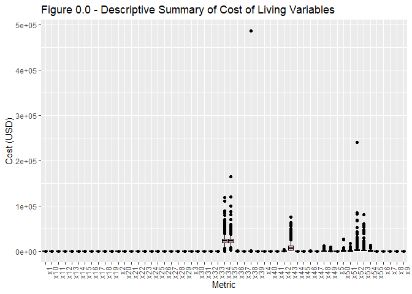
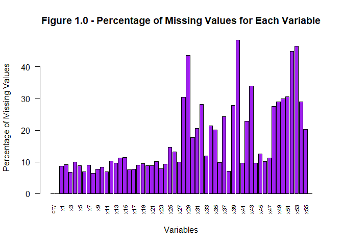
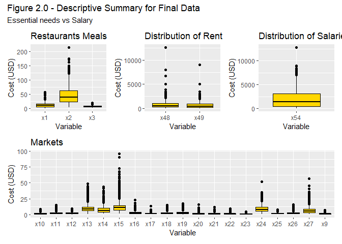

Cost of Living - EDA
================
Jade Meneghini
February 2024

In this analysis, the costs of living worldwide is explored. The data
has been scraped from [Numbeo](https://www.numbeo.com/) and can be found
on
[Kaggle](https://www.kaggle.com/datasets/mvieira101/global-cost-of-living/data?select=cost-of-living_v2.csv).
The primary goal of this analysis is to gain familiarity and identify
issues with the data provided that could impact analysis.

``` r
#Select the local working directory
proj_directory <- "C:/Users/jadem/OneDrive/Desktop/BABD/Statistics/PersoProject/Statistics_Project/Code"
setwd(proj_directory)

#load packages
library(tidyverse)
```

    ## Warning: package 'ggplot2' was built under R version 4.3.3

    ## ── Attaching core tidyverse packages ──────────────────────── tidyverse 2.0.0 ──
    ## ✔ dplyr     1.1.4     ✔ readr     2.1.5
    ## ✔ forcats   1.0.0     ✔ stringr   1.5.1
    ## ✔ ggplot2   3.5.0     ✔ tibble    3.2.1
    ## ✔ lubridate 1.9.3     ✔ tidyr     1.3.1
    ## ✔ purrr     1.0.2     
    ## ── Conflicts ────────────────────────────────────────── tidyverse_conflicts() ──
    ## ✖ dplyr::filter() masks stats::filter()
    ## ✖ dplyr::lag()    masks stats::lag()
    ## ℹ Use the conflicted package (<http://conflicted.r-lib.org/>) to force all conflicts to become errors

``` r
library(dplyr)
library(ggplot2)
library(knitr)
```

#### Load Data:

``` r
#Import data from local .csv
col_data <- read.csv("C:/Users/jadem/OneDrive/Desktop/BABD/Statistics/PersoProject/Statistics_Project/Data/cost-of-living_v2.csv")
```

# Exploratory data analysis

## Summary

Let’s look at what the data set looks like:

``` r
str(col_data)
```

    ## 'data.frame':    4956 obs. of  58 variables:
    ##  $ city        : chr  "Weifang" "Heze" "Yantai" "Huanggang" ...
    ##  $ country     : chr  "China" "China" "China" "China" ...
    ##  $ x1          : num  2.85 NaN 2.85 NaN 2.14 2.85 2.35 NaN 2.85 2.99 ...
    ##  $ x2          : num  14.2 NaN 22.8 NaN 14.1 ...
    ##  $ x3          : num  5.34 4.98 4.98 NaN 3.91 4.27 4.48 5.12 4.98 4.7 ...
    ##  $ x4          : num  1.14 NaN 1.14 NaN 1.42 0.85 NaN NaN 0.71 0.85 ...
    ##  $ x5          : num  2.14 NaN 2.14 NaN 4.98 2.85 2.85 NaN NaN 2.14 ...
    ##  $ x6          : num  3.46 4.27 3.56 NaN 3.56 3.56 4.02 2.28 4.27 3.08 ...
    ##  $ x7          : num  0.71 0.5 0.45 NaN 0.43 0.36 0.65 0.45 0.69 0.43 ...
    ##  $ x8          : num  0.28 0.25 0.28 NaN 0.28 0.27 0.3 0.28 0.28 0.28 ...
    ##  $ x9          : num  1.78 1.78 1.78 NaN 2.46 1.83 1.57 1.35 1.42 2.04 ...
    ##  $ x10         : num  1.07 2.53 1.19 NaN 1.71 1.36 1.67 NaN 1 1.16 ...
    ##  $ x11         : num  1 1.82 0.78 NaN 0.71 0.71 1.28 0.43 0.71 0.82 ...
    ##  $ x12         : num  NaN 0.85 NaN NaN 2.73 1.37 1.34 2.9 NaN 1.37 ...
    ##  $ x13         : num  8.54 11.39 8.54 NaN NaN ...
    ##  $ x14         : num  3.13 3.13 3.46 NaN 3.56 3.63 5.79 NaN NaN 4.19 ...
    ##  $ x15         : num  8.54 22.78 15.66 NaN 15.66 ...
    ##  $ x16         : num  1.14 2.28 1.92 NaN 0.85 1.14 2.28 NaN 1.14 1.29 ...
    ##  $ x17         : num  NaN NaN NaN NaN 0.96 1.14 0.71 NaN NaN 1.61 ...
    ##  $ x18         : num  1.14 NaN 1.78 NaN 1.42 1 2.18 NaN 1.42 1.37 ...
    ##  $ x19         : num  0.85 NaN 1.35 NaN 1.14 0.71 1.14 NaN 0.57 1.27 ...
    ##  $ x20         : num  0.71 1.99 1.19 NaN 0.71 0.57 0.5 NaN 0.43 0.66 ...
    ##  $ x21         : num  0.57 NaN 0.71 NaN 0.28 0.71 1.42 NaN 0.57 0.54 ...
    ##  $ x22         : num  0.43 1.42 0.5 NaN 0.71 0.47 0.81 NaN NaN 0.45 ...
    ##  $ x23         : num  0.57 0.85 0.57 NaN 0.43 0.43 0.59 NaN 0.28 0.55 ...
    ##  $ x24         : num  5.69 10.68 5.69 NaN NaN ...
    ##  $ x25         : num  0.71 1.14 0.8 NaN 0.62 0.74 1.14 0.71 1.42 0.65 ...
    ##  $ x26         : num  1.85 2.56 1.85 NaN 0.71 2.04 1.42 NaN 2.14 1.71 ...
    ##  $ x27         : num  2.85 2.85 3.84 NaN 4.27 3.56 3.27 2.14 2.85 2.28 ...
    ##  $ x28         : num  NaN NaN NaN NaN NaN 0.28 NaN NaN NaN NaN ...
    ##  $ x29         : num  NaN NaN NaN NaN NaN 8.67 NaN NaN NaN NaN ...
    ##  $ x30         : num  NaN NaN NaN NaN 2.85 0.85 1.64 NaN NaN 1.42 ...
    ##  $ x31         : num  0.23 0.57 0.28 NaN 0.28 0.36 0.36 0.28 0.28 0.28 ...
    ##  $ x32         : num  4.56 NaN 2.85 NaN 2.56 2.73 7.12 3.42 NaN 4.27 ...
    ##  $ x33         : num  1.16 NaN 1.16 NaN 1.16 1.19 1.3 NaN NaN 1.16 ...
    ##  $ x34         : num  20286 NaN 20286 NaN 21182 ...
    ##  $ x35         : num  16727 NaN 16727 NaN 16769 ...
    ##  $ x36         : num  45.8 92.5 45.8 NaN 31.8 ...
    ##  $ x37         : num  0.03 NaN 0.04 NaN 0.01 0.02 0.01 NaN NaN 0.02 ...
    ##  $ x38         : num  6.41 14.24 14.24 NaN 6.41 ...
    ##  $ x39         : num  NaN NaN NaN 54.1 NaN ...
    ##  $ x40         : num  NaN NaN NaN NaN NaN ...
    ##  $ x41         : num  5.69 4.98 6.83 NaN 5.55 4.98 5.69 4.98 5.69 7.12 ...
    ##  $ x42         : num  NaN NaN NaN NaN 1851 ...
    ##  $ x43         : num  24200 NaN 24200 NaN 28471 ...
    ##  $ x44         : num  41 71.2 78.3 NaN 56.9 ...
    ##  $ x45         : num  37.7 NaN 37.7 NaN 32 ...
    ##  $ x46         : num  78.3 74.7 78.3 NaN 128.1 ...
    ##  $ x47         : num  85.4 NaN 85.4 NaN 64.1 ...
    ##  $ x48         : num  NaN NaN NaN NaN 142 ...
    ##  $ x49         : num  NaN NaN NaN NaN 71.2 ...
    ##  $ x50         : num  NaN NaN NaN NaN 285 ...
    ##  $ x51         : num  NaN NaN NaN NaN 214 ...
    ##  $ x52         : num  NaN NaN NaN NaN NaN NaN NaN NaN NaN NaN ...
    ##  $ x53         : num  NaN NaN NaN NaN NaN NaN NaN NaN NaN NaN ...
    ##  $ x54         : num  NaN NaN NaN NaN NaN NaN NaN NaN NaN NaN ...
    ##  $ x55         : num  4.5 NaN 4.5 NaN 4.65 5.33 4.18 NaN NaN 5 ...
    ##  $ data_quality: int  0 0 0 0 0 0 0 0 0 0 ...

We already see that there are some missing data and that the majority of
our variables are numerical (expected as most variables refer to the
cost of a good or service in USD).

``` r
dim(col_data)
```

    ## [1] 4956   58

``` r
length(unique(col_data$country))
```

    ## [1] 215

With this we can see that the raw data has 4956 rows (observations) and
58 columns (variables). The observations correspond to 215 distinct
countries.

Let’s look at the columns descriptive summary now:

``` r
summary(col_data)
```

    ##      city             country                x1              x2        
    ##  Length:4956        Length:4956        Min.   : 0.45   Min.   :  3.25  
    ##  Class :character   Class :character   1st Qu.: 4.31   1st Qu.: 22.44  
    ##  Mode  :character   Mode  :character   Median : 9.60   Median : 40.00  
    ##                                        Mean   :10.35   Mean   : 43.36  
    ##                                        3rd Qu.:15.00   3rd Qu.: 60.00  
    ##                                        Max.   :57.14   Max.   :213.69  
    ##                                        NA's   :428     NA's   :451     
    ##        x3              x4              x5               x6        
    ##  Min.   : 1.08   Min.   : 0.33   Min.   : 0.310   Min.   : 0.220  
    ##  1st Qu.: 4.98   1st Qu.: 1.60   1st Qu.: 2.200   1st Qu.: 1.580  
    ##  Median : 6.99   Median : 3.00   Median : 3.690   Median : 2.630  
    ##  Mean   : 6.93   Mean   : 3.38   Mean   : 3.942   Mean   : 2.755  
    ##  3rd Qu.: 8.50   3rd Qu.: 5.00   3rd Qu.: 5.270   3rd Qu.: 3.770  
    ##  Max.   :22.13   Max.   :20.60   Max.   :17.500   Max.   :10.000  
    ##  NA's   :334     NA's   :496     NA's   :440      NA's   :344     
    ##        x7              x8             x9             x10       
    ##  Min.   :0.110   Min.   :0.07   Min.   :0.260   Min.   :0.050  
    ##  1st Qu.:0.770   1st Qu.:0.48   1st Qu.:0.830   1st Qu.:0.780  
    ##  Median :1.480   Median :1.05   Median :1.045   Median :1.320  
    ##  Mean   :1.524   Mean   :1.12   Mean   :1.149   Mean   :1.613  
    ##  3rd Qu.:2.110   3rd Qu.:1.58   3rd Qu.:1.320   3rd Qu.:2.200  
    ##  Max.   :8.000   Max.   :5.85   Max.   :6.810   Max.   :8.820  
    ##  NA's   :445     NA's   :316    NA's   :378     NA's   :413    
    ##       x11              x12             x13              x14        
    ##  Min.   : 0.250   Min.   :0.100   Min.   : 0.900   Min.   : 1.220  
    ##  1st Qu.: 1.050   1st Qu.:1.570   1st Qu.: 6.150   1st Qu.: 4.013  
    ##  Median : 1.690   Median :2.140   Median : 8.800   Median : 6.140  
    ##  Mean   : 2.187   Mean   :2.353   Mean   : 9.498   Mean   : 7.170  
    ##  3rd Qu.: 2.740   3rd Qu.:2.970   3rd Qu.:11.838   3rd Qu.: 9.210  
    ##  Max.   :15.430   Max.   :9.760   Max.   :48.950   Max.   :44.090  
    ##  NA's   :343      NA's   :507     NA's   :478      NA's   :558     
    ##       x15             x16              x17              x18        
    ##  Min.   : 1.47   Min.   : 0.270   Min.   : 0.220   Min.   : 0.200  
    ##  1st Qu.: 7.24   1st Qu.: 1.460   1st Qu.: 1.100   1st Qu.: 1.210  
    ##  Median :10.25   Median : 2.270   Median : 1.420   Median : 1.890  
    ##  Mean   :11.72   Mean   : 2.749   Mean   : 1.555   Mean   : 2.362  
    ##  3rd Qu.:14.31   3rd Qu.: 3.590   3rd Qu.: 1.820   3rd Qu.: 3.060  
    ##  Max.   :96.16   Max.   :22.740   Max.   :20.390   Max.   :15.360  
    ##  NA's   :566     NA's   :372      NA's   :381      NA's   :441     
    ##       x19             x20              x21              x22       
    ##  Min.   : 0.12   Min.   : 0.110   Min.   : 0.110   Min.   :0.080  
    ##  1st Qu.: 1.19   1st Qu.: 0.740   1st Qu.: 0.740   1st Qu.:0.710  
    ##  Median : 2.14   Median : 1.210   Median : 1.170   Median :1.050  
    ##  Mean   : 2.56   Mean   : 1.566   Mean   : 1.522   Mean   :1.227  
    ##  3rd Qu.: 3.57   3rd Qu.: 2.100   3rd Qu.: 2.110   3rd Qu.:1.630  
    ##  Max.   :17.64   Max.   :15.870   Max.   :12.220   Max.   :9.250  
    ##  NA's   :469     NA's   :437      NA's   :433      NA's   :501    
    ##       x23              x24              x25             x26        
    ##  Min.   :0.1100   Min.   : 0.360   Min.   :0.250   Min.   : 0.360  
    ##  1st Qu.:0.4900   1st Qu.: 5.270   1st Qu.:0.990   1st Qu.: 1.490  
    ##  Median :0.7600   Median : 7.805   Median :1.430   Median : 2.110  
    ##  Mean   :0.9868   Mean   : 8.643   Mean   :1.658   Mean   : 2.311  
    ##  3rd Qu.:1.3900   3rd Qu.:11.440   3rd Qu.:2.140   3rd Qu.: 2.870  
    ##  Max.   :5.0000   Max.   :51.950   Max.   :7.670   Max.   :15.670  
    ##  NA's   :388      NA's   :462      NA's   :721     NA's   :655     
    ##       x27              x28              x29              x30        
    ##  Min.   : 0.450   Min.   : 0.000   Min.   :  0.00   Min.   : 0.140  
    ##  1st Qu.: 3.050   1st Qu.: 0.480   1st Qu.: 18.03   1st Qu.: 1.080  
    ##  Median : 5.270   Median : 1.160   Median : 35.00   Median : 2.500  
    ##  Mean   : 6.285   Mean   : 1.517   Mean   : 43.98   Mean   : 2.765  
    ##  3rd Qu.: 8.430   3rd Qu.: 2.208   3rd Qu.: 60.52   3rd Qu.: 3.690  
    ##  Max.   :57.140   Max.   :13.000   Max.   :369.86   Max.   :50.000  
    ##  NA's   :490      NA's   :1506     NA's   :2166     NA's   :873     
    ##       x31             x32              x33             x34        
    ##  Min.   :0.090   Min.   :  0.16   Min.   :0.030   Min.   :     0  
    ##  1st Qu.:0.530   1st Qu.:  4.79   1st Qu.:1.080   1st Qu.: 18596  
    ##  Median :1.130   Median : 12.64   Median :1.280   Median : 22921  
    ##  Mean   :1.232   Mean   : 17.18   Mean   :1.362   Mean   : 23781  
    ##  3rd Qu.:1.710   3rd Qu.: 25.58   3rd Qu.:1.710   3rd Qu.: 26821  
    ##  Max.   :5.990   Max.   :160.64   Max.   :3.700   Max.   :118751  
    ##  NA's   :1022    NA's   :1396     NA's   :588     NA's   :1058    
    ##       x35              x36               x37             x38          
    ##  Min.   :  3213   Min.   :   6.07   Min.   :0.000   Min.   :     1.4  
    ##  1st Qu.: 19366   1st Qu.:  68.78   1st Qu.:0.050   1st Qu.:    18.8  
    ##  Median : 22538   Median : 128.09   Median :0.100   Median :    34.4  
    ##  Mean   : 23878   Mean   : 136.25   Mean   :0.136   Mean   :   146.3  
    ##  3rd Qu.: 26944   3rd Qu.: 185.00   3rd Qu.:0.190   3rd Qu.:    58.0  
    ##  Max.   :164540   Max.   :1066.67   Max.   :1.230   Max.   :485991.8  
    ##  NA's   :995      NA's   :488       NA's   :1201    NA's   :349       
    ##       x39              x40              x41              x42         
    ##  Min.   :  0.00   Min.   :  0.00   Min.   : 0.680   Min.   :   4.07  
    ##  1st Qu.: 22.54   1st Qu.:  8.00   1st Qu.: 4.810   1st Qu.: 136.62  
    ##  Median : 33.18   Median : 13.55   Median : 8.190   Median : 302.95  
    ##  Mean   : 36.85   Mean   : 15.78   Mean   : 8.366   Mean   : 489.58  
    ##  3rd Qu.: 45.00   3rd Qu.: 21.07   3rd Qu.:11.740   3rd Qu.: 676.01  
    ##  Max.   :553.22   Max.   :104.42   Max.   :39.910   Max.   :4250.00  
    ##  NA's   :1375     NA's   :2400     NA's   :475      NA's   :1132     
    ##       x43             x44              x45              x46        
    ##  Min.   :    0   Min.   :  4.07   Min.   :  0.00   Min.   :  8.03  
    ##  1st Qu.: 3161   1st Qu.: 35.00   1st Qu.: 26.34   1st Qu.: 61.90  
    ##  Median : 6325   Median : 48.04   Median : 33.13   Median : 75.00  
    ##  Mean   : 8771   Mean   : 52.62   Mean   : 35.04   Mean   : 77.00  
    ##  3rd Qu.:12000   3rd Qu.: 68.49   3rd Qu.: 41.51   3rd Qu.: 88.67  
    ##  Max.   :75000   Max.   :192.00   Max.   :219.38   Max.   :923.12  
    ##  NA's   :1681    NA's   :479      NA's   :617      NA's   :503     
    ##       x47              x48               x49              x50          
    ##  Min.   :  7.60   Min.   :   21.7   Min.   :  12.2   Min.   :   61.51  
    ##  1st Qu.: 58.43   1st Qu.:  256.2   1st Qu.: 171.1   1st Qu.:  465.20  
    ##  Median : 84.26   Median :  526.9   Median : 403.9   Median :  921.08  
    ##  Mean   : 85.98   Mean   :  711.6   Mean   : 560.2   Mean   : 1253.98  
    ##  3rd Qu.:106.77   3rd Qu.:  992.6   3rd Qu.: 790.3   3rd Qu.: 1710.22  
    ##  Max.   :542.74   Max.   :12608.8   Max.   :8989.4   Max.   :27397.38  
    ##  NA's   :553      NA's   :1363      NA's   :1431     NA's   :1480      
    ##       x51                x52              x53                x54       
    ##  Min.   :   27.12   Min.   :   111   Min.   :   49.24   Min.   :   18  
    ##  1st Qu.:  325.71   1st Qu.:  1120   1st Qu.:  790.31   1st Qu.:  479  
    ##  Median :  712.83   Median :  2107   Median : 1580.62   Median : 1291  
    ##  Mean   :  974.08   Mean   :  3235   Mean   : 2341.93   Mean   : 1821  
    ##  3rd Qu.: 1369.87   3rd Qu.:  3843   3rd Qu.: 2798.25   3rd Qu.: 2771  
    ##  Max.   :17868.18   Max.   :240964   Max.   :80321.22   Max.   :12821  
    ##  NA's   :1512       NA's   :2227     NA's   :2303       NA's   :1432   
    ##       x55          data_quality   
    ##  Min.   : 0.780   Min.   :0.0000  
    ##  1st Qu.: 3.000   1st Qu.:0.0000  
    ##  Median : 5.200   Median :0.0000  
    ##  Mean   : 6.518   Mean   :0.1862  
    ##  3rd Qu.: 8.330   3rd Qu.:0.0000  
    ##  Max.   :61.330   Max.   :1.0000  
    ##  NA's   :1006

As it stands it is hard to understand the meaning of these variables, so
let’s visualize it using a boxplot:

    ## Warning: Removed 45858 rows containing non-finite outside the scale range
    ## (`stat_boxplot()`).

<!-- -->

From Figure 0.0 we can tell that some variables have considerably
different cost ranges, particularly variables x35, x38 and x52. We also
have a warning message about non-finite values. Lastly it is hard to
understand the different cost ranges as we have little to no insight on
the meaning of each variable.

## Index table

Let’s create an index table explaining the meaning of each variable
label:

| column_name  | description                                                                              |
|:-------------|:-----------------------------------------------------------------------------------------|
| city         | Name of the city                                                                         |
| country      | Name of the country                                                                      |
| x1           | Meal, Inexpensive Restaurant                                                             |
| x2           | Meal for 2 People, Mid-range Restaurant, Three-course                                    |
| x3           | McMeal at McDonalds                                                                      |
| x4           | Domestic Beer (0.5 l draught, in restaurants)                                            |
| x5           | Imported Beer (0.33 l, in restaurants)                                                   |
| x6           | Cappuccino (regular, in restaurants)                                                     |
| x7           | Coke/Pepsi (0.33 l, in restaurants)                                                      |
| x8           | Water (0.33 l, in restaurants)                                                           |
| x9           | Milk (1l)                                                                                |
| x10          | Loaf of Fresh White Bread (500g)                                                         |
| x11          | Rice (white), (1kg)                                                                      |
| x12          | Eggs (12)                                                                                |
| x13          | Local Cheese (1kg)                                                                       |
| x14          | Chicken Fillets (1kg)                                                                    |
| x15          | Beef Round (1kg)                                                                         |
| x16          | Apples (1kg)                                                                             |
| x17          | Banana (1kg)                                                                             |
| x18          | Oranges (1kg)                                                                            |
| x19          | Tomato (1kg)                                                                             |
| x20          | Potato (1kg)                                                                             |
| x21          | Onion (1kg)                                                                              |
| x22          | Lettuce (1 head)                                                                         |
| x23          | Water (1.5 l, at the market)                                                             |
| x24          | Bottle of Wine (Mid-Range, at the market)                                                |
| x25          | Domestic Beer (0.5 l, at the market)                                                     |
| x26          | Imported Beer (0.33 l, at the market)                                                    |
| x27          | Cigarettes 20 Pack (Marlboro)                                                            |
| x28          | One-way Ticket (Local Transport)                                                         |
| x29          | Monthly Pass (Regular Price)                                                             |
| x30          | Taxi Start (Normal Tariff)                                                               |
| x31          | Taxi 1km (Normal Tariff)                                                                 |
| x32          | Taxi 1hour Waiting (Normal Tariff)                                                       |
| x33          | Gasoline (1 l)                                                                           |
| x34          | Volkswagen Golf 1.4 90 KW Trendline                                                      |
| x35          | Toyota Corolla Sedan 1.6l 97kW Comfort                                                   |
| x36          | Basic (Electricity, Heating, Cooling, Water, Garbage) for 85m2 Apartment                 |
| x37          | 1 min. of Prepaid Mobile Tariff Local                                                    |
| x38          | Internet (60 Mbps or More, Unlimited Data, Cable/ADSL)                                   |
| x39          | Fitness Club, Monthly Fee for 1 Adult                                                    |
| x40          | Tennis Court Rent (1 Hour on Weekend)                                                    |
| x41          | Cinema, International Release, 1 Seat                                                    |
| x42          | Preschool, Full Day, Private, Monthly for 1 Child                                        |
| x43          | International Primary School, Yearly for 1 Child                                         |
| x44          | 1 Pair of Jeans                                                                          |
| x45          | 1 Summer Dress in a Chain Store (Zara, H&M, ecc)                                         |
| x46          | 1 Pair of Nike Running Shoes                                                             |
| x47          | 1 Pair of Men Leather Business Shoes                                                     |
| x48          | Apartment (1 bedroom) in City Centre                                                     |
| x49          | Apartment (1 bedroom) Outside of Centre                                                  |
| x50          | Apartment (3 bedrooms) in City Centre                                                    |
| x51          | Apartment (3 bedrooms) Outside of Centre                                                 |
| x52          | Price per Square Meter to Buy Apartment in City Centre                                   |
| x53          | Price per Square Meter to Buy Apartment Outside of Centre                                |
| x54          | Average Monthly Net Salary (After Tax)                                                   |
| x55          | Mortgage Interest Rate in Percentages (%), Yearly, for 20 Years Fixed-Rate               |
| data_quality | 0 if Numbeo considers that more contributors are needed to increase data quality, else 1 |

## Missing Values

``` r
sum(is.na(col_data))
```

    ## [1] 45858

We can see that there are 45858 missing values to manage. From our index
table we also know that each observation is assigned a data quality
score (0 data values are missing, 1 no values are missing). Before
taking any decision about how we’ll manage the missing values, let’s
look into the percentage of missing data variable by variable:

``` r
AAA <- colSums(is.na(col_data))
tot <- nrow(col_data)
percent_AAA <- (AAA / tot) * 100
```

<!-- -->

Knowing that imputation is discouraged for variables with missing data,
let’s fix the threshold for “too much data missing” at +30% of data
missing:

- x28 =\> 30% One-way Ticket (Local Transport)
- x29 =\> 44% Monthly Pass (Transport)
- x40 =\> 48% Tennis Court Rent
- x43 =\> 33% International Primary School, Yearly for 1 Child
- x51 =\> 30% Apartment (3 bedrooms) Outside of Centre
- x52 =\> 44% Price per Square Meter to Buy Apartment in City Centre
- x53 =\> 46% Price per Square Meter to Buy Apartment Outside of Centre

If removing the above values, variable x50 (29.8%) Apartment (3
bedrooms) in City Centre has no longer meaning.

## Data Imputation

To solve the missing data issue, we opted with imputation with the mean.
To reduce the bias, instead of imputing with the variable overall mean,
the individual country mean was used.

``` r
col_imputed_country <- col_data
col_imputed_country <- col_imputed_country %>%
  group_by(country) %>%
  mutate(across(where(is.numeric), ~ifelse(is.na(.), mean(., na.rm = TRUE), .)))
```

Now drop the rows with remaining missing values and variables with over
30% of missing values.

We can attribute the missing rows to smaller cities for which there
wasn’t enough data collected. Equally some countries such as Greenland
or city states might simply lack relevant information for certain
variables resulting in missing values.

``` r
col_imputed_na <- na.omit(col_imputed_country)
data <- select(col_imputed_na, -x28, -x29, -x40, -x43, -x50, -x51, -x52, -x53)

save(data, file = "data.RData") #saving cleaned data for future analysis

data10 <- subset(data[1:10,])
kable(data10)
```

| city      | country |       x1 |       x2 |       x3 |       x4 |       x5 |     x6 |        x7 |        x8 |       x9 |      x10 |       x11 |      x12 |     x13 |      x14 |      x15 |      x16 |      x17 |      x18 |      x19 |       x20 |       x21 |      x22 |       x23 |      x24 |    x25 |      x26 |      x27 |      x30 |       x31 |      x32 |      x33 |      x34 |      x35 |      x36 |       x37 |      x38 |      x39 |    x41 |       x42 |      x44 |      x45 |     x46 |       x47 |      x48 |      x49 |      x54 |      x55 | data_quality |
|:----------|:--------|---------:|---------:|---------:|---------:|---------:|-------:|----------:|----------:|---------:|---------:|----------:|---------:|--------:|---------:|---------:|---------:|---------:|---------:|---------:|----------:|----------:|---------:|----------:|---------:|-------:|---------:|---------:|---------:|----------:|---------:|---------:|---------:|---------:|---------:|----------:|---------:|---------:|-------:|----------:|---------:|---------:|--------:|----------:|---------:|---------:|---------:|---------:|-------------:|
| Weifang   | China   | 2.850000 | 14.24000 | 5.340000 | 1.140000 | 2.140000 | 3.4600 | 0.7100000 | 0.2800000 | 1.780000 | 1.070000 | 1.0000000 | 1.682988 |  8.5400 | 3.130000 |  8.54000 | 1.140000 | 1.289024 | 1.140000 | 0.850000 | 0.7100000 | 0.5700000 | 0.430000 | 0.5700000 |  5.69000 | 0.7100 | 1.850000 | 2.850000 | 1.390823 | 0.2300000 | 4.560000 | 1.160000 | 20285.56 | 16726.69 | 45.79000 | 0.0300000 |  6.41000 | 39.53918 | 5.6900 |  454.1494 | 41.00000 | 37.72000 |  78.300 |  85.41000 | 356.6212 | 232.0374 | 834.2239 | 4.500000 |            0 |
| Heze      | China   | 3.345165 | 20.85283 | 4.980000 | 1.156163 | 2.517791 | 4.2700 | 0.5000000 | 0.2500000 | 1.780000 | 2.530000 | 1.8200000 | 0.850000 | 11.3900 | 3.130000 | 22.78000 | 2.280000 | 1.289024 | 1.554536 | 1.143684 | 1.9900000 | 0.8481915 | 1.420000 | 0.8500000 | 10.68000 | 1.1400 | 2.560000 | 2.850000 | 1.390823 | 0.5700000 | 5.128902 | 1.188025 | 20303.44 | 19066.07 | 92.53000 | 0.0249438 | 14.24000 | 39.53918 | 4.9800 |  454.1494 | 71.18000 | 32.55311 |  74.740 |  81.13534 | 356.6212 | 232.0374 | 834.2239 | 4.997386 |            0 |
| Yantai    | China   | 2.850000 | 22.78000 | 4.980000 | 1.140000 | 2.140000 | 3.5600 | 0.4500000 | 0.2800000 | 1.780000 | 1.190000 | 0.7800000 | 1.682988 |  8.5400 | 3.460000 | 15.66000 | 1.920000 | 1.289024 | 1.780000 | 1.350000 | 1.1900000 | 0.7100000 | 0.500000 | 0.5700000 |  5.69000 | 0.8000 | 1.850000 | 3.840000 | 1.390823 | 0.2800000 | 2.850000 | 1.160000 | 20285.56 | 16726.69 | 45.79000 | 0.0400000 | 14.24000 | 39.53918 | 6.8300 |  454.1494 | 78.30000 | 37.72000 |  78.300 |  85.41000 | 356.6212 | 232.0374 | 834.2239 | 4.500000 |            0 |
| Huanggang | China   | 3.345165 | 20.85283 | 5.009208 | 1.156163 | 2.517791 | 3.3178 | 0.4663366 | 0.2904082 | 1.852929 | 1.567263 | 0.9160204 | 1.682988 | 12.5322 | 3.772526 | 11.50563 | 1.703535 | 1.289024 | 1.554536 | 1.143684 | 0.7727551 | 0.8481915 | 0.619375 | 0.6367677 | 11.71702 | 0.7682 | 1.909375 | 3.082043 | 1.390823 | 0.3212245 | 5.128902 | 1.188025 | 20303.44 | 19066.07 | 52.49579 | 0.0249438 | 12.00381 | 54.09000 | 5.9748 |  454.1494 | 53.20411 | 32.55311 |  81.602 |  81.13534 | 356.6212 | 232.0374 | 834.2239 | 4.997386 |            0 |
| Maoming   | China   | 2.140000 | 14.09000 | 3.910000 | 1.420000 | 4.980000 | 3.5600 | 0.4300000 | 0.2800000 | 2.460000 | 1.710000 | 0.7100000 | 2.730000 | 12.5322 | 3.560000 | 15.66000 | 0.850000 | 0.960000 | 1.420000 | 1.140000 | 0.7100000 | 0.2800000 | 0.710000 | 0.4300000 | 11.71702 | 0.6200 | 0.710000 | 4.270000 | 2.850000 | 0.2800000 | 2.560000 | 1.160000 | 21182.40 | 16769.40 | 31.79000 | 0.0100000 |  6.41000 | 39.53918 | 5.5500 | 1850.6100 | 56.94000 | 32.03000 | 128.120 |  64.06000 | 142.3500 |  71.1800 | 834.2239 | 4.650000 |            0 |
| Nanchong  | China   | 2.850000 | 17.08000 | 4.270000 | 0.850000 | 2.850000 | 3.5600 | 0.3600000 | 0.2700000 | 1.830000 | 1.360000 | 0.7100000 | 1.370000 |  9.7300 | 3.630000 | 11.39000 | 1.140000 | 1.140000 | 1.000000 | 0.710000 | 0.5700000 | 0.7100000 | 0.470000 | 0.4300000 |  4.98000 | 0.7400 | 2.040000 | 3.560000 | 0.850000 | 0.3600000 | 2.730000 | 1.190000 | 21182.40 | 17054.11 | 45.92000 | 0.0200000 |  7.12000 | 56.94000 | 4.9800 |  355.8900 | 31.67000 | 23.23000 |  73.500 |  55.52000 | 356.6212 | 232.0374 | 834.2239 | 5.330000 |            0 |
| Yulin     | China   | 2.350000 | 21.35000 | 4.480000 | 1.156163 | 2.850000 | 4.0200 | 0.6500000 | 0.3000000 | 1.570000 | 1.670000 | 1.2800000 | 1.340000 |  9.9600 | 5.790000 | 13.29000 | 2.280000 | 0.710000 | 2.180000 | 1.140000 | 0.5000000 | 1.4200000 | 0.810000 | 0.5900000 | 11.39000 | 1.1400 | 1.420000 | 3.270000 | 1.640000 | 0.3600000 | 7.120000 | 1.300000 | 25623.87 | 22065.00 | 39.99000 | 0.0100000 |  9.49000 | 39.53918 | 5.6900 |  284.7100 | 61.69000 | 40.33000 |  90.720 | 132.86000 | 356.6212 | 232.0374 | 834.2239 | 4.180000 |            0 |
| Liaocheng | China   | 3.345165 | 20.85283 | 5.120000 | 1.156163 | 2.517791 | 2.2800 | 0.4500000 | 0.2800000 | 1.350000 | 1.567263 | 0.4300000 | 2.900000 | 12.5322 | 3.772526 | 13.52000 | 1.703535 | 1.289024 | 1.554536 | 1.143684 | 0.7727551 | 0.8481915 | 0.619375 | 0.6367677 | 11.71702 | 0.7100 | 1.909375 | 2.140000 | 1.390823 | 0.2800000 | 3.420000 | 1.188025 | 14591.37 | 19066.07 | 52.49579 | 0.0249438 | 12.00381 | 39.53918 | 4.9800 |  454.1494 | 53.20411 | 32.55311 |  81.602 |  81.13534 | 356.6212 | 232.0374 | 834.2239 | 4.997386 |            0 |
| Xiangyang | China   | 2.850000 | 17.08000 | 4.980000 | 0.710000 | 2.517791 | 4.2700 | 0.6900000 | 0.2800000 | 1.420000 | 1.000000 | 0.7100000 | 1.682988 | 12.5322 | 3.772526 |  7.12000 | 1.140000 | 1.289024 | 1.420000 | 0.570000 | 0.4300000 | 0.5700000 | 0.619375 | 0.2800000 | 11.71702 | 1.4200 | 2.140000 | 2.850000 | 1.390823 | 0.2800000 | 5.128902 | 1.188025 | 20303.44 | 11388.39 | 71.18000 | 0.0249438 |  9.96000 | 23.73000 | 5.6900 |  454.1494 | 53.20411 | 32.55311 |  81.602 |  81.13534 | 356.6212 | 232.0374 | 834.2239 | 4.997386 |            0 |
| Dezhou    | China   | 2.990000 | 21.35000 | 4.700000 | 0.850000 | 2.140000 | 3.0800 | 0.4300000 | 0.2800000 | 2.040000 | 1.160000 | 0.8200000 | 1.370000 | 11.4500 | 4.190000 | 11.58000 | 1.290000 | 1.610000 | 1.370000 | 1.270000 | 0.6600000 | 0.5400000 | 0.450000 | 0.5500000 | 12.81000 | 0.6500 | 1.710000 | 2.280000 | 1.420000 | 0.2800000 | 4.270000 | 1.160000 | 17082.58 | 16513.16 | 34.17000 | 0.0200000 | 11.25000 | 39.53918 | 7.1200 |  222.0700 | 50.34000 | 30.87000 |  66.000 |  76.52000 | 356.6212 | 232.0374 | 834.2239 | 5.000000 |            0 |

Here we go - ‘data’ the final data set we will be working on. Let’s look
at how it compares with the raw data, ‘col_data’.

Missing values:

``` r
sum(is.na(data))
```

    ## [1] 0

No missing values.

``` r
dim(data)
```

    ## [1] 4849   50

The raw data has 4956 rows (observations) and 58 columns (variables). In
comparison ‘data’ has 4849 rows (107 lost) and 50 columns (8 lost).

``` r
length(unique(data$country))
```

    ## [1] 153

‘data’ has 152 distinct countries, 63 less countries than the raw data.

``` r
summary(data)
```

    ##      city             country                x1              x2        
    ##  Length:4849        Length:4849        Min.   : 0.45   Min.   :  3.25  
    ##  Class :character   Class :character   1st Qu.: 4.54   1st Qu.: 22.85  
    ##  Mode  :character   Mode  :character   Median :10.00   Median : 40.00  
    ##                                        Mean   :10.56   Mean   : 43.45  
    ##                                        3rd Qu.:15.56   3rd Qu.: 62.05  
    ##                                        Max.   :57.14   Max.   :213.69  
    ##        x3               x4               x5               x6        
    ##  Min.   : 1.080   Min.   : 0.330   Min.   : 0.310   Min.   : 0.220  
    ##  1st Qu.: 4.980   1st Qu.: 1.600   1st Qu.: 2.230   1st Qu.: 1.580  
    ##  Median : 6.870   Median : 3.070   Median : 3.680   Median : 2.630  
    ##  Mean   : 6.885   Mean   : 3.409   Mean   : 3.937   Mean   : 2.746  
    ##  3rd Qu.: 8.433   3rd Qu.: 5.000   3rd Qu.: 5.270   3rd Qu.: 3.760  
    ##  Max.   :19.230   Max.   :20.600   Max.   :17.500   Max.   :10.000  
    ##        x7              x8              x9             x10       
    ##  Min.   :0.110   Min.   :0.070   Min.   :0.320   Min.   :0.050  
    ##  1st Qu.:0.800   1st Qu.:0.480   1st Qu.:0.840   1st Qu.:0.810  
    ##  Median :1.500   Median :1.050   Median :1.030   Median :1.370  
    ##  Mean   :1.552   Mean   :1.119   Mean   :1.133   Mean   :1.656  
    ##  3rd Qu.:2.186   3rd Qu.:1.600   3rd Qu.:1.280   3rd Qu.:2.320  
    ##  Max.   :8.000   Max.   :5.340   Max.   :6.810   Max.   :8.820  
    ##       x11              x12             x13             x14        
    ##  Min.   : 0.250   Min.   :0.100   Min.   : 0.90   Min.   : 1.220  
    ##  1st Qu.: 1.070   1st Qu.:1.610   1st Qu.: 6.25   1st Qu.: 4.120  
    ##  Median : 1.700   Median :2.220   Median : 8.82   Median : 6.430  
    ##  Mean   : 2.199   Mean   :2.388   Mean   : 9.56   Mean   : 7.397  
    ##  3rd Qu.: 2.780   3rd Qu.:3.110   3rd Qu.:11.96   3rd Qu.: 9.900  
    ##  Max.   :15.430   Max.   :9.760   Max.   :48.95   Max.   :44.090  
    ##       x15              x16              x17              x18        
    ##  Min.   : 1.470   Min.   : 0.270   Min.   : 0.220   Min.   : 0.200  
    ##  1st Qu.: 7.387   1st Qu.: 1.480   1st Qu.: 1.100   1st Qu.: 1.224  
    ##  Median :10.740   Median : 2.280   Median : 1.420   Median : 1.895  
    ##  Mean   :11.887   Mean   : 2.744   Mean   : 1.549   Mean   : 2.374  
    ##  3rd Qu.:14.604   3rd Qu.: 3.620   3rd Qu.: 1.790   3rd Qu.: 3.100  
    ##  Max.   :96.160   Max.   :22.740   Max.   :13.780   Max.   :15.360  
    ##       x19              x20              x21              x22       
    ##  Min.   : 0.120   Min.   : 0.110   Min.   : 0.110   Min.   :0.080  
    ##  1st Qu.: 1.230   1st Qu.: 0.750   1st Qu.: 0.750   1st Qu.:0.710  
    ##  Median : 2.160   Median : 1.220   Median : 1.190   Median :1.050  
    ##  Mean   : 2.562   Mean   : 1.573   Mean   : 1.532   Mean   :1.218  
    ##  3rd Qu.: 3.630   3rd Qu.: 2.110   3rd Qu.: 2.150   3rd Qu.:1.640  
    ##  Max.   :17.640   Max.   :15.870   Max.   :12.220   Max.   :9.250  
    ##       x23             x24              x25             x26        
    ##  Min.   :0.110   Min.   : 0.360   Min.   :0.250   Min.   : 0.360  
    ##  1st Qu.:0.500   1st Qu.: 5.270   1st Qu.:1.020   1st Qu.: 1.530  
    ##  Median :0.760   Median : 7.832   Median :1.505   Median : 2.140  
    ##  Mean   :0.995   Mean   : 8.630   Mean   :1.710   Mean   : 2.341  
    ##  3rd Qu.:1.420   3rd Qu.:11.590   3rd Qu.:2.320   3rd Qu.: 3.000  
    ##  Max.   :5.000   Max.   :51.950   Max.   :7.670   Max.   :15.670  
    ##       x27              x30              x31             x32         
    ##  Min.   : 0.450   Min.   : 0.140   Min.   :0.090   Min.   :  0.160  
    ##  1st Qu.: 3.020   1st Qu.: 1.150   1st Qu.:0.570   1st Qu.:  4.999  
    ##  Median : 5.270   Median : 2.620   Median :1.230   Median : 15.000  
    ##  Mean   : 6.276   Mean   : 2.767   Mean   :1.254   Mean   : 17.733  
    ##  3rd Qu.: 8.436   3rd Qu.: 3.639   3rd Qu.:1.660   3rd Qu.: 27.726  
    ##  Max.   :57.140   Max.   :21.070   Max.   :5.340   Max.   :160.640  
    ##       x33             x34              x35              x36         
    ##  Min.   :0.030   Min.   :     0   Min.   :  3213   Min.   :   6.17  
    ##  1st Qu.:1.100   1st Qu.: 18800   1st Qu.: 19647   1st Qu.:  68.40  
    ##  Median :1.260   Median : 23195   Median : 23138   Median : 128.55  
    ##  Mean   :1.362   Mean   : 23892   Mean   : 23962   Mean   : 135.88  
    ##  3rd Qu.:1.710   3rd Qu.: 26344   3rd Qu.: 26344   3rd Qu.: 182.20  
    ##  Max.   :2.770   Max.   :118751   Max.   :164540   Max.   :1066.67  
    ##       x37               x38              x39              x41        
    ##  Min.   :0.00000   Min.   :  1.36   Min.   :  2.24   Min.   : 0.680  
    ##  1st Qu.:0.05943   1st Qu.: 18.82   1st Qu.: 24.26   1st Qu.: 4.800  
    ##  Median :0.12656   Median : 34.03   Median : 35.00   Median : 8.170  
    ##  Mean   :0.14032   Mean   : 40.33   Mean   : 36.64   Mean   : 8.339  
    ##  3rd Qu.:0.18250   3rd Qu.: 57.62   3rd Qu.: 42.71   3rd Qu.:11.854  
    ##  Max.   :1.12000   Max.   :568.99   Max.   :246.08   Max.   :39.910  
    ##       x42               x44              x45              x46        
    ##  Min.   :   4.07   Min.   :  4.07   Min.   :  4.29   Min.   : 12.20  
    ##  1st Qu.: 158.06   1st Qu.: 35.65   1st Qu.: 26.64   1st Qu.: 62.04  
    ##  Median : 337.21   Median : 48.00   Median : 33.78   Median : 75.52  
    ##  Mean   : 539.35   Mean   : 52.66   Mean   : 35.22   Mean   : 77.06  
    ##  3rd Qu.: 889.38   3rd Qu.: 68.56   3rd Qu.: 40.84   3rd Qu.: 87.48  
    ##  Max.   :4250.00   Max.   :192.00   Max.   :219.38   Max.   :923.12  
    ##       x47              x48               x49              x54         
    ##  Min.   :  7.60   Min.   :   21.7   Min.   :  12.2   Min.   :   18.0  
    ##  1st Qu.: 59.67   1st Qu.:  263.8   1st Qu.: 181.8   1st Qu.:  468.8  
    ##  Median : 84.30   Median :  550.0   Median : 429.9   Median : 1416.9  
    ##  Mean   : 86.02   Mean   :  722.6   Mean   : 579.0   Mean   : 1908.6  
    ##  3rd Qu.:106.67   3rd Qu.: 1056.1   3rd Qu.: 900.0   3rd Qu.: 3071.3  
    ##  Max.   :542.74   Max.   :12608.8   Max.   :8989.4   Max.   :12821.4  
    ##       x55          data_quality   
    ##  Min.   : 0.780   Min.   :0.0000  
    ##  1st Qu.: 3.133   1st Qu.:0.0000  
    ##  Median : 5.144   Median :0.0000  
    ##  Mean   : 6.566   Mean   :0.1891  
    ##  3rd Qu.: 8.330   3rd Qu.:0.0000  
    ##  Max.   :61.330   Max.   :1.0000

Compared to summary(col_data) the distribution and relationships are
impacted as they now pull more towards each country mean, however this
is to be expected due to the imputation that was done.

## Grouping Variables by Shared Topic

Now based on the variable meaning we are able to create a new data
frames that has the variables grouped by similar topics (note:
data_quality will be removed as no longer useful)

``` r
headers                <- data[,1:2]
meal                   <- data[,3:5]
restaurants            <- data[,6:10]
markets                <- data[,11:29]
transportation         <- data[,30:33]
car                    <- data[,34:35]
utilities              <- data[,36:38]
sports                 <- data[,39:40]
childcare              <- data[,41]
clothing               <- data[,42:45]
rent                   <- data[,46:47]
salaries               <- data[,48]
mortgage               <- data[,49]

meal_avg                   <- round(rowMeans(meal),digits=2)
restaurants_avg            <- round(rowMeans(restaurants), digits=2)
markets_avg                <- round(rowMeans(markets),digits=2)
transportation_avg         <- round(rowMeans(transportation),digits=2)
car_avg                    <- round(rowMeans(car),digits=2)
utilities_avg              <- round(rowMeans(utilities),digits=2)
sports_avg                 <- round(rowMeans(sports),digits=2)
childcare_avg              <- round(rowMeans(childcare),digits=2)
clothing_avg               <- round(rowMeans(clothing),digits=2)
rent_avg                   <- round(rowMeans(rent),digits=2)
salaries_avg               <- round(rowMeans(salaries),digits=2)
mortgage_avg               <- round(rowMeans(mortgage),digits=2)

final_data <- data.frame(
  Country         = headers
  ,Restaurants    = restaurants_avg
  ,Markets        = markets_avg
  ,Transports     = transportation_avg
  ,Car            = car_avg
  ,Utilities      = utilities_avg
  ,Entertainment  = sports_avg
  ,Childcare      = childcare_avg
  ,Clothing       = clothing_avg
  ,MonthlyRent    = rent_avg
  ,Salaries       = salaries_avg
  ,Mortgage       = mortgage_avg
)

save(final_data, file = "category_data.RData") #saving data with variables grouped by category for future analysis

final_data10 <- subset(final_data[1:10,])
kable(final_data10)
```

| Country.city | Country.country | Restaurants | Markets | Transports |      Car | Utilities | Entertainment | Childcare | Clothing | MonthlyRent | Salaries | Mortgage |
|:-------------|:----------------|------------:|--------:|-----------:|---------:|----------:|--------------:|----------:|---------:|------------:|---------:|---------:|
| Weifang      | China           |        1.55 |    2.29 |       1.84 | 18506.12 |     17.41 |         22.61 |    454.15 |    60.61 |      294.33 |   834.22 |     4.50 |
| Heze         | China           |        1.74 |    3.84 |       2.07 | 19684.76 |     35.60 |         22.26 |    454.15 |    64.90 |      294.33 |   834.22 |     5.00 |
| Yantai       | China           |        1.51 |    2.87 |       1.42 | 18506.12 |     20.02 |         23.18 |    454.15 |    69.93 |      294.33 |   834.22 |     4.50 |
| Huanggang    | China           |        1.55 |    3.15 |       2.01 | 19684.76 |     21.51 |         30.03 |    454.15 |    62.12 |      294.33 |   834.22 |     5.00 |
| Maoming      | China           |        2.13 |    3.33 |       1.71 | 18975.90 |     12.74 |         22.54 |   1850.61 |    70.29 |      106.76 |   834.22 |     4.65 |
| Nanchong     | China           |        1.58 |    2.50 |       1.28 | 19118.26 |     17.69 |         30.96 |    355.89 |    45.98 |      294.33 |   834.22 |     5.33 |
| Yulin        | China           |        1.80 |    3.25 |       2.60 | 23844.43 |     16.50 |         22.61 |    284.71 |    81.40 |      294.33 |   834.22 |     4.18 |
| Liaocheng    | China           |        1.34 |    3.22 |       1.57 | 16828.72 |     21.51 |         22.26 |    454.15 |    62.12 |      294.33 |   834.22 |     5.00 |
| Xiangyang    | China           |        1.69 |    2.77 |       2.00 | 15845.91 |     27.05 |         14.71 |    454.15 |    62.12 |      294.33 |   834.22 |     5.00 |
| Dezhou       | China           |        1.36 |    3.04 |       1.78 | 16797.87 |     15.15 |         23.33 |    222.07 |    55.93 |      294.33 |   834.22 |     5.00 |

Now let’s visualize the descriptive summary for each category as box
plots of ‘final_data’:

<!-- -->

### Analysis

There are significantly large outliers present in x2, x4, x15, x32, x35,
x36, x39, x46, x54

- x2 Meal for 2 People, Mid-range -\> Mendrisio, Switzerland USD 213.69
  -\> considering that this looks at mid-range restaurants the price can
  be accepted (despite it being on the higher end)

- x4 Domestic Beer (in restaurant) -\> Al Wakrah, Qatar USD 20.60 -\>
  cost of beer tends to be higher in countries whose majority of the
  population is Muslim due to scarcity and high avg cost of living

- x15 Beef Round (1kg) -\> top outliers are both cities from Switzerland

- x32 Taxi 1hour Waiting (Normal Tariff) -\> Niamay, Nigeria -\> False
  data \#x34, x35 New cars -\> outliers are both Iranian cities, the
  cost of owning a car compared to the rest of the cost of living
  doesn’t seem to match

- x39 Fitness Club -\> outliers are oultindish, not sure they can be
  relied on

- x46 Fitenss shoes -\> 900+USD for a pair of common running shoes seems
  outlandish for any country?

- x54 Average Monthly Net Salary (After Tax) -\> Schaan, Liechtenstein,
  the country is so small that for analysis purposes I think we can
  disregard this
